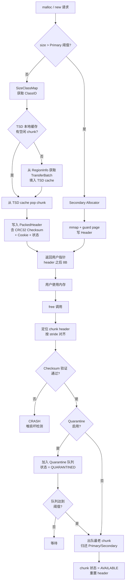

---
tags:
  - 内存管理
  - 堆分配器
  - tier3
  - scudo
  - android
---
# Scudo 分配器原理：Android 与 Fuchsia 的硬化堆

> [!abstract] TL;DR
> Scudo 是 LLVM compiler-rt 项目中的硬化堆分配器，自 Android 11 起取代 jemalloc 成为 Bionic libc 的默认分配器，同时也是 Fuchsia OS 的标准堆实现。它将「安全」置于首位：每个 chunk 携带校验和防篡改 header、释放后进入隔离队列（quarantine）防 use-after-free、随机 Cookie 抵御预测攻击，并与 ARM MTE 硬件内存标签深度集成。本章从架构到字节级布局逐层拆解 Scudo 的工作原理，并介绍如何在 Android native 逆向与安全分析中运用这些知识。

## 概述与定位

### Scudo 的诞生背景

在 Android 11（API level 30）发布之前，Android 的默认 C 运行时堆分配器是 jemalloc——一个面向多线程高吞吐量设计的分配器。jemalloc 在性能上表现优异，但它的设计目标是速度与低碎片化，而非内存安全。随着 Android 平台安全要求日益提升，Google 与 LLVM 社区合作，将 compiler-rt 项目中的 Scudo 分配器（Scudo Hardened Allocator）集成进 Bionic libc，并在 Android 11 中完成了这一替换。

Scudo 这个名字来源于意大利语中的"盾牌"（scudo），体现了其核心设计哲学：在不放弃合理性能的前提下，构建一道针对堆内存攻击的防御层。Fuchsia OS 从设计初期就选择 Scudo 作为唯一的堆分配器，这进一步验证了它在安全操作系统领域的地位。

从代码层面看，Scudo 位于 LLVM 源码树的 `compiler-rt/lib/scudo/standalone/` 路径下，称为 `scudo_standalone`，区别于更早的基于 Sanitizer 框架构建的原型版本。现代分析和逆向时遇到的都是 standalone 版本。

### 与同类分配器的定位对比

| 分配器 | 主要目标 | 安全硬化 | 使用场景 |
|--------|----------|----------|----------|
| ptmalloc2 | 通用，兼容 glibc | 有限（tcache safe-linking） | Linux 桌面/服务端 |
| jemalloc | 高吞吐，低碎片 | 较弱 | FreeBSD、Android 10- |
| tcmalloc | 线程缓存，高性能 | 较弱 | Google 内部、Chrome |
| mimalloc | 速度与安全兼顾 | 中等 | 微软开源项目 |
| **Scudo** | **安全优先** | **强（header校验、quarantine、随机化）** | **Android 11+、Fuchsia** |
| hardened_malloc | 安全优先 | 极强（元数据完全分离） | GrapheneOS |

Scudo 在安全性与性能之间取了一个务实的平衡点：它比 jemalloc 引入了显著更多的安全开销，但比 hardened_malloc 更友好于现实的 Android 工作负载，因此成为通用移动平台的理想选择。

## 原理与机制

### 整体架构：双分配器结构

Scudo 采用经典的「双分配器」架构，根据请求大小选择两条完全不同的路径：

```
分配请求
    │
    ├─── size ≤ Primary 阈值（通常 64KB 或 512KB）
    │         │
    │         └─── Primary Allocator（小对象，基于 size class）
    │                   │
    │                   └─── TSD 线程专属缓存 → Region TransferBatch → Region
    │
    └─── size > 阈值
              │
              └─── Secondary Allocator（大对象，直接 mmap + guard pages）
```

这两条路径在元数据管理、安全机制和性能特征上截然不同，分别对应小对象的高频分配场景和大对象的低频分配场景。

### Primary Allocator：基于 SizeClassMap 的区域分配

Primary 分配器负责处理小对象。其核心概念是 **SizeClassMap**（大小类映射表）：将所有可能的分配大小映射到若干预定义的"大小类"（size class），每个大小类对应一块独立管理的内存区域（Region）。

**SizeClassMap 的设计原理**

Scudo standalone 使用 `SizeClassMap` 模板类来定义大小类表。其默认配置（Android 使用的 `AndroidSizeClassConfig`）在小尺寸段使用密集的 2 的幂次对齐，在较大尺寸段则用稍宽松的步进，以在碎片化率和大小类数量之间取得平衡。

典型的大小类序列：
- 8, 16, 24, 32, 40, 48, 56, 64 字节（最小粒度 8 字节，密集）
- 80, 96, 112, 128 字节（步进 16）
- 160, 192, 224, 256 字节（步进 32）
- …以此类推直到 Primary 阈值

每个 size class 的 chunk 数量（每个 Region 能容纳的 chunk 数）由 `MaxNumCachedHint` 和对齐要求决定，这影响 TransferBatch 的大小。

**Region 的内存布局**

每个 size class 对应若干 Region。Region 是从操作系统通过 `mmap` 获取的一大块连续内存，其起始地址经过随机化（在支持 ASLR 的系统上），并在 Region 起始处（或通过分离的元数据区域）维护 Region 描述符：

```
Region（某个 size class）
┌─────────────────────────────────────────────────────┐
│  [可选随机 padding]                                  │
│  Chunk 0: [header 8B][用户数据 N 字节][对齐 padding] │
│  Chunk 1: [header 8B][用户数据 N 字节][对齐 padding] │
│  Chunk 2: [header 8B][用户数据 N 字节][对齐 padding] │
│  …                                                   │
│  Chunk K: 未分配                                     │
└─────────────────────────────────────────────────────┘
```

Region 中 chunk 的 stride 是固定的（等于该 size class 的 chunk size 加上 header 大小，并按对齐要求补齐），这使得给定一个指针，可以 O(1) 时间定位到其 chunk header——只需按 stride 对齐即可。

**Region 描述符（RegionInfo）**

Scudo 为每个 size class 维护一个 `RegionInfo` 结构（存储在全局元数据区域，与用户数据物理分离），包含：
- 该 region 的基址和当前分配水位线（bump pointer）
- 空闲 chunk 的 `FreeArray`
- 统计信息（分配次数、当前活跃 chunk 数）
- 互斥锁（保护多线程并发访问）

元数据与数据的物理分离是 Scudo 安全设计的重要组成部分——攻击者即便能破坏用户缓冲区，也无法直接篡改管理这些缓冲区的元数据。

### TSD：线程专属数据与 TransferBatch

为了减少多线程竞争，Scudo 为每个线程维护一个 **TSD（Thread-Specific Data）** 结构，其中包含每个 size class 的本地缓存（类似 tcmalloc 的 ThreadCache 和 ptmalloc 的 tcache）。

**分配路径（快速路径）：**

1. 计算请求 size 对应的 size class index
2. 从当前线程的 TSD 缓存中取出该 size class 的空闲 chunk（无需加锁）
3. 写入 chunk header（含 checksum）
4. 返回 chunk 头部之后的用户数据指针

**TSD 缓存耗尽时（慢速路径）：**

1. 向 Primary 分配器的 RegionInfo 请求一批 chunk，批量大小由 `TransferBatch` 决定
2. TransferBatch 是一个预分配的 chunk 指针数组，大小通常为 `BatchClassID` size class 对应的 chunk 所能容纳的指针数量（Scudo 将 TransferBatch 本身也通过 Primary 分配器分配，利用一个专用的 batch class）
3. 将这批 chunk 填入 TSD 缓存后，继续快速路径

**释放路径（快速路径）：**

1. 通过指针对齐计算找到对应的 chunk header
2. 验证 header 中的 checksum（不通过则 crash）
3. 验证 chunk 状态（是否是 Allocated 状态，防止 double-free）
4. 将 chunk 归还到 TSD 的本地空闲列表（若 quarantine 启用则先入 quarantine）

### Secondary Allocator：大对象的 mmap + guard page

当请求大小超过 Primary 阈值时，Scudo 使用 Secondary 分配器直接调用 `mmap` 向内核申请内存。其安全设计的亮点是 **guard page**：

```
Secondary 分配的大对象布局
┌─────────────────┐  ← mmap 起始（不可访问的 guard page）
│  Guard Page     │  PROT_NONE，通常 4KB 或一页
├─────────────────┤
│  Header (8B)    │  chunk header，含 checksum
├─────────────────┤
│  用户数据        │  实际 malloc 返回的内存
│  N 字节          │
├─────────────────┤
│  [尾部 padding] │
├─────────────────┤
│  Guard Page     │  PROT_NONE，防止越界写
└─────────────────┘  ← mmap 结束
```

两侧的 guard page 让越界访问（栈溢出式的线性溢出）立即触发 SIGSEGV，而不是静默污染相邻内存。对于 free 的大对象，Scudo 会调用 `munmap` 直接归还物理内存（或者保留虚拟映射并用 `madvise(MADV_FREE)` 告知内核可回收）——这意味着大对象的 use-after-free 在没有其他分配覆盖之前通常也会触发段错误，进一步降低 UAF 可利用性。

Secondary 分配器维护一个 **缓存（Cache）**，保存最近 free 的大对象映射（避免频繁 mmap/munmap 系统调用的开销），但缓存大小有上限，超过上限的直接 munmap。

### Chunk Header：防篡改的核心机制

Scudo 的 chunk header 是其安全性的核心。每个 chunk（无论 Primary 还是 Secondary）在用户数据之前都有一个 8 字节（64 位系统）的 header：

```
Chunk Header 字节布局（64 位，小端）
Bits [63:56]  Checksum     (8 bits)
Bits [55:48]  ClassID      (8 bits)  — Primary 时为 size class，Secondary 时为 0
Bits [47:44]  State        (4 bits)  — Available/Allocated/Quarantined
Bits [43:40]  OriginType   (4 bits)  — malloc/new/new[]/memalign
Bits [39:24]  Unused       (16 bits) — 保留
Bits [23:0]   Offset       (24 bits) — 指针偏移（用于对齐分配）
```

**Checksum 的计算与校验**

Checksum 字段是整个 header 防篡改机制的执行者。其计算公式大致为：

```
checksum = CRC32(cookie XOR (chunk_pointer >> 12), header_without_checksum)
```

其中 `cookie` 是进程启动时生成的随机值（存储在全局变量中，不在 chunk header 内），`chunk_pointer` 是该 chunk 的地址。这意味着：

1. **隐性地址绑定**：即便攻击者完整复制了一个合法 chunk 的 header，将其粘贴到另一个地址时 checksum 仍然不匹配（因为 chunk_pointer 变了）。
2. **Cookie 保密性**：不知道 cookie 就无法伪造合法 checksum。
3. **检测窗口**：每次 `free()` 和 `realloc()` 时都会重新验证 checksum，header 被修改后第一次释放或重分配时即被检测到。

若 checksum 校验失败，Scudo 调用 `UNREACHABLE("invalid chunk state")` 或类似的终止函数，直接 crash 进程。这是「快速失败」策略：宁可崩溃也不让攻击者利用损坏的堆状态继续执行。

### Quarantine：延迟释放防御 UAF

Quarantine（隔离区）是 Scudo 对抗 use-after-free（UAF）的核心机制。当 `free()` 被调用时，chunk 不是立即返回空闲列表，而是先进入隔离队列：

```
free(ptr)
    │
    ├── 验证 header checksum
    ├── 将 chunk 状态置为 Quarantined
    └── 加入 Quarantine 队列（按线程或全局）
              │
              ├── 若队列大小 < QuarantineSize（默认约 1MB）
              │       └── 继续等待
              └── 若队列大小 >= QuarantineSize
                      └── 从队列头部取出最老的 chunk
                              └── 真正归还给 Primary 分配器
```

Quarantine 的配置参数通过环境变量 `SCUDO_OPTIONS` 控制：
- `quarantine_size_kb`：隔离队列的字节大小上限
- `thread_local_quarantine_size_kb`：每个线程本地隔离队列大小
- `quarantine_chunks_up_to_size`：只对小于此尺寸的 chunk 启用隔离

这个机制使得：
- 刚刚 free 的内存在一段时间内不会被重新分配
- 对隔离中 chunk 的写入（UAF 写）虽然不能即时检测，但被重新分配时 header 的 checksum 仍然有效（攻击者通常先破坏 header 再利用），若 header 被修改则再分配时校验失败

结合 GWP-ASan（下文），Quarantine 构成了 Scudo 对 UAF 的双重防御线。

## 结构/算法/伪代码详解

### SizeClassMap 计算伪代码

```cpp
// 简化版 SizeClassMap 逻辑，展示 class index 到 size 的映射
constexpr uptr classSizeFromIndex(uptr index) {
    if (index == 0) return 0;  // ClassID 0 保留给 Secondary
    // 小尺寸：每步 MinAlignment（通常 8 字节）
    if (index <= NumSmallClasses) {
        return index * MinAlignment;
    }
    // 大尺寸：按对数步进
    uptr base = 1 << (NumSmallClassLog + (index - NumSmallClasses) / NumClassesPerPow2);
    uptr step = base / NumClassesPerPow2;
    return base + step * ((index - NumSmallClasses) % NumClassesPerPow2);
}

// 给定 size，返回对应的 ClassID（向上取整到最近的 size class）
uptr getSizeClassIndex(uptr size) {
    for (uptr i = 1; i < NumSizeClasses; i++) {
        if (classSizeFromIndex(i) >= size) return i;
    }
    return 0;  // 超出 Primary 范围，走 Secondary
}
```

### Chunk Header 编码/解码伪代码

```cpp
struct PackedHeader {
    u64 bits;  // 整个 header 打包成 64 位

    void encode(u8 checksum, u8 classId, u8 state, u8 origin, u32 offset) {
        bits = (u64(checksum) << 56) |
               (u64(classId)  << 48) |
               (u64(state)    << 44) |
               (u64(origin)   << 40) |
               (u64(offset));
    }

    u8  getChecksum() { return (bits >> 56) & 0xFF; }
    u8  getClassId()  { return (bits >> 48) & 0xFF; }
    u8  getState()    { return (bits >> 44) & 0x0F; }
    u32 getOffset()   { return bits & 0xFFFFFF; }
};

// 计算 checksum
u8 computeChecksum(u64 cookie, uptr chunkPointer, PackedHeader header) {
    // 将 cookie XOR chunk地址高位 作为 CRC32 的 key
    u32 crcKey = (u32)(cookie ^ (chunkPointer >> 12));
    // 对 header（去除 checksum 字段后）计算 CRC32
    u64 headerData = header.bits & ~(0xFFULL << 56);  // 清空 checksum 字段
    return (u8)(crc32(crcKey, &headerData, sizeof(headerData)));
}

// free 时校验
bool verifyChunkHeader(void* ptr) {
    PackedHeader* hdr = (PackedHeader*)ptr - 1;
    u8 expected = computeChecksum(globalCookie, (uptr)ptr, *hdr);
    return hdr->getChecksum() == expected;
}
```

### Primary 分配器分配流程（详细伪代码）

```
allocate(requestedSize, origin):
    // 步骤1：size class 映射
    classId = SizeClassMap::getSizeClassIndex(roundUp(requestedSize + sizeof(Header), MinAlignment))
    if classId == 0:
        return Secondary.allocate(requestedSize, origin)  // 走 Secondary

    // 步骤2：尝试 TSD 本地缓存（无锁快速路径）
    tsd = getCurrentThreadTSD()
    chunk = tsd.cache[classId].pop()
    if chunk == nullptr:
        // 步骤3：本地缓存为空，从 Region 批量取 (TransferBatch)
        batch = Primary.getNewBatch(classId)  // 需要加 RegionInfo 锁
        tsd.cache[classId].pushBatch(batch)
        chunk = tsd.cache[classId].pop()

    // 步骤4：写入 chunk header
    header = PackedHeader()
    header.encode(
        checksum = computeChecksum(Cookie, chunk, header_without_checksum),
        classId  = classId,
        state    = ALLOCATED,
        origin   = origin,
        offset   = 0
    )
    *(PackedHeader*)(chunk) = header

    // 步骤5：返回用户指针（header 之后）
    userPtr = (void*)((uptr)chunk + sizeof(PackedHeader))
    if zeroContents: memset(userPtr, 0, requestedSize)
    return userPtr
```

### Quarantine 出队伪代码

```
// 全局 quarantine drain 过程（在 free 时触发）
drainQuarantineIfNeeded(tsd):
    if tsd.quarantine.totalSize < tsd.quarantineSizeKb * 1024:
        return  // 未达到阈值，继续等待

    // 将线程本地 quarantine 批量转移到全局 quarantine
    globalQuarantine.lock()
    globalQuarantine.enqueue(tsd.quarantine.drain())
    globalQuarantine.unlock()

    // 若全局 quarantine 也满了，开始真正释放最老的 chunk
    while globalQuarantine.totalSize > GlobalQuarantineSizeKb * 1024:
        chunk = globalQuarantine.dequeueOldest()
        classId = chunk.header.getClassId()
        // 重置 header 为 Available 状态（清除 checksum，防止二次利用误过校验）
        chunk.header = emptyHeader(AVAILABLE)
        Primary.returnChunk(classId, chunk)  // 真正归还
```

### Scudo 整体数据流 Mermaid 图



### MTE 集成原理

ARM Memory Tagging Extension（MTE，ARMv8.5-A 引入）是 Scudo 安全体系中的硬件加速层。MTE 为每个 16 字节对齐的内存颗粒（granule）分配一个 4 位标签，并在指针的顶部字节（bits 60-63，利用 ARM 的 Top-Byte Ignore 特性）存储对应标签。每次内存访问时，CPU 硬件自动比较指针标签与内存标签，不匹配则触发同步（SYNC）或异步（ASYNC）错误。

Scudo 在支持 MTE 的设备上（Android 12+ 高端机型）的集成方式：

**分配时：**
```
allocate():
    chunk = getPrimaryChunk(classId)
    tag = generateRandomTag()  // 4 位随机标签
    taggedChunk = setPointerTag(chunk, tag)  // 写入指针高位
    setMemoryTag(chunk, chunkSize, tag)       // 用 STG/ST2G 指令标记内存颗粒
    writeHeader(taggedChunk, ...)
    return taggedChunk + sizeof(Header)
```

**释放时：**
```
free(ptr):
    verifyHeader(ptr)
    newTag = generateRandomTag()
    // 重新标记内存为新 tag，使任何持有旧 tag 指针的 UAF 访问失效
    setMemoryTag(chunk, chunkSize, newTag)
    returnToQuarantine(chunk)
```

通过在 free 时更换内存标签，即便攻击者保留了旧指针，任何后续的解引用都会因标签不匹配而立即产生硬件错误，有效地在硬件层面实现了 use-after-free 的检测，且几乎没有额外内存开销（标签存储在专用 DRAM 行）。

### GWP-ASan 采样检测

GWP-ASan（Guard Pages With ASan-like semantics）是 Scudo 内置的低开销概率性内存错误检测器，其工作原理与 Secondary 分配器的 guard page 机制类似，但以采样的方式应用于普通小对象分配：

**原理：**
- 以概率 P（默认约 1/5000）对普通 `malloc` 调用进行采样
- 被采样的分配不走 Primary 路径，而是单独 mmap 一个页，并在末尾放置 guard page
- 分配信息记录在专用的 `GuardedAllocator` 槽位中（槽位数量有限，默认 16）
- `free` 时将对应的虚拟映射权限设为 `PROT_NONE`（相当于给这块内存设置"已删除"标记）
- 此后任何对该内存的访问（UAF）都会立即产生 SIGSEGV，并被 Scudo 的信号处理器捕获，输出详细的报告（分配栈回溯、释放栈回溯）

GWP-ASan 在生产环境中 24×7 运行，以极低的性能代价（<1% 开销）在真实用户设备上捕获内存错误，为 Android 平台提供了持续的内存安全遥测能力。在 SCUDO_OPTIONS 中通过 `gwp_asan_max_simultaneous_allocations` 和 `gwp_asan_sample_parameter` 调整。

## 工具视角与实战

### 配置 Scudo：SCUDO_OPTIONS 环境变量

Scudo 通过 `SCUDO_OPTIONS` 环境变量进行运行时配置，语法与 ASan 的 `ASAN_OPTIONS` 类似：

```bash
# 开启详细日志、增大 quarantine、关闭 GWP-ASan（用于调试）
SCUDO_OPTIONS="verbose=1:quarantine_size_kb=4096:gwp_asan_max_simultaneous_allocations=0" ./my_app

# 常用调试选项
SCUDO_OPTIONS="\
  zero_contents=1:\               # 分配时清零（更容易发现未初始化读）
  quarantine_size_kb=8192:\       # 增大 quarantine 以捕获更长生命周期的 UAF
  dealloc_type_mismatch=1:\       # 检测 malloc/delete 类型不匹配
  delete_size_mismatch=1:\        # 检测 delete size 不匹配
  thread_local_quarantine_size_kb=512" ./my_app

# Android 上通过 adb 设置进程环境变量
adb shell setprop libc.debug.scudo.options "quarantine_size_kb=4096"
```

### 在 Android 逆向中识别 Scudo 分配的内存

当你在 Android 11+ 上调试或逆向 native 代码时，所有 `malloc`/`free` 都经过 Scudo。识别 Scudo 分配的关键特征：

**1. chunk header 识别**

在 GDB 或 LLDB 中，每个 `malloc` 返回的指针减去 8 字节即是 chunk header：

```python
# LLDB 脚本：解析 Scudo chunk header
def parse_scudo_header(ptr_addr):
    header_addr = ptr_addr - 8
    header_val = read_u64(header_addr)
    checksum = (header_val >> 56) & 0xFF
    class_id  = (header_val >> 48) & 0xFF
    state     = (header_val >> 44) & 0x0F
    origin    = (header_val >> 40) & 0x0F
    offset    = header_val & 0xFFFFFF
    print(f"Checksum: 0x{checksum:02x}, ClassID: {class_id}, State: {state}")
    print(f"Origin: {origin}, Offset: 0x{offset:06x}")
```

**2. 内存布局特征**

```bash
# 查看进程内存映射中的 Scudo region
cat /proc/<pid>/maps | grep -v "\.so\|stack\|vdso"
# Scudo Primary 的 region 表现为大块匿名映射（通常 32MB~1GB 量级）
# 注意带有 rw-p 标志但无文件名的匿名段

# 在 GDB 中查看 Primary region 边界
(gdb) info proc mappings
```

**3. 用 Frida hook Scudo 分配**

```javascript
// Frida 脚本：追踪 malloc/free 的 chunk header 状态
const malloc = Module.findExportByName("libc.so", "malloc");
const free_fn = Module.findExportByName("libc.so", "free");

Interceptor.attach(malloc, {
    onLeave(retval) {
        if (!retval.isNull()) {
            const headerAddr = retval.sub(8);
            const headerVal = headerAddr.readU64();
            const classId = headerVal.shr(48).and(0xFF).toNumber();
            console.log(`malloc -> ${retval}, classId=${classId}`);
        }
    }
});

Interceptor.attach(free_fn, {
    onEnter(args) {
        const ptr = args[0];
        if (!ptr.isNull()) {
            const headerAddr = ptr.sub(8);
            const headerVal = headerAddr.readU64();
            const state = headerVal.shr(44).and(0xF).toNumber();
            console.log(`free(${ptr}), header state before free=${state}`);
        }
    }
});
```

### 用 scudo_standalone 独立库进行调试

`compiler-rt` 提供 scudo standalone 的独立静态库版本，可以在 Linux 桌面环境链接使用，无需 Android 设备：

```bash
# 编译 scudo_standalone（从 LLVM 源码）
cmake -DCMAKE_BUILD_TYPE=RelWithDebInfo \
      -DLLVM_ENABLE_PROJECTS="compiler-rt" \
      -DCOMPILER_RT_BUILD_SCUDO_STANDALONE_WITH_LLVM_LIBC=OFF \
      ../llvm
make -j$(nproc) scudo_standalone

# 使用 LD_PRELOAD 在任意 Linux 程序上启用 Scudo
LD_PRELOAD=./libscudo.so \
SCUDO_OPTIONS="quarantine_size_kb=1024:verbose=1" \
./target_binary
```

### addr2line 与 Scudo crash 报告分析

当 Scudo 检测到 checksum 不匹配时，其崩溃输出如下格式：

```
SCUDO ERROR: corrupted chunk header at address 0x7abc12340010
==Scudo: Aborted
  #0 0x... in scudo::checksum_mismatch()
  #1 0x... in scudo::Chunk::verifyHeader()
  #2 0x... in scudo::Allocator<...>::deallocate()
  #3 0x... in free
  #4 0x... in your_function (your_binary+0xXXXX)
```

结合 `addr2line`：
```bash
addr2line -e your_binary -f -p 0xXXXX
```

即可定位到触发错误的源代码行，通常是「在 free 之前对 chunk header 所在内存的越界写入」造成的。

### scudo_standalone 与 jemalloc 在 Android 上的行为差异

迁移到 Scudo 后，部分依赖 jemalloc 特定行为的 native 代码可能出现新的崩溃：

| 行为差异 | jemalloc（Android 10-） | Scudo（Android 11+） |
|----------|-------------------------|----------------------|
| 对齐最小值 | 8 字节 | 8 字节（通常相同）|
| header overhead | 无显式 header（元数据分离）| 每 chunk 额外 8 字节 |
| double free | 通常静默或崩溃（不确定）| 立即 checksum 失败 crash |
| heap overflow | 静默 | 可能触发 guard page（Secondary）或校验失败（Primary，若覆盖相邻 chunk header）|
| usable_size | 返回 size class 大小 | 返回分配时请求大小（保守） |
| 内存归还内核 | 依赖 purge 配置 | Secondary free 立即 munmap；Primary 依赖 release_to_os_interval |

## 安全性与正确使用

### Scudo 硬化设计的威胁模型

Scudo 的安全设计针对以下具体攻击面：

**1. 元数据完整性保护**

传统堆利用的核心是「破坏分配器元数据然后控制分配器行为」。在 ptmalloc 中，free chunk 的 `fd`/`bk` 指针直接存储在 chunk 体内，攻击者可通过 UAF 写覆盖这些指针，诱导 `unlink` 操作实现任意写。Scudo 通过两种机制防御：

- **Checksum 绑定**：header 字段本身受 checksum 保护，修改任意字段后下一次 `free` 时立即被检测到
- **元数据分离**：RegionInfo（空闲链表等控制结构）存储在与用户数据分离的内存区域，普通堆溢出无法直接触达

**2. 使用后释放（UAF）防御**

- **Quarantine**：释放后内存不立即重用，给检测工具和 GWP-ASan 留下时间窗口
- **MTE**：释放时更换内存标签，使后续 UAF 访问在硬件层面立即失败
- **状态位校验**：header 中的 State 字段在每次分配/释放时被检查，double free 会因状态不匹配（state != ALLOCATED）被捕获

**3. 分配预测攻击防御**

攻击者常通过预测下一次 `malloc` 返回的地址来构造利用链。Scudo 的防御：

- **Region 基址随机化**：每个 size class 的 Region 起始地址在进程启动时随机确定（依赖 ASLR）
- **Chunk 随机化**（可选，`chunk_delivery_order=random`）：在将 TransferBatch 填入 TSD 时打乱顺序，使分配序列不可预测
- **Cookie 随机性**：checksum 计算密钥 cookie 每个进程实例唯一，无法跨进程预测

**4. 类型混淆防御**

`origin` 字段记录分配来源（malloc/new/new[]），Scudo 在 `dealloc_type_mismatch=1` 模式下检查释放操作与分配类型是否匹配（如 `delete[]` 释放 `malloc` 的内存）。

### 调试实践：利用 Scudo 的错误检测能力

Scudo 的硬化机制在开发和调试阶段也是非常有价值的工具：

**编译期启用 Scudo（非 Android 平台）：**
```bash
# Clang：使用 -fsanitize=scudo 启用 Scudo 并开启更强的检测
clang -fsanitize=scudo -g -O1 target.c -o target
SCUDO_OPTIONS="quarantine_size_kb=8192" ./target
```

**与 ASan 的协作使用：**
在 Android NDK 开发中，ASan 和 Scudo 不能同时启用（它们都替换默认分配器），但可以交替使用：
- Scudo（生产环境）：低开销，持续监控
- ASan（开发环境）：高精度，完整堆影子内存，找根因
- GWP-ASan（Scudo 内置）：生产环境采样检测，平衡两者

**常见 Scudo 崩溃原因快速定位：**

| 崩溃信息 | 根本原因 | 排查方向 |
|----------|----------|----------|
| `corrupted chunk header` | 写越界导致相邻 chunk header 被覆盖 | 检查上一次分配的 buffer overflow |
| `invalid chunk state` | double free 或 free 非堆指针 | 检查析构函数、引用计数逻辑 |
| `dealloc type mismatch` | malloc/new/new[] 释放类型不对 | 检查内存所有权和释放代码路径 |
| MTE SIGSEGV（无 Scudo 报告） | UAF 或越界访问（MTE 硬件检测）| 查看 SIGSEGV 信号处理输出 |

### Scudo 在逆向分析中的意义

在对 Android 11+ native 库进行漏洞研究时，Scudo 的存在改变了堆利用的难度：

**传统 jemalloc 时代的利用链（Android 10-）：**
1. 触发 UAF，获得对已 free chunk 的写权限
2. 覆盖 jemalloc free list 中的 `next` 指针
3. 诱导分配器返回攻击者控制的地址
4. 在目标地址写入 shellcode 或函数指针

**Scudo 时代的额外障碍：**
1. **Checksum 绑定**：修改 chunk header（其中包含 next 指针等元数据）时需要同时正确计算 checksum（需要泄露 Cookie 的值）
2. **Quarantine 时间窗口**：UAF 窗口期延长，但也给检测工具更多机会
3. **RegionInfo 分离**：无法通过堆溢出直接覆盖空闲链表
4. **MTE 标签校验**（高端机型）：UAF 写的访问本身就会触发硬件错误

这些障碍不是不可逾越的——例如，若能泄露 Cookie 和 chunk 地址，就能伪造合法的 checksum——但显著提高了利用链的复杂度，使得可靠的远程利用更加困难。

## 小结

Scudo 代表了当代生产级分配器设计中的一种范式转变：从「纯性能」优化转向「安全性优先，性能可接受」的设计哲学。其关键设计决策总结如下：

**架构层面：**
- 双分配器设计（Primary/Secondary）清晰地划分了小对象高频路径和大对象安全路径
- TSD 线程本地缓存和 TransferBatch 批量操作在维持性能的同时减少了对全局锁的竞争
- RegionInfo 等元数据的物理分离从根本上阻断了传统的堆元数据覆写利用链

**安全层面：**
- Chunk header checksum（结合 Cookie 和地址绑定）提供了轻量但有效的元数据完整性保护
- Quarantine 通过延迟重用为 UAF 检测创造了时间窗口
- MTE 集成将安全保证下推到硬件层，实现接近零开销的内存标签检测
- GWP-ASan 以极小的采样率在生产环境中持续猎取内存错误

**工程层面：**
- 与 Android Bionic libc 的深度集成使得所有 native 代码无需修改即可受益
- SCUDO_OPTIONS 灵活的运行时配置支持从严格调试到轻量生产的多种场景
- `scudo_standalone` 的独立库形式允许在非 Android 平台研究和测试

对于安全研究者，理解 Scudo 的内部机制是分析 Android 11+ 堆漏洞、评估利用可行性的基础。对于应用开发者，Scudo 提供的崩溃报告（header corruption、double free 检测）比裸奔在 jemalloc 上获得的调试信息更加准确和及时。

## 相关阅读

- LLVM compiler-rt Scudo standalone 源码：`compiler-rt/lib/scudo/standalone/`，特别是 `combined.h`（主分配器）、`primary64.h`（Primary 分配器实现）、`secondary.h`（Secondary 实现）、`chunk.h`（chunk header 定义）
- [Android Scudo Hardened Allocator Design Doc](https://source.android.com/docs/security/test/scudo)
- [Scudo Hardened Allocator - llvm.org](https://llvm.org/docs/ScudoHardenedAllocator.html)
- ARM Architecture Reference Manual，MTE 章节（Memory Tagging Extension）
- [GWP-ASan: Sampling-based Heap Memory Error Detection in Production](https://llvm.org/docs/GwpAsan.html)
- [Android Memory Safety](https://source.android.com/docs/security/enhancements/memory-safety)
- 系列内关联章节：[[11.jemalloc原理]] — 了解 Scudo 所替换的前任分配器的设计；[[08.tcache机制]] — ptmalloc 的线程本地缓存机制，与 Scudo TSD 对比；[[13.内存安全与调试]] — ASan/GWP-ASan 全景视角

[[00.内存管理与堆分配器总览|⬆ 系列总览]] | [[14.Windows堆内部结构|← 上一章]] | [[16.垃圾回收算法原理|→ 下一章]]
