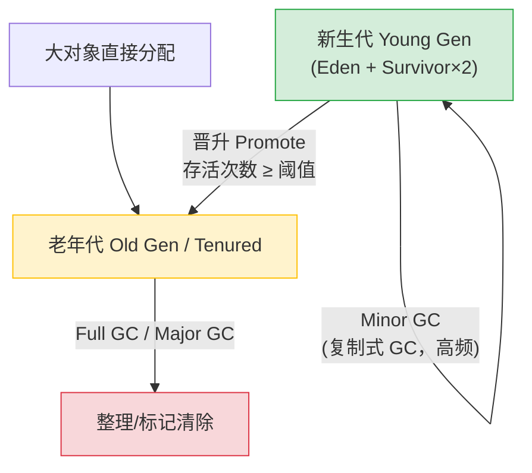
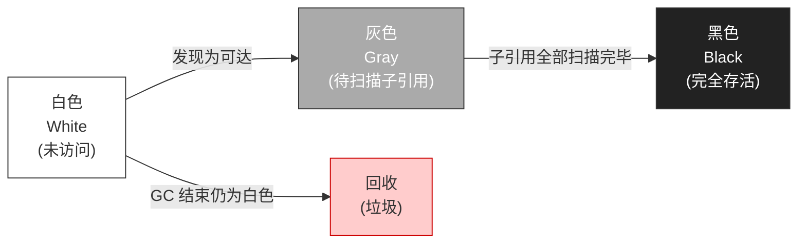

---
tags:
  - 内存管理
  - tier3
  - GC
  - 垃圾回收
---
# 垃圾回收算法原理：从标记清除到分代与并发 GC

> [!abstract] TL;DR
> 垃圾回收（GC）是托管运行时自动追踪内存生存期的机制。核心算法分三大家族：**标记类**（mark-sweep、mark-compact）通过可达性分析识别存活对象；**复制类**（semispace/Cheney）消除碎片但空间利用率折半；**引用计数**（RC）可即时回收但无法处理循环。现代主流 GC（JVM G1/ZGC、V8 Orinoco、Go 并发三色、CPython RC+分代）均采用分代假说将堆分层管理，并以**三色标记不变量**为基础实现增量/并发 GC，将 Stop-The-World（STW）停顿从数百毫秒压缩到个位数毫秒甚至亚毫秒。理解 GC 算法是分析托管程序内存行为、调优 GC 停顿、诊断内存泄漏（在 GC 语言中表现为意外存活引用而非经典的野指针/双释放）的前提。

---

## 概述与定位

### 为什么需要垃圾回收

手动内存管理（`malloc`/`free`、`new`/`delete`）要求程序员精确追踪每一块内存的生存期：过早释放导致悬空指针（use-after-free），忘记释放导致内存泄漏，两次释放导致堆腐化。这类 bug 难以复现、难以调试，是 C/C++ 程序安全漏洞的主要来源（参见系列第 13 篇内存安全与调试）。

垃圾回收将"决定何时释放内存"这一责任从程序员手中转移给运行时（runtime）。其核心思路是：**运行时追踪哪些内存对象仍然被程序可访问（可达），哪些已不可达，周期性地回收不可达对象**。这个转移带来了极大的编程便利性和安全性（消除悬空指针和双释放），代价是：引入了运行时开销（时间）、需要元数据空间（空间）、以及可能的停顿（延迟）。

### GC 在内存管理分层中的位置

```
用户代码（Java/Python/Go/JavaScript/C#）
         ↓ 分配对象 / 写引用
    运行时 GC 层（可达性分析 + 回收）
         ↓ 向操作系统申请/归还大块内存
    本机堆分配器（jemalloc/mimalloc/tcmalloc）
         ↓ mmap / brk
    OS 虚拟内存子系统
```

GC 运行时并不直接调用 `malloc`：JVM/Go runtime 通常预先向 OS 申请大块内存（Arena/Heap Region）自管理，V8 同样有自己的 `MemoryChunk`。GC 语言的"内存泄漏"含义与 C/C++ 完全不同：不是"忘了 free"，而是"程序仍持有某个对象的引用，导致 GC 认为它可达而无法回收"——分析手段因此也完全不同。

### GC 与手动 malloc/free 的对比

| 维度 | 手动（malloc/free） | 垃圾回收 |
|------|--------------------|---------| 
| 内存安全 | 程序员负责；易出 UAF/double-free | 运行时保证；消除这类 bug |
| 分配延迟 | 通常低且可预测（tcache 路径纳秒级） | 可能触发 GC 停顿（数毫秒到数百毫秒） |
| 吞吐量 | 高（无额外扫描开销） | 有标记/扫描开销（通常 5–20% CPU） |
| 碎片 | 外部碎片（bin 机制缓解） | 整理型 GC 可消除外部碎片 |
| 内存峰值 | 对象释放即刻可用 | 存在浮动垃圾（floating garbage），峰值更高 |
| 适用语言 | C、C++、Rust（所有权） | Java、Go、Python、JS、C#、Kotlin |

---

## 原理与机制

### 可达性分析与 GC Roots

GC 的核心判断标准不是"这块内存是否被使用"（无法精确判断），而是**可达性（reachability）**：从一组已知存活的**根对象（GC roots）**出发，沿引用关系遍历所有可达对象，未被遍历到的对象即为垃圾。

**GC roots 的典型构成**：

- **栈上的局部变量和临时值**：每个线程的调用栈帧中存储的对象引用。
- **全局变量 / 静态字段**：类的静态字段、模块级全局对象。
- **JNI/FFI 持有的引用**：本机（native）代码通过 JNI Global Reference 持有的 Java 对象。
- **VM 内部持有**：类加载器、interned string 池、线程对象本身、已加载类的 Class 对象。
- **弱引用相关数据结构**：Finalizer 队列中的待终结对象。

精确 GC（exact/precise GC）需要运行时能够准确区分栈上的"对象引用"和"整数值"，这依赖于编译器生成 **StackMap**（JVM）或 **GC descriptor**（Go runtime）。保守 GC（conservative GC，如 Boehm GC）则对栈上所有字长数值都当作潜在指针扫描，可能产生"误判"——某个整数值与某块堆内存地址重合，导致该块内存无法被回收（假阳性），永远不会误删存活对象（假阴性不存在）。

### 弱分代假说

几乎所有现代 GC 的分代设计都基于一个被大量实证支持的观察：**大多数对象在创建后很快就死去**（弱分代假说，weak generational hypothesis）。典型分布是：80%–95% 的对象在一次 minor GC 之前就不再被引用。

这意味着将堆划分为"新生代"（young generation）和"老年代"（old generation），**仅扫描新生代就能回收绝大多数垃圾**，而不必每次都扫描整个堆。新生代 GC 频繁但快速（因为存活对象少），老年代 GC 不频繁但代价较高（因为存活对象多、堆更大）。

---

## 结构/算法/伪代码详解

### 标记-清除（Mark-Sweep）

标记-清除是最基础的 GC 算法，分两个阶段：

**标记阶段（Mark Phase）**：从 GC roots 开始，深度优先（或广度优先）遍历所有可达对象，在对象头（object header）的标记位（mark bit）中置 1。

**清除阶段（Sweep Phase）**：线性扫描整个堆，将标记位为 0 的对象所占用的内存插入空闲列表（free list），供后续分配复用。清除完成后清零所有存活对象的标记位，为下一轮准备。

```
// 标记-清除伪代码
function mark_sweep():
    // 标记阶段：广度优先
    worklist = all GC roots
    while worklist not empty:
        obj = worklist.pop()
        if not obj.mark_bit:
            obj.mark_bit = 1
            for each ref in obj.fields:
                if ref != null and not ref.mark_bit:
                    worklist.push(ref)
    
    // 清除阶段：线性扫描
    for each obj in heap:
        if obj.mark_bit == 0:
            free_list.insert(obj)   // 回收为垃圾
        else:
            obj.mark_bit = 0        // 清除标记，供下次使用
```

**优点**：实现简单，不需要移动对象（因此指针不需要更新），可以处理循环引用。

**缺点**：产生**外部碎片**（碎片化的空闲内存块难以满足大对象分配请求）；需要 STW 停顿（不然标记过程中有新对象写入会遗漏）；空间局部性差（存活对象分散）。

### 标记-整理（Mark-Compact）

标记阶段同上，清除阶段替换为整理（compact）阶段：将所有存活对象移动到堆的一端，使空间连续。

```
// 标记-整理伪代码（两趟整理算法）
function mark_compact():
    // 第一趟：计算每个对象的新地址
    free = heap_start
    for each obj in heap (by address):
        if obj.mark_bit:
            obj.forwarding_ptr = free   // 记录新位置
            free += obj.size
    
    // 第二趟：更新所有引用
    for each ref in (roots + all live objects):
        ref = ref.forwarding_ptr
    
    // 第三趟：移动对象
    for each obj in heap:
        if obj.mark_bit:
            copy(obj, obj.forwarding_ptr)
            obj.mark_bit = 0
    
    heap_top = free  // 推进指针代替空闲列表
```

**优点**：消除外部碎片；分配退化为**指针碰撞（bump pointer allocation）**，速度极快（O(1) 且 cache 友好）。

**缺点**：需要多次遍历堆；移动对象需要更新所有引用（代价较高）；仍然需要 STW。

### 复制式 GC / Semispace（Cheney 算法）

将堆对半分为两个半区（semispace）：**from-space** 和 **to-space**。正常分配在 from-space 中使用 bump pointer；GC 触发时，将所有 from-space 中的存活对象复制到 to-space，然后交换两个半区角色。

Cheney 算法用一种优雅的 BFS 实现无额外栈空间的复制：

```
// Cheney 复制算法伪代码
function cheney_collect():
    scan = to_space.start
    free = to_space.start
    
    // 复制所有 roots 到 to-space
    for each root in GC_roots:
        root = copy(root)
    
    // BFS：scan 指针追 free 指针
    while scan < free:
        obj = to_space[scan]
        for each field ref in obj:
            ref = copy(ref)     // 复制 ref 指向的对象（若未复制）
        scan += obj.size
    
    swap(from_space, to_space)

function copy(obj):
    if obj has forwarding_ptr:      // 已复制过
        return obj.forwarding_ptr
    new_obj = to_space[free]
    copy_bytes(obj → new_obj, obj.size)
    free += obj.size
    obj.forwarding_ptr = new_obj    // 留下转发指针
    return new_obj
```

**优点**：天然整理（消除碎片）；分配为 O(1) bump pointer；存活对象密集排列，cache 友好；无需显式空闲列表。

**缺点**：空间利用率 50%（始终有一半空间闲置）；复制大对象代价高；需要 STW 停顿期间阻塞所有 mutator 线程。

Cheney 复制算法被广泛用于**新生代收集器**：代价固定地取决于存活对象大小（而非堆大小），而新生代存活率低，复制开销小。

### 分代 GC：新生代、老年代与晋升

分代 GC 将堆分为多代（generation）：



**Eden 区**：新对象首先在 Eden 分配（bump pointer，速度极快）。

**Survivor 区**：Minor GC 时，Eden 中的存活对象被复制到 Survivor 区（通常两个，交替使用——Hotspot 的 S0/S1）。在 Survivor 中存活了足够多次（如 `-XX:MaxTenuringThreshold=15`，默认动态调整）的对象被**晋升（promote）**到老年代。

**老年代**：存放生命期较长的对象，由 Major GC 或 Full GC 周期性回收，通常使用标记-整理或并发标记。

#### 写屏障：Card Table 与 Remembered Set

分代 GC 面临一个核心挑战：老年代对象可能持有新生代对象的引用（跨代引用）。Minor GC 扫描新生代时，仍需要知道"哪些老年代对象引用了新生代对象"，否则可能错误地回收存活对象。

**Card Table**（JVM HotSpot 使用）：将堆分为固定大小（通常 512 字节）的 card，每个 card 对应 card table 中的一个字节。**写屏障（write barrier）**在每次对象引用写入（`obj.field = ref`）时检查 `ref` 是否指向新生代，若是则将该 card 标记为 dirty。Minor GC 时仅扫描 dirty card，大幅减少需要扫描的老年代内存范围。

```
// 写后屏障（post write barrier）伪代码
function write_field(obj, field, new_ref):
    obj.field = new_ref
    if new_ref in young_gen:
        card_table[card_index(obj)] = DIRTY
```

**Remembered Set**（G1 和 Shenandoah 使用）：更精细的记录，直接记录哪些老年代对象（而非哪些 card）指向新生代，精度更高但空间开销也更大。

### 引用计数（Reference Counting）

每个对象维护一个**引用计数（reference count）**，记录有多少指针指向该对象。引用计数为 0 时立即释放。

```
// 引用计数伪代码
function new_ref(obj):
    obj.rc += 1

function del_ref(obj):
    obj.rc -= 1
    if obj.rc == 0:
        for each field ref in obj:
            del_ref(ref)    // 递归释放子对象
        free(obj)
```

**优点**：对象死亡时**即时回收**（无 STW 停顿，延迟平滑）；实现直观；可逐步回收（不需要暂停）。

**缺点**：**循环引用**无法回收（A → B → A，两者 rc 均为 1，但都不可达）；每次引用赋值需要更新计数（写操作频繁，在并发环境中需要原子操作，代价高）；递归 `del_ref` 可能触发长链递归释放（峰值延迟不可预测）。

#### 循环引用的解决：辅助标记-清除

Python CPython 的做法是**双机制组合**：

1. 主要使用引用计数（`ob_refcnt`），对象 rc 归零时即时释放。
2. 对于无法被引用计数回收的循环引用，启动周期性的辅助 GC（`gc` 模块），专门处理**包含循环的容器对象**（list、dict、class instance 等）。辅助 GC 使用标记算法：模拟"减少 rc"来发现不可达的循环，然后打破循环并释放。

```python
import gc
gc.collect()        # 手动触发辅助 GC
gc.disable()        # 关闭辅助 GC（纯 RC 模式，无法回收循环引用）
gc.get_threshold()  # 查看触发阈值 (700, 10, 10)
```

CPython 的 `gc` 模块将受监控对象分为 3 代（generation 0/1/2），阈值默认为 (700, 10, 10)：第 0 代每分配 700 个受监控对象触发一次；第 0 代触发 10 次则同时触发第 1 代；第 1 代触发 10 次则同时触发第 2 代（最全面也最慢）。

另一种处理循环引用的方式是**弱引用（weak reference）**：不增加 rc 的引用，允许对象被回收后返回 `None`。Python 的 `weakref.ref`、C++ 的 `std::weak_ptr`、Java 的 `WeakReference` 均属此类。

### 三色标记：理解并发 GC 的基石

三色标记是**增量/并发 GC 的理论基础**，将对象分为三种颜色：

- **白色（White）**：尚未被 GC 访问到的对象。GC 结束时仍是白色 → 垃圾。
- **灰色（Gray）**：已被 GC 访问到（加入工作队列），但其引用的对象尚未全部扫描。
- **黑色（Black）**：已被完全扫描的存活对象（自身及所有直接引用均已扫描）。



**三色不变量**：只要以下两个不变量之一保持，GC 就不会错误回收存活对象：

- **强三色不变量（Strong Tri-color Invariant）**：黑色对象**不能**直接引用白色对象。  
- **弱三色不变量（Weak Tri-color Invariant）**：若黑色对象引用了白色对象，则必须有某个灰色对象能"保护"该白色对象（存在一条灰色到白色的路径）。

在非并发（STW）GC 中，标记期间 mutator（应用程序线程）不运行，因此三色不变量天然成立。**在并发 GC 中**，mutator 和 GC 同时运行，mutator 可以在 GC 标记的同时修改对象引用图，破坏三色不变量（如：把某个黑色对象的字段指向一个白色对象，同时删除所有灰色到该白色对象的路径）。写屏障就是为了维护三色不变量而插入的代码。

#### SATB（Snapshot-At-The-Beginning）写屏障

G1、Shenandoah、旧版 JVM CMS 使用 SATB：在 GC 开始时**逻辑上对堆做一个快照**，维护的不变量是：**标记开始时可达的对象，最终必须被标记存活**（即便 mutator 之后删除了对它的引用）。

```
// SATB 写前屏障（pre write barrier）
function write_field_satb(obj, field, new_ref):
    old_ref = obj.field
    if old_ref != null and not old_ref.mark_bit:
        satb_queue.push(old_ref)   // 保存被覆盖的旧引用，防止漏标
    obj.field = new_ref
```

SATB 会产生**浮动垃圾（floating garbage）**：标记开始后才死去的对象，在本次 GC 中仍被视为存活，下一轮才能回收。这是并发 GC 的固有代价。

#### 增量更新（Incremental Update）写屏障

CMS（Concurrent Mark Sweep）和 Go GC 使用增量更新：关注**新增引用**而非旧引用。当黑色对象新增一个指向白色对象的引用时，将该白色对象变为灰色（或将黑色对象重新变为灰色，强制重新扫描）。

```
// 增量更新写后屏障（post write barrier）
function write_field_incremental(obj, field, new_ref):
    obj.field = new_ref
    if obj.color == BLACK and new_ref.color == WHITE:
        new_ref.color = GRAY       // 防止白色对象被漏标
        mark_queue.push(new_ref)
```

---

## 工具视角与实战

### JVM GC 算法演进：从 CMS 到 G1、ZGC、Shenandoah

| 收集器 | 算法 | STW 停顿 | 适用场景 |
|--------|------|---------|---------|
| Serial GC | 标记-整理（老年代）+ 复制（新生代） | 全 STW | 单核、小堆、低资源环境 |
| Parallel GC | 多线程标记-整理/复制 | 全 STW | 吞吐量优先（批处理） |
| CMS | 并发标记-清除（老年代）+ 复制（新生代） | 短暂 STW（初始标记+重新标记） | 低停顿（现已废弃） |
| G1 | Region 化堆 + 增量标记-整理 | 可预测停顿（目标 200ms 以内） | 大堆（4GB+）低停顿 |
| ZGC | 并发标记+并发整理（着色指针 Colored Pointer） | <10ms（目标 <1ms） | 超大堆、极低停顿 |
| Shenandoah | 并发标记+并发整理（Brooks Forwarding Pointer） | <10ms | 低停顿，对象移动不暂停 |

**G1（Garbage First）**的核心思路是将堆划分为等大小的 **Region**（默认 1–32MB），每个 Region 可以是 Eden、Survivor、Old 或 Humongous（大对象）。G1 优先回收垃圾比例最高的 Region（名字由来），通过 Remembered Set 追踪跨 Region 引用，能在每次 GC 时选择回收部分 Region，实现可预测的停顿时间目标（`-XX:MaxGCPauseMillis`）。

**ZGC** 使用**着色指针（Colored Pointer）**：将 64 位指针的高位用于存储 GC 元数据（Marked0/Marked1/Remapped/Finalizable 各 1 bit），GC 通过修改元数据位而非对象头来追踪标记状态。这使得 ZGC 能并发重定位对象（修改指针元数据，而非停止所有线程更新引用）。配合**读屏障（Load Barrier）**：每次解引用指针时检查元数据位，按需更新指针，实现近乎完全并发的 GC 过程。

```
// ZGC 读屏障伪代码
function load_ref(obj, field):
    ref = obj.field
    if ref.metadata != GOOD:         // 指针需要修复
        ref = slow_path_fix(ref)     // 原子 CAS 更新
        obj.field = ref              // 修复存储
    return ref
```

**Shenandoah** 的并发整理使用 **Brooks 转发指针**：在每个对象头部插入一个额外的转发指针字段，并发移动对象时先复制，再原子更新转发指针，读屏障通过转发指针跳转到新地址。

### V8 Orinoco GC

V8 的 JavaScript 对象生命在 **Orinoco** GC 管理下：

- **Scavenger**（新生代）：复制式 GC（Cheney 变体），分 To-Space / From-Space，Stop-The-World 但速度极快（通常 <1ms）。使用**并行 Scavenger**：多个工作线程协作复制，进一步降低停顿。
- **Mark-Compact**（老年代）：并发标记（Concurrent Marking）+ 并行整理（Parallel Compaction），STW 仅在最终重新标记（Remark）阶段。使用增量标记（Incremental Marking）在 mutator 空闲时间片中推进标记，避免一次性长停顿。

V8 的 **Idle-time GC**：利用 JavaScript 事件循环的空闲时间（`requestIdleCallback`）执行增量 GC，做到 GC 对用户感知近乎透明。

### Go 并发三色 GC

Go runtime 的 GC 从 Go 1.5 起改为**并发三色标记清除**，无整理阶段（不移动对象，对 Go 的值类型传递更友好）。

Go GC 核心参数 `GOGC`（默认 100）：控制触发 GC 时堆的大小相对上次 GC 结束后存活堆大小的增长比例。`GOGC=100` 意味着当堆增长到上次存活大小的 2 倍时触发 GC。Go 1.19 引入 `GOMEMLIMIT` 软内存上限。

Go GC 的主要阶段：

1. **Mark Setup（STW，极短）**：开启写屏障，暂停少量初始化工作。
2. **Concurrent Mark**：GC goroutine 与应用 goroutine 并发运行，使用**混合写屏障（Hybrid Write Barrier）**（Go 1.14+，结合 SATB 和增量更新的优点）。
3. **Mark Termination（STW，极短）**：扫尾，关闭写屏障，计算下次 GC 触发目标。
4. **Concurrent Sweep**：并发清除不可达对象，将内存归还给 mspan 空闲列表。

Go GC 的停顿时间目标通常在 1ms 以内（P50），偶发 10ms（P99），对延迟敏感的服务可通过 `runtime.GC()` 手动触发或调整 `GOGC`。

```go
// 调优示例
import "runtime/debug"

// 降低触发频率（更大堆，更少 GC，但内存占用更高）
debug.SetGCPercent(200)

// 设置软内存上限（Go 1.19+）
debug.SetMemoryLimit(512 * 1024 * 1024)  // 512MB

// 手动触发 GC
runtime.GC()

// 读取 GC 统计
var stats runtime.MemStats
runtime.ReadMemStats(&stats)
fmt.Printf("NumGC: %d, PauseNs: %v\n", stats.NumGC, stats.PauseNs)
```

### Python CPython GC 实践

Python 的对象生命由 `ob_refcnt` 主导，`gc` 模块辅助处理循环引用：

```python
import gc, sys

# 查看对象引用计数
obj = [1, 2, 3]
print(sys.getrefcount(obj))  # 通常比预期多 1（getrefcount 参数本身持有引用）

# 制造循环引用
a = {}; b = {}
a['b'] = b; b['a'] = a
del a, b
# 此时 a, b 的 rc 互为 1，不会自动释放
# gc.collect() 可以回收它们

# 查看哪些对象形成循环引用（调试用）
gc.set_debug(gc.DEBUG_LEAK)
gc.collect()

# 禁用 GC（对循环引用安全的代码，可小幅提升性能）
gc.disable()
```

CPython 的 C 扩展开发者需要正确调用 `Py_INCREF`/`Py_DECREF`，并在可能形成循环引用的类型中实现 `tp_traverse` 和 `tp_clear` 槽位，以让 `gc` 模块能遍历自定义容器对象中的 Python 引用。

### 托管堆的逆向分析

对 Android/JVM 应用进行逆向或内存分析时，需要理解托管堆结构：

**ART（Android Runtime）**的托管堆由多个 Space 组成：
- `ZygoteSpace`：Zygote 进程预加载类，fork 后在所有进程共享（Copy-on-Write）。
- `ImageSpace`：boot image（预编译的框架 dex），只读。
- `BumpPointerSpace`：应用新生代（young space），bump pointer 分配。
- `LargeObjectSpace`：大对象直接 mmap。

使用 `adb shell am dumpheap <pid> /data/local/tmp/heap.hprof` 可以 dump ART 堆为 HPROF 格式，再用 Android Studio Memory Profiler 或 MAT（Eclipse Memory Analyzer）分析对象存活树。

**HPROF 格式解析**：每个 HPROF 文件包含 heap dump record，其中每个 `HEAP_DUMP_INFO` 后跟 `INSTANCE_DUMP`（普通对象）、`OBJECT_ARRAY_DUMP`、`PRIMITIVE_ARRAY_DUMP` 等 record，可以还原对象图、定位内存泄漏根因。

---

## 安全性与正确使用

### GC 语言的内存泄漏：意外存活引用

在 GC 语言中，**内存泄漏不表现为"忘了 free"，而是"意外地持有引用"**，导致对象对 GC 不可达性判断来说仍"存活"，但实际上程序不再需要它。

常见模式：

**静态集合无限增长**：
```java
// Java：静态 Map 持有 listener，从不移除
static final Map<String, Listener> registry = new HashMap<>();
void subscribe(String key, Listener l) {
    registry.put(key, l);   // 泄漏：listener 永远不会被 GC
}
```

**内部类持有外部类引用**（Android 最常见）：
```java
// Android：匿名 Handler 持有 Activity 引用
new Handler().postDelayed(() -> { /* this 捕获了 Activity */ }, 60000);
// Activity 因为 Handler 的引用无法被 GC，即使已经 finish()
```

**缓存未设置淘汰策略**：
```go
// Go：无上界的 sync.Map 或 map 用作缓存
var cache sync.Map
func getUser(id string) User {
    u, _ := cache.LoadOrStore(id, fetchUser(id))
    return u.(User)
    // 从不 Delete：缓存无限增长
}
```

**诊断与修复工具**：

| 语言/平台 | 泄漏诊断工具 |
|-----------|-------------|
| Java/Kotlin | Eclipse MAT、VisualVM、JFR（Java Flight Recorder）、`-Xmx` 触发 OOM 后分析 heap dump |
| Android | Android Studio Memory Profiler、LeakCanary（Square 开源）、`adb shell dumpsys meminfo` |
| Go | `pprof`（`net/http/pprof` 或 `runtime/pprof`）、`go tool pprof heap.prof` |
| Python | `tracemalloc`、`objgraph`（`objgraph.show_most_common_types()`） |
| Node.js/V8 | Chrome DevTools Memory 面板、`--inspect`、`heapdump` npm 包 |

### GC 调优原则

**JVM GC 调优常用参数**：
```bash
# G1 GC（JDK 9+ 默认）
java -XX:+UseG1GC \
     -XX:MaxGCPauseMillis=200 \      # 停顿时间目标
     -XX:G1HeapRegionSize=16m \       # Region 大小
     -Xms2g -Xmx8g \                 # 初始/最大堆
     -XX:+PrintGCDetails \           # 打印 GC 日志
     -Xlog:gc*:file=gc.log           # JDK 9+ unified logging

# ZGC（低停顿）
java -XX:+UseZGC \
     -XX:SoftMaxHeapSize=4g \        # 软上限（允许超出但尽量回收）
     -Xmx6g MyApp
```

**OOM 分析**：JVM OOM（`OutOfMemoryError: Java heap space` / `GC overhead limit exceeded`）时 `-XX:+HeapDumpOnOutOfMemoryError -XX:HeapDumpPath=/tmp/` 自动生成 heap dump 供事后分析。

**Go pprof 内存分析**：
```go
// 在 HTTP 服务中注册 pprof 端点
import _ "net/http/pprof"
go http.ListenAndServe(":6060", nil)

// 采集并分析：
// go tool pprof http://localhost:6060/debug/pprof/heap
// (pprof) top20 —— 按 inuse_space 列出前 20 个分配点
// (pprof) web    —— 生成可视化调用图
```

### 浮动垃圾与 GC 停顿的权衡

并发 GC 为了避免 STW，接受"浮动垃圾"存在（本轮 GC 开始后才死去的对象在下一轮才能回收）。这意味着：

1. **内存峰值高于理论值**：并发 GC 的堆利用率不如 STW GC（需要为浮动垃圾预留空间）。G1/ZGC 通常需要比实际活跃数据多 2–3 倍的堆空间才能高效工作。
2. **GC 失败回退（Concurrent Mode Failure）**：若并发 GC 速度跟不上 mutator 分配速度，G1/CMS 会回退到 Full GC（STW），产生一次长停顿。解决方案：增大堆、降低 `InitiatingHeapOccupancyPercent`（提早触发并发 GC）。
3. **写屏障性能开销**：写屏障在每次对象写操作时执行，通常约有 5–15% 的写操作性能影响。ZGC 的读屏障在指针解引用时执行，比写屏障更频繁（读比写多），但每次代价更低（HW 辅助着色指针使检查成本极低）。

---

## 小结

垃圾回收算法的演进沿着两条主轴推进：一是**减少碎片**（从 mark-sweep 的空闲链表，到复制式 GC 和 mark-compact 的 bump pointer）；二是**减少停顿**（从全 STW，到分代的短暂 minor GC，再到三色标记写屏障支撑的并发/增量 GC，最终到 ZGC/Shenandoah 毫秒级停顿）。

核心理念回顾：
- **可达性分析**是 GC 的判断基础；**GC roots** 是遍历的起点。
- **弱分代假说**支撑了分代 GC：大多数对象很快死去，仅扫描新生代即可回收绝大多数垃圾。
- **三色不变量**是并发 GC 的安全保证；**写屏障**（SATB / 增量更新）维护该不变量。
- **引用计数**以即时回收见长，循环引用是其天然短板，需辅助标记或弱引用解决。
- **内存泄漏在 GC 语言中**表现为意外存活引用（而非忘记释放），使用 heap profiler / GC roots 反向追踪是标准排查路径。

现代 GC 实现（JVM G1/ZGC、V8 Orinoco、Go 三色并发）的停顿时间已从秒级（JDK 1.4 时代）压缩到个位数毫秒，使得"托管语言不适合实时系统"的传统判断在很多场景下已不成立。理解 GC 算法，是做出合理技术选型、正确调优 GC 参数、准确诊断内存问题的前提。

---

## 相关阅读

- **Wilson, Paul R. (1992). "Uniprocessor Garbage Collection Techniques"** — GC 算法经典综述，几乎所有 GC 教程的源头。
- **Jones, R., Hosking, A., Moss, E. (2011). "The Garbage Collection Handbook"** — 最权威的现代 GC 教材，涵盖所有算法变体。
- **JVM ZGC 设计文档** — [OpenJDK Wiki: ZGC](https://wiki.openjdk.org/display/zgc/Main)
- **Go GC 设计文档** — [Go GC Guide](https://go.dev/doc/gc-guide) + [go/src/runtime/mgc.go](https://github.com/golang/go/blob/master/src/runtime/mgc.go)
- **V8 GC 博客系列** — [v8.dev/blog/trash-talk](https://v8.dev/blog/trash-talk)（Orinoco GC 设计）
- **CPython gc 模块源码** — `Modules/gcmodule.c`（循环检测算法）
- **Richard Jones 的在线 GC 资源** — [https://gchandbook.org/](https://gchandbook.org/)
- 系列内相关章节：第 02 篇（进程地址空间与虚拟内存）、第 05–09 篇（ptmalloc2 内部结构）、第 13 篇（内存安全与调试）、第 15 篇（Scudo 分配器原理）

---

[[00.内存管理与堆分配器总览|⬆ 系列总览]] | [[15.Scudo分配器原理|← 上一章]] | [[17.堆利用手法体系House_of系列|→ 下一章]]
