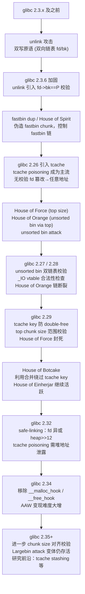

---
tags:
  - 内存管理
  - 堆分配器
  - tier3
  - 堆利用
  - 安全
---
# 堆利用手法体系：House of 系列与 glibc 加固对抗

> [!abstract] TL;DR
> 堆利用是二进制漏洞利用中最复杂、最体系化的子领域。攻击者通过对 glibc ptmalloc 内部数据结构（bin、chunk 元数据、tcache 链表）进行精确操控，将堆上的内存破坏漏洞升级为任意地址写、libc 基址泄露乃至 shell 获取。"House of X" 命名体系是安全研究社区对各类手法的约定集合——每个 House 对应一条利用路径，针对 ptmalloc 某个具体弱点。随着 glibc 2.26 至 2.38 持续加固（tcache key 引入、safe-linking 指针加密、size 校验强化等），旧手法逐一失效，新手法随之演化。本篇以防御性视角系统梳理手法族谱与加固演进，目标是让读者理解**每道加固到底堵死了哪条路**。

## 概述与定位

### 为什么堆利用如此重要

在现代 x86-64 Linux 平台，绕过 ASLR 与 NX 的攻击几乎都需要经过堆操控阶段：

1. **泄露 libc 基址**：堆上的 unsorted bin fd/bk 指针指向 `main_arena`（libc 内部），读取这对指针即可算出 libc 加载地址，绕过 ASLR。
2. **获取任意地址写原语**（AAW，Arbitrary Address Write）：通过伪造 bin 链表，让 `malloc` 返回攻击者指定的任意地址，随后写入 `__malloc_hook`、`__free_hook`（旧版本）或 `exit` 函数指针等，劫持控制流。
3. **构建 ROP/JOP 链**：结合 ret2libc 或 one_gadget 完成最终 payload。

本篇是系列 24（内存管理与堆分配器）的安全专章，与系列 33（二进制漏洞与利用基础）形成互补：系列 33 讲个别技术的战术细节，本篇构建**系统性的手法地图**，并重点回答"每个 glibc 版本为什么能挡住哪些手法"。

### 前置知识定位

读者应已了解：
- ptmalloc chunk 结构（`malloc_chunk`：prev_size、size、fd、bk 字段）——参见本系列第 06 篇
- fastbin / unsorted bin / tcache 工作原理——参见第 07、08 篇
- 常见漏洞原语：堆溢出（overflow）、Use-After-Free（UAF）、double-free、off-by-one/off-by-null

本篇**不提供可直接武器化的完整 exploit**，代码片段仅用于说明原理。

> [!caution]
> 本文所有堆利用手法**仅适用于授权 CTF 竞赛、自有靶场环境及防御性安全研究**。严禁将本文内容用于针对他人生产系统或未授权目标的攻击行为。本篇重点在于理解各版本 glibc 加固措施**为何有效**——这是防御工程师评估安全加固、部署强化分配器的理论基础。任何真实攻击行为均违反《中华人民共和国网络安全法》及相关法律法规。

---

## 原理与机制

### glibc ptmalloc 的可攻击面概览

ptmalloc 在设计上优先考虑性能，安全校验最初极为薄弱。以下是核心可攻击数据结构：

```
ptmalloc 内部结构攻击面速览

+------------------+
| malloc_chunk     |
|  prev_size       |  ← 空闲时由前驱 chunk 写入，unlink 攻击入口
|  size            |  ← PREV_INUSE / IS_MMAPPED / NON_MAIN_ARENA 标志位
|  fd              |  ← 空闲时：单向 fastbin 链/双向 bin 链前驱指针
|  bk              |  ← 双向 bin 链后继指针，修改即可控 unsorted bin 攻击
|  fd_nextsize     |  ← largebin 链，跨尺寸链表
|  bk_nextsize     |  ← largebin 链
+------------------+

+------------------+
| tcache_entry     |  ← fd 指针（2.26+），safe-linking 加密（2.32+）
|  next            |
|  key             |  ← tcache_perthread_struct 地址（2.29+），防 double-free
+------------------+
```

### 手法分类框架

所有堆利用手法可按"操控的目标结构"分为五大类：

| 类别 | 目标结构 | 典型手法 |
|------|----------|----------|
| fastbin 类 | fastbin 单链表 | fastbin dup、House of Spirit |
| tcache 类 | tcache 单链表 | tcache poisoning、tcache dup、House of Botcake |
| unsorted bin 类 | unsorted bin 双链表 | unsorted bin attack、House of Lore、House of Orange |
| top chunk 类 | top chunk 伪造 | House of Force、House of Orange |
| 合并/overlap 类 | chunk 合并逻辑 | House of Einherjar、chunk overlap、off-by-null |

---

### 核心漏洞原语

在深入各 House 之前，先明确三种基础原语的定义：

**堆溢出（Heap Overflow）**：向已分配 chunk 写入超过其 user data 范围的数据，可覆盖相邻 chunk 的 size 字段或 fd/bk 指针。

**Use-After-Free（UAF）**：chunk 释放后指针未清零，后续通过该指针访问已在 bin 中的 chunk，可读写 fd/bk 等元数据。

**Double-Free**：同一 chunk 被释放两次，造成 bin 链表形成环，使 `malloc` 能多次返回同一块内存。

---

## 结构/算法/伪代码详解

### 1. unlink 攻击（glibc < 2.3.6 经典手法，今已全面防御）

**原理**：当相邻空闲 chunk 合并时，ptmalloc 会将待合并 chunk 从双向链表中摘除（unlink）。早期 glibc 的 unlink 宏实现：

```c
// 古老 unlink 宏（已废弃，仅供理解）
#define unlink(AV, P, BK, FD) {             \
    FD = P->fd;                              \
    BK = P->bk;                             \
    FD->bk = BK;   /* FD 的 bk 指向 BK */  \
    BK->fd = FD;   /* BK 的 fd 指向 FD */  \
}
```

若攻击者控制 `P->fd` 和 `P->bk`，则 `unlink` 等价于：
- 向 `P->fd + 0x18` 写入 `P->bk`
- 向 `P->bk + 0x10` 写入 `P->fd`

这是一个**双写原语**，可将任意值写入任意地址。

**加固（glibc 2.3.6+）**：引入完整性校验：

```c
if (__builtin_expect (FD->bk != P || BK->fd != P, 0))
    malloc_printerr ("corrupted double-linked list");
```

此后，攻击者必须使 `FD->bk` 和 `BK->fd` 均指向 `P`，极大提高了伪造难度——但仍可结合堆上已知地址绕过（chunk 本身地址已知时）。

---

### 2. fastbin dup（double-free via fastbin）

**适用版本**：glibc < 2.29（无 tcache）或 tcache 被填满后

**前提条件**：拥有 double-free 能力（对同一 fastbin 大小的 chunk 释放两次）

**原理**：fastbin 是单链表，`free` 时只检查 `head` 节点是否等于当前 chunk（防止连续 double-free）：

```c
// glibc fastbin free 检查（简化）
if (__glibc_unlikely(old == p))
    malloc_printerr("double free or corruption (fasttop)");
```

因此只需在两次 free 之间插入一次 free 另一个 chunk，即可绕过：

```
操作序列：
1. malloc(A)  malloc(B)  malloc(A')  // A 和 A' 大小相同（fastbin）
2. free(A)
3. free(B)    // 插入，破坏 A==head 的检查
4. free(A)    // double-free 成功
```

此时 fastbin 链：`A → B → A → B → ...`（环形）

```
malloc(X)  // 返回 A，同时链表变为 B → A
malloc(X)  // 返回 B
写 fd 字段 // 修改 A->fd = target_addr
malloc(X)  // 返回 A（再次）
malloc(X)  // 返回 target_addr ← 任意地址分配！
```

**加固（glibc 2.29+）**：tcache 优先被填满时，double-free 进 tcache 会被 `key` 字段检测（见第 4 节）。fastbin 层面，2.32 引入对 fastbin chunk size 的更严格校验。

---

### 3. House of Spirit（伪造 fastbin chunk）

**核心思想**：不需要堆上的真实 chunk，在攻击者可控的任意内存区域（栈、bss、堆外）伪造一个满足 fastbin 约束的 fake chunk，将其地址传给 `free`，随后 `malloc` 返回该区域。

**前提条件**：
- 能向任意地址写入若干字段（设置 fake chunk 的 size 和 next chunk 的 size）
- 能调用 `free(fake_ptr)`（通常通过覆盖某指针）

**伪造约束**（glibc < 2.32）：
```
fake chunk 需满足：
1. size 字段 ∈ fastbin 范围（0x20～0x80，视配置而定）
2. size 的 PREV_INUSE 位置 1
3. next chunk（fake_ptr + size）的 size > 2*SIZE_SZ 且 < av->system_mem
   （通常 > 0x10 且 < 0x20000）
```

**加固（glibc 2.32+）**：`free` 对 chunk 大小引入更严格的对齐和范围检查，伪造 fake chunk 所需满足的条件变多。

---

### 4. tcache poisoning（tcache 投毒，glibc 2.26–2.31 主力手法）

**适用版本**：glibc 2.26–2.31（tcache 引入后，safe-linking 引入前）

**前提条件**：UAF 或堆溢出，能修改 tcache bin 链表中某个 chunk 的 `fd`（即 `next`）指针

**原理**：tcache 是每线程的 bin 数组，`malloc` 从中取 chunk 时**几乎无校验**（2.26–2.28）：

```c
// 2.26 的 tcache_get（极简，无校验）
static void *tcache_get(size_t tc_idx) {
    tcache_entry *e = tcache->entries[tc_idx];
    tcache->entries[tc_idx] = e->next;
    --(tcache->counts[tc_idx]);
    return (void *) e;
}
```

攻击者修改链表中某 entry 的 `next` 为 `target_addr - 8`（或 `target_addr`），下一次 `malloc` 即返回目标地址。

```
初始 tcache: A → B → NULL
UAF 修改 A->next = target_addr
malloc: 返回 A（同时 tcache = target_addr → NULL）
malloc: 返回 target_addr ← 任意地址写！
```

**加固演进**：

| glibc 版本 | 加固措施 | 效果 |
|-----------|----------|------|
| 2.29 | tcache `key` 字段：chunk 被放入 tcache 时，`key = &tcache`；`free` 时检查 key，若匹配则遍历链表确认 double-free | 防止单纯 double-free 进 tcache |
| 2.32 | safe-linking：fd 指针存储时异或 `(addr >> 12)`（PROTECT_PTR 宏） | 需要泄露堆地址才能伪造有效 fd |

**safe-linking 原理**：

```c
// 2.32 引入的指针保护宏
#define PROTECT_PTR(pos, ptr) \
    ((__typeof (ptr)) ((((size_t) pos) >> PAGE_SHIFT) ^ ((size_t) (ptr))))

#define REVEAL_PTR(ptr) \
    PROTECT_PTR (&ptr, ptr)
```

存储时：`fd_stored = (heap_addr >> 12) ^ next_ptr`
读取时：`next_ptr = (heap_addr >> 12) ^ fd_stored`

攻击者需知道 `heap_addr`（堆地址，通常需先泄露）才能正确伪造 fd。2.32 之后，tcache poisoning 仍可行，但必须先获得堆地址泄露，攻击链变长。

---

### 5. House of Botcake（tcache 与 unsorted bin 联合利用，glibc 2.29+）

**设计动机**：glibc 2.29 加入 tcache key 防 double-free，直接对 tcache chunk 做 double-free 会被检测。House of Botcake 绕过此限制。

**核心手法**：
1. 先将 tcache 对应 bin 填满（7 个 chunk），使后续 free 落入 unsorted bin
2. 分配 chunk A（prev）和 chunk B（target），填满 tcache 后 free B → 落入 unsorted bin
3. 从 tcache 取出一个，腾出 1 个位置
4. free A：A 与 B 合并（A 是 B 的前驱，PREV_INUSE 被清除），合并后的 big chunk 进入 unsorted bin
5. free B：此时 B 的 `key` 字段不再是 `&tcache`（已被合并覆盖），double-free 检查失败绕过！
6. B 同时存在于 unsorted bin（作为大 chunk 的一部分）和 tcache（再次 free 进去），形成 overlap

**前提**：堆溢出或 UAF 能够合并相邻 chunk（通常是 off-by-null 清除 PREV_INUSE 位）

**加固**：glibc 2.34 移除 `__malloc_hook`/`__free_hook`，使手法产生的 AAW 原语更难变现（但未直接堵死 overlap 本身）。

---

### 6. House of Force（top chunk size 覆盖，glibc < 2.29）

**核心思想**：将 `top chunk` 的 size 覆盖为极大值（如 `0xffffffffffffffff`），使 ptmalloc 误认为 top chunk 无限大，从而 `malloc` 可分配负偏移量大小的 chunk（整数溢出），让 top chunk 指针回绕到目标地址。

**步骤**：
```
1. 堆溢出：将 top chunk size 改为 0xffffffffffffffff
2. malloc(target_addr - heap_top - 0x10):
   top chunk 指针推进到 target_addr 附近
3. malloc(任意大小):
   返回 target_addr，即任意地址分配
```

**加固（glibc 2.29+）**：对 top chunk size 引入范围检查：

```c
// 2.29 新增
if (__glibc_unlikely (size > av->system_mem))
    malloc_printerr ("malloc(): corrupted top size");
```

top chunk size 不能超过 `system_mem`（已向系统申请的总内存），直接杀死 House of Force。

---

### 7. House of Einherjar（off-by-null 触发向前合并，glibc < 2.32 主流）

**利用漏洞**：off-by-null（溢出一个字节 `\x00`）

**原理**：溢出一字节将下一个 chunk 的 size 的最低字节清零，即清除 `PREV_INUSE` 标志位，同时配合写入 `prev_size` 字段，欺骗 ptmalloc 认为"当前 chunk 的前一个 chunk 是空闲的"，触发向前合并（consolidate backward）。

```
内存布局（伪造前）：
[fake_chunk][victim_chunk（PREV_INUSE=1）][next_chunk]

off-by-null 后：
victim_chunk.size 最低位变 0（PREV_INUSE=0）
victim_chunk.prev_size = victim_addr - fake_chunk_addr

free(victim_chunk):
ptmalloc 查看 prev_size，找到 fake_chunk，将其 unlink
fake_chunk 与 victim_chunk 合并 → 大 chunk 覆盖 victim_chunk 区域
```

攻击者通过这种方式获得 chunk overlap：`fake_chunk` 已被释放（或伪造在可控区域），合并后的大 chunk 包含了后续仍在使用的 chunk，可通过再次分配读写其内容。

**加固（glibc 2.28+）**：`free` 时增加校验，验证 `nextchunk` 的 `PREV_INUSE` 位与 `prev_size` 的一致性；2.32 引入更严格的合并方向校验。完全堵死需要 2.34+ 的综合加固。

---

### 8. House of Orange（unsorted bin 链接 top chunk，glibc < 2.26）

**独特之处**：此手法不需要 `free` 调用，通过让 `malloc` 内部触发 top chunk 扩展来将 top chunk 放入 unsorted bin。

**步骤**：
1. 溢出修改 top chunk size 为一个合法但较小的值（如 `0x1000`），但需保持对齐和 PREV_INUSE=1
2. `malloc` 请求超过当前 top chunk 大小的内存：ptmalloc 调用 `_int_sysmalloc`，将当前 top chunk 放入 unsorted bin，再 `sbrk`/`mmap` 获取新内存
3. 此时旧 top chunk 在 unsorted bin 中，其 fd/bk 指向 `main_arena` 内部，可用于 libc 地址泄露

进一步，House of Orange 结合 `_IO_FILE` 结构体伪造（FSOP，File Stream Oriented Programming），在 `malloc_printerr` → `fflush` → `_IO_flush_all_lockp` 调用链中触发伪造的 vtable 函数指针，实现代码执行。

**加固**：
- glibc 2.24：`_IO_FILE` vtable 指针合法性校验（必须指向 libc 只读段的已知 vtable）
- glibc 2.26+：`malloc_printerr` 不再调用 `fflush`，FSOP 利用链断裂

---

### 9. House of Lore（smallbin 伪造，glibc < 2.30）

**目标**：伪造 smallbin 链表，使 `malloc` 返回任意地址

**原理**：smallbin 是双向链表，`malloc` 从 bin 中取 chunk 时做部分校验：

```c
// 简化的 smallbin 取 chunk
bck = victim->bk;
if (__glibc_unlikely (bck->fd != victim))
    malloc_printerr ("malloc(): smallbin double linked list corrupted");
```

攻击者需满足 `bck->fd == victim`，即伪造的 `bck`（`victim->bk`）指向的结构中，fd 字段仍指向 victim。通常在栈上布置满足条件的 fake chunk。

**加固**：glibc 2.30 额外检查 chunk 大小一致性，2.32 的 safe-linking 使 smallbin 相关指针也更难伪造。

---

### 10. House of Rabbit（fastbin chunk size 篡改）

**原理**：fastbin chunk 在 `malloc_consolidate` 时会被迁移到 smallbin，此过程对 size 字段的校验比直接 fastbin malloc 宽松。攻击者通过 UAF 修改 fastbin 中 chunk 的 size 字段为 smallbin 大小，触发 `malloc_consolidate` 后，fake large chunk 出现在 smallbin 中，再 malloc 对应 size 即可获取错位的分配。

**适用场景**：需要改变 chunk 的"类别"归属（从 fastbin 变为 smallbin），常用于绕过 fastbin size 校验。

---

### 11. unsorted bin attack（glibc < 2.28）

**目标**：将一个大值（`main_arena` 内部地址，指向 `main_arena.top`）写入攻击者指定地址

**原理**：unsorted bin 是双向链表，`malloc` 遍历 unsorted bin 时，对不合适大小的 chunk 执行 `bck->fd = unsorted_chunks(av)`（即将 `main_arena` 地址写入 `bck->fd`）：

```c
// 简化（2.28 前）
bck = victim->bk;
unsorted_chunks(av)->bk = bck;   // main_arena 地址写入 bck（攻击者控制）
bck->fd = unsorted_chunks(av);   // ← 将 &main_arena.bins[0] 写入 bck->fd
```

若攻击者将 `victim->bk` 改为 `target_addr - 0x10`，则 `target_addr` 被写入 `&main_arena.top` 的值（一个大值）。常用于：
- 覆盖 `_IO_list_all`（触发 FSOP）
- 覆盖 `global_max_fast`（扩大 fastbin 范围）

**加固（glibc 2.28+）**：新增对 `bck->fd` 和 `victim->fd->bk` 的校验：

```c
if (__glibc_unlikely (bck->fd != victim))
    malloc_printerr ("malloc(): corrupted unsorted chunks");
```

攻击者需同时满足 `bck->fd == victim`，而 `bck` 是攻击者控制的目标区域，通常无法满足此约束，手法被封死。

---

### 12. chunk overlap（via 合并）

这是一种通用原语而非单一 House，通过以下任一方式产生：

1. **extend chunk via overflow**：溢出修改 victim chunk 的 size，使其"覆盖"后续 chunk 的区域；释放 victim 后再 malloc 同样大小，返回的 chunk 与后续 in-use chunk 重叠。

2. **shrink chunk via overflow**：溢出修改 free chunk 的 size 使其缩小，则剩余部分会作为新 chunk 加入 bin，出现两个重叠的 bin entry。

chunk overlap 是 CTF 中极常用的基础技术，获得 overlap 后配合 UAF/指针修改即可完成后续利用。

---

### 手法时间线总览（Mermaid）



---

### 13. tcache stashing unlink attack（glibc 2.29–2.35 的进阶手法）

**原理**：当 `malloc` 从 smallbin 中取 chunk 时，若 smallbin 中有多个 chunk，会将多余的 chunk "stash"（搬移）到 tcache，此过程对 bck（smallbin 中的前驱）只做 fd 校验而不做 bk 方向校验：

```c
// calloc 路径（tcache stashing）
while (tc_idx < mp_.tcache_bins
       && tcache
       && tcache->counts[tc_idx] < mp_.tcache_count
       && (tc_victim = last(bin)) != bin) {
    // 将 smallbin 中的 chunk 搬入 tcache
    // 对 tc_victim->bk 不做完整校验
    bck = tc_victim->bk;
    bck->fd = bin;   // ← 如果 bck 是伪造的，此处写入 bin 地址
    ...
}
```

攻击者通过控制 smallbin 中某 chunk 的 bk 字段，可将 `bin` 地址（main_arena 内部指针，大值）写入 `bck->fd`，或将伪造的 entry 放入 tcache。

此手法绕过了 unsorted bin attack 的双向校验，但需要先在 smallbin 中布置 chunk（通常通过填满 tcache 后 free 相应大小的 chunk）。

---

## 工具视角与实战

### 常用分析工具链

**GDB + pwndbg / GEF / peda**：

```bash
# pwndbg 常用堆分析命令
heap          # 枚举所有 chunk（地址、大小、标志位）
bins          # 显示所有 bin（fastbin、tcache、unsorted、small、large）
vis_heap_chunks  # 可视化 chunk 布局
find_fake_fast <addr>  # 在内存中搜索可伪造为 fastbin chunk 的位置
```

**pwntools**（Python 利用框架）：

```python
from pwn import *

# 连接 CTF 题目
p = process('./heap_challenge')

# 常用原语封装
def malloc(size):
    p.sendlineafter(b'> ', b'1')
    p.sendlineafter(b'size: ', str(size).encode())
    return

def free(idx):
    p.sendlineafter(b'> ', b'2')
    p.sendlineafter(b'idx: ', str(idx).encode())

def edit(idx, data):
    p.sendlineafter(b'> ', b'3')
    p.sendlineafter(b'idx: ', str(idx).encode())
    p.sendafter(b'data: ', data)
```

**one_gadget**：自动搜索 libc 中的 one-shot execve gadget（满足特定寄存器约束时直接 getshell）。

**libc-database / pwninit**：自动识别 libc 版本（通过 BuildID 或 symbol offset），对接 CTF 环境。

### 利用流程（通用框架）

```
典型 CTF 堆题利用链：

1. 信息泄露（Leak）
   ├── UAF 读 unsorted bin fd/bk → libc 基址
   └── 读 tcache fd（safe-linking 下需计算 heap 地址）

2. 获得 heap 地址（safe-linking 环境必需）
   └── 通常通过读 tcache fd 或 UAF 读 tcache next 指针

3. 劫持分配（AAW 原语）
   ├── tcache poisoning → malloc 返回目标地址
   ├── fastbin dup → 同上
   └── unsorted bin attack → 写大值到目标

4. 写入 payload
   ├── glibc < 2.34：覆盖 __malloc_hook / __free_hook → one_gadget
   ├── glibc 2.34+：覆盖 exit handlers、IO_file vtable（合法 vtable）
   └── 劫持 TLS storage、environ 泄露栈地址后覆盖返回地址
```

### glibc 版本识别

```bash
# 方法1：直接执行
ldd --version

# 方法2：查看文件（逆向时）
strings libc.so.6 | grep "GNU C Library"
# 输出如：GNU C Library (Ubuntu GLIBC 2.35-0ubuntu3) stable release version 2.35

# 方法3：通过 pwn.ELF
libc = ELF('./libc.so.6')
print(hex(libc.symbols['__malloc_hook']))  # 2.34+ 不存在此符号
```

---

## 安全性与正确使用

### 从防御视角看 glibc 加固演进

将各版本加固措施整理为完整防御时间线：

| glibc 版本 | 关键加固 | 封死的手法 |
|-----------|----------|-----------|
| 2.3.6 | unlink 双向链表完整性校验 | 原始 unlink 攻击 |
| 2.7 | fastbin 头节点 double-free 检测 | 简单 fastbin double-free |
| 2.24 | `_IO_FILE` vtable 合法性校验 | 基于 _IO vtable 的直接 FSOP |
| 2.26 | tcache 引入（此版本无校验，反而增加攻击面） | — |
| 2.28 | unsorted bin 遍历双链表完整性校验 | unsorted bin attack |
| 2.29 | tcache key 防 double-free；top chunk size 范围校验 | fastbin/tcache double-free（部分）；House of Force |
| 2.32 | safe-linking（fd 指针异或加密） | 无需堆地址的 tcache poisoning |
| 2.34 | 移除 `__malloc_hook`、`__free_hook`、`__realloc_hook` | hook 劫持变现路径 |
| 2.35 | chunk size 对齐进一步收紧；calloc 零化路径加固 | 部分 House of Rabbit/size 篡改手法 |
| 2.38 | `malloc_usable_size` 校验 chunk 合法性 | 部分后利用变现路径 |

**重要认知**：glibc 加固是一场持续的"攻防博弈"，而不是一次性的问题解决。每次加固封死几条路径，研究者随即找到新的绕过或组合。这表明**从源头避免内存安全漏洞**（使用 Rust、内存安全的 C++ 规范、严格边界检查）才是根本解，而不是依赖分配器加固作为唯一防线。

### 强化分配器的对比

相较于 glibc ptmalloc 的渐进加固，以下分配器从设计层面提供更强的安全保证：

| 分配器 | 关键安全设计 | 利用难度评估 |
|--------|-------------|-------------|
| glibc ptmalloc 2.38 | safe-linking + key + size 校验 | 中等（仍有已知手法） |
| hardened_malloc | 元数据与数据完全分离；canary；随机化分配顺序 | 高（chunk overlap 基本无效） |
| OpenBSD malloc | per-slab guard page；delayed free 随机化 | 高 |
| Scudo | chunk header checksum；quarantine | 高 |
| mimalloc | segment 隔离；较少全局共享状态 | 中高 |

（hardened_malloc 与 OpenBSD malloc 详见本系列第 18 篇）

### 防御工程师的实践建议

1. **部署强化分配器**：Android 10+ 默认 Scudo，Whonix/GrapheneOS 使用 hardened_malloc；在自有 Linux 服务上可通过 `LD_PRELOAD` 加载 hardened_malloc。

2. **编译器加固**：`-fsanitize=address`（开发期）、`-D_FORTIFY_SOURCE=2`、`-fstack-protector-strong` 联合使用。

3. **监控与告警**：部署 libdw/eBPF 钩子检测异常的 `malloc`/`free` 调用序列（如同一地址在极短时间内被多次 free）。

4. **语言层面**：新项目优先考虑 Rust（所有权模型从编译期阻止 UAF 和 double-free）；C++ 项目强制使用 `std::unique_ptr`/`std::shared_ptr`，避免裸指针 `delete`。

5. **理解加固限制**：safe-linking 只需泄露堆地址即可绕过；tcache key 在 chunk 合并后会被覆写。没有单一加固是万能的——纵深防御（DEP/NX + ASLR + CFI + 强化分配器 + 源码安全实践）缺一不可。

### 关于 CTF 的说明

CTF 堆题是理解 glibc 内部机制最有效的学习途径之一：靶场环境固定 glibc 版本，提供清晰的调试边界。推荐学习路径：
- **入门**：glibc 2.23（tcache 前）— 练习 fastbin dup、House of Spirit
- **中级**：glibc 2.27–2.29 — tcache poisoning、House of Botcake
- **进阶**：glibc 2.32–2.34 — safe-linking 环境下的利用链构造
- **研究级**：glibc 2.35+ — tcache stashing、largebin attack 变体、IO_file 的 2.34+ 利用路径

---

## 小结

本篇系统梳理了 glibc ptmalloc 堆利用手法族谱：

**手法侧**：从经典 unlink 攻击到 fastbin dup、House of Spirit（fastbin 伪造）；tcache 引入后的 tcache poisoning、House of Botcake（绕过 key 校验）；以及 top chunk 方向的 House of Force、House of Orange；合并方向的 House of Einherjar 与 chunk overlap；以及 smallbin/unsorted bin 方向的 House of Lore 和 unsorted bin attack。

**加固侧**：glibc 2.3.6 的 unlink 校验 → 2.28 的 unsorted bin 双链表校验 → 2.29 的 tcache key + top size 校验 → 2.32 的 safe-linking → 2.34 的 hook 移除，构成一条清晰的防御演进脉络。

**核心认知**：
- 每条利用路径都依赖 ptmalloc **假设内部元数据不被篡改**这一前提——一旦存在可控的堆破坏漏洞，这个前提就不成立
- glibc 加固是渐进式的，每个版本针对已知手法补丁，而不是重新设计
- 真正的防御来自**消除漏洞本身**（内存安全语言或严格的 C/C++ 编程规范）+ **强化分配器**（元数据隔离、随机化）的双重保障
- 堆利用研究的价值在于让防御工程师理解攻击面的深度，从而做出更好的安全架构决策

---

## 相关阅读

- 本系列 06 篇：ptmalloc chunk 结构（`malloc_chunk` 字节级解析）
- 本系列 07 篇：ptmalloc bins 与空闲管理（fastbin/unsorted/small/largebin）
- 本系列 08 篇：tcache 机制（key、safe-linking 详解）
- 本系列 09 篇：malloc 与 free 完整流程（合并、top chunk 管理）
- 本系列 18 篇：强化分配器深度解析（hardened_malloc 与 OpenBSD malloc）
- 系列 33：二进制漏洞与利用基础（栈溢出、ROP、格式化字符串——与本篇堆利用互补）
- 参考资料：glibc 源码 `malloc/malloc.c`（[https://sourceware.org/git/glibc.git](https://sourceware.org/git/glibc.git)）
- How2heap（shellphish）：各版本 glibc 堆手法 PoC 集合（[https://github.com/shellphish/how2heap](https://github.com/shellphish/how2heap)）
- Azeria Labs 堆利用系列文章

[[00.内存管理与堆分配器总览|⬆ 系列总览]] | [[16.垃圾回收算法原理|← 上一章]] | [[18.硬化分配器hardened_malloc与OpenBSD|→ 下一章]]
