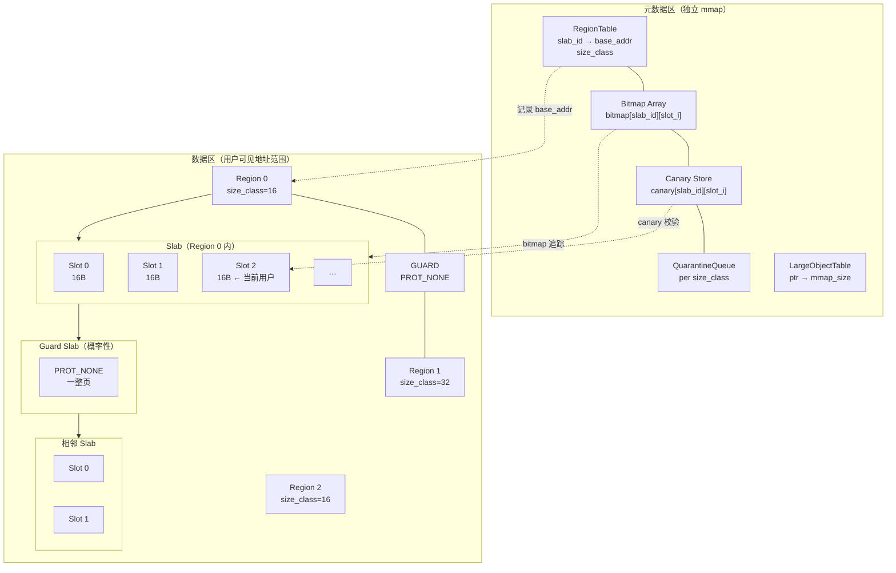
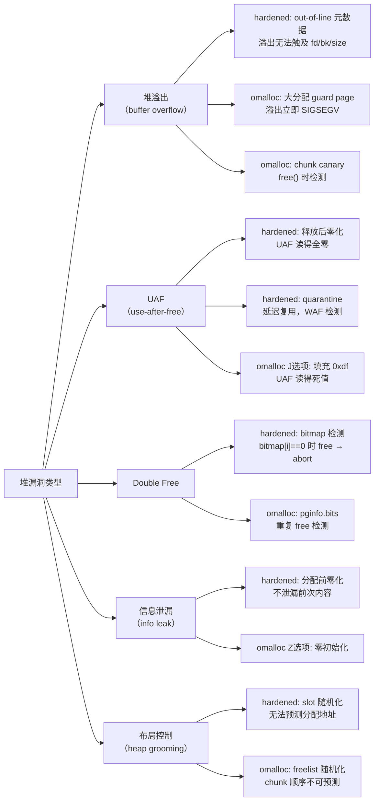

---
tags:
  - 内存管理
  - 堆分配器
  - tier3
  - 安全加固
---
# 硬化分配器：hardened_malloc 与 OpenBSD malloc

> [!abstract] TL;DR
> 硬化分配器（Hardened Allocator）是以安全性为第一目标而设计的内存分配器，通过隔离元数据、随机化布局、延迟释放、canary 检测等手段，从根本上提高堆漏洞的利用难度。hardened_malloc（GrapheneOS 项目，Daniel Micay 主导）和 OpenBSD malloc（omalloc）是该领域最具代表性的两个实现。前者将 size class 隔离、out-of-line 元数据、slab-level guard page 精密结合，主攻 Android 高安全场景；后者以页级页分配+chunk canary+junk 填充+per-slab guard page 为核心，是 OpenBSD 系统安全哲学的具体体现。两者共同构成"以分配器本身作为防御纵深"这一设计范式，与攻击侧的堆利用手法（House of 系列等）形成直接对抗。

## 概述与定位

### 为什么需要硬化分配器

传统通用分配器（ptmalloc、tcmalloc、jemalloc）的设计目标是吞吐量与碎片率，元数据（size、fd/bk 指针、arena 状态）通常与用户数据共存于同一内存区域，或紧邻用户数据存放。这一布局带来了两类根本性问题。

第一类是**元数据可被用户数据损坏**：堆溢出（heap buffer overflow）一字节即可改写相邻 chunk 的 size 字段或 fd/bk 指针，导致后续分配返回任意地址。ptmalloc 的 House of Spirit、House of Force 等手法无一不依赖这一特性。tcache 的 key 字段（防 double-free）在 glibc 2.34 以后改为对指针做 PROTECT_PTR 混淆，说明即便是最被广泛部署的分配器也在事后打补丁。

第二类是**释放行为可被观察与预测**：未经随机化的 freelist 意味着攻击者在受控泄漏后能精确预测下一次分配的地址，为 ASLR 旁路提供了稳定的泄漏原语。

硬化分配器的思路是在设计阶段就将安全性内化为第一约束，允许为此付出一定的内存开销和性能损耗。

### 谱系与历史

- **OpenBSD malloc（omalloc）**：Poul-Henning Kamp 于 1995 年为 FreeBSD 设计，OpenBSD 团队后来大幅改写，在 OpenBSD 3.8（2005）引入 page-level guard、在后续版本逐步增加 junk 填充、canary、freelist 随机化。omalloc 是 OpenBSD 系统安全哲学的直接产物——"简单正确优于复杂快速"。

- **hardened_malloc**：GrapheneOS（原 CopperheadOS）项目，Daniel Micay 于 2018 年前后发布，目标是在 Android/Linux 上提供可直接 `LD_PRELOAD` 替换的生产级硬化分配器。代码库托管于 GitHub，采用 ISC 许可证，分为 `light`（默认，平衡性能与安全）和 `strong`（最高安全，更高开销）两种配置。

- **Scudo**（对比参照）：LLVM 项目下的安全分配器，Android 8.0+ 取代 jemalloc 成为 Bionic 默认分配器。设计思路与 hardened_malloc 有交叉，但更注重与 LLVM 工具链集成，安全级别略低于 hardened_malloc 的 `strong` 模式。

### 定位对比矩阵

| 维度 | ptmalloc | jemalloc | hardened_malloc (light) | hardened_malloc (strong) | omalloc |
|---|---|---|---|---|---|
| 元数据位置 | 行内（chunk 头） | 部分行外 | 全部行外 | 全部行外 | 行外（单独映射） |
| size class 隔离 | 无 | 有（slab 级） | 有（slab 级+类间隔离） | 有（更严格） | 页级别 |
| guard page | 无 | 可选 | 每 slab 有概率性 | 更高频率 | 强制，每类 |
| canary | 无 | 无 | 有（slot canary） | 有 | 有（chunk canary） |
| junk 填充 | 无 | 可选 | 零化 | 零化 | 可选（J 选项） |
| 延迟释放 | 无 | quarantine | 有 | 有（更大 quarantine） | 随机化 freelist |
| 相对吞吐量 | 100% | 95–110% | 约 85% | 约 70% | 约 80% |
| 典型场景 | Linux 通用 | 服务端高吞吐 | Android 用户态 | 安全关键进程 | OpenBSD 系统库 |

## 原理与机制

### hardened_malloc 的核心设计原理

#### 1. size class 隔离与三级结构

hardened_malloc 将所有分配按大小映射到离散的 size class（如 16、32、48、64……字节，共数十档），每个 size class 有专属的 slab。不同 size class 的 slab **永不共享物理或虚拟页**，这意味着：

- 攻击者无法通过同一个 slab 中的溢出影响其他 size class 的对象。
- 即便获得对某 slab 的完全控制，也仅能影响同 size class 的分配，无法跨类劫持任意对象。

三级结构具体为：

```
Region（粒度：固定倍数的大页对齐区域）
 └── Slab（粒度：若干物理页，对应一个 size class）
      └── Slot（粒度：一个 size class 的分配单元）
```

Region 通过 `mmap(MAP_ANONYMOUS)` 一次性映射大块虚拟地址，slab 在 region 内按需激活，slot 是最终分配给用户的内存单元。

#### 2. out-of-line 元数据分离

这是 hardened_malloc 与 ptmalloc 最根本的架构差异。所有描述堆状态的元数据——slab 状态位图（哪些 slot 已分配）、size class 映射、quarantine 队列、canary 值——都存储在**与用户数据完全分离的虚拟地址空间区域**，由专门的内部映射管理，用户代码无法通过线性溢出到达。

具体来说：
- 每个 slab 的分配位图（bitmap）存储在专用的元数据页，与 slab 数据页无相邻关系。
- slot 的 canary 存储在元数据结构中，而非 slot 自身的边界字节（否则溢出即可覆盖 canary）。
- 指向 freelist 的指针存在元数据区，不存在 slot 的前几字节（不同于 ptmalloc 的 fd/bk 行内存储）。

这一设计使得线性溢出、读越界等经典堆漏洞无法直接触及分配器状态。

#### 3. 随机化机制

hardened_malloc 在两个层面引入随机化：

**分配顺序随机化（slot 随机化）**：在一个 slab 内，可用 slot 不以线性顺序分配，而是通过内部随机数生成器（使用 `getrandom()` 初始化的 ChaCha8）决定分配哪个 slot。攻击者即便知道某次分配的地址，也无法预测同 size class 下一次分配的位置，有效对抗"spray and pray"。

**chunk 内随机偏移**：对于较大的分配，在对象起始位置前添加随机数量的无用字节（padding），使对象在 slab 内的精确位置具有不可预测性。

#### 4. guard slab 与 guard page

在 slab 层面，hardened_malloc 以一定概率（`light` 模式约 1/8，`strong` 模式更高）在相邻 slab 之间插入整页大小的 guard page（`PROT_NONE`）。这与 Linux 标准栈 guard page 机制相同：任何越界访问都会立即触发 SIGSEGV，而不是静默损坏相邻数据。

对于小 size class（16 字节等），guard slab 机制会产生显著的虚拟地址碎片化，`strong` 模式通过更频繁的 guard 插入换取更高安全性。

#### 5. delayed free（quarantine 队列）

释放的 slot 不立即重新进入可分配池，而是进入一个大小受限的 quarantine 队列。只有当 quarantine 满时，最旧的条目才会真正归还给 slab。这一机制对抗 **use-after-free**：在 quarantine 期间，slot 的内容已被零化（见下文），即便存在 UAF 读，也只能读到全零；更重要的是，slot 在 quarantine 期间不会被重新分配，因此 UAF 写无法立即影响新对象。

#### 6. 零化与 write-after-free 检测

- **分配前零化（zero-on-alloc）**：每次从 slab 分配 slot 前，将 slot 内容清零（`memset(slot, 0, size)`）。用户获得的内存始终为零初始化状态，避免信息泄漏（泄漏前次分配的内容）。

- **释放时零化（zero-on-free）**：`free()` 被调用时，slot 内容立即清零，然后进入 quarantine。即便 UAF 读发生在 quarantine 期间，也只能读到全零。

- **write-after-free 检测**：对于 `strong` 模式，从 quarantine 取出 slot 归还给 slab 时，会验证 slot 内容是否仍为全零。若非零，说明发生了 write-after-free，立即中止进程（`abort()`）。这是一种采样式检测，不保证每次都能发现，但能以极低开销捕获明显的 WAF。

#### 7. slot canary

每个已释放 slot 的 canary（存储在 out-of-line 元数据中）在分配时被写入 slot 边界，在释放时校验。若 canary 不匹配，说明发生了写越界，进程立即终止。由于 canary 值存在元数据区而非 slot 自身，攻击者无法通过读取 slot 内容获知 canary 值来绕过检测。

### OpenBSD malloc（omalloc）的核心设计原理

omalloc 的设计更为保守，紧密依赖操作系统提供的 `mmap`/`munmap` 原语，以页为基本操作单位。

#### 1. 两级结构：page 与 chunk

omalloc 将分配分为两类：

- **大分配（>= 1 页，通常 >= 4096 字节）**：直接以页粒度调用 `mmap(MAP_ANON | MAP_PRIVATE)` 分配，前后各附加 guard page（`PROT_NONE`）。每次大分配都有自己的独立映射，完全隔离。

- **小分配（< 1 页）**：在 page（4096 字节）内进一步细分为等大的 chunk，同一 page 内所有 chunk 大小相同（类似 size class 隔离）。

所有 page 的元数据（`struct pginfo`）存储在专用的 `struct dir`（directory）中，与用户数据分离。

#### 2. chunk canary

对于小分配，每个 chunk 尾部（或头部，取决于配置）存储一个 canary 字节或字。canary 值由 `arc4random()` 初始化，在释放时校验。任何写越界覆盖 canary 都会在 `free()` 时被检测到，进程调用 `wrterr()` 并中止。

#### 3. junk 填充（J 选项）

通过 `malloc.conf` 设置 `J`（junk）选项后：
- 分配时将 slot 内容填充为 `0xd0`（"dirty"标记值），而非清零，目的是暴露未初始化读（读到 `0xd0` 的代码往往会产生异常）。
- 释放时将 slot 内容填充为 `0xdf`（"dead"标记值），UAF 读会得到 `0xdf` 填充的内存，而非有效数据，更容易被检测到。

注意这与 hardened_malloc 的零化策略不同：omalloc 默认不清零（节省开销），junk 填充是可选的调试/安全加固选项。在生产环境中，OpenBSD 的某些安全关键进程（如 `sshd`）会通过 `mallopt()` 或环境变量激活 junk 填充。

#### 4. guard page（G 选项）

`malloc.conf` 的 `G` 选项（guard page）在每个分配出的 page（无论大小分配）前后追加 `PROT_NONE` 的 guard page。代价是每次分配都会消耗额外的虚拟地址空间和 mmap 系统调用，但对溢出的检测是即时且精确的。

默认情况下，大分配（整页）始终有 guard page；小分配的 guard page 通过 `G` 选项控制。

#### 5. freelist 随机化

omalloc 的 page 内 chunk freelist 不按线性顺序组织，而是在初始化 page 时以随机顺序排列所有 chunk。这使得攻击者无法通过分配/释放序列预测下一次分配的地址，对 heap grooming 攻击（通过精心控制分配顺序使特定对象布局满足利用条件）有显著对抗效果。

#### 6. malloc.conf 选项全览

OpenBSD 的 `malloc.conf` 是配置 omalloc 行为的标准接口，可通过文件（`/etc/malloc.conf`）、符号链接（`/etc/malloc.conf -> /usr/local/etc/malloc.conf` 指向包含选项字符串的文件名）或环境变量（`MALLOC_OPTIONS`）设置。

| 选项字符 | 含义 | 默认状态 |
|---|---|---|
| `G` | guard page，每分配页前后各加 PROT_NONE 页 | 大分配默认开，小分配需手动开 |
| `J` | junk 填充（分配 0xd0，释放 0xdf） | 关 |
| `R` | realloc 始终分配新区域，不尝试就地扩展 | 关 |
| `S` | "strong"模式，等价于 `CFG` 组合 | 关 |
| `U` | unlocked，禁用互斥锁（单线程专用） | 关 |
| `X` | 分配失败时调用 `abort()` 而非返回 NULL | 关 |
| `Z` | 零初始化所有分配（类似 `calloc`） | 关 |
| `F` | freelist 随机化（进一步增强） | 部分默认 |
| `H` | free 后立即调用 `munmap` 归还物理内存 | 关 |
| `<n>` | 调整 page cache 大小（数字） | 16 |

小写选项字母表示禁用对应特性（如 `j` 禁用 junk 填充）。

## 结构/算法/伪代码详解

### hardened_malloc 分配流程

```
hardened_malloc(size):
  1. 规范化 size 到最近的 size class → sc
  
  2. 若 size > LARGE_THRESHOLD（通常 >= 128KB）：
       直接 mmap(NULL, size + guard_padding, PROT_READ|PROT_WRITE, ...)
       记录映射到 large_object_table（out-of-line 元数据）
       返回对齐后的用户指针
  
  3. 获取当前线程的 size class sc 对应的 thread_local slab 指针
  
  4. 若 thread_local slab 无可用 slot：
       从 region 中激活新 slab（或分配新 region）
       以 PROT_NONE 设置相邻 guard slab（概率性，基于随机数）
       初始化 slab 元数据（bitmap 全清零，canary 值随机生成）
  
  5. 从 slab 的 random_free_list 取出随机 slot index i：
       random_free_list 由 ChaCha8 PRNG 洗牌维护
       bitmap[i] = 1（标记已分配）
  
  6. 计算 slot 地址：slot_ptr = slab_base + i * sc.size
     （加随机 padding 若启用 chunk 内偏移）
  
  7. 将 slot 内容零化（memset(slot_ptr, 0, sc.size)）
  
  8. 在 out-of-line 元数据中记录：
       slot_canary[slab_id][i] = random_canary_value（XOR slot_ptr）
  
  9. 返回 slot_ptr
```

### hardened_malloc 释放流程

```
hardened_free(ptr):
  1. 在 large_object_table 中查找 ptr → 若找到，munmap 大对象，返回
  
  2. 根据 ptr 定位所在 slab 及 slot index i：
       通过 region 元数据二分查找（O(log n) in region table）
  
  3. 检查 bitmap[i] == 1（已分配），否则 abort()（double-free 检测）
  
  4. 从 out-of-line 元数据取出 slot_canary[slab_id][i]
     校验 *(ptr + sc.size - sizeof(canary)) == slot_canary（若 canary 置于 slot 内）
     或通过元数据比对（取决于具体实现），不匹配则 abort()
  
  5. 零化 slot 内容（memset(ptr, 0, sc.size)）
  
  6. 将 ptr 加入 quarantine 队列（size class 对应队列的尾部）
     bitmap[i] 保持 1（slot 在 quarantine 期间逻辑上仍"已分配"）
  
  7. 若 quarantine 队列长度 > QUARANTINE_LIMIT：
       从队列头部取出最旧的 slot_old
       若 strong 模式：验证 slot_old 内容全为零（write-after-free 检测）
                        不为零则 abort()
       bitmap[old_i] = 0（slot 真正回到可分配状态）
       将 old_i 插入 random_free_list
```

### omalloc chunk 分配（小分配路径）

```
omalloc_small(size):
  1. 规范化 size → chunk_size（向上取整到 2 的幂或固定档位）
  
  2. 在 dir（page directory）中查找有空闲 chunk 的 pginfo，
     pginfo.type == chunk_size
  
  3. 若无合适 pginfo：
       新建 pginfo：
         mmap 一个新 page（可选前后加 guard page if G 选项）
         初始化 chunk freelist：将 page 内所有 chunk 按随机顺序链入 freelist
         （arc4random_buf 洗牌）
         在 dir 中注册 pginfo（与 page 的数据地址分离存储）
  
  4. 从 pginfo.freelist 取出第一个 chunk（随机顺序中的下一个）
     更新 pginfo.bits（位图标记已分配）
  
  5. 若 J 选项：memset(chunk, 0xd0, chunk_size)
     若 Z 选项：memset(chunk, 0x00, chunk_size)
  
  6. 在 chunk 末尾写入 canary（由 arc4random() 生成，记录于 pginfo）
  
  7. 返回 chunk 指针
```

### Mermaid：hardened_malloc 内存布局



### Mermaid：hardened_malloc vs omalloc 防御机制对比流



## 工具视角与实战

### 部署 hardened_malloc

**Android（GrapheneOS）**：hardened_malloc 已内置为系统默认分配器，无需额外配置。非 GrapheneOS Android 可通过编译源码生成 `.so` 并设置 `LD_PRELOAD` 测试，但 Bionic 的某些接口（如 `android_mallopt`）需要适配。

**Linux 通用环境**：

```bash
# 克隆并编译
git clone https://github.com/GrapheneOS/hardened_malloc
cd hardened_malloc
# light 模式（默认，平衡性能与安全）
make CONFIG_LIGHT=true
# 或 strong 模式
make

# LD_PRELOAD 方式加载
LD_PRELOAD=/path/to/libhardened_malloc.so ./your_program

# 全局系统替换（不推荐生产环境直接操作）
# 在 /etc/ld.so.preload 中添加路径
```

**配置文件 `hardened_malloc.conf`**（`/etc/hardened_malloc.conf` 或通过环境变量 `HARDENED_MALLOC_CONFIG` 指定）：

```ini
# 关键配置项（light 模式默认值）
SLAB_QUARANTINE_RANDOM_LENGTH=1   # quarantine 随机弹出长度
SLAB_QUARANTINE_QUEUE_LENGTH=16   # quarantine 队列最大长度
ZERO_ON_FREE=true                 # 释放时零化
WRITE_AFTER_FREE_CHECK=false      # WAF 检测（light 关，strong 开）
GUARD_SLABS_INTERVAL=1            # 每 N 个 slab 插入一个 guard slab（1=每个都有，数越小越安全）
GUARD_SIZE_DIVISOR=2              # guard slab 相对普通 slab 的大小比
SLOT_RANDOMIZE=true               # slot 分配随机化
CANARY=true                       # slot canary（strong 模式）
```

### 部署 OpenBSD malloc

omalloc 是 OpenBSD 的系统 libc 组成部分，默认使用。配置方式：

```bash
# 方式1：符号链接 /etc/malloc.conf -> 选项字符串为文件名
ln -s 'GJ' /etc/malloc.conf    # 开启 guard page 和 junk 填充

# 方式2：环境变量（进程级别）
MALLOC_OPTIONS=GJS ./your_program  # G=guard, J=junk, S=strong

# 方式3：进程内调用
# setenv("MALLOC_OPTIONS", "GJ", 1); 在 main() 早期
# 注意：必须在第一次 malloc 之前设置

# 查看当前选项（OpenBSD 特有）
sysctl hw.physmem  # 间接了解内存资源
```

在 FreeBSD 和 macOS 上可以编译使用 jemalloc 的安全变体，但 omalloc 本身只在 OpenBSD 上原生可用。需要在其他平台使用类似功能，可考虑 hardened_malloc 或 Scudo。

### 调试与检测集成

**与 ASan 的配合**：hardened_malloc 和 ASan 通常互斥（ASan 自己 hook `malloc`），不建议同时使用。在开发阶段用 ASan 检测，生产部署用 hardened_malloc。

**与 GDB 调试**：由于元数据在外部，GDB 的 `heap` 命令（pwndbg/peda 扩展）无法解析 hardened_malloc 的堆结构。需要直接读取 `/proc/<pid>/maps` 定位各 region，并在源码层面了解元数据结构。

**崩溃分析**：hardened_malloc 检测到违规后调用 `abort()`，产生的 core dump 中 `pc` 指向 `abort` 内部，需检查调用栈（`bt` 命令）回溯到实际检测点。关键字符串如 `fatal allocator error` 会输出到 stderr。

**性能基准**：

```bash
# 使用 malloc-bench 套件对比
git clone https://github.com/nicowillis/malloc-bench
cd malloc-bench
# 对比 ptmalloc vs hardened_malloc
LD_PRELOAD=/path/to/libhardened_malloc.so ./threadtest 4 1000000 1 100 8
```

典型结果（仅供参考，依硬件和工作负载差异较大）：
- 大量小对象分配（< 64B）：hardened_malloc light 比 ptmalloc 慢约 15–25%
- 大对象分配（> 4KB）：差异较小（< 10%），因均走 mmap 路径
- 多线程高并发：hardened_malloc 的 per-thread 设计在线程数适中时表现良好，但在极高并发下（> 64 线程）因 region 锁竞争可能退化

### 在安全研究中的意义

对渗透测试和漏洞研究者而言，面对 hardened_malloc 保护的进程时，传统的堆利用路径几乎完全失效：

- **无法行内修改元数据**：溢出改不到 fd/bk/size，House of 系列失效。
- **无法预测分配地址**：slot 随机化使地址预测需要真实的信息泄漏原语，而零化又消除了最常见的泄漏来源。
- **double-free 立即检测**：bitmap 检测无延迟，无法利用 double-free 构造重叠 chunk。
- **UAF 读获益大幅降低**：零化使读到的内容为零，无法通过 UAF 读获取指针值。
- **WAF 有概率被检测**：strong 模式下 write-after-free 在 slot 重新分配时会被校验。

有效的绕过思路（理论上）通常需要多个原语的组合：任意内存写（非堆溢出）+ 元数据区地址泄漏 + 对随机数生成器的预测（实际不可行）。这也是硬化分配器设计的终极目标：将利用代价提高到不切实际的程度。

## 安全性与正确使用

### 硬化设计的本质权衡

硬化分配器的设计哲学可以用一句话概括：**用空间开销和性能开销换取安全性，将漏洞利用的难度提高到工程上不可行的程度**。理解这一权衡是正确使用硬化分配器的前提。

**内存开销分析**：

硬化分配器的额外内存开销来自三个方面：
1. **out-of-line 元数据**：存储 bitmap、canary、region 表等结构。对于大量小对象的程序，元数据大小可能达到用户数据的 5–15%。
2. **guard page**：每个 guard slab 或 guard page 消耗一页虚拟地址（通常不消耗物理内存，因为 `PROT_NONE` 页不会被实际映射），但会增加 VMA 数量，在 `/proc/<pid>/maps` 中留下大量条目，可能触达内核的 `vm.max_map_count` 限制。
3. **quarantine**：处于 quarantine 状态的 slot 的物理内存无法被立即复用，对于高分配/释放速率的程序，quarantine 队列本身就是一种内存保留。

实践中，内存密集型服务器程序（如 Redis、Nginx）在 `light` 模式下内存开销增加约 10–20%，`strong` 模式可能达 30–50%。

**性能开销分析**：

- **零化开销**：每次 `malloc()` 和 `free()` 都有 `memset`，对于频繁分配小对象的路径，额外带宽开销显著。modern CPU 的 `rep stosd` 指令使小对象零化效率较高（约 1–4 纳秒每 64 字节），但高并发路径下积累显著。
- **随机数生成**：ChaCha8 PRNG 速度较快（约 1–2 纳秒每调用），但仍非零开销。
- **元数据查找**：`free()` 时需通过 region 表定位 slab，是对数时间查找，比 ptmalloc 的 O(1) chunk header 读取慢。
- **系统调用**：omalloc 的 `H` 选项（立即 `munmap`）会显著增加系统调用频率；hardened_malloc 通过 region 机制复用映射，减少了系统调用次数。

### 适用场景指导

**强烈推荐使用硬化分配器的场景**：
- 处理不可信输入的安全关键进程（如 VPN 网关、TLS 终结点、浏览器沙箱）
- 高权限系统守护进程（`sshd`、`dbus-daemon`、`systemd` 核心组件）
- 移动端用户数据隔离场景（GrapheneOS 的 per-app 隔离）
- 嵌入式安全设备（路由器固件、HSM 软件层）

**不适合的场景**：
- 吞吐量敏感的高频分配路径（高频交易、实时音视频编解码内循环）
- 已有严格内存安全语言保证的环境（Rust 程序通常不需要额外的分配器加固）
- 调试/开发阶段（ASan 提供更丰富的诊断信息，更适合开发时使用）

### 部署注意事项

**libc 版本兼容性**：hardened_malloc 通过 `LD_PRELOAD` 覆盖 `malloc`/`free`/`realloc`/`calloc`，但某些分配器扩展接口（如 glibc 的 `malloc_usable_size`、`malloc_stats`、`mallinfo`）行为可能与预期不同，需检查应用是否依赖这些接口。

**POSIX `malloc_trim` 和 `mallopt`**：hardened_malloc 实现了这些接口但语义可能不同（如 `malloc_trim` 可能是 no-op），应用不应依赖其具体行为进行内存归还操作。

**`vm.max_map_count` 调整**：大量使用硬化分配器的容器环境可能因 guard page 导致进程 VMA 数超过内核默认限制（65530），需提前调整：
```bash
sysctl -w vm.max_map_count=262144
```

**与 seccomp 沙箱配合**：hardened_malloc 在初始化时会调用 `mmap`、`mprotect`、`getrandom` 等系统调用；若应用有严格的 seccomp 白名单，需将这些调用加入允许列表，通常在初始化完成后再激活 seccomp 过滤器。

**OpenBSD 生产环境最佳实践**：
- 对安全关键守护进程（通过 rc.conf 设置 `daemon_env`）默认启用 `S`（strong）选项。
- 对内存受限系统，避免同时启用 `G`（guard）和 `J`（junk），选择其一。
- 定期检查 `/var/log/messages` 中的 `malloc` 错误输出，任何 `malloc: ...` 前缀的错误都应被视为潜在安全事件。

### 与现代加固生态的协同

hardened_malloc 并非孤立的防御手段，在完整的加固部署中，通常与以下机制协同：

- **CFI（Control Flow Integrity）**：限制代码指针的合法取值范围。即便攻击者通过某种方式获得了写原语，CFI 限制了可跳转的目标地址，使 ROP 链构建更困难。
- **ASLR + PIE**：地址随机化与 hardened_malloc 的分配随机化形成多层随机，进一步增加地址预测难度。
- **Stack canary**：保护栈溢出，与堆 canary 互补。
- **MTE（Memory Tagging Extension，ARMv8.5+）**：硬件级别的标签检测，GrapheneOS 在支持 MTE 的设备上将 hardened_malloc 的 canary 与 MTE 协同使用，实现更低开销的越界检测。

## 小结

hardened_malloc 和 OpenBSD malloc 代表了"以分配器本身为防御纵深"这一设计范式的最高水准。两者的核心思路可以归纳为四个层面：

1. **隔离**：元数据与用户数据的物理分离，size class 之间的虚拟地址隔离，使单点漏洞无法波及分配器状态。

2. **随机化**：分配顺序随机化、freelist 随机化消除了堆布局的可预测性，使需要精确地址控制的利用手法从确定性变为概率性（且概率极低）。

3. **检测**：canary 校验、bitmap double-free 检测、write-after-free 验证覆盖了堆漏洞利用的三个关键操作（写越界、重复释放、UAF 写），在分配器层面形成早期告警。

4. **净化**：零化（hardened_malloc）和 junk 填充（omalloc）消除了信息泄漏的最主要来源，使攻击者无法通过 UAF 读或未初始化读获取泄漏的指针值。

与传统分配器相比，这四点能力的代价是 10–30% 的性能损耗和 10–50% 的额外内存开销，在安全关键场景下这是完全值得的取舍。随着 MTE 等硬件安全扩展的普及，硬化分配器的检测能力将进一步提升，而性能开销将进一步降低，最终使"默认使用硬化分配器"成为常态。

## 相关阅读

- GrapheneOS hardened_malloc 源码：`https://github.com/GrapheneOS/hardened_malloc`（重点阅读 `malloc.c`、`size_classes.h`、`config.h`）
- OpenBSD malloc 源码：`src/lib/libc/stdlib/malloc.c`（可在 `https://cvsweb.openbsd.org` 查阅）
- Daniel Micay，"Secure Memory Allocator"，GrapheneOS 博客（2018）：关于 hardened_malloc 设计决策的一手资料
- Otto Moerbeek，"A New malloc(3) for OpenBSD"，BSDCan 2009：omalloc 架构设计的原始论文
- Qualys Security Advisory，"CVE-2022-23648 — containerd CRI plugin"：演示 hardened_malloc 如何阻断实际 CVE 利用路径的案例分析
- Android Scudo 官方文档：`https://source.android.com/docs/security/test/scudo`（与 hardened_malloc 的设计对比参考）
- "The Heap: Exploitation Mitigations and Bypasses" by Azeria Labs：从攻击视角分析各硬化分配器的防御效果与潜在弱点
- glibc tcache safe-linking 设计文档（glibc 2.32 release notes）：理解主流分配器向硬化方向演进的轨迹

---

[[00.内存管理与堆分配器总览|⬆ 系列总览]] | [[17.堆利用手法体系House_of系列|← 上一章]] | [[19.NUMA内存架构与分配策略|→ 下一章]]
