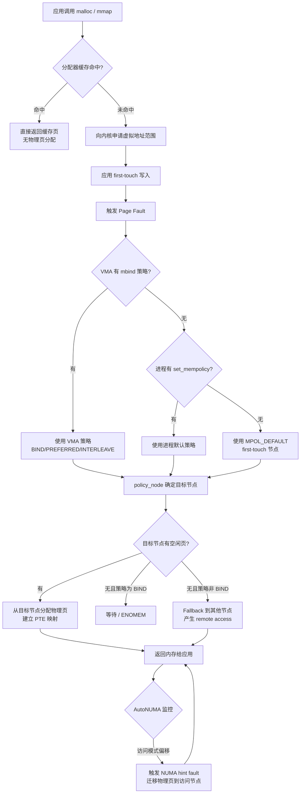

---
tags:
  - 内存管理
  - tier3
  - NUMA
  - 性能
---
# NUMA 内存架构与分配策略

> [!abstract] TL;DR
> NUMA（Non-Uniform Memory Access）是现代多路服务器的标配内存架构：每颗物理 CPU 拥有本地内存节点，跨节点访问（remote access）经由 QPI/UPI 互联，延迟高出本地访问 30%–100%，带宽也更窄。Linux 内核以 first-touch 策略为基础，通过 `mmap`/`mbind`/`set_mempolicy` 等系统调用、`numactl` 命令行工具和内核 AutoNUMA 自动页迁移机制，将内存绑定到最优节点。jemalloc/tcmalloc 进一步在用户态实现 per-node arena，使高并发分配天然对齐 NUMA 拓扑。误配置（错误 interleave、跨节点抖动、大页 + NUMA 冲突）是数据库与 HPC 场景最常见的隐性性能杀手，需配合 `numastat`、`/proc/<pid>/numa_maps`、`perf mem` 进行定量分析再调优。

## 概述与定位

### 从 UMA 到 NUMA：为什么内存也有"远近"

传统单路服务器（或早期多路服务器）采用 UMA（Uniform Memory Access）架构：所有 CPU 核心通过共享总线访问同一内存控制器，访问延迟一致。这一设计在核心数较少时足够简单高效。

随着单路核心数从 4 增长到 64（AMD EPYC）乃至 128，单一总线成为严重瓶颈。工业界的解法是为每颗物理 CPU（socket）配备独立的内存控制器与本地 DRAM，CPU 之间通过专用高速互联（Intel 的 QPI/UPI，AMD 的 Infinity Fabric）交换数据。这就是 NUMA 架构：内存访问的延迟不再一致——访问本 socket 挂载的 DRAM 速度快（local access），访问其他 socket 的 DRAM 必须经过互联总线（remote access），延迟显著更高。

NUMA 的核心矛盾是：**操作系统和用户程序仍然看到一个统一的虚拟地址空间，但底层的物理内存被分割在不同的节点上**，分配在哪个节点直接决定运行时访问延迟。这一"透明但有代价"的特性，是 NUMA 调优如此复杂的根本原因。

### NUMA 的典型应用场景

NUMA 调优最能体现价值的场景包括：

- **数据库**：PostgreSQL/MySQL 的共享缓冲池、Oracle SGA（System Global Area）都是大块连续内存，若分配在错误节点，查询线程每次缓存命中都会产生跨节点访问。
- **HPC/科学计算**：MPI 进程间通信、矩阵运算的访问模式高度局部化，将进程及其数据绑定在同一 NUMA 节点可线性提升带宽。
- **Java/Go 运行时**：GC 堆往往由单一线程或多线程分配，若堆跨越多个节点而 GC 线程固定在某节点，扫描代价翻倍。
- **内核网络栈**：NIC 的 DMA 内存与处理网络中断的 CPU 核心应在同一节点，否则每次 sk_buff 处理都走远端内存。

## 原理与机制

### NUMA 拓扑：节点、互联与延迟数字

一个典型的双路服务器（2-socket Intel Xeon）NUMA 拓扑如下：

```
Socket 0 (Node 0)           Socket 1 (Node 1)
┌─────────────────────┐     ┌─────────────────────┐
│  Core 0–15          │     │  Core 16–31          │
│  L1/L2/L3 Cache     │─────│  L1/L2/L3 Cache     │
│  IMC (内存控制器)    │ UPI │  IMC (内存控制器)    │
│  DDR4/DDR5 CH 0–4   │     │  DDR4/DDR5 CH 0–4   │
│  本地内存 (64–256GB) │     │  本地内存 (64–256GB) │
└─────────────────────┘     └─────────────────────┘
```

典型延迟数字（Intel Xeon Scalable 第三代，DRAM-to-L1 往返）：

| 访问类型 | 延迟（ns） | 备注 |
|---|---|---|
| L1 Cache 命中 | ~4 | 本 core |
| L3 Cache 命中（本地节点） | ~30–40 | 跨核共享 |
| 本地 DRAM（local）| ~70–90 | IMC 直连 |
| 远端 DRAM（remote，1 跳 UPI）| ~130–150 | 经 UPI 2.0 ~10.4 GT/s |
| 远端 DRAM（remote，2 跳，4 路服务器）| ~200–250 | 两次 UPI 转发 |

对 4 路及以上服务器，节点间拓扑可能是 mesh（全连接）或环形，"远端"不再唯一，需用 `numactl --hardware` 查看各节点之间的 NUMA distance 矩阵。NUMA distance 的单位由 BIOS 厂商定义，通常本地为 10，单跳远端为 21，两跳为 31。

### AMD EPYC 的 NUMA 复杂性：CCD 与 sub-NUMA cluster

AMD EPYC（Milan、Genoa）采用 chiplet 架构，每颗 socket 内部有多个 CCD（Core Complex Die），每个 CCD 含 8 个核心与独立的 L3 cache。Infinity Fabric 将多个 CCD 连接到共享的内存控制器（位于 cIOD，中央 I/O Die）。

这一架构带来了**socket 内部的 NUMA**：同一 socket 内不同 CCD 的核心，访问同一内存控制器的延迟差异约 10–20 ns，远小于跨 socket 延迟，但在追求极致性能时同样不可忽视。Linux 内核在 EPYC 上会将单个 socket 暴露为多个 NUMA node（取决于内核配置与固件设置，可能是 2 个或 4 个 node/socket），这是`numactl --hardware` 看到节点数超出预期的常见原因。

### first-touch 策略：物理页在何时、被分配到哪里

Linux 的虚拟内存是懒分配的：`mmap(MAP_ANONYMOUS)` 或 `malloc` 调用时，内核只分配虚拟地址范围，不立即映射物理页。**物理页的实际分配发生在第一次写访问触发缺页异常（page fault）时**，内核在缺页处理路径中从当前 CPU 所在的 NUMA 节点分配物理页——这就是 first-touch 策略。

first-touch 的含义：**哪个 CPU 核心第一次写某虚拟页，那个核心所在 NUMA 节点就持有该物理页**。

典型陷阱：如果主线程在 Node 0 分配（`malloc`）了一大块 buffer，然后将工作分派给绑定在 Node 1 的工作线程来"first-touch"初始化（`memset`），那么整块 buffer 的物理页将落在 Node 1，而后续若主线程在 Node 0 频繁读写这块 buffer，每次都是 remote access。

### 内存策略模型：mempolicy 的四种模式

Linux 通过 `mempolicy` 抽象控制物理页的节点分配行为，有四种核心策略：

**MPOL_DEFAULT（默认）**
使用 first-touch 规则，分配给触发缺页异常的 CPU 所在节点的本地内存。大多数程序在未调优时使用此策略。

**MPOL_BIND**
将分配严格限制在指定的节点集合（nodemask）内。若指定节点无可用内存，分配失败（返回 `ENOMEM`）或等待，而非 fallback 到其他节点。适合需要严格控制数据局部性、且能保证内存足够的场景。

**MPOL_PREFERRED**
优先从指定节点分配，若该节点内存不足，允许 fallback 到其他节点。比 BIND 宽松，适合"尽力而为"的本地优先。

**MPOL_INTERLEAVE**
轮询在指定的多个节点间交替分配页。牺牲单线程局部性，换取多线程并发访问时的聚合带宽（避免所有线程竞争同一节点的内存控制器）。适合内存带宽成为瓶颈、且访问模式无明显局部性的场景，如 memcached。

**MPOL_LOCAL（Linux 3.8+）**
明确指定使用 first-touch（local node）策略，与 DEFAULT 行为相似但语义更明确，不受进程级 mempolicy 覆盖的影响。

### 系统调用层：set_mempolicy、mbind、move_pages、get_mempolicy

```c
#include <numaif.h>

// 设置整个进程的默认内存策略
int set_mempolicy(int mode, const unsigned long *nodemask, unsigned long maxnode);

// 对特定虚拟地址范围设置内存策略（更细粒度）
int mbind(void *addr, unsigned long len, int mode,
          const unsigned long *nodemask, unsigned long maxnode,
          unsigned flags);

// 将已分配的页迁移到指定节点
int move_pages(pid_t pid, unsigned long count,
               void **pages, const int *nodes,
               int *status, int flags);

// 查询当前地址范围的内存策略
int get_mempolicy(int *mode, unsigned long *nodemask, unsigned long maxnode,
                  void *addr, unsigned long flags);
```

`mbind` 的 `flags` 参数中，`MPOL_MF_MOVE` 表示对已存在的物理页也立即迁移，`MPOL_MF_MOVE_ALL` 则尝试迁移所有页（含其他进程共享的匿名页）。

`move_pages` 是最底层的页迁移接口，可以逐页指定目标节点，是 AutoNUMA 和 `numactl --migrate-on-next-touch` 等高级机制的底层支撑。

### AutoNUMA（Automatic NUMA Balancing）

手动调优需要对访问模式有预先了解，而生产环境中进程的 NUMA 亲和性往往是动态的（线程迁移、负载均衡）。Linux 2.6.32 引入实验性支持，3.8 正式 merge 的 **AutoNUMA**（`/proc/sys/kernel/numa_balancing`，默认开启）提供了自动化的 NUMA 优化机制。

AutoNUMA 的工作流程：

1. **周期性 unmapping（NUMA hinting fault）**：内核扫描进程的页表，将已映射的匿名页的 PTE 临时设置为 prot_none（不可访问），但不真正解除映射（设置 `_PAGE_NUMA` 软件标记）。
2. **捕获访问**：当某 CPU 访问这些页时，触发 NUMA hint fault。内核在 fault handler 中记录哪个 CPU（哪个节点）访问了这一页。
3. **统计与迁移**：若某页被某节点的 CPU 频繁访问，内核将该页迁移到该节点的本地内存（通过 `move_pages`），同时尝试将对应的进程/线程也调度到持有该页的节点（task grouping）。
4. **周期重复**：以可调的时间间隔（`numa_balancing_scan_delay_ms`，默认 1000ms）重复扫描，持续跟踪访问模式的变化。

AutoNUMA 的代价：unmapping 操作增加了缺页处理开销，在访问模式稳定的 HPC 场景中可能产生 5%–10% 的额外开销。此时应关闭 AutoNUMA（`echo 0 > /proc/sys/kernel/numa_balancing`）并手动绑定。

AutoNUMA 与 `mbind(MPOL_BIND)` 存在冲突：`MPOL_BIND` 策略的页不会被 AutoNUMA 迁移（策略显式锁定了节点），这正是需要区分"手动调优"与"自动调优"的原因之一。

## 结构/算法/伪代码详解

### 内核 NUMA 分配路径

```
用户 malloc(size)
    │
    ▼
glibc/jemalloc 分配器（可能从 per-thread cache 直接返回）
    │ 无可用内存时
    ▼
mmap(MAP_ANONYMOUS) / brk → 获取虚拟地址范围
    │
    │  （物理页尚未分配）
    ▼
应用程序写入（first-touch 或 mbind 指定策略）
    │
    ▼
Page Fault → do_anonymous_page()
    │
    ├─ 查询 current->mempolicy（进程默认策略）
    ├─ 查询 VMA 的 vm_policy（mbind 设置的 VMA 级策略）
    │   优先级：VMA 策略 > 进程策略 > 系统默认
    │
    ▼
policy_node() → 确定目标 NUMA node
    │
    ▼
alloc_pages_node(nid, gfp_flags, order)
    │
    ├─ 若目标 node 有空闲页 → 从该 node 的 free_area[] 分配
    └─ 若目标 node 无空闲页 → 根据策略：
         BIND → 等待 / ENOMEM
         PREFERRED/DEFAULT → fallback 到其他 node（zone_reclaim）
```

### jemalloc 的 NUMA 感知：per-node arena

jemalloc 5.x 引入了显式的 NUMA 感知支持。其核心思想是将 arena（分配器的核心工作单元）与 NUMA 节点对应：

```
NUMA Topology (2 nodes):
  Node 0: CPUs 0–15
  Node 1: CPUs 16–31

jemalloc Arena 分配：
  arena 0  →  node 0 优先分配（由 CPU 0–15 的线程使用）
  arena 1  →  node 1 优先分配（由 CPU 16–31 的线程使用）
  arena 2+  →  通用 arena（large allocation / overflow）
```

jemalloc 通过 `MALLOC_CONF=narenas:N` 或 `je_malloc_conf` 配置 arena 数量，通过 `extent_hooks` 自定义 extent 分配函数，在 extent 分配时调用 `mbind` 将内存绑定到对应节点。

伪代码示意：

```c
// jemalloc extent_alloc hook（NUMA 感知版本）
void *numa_extent_alloc(extent_hooks_t *extent_hooks, void *new_addr,
                         size_t size, size_t alignment, bool *zero,
                         bool *commit, unsigned arena_ind) {
    int target_node = arena_to_node_map[arena_ind];  // arena 到节点映射
    
    void *ptr = mmap(new_addr, size,
                     PROT_READ|PROT_WRITE,
                     MAP_PRIVATE|MAP_ANONYMOUS, -1, 0);
    if (ptr == MAP_FAILED) return NULL;
    
    // 将这段虚拟内存绑定到目标 NUMA 节点
    unsigned long nodemask = 1UL << target_node;
    mbind(ptr, size, MPOL_BIND, &nodemask, sizeof(nodemask)*8,
          MPOL_MF_STRICT);
    
    return ptr;
}

// 线程初始化时将线程绑定到对应 arena
void thread_init_numa_aware() {
    int cpu = sched_getcpu();
    int node = numa_node_of_cpu(cpu);
    unsigned arena_ind = node_to_arena_map[node];
    
    // jemalloc 提供的线程级 arena 选择接口
    mallctl("thread.arena", NULL, NULL, &arena_ind, sizeof(arena_ind));
}
```

### tcmalloc 的 NUMA 处理：CpuCache 的局部性

tcmalloc（Google gperftools 以及新版 TCMalloc）的线程缓存（ThreadCache）和 CPU 缓存（CpuCache，per-logical-CPU 而非 per-thread）天然具备一定程度的 NUMA 局部性：绑定在同一 NUMA 节点的 CPU 核心上运行的线程，其 CpuCache 通常只从同一节点的内存分配 span。

但 tcmalloc 本身不直接调用 `mbind`，其 NUMA 感知依赖于两个前提：

1. 应用程序已通过 `numactl` 或 `sched_setaffinity` 将线程绑定到特定 CPU，使 first-touch 落在正确节点。
2. tcmalloc 从操作系统申请 span 时（`mmap`），物理页的分配遵循当前线程的 `mempolicy`。

因此在 tcmalloc 场景下，NUMA 调优更依赖操作系统层面的绑定，而非分配器本身的显式 NUMA 支持。

### 大页（HugePage）与 NUMA 的交互

Transparent HugePage（THP，2MB 大页）在 NUMA 环境下有特殊考量：

- THP 的物理帧必须对齐且连续（2MB 物理连续），这意味着它只能来自单一 NUMA 节点，**无法跨节点拼凑**。
- 当系统内存碎片化时，某节点可能无法提供 2MB 连续物理页，THP 回退到 4KB 页，局部性仍然保证，但大页带来的 TLB 压力缩减效益消失。
- `mbind(MPOL_INTERLEAVE)` + THP：两者语义冲突。INTERLEAVE 按页粒度轮询分配节点，而 THP 是 512 页的原子单元。内核行为是：THP 整体分配到某一节点（基于 first-touch 或 PREFERRED），INTERLEAVE 策略在 THP 内部无效。若强制 INTERLEAVE 用于大内存缓冲，建议先 `echo never > /sys/kernel/mm/transparent_hugepage/enabled` 禁用 THP，改用显式 `mmap(MAP_HUGETLB)` 并手动控制每块大页的节点。

### NUMA 分配流程 Mermaid 图



## 工具视角与实战

### numactl：拓扑查看与运行时绑定

`numactl` 是 NUMA 调优最常用的命令行工具，来自 `numactl` 包（Linux 发行版均有）。

**查看 NUMA 拓扑**：

```bash
numactl --hardware
```

典型输出（2-socket Intel Xeon）：

```
available: 2 nodes (0-1)
node 0 cpus: 0 1 2 3 4 5 6 7 8 9 10 11 12 13 14 15
node 0 size: 128782 MB
node 0 free: 87432 MB
node 1 cpus: 16 17 18 19 20 21 22 23 24 25 26 27 28 29 30 31
node 1 size: 128788 MB
node 1 free: 92015 MB
node distances:
node   0   1
  0:  10  21
  1:  21  10
```

`node distances` 矩阵中，本地访问代价为 10，跨节点代价为 21，意味着跨节点延迟约为本地的 2.1 倍。对 4 路服务器，距离矩阵会是 4×4，部分节点对之间可能为 31（两跳）。

**运行时绑定进程**：

```bash
# 将进程绑定到 Node 0 的 CPU 和内存
numactl --cpunodebind=0 --membind=0 ./myapp

# 只绑定内存（CPU 不限），内存交错分布于 0 和 1 节点
numactl --interleave=0,1 ./myapp

# 将 Node 0 的内存优先分配给进程，CPU 不限制
numactl --preferred=0 ./myapp

# 查看当前进程的 NUMA 策略
numactl --show
```

**迁移已有进程的内存**：

```bash
# 将 PID 1234 的内存从 Node 1 迁移到 Node 0（内核不一定立即执行）
numactl --migrate-on-next-touch --membind=0 -p 1234
```

### numastat：节点级内存统计

```bash
numastat
```

输出示例：

```
                           node0           node1
numa_hit               123456789        98765432
numa_miss               15234567         8765432
numa_foreign            8765432         15234567
interleave_hit           234567          234890
local_node             115000000        92000000
other_node              8456789         6765432
```

关键指标解读：

- `numa_hit`：在目标节点成功分配的次数（越高越好）
- `numa_miss`：因目标节点内存不足，fallback 到其他节点的次数（越低越好）
- `numa_foreign`：被其他节点的进程"借走"本节点内存的次数
- `local_node`：本地访问次数；`other_node`：远端访问次数

`numastat -p <pid>` 可查看特定进程的内存分布：

```bash
numastat -p 1234
```

```
Per-node process memory usage (in MBs) for PID 1234 (postgres)
         Node 0          Node 1           Total
Huge           0.00            0.00            0.00
Heap        1234.56          89.32         1323.88
Stack          0.12            0.00            0.12
Private      234.56         1890.32         2124.88
```

若某进程的 Heap 大量落在非本地节点，是调优的明确信号。

### /proc/\<pid\>/numa_maps：逐 VMA 的 NUMA 分布

`/proc/<pid>/numa_maps` 提供最细粒度的 NUMA 视图，每行对应一个 VMA：

```bash
cat /proc/1234/numa_maps
```

```
7f8a00000000 default anon=2048 dirty=2048 N0=1024 N1=1024 kernelpagesize_kB=4
7f8a00800000 bind:0 anon=4096 dirty=4096 N0=4096 kernelpagesize_kB=4
7f8a01000000 interleave:0-1 anon=512 dirty=512 N0=256 N1=256 kernelpagesize_kB=4
```

字段说明：

- `default/bind/interleave/prefer`：该 VMA 的内存策略
- `anon=N`：匿名页数量
- `N0=X N1=Y`：实际分布在各节点的页数（X+Y 可能小于 anon，差值是未 first-touch 的页）
- `kernelpagesize_kB=4`：页大小（若为 2048 则表示用了 THP）

当 `N0`/`N1` 分布与期望不符时，说明 first-touch 发生了偏差，需要排查初始化线程的 CPU 亲和性。

### perf mem：内存访问延迟采样

```bash
# 记录 30 秒内存访问事件
perf mem record -a -g -- sleep 30

# 分析报告（显示 local vs remote 访问比例）
perf mem report --sort=mem,sym,dso
```

`perf mem` 利用 Intel PEBS（Precise Event-Based Sampling）或 AMD IBS，能区分 L1/L2/L3 命中、local DRAM 命中和 remote DRAM 命中，是定量分析 NUMA miss 的最精确工具。

### 实战案例：PostgreSQL NUMA 调优

PostgreSQL 的 `shared_buffers` 是访问最频繁的内存区域，应尽量分配在 DB 主进程所在的 NUMA 节点。

**问题现象**：双路服务器，PG 进程分布在两个节点，`numastat -p $(pidof postgres | head -c5)` 显示 shared_buffers 的物理页 50% 在 Node 1，而大部分查询线程运行在 Node 0。查询 P99 延迟约为单节点时的 1.4 倍。

**调优步骤**：

```bash
# 步骤 1：将 PostgreSQL 主进程绑定到 Node 0 启动
numactl --cpunodebind=0 --membind=0 /usr/pgsql-15/bin/postgres -D /data/pgdata

# 步骤 2：验证 shared_buffers 分布
cat /proc/$(pidof postgres | awk '{print $1}')/numa_maps | grep -E "N0=|N1="

# 步骤 3：若仍有内存在 Node 1，检查 fork 时的 CPU 亲和性
# PostgreSQL fork 出 bgwriter/checkpointer 等辅助进程时可能已绑定到 Node 0
# 辅助进程继承父进程的 mempolicy，因此步骤 1 的绑定覆盖全部子进程
```

若使用 Patroni 等 HA 工具启动 PG，可在 `patroni.yml` 的 `bootstrap.pg_hba` 前增加 `numactl` 包装：

```yaml
postgresql:
  connect_address: 192.168.1.1:5432
  bin_dir: /usr/pgsql-15/bin
  parameters:
    shared_buffers: 32GB
# 使用 systemd 的 NumaPolicy= 或 ExecStartPre= numactl 包装
```

### 实战案例：HPC MPI 多进程 NUMA 绑定

在 MPI 应用中，每个 rank 通常绑定到特定核心，内存分配应严格对齐：

```bash
# OpenMPI：绑定 rank 到节点，并确保内存本地化
mpirun --bind-to socket --map-by socket \
       --mca rmaps_base_mapping_policy node \
       -np 4 ./hpc_app

# 或者使用 numactl 包装每个 rank（更精确）
mpirun -np 2 numactl --cpunodebind=0 --membind=0 ./hpc_app : \
       -np 2 numactl --cpunodebind=1 --membind=1 ./hpc_app
```

对内存带宽密集型应用，INTERLEAVE 有时比 BIND 表现更好：

```bash
# 内存带宽成为瓶颈时，交错分布打满双节点带宽
numactl --interleave=all ./bandwidth_heavy_app
```

### 内核参数：zone_reclaim_mode 与 NUMA

`/proc/sys/vm/zone_reclaim_mode` 控制当本地节点内存不足时的行为：

- `0`：禁用 zone reclaim，优先从其他节点分配内存（牺牲局部性换可用性）
- `1`：允许 zone reclaim，尝试回收本地节点的 cache 以满足本地分配
- `4`：允许 zone reclaim + swap（非 NUMA 专属，但与 NUMA 分配有交互）

数据库场景通常设置 `zone_reclaim_mode=0`：数据库自管缓存，宁愿远端分配也不驱逐本地 page cache。而 HPC 场景可能倾向 `zone_reclaim_mode=1`，确保 MPI rank 的数据严格本地化。

## 安全性与正确使用

### 误配置导致的性能退化模式

**模式一：MPOL_BIND 导致 OOM 假象**

当某节点内存用尽，`MPOL_BIND` 策略的进程会收到 `ENOMEM`，即使其他节点还有大量空闲内存。这是最常见的 BIND 误用陷阱。现象：进程意外崩溃，`dmesg` 显示 OOM killer，但 `free -g` 显示系统总内存充足。

排查：`numastat` 查看各节点空闲量；`numactl --hardware` 确认内存是否严重不均衡（如一节点的内存被 mlock 或 tmpfs 占用）。

解决：考虑改用 `MPOL_PREFERRED`，或调整内存布局使两节点负载均衡。

**模式二：AutoNUMA 与手动绑定混用导致页抖动**

场景：运维人员通过 `numactl --membind=0` 启动了某服务，但同时内核 AutoNUMA 仍然开启。AutoNUMA 检测到某些页被 Node 1 的 CPU 频繁访问，尝试将页迁移到 Node 1，但 `membind=0` 策略阻止了迁移，导致 AutoNUMA 频繁尝试、失败、重试，产生大量 NUMA hint fault 开销。

`perf stat -e 'sched:sched_move_numa'` 可观察到异常高的 NUMA 页迁移尝试次数。

解决：对已显式绑定的进程，关闭对应 cgroup 的 NUMA balancing（`/sys/fs/cgroup/<cgroup>/memory.numa_balancing`），或全局关闭 `numa_balancing`。

**模式三：大页 + INTERLEAVE 策略冲突**

如前文所述，THP（2MB 大页）的物理分配是原子的，无法被 INTERLEAVE 策略分割到不同节点。程序期望"内存均匀分布在两节点以打满带宽"，实际上所有 THP 都落在同一节点，带宽提升不及预期。

定量验证：`/proc/<pid>/numa_maps` 查看各 VMA 的 `kernelpagesize_kB` 字段；若为 2048 且节点分布不均，可确认此问题。

解决路径：禁用 THP 后使用 INTERLEAVE；或保持 THP 但改用 MPOL_PREFERRED 而非 INTERLEAVE，接受单节点局部性。

**模式四：first-touch 被初始化线程"污染"**

这是 Java 应用最常见的 NUMA 问题：JVM 启动时，单个 JVM main 线程完成堆初始化（`-Xms` 触发 `mmap` + `memset`），导致整个 Java 堆 first-touch 在 main 线程所在节点。之后 GC 线程（通常 pin 到特定 CPU）处理其他节点的对象时，产生大量 remote access。

JVM 层面的解法：G1GC 和 ZGC 有 NUMA-aware 选项（`-XX:+UseNUMA`），由 JVM 自行将 heap region 分配到对应节点，内部使用 `mbind` 或 `set_mempolicy`。开启后需通过 `numastat -p $(pidof java)` 验证堆内存分布是否均匀。

**模式五：跨节点内存带宽竞争**

多进程都使用远端节点内存时，UPI 总线（带宽约 50–100 GB/s per direction，低于本地 DRAM 的 200+ GB/s）成为瓶颈，多进程的远端访问带宽之和受 UPI 限制，性能随进程数线性下降而非线性扩展。

通过 `perf stat -e 'uncore_imc/data_reads/'` 可观察每个内存控制器的带宽利用率，确认 UPI 是否达到上限。

### 容器与 Kubernetes 中的 NUMA

cgroup v2 提供了 `memory.nodes` 文件（cpuset subsystem），Kubernetes 的 `TopologyManager` 在 `single-numa-node` 策略下，会确保 Pod 的 CPU 和内存都分配在同一 NUMA 节点。但这要求：

- `CPUManager` 策略为 `static`（独占 CPU）
- `MemoryManager` 策略为 `static`（独占内存）
- Pod 的 `requests == limits`（Guaranteed QoS 类）

不满足上述条件的 Pod（Burstable 或 BestEffort QoS）不受 TopologyManager 约束，内存分布由内核 first-touch 决定，在多节点机器上可能产生跨节点分配。运维层面需在 Pod spec 中明确设置 `resources.requests == resources.limits` 并选择合适的 `topologyManagerPolicy`。

### NUMA 感知分配器的线程亲和性约束

jemalloc 的 per-node arena 机制要求**线程与 CPU 的绑定（affinity）保持稳定**：若线程在 arena 初始化后被操作系统调度到另一 NUMA 节点的 CPU，它仍然使用原 arena（对应原节点的内存），产生远端访问。

在使用线程池（如 Go runtime 的 P、Java ForkJoinPool）的场景下，线程与 CPU 的亲和性通常不固定，jemalloc 的 NUMA 优化效果会部分失效。此时需通过 `MALLOC_CONF=percpu_arena:percpu` 配置 jemalloc 使用 per-CPU arena（5.x 新特性），每次分配时通过 `getcpu(2)` 动态确定当前 CPU 并选择对应 arena，适应线程漂移。

## 小结

NUMA 架构将内存访问延迟从固定常量变为拓扑相关的变量，本地访问与远端访问的延迟差距（30%–100%）足以成为高并发服务的主要瓶颈。

核心认知链：

1. **物理页在 first-touch 时确定节点归属**，之后只能通过 `move_pages` 或 AutoNUMA 迁移，成本较高。
2. **策略选择优先级**：VMA 级 `mbind` > 进程级 `set_mempolicy` > 系统默认（first-touch）。
3. **BIND vs INTERLEAVE vs PREFERRED** 覆盖三种典型场景：严格局部性（数据库缓冲池）、带宽打满（memcached、KV store）、尽力而为（通用服务）。
4. **分配器层面**：jemalloc `percpu_arena` 在用户态实现近乎透明的 NUMA 亲和分配；tcmalloc 依赖操作系统层面的 affinity 设置。
5. **可观测性三件套**：`numastat`（节点级 hit/miss）、`/proc/<pid>/numa_maps`（VMA 级分布）、`perf mem`（指令级 local/remote 区分）——先定量再调优，避免凭感觉配置。
6. **大页与 NUMA 的交互**不可忽视：THP 不可被 INTERLEAVE 分割，显式大页需配合 `mbind` 按节点管理。
7. **AutoNUMA 是双刃剑**：访问模式稳定时应关闭，减少 hint fault 开销；访问模式动态变化时开启，让内核自动跟踪。

掌握 NUMA 调优的本质是：在正确的时间（分配时或第一次访问时），将数据放到正确的节点（使用它的 CPU 所在的节点），并在访问模式改变时有机制将数据迁移过去。

## 相关阅读

- 系列第 02 篇：进程地址空间与虚拟内存（`mmap`/`brk` 基础）
- 系列第 11 篇：jemalloc 原理（arena 架构与 extent 管理）
- 系列第 10 篇：tcmalloc 原理（CpuCache 与线程局部性）
- 系列第 20 篇：大页与透明大页 THP（THP 与 NUMA 的交互细节）
- `numactl(8)` man page，`mbind(2)` / `set_mempolicy(2)` / `move_pages(2)` man page
- Linux 内核文档：`Documentation/admin-guide/mm/numa_memory_policy.rst`
- Linux 内核文档：`Documentation/admin-guide/mm/transhuge.rst`
- Lameter, C.（2013）. *NUMA（Non-Uniform Memory Access）: An Overview*. ACM Queue.
- Drepper, U.（2007）. *What Every Programmer Should Know About Memory*，Section 5（NUMA 章节）

[[00.内存管理与堆分配器总览|⬆ 系列总览]] | [[18.硬化分配器hardened_malloc与OpenBSD|← 上一章]] | [[20.大页与透明大页THP|→ 下一章]]
