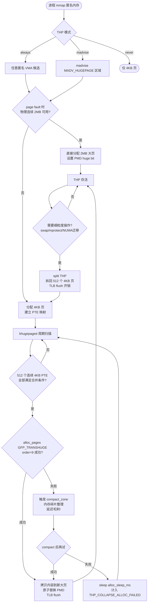
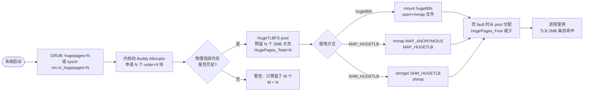

---
tags:
  - 内存管理
  - tier3
  - 大页
  - THP
---
# 大页与透明大页（THP）

> [!abstract] TL;DR
> 现代处理器通过 TLB（Translation Lookaside Buffer）将虚拟地址翻译为物理地址，而 TLB 条目数极为有限。4KB 标准页在管理大内存时会导致 TLB 频繁 miss，引发严重的地址翻译开销。大页（Huge Page）以 2MB 或 1GB 为单位映射内存，单条 TLB 条目覆盖原来的 512 倍或 256K 倍地址范围，可大幅降低 TLB miss 率。Linux 提供两种使用路径：一是显式预留的标准大页（hugetlbfs / `MAP_HUGETLB`），控制精确但需提前规划；二是透明大页（Transparent Huge Pages，THP），由内核 khugepaged 线程在后台自动合并 4KB 页，用户几乎无感知。然而 THP 并非银弹：后台合并触发的内存碎片整理（compaction）会造成毫秒级延迟毛刺，对延迟敏感的数据库系统（Oracle、Redis、MongoDB）危害显著，这类系统普遍建议关闭 THP 或仅使用 `madvise` 模式精细控制。分配器（jemalloc、tcmalloc）也提供了各自的大页集成策略。掌握这套机制，是调优高性能系统内存子系统的必要基础。

## 概述与定位

### 内存访问的隐性代价

应用程序眼中的内存地址是虚拟地址，CPU 每次访问内存必须先将虚拟地址翻译为物理地址。这个翻译过程由硬件 MMU（Memory Management Unit）完成，翻译所需的映射信息存储在多级页表（x86-64 为四级：PGD → PUD → PMD → PTE）中。每次翻译若都走页表，需要多次内存访问（4次），代价高昂。

TLB 是 MMU 内部的高速缓存，存储近期使用过的虚拟地址到物理地址的映射。典型 L1 dTLB 只有 64 条 4KB 条目，L2 STLB（Shared TLB）也仅有 1536 条左右（Intel Skylake 为例）。当工作集超过 TLB 所能覆盖的范围时，TLB miss 频繁发生，每次 miss 触发一次 page table walk，在 DDR 延迟（约 60–100 ns）下每次 walk 耗时数百个时钟周期。

以一个管理 64GB 内存的数据库为例：64GB / 4KB ≈ 1600 万个页表条目，TLB 只能缓存其中极小一部分，TLB miss 率可达数十百分比，成为显著的性能瓶颈。

### 大页的价值主张

使用 2MB 大页，同样 64GB 内存只需约 32768 个页表条目，所需 TLB 条目数减少 512 倍。单条 2MB TLB 条目覆盖原本需要 512 条 4KB 条目才能覆盖的地址范围，TLB 有效覆盖容量暴增。使用 1GB 巨页（gigantic page）效果更极端，512 条 1GB TLB 条目即可覆盖整个 512GB 地址空间。

大页的收益不仅在于 TLB miss 率下降，还体现在：
- 页表自身更小，占用更少内存，页表本身的缓存效率提升
- page table walk 链更短（2MB 页跳过 PTE 级，1GB 页跳过 PMD 和 PTE 级）
- 内核 rmap（reverse mapping）结构更简洁

### 两条路径：标准大页 vs THP

Linux 将大页支持划分为两种截然不同的机制，服务于不同的使用场景：

**标准大页（Explicit Huge Pages）**通过 hugetlbfs 文件系统和 `MAP_HUGETLB` mmap 标志访问。系统启动时或运行时手动向内核预留一批 2MB/1GB 的物理连续大页，应用程序显式申请。控制精确，没有后台抖动，但需要运维介入预先规划，且预留的页在未使用时浪费物理内存。

**透明大页（THP）**在 Linux 2.6.38（2011年）引入，试图同时获得大页性能收益和 4KB 页的灵活性。内核在 page fault 处理路径和 khugepaged 后台线程中，尝试将已映射的连续 4KB 普通页"合并"为一个 2MB 大页，应用程序无需修改代码。然而这一自动化过程带来了额外的不确定性和延迟毛刺，这是 THP 在工程实践中争议最大的地方。

## 原理与机制

### 页表结构复习

x86-64 使用四级页表，虚拟地址（48位有效）按如下方式拆分（未开启 LA57/5级页表时）：

```
63      48 47    39 38    30 29    21 20    12 11      0
|保留      | PGD[9]| PUD[9]| PMD[9]| PTE[9]| 页内偏移[12]|
```

4KB 普通页：所有四级均有效，PTE 指向物理页帧。
2MB 大页：使用三级（PGD→PUD→PMD），PMD 直接指向 2MB 物理连续帧，PTE 级不存在，PMD 条目的 PS（Page Size）位置1。
1GB 巨页：使用两级（PGD→PUD），PUD 直接指向 1GB 物理连续帧，PUD 条目 PS 位置1。

这意味着：
- 2MB 大页要求物理内存以 2MB 对齐的方式连续
- 1GB 巨页要求物理内存以 1GB 对齐的方式连续
- 内存碎片是大页分配的最大障碍，尤其对 1GB 巨页而言

TLB 方面，现代 Intel/AMD 处理器配备专用的大页 TLB（有时称 2M-TLB 或 Large Page TLB），与 4KB 页 TLB 分开管理，条目数通常为 32 条（L1）到 1024 条（L2），但因每条覆盖 512 倍地址范围，实际效用远超数量所显示的差距。

### 标准大页（hugetlbfs）的工作原理

#### 大页预留机制

内核维护一个全局的大页池（HugeTLBFS pool），通过以下参数管理：

```
# 2MB 大页（x86-64 默认）
/proc/sys/vm/nr_hugepages          # 预留的 2MB 大页数量
/proc/sys/vm/nr_overcommit_hugepages  # 允许超出预留量的大页数（按需分配，不保证）

# 1GB 大页（需 GRUB 参数开启）
/sys/kernel/mm/hugepages/hugepages-1048576kB/nr_hugepages

# NUMA 节点级别控制
/sys/devices/system/node/node0/hugepages/hugepages-2048kB/nr_hugepages
```

设置 `vm.nr_hugepages = N` 触发内核立即向 Buddy Allocator 申请 N 个物理连续 2MB 区域。若内存碎片已经严重，内核可能无法满足预留请求——这是为什么应在系统启动早期（内存较干净时）预留的原因，或通过 GRUB 命令行 `hugepages=N` 在 boot 时预留。

预留的大页从系统可用内存中扣除，在 `/proc/meminfo` 中体现为 `HugePages_Total`、`HugePages_Free`、`HugePages_Rsvd`（已被 mmap 但尚未 fault in 的）、`HugePages_Surp`（超出预留量的超额部分）。

#### hugetlbfs 文件系统

```bash
# 挂载 hugetlbfs
mount -t hugetlbfs nodev /mnt/huge -o pagesize=2M,size=16G

# 应用程序可直接在挂载点创建文件并 mmap
int fd = open("/mnt/huge/shm", O_RDWR|O_CREAT, 0644);
ftruncate(fd, SIZE);
void *p = mmap(NULL, SIZE, PROT_READ|PROT_WRITE, MAP_SHARED, fd, 0);
```

#### MAP_HUGETLB 匿名映射

无需文件系统，直接通过 mmap 标志申请大页匿名映射：

```c
#include <sys/mman.h>
#include <linux/mman.h>  // MAP_HUGE_2MB, MAP_HUGE_1GB

// 申请 2MB 大页
void *p = mmap(NULL, 2 * 1024 * 1024,
               PROT_READ | PROT_WRITE,
               MAP_PRIVATE | MAP_ANONYMOUS | MAP_HUGETLB,
               -1, 0);

// 申请 1GB 大页（需内核支持且已预留）
void *p = mmap(NULL, 1024 * 1024 * 1024,
               PROT_READ | PROT_WRITE,
               MAP_PRIVATE | MAP_ANONYMOUS | MAP_HUGETLB | MAP_HUGE_1GB,
               -1, 0);
```

`MAP_HUGETLB` 不能与 THP 叠加使用；它直接从预留池分配。若预留池耗尽，mmap 返回 `MAP_FAILED`（errno = ENOMEM），这是标准大页的硬约束。

#### POSIX 共享内存大页（SHM_HUGETLB）

```c
// 数据库系统常用此接口管理 SGA/buffer pool
int shmid = shmget(IPC_PRIVATE, size,
                   IPC_CREAT | SHM_HUGETLB | 0600);
void *p = shmat(shmid, NULL, 0);
```

Oracle Database、DB2 等传统数据库通过此接口将 SGA（System Global Area）映射到大页，消除大型共享内存区域的 TLB 压力。

### 透明大页（THP）的工作原理

#### THP 的两条合并路径

**路径一：page fault 时直接分配**

当应用程序访问一个尚未映射的虚拟地址，触发 page fault。若 THP 启用且对应虚拟区域（VMA）满足大页对齐条件（地址 2MB 对齐、VMA 足够大、物理内存有 2MB 连续块），内核在 `do_huge_pmd_anonymous_page()` 中直接分配一个 2MB 大页填充该 fault，跳过 4KB 路径。这条路径最"理想"，但条件苛刻，尤其是物理连续性要求。

**路径二：khugepaged 后台合并**

这是 THP 最常见的工作方式。系统存在一个内核线程 `khugepaged`，周期性扫描进程的地址空间，寻找满足条件的连续 4KB 页簇（通常为 512 个物理上不一定连续的 4KB 页，映射到连续的 2MB 虚拟地址区间），尝试将其合并为一个 2MB 大页。

合并的基本流程：
1. 扫描 VMA，找到一个 2MB 对齐的地址区间，其 PMD 槽位目前是 PTE 层级（即 512 个 4KB PTE）
2. 检查该区间内的 4KB 页是否都满足条件（全部 present、全部 anonymous、无 mlock 冲突等）
3. 尝试分配一个物理连续的 2MB 大页（可能触发内存碎片整理 compaction）
4. 将 512 个 4KB 页的内容拷贝到新的 2MB 大页
5. 原子性地用新的大页 PMD 条目替换原来的 512 个 PTE，并刷新 TLB

步骤 3 是关键风险点——若物理内存已经碎片化，`alloc_pages(GFP_TRANSHUGE)` 会触发 `compact_zone()`，这个碎片整理过程可能持续数毫秒乃至数十毫秒，在此期间持有进程的 mmap_lock，阻塞该进程的所有内存操作。这就是 THP 延迟毛刺的根源。

#### THP 的三种模式

通过 `/sys/kernel/mm/transparent_hugepage/enabled` 控制：

```bash
cat /sys/kernel/mm/transparent_hugepage/enabled
# [always] madvise never
```

**`always`**（多数发行版默认）：内核对所有匿名 VMA 积极尝试 THP 合并，无需应用干预。收益最大，但也最容易触发延迟毛刺，因为 khugepaged 无法预知哪些内存区域对延迟敏感。

**`madvise`**：只对调用了 `madvise(addr, len, MADV_HUGEPAGE)` 的区域使用 THP。应用程序显式声明哪些内存区域需要大页处理，粒度精细，是高性能计算和数据库等场景的推荐模式。

```c
// 分配大块内存后显式提示内核使用 THP
void *buf = mmap(NULL, 1 << 30, PROT_READ|PROT_WRITE,
                 MAP_PRIVATE|MAP_ANONYMOUS, -1, 0);
madvise(buf, 1 << 30, MADV_HUGEPAGE);  // 提示，非强制
```

反向操作：对延迟敏感区域显式禁止 THP：

```c
madvise(latency_sensitive_buf, size, MADV_NOHUGEPAGE);
```

**`never`**：完全禁用 THP，系统仅使用 4KB 页。对所有工作负载一视同仁，彻底消除 THP 相关抖动，代价是失去 TLB 命中率提升带来的性能收益。

#### khugepaged 可调参数

```bash
# khugepaged 每轮扫描的最大页数
/sys/kernel/mm/transparent_hugepage/khugepaged/pages_to_scan

# 每轮扫描之间的休眠时间（毫秒），默认 10000ms
/sys/kernel/mm/transparent_hugepage/khugepaged/scan_sleep_millisecs

# 分配大页失败后的休眠时间（毫秒）
/sys/kernel/mm/transparent_hugepage/khugepaged/alloc_sleep_millisecs

# 调大 scan_sleep 可减少 khugepaged 对 CPU 的消耗
echo 60000 > /sys/kernel/mm/transparent_hugepage/khugepaged/scan_sleep_millisecs
```

#### THP 的拆分（split）

当内核需要对一个 THP 执行某些细粒度操作时（如换出部分页到 swap、mprotect 部分范围、reclaim 单个页），必须将 2MB THP 拆回 512 个 4KB 页。这个"split"操作同样需要暂时持有锁并刷新 TLB，是另一个潜在的延迟来源。

常见触发 split 的场景：
- `swap`：内存压力下需要换出部分页，THP 不能被部分换出，必须整体 split 再选择性换出
- 内存热迁移（memory hotplug/ballooning）：虚拟机缩内存操作
- `mprotect`/`madvise` 操作跨越 THP 边界但不覆盖整个 THP
- numa balancing：需要迁移部分页到另一个 NUMA 节点

### TLB 命中率的量化影响

一个典型的内存密集型工作负载（如图数据库、大型 hash join）的 TLB 相关开销分析：

假设工作集 16GB，随机访问模式：

| 配置 | TLB 条目需求 | L2 STLB 覆盖率 | page walk 比例 | 相对性能 |
|------|------------|----------------|----------------|--------|
| 4KB 页 | ~4M 条目 | < 0.1% | ~50% 访问触发 | 基准 1.0x |
| 2MB THP（合并成功） | ~8192 条目 | 100% | ~0.1% | ~1.15x–1.3x |
| 2MB 显式大页 | ~8192 条目 | 100% | ~0.1% | ~1.15x–1.3x |
| 混合（THP 50% 成功率） | 混合 | 部分 | 中间值 | ~1.05x–1.15x |

性能收益高度依赖工作负载的内存访问局部性。流式顺序访问对 TLB 不敏感（预取器工作良好），随机访问大工作集才是大页收益最显著的场景。

## 结构/算法/伪代码详解

### khugepaged 合并算法流程

```
khugepaged 主循环（kernel/mm/khugepaged.c）:

while (khugepaged_enabled):
    sleep(scan_sleep_millisecs)
    for each mm in khugepaged_list:           # 所有注册进程
        mmap_read_lock(mm)
        for each vma in mm->mmas:
            if not vma_is_anonymous(vma): continue
            if vma->vm_flags & VM_NOHUGEPAGE: continue

            addr = vma->vm_start (2MB对齐)
            while addr + HPAGE_PMD_SIZE <= vma->vm_end:
                if should_stop_scan(): break

                pmd = find_pmd(mm, addr)
                if pmd_none(*pmd):            # 尚未映射，跳过
                    addr += HPAGE_PMD_SIZE; continue
                if pmd_trans_huge(*pmd):      # 已经是大页
                    addr += HPAGE_PMD_SIZE; continue

                # 检查 512 个 4KB PTE 是否都满足条件
                result = collapse_huge_page(mm, addr, pmd)
                addr += HPAGE_PMD_SIZE

                if result == SCAN_SUCCEED:
                    count_vm_event(THP_COLLAPSE_ALLOC)
                elif result == SCAN_ALLOC_HUGE_PAGE_FAIL:
                    # 分配 2MB 连续页失败，可能因碎片
                    count_vm_event(THP_COLLAPSE_ALLOC_FAILED)
                    sleep(alloc_sleep_millisecs)  # 关键：等待 compaction
        mmap_read_unlock(mm)
```

```
collapse_huge_page(mm, addr, pmd):
    # 步骤1：获取新的 2MB 大页
    new_page = alloc_pages(GFP_TRANSHUGE)   # 可能触发 compact_zone!
    if !new_page: return SCAN_ALLOC_HUGE_PAGE_FAIL

    # 步骤2：持写锁，冻结该地址范围
    mmap_write_lock(mm)

    # 步骤3：将 512 个 4KB 页内容拷贝到 new_page
    for i in 0..511:
        src = pte_page(ptep_get(pte[i]))
        copy_user_highpage(new_page + i*PAGE_SIZE, src, addr + i*4096, vma)

    # 步骤4：用大页 PMD 原子替换 PTE 层级
    pmdp_collapse_flush(vma, addr, pmd)   # TLB flush
    set_pmd_at(mm, addr, pmd, mk_huge_pmd(new_page, vma->vm_page_prot))

    # 步骤5：释放旧的 512 个 4KB 页
    release_old_pages(...)

    mmap_write_unlock(mm)
    return SCAN_SUCCEED
```

这段伪代码揭示了关键问题：`alloc_pages(GFP_TRANSHUGE)` 调用 `__alloc_pages()` 时会尝试直接从 Buddy Allocator 获取 order=9（512页=2MB）的连续块，若直接分配失败，会启动 `compact_zone()` 进行内存碎片整理，移动已有的 4KB 页以腾出连续空间，这一过程耗时不确定。

### 2MB 大页在 Buddy Allocator 中的位置

Linux Buddy Allocator 将空闲内存按 order 组织（order 0 = 4KB，order 1 = 8KB，...，order 9 = 2MB，...，最大 order 10 = 4MB，但 THP 使用 order=9 的 compound page）。当系统运行一段时间后，大量 order=0 的 4KB 页被频繁分配释放，高 order 的连续块逐渐消耗殆尽，这就是"内存碎片化"的直观表现。

```
Buddy Allocator free lists (简化示意):
order 0: [4K] [4K] [4K] ... (数量多)
order 1: [8K] [8K] ...
order 2: [16K] ...
...
order 9: [] [] (空！)  <-- THP 分配失败，触发 compact_zone
order 10: [4M] ...
```

`compact_zone()` 遍历物理内存，将可移动的 4KB 页从低地址区迁移到高地址区，期望在低地址区产生大块连续空闲内存。这是 THP 抖动的直接机制。

### Mermaid：THP 完整生命周期



### 显式大页预留的完整流程



### jemalloc 的 THP 集成

jemalloc 4.0+ 提供了精细的 THP 控制选项，通过 `malloc_conf` 或环境变量配置：

```c
// 启用 THP（jemalloc 对大块 extent 使用 MADV_HUGEPAGE）
MALLOC_CONF="thp:always"   // 对所有 extent 调用 MADV_HUGEPAGE
MALLOC_CONF="thp:never"    // 对所有 extent 调用 MADV_NOHUGEPAGE（推荐用于 Redis 等）
MALLOC_CONF="thp:default"  // 不主动设置，依赖系统全局 THP 设置
```

jemalloc 的 extent 管理与 THP 的交互：

jemalloc 以 extent（通常为 2MB 对齐的大块）为单位从 OS 获取内存，这与 THP 的 2MB 粒度天然对齐。当 `thp:always` 时，jemalloc 在 `extent_alloc_mmap()` 后立即对整个 extent 调用 `madvise(MADV_HUGEPAGE)`，为 khugepaged 提供最大化的合并机会。

tcmalloc（Google，Abseil 版本）的处理方式：

```
# tcmalloc 通过 GWP 控制 THP
TCMALLOC_MMAP_HUGEPAGES=1  # 使用 mmap + MADV_HUGEPAGE
# 或在代码中
absl::SetEnvVar("TCMALLOC_MMAP_HUGEPAGES", "1");
```

tcmalloc 的 HugePageFiller 是更精细的实现：它维护一个 2MB 对齐的 Span 管理层，追踪每个 2MB 区域中的内存使用情况，在 span 内存使用率足够高时才调用 `MADV_HUGEPAGE`，在使用率下降时调用 `MADV_NOHUGEPAGE`，动态权衡大页收益和碎片浪费之间的平衡。这是一种"按密度分配大页"的策略，比简单地全局 always/never 更为精准。

## 工具视角与实战

### /proc/meminfo 大页相关字段解读

```bash
grep -E 'HugePage|AnonHuge|Huge' /proc/meminfo
```

典型输出：

```
AnonHugePages:   2097152 kB   # THP 当前占用量（2GB，即 1024 个 2MB THP）
HugePages_Total:     512       # 预留的标准大页总数（单位：页数）
HugePages_Free:      256       # 空闲的标准大页
HugePages_Rsvd:       64       # 已被 mmap 但尚未 fault in（承诺但未使用）
HugePages_Surp:        0       # 超额分配（超出 nr_hugepages 的部分）
Hugepagesize:       2048 kB    # 标准大页大小（2MB）
Hugetlb:        1048576 kB     # 标准大页总占用（1GB = 512 pages × 2MB）
```

注意 `AnonHugePages` 和 `HugePages_Total` 是完全独立的：
- `AnonHugePages`：THP 合并成功的匿名大页，无需预留，动态产生
- `HugePages_Total/Free/Rsvd`：通过 `nr_hugepages` 静态预留的标准大页池

### /proc/PID/smaps 逐 VMA 大页使用情况

```bash
grep -A 20 "heap" /proc/$(pgrep redis-server)/smaps | grep -E 'AnonHuge|Size|KernelPage'
```

输出示例：

```
AnonHugePages:    1046528 kB   # 该 VMA 内已合并为 THP 的内存量
```

更详细的分析：

```bash
# 查看所有 VMA 的大页使用情况
awk '/^[0-9a-f]/{vma=$0} /AnonHugePages/ && $2>0{print vma, $0}' /proc/PID/smaps
```

### THP 运行时统计监控

```bash
# /proc/vmstat 中的 THP 相关计数器
grep -i 'thp\|compact' /proc/vmstat
```

关键指标：

```
thp_fault_alloc             1234   # page fault 时直接分配 THP 成功次数
thp_fault_fallback          5678   # page fault 时 THP 失败，回退 4KB
thp_collapse_alloc          2345   # khugepaged 合并成功次数
thp_collapse_alloc_failed   1111   # khugepaged 合并失败次数（关键！）
thp_split_page               890   # THP 被 split 次数
thp_split_page_failed         12   # split 失败次数
compact_success              456   # compaction 成功次数
compact_fail                 234   # compaction 失败次数
compact_stall               1567   # 直接 reclaim/compact 被阻塞次数（延迟指标）
```

`thp_collapse_alloc_failed` 高说明内存碎片严重，THP 合并频繁失败并触发 compact；`compact_stall` 高是延迟毛刺的直接证据。

### perf 分析 TLB miss

```bash
# 统计 dTLB miss 率
perf stat -e dTLB-load-misses,dTLB-loads,iTLB-load-misses,iTLB-loads \
          -p $(pgrep my_app) -- sleep 10

# 典型输出（高 TLB miss 场景）：
#    3,456,789      dTLB-load-misses     # 346 万次 miss
#  100,234,567      dTLB-loads           # miss 率约 3.4%

# 对比开启大页后的效果
echo always > /sys/kernel/mm/transparent_hugepage/enabled
# 重新运行，观察 dTLB-load-misses 是否下降
```

### 调优实践：场景决策矩阵

```bash
# 场景1：科学计算、HPC、大内存向量计算——开启 THP always
echo always > /sys/kernel/mm/transparent_hugepage/enabled
# 工作集大、访问模式规律、对 ms 级抖动不敏感

# 场景2：Redis、Memcached、MongoDB——关闭 THP
echo never > /sys/kernel/mm/transparent_hugepage/enabled
# 或精细控制
echo madvise > /sys/kernel/mm/transparent_hugepage/enabled
# Redis 的 init 脚本通常主动禁用 THP，防止 fork+COW 时内存翻倍问题

# 场景3：Oracle Database——使用显式大页，完全绕过 THP
echo 0 > /sys/kernel/mm/transparent_hugepage/enabled  # 等价 never
sysctl -w vm.nr_hugepages=4096   # 预留 8GB 标准大页
# 在 Oracle 参数中配置 use_large_pages=true 或 only

# 场景4：Java 应用（G1/ZGC）——madvise 模式 + JVM 参数
echo madvise > /sys/kernel/mm/transparent_hugepage/enabled
java -XX:+UseTransparentHugePages -Xmx32g MyApp
# JVM 对 heap region 显式 madvise，避免影响 non-heap 区域

# 场景5：容器环境——宿主机设置继承
# 容器内看到 /sys/kernel/mm/transparent_hugepage 是宿主机的 bind mount
# 容器无权修改，需在宿主机统一配置
```

### Redis COW 与 THP 的放大问题

Redis 的 BGSAVE 使用 fork + copy-on-write（COW）将数据快照写入磁盘。若 THP 开启：

1. Redis 进程有大量 2MB THP
2. fork 后父进程继续处理写请求，触发 COW
3. 每次写请求触发 COW 时，若被修改数据在 THP 内，整个 2MB 大页都需要 COW（即使只写了几个字节）
4. 内存翻倍速度是 THP 关闭时的最坏情况 512 倍（每个写操作多复制 2MB 而非 4KB）

这就是 Redis 官方文档反复强调"关闭 THP"的根本原因——不仅是延迟毛刺，更是内存放大的灾难性效果。

### 永久化配置（systemd）

```ini
# /etc/systemd/system/disable-thp.service
[Unit]
Description=Disable Transparent Huge Pages
After=sysinit.target local-fs.target
Before=mongod.service redis.service

[Service]
Type=oneshot
ExecStart=/bin/bash -c 'echo never > /sys/kernel/mm/transparent_hugepage/enabled'
ExecStart=/bin/bash -c 'echo never > /sys/kernel/mm/transparent_hugepage/defrag'
RemainAfterExit=yes

[Install]
WantedBy=multi-user.target
```

```bash
systemctl enable disable-thp
systemctl start disable-thp
```

`/sys/kernel/mm/transparent_hugepage/defrag` 控制在 page fault 时是否同步触发内存碎片整理（`always` 最激进，`defer+madvise` 为推荐的折中值，`never` 完全不触发）：

```bash
# 推荐值：延迟 compaction，减少 page fault 延迟
echo defer+madvise > /sys/kernel/mm/transparent_hugepage/defrag
```

### NUMA 环境下的大页

在 NUMA 系统（多路服务器）上，大页的 NUMA 分布需要额外关注：

```bash
# 在 NUMA 节点 0 上预留 1024 个 2MB 大页
echo 1024 > /sys/devices/system/node/node0/hugepages/hugepages-2048kB/nr_hugepages

# 在 NUMA 节点 1 上预留 1024 个 2MB 大页
echo 1024 > /sys/devices/system/node/node1/hugepages/hugepages-2048kB/nr_hugepages

# 绑定进程到特定 NUMA 节点并使用大页
numactl --cpunodebind=0 --membind=0 my_database --hugepages
```

若大页预留集中在节点0但进程绑定在节点1，内存访问将跨 NUMA 互联（QPI/UPI）传输，延迟翻倍，完全抵消大页的 TLB 收益。NUMA 拓扑感知是大页调优中容易忽视的环节。

## 安全性与正确使用

### THP 延迟毛刺的量化与评估

THP 的延迟毛刺是工程实践中最具争议的特性。以下提供定量分析框架：

**触发条件**：内存碎片化程度高（长时间运行后）、工作集增长时（触发新 THP 分配）、内存压力适中（既不太空闲也不太紧张）。

**毛刺幅度**：典型场景下 compaction 引起的单次 stall 为 1–10 ms，极端情况（NVM 存储、大内存机器、高碎片化）可达数十 ms 乃至超过 100 ms。

**检测方法**：

```bash
# 实时监控 compact_stall
while true; do
    stall=$(grep compact_stall /proc/vmstat | awk '{print $2}')
    echo "$(date +%T) compact_stall: $stall"
    sleep 1
done
```

```python
# 结合应用侧 P99 延迟监控
# 若 compact_stall 增加与 P99 尖峰时间吻合，THP compaction 是凶手
```

**缓解策略（不完全禁用 THP 的情况下）**：

1. `defrag = defer+madvise`：page fault 路径不同步做 compaction，延迟到内存回收时处理，减少业务线程被阻塞
2. 提高 `vm.min_free_kbytes`：保持更多空闲内存，Buddy Allocator 有更大可能直接提供 order=9 块
3. 定期主动触发 compaction（低峰期）：
   ```bash
   echo 1 > /proc/sys/vm/compact_memory  # 触发全局 compaction
   ```
4. 使用 jemalloc 的 `thp:never` 并搭配 `madvise` 模式的 THP，只对确认收益大的大块 region 申请大页

### 数据库系统的最佳实践

**Oracle Database**：
- 强烈推荐使用显式标准大页（`vm.nr_hugepages`）配置 SGA
- `MEMORY_TARGET` 参数与大页不兼容（因为大页无法按需扩缩，需 AMM 使用 tmpfs 管理）
- 推荐参数：`use_large_pages = ONLY`（若大页不可用则拒绝启动，避免悄悄回退 4KB 页）

**PostgreSQL**：
- 通过 `huge_pages = try` 参数（默认）在 shared_buffers 申请大页
- 若系统预留了足够大页，PostgreSQL 自动使用 `MAP_HUGETLB` 映射 shared_buffers
- `huge_pages = on` 则在失败时报错，不回退

**MongoDB**：
- 官方文档要求在 Linux 上禁用 THP：`echo never > /sys/kernel/mm/transparent_hugepage/enabled`
- MongoDB WiredTiger 存储引擎的内部缓存管理对碎片整理延迟极为敏感

**Redis**：
- 配置文件内置检测：
  ```
  # redis.conf
  # WARNING: Disable Transparent Huge Pages!
  # We suggest you add to /etc/rc.local:
  # echo never > /sys/kernel/mm/transparent_hugepage/enabled
  ```
- Redis 6.0+ 在启动时会检测 THP 状态并打印警告日志

### 虚拟机与容器的特殊考量

**KVM 虚拟机**：宿主机 THP 能力穿透到 Guest 的能力取决于内存后端。若 Guest 使用宿主机的 anonymous mmap（普通配置），宿主机的 THP 会自动覆盖 Guest 内存页，Guest 内的 THP 控制和宿主机独立存在，形成双层 THP。这不一定是问题，但若 Guest 主动关闭 THP 而宿主机 always 模式开启，Guest 内核关掉了 Guest 级别的 khugepaged，但宿主机 khugepaged 仍然会合并宿主机视角下的内存，导致 Guest 内的延迟分析出现"幻象"毛刺。

**Docker/容器**：容器共享宿主机内核，`/sys/kernel/mm/transparent_hugepage` 是同一个宿主机设置，容器内普通用户无权修改（需 `CAP_SYS_ADMIN` 或特权容器）。在 Kubernetes 环境中，通常通过 DaemonSet 在宿主机层面统一配置 THP，而非依赖单个容器修改。

### 1GB 巨页的特殊限制

1GB 巨页（gigantic page）是 THP **不支持**的大小——THP 只支持 2MB。1GB 巨页必须通过 `MAP_HUGETLB | MAP_HUGE_1GB` 或 hugetlbfs 挂载参数 `pagesize=1G` 显式使用，并且必须在 GRUB 命令行中预留：

```
# /etc/default/grub
GRUB_CMDLINE_LINUX="... hugepages=16 hugepagesz=1G default_hugepagesz=1G"
```

1GB 巨页最适合 DPDK（Data Plane Development Kit）网络应用和 HPC 应用，这类应用有极大的规律性工作集（整个 socket buffer 或 MPI 通信缓冲区），能够保证 1GB 连续物理内存被充分利用，不产生内碎片浪费。

### 大页与 mlock 的关系

`mlock()` 锁定内存（防止换出），与大页正交但有交互：

```c
// 锁定内存后，THP 合并不受影响，但 split 可能因 mlock 状态受限
void *p = mmap(..., MAP_ANONYMOUS|MAP_PRIVATE, ...);
mlock(p, SIZE);              // 锁定，防止 swap
madvise(p, SIZE, MADV_HUGEPAGE);  // 建议使用 THP（仍然有效）
```

若对 THP 区域进行 `mlock`，split 时需先 `munlock` 该页，可能造成极短暂的可换出窗口，在极端内存压力下需注意。

## 小结

大页机制从根本上解决的是 TLB 覆盖率不足的问题——这是现代大内存服务器上一个真实的性能瓶颈，而非纸面优化。当工作集超过数 GB 且存在大量随机访问时，切换到 2MB 大页带来的 TLB 命中率提升往往能直接体现为 10–30% 的吞吐量改善。

然而两种大页机制的选择决策有明确的分野：

**标准大页（hugetlbfs / MAP_HUGETLB）**适合已知大小、生命周期明确的大块内存（数据库 buffer pool、HPC 作业内存），一次预留、长期使用，没有后台线程干扰，延迟完全可预测。代价是需要运维配合提前规划内存容量，且预留内存不可被其他进程使用。

**透明大页（THP）**适合工作集增长模式不规律、无法提前规划的通用场景，以及对代码改动零容忍的旧有应用。`madvise` 模式是最务实的折中——在代码中对已知的大块缓冲区显式提示 `MADV_HUGEPAGE`，对其余区域保持沉默，避免 khugepaged 在错误的区域触发无谓的 compaction。

对于延迟敏感型数据库（Redis、MongoDB 及类似系统）：关闭 THP 是消除不确定延迟毛刺的最直接手段，不应依赖调参来"驯化" THP，因为 compaction 抖动的时机本质上不可预测。

分配器（jemalloc、tcmalloc）的大页选项是另一层控制面，能让分配器自主决策哪些 extent 值得申请大页映射，与系统级 THP 模式组合使用时效果最佳。

`/proc/meminfo` 的 `AnonHugePages`、`HugePages_*` 字段和 `/proc/vmstat` 的 `thp_collapse_alloc_failed`、`compact_stall` 是大页状态监控的核心仪表盘，任何大页相关的调优都应从这些指标的持续观测开始。

## 相关阅读

- Linux 内核源码：`mm/huge_memory.c`（THP 核心）、`mm/khugepaged.c`（后台合并线程）、`mm/hugetlb.c`（标准大页管理）
- Linux 内核文档：`Documentation/admin-guide/mm/transhuge.rst`、`Documentation/admin-guide/mm/hugetlbpage.rst`
- Intel 架构手册 Vol.3A Chapter 4：Paging（页表结构与大页 PS 位详解）
- Mel Gorman 的内存碎片整理系列文章（LWN.net）：https://lwn.net/Articles/368869/
- jemalloc 官方文档中的 `thp` 配置选项说明
- tcmalloc HugePageFiller 设计文档（Google 开源 Abseil 项目）
- Redis 官方文档：https://redis.io/docs/management/optimization/
- Oracle Linux 大页配置指南：https://docs.oracle.com/en/operating-systems/oracle-linux/8/memtune/
- Brendan Gregg：《Systems Performance》第2版，Chapter 7 Memory — Huge Pages 章节

[[00.内存管理与堆分配器总览|⬆ 系列总览]] | [[19.NUMA内存架构与分配策略|← 上一章]] | [[21.自定义内存池与对象池设计|→ 下一章]]
