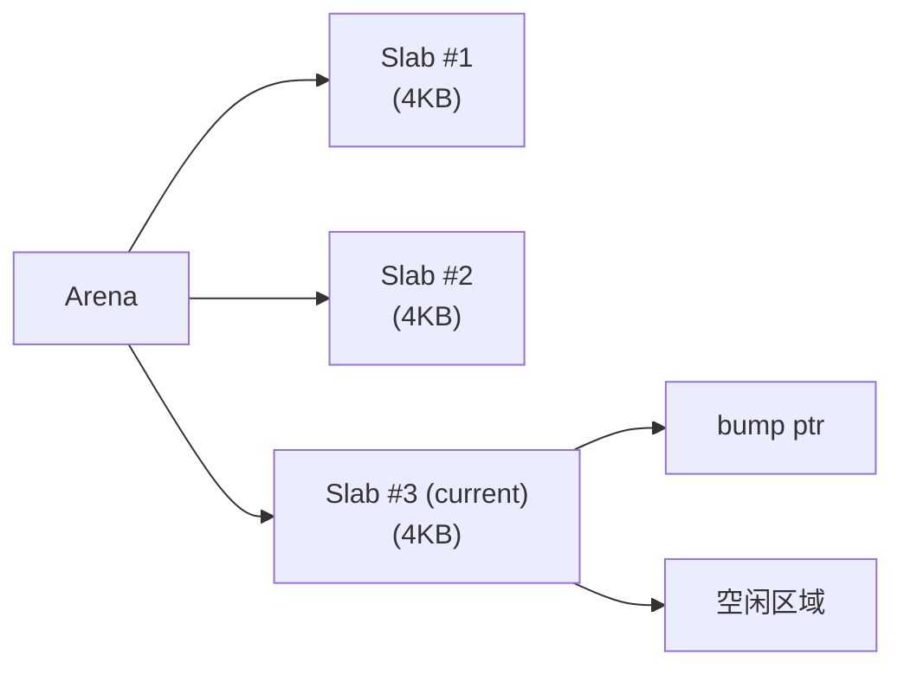
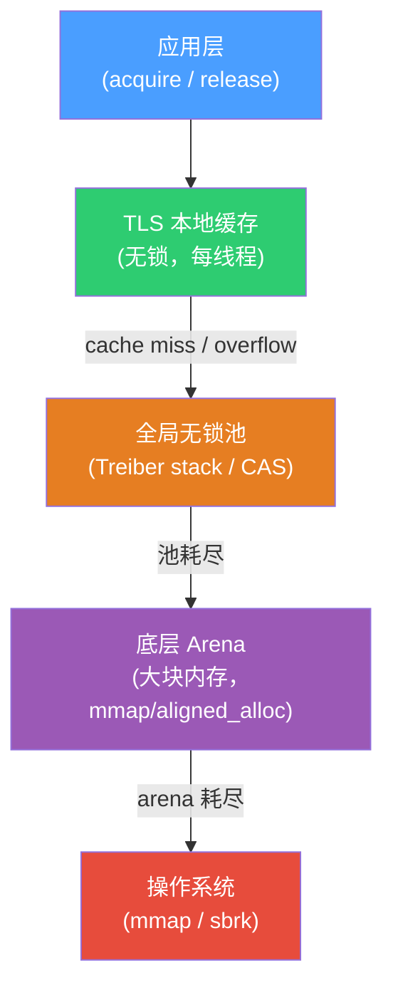

---
tags:
  - 内存管理
  - tier3
  - 内存池
  - C++
---
# 自定义内存池与对象池设计

> [!abstract] TL;DR
> 通用堆分配器（ptmalloc、jemalloc、tcmalloc）覆盖了大多数场景，但在热路径（每帧数万次分配）、严格延迟要求（高频交易微秒级）或嵌入式受限环境下，它们的锁竞争、元数据开销和碎片不可接受。自定义内存池通过**一次性获取大块内存、在内部用极简策略分配/归还**，将分配复杂度从 O(log n) 降到 O(1)，彻底消除全局锁，同时赋予程序员对对象生命周期和内存布局的完全控制权。本章覆盖：线性分配 arena、free-list 内存池、固定大小对象池、slab 思想、线程安全设计（TLS-local + lock-free stack）、C++17 PMR 标准接口、boost::pool、对齐与 placement new，以及游戏引擎、高频交易、嵌入式三大领域的实战设计。

## 概述与定位

### 为何绕过通用分配器

通用分配器是为"什么都不知道"的调用者设计的：分配大小任意、生命周期不规律、多线程并发。为了应对这种不确定性，它们引入了大量开销：

1. **元数据开销**：ptmalloc 每个 chunk 携带 8~16 字节 header，存 size、prev\_size、flags，这对大量小对象（32 字节以下）来说比例极高。
2. **锁竞争**：即使 tcmalloc/jemalloc 用 per-thread cache，cache miss 后仍需全局锁或原子操作与中央池同步。ptmalloc 的 arena 争用在核数 > 8 时仍可测量。
3. **碎片**：长生命周期大对象与短生命周期小对象交错分配，会在堆中形成难以合并的"空洞"。
4. **不确定延迟**：`malloc` 在最坏情况下可能触发 `sbrk`/`mmap` 系统调用、THP 页错误、或 NUMA 远端页分配，导致延迟抖动到毫秒级。

对比来看，自定义内存池的优势体现在三个维度：

| 维度 | 通用分配器 | 自定义内存池 |
|------|-----------|-------------|
| 分配复杂度 | O(log n)～O(1) 均摊，有抖动 | O(1) 确定性 |
| 元数据 | 8～32 字节/块 | 0～4 字节/块（可选） |
| 线程安全 | 全局锁或 CAS | TLS-local 免同步 |
| 碎片控制 | 依赖合并算法 | 结构化布局，无内碎片 |
| 对象构造 | 调用者负责 | 池可预构造，归还不析构 |

### 典型适用场景

- **游戏引擎每帧分配**：粒子、子弹、动画关键帧等短命对象，每帧创建数千个，帧末统一销毁。用线性 arena 在帧开始时 reset，帧末一次性释放，速度比 `new/delete` 快 10～50 倍。
- **高频交易订单簿**：每笔报价触发 Order 对象创建/销毁，要求延迟 < 1μs 且无尖刺。对象池预热后，分配只是一次原子 pop，绝不触发系统调用。
- **嵌入式/RTOS**：片上 SRAM 只有几十 KB，禁止动态堆（碎片导致不可预测的 OOM），用静态数组 + free-list 实现无碎片分配。
- **网络服务器连接池**：`Connection` 对象高频创建销毁，放入对象池后归还时跳过析构，下次取用时 placement new 初始化，避免重复系统资源申请。

---

## 原理与机制

### 线性分配器（Bump Pointer / Arena）

线性分配器是所有内存池中最简单、最快的形式：维护一个指针（通常称为 `bump pointer` 或 `top`），每次分配只需将指针向高地址移动对应大小，返回旧地址。

```
┌─────────────────────────────────────────────────────┐
│  已分配区域（碎片为零，对象紧密排列）                │ ← 固定起始
│  [Obj A][Obj B][Obj C][padding]                      │
│                         ↑                            │
│                      bump ptr（当前分配点）           │
│                                                     │
│              空闲区域（未使用）                       │
└─────────────────────────────────────────────────────┘
```

核心特征：
- **分配 O(1)**：一次加法 + 一次对齐取整 + 边界检查。
- **不支持单独释放**：没有元数据记录每个对象的边界，只能整块 reset。
- **零内碎片**（对齐 padding 除外）：对象连续排列，无 header 浪费。
- **适合 arena/区域分配**：整个生命周期内分配，生命期结束后一次性 reset 或 free 底层内存。

### Memory Arena（区域分配器）

Arena 是线性分配器的"管理外壳"，负责：
1. 按需向操作系统申请一批 slab（通常 4KB～1MB），组成链表；
2. 在当前 slab 内用 bump pointer 分配；
3. 当前 slab 耗尽时，从链表取下一块或新申请；
4. `reset()` 时将 bump pointer 归零，不释放底层内存（保留给下次使用）；
5. `destroy()` 时才将所有 slab 归还操作系统。



Arena 的关键洞察：**释放的代价被均摊到整个 arena 的生命周期**，单对象释放代价为零。这在有明确"阶段"边界的系统中极为高效（如游戏帧、请求处理周期、编译单元）。

### Free-List 内存池

Free-list 池用于支持单独释放，但限制分配大小为固定值（或几个固定档位）。初始化时将大块内存切分为等大小的 slot，用侵入式链表串联：

```
初始状态（每 slot 32 字节，共 8 个）：
┌──────┬──────┬──────┬──────┬──────┬──────┬──────┬──────┐
│ next─┼─────►│ next─┼─────►│ next─┼─────►│ next─┼─···─►│ NULL │
└──────┴──────┴──────┴──────┴──────┴──────┴──────┴──────┘
         ↑
      free_list head

分配一个：
head = head->next; // O(1)
返回原 head 指向的 slot

释放一个（ptr）：
((FreeNode*)ptr)->next = head;
head = (FreeNode*)ptr; // O(1)
```

侵入式链表的关键：**空闲 slot 的内存本身存储 `next` 指针**，不需要额外元数据区。分配的 slot 中这部分内存由调用者覆盖，归还后再重新作为 `next` 使用。这要求最小 slot 大小 ≥ `sizeof(void*)`（通常 8 字节）。

### 固定大小对象池（Fixed-Size Object Pool）

对象池在 free-list 基础上加入对象语义：
- **构造/析构时机可选**：可以在分配时 placement new，归还时手动析构；也可以预先构造所有对象，归还时不析构（适合状态可重置的简单对象）。
- **类型安全**：通过模板参数固定 `T`，slot 大小自动为 `sizeof(T)`，对齐为 `alignof(T)`。

### Slab 分配思想

Linux 内核 slab 分配器（后继为 slub/slob）的核心思想：
1. **对象着色（coloring）**：不同 slab 中相同偏移的对象落在不同 cache line，避免多核 cache 竞争。
2. **构造缓存**：对象在 slab 中"构造一次，归还不析构"，下次分配时对象处于已知"半初始化"状态，调用者只需重置差异字段。
3. **per-CPU 本地缓存**：每个 CPU 有一个小型缓存，无锁分配；超出阈值后批量归还中央池。

用户态对象池可借鉴这三点，尤其是"构造缓存"和 per-thread 本地缓存。

### 线程安全设计

#### TLS-local 缓存

每个线程有一个 `thread_local` 的小型 free-list（容量上限 K），分配/释放不加锁。超出上限时批量（K/2 个）归还全局池；本地 list 耗尽时批量从全局池取。

```
线程 A 的 TLS 缓存（容量上限 16）:
  [slot][slot][slot]...[slot]   ← 本地 free list（无锁）
         ↓ 超出 16
  全局池（加锁或 lock-free stack）
```

#### Lock-Free Stack（CAS 实现）

全局池用无锁栈（Treiber stack）：

```
push(node):
  do:
    node->next = head.load(acquire)
  while !head.compare_exchange_weak(node->next, node, release)

pop():
  do:
    old = head.load(acquire)
    if old == nullptr: return nullptr
    next = old->next
  while !head.compare_exchange_weak(old, next, release)
  return old
```

注意 ABA 问题：若 slot 被 push/pop/push 后地址复用，CAS 可能误判。解决方案：在指针高位嵌入版本号（tagged pointer），或使用 hazard pointer / epoch-based reclamation。实践中对象池的 slot 地址在整个池生命周期内不释放，ABA 风险可控。

---

## 结构/算法/伪代码详解

### 线性 Arena 完整实现

```cpp
#include <cstddef>
#include <cassert>
#include <cstdlib>
#include <new>

// 对齐辅助：将 ptr 向上对齐到 align（必须是 2 的幂）
inline std::byte* align_up(std::byte* ptr, std::size_t align) noexcept {
    auto addr = reinterpret_cast<std::uintptr_t>(ptr);
    return reinterpret_cast<std::byte*>((addr + align - 1) & ~(align - 1));
}

class LinearArena {
public:
    explicit LinearArena(std::size_t capacity)
        : storage_(static_cast<std::byte*>(std::aligned_alloc(alignof(std::max_align_t), capacity)))
        , capacity_(capacity)
        , offset_(0)
    {
        if (!storage_) throw std::bad_alloc{};
    }

    ~LinearArena() { std::free(storage_); }

    // 禁止拷贝，允许移动
    LinearArena(const LinearArena&) = delete;
    LinearArena& operator=(const LinearArena&) = delete;

    [[nodiscard]]
    void* allocate(std::size_t size, std::size_t alignment = alignof(std::max_align_t)) {
        std::byte* cur = align_up(storage_ + offset_, alignment);
        if (cur + size > storage_ + capacity_) return nullptr; // 或 throw
        offset_ = static_cast<std::size_t>((cur + size) - storage_);
        return cur;
    }

    // 线性 arena 不支持单独 deallocate；此函数仅为符合 Allocator 概念而存在（no-op）
    void deallocate(void*, std::size_t) noexcept {}

    // 重置：保留底层内存，bump ptr 归零
    void reset() noexcept { offset_ = 0; }

    [[nodiscard]] std::size_t used() const noexcept { return offset_; }
    [[nodiscard]] std::size_t remaining() const noexcept { return capacity_ - offset_; }

private:
    std::byte*  storage_;
    std::size_t capacity_;
    std::size_t offset_;
};

// 用法：与 placement new 配合
// LinearArena arena(1 << 20); // 1MB
// auto* p = new(arena.allocate(sizeof(Foo), alignof(Foo))) Foo(args...);
// // 帧末：
// p->~Foo(); // 可选，若 Foo 无资源可省略
// arena.reset();
```

### 固定大小对象池完整实现

```cpp
#include <cstddef>
#include <cassert>
#include <memory>
#include <new>

template<typename T, std::size_t Capacity>
class FixedObjectPool {
    static_assert(sizeof(T) >= sizeof(void*), "T 太小，无法嵌入 free-list 指针");
    static_assert(alignof(T) <= alignof(std::max_align_t));

public:
    FixedObjectPool() {
        // 切片并串联 free list
        for (std::size_t i = 0; i < Capacity - 1; ++i)
            *reinterpret_cast<Slot**>(slots_[i].raw) = &slots_[i + 1];
        *reinterpret_cast<Slot**>(slots_[Capacity - 1].raw) = nullptr;
        free_head_ = &slots_[0];
    }

    ~FixedObjectPool() {
        // 注意：调用者必须在此之前归还所有对象并手动析构
        // 否则资源泄漏（本池不追踪存活对象）
    }

    template<typename... Args>
    [[nodiscard]] T* acquire(Args&&... args) {
        if (!free_head_) return nullptr;
        Slot* slot = free_head_;
        free_head_ = *reinterpret_cast<Slot**>(slot->raw);
        return ::new(slot->raw) T(std::forward<Args>(args)...);
    }

    void release(T* ptr) noexcept {
        ptr->~T();
        auto* slot = reinterpret_cast<Slot*>(ptr);
        *reinterpret_cast<Slot**>(slot->raw) = free_head_;
        free_head_ = slot;
    }

    [[nodiscard]] bool full() const noexcept { return free_head_ == nullptr; }

private:
    struct alignas(alignof(T)) Slot {
        unsigned char raw[sizeof(T)];
    };

    Slot  slots_[Capacity];
    Slot* free_head_ = nullptr;
};

// 使用示例：
// FixedObjectPool<Order, 4096> order_pool;
// Order* o = order_pool.acquire(price, qty, side);
// order_pool.release(o); // 析构 + 归还
```

### 线程安全对象池（TLS + Lock-Free Stack）

```cpp
#include <atomic>
#include <thread>
#include <array>

template<typename T>
class ThreadSafePool {
    struct Node {
        alignas(T) unsigned char data[sizeof(T)];
        Node* next = nullptr;
    };

    // Treiber stack（无锁全局池）
    std::atomic<Node*> global_head_{nullptr};

    // TLS 本地缓存
    static constexpr int kLocalCapacity = 16;

    struct LocalCache {
        std::array<Node*, kLocalCapacity> buf{};
        int size = 0;
    };
    inline static thread_local LocalCache local_;

    // 全局存储（这里简化为静态数组，实际可用 mmap）
    static constexpr int kPoolSize = 1024;
    Node storage_[kPoolSize];
    std::atomic<int> init_idx_{0};

    Node* allocate_from_storage() {
        int idx = init_idx_.fetch_add(1, std::memory_order_relaxed);
        return (idx < kPoolSize) ? &storage_[idx] : nullptr;
    }

    void push_global(Node* n) noexcept {
        n->next = global_head_.load(std::memory_order_relaxed);
        while (!global_head_.compare_exchange_weak(
            n->next, n, std::memory_order_release, std::memory_order_relaxed));
    }

    Node* pop_global() noexcept {
        Node* old = global_head_.load(std::memory_order_acquire);
        while (old && !global_head_.compare_exchange_weak(
            old, old->next, std::memory_order_release, std::memory_order_acquire));
        return old;
    }

public:
    ThreadSafePool() = default;

    template<typename... Args>
    T* acquire(Args&&... args) {
        Node* n = nullptr;
        if (local_.size > 0) {
            n = local_.buf[--local_.size]; // TLS 本地，无锁
        } else {
            n = pop_global();
            if (!n) n = allocate_from_storage();
            if (!n) return nullptr;
        }
        return ::new(n->data) T(std::forward<Args>(args)...);
    }

    void release(T* ptr) noexcept {
        ptr->~T();
        auto* n = reinterpret_cast<Node*>(ptr);
        if (local_.size < kLocalCapacity) {
            local_.buf[local_.size++] = n; // 放回 TLS，无锁
        } else {
            // TLS 满：把本地一半归还全局
            int half = kLocalCapacity / 2;
            for (int i = 0; i < half; ++i)
                push_global(local_.buf[--local_.size]);
            local_.buf[local_.size++] = n;
        }
    }
};
```

### Mermaid：整体内存池层次架构



### 多档位分配器（多个 Free-List）

当对象大小不固定但分布集中在几个档位时（如 32、64、128、256 字节），可用多个 free-list 分别管理：

```cpp
class BucketAllocator {
    static constexpr std::size_t kBuckets[] = {32, 64, 128, 256, 512};
    static constexpr int kNumBuckets = 5;
    FreeList lists_[kNumBuckets]; // 每个 FreeList 管理对应大小的 slot

    int bucket_index(std::size_t size) {
        for (int i = 0; i < kNumBuckets; ++i)
            if (size <= kBuckets[i]) return i;
        return -1; // 超大，走 malloc
    }

public:
    void* allocate(std::size_t size) {
        int idx = bucket_index(size);
        if (idx < 0) return std::malloc(size);
        return lists_[idx].pop();
    }

    void deallocate(void* ptr, std::size_t size) {
        int idx = bucket_index(size);
        if (idx < 0) { std::free(ptr); return; }
        lists_[idx].push(ptr);
    }
};
```

这正是 jemalloc size-class 和 tcmalloc size-class 的简化用户态版本。

---

## 工具视角与实战

### C++17 PMR（Polymorphic Memory Resource）

C++17 引入 `std::pmr` 命名空间，提供标准化的内存资源抽象，允许容器在不改变类型的情况下使用不同的分配器。

#### 核心类层次

```
std::pmr::memory_resource         // 抽象基类
├── monotonic_buffer_resource      // 线性 arena（不释放个别对象）
├── unsynchronized_pool_resource   // 多档位池（单线程）
└── synchronized_pool_resource     // 多档位池（线程安全）
```

`memory_resource` 接口：
```cpp
void* do_allocate(size_t bytes, size_t alignment) override;
void  do_deallocate(void* p, size_t bytes, size_t alignment) override;
bool  do_is_equal(const memory_resource& other) const noexcept override;
```

#### monotonic_buffer_resource 实战

```cpp
#include <memory_resource>
#include <vector>
#include <string>

void process_request() {
    // 栈上 64KB 缓冲，不够时 fallback 到 new_delete_resource
    std::byte buf[65536];
    std::pmr::monotonic_buffer_resource arena{buf, sizeof(buf)};

    // 所有容器共用同一个 arena
    std::pmr::vector<std::pmr::string> names{&arena};
    std::pmr::unordered_map<int, std::pmr::string> map{&arena};

    names.emplace_back("Alice");
    names.emplace_back("Bob");
    map[1] = "one";

    // 函数返回时 arena 析构，所有内存一次性释放
    // 若未超出 64KB，全程无堆分配
}
```

这是最简洁的"请求级 arena"用法：请求开始时建 arena，请求结束时析构，零碎片，极快。

#### unsynchronized_pool_resource 实战

```cpp
std::pmr::unsynchronized_pool_resource pool_res(
    {.max_blocks_per_chunk = 256,   // 每次向上游申请 256 块
     .largest_required_pool_block = 1024}, // 最大池管理的块大小
    std::pmr::new_delete_resource() // 上游分配器
);

// 单线程环境，无锁，适合每线程独立使用
std::pmr::vector<int> v{&pool_res};
for (int i = 0; i < 10000; ++i) v.push_back(i);
```

#### 链接上游资源（Resource Chain）

```
栈缓冲 → monotonic_buffer_resource
         ↓（溢出时）
      unsynchronized_pool_resource
         ↓（溢出时）
      new_delete_resource（堆）
```

```cpp
std::byte stack_buf[4096];
std::pmr::monotonic_buffer_resource mono{stack_buf, sizeof(stack_buf)};
// mono 的上游是 new_delete_resource（默认）
// 超出 4KB 时 mono 自动从堆申请
```

### boost::pool

`boost::pool<>` 是经典的固定大小对象池，接口简洁：

```cpp
#include <boost/pool/pool.hpp>
#include <boost/pool/object_pool.hpp>

// 原始内存池（不调用构造/析构）
boost::pool<> raw_pool(sizeof(MyStruct));
MyStruct* p = static_cast<MyStruct*>(raw_pool.malloc());
// ... 使用 ...
raw_pool.free(p);

// 对象池（自动调用构造/析构）
boost::object_pool<MyStruct> obj_pool;
MyStruct* o = obj_pool.construct(arg1, arg2);
obj_pool.destroy(o);
```

`boost::pool` 内部用 "simple segregated storage"：将大块内存切片，free-list 串联，与本章前述原理完全一致。`object_pool` 还维护已分配对象链表，析构时批量 destroy 未归还的对象（防内存泄漏，但有 O(n) 开销）。

`boost::pool_allocator` 和 `boost::fast_pool_allocator` 则将上述池包装为 STL Allocator，可直接用于 `std::list`、`std::map` 等需要频繁小块分配的容器。

### 游戏引擎中的帧 Arena

以 Unreal Engine 风格为例：

```cpp
// 全局帧 arena，每帧 reset
class FrameAllocator {
    LinearArena arena_{8 * 1024 * 1024}; // 8MB per frame

public:
    static FrameAllocator& get() { static FrameAllocator fa; return fa; }

    template<typename T, typename... Args>
    T* create(Args&&... args) {
        void* mem = arena_.allocate(sizeof(T), alignof(T));
        return new(mem) T(std::forward<Args>(args)...);
    }

    // 帧末由引擎主循环调用
    void end_frame() {
        // 若需析构（如 string），遍历注册的析构回调
        // 简化：若对象都是 POD 或不持有外部资源，直接 reset
        arena_.reset();
    }
};

// 游戏逻辑代码：
ParticleEffect* fx = FrameAllocator::get().create<ParticleEffect>(pos, color);
// 无需 delete，帧末自动回收
```

### 高频交易中的确定性延迟池

```cpp
// 启动时预热：保证所有内存页已映射（消除 page fault）
class OrderPool {
    static constexpr int kCapacity = 65536;
    ThreadSafePool<Order> pool_;

public:
    OrderPool() {
        // 预分配并立刻 touch 所有页
        std::vector<Order*> warmup;
        warmup.reserve(kCapacity);
        for (int i = 0; i < kCapacity; ++i)
            warmup.push_back(pool_.acquire());
        for (auto* p : warmup) pool_.release(p);
        // 现在所有内存页已在物理内存中，绝不触发 page fault
    }

    Order* get(Price p, Qty q, Side s) { return pool_.acquire(p, q, s); }
    void put(Order* o) { pool_.release(o); }
};
```

预热消除了首次访问的 page fault（可达 10μs+），使后续分配延迟稳定在 50～200 ns。

### 嵌入式静态内存池

嵌入式环境通常禁止动态堆，用静态数组 + compile-time 大小：

```cpp
template<typename T, std::size_t N>
class StaticPool {
    union Slot {
        alignas(T) unsigned char storage[sizeof(T)];
        Slot* next;
    };
    Slot slots_[N];
    Slot* head_ = nullptr;
    bool initialized_ = false;

public:
    void init() {
        for (std::size_t i = 0; i < N - 1; ++i)
            slots_[i].next = &slots_[i + 1];
        slots_[N - 1].next = nullptr;
        head_ = &slots_[0];
        initialized_ = true;
    }

    T* alloc() {
        assert(initialized_ && head_);
        Slot* s = head_;
        head_ = s->next;
        return reinterpret_cast<T*>(s->storage);
    }

    void free(T* ptr) {
        auto* s = reinterpret_cast<Slot*>(ptr);
        s->next = head_;
        head_ = s;
    }
};

// 完全静态，无堆依赖，链接时大小确定
static StaticPool<PacketBuffer, 64> pkt_pool;
```

---

## 安全性与正确使用

### 生命周期管理：最常见的错误来源

内存池最危险的地方在于**池的生命周期与对象的生命周期解耦**，稍不注意就会出现悬垂指针或双重释放。

**错误模式 1：池已 reset，但有指针仍指向池中对象**

```cpp
LinearArena arena(1024);
Foo* p = new(arena.allocate(sizeof(Foo), alignof(Foo))) Foo();
arena.reset(); // bump ptr 归零，但 p 仍存在于调用者持有的变量中
p->bar(); // UB！内存已被后续分配覆盖
```

规避方法：对带"析构"的对象，reset 前遍历注册析构回调；或用 RAII wrapper（如 `ArenaPtr<T>`），在析构时调用 `T::~T()`，并在 arena reset 时使 wrapper 失效（如设置 nullptr sentinel）。

**错误模式 2：从池 A 归还到池 B**

多个同类型池并存时，手动释放很容易归还到错误的池：

```cpp
FixedObjectPool<Order, 1024> pool_a, pool_b;
Order* o = pool_a.acquire();
pool_b.release(o); // 破坏 pool_b 的 free list！o 不属于 pool_b 的存储区
```

规避方法：在 debug 模式下，`release` 前检查指针是否在本池的地址范围内：

```cpp
void release(T* ptr) {
    assert(owns(ptr) && "指针不属于本池！");
    // ...
}

bool owns(const T* ptr) const noexcept {
    return ptr >= reinterpret_cast<const T*>(storage_)
        && ptr < reinterpret_cast<const T*>(storage_ + sizeof(storage_));
}
```

**错误模式 3：跨线程归还而不加同步**

非线程安全池（如 `FixedObjectPool` 无锁版本）在多线程中被不同线程 acquire/release：

```cpp
// 线程 A acquire，线程 B release → free_head_ 被并发修改 → 链表损坏
```

规避方法：非线程安全池标记为 `[[clang::not_thread_safe]]`（Clang thread safety annotations），并配合线程亲和性设计（每线程只访问自己的池）。如必须跨线程，换用 `ThreadSafePool` 或加 mutex。

### 对齐陷阱

**陷阱 1：bump pointer 未对齐**

```cpp
// 错误：分配 4 字节后直接分配需要 8 字节对齐的类型
void* p1 = arena.allocate(4);  // ptr = base
void* p2 = arena.allocate(sizeof(uint64_t), alignof(uint64_t));
// 若 base % 8 != 0，p2 未对齐 → UB（SIGBUS on strict-align arch）
```

正确的 `align_up` 已在前述代码中给出。关键是**每次分配前都必须对齐，哪怕上一次分配的大小已经是对齐的**（因为对齐不可传递）。

**陷阱 2：`alignas` 未满足的 Slot 存储**

```cpp
struct Slot { unsigned char raw[sizeof(T)]; }; // 错误！缺少 alignas(T)
```

正确写法：

```cpp
struct alignas(alignof(T)) Slot { unsigned char raw[sizeof(T)]; };
// 或
alignas(T) unsigned char raw[sizeof(T)];
```

**陷阱 3：SIMD 类型需要超对齐**

`__m256` (AVX) 需要 32 字节对齐，`__m512` 需要 64 字节。`alignof(std::max_align_t)` 通常只有 16 字节（x86）。若池管理 SIMD 对象，必须显式用 `aligned_alloc(32, size)` 获取底层存储，并在 bump pointer 中使用 32 对齐。

### 内存泄漏的新形式

对象池中的"泄漏"不再表现为系统内存耗尽（底层内存由池持有），而是**池耗尽**：所有 slot 都被 acquire 但从未 release，后续 acquire 返回 `nullptr`。

检测方法：

```cpp
// 在 release 中计数
std::atomic<int> live_count_{0};

T* acquire() {
    T* p = /* ... */;
    if (p) live_count_.fetch_add(1, std::memory_order_relaxed);
    return p;
}

void release(T* p) {
    live_count_.fetch_sub(1, std::memory_order_relaxed);
    /* ... */
}

// 周期性监控
void report() {
    printf("Pool live objects: %d / %d\n", live_count_.load(), kCapacity);
}
```

### Placement New 与手动析构的必要性

标准规定：用 placement new 构造的对象**必须显式调用析构函数**，不能靠 `delete`（因为 `delete` 会尝试释放内存，而内存属于池）。

```cpp
// 正确：
auto* p = pool.acquire();        // 内部调用 placement new
pool.release(p);                 // 内部调用 p->~T()，然后归还 slot

// 错误：
auto* p = pool.acquire();
delete p;                         // UB！试图 free 不是通过 ::operator new 分配的内存
```

对于无资源的 trivially destructible 类型（如 `int`、POD struct），析构函数是 no-op，可以安全省略。但要养成习惯或使用 `if constexpr (!std::is_trivially_destructible_v<T>) ptr->~T();`。

### 容量估算与过度设计

设计时常见的错误是过度保守地估计池大小（导致浪费）或激进地低估（导致运行时 acquire 失败）。建议：

1. **Profile first**：用 RAII 计数器记录峰值并发对象数，以峰值的 1.5～2 倍作为池容量。
2. **Fallback**：池满时 fallback 到 `new`（慢路径），不要直接 crash——除非确实是 hard real-time 系统要求分配不失败。
3. **分层**：热路径对象放固定池，冷路径对象走通用堆。

---

## 小结

本章系统梳理了自定义内存池从最简单的 bump pointer 到生产级线程安全对象池的完整设计谱系：

- **线性 Arena**：零元数据、O(1) 分配、不支持单独释放，最适合生命周期统一的批量对象（游戏帧、HTTP 请求、编译 pass）。
- **Free-List 池**：侵入式链表，O(1) 分配和释放，要求固定大小，零元数据开销，嵌入式首选。
- **固定大小对象池**：在 free-list 基础上加模板类型安全和 placement new 语义，是通用场景的最佳工程平衡点。
- **多档位分配器**：多个 free-list 覆盖常见大小档位，接近通用分配器的灵活性，保留大部分速度优势。
- **TLS + Lock-Free Stack**：线程安全的正确姿势——本地无锁，全局 CAS，批量搬运均摊开销。
- **C++ PMR**：标准化接口，允许容器无缝切换底层分配策略，`monotonic_buffer_resource` 是 arena 的零外部依赖标准实现。
- **安全三要素**：对齐（alignas + align_up）、生命周期（placement new 配手动析构）、所有权边界（池内地址检查）。

内存池不是"过早优化"，而是在性能敏感系统中对内存分配行为的**主动建模**——把"何时申请、何时释放、谁负责"从隐式（交给 malloc）变为显式（程序员控制）。这种显式控制带来的不仅是速度，更是可预测性，而可预测性本身就是生产质量系统的核心属性之一。

---

## 相关阅读

- [[00.内存管理与堆分配器总览|系列总览]]
- [[04.内存对齐与数据布局|04. 内存对齐与数据布局]]
- [[05.ptmalloc2总览与arena|05. ptmalloc2 总览与 Arena]]
- [[10.tcmalloc原理|10. tcmalloc 原理]]
- [[11.jemalloc原理|11. jemalloc 原理]]
- [[12.内核分配器与其他分配器|12. 内核分配器（slab/slub/slob）]]
- C++ Reference: `std::pmr::memory_resource`、`std::pmr::monotonic_buffer_resource`
- Boost.Pool 文档：`boost::object_pool`、`boost::pool_allocator`
- "Game Engine Architecture" (Jason Gregory)，第 5 章内存管理
- "The Art of Writing Efficient Programs" (Fedor Pikus)，第 7 章分配器设计

---

[[00.内存管理与堆分配器总览|⬆ 系列总览]] | [[20.大页与透明大页THP|← 上一章]] | [[22.内存压缩zram与zswap|→ 下一章]]
