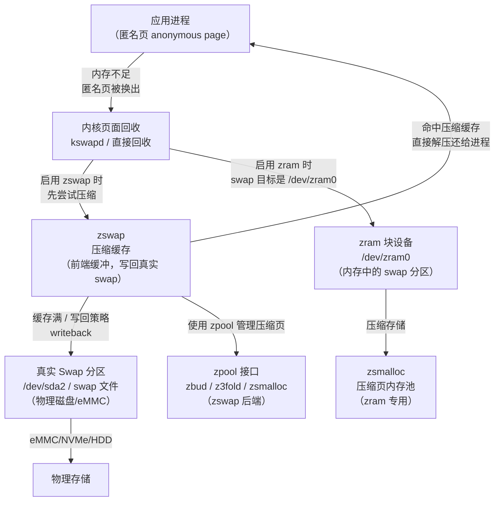
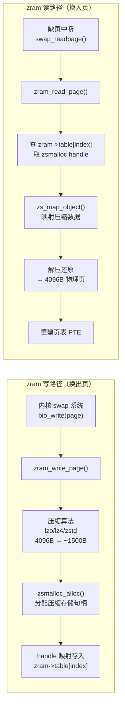
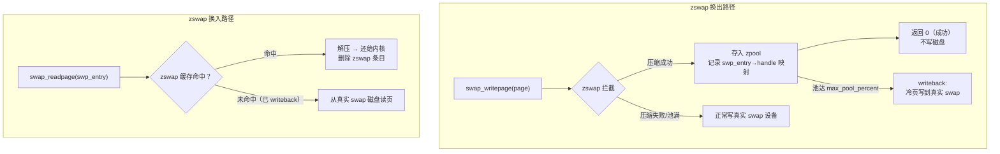
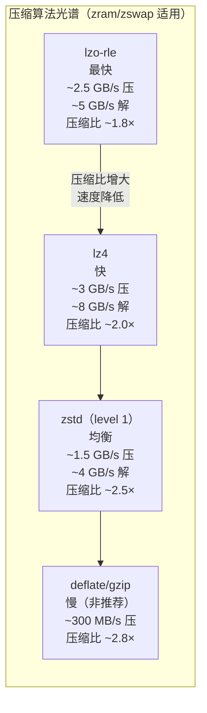
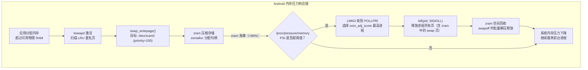

# 内存压缩：zram 与 zswap

> [!abstract] TL;DR
> 当物理 RAM 用满时，内核需要将不活跃内存页换出到慢速存储设备——但磁盘 swap 延迟往往高达毫秒级。**zram** 和 **zswap** 是 Linux 内核在"CPU 时间换内存容量"这一思路下演化出的两条路线：zram 在 RAM 中模拟一个压缩块设备作为 swap 分区（无需磁盘，Android/ChromeOS 的标配）；zswap 则是真实 swap 设备前的透明压缩写回缓存（减少 I/O、延缓写盘）。二者均通过 lzo/lz4/zstd 等轻量压缩算法以极低延迟（微秒级）换取 1.5×~3× 的有效内存放大，搭配 PSI（Pressure Stall Information）可精确感知内存压力、驱动 LMKD 做精细化进程裁减。本章系统拆解 zram/zswap 的内核数据结构、压缩后端选择、Android 生产配置与调优要点。

---

## 概述与定位

### 内存压力的根本矛盾

移动设备和嵌入式平台常面临"RAM 太小、Swap 磁盘不存在"的双重困境。即便桌面系统配备了 NVMe SSD，磁盘 swap 的 IO 延迟也比内存高出 3~4 个数量级：

| 存储层次 | 典型延迟 | 带宽量级 |
|---|---|---|
| L3 Cache | ~10 ns | >100 GB/s |
| DRAM | ~60 ns | ~50 GB/s |
| NVMe SSD（swap） | 50~200 μs | 3~7 GB/s |
| eMMC（移动设备） | 100 μs~1 ms | 300~700 MB/s |
| 机械硬盘（HDD） | 5~10 ms | ~150 MB/s |

当内核不得不将页面换出到磁盘时，应用程序访问被换出的页会触发缺页中断，陷入毫秒级等待。对交互型应用而言，这直接导致 Jank（卡顿）。

**内存压缩的核心思路**：用 CPU 时间（压缩/解压 ns~μs 级）置换内存空间，将换出页压缩后仍放在 RAM 里，或者在写到磁盘前压缩以减少 I/O 量。

### zram 与 zswap 的定位区别



| 维度 | zram | zswap |
|---|---|---|
| 本质 | 压缩内存块设备（/dev/zram0） | swap 前端透明压缩缓存 |
| 是否需要真实 swap | 不需要 | 需要（作为 writeback 目标） |
| 适用场景 | Android/ChromeOS/无盘嵌入式 | 桌面/服务器，有慢速 swap 磁盘 |
| 内存池后端 | zsmalloc（专为 zram 优化） | zbud / z3fold / zsmalloc |
| 写回目标 | 无（满则 OOM 或 LMKD 杀进程） | 真实 swap 设备 |
| 内核模块 | `zram`（CONFIG_ZRAM） | `zswap`（CONFIG_ZSWAP） |
| 典型配置 | 物理内存的 50%~100% 的 swap | 物理内存的 20% 的压缩缓存池 |

---

## 原理与机制

### swap 的内核基础回顾

理解 zram/zswap 前，先明确 Linux swap 机制：

1. **匿名页（anonymous page）**：没有文件后备的内存页（堆、栈、mmap 匿名区）。当物理内存不足，kswapd 或直接回收路径将这些页通过 `swap_writepage()` 换出到 swap 设备，并在页表中记录 swap 条目（PTE 高位存 swp_entry_t）。
2. **换入（swapin）**：进程访问已换出页时触发缺页中断，内核调用 `swap_readpage()` 将页读回并重建 PTE 映射。
3. **swap 优先级**：`/proc/swaps` 列出所有 swap 设备；优先级高的优先使用。zram 通常配置为最高优先级（priority=100），使内核优先将页换到 zram 而非磁盘。

### zram 的工作原理

**zram** 创建了一个或多个 `/dev/zramN` 块设备，其后端完全在 RAM 中——没有任何磁盘 I/O。内核视 `/dev/zram0` 为普通 swap 块设备，正常走 swap 路径；zram 驱动在收到写请求时将整页（4KB）用选定压缩算法压缩，存入 `zsmalloc` 内存池；读请求时解压还原。



**关键数据结构（内核 `drivers/block/zram/zram_drv.c`）**：

```c
/* 每个 zram 设备 */
struct zram {
    struct zram_table_entry *table;   /* 每个逻辑块的元数据数组 */
    struct zs_pool          *mem_pool; /* zsmalloc 内存池 */
    struct zcomp            *comp;    /* 压缩后端（lz4/zstd 等） */
    u64                      disksize; /* 设备大小（字节） */
    /* ... */
};

/* 每块的元数据，共 8 字节 */
struct zram_table_entry {
    union {
        unsigned long handle;   /* zsmalloc 句柄 → 指向压缩数据 */
        unsigned long element;  /* same-value-fill 特殊标记 */
    };
    unsigned int   flags;      /* 状态标志：ZRAM_SAME / ZRAM_WB / ... */
};
```

**零页/同值页优化**：如果整页全零或所有字节相同（如 `memset` 初始化的内存），zram 不实际存储压缩数据，只在 `flags` 中标记 `ZRAM_SAME`，并记录该字节值。这类页在 Android 中占比可达 10%~20%，完全无内存开销。

### zswap 的工作原理

**zswap** 是一个"swap 写拦截器"。当内核调用 `swap_writepage()` 准备将匿名页写到 swap 设备时，zswap 拦截这个请求：

1. 用压缩算法压缩该页；
2. 将压缩数据存入 zpool（zbud/z3fold/zsmalloc）管理的内存池；
3. 同时在 zswap 缓存中记录 `<swp_entry_t → 压缩数据>` 的映射；
4. 不实际写磁盘，直接返回成功。

当该页被再次访问（swapin）时：
1. 内核调用 `swap_readpage()`；
2. zswap 从缓存中找到压缩数据并解压，直接返回页，不读磁盘。

当 zswap 内存池用满（达到 `zswap_max_pool_percent`）时，触发 **writeback**：将最旧/最冷的压缩页解压后写到真实 swap 设备，腾出 zpool 空间。



### zpool 后端：zbud / z3fold / zsmalloc

zswap 使用 **zpool** 抽象层管理压缩后的内存，可选三种后端：

#### zbud（双页伙伴）

每个 zbud 页（4KB）最多存放 **2 个** 压缩对象。设计极简，查找 O(1)，但空间利用率最差——若一个压缩页 3.5KB，另一个 0.5KB，它们不能放同一个物理页，平均压缩比上限约 **1.7×**。

```
物理页（4096B）:
┌──────────────────────────────────┐
│ 压缩对象A（≤2048B）              │
├──────────────────────────────────┤
│ 压缩对象B（≤2048B）              │
└──────────────────────────────────┘
每页最多 2 个对象，剩余空间浪费
```

#### z3fold（三页折叠）

每个物理页最多存放 **3 个** 压缩对象，空间利用率高于 zbud，平均约 **2.5×**。内部用偏移量追踪三个槽位，略有管理开销。

#### zsmalloc（size-class 内存池）

zram 专用，zswap 也可使用。将压缩对象按大小分成若干 **size class**，同一 class 的对象打包进连续的物理页组（zspage，通常 4 个连续物理页 = 16KB），跨物理页存储（一个对象可横跨两个物理页边界）。空间利用率最高（可达 **3×** 以上），但映射/解映射需要 `kmap` 处理跨页情况，实现最复杂。

| 后端 | 每物理页对象数 | 典型压缩放大 | 适用场景 |
|---|---|---|---|
| zbud | ≤2 | ~1.7× | 低内存/简单场景，zswap 默认 |
| z3fold | ≤3 | ~2.5× | 中等场景 |
| zsmalloc | 按 size-class 打包 | ~3×+ | zram 默认，高压缩比需求 |

---

## 结构/算法/伪代码详解

### 压缩算法选择：速度 vs 压缩比

zram/zswap 对压缩算法的要求与通用压缩不同：**延迟敏感**（解压路径在缺页中断关键路径上），**单次操作固定大小**（4KB 页），对**高度可压缩数据**（全零页、代码段）效果显著，对**随机数据/已压缩文件**收益很小。



**lzo-rle（lzo + run-length encoding）**：Linux 6.0 起 zram 默认算法。在 lzo 基础上对全零运行加速，对内存中大量全零页（未初始化堆、归零 BSS）特别高效。ARM64 软件实现约 800 MB/s 压缩、2000 MB/s 解压。

**lz4**：比 lzo 压缩比稍高，速度相近，在高负载下 CPU 开销更可预测。ChromeOS 和部分 Android 版本使用。`lz4hc`（high compression）压缩比接近 zstd level 1，但压缩速度慢 3×，通常不适合 zram。

**zstd（Zstandard，level 1）**：Meta 开发，以 level 1 运行时速度接近 lz4 但压缩比更高约 20%~30%。Linux 5.11 引入 zstd 支持，推荐用于 RAM 偏小、希望最大化内存放大的场景（如 4GB RAM 的平板）。内核中使用 `zstd_compress_bound()` 预计算最坏情况输出大小，保证不溢出目标缓冲区。

**伪代码：zram 写单页完整流程**

```c
// zram_write_page() 简化伪代码
int zram_write_page(struct zram *zram, struct page *page, u32 index) {
    void *src = kmap_atomic(page);          // 映射源页到内核虚拟地址

    // 1. 同值页检测（全零或单一字节）
    if (page_same_filled(src, &element)) {
        zram->table[index].element = element;
        zram->table[index].flags  = ZRAM_SAME;
        kunmap_atomic(src);
        atomic64_inc(&zram->stats.same_pages);
        return 0;
    }

    // 2. 压缩（以 lz4 为例）
    size_t clen = zram_max_compressed_size;
    int ret = lz4_compress(src, PAGE_SIZE, comp_buf, &clen, workspace);
    kunmap_atomic(src);

    if (ret || clen >= PAGE_SIZE) {
        // 压缩失败或无收益：以未压缩形式存储（标记 ZRAM_HUGE）
        // 或直接写失败让 swap 层处理
        goto store_uncompressed;
    }

    // 3. 从 zsmalloc 分配压缩大小的句柄
    unsigned long handle = zs_malloc(zram->mem_pool, clen, GFP_NOIO);
    if (!handle) return -ENOMEM;   // OOM → kswapd 继续回收

    // 4. 映射句柄对应的内核地址，拷贝压缩数据
    void *dst = zs_map_object(zram->mem_pool, handle, ZS_MM_WO);
    memcpy(dst, comp_buf, clen);
    zs_unmap_object(zram->mem_pool, handle);

    // 5. 记录句柄，更新统计
    zram->table[index].handle = handle;
    atomic64_add(clen, &zram->stats.compr_data_size);
    return 0;
}
```

### zsmalloc 内部：跨页对象布局

zsmalloc 的核心挑战：**压缩对象大小不对齐物理页**，如一个 1500B 的压缩页在 4KB 物理页中放 2 个还余 1096B——这剩余空间可以存放另一个不超过 1096B 的对象。zsmalloc 将物理页组织成 **zspage**（由固定数量的物理页组成，LRU 管理），每个 zspage 服务同一个 size-class。

```
zspage（size-class = 1500B，由 2 个物理页组成，共 8192B）:
┌──────────┬──────────┬──────────┬──────────┬──────────┐
│ 对象[0]  │ 对象[1]  │ 对象[2]  │ 对象[3]  │ 对象[4]  │
│  1500B   │  1500B   │  1500B   │  1500B   │  1500B   │
└──────────┴──────────┴──────────┴──────────┴──────────┘
                         ↑ 对象[2] 跨越两个物理页边界
                         需要 kmap/kunmap 处理

实际存 5 个对象 = 7500B / 8192B = 91.5% 利用率
（zbud 同等场景仅 2×1500B/4096B = 73.2%）
```

跨页对象访问需要用 `zs_map_object()` 在内核虚拟地址空间中创建临时映射（通过 `kmap` 或 `page_address()`），访问完毕立即 `zs_unmap_object()` 释放映射——这是 zsmalloc 比 zbud 慢的原因，但空间效率更高。

### PSI（Pressure Stall Information）：量化内存压力

PSI 是 Linux 5.2 引入的内存压力感知机制，通过 `/proc/pressure/memory` 暴露三个指标：

```
some avg10=23.45 avg60=18.21 avg300=12.03 total=1234567
full avg10=5.12  avg60=3.98  avg300=2.11  total=234567
```

- **some**：至少一个任务因内存不足而 stall 的时间占比（%）；
- **full**：所有可运行任务都因内存不足而 stall 的时间占比（等待换入）；
- **avg10/60/300**：最近 10s/60s/5min 的指数移动平均；
- **total**：累计 stall 微秒数。

Android 的 **LMKD（Low Memory Killer Daemon）** 通过 `pollfd` 监听 `/proc/pressure/memory` 的 `POLLPRI` 事件（内核在 PSI 超过阈值时触发），在用户态决定杀哪个进程——相比旧内核的 `lowmemorykiller` 模块（硬编码阈值、无法感知 zram 压缩状态），LMKD+PSI 精度更高，能区分"内存已满但 zram 还有空间"与"真正的内存耗尽"。

```
配置示例（Android lmkd.conf）：
psi_partial_stall_ms = 70      # some avg10 超 70ms/s 触发 softKill
psi_complete_stall_ms = 700    # full avg10 超 700ms/s 触发 aggressiveKill
```

### zram 与 LMKD 协作流程



---

## 工具视角与实战

### 查看和操作 zram：/sys/block/zram0/ 与 zramctl

zram 设备的所有参数通过 sysfs 暴露：

```bash
# 查看 zram0 的核心统计
cat /sys/block/zram0/stat             # 通用块设备统计（读/写次数、扇区数）
cat /sys/block/zram0/mm_stat          # 内存使用统计（8 列）
cat /sys/block/zram0/comp_algorithm   # 当前/可用压缩算法

# mm_stat 各列含义（字节）：
# orig_data_size  compr_data_size  mem_used_total  mem_limit
# mem_used_max    same_pages       pages_compacted  huge_pages
# 示例：
# 2147483648 812345678 856234990 0 0 18734 0 1234
# 原始 2GB 数据，压缩后 775MB，实际占用 816MB（含 zsmalloc 元数据）
# 压缩比 ≈ 2.64×

# 查看配置的压缩算法（带 [] 的为当前算法）
# 输出示例：lzo lzo-rle [lz4] zstd
cat /sys/block/zram0/comp_algorithm
```

**`zramctl` 工具**（util-linux 2.23+，比手动操作 sysfs 更友好）：

```bash
# 列出所有 zram 设备状态
zramctl
# 输出：
# NAME       ALGORITHM DISKSIZE  DATA COMPR TOTAL STREAMS MOUNTPOINT
# /dev/zram0 lz4            4G  2.7G 1.1G  1.2G       4 [SWAP]

# 创建新 zram 设备，指定大小和压缩算法
zramctl --find --size 4G --algorithm zstd
# 输出 /dev/zram1

# 销毁（重置）设备前须先 swapoff
swapoff /dev/zram0
echo 1 > /sys/block/zram0/reset

# 查看当前 zram 的详细信息
zramctl /dev/zram0
```

### zram-generator：systemd 自动管理

现代 Linux 发行版（Fedora 33+、Ubuntu 22.04+）通过 `zram-generator` 在 systemd 下自动配置 zram swap，无需手动脚本：

```ini
# /etc/systemd/zram-generator.conf
[zram0]
zram-size = ram / 2          # 使用物理内存一半大小
compression-algorithm = zstd  # 使用 zstd 压缩
swap-priority = 100           # 高优先级，优先换到 zram
```

```bash
# 安装并启用
dnf install zram-generator           # Fedora
systemctl daemon-reload
systemctl start systemd-zram-setup@zram0.service
swapon --show                        # 验证 /dev/zram0 已作为 swap 挂载
```

### 手动配置 zram（嵌入式/Android 场景）

```bash
#!/bin/sh
# zram 初始化脚本（适用于没有 zram-generator 的系统）
MEM_TOTAL=$(grep MemTotal /proc/meminfo | awk '{print $2}')
ZRAM_SIZE=$((MEM_TOTAL * 1024 / 2))   # 物理内存的 50%（字节）

# 1. 加载模块（若未内建）
modprobe zram num_devices=1

# 2. 设置压缩算法（内核需支持对应算法）
echo lz4 > /sys/block/zram0/comp_algorithm

# 3. 设置设备大小（字节）
echo $ZRAM_SIZE > /sys/block/zram0/disksize

# 4. 格式化为 swap 并启用（高优先级）
mkswap /dev/zram0
swapon -p 100 /dev/zram0

echo "zram0 initialized: ${ZRAM_SIZE} bytes, lz4 compression"
```

### 配置 zswap

zswap 通过内核参数或 sysfs 配置，无需块设备操作：

```bash
# 查看 zswap 当前状态
cat /sys/module/zswap/parameters/enabled        # Y/N
cat /sys/module/zswap/parameters/max_pool_percent  # 最大占用物理内存百分比
cat /sys/module/zswap/parameters/compressor     # 压缩算法
cat /sys/module/zswap/parameters/zpool          # 后端池类型

# 运行时启用 zswap（需要系统已有 swap 设备）
echo Y > /sys/module/zswap/parameters/enabled

# 内核启动参数（/etc/default/grub）
GRUB_CMDLINE_LINUX="... zswap.enabled=1 zswap.compressor=lz4 \
    zswap.max_pool_percent=20 zswap.zpool=z3fold"

# 查看 zswap 统计
cat /sys/kernel/debug/zswap/pool_total_size    # 当前已用内存（字节）
cat /sys/kernel/debug/zswap/stored_pages       # 已缓存的压缩页数
cat /sys/kernel/debug/zswap/pool_limit_hit     # 达到上限次数（writeback 触发次数）
cat /sys/kernel/debug/zswap/written_back_pages # 已写回磁盘的页数
cat /sys/kernel/debug/zswap/reject_compress_fail  # 压缩失败次数
```

**关键调优参数**：

| 参数 | 默认值 | 说明 |
|---|---|---|
| `max_pool_percent` | 20 | zswap 池最大占物理内存百分比，超过触发 writeback |
| `compressor` | lzo-rle | 压缩算法：lzo/lzo-rle/lz4/zstd |
| `zpool` | zbud | 内存池后端：zbud/z3fold/zsmalloc |
| `accept_threshold_percent` | 90 | 池使用率超过此值时拒绝新压缩（直接写磁盘） |

### 内存压力分析工作流

```bash
# 1. 查看实时内存压力
cat /proc/pressure/memory
# some avg10=12.45 avg60=8.21 avg300=4.03 total=123456789
# full avg10=2.12  avg60=1.08 avg300=0.51 total=23456789

# 2. 持续监控 PSI + zram 统计
watch -n 1 '
echo "=== PSI Memory ==="; cat /proc/pressure/memory
echo "=== zram mm_stat ==="; cat /sys/block/zram0/mm_stat
echo "=== Swap Usage ==="; free -h | grep Swap
'

# 3. 计算 zram 实际压缩比
# mm_stat 格式: orig_data_size compr_data_size mem_used_total ...
awk '{printf "压缩比: %.2fx\n内存开销: %.1f%%\n", $1/$2, $3/$1*100}' \
    /sys/block/zram0/mm_stat

# 4. 查看哪些进程占用最多匿名内存（潜在 zram 候选）
smem -s swap -r | head -20   # 按 swap 使用量排序
# 或
for pid in /proc/[0-9]*/; do
    swap=$(awk '/^VmSwap/{print $2}' "${pid}status" 2>/dev/null)
    [ -n "$swap" ] && [ "$swap" -gt 0 ] && \
        printf "%6d kB  %s\n" "$swap" "$(cat ${pid}comm 2>/dev/null)"
done | sort -rn | head -10

# 5. 追踪 zswap writeback 频率（高频说明 max_pool_percent 太低）
watch -n 5 'cat /sys/kernel/debug/zswap/written_back_pages'
```

### Android zram 配置实战

Android 通过 `init.rc` 脚本和 `fstab` 配置 zram，具体参数因厂商而异：

```bash
# 典型 Android zram 配置路径
# /system/etc/fstab.${ro.boot.hardware}
# 或 /vendor/etc/fstab.*

# zram 大小配置（通常在 init.*.rc 中）
# 8GB 设备典型配置：
write /sys/block/zram0/comp_algorithm lzo-rle
write /sys/block/zram0/disksize 4294967296   # 4GB

# 查看运行中 Android 设备的 zram 状态（adb shell）
adb shell cat /proc/swaps
# Filename         Type      Size      Used  Priority
# /dev/block/zram0 partition 4194300   825604  -2

adb shell cat /sys/block/zram0/mm_stat
# 2147483648 820345678 863234990 0 863234990 18734 0 0 0
# 原始2GB，压缩后~782MB，压缩比~2.74×

# 查看 LMKD 配置
adb shell getprop lmkd.kill_heaviest_task
adb shell getprop ro.config.low_ram
```

---

## 安全性与正确使用

### 压缩 CPU 开销的量化与管理

zram 在换出/换入路径上引入 CPU 开销，需要在配置时纳入考量：

**压缩 CPU 开销估算**：以 lz4 为例，压缩 4KB 页约需 1~3 μs（单核），等效 CPU 带宽约 1.3~4 GB/s。若系统每秒发生 10,000 次页面换出（相当于 40 MB/s 换出速率），压缩开销约占单核 **1%~3%**。zstd 压缩同等页面约需 4~8 μs，开销约 **4%~10%**。

**多线程压缩（`max_comp_streams`）**：

```bash
# 查看当前并行压缩流数
cat /sys/block/zram0/max_comp_streams  # 通常等于 CPU 核数

# 手动设置（在 disksize 之前设置）
echo 4 > /sys/block/zram0/max_comp_streams
```

Linux 5.4 后 zram 默认对每个 CPU 核使用独立的压缩流（per-CPU），避免锁竞争。在高并发内存压力下，8 核机器可并行压缩 8 个页面。

### 冷数据换出延迟

zram 换入（解压）延迟通常 **2~10 μs**，远低于 NVMe（50 μs）和 eMMC（200+ μs），但仍高于直接内存访问（60 ns）。对**延迟敏感型应用**（实时音频、高帧率渲染），被换出到 zram 的页面重新访问时仍会有可感知的抖动。

**缓解方法**：
1. 使用 `mlock()` 锁定关键数据结构，禁止其被换出（不进 zram）；
2. 合理设置进程 OOM 权重（`/proc/PID/oom_score_adj`），让重要进程的页更晚被换出；
3. 配置 `vm.swappiness` 控制换出激进程度（Android 通常设为 100 以尽量利用 zram，而非保留 RAM 给文件页缓存）。

### zram 大小边界

zram 自身也占内存（zsmalloc 元数据 + 压缩数据）。经验规则：

- **推荐 zram 大小**：物理内存的 **50%~100%**。配置 100% 并不意味着实际使用 100% 物理内存——压缩后实际内存开销通常只有逻辑大小的 **30%~50%**（压缩比 2×~3×）。
- **上限警告**：若 zram 全满（无法压缩或压缩比太低），系统会因无 swap 空间而触发 OOM Killer，行为与无 swap 系统相同。配置合理的 `zram-size` 和 LMKD 阈值是关键。

```bash
# 监控 zram 使用率，避免打满
awk '{
    orig=$1; compr=$2; used=$3;
    if (orig > 0)
        printf "已用逻辑: %.1fGB, 实际占内存: %.1fGB (%.1f%%), 压缩比: %.2fx\n",
               orig/1073741824, used/1073741824, used/orig*100, orig/compr
}' /sys/block/zram0/mm_stat
```

### 压缩不友好的数据

并非所有内存都能被有效压缩。以下类型数据压缩比接近 1（甚至膨胀），zram 对其收益有限：

- **已压缩文件的缓存**（JPEG、MP4、ZIP 解压后的内容缓冲区）：随机字节分布，压缩比 ~1.0×；
- **加密内存区域**（SSL/TLS 缓冲区、密钥存储）：高熵数据，无法压缩；
- **PRNG 输出缓冲区**：同上。

zram 对这类页面会检测压缩无收益（压缩后 ≥ 原大小），标记为 `ZRAM_HUGE` 并以原始大小存储（或直接拒绝，让 OOM Killer 处理）。

```bash
# 查看 huge_pages 比例（不可压缩页面数量）
awk '{printf "不可压缩页: %d (%.1f%%)\n",
    $8, $8/($1/4096)*100}' /sys/block/zram0/mm_stat
```

### zswap 与 zram 同时启用的注意事项

理论上两者可同时启用（zswap 作为 zram 的前端缓存），但实践中意义不大——zram 本身就在内存中，zswap 的作用（减少磁盘 I/O）对 zram 没有意义，而且会造成**二次压缩**（同一页被压缩两次）浪费 CPU。

**推荐组合**：
- **无磁盘 swap / 移动设备**：仅用 zram，禁用 zswap；
- **有磁盘 swap / 桌面服务器**：启用 zswap（前端缓存）+ 磁盘 swap（后端），不用 zram；
- **需要最大内存利用**：同时挂载 zram swap（优先级高）+ 磁盘 swap（优先级低），不用 zswap。

---

## 小结

zram 和 zswap 是 Linux 内核"压缩即内存扩容"理念的两条实现路线，解决不同场景下的内存瓶颈：

**zram** 在 RAM 中模拟块设备，通过 zsmalloc 内存池和 lzo-rle/lz4/zstd 等算法将不活跃匿名页压缩存储，实现 2×~3× 的有效内存放大，换入延迟仅 2~10 μs。这是 Android、ChromeOS 和嵌入式 Linux 无盘系统的首选方案，配合 LMKD+PSI 构成完整的内存压力响应链。`zramctl` 和 `/sys/block/zram0/mm_stat` 是日常监控的利器。

**zswap** 作为真实 swap 设备的透明前端，通过 zbud/z3fold/zsmalloc 三种 zpool 后端拦截换出 I/O，将热页压缩保留在内存，冷页最终 writeback 到磁盘。它在有 swap 磁盘的桌面/服务器场景显著减少 I/O 等待，以 CPU 时间换取更低的 swap 延迟。

压缩算法的选择是核心权衡：lzo-rle 速度最快（适合 CPU 资源紧张的移动设备）；lz4 速度与压缩比均衡；zstd level 1 压缩比最优（适合希望最大化内存放大的场景）。不可压缩数据（加密内容、JPEG）对两者收益都很有限，需通过 `mm_stat` 中的 `huge_pages` 字段监控。

PSI 是连接内存压缩层与进程管理层的关键接口——它将"内存 stall 时间"量化为可编程的触发信号，让 LMKD 在用户态以精细粒度控制内存换出与进程回收的边界，比传统 lowmemorykiller 的硬编码阈值更具适应性。

---

## 相关阅读

- Linux 内核文档：[`Documentation/admin-guide/zram.rst`](https://www.kernel.org/doc/html/latest/admin-guide/zram.html)
- Linux 内核文档：[`Documentation/vm/zswap.rst`](https://www.kernel.org/doc/html/latest/vm/zswap.html)
- PSI 文档：[`Documentation/accounting/psi.rst`](https://www.kernel.org/doc/html/latest/accounting/psi.html)
- AOSP LMKD 源码：`system/memory/lmkd/`
- zsmalloc 设计论文：*"ZSMALLOC: A Memory Allocator for Compressed In-Memory Storage"*
- Zstandard 官方基准：[facebook/zstd](https://github.com/facebook/zstd#benchmarks)
- `zram-generator` 项目：[systemd/zram-generator](https://github.com/systemd/zram-generator)
- 《深入理解 Linux 内核》第 17 章（内存回收）
- [[02.进程地址空间与虚拟内存|02. 进程地址空间与虚拟内存]]
- [[03.mmap与brk内核内存接口|03. mmap 与 brk 内核内存接口]]

---

[[00.内存管理与堆分配器总览|⬆ 系列总览]] | [[21.自定义内存池与对象池设计|← 上一章]] | [[23.内存屏障与分配器并发安全|→ 下一章]]
