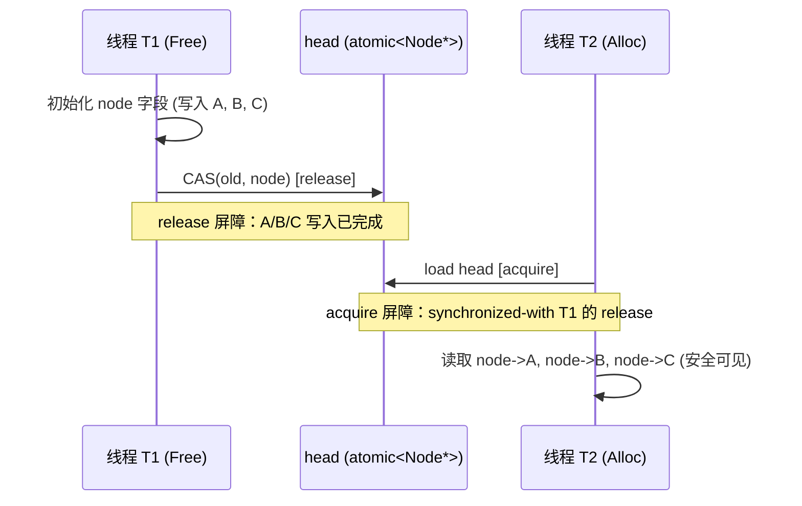
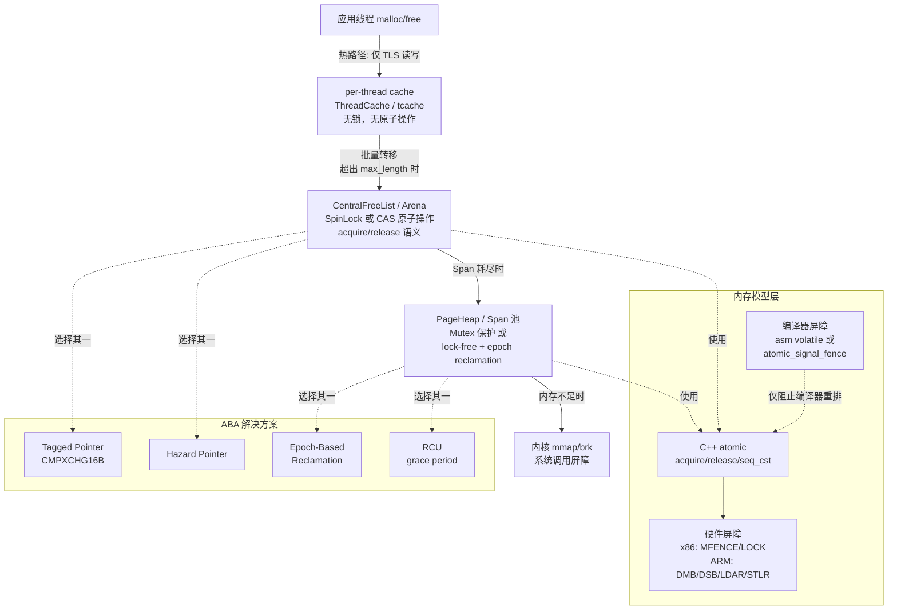

---
tags:
  - 内存管理
  - tier3
  - 并发
  - 内存屏障
---
# 内存屏障与分配器并发安全

> [!abstract] TL;DR
> 现代多核系统中，CPU 乱序执行与编译器重排使"内存写入的可见性"成为不平凡的问题。C11/C++11 内存模型通过 `memory_order` 枚举给出形式化保证，底层对应 `mfence`/`lfence`/`sfence`（x86）或 `dmb`/`dsb`（ARM）等硬件指令。堆分配器是多线程程序最高频的共享资源；tcmalloc 的 per-thread cache、jemalloc 的 per-arena tcache 通过将热路径绑定到单线程来彻底回避锁竞争，而冷路径（central freelist、span 归还）则依靠精确的 acquire/release 语义保证无锁 freelist 的正确性。ABA 问题是无锁结构的头号陷阱，tagged pointer、hazard pointer、epoch-based reclamation（EBR）与 RCU 四种方案各有适用层次。cacheline 对齐（`alignas(64)`）和 false sharing 消除是分配器并发性能的最后一道门。逆向分析并发原语时，识别 `LOCK` 前缀、`CMPXCHG`、`LDREX`/`STREX` 是还原算法语义的关键入口。

## 概述与定位

### 为什么并发安全是分配器的核心问题

堆分配器在每一个多线程程序中扮演隐形的"内存中间商"角色。几乎所有业务逻辑最终都会调用 `malloc`/`free`，其频率远超显式锁操作。在早期 glibc ptmalloc2（以及更早的 dlmalloc）中，整个堆被一把全局互斥量保护——这在单核时代够用，但在多核机器上立刻成为瓶颈：Thread A 调用 `malloc` 时 Thread B 的 `free` 会在互斥量上阻塞，高并发工作负载下吞吐量不随核数线性增长，反而出现竞争引发的性能悬崖。

ptmalloc2 的 arena 机制（`main_arena` 之外允许最多 `2×CPU核数` 个 thread arena，每个 arena 有独立的 mutex）是第一次重要改进，但仍是粗粒度锁。tcmalloc 和 jemalloc 则走向极端：**热路径完全无锁**，把大多数 `malloc`/`free` 操作限制在当前线程私有的缓存结构内，只有缓存耗尽或溢出时才向共享层求援，而共享层用原子操作而非互斥量协调。

理解这套机制需要三层知识：C++/C11 内存模型（语言层保证）、CPU 内存模型（硬件层乱序规则）、以及并发数据结构（算法层无锁设计）。本篇将三者整合，以分配器为主线穿针引线。

### 本篇在系列中的位置

本系列前面各篇覆盖了分配器的结构（05–09 ptmalloc2、10 tcmalloc、11 jemalloc）和安全防御（13、15、18），但并发机制一直是"隐含假设"而非正面展开的主题。本篇是对这一缺口的补全，同时也是逆向分析分配器实现时理解同步原语的参考手册。

---

## 原理与机制

### C11/C++11 内存模型基础

在 C11/C++11 之前，C/C++ 标准对多线程毫无定义——程序的行为完全依赖编译器和平台的非标准保证。C11 和 C++11 同时引入了统一的**内存模型**，核心是两个概念：

**happens-before（HB）关系**：若操作 A happens-before 操作 B，则 B 能观察到 A 的所有副作用。HB 由以下来源构成：

1. 单线程内的程序顺序（sequenced-before）
2. 跨线程的 synchronizes-with 关系
3. 以上两者的传递闭包

**synchronizes-with（SW）关系**：当线程 W 用 release 语义写入原子变量 X，线程 R 随后用 acquire 语义读到该写入，则 W 的写操作 synchronizes-with R 的读操作。这意味着 W 在写 X 之前的所有内存写入，对 R 在读 X 之后的所有读操作都可见。

这个模型是**弱内存模型**的最小公约数——它不要求所有写入对所有线程按统一顺序可见，只要求通过特定 acquire/release 配对建立的因果链。

### memory_order 枚举详解

C++11 `<atomic>` 提供六种内存顺序，是程序员向编译器和 CPU 表达意图的接口：

**`memory_order_relaxed`**：只保证该操作本身的原子性（不撕裂），不建立任何 happens-before 关系。适用于纯粹的计数器累加（如统计分配次数），操作结果最终会被其他线程看到，但无顺序保证。误用 relaxed 是无锁代码中最隐蔽的 bug 来源——编译器和 CPU 都可以自由重排。

**`memory_order_acquire`**：读操作。禁止后续内存访问被重排到此操作之前（在 acquire 之后的读写不能越过它往前跑）。配合 release 使用，形成 synchronizes-with 链。

**`memory_order_release`**：写操作。禁止之前的内存访问被重排到此操作之后（在 release 之前的读写不能越过它往后跑）。

**`memory_order_acq_rel`**：原子读-改-写操作（如 CAS、fetch_add）同时具有 acquire 和 release 语义，即对读端建立 acquire 屏障，对写端建立 release 屏障。用于 compare_exchange 的成功路径。

**`memory_order_seq_cst`**：最强保证，所有 seq_cst 操作之间存在单一全局顺序，所有线程观察到的顺序相同。是 C++ 原子操作的默认值，也是最安全但开销最高的选项。在 x86 上，seq_cst store 需要 `MFENCE` 或带 `LOCK` 前缀的指令；在 ARM 上开销更显著。

**`memory_order_consume`**：比 acquire 弱，只保证依赖于该原子读取的操作顺序正确（数据依赖链）。实践中几乎无法被编译器正确优化，主流编译器将其提升为 acquire 处理，标准委员会也已实际冻结了 consume 的进一步使用。

### 编译器屏障 vs 硬件屏障

**编译器屏障**（compiler barrier）只对编译器可见，阻止编译器跨越屏障重排内存访问。在 GCC/Clang 中：

```c
asm volatile("" ::: "memory");   // GCC/Clang 编译器屏障
```

`std::atomic_signal_fence(memory_order_seq_cst)` 是标准等价物。编译器屏障不发出任何机器指令，仅影响代码生成阶段的调度决策。

**硬件屏障**（memory fence）是真实 CPU 指令，强制 CPU 不得将屏障之前的某类内存操作推迟到屏障之后执行（或将之后的操作提前）：

x86 架构：
- `MFENCE`（Memory Fence）：全屏障，禁止所有 load/store 跨越屏障
- `LFENCE`（Load Fence）：禁止 load 指令跨越屏障，且在 LFENCE 之前的所有 load 必须完成后方可执行后续指令（序列化 load）
- `SFENCE`（Store Fence）：禁止 store 指令跨越屏障，主要用于弱写序的 WC（Write-Combining）内存类型，普通可缓存内存上 store 按程序顺序写入 store buffer，SFENCE 强制 flush store buffer

ARM 架构：
- `DMB`（Data Memory Barrier）：数据内存屏障，选项参数控制方向（`ISH`=内部共享域、`ISHLD`=仅 load、`ISHST`=仅 store）
- `DSB`（Data Synchronization Barrier）：比 DMB 更强，等待所有显式内存访问完成，并等待 cache/TLB/分支预测器等结构同步
- `ISB`（Instruction Synchronization Barrier）：刷新流水线，用于自修改代码和 MMU 配置更改后，内存管理中较少使用

在 Linux 内核源码中，`smp_mb()`/`smp_rmb()`/`smp_wmb()` 宏会根据目标架构展开为对应的硬件屏障或编译器屏障（对于强序架构如 x86，`smp_rmb()`/`smp_wmb()` 展开为纯编译器屏障，因为 x86 TSO 已保证 load-load 和 store-store 顺序）。

### x86 TSO vs ARM/POWER 弱序模型

**x86 Total Store Order（TSO）模型**是目前最广泛部署的强内存模型之一。其规则可简化为：

- Store-Store 有序：不同地址的 store 按程序顺序对其他核可见
- Load-Load 有序：不同地址的 load 按程序顺序执行
- Load 不能越过 Store（对同一核）：当 load 和 load 之后的 store 针对同一地址时，load 先执行
- **Store-Load 可以重排**：这是 x86 TSO 与顺序一致性模型的唯一差异点——store 可能在 store buffer 中停留，之后的 load 可以先完成

这意味着在 x86 上，acquire/release 语义几乎"免费"——普通 `mov` 指令就满足 acquire（load）和 release（store）语义，只有 seq_cst store 才需要 `MFENCE` 或 `LOCK XCHG`。

**ARM 弱内存模型**要宽松得多：ARM 允许 load-load、load-store、store-load、store-store 四类重排，甚至允许多核对同一写入序列观察到不同的顺序（non-multi-copy-atomic，在 ARMv8 之前）。每个 acquire/release 原子操作都必须附带对应屏障指令（`LDAR`/`STLR` 指令在 ARMv8 中直接内嵌 acquire/release 语义）。

这一差异对分配器逆向分析有直接影响：同一套算法在 x86 上可能"看起来正确"但在 ARM 上会暴露竞态，因为 x86 的硬件屏障帮忙掩盖了内存顺序问题。

### CAS：无锁算法的基石

`compare_exchange`（CAS，Compare-And-Swap）是无锁算法的核心原语：

```cpp
// 原子地执行：
// if (*this == expected) { *this = desired; return true; }
// else { expected = *this; return false; }
bool compare_exchange_strong(T& expected, T desired,
    memory_order success, memory_order failure);
bool compare_exchange_weak(T& expected, T desired,
    memory_order success, memory_order failure);
```

`_weak` 版本允许伪失败（spurious failure）——即使 `*this == expected` 也可能返回 false，但在循环中使用时性能更好（在 LL/SC 架构如 ARM 上，`LDREX`/`STREX` 天然允许伪失败，`_weak` 避免了外层包装循环）。

`_strong` 保证不伪失败，适用于非循环的单次判断场景。

x86 的 `LOCK CMPXCHG` 指令直接实现了 CAS 语义，且隐含完整的内存屏障。ARM 的 CAS 由 `LDAXR`（load-acquire exclusive）+ `STLXR`（store-release exclusive）对组成，若 store 失败（其他核破坏了 exclusive monitor）则重试整个循环。

---

## 结构/算法/伪代码详解

### 无锁 Freelist 的设计

无锁 freelist 是 lock-free 分配器最核心的数据结构，以单链表形式管理空闲块，`push`（释放）和 `pop`（分配）都用 CAS 实现：

```cpp
struct Node {
    std::atomic<Node*> next;
};

struct LockFreeStack {
    std::atomic<Node*> head{nullptr};

    void push(Node* node) {
        Node* old_head = head.load(memory_order_relaxed);
        do {
            node->next.store(old_head, memory_order_relaxed);
        } while (!head.compare_exchange_weak(
            old_head, node,
            memory_order_release,   // 成功：release，使 node 的写入对 pop 方可见
            memory_order_relaxed)); // 失败：relaxed，只需重读 head
    }

    Node* pop() {
        Node* old_head = head.load(memory_order_acquire); // acquire：使 push 的 release 可见
        Node* new_head;
        do {
            if (!old_head) return nullptr;
            new_head = old_head->next.load(memory_order_relaxed);
        } while (!head.compare_exchange_weak(
            old_head, new_head,
            memory_order_acquire,   // 成功：acquire
            memory_order_acquire)); // 失败：acquire，重新读取 head 时需要看到最新值
        return old_head;
    }
};
```

`push` 的 release 和 `pop` 的 acquire 构成 synchronizes-with 对：pop 成功后，能看到 push 之前对 `node` 所做的所有初始化写入，这保证了"分配出去的内存内容是确定的"这一基本安全属性。

### ABA 问题：无锁结构的致命陷阱

上述无锁 freelist 存在经典的 **ABA 问题**：

1. 线程 T1 读到 `head = A`，`A->next = B`，准备执行 `CAS(head, A, B)`
2. T1 被抢占，此时线程 T2 依次 `pop(A)`、`pop(B)`、`push(A)`（A 被重用）
3. T1 恢复，CAS 看到 `head == A` 认为成功，将 `head` 改为 B
4. 但此时 B 已经被 T2 释放并可能处于任意状态，`head` 指向悬空节点

在堆分配器中，ABA 导致 freelist 中出现指向已分配块的指针，后续 pop 返回正在被使用的内存，造成严重的堆破坏。

**解决方案 1：Tagged Pointer（版本计数器）**

利用 64 位指针中未使用的高位或低位存储一个递增标签，每次 push 时标签+1：

```cpp
struct TaggedPtr {
    uintptr_t ptr : 48;  // 实际指针（x86-64 用户态只用 48 位）
    uintptr_t tag : 16;  // ABA 计数器
};

std::atomic<TaggedPtr> head;

// push 时：
TaggedPtr new_head = { (uintptr_t)node, old_head.tag + 1 };
CAS(head, old_head, new_head);
```

标签使得重复出现的同一地址携带不同 tag，CAS 对 `(ptr, tag)` 整体比较，ABA 被检测为不同的值。这要求 CPU 支持双宽 CAS：x86-64 的 `LOCK CMPXCHG16B`（128 位 CAS）或 32 位系统的 `LOCK CMPXCHG8B`。

**解决方案 2：Hazard Pointer**

Maged Michael 于 2004 年提出。每个线程维护一个小的"危险指针"列表，在访问某个节点前将其地址写入危险指针，释放节点前检查它是否出现在任何线程的危险指针列表中：

```
线程访问节点 N 的协议：
  hp[tid] = N      // 声明 N 危险
  if (head != N):  // 验证 N 仍在列表中（否则 N 可能已被删除）
      retry
  // 安全使用 N ...
  hp[tid] = nullptr

释放节点 N 的协议：
  retire_list.push(N)
  if retire_list.size() > threshold:
      for each R in retire_list:
          if R not in any hp[]:
              free(R)  // 安全释放
```

Hazard Pointer 不需要 double-wide CAS，代价是每次访问都需要写 hazard pointer（引发 cacheline 写竞争）并在回收时扫描所有线程的危险指针（O(N×K)，N 为线程数，K 为每线程危险指针数）。

**解决方案 3：Epoch-Based Reclamation（EBR）**

按时间划分为若干 epoch（纪元），节点被"退休"（retire）时记录当前 epoch，仅当所有活跃线程都进入更新的 epoch 后才真正回收。

```
全局 epoch: 0 → 1 → 2 → ...（周期性推进）
每线程 local_epoch：线程进入临界区时同步为 global_epoch

退休节点 N：
  N.epoch = global_epoch
  retire_list[global_epoch % 3].push(N)

尝试回收：
  if all threads have local_epoch >= global_epoch:
      safe_to_free = retire_list[(global_epoch - 2) % 3]
      free all nodes in safe_to_free
      global_epoch++
```

EBR 开销很低（进出临界区仅需写一个 epoch 值），但要求线程不能在临界区内阻塞（否则 epoch 永远无法推进，内存积累）。jemalloc 的 background thread 使用了类似 epoch 的机制来安全回收 extent。

**解决方案 4：RCU（Read-Copy-Update）**

RCU 是 Linux 内核中最核心的无锁机制之一，思路是：读者完全无需任何同步开销，写者通过"复制-修改-原子替换"更新数据，并等待所有旧读者的"宽限期"（grace period）结束后再回收旧版本。

在用户态堆分配器中，RCU 风格常用于 per-CPU/per-thread 结构的安全更新：更新全局的 size class 配置或 arena 映射表时，写者不直接修改共享结构，而是分配新结构、填充后原子替换指针，老结构在确认无线程仍引用后释放。

### per-thread Cache：如何彻底避免锁竞争

tcmalloc 的 `ThreadCache` 和 jemalloc 的 `tcache` 共享同一核心思想：**把热路径上的分配和释放限制在单个线程内完成，彻底消灭竞争**。

tcmalloc 的 ThreadCache 结构（简化）：

```
┌──────────────────────────────────────────────────────────┐
│ ThreadCache (per-thread, TLS)                            │
│  FreeList[0]  → [size_class=8B]  → [ ]→[ ]→[ ]→...     │
│  FreeList[1]  → [size_class=16B] → [ ]→[ ]→...          │
│  ...                                                     │
│  FreeList[86] → [size_class=256KB]                       │
│  total_allocated_bytes (用于触发 GarbageCollect)         │
└──────────────────────────────────────────────────────────┘
         ↕ 超出 max_length 时批量归还
┌──────────────────────────────────────────────────────────┐
│ CentralFreeList[i] (per-size-class, 全局共享)            │
│  用 SpinLock 保护的 span 列表                           │
└──────────────────────────────────────────────────────────┘
         ↕ Span 耗尽时向 PageHeap 申请
┌──────────────────────────────────────────────────────────┐
│ PageHeap (全局, Mutex 保护)                              │
│  free_pages[1..kMaxPages]：按 span 大小分类的空闲列表   │
└──────────────────────────────────────────────────────────┘
```

`malloc` 热路径伪代码：

```cpp
void* ThreadCache::Allocate(size_t size) {
    size_t cl = SizeClass(size);
    FreeList& list = list_[cl];
    if (LIKELY(!list.empty())) {
        return list.Pop();  // 无任何原子操作、无任何 fence，仅指针读写
    }
    return FetchFromCentralCache(cl, size);  // 冷路径
}
```

热路径中完全没有原子操作——因为 TLS 变量只有当前线程访问，不存在竞争，普通的内存读写就足够。这是 per-thread cache 最大的并发优势：通过**所有权隔离**（ownership isolation）将竞争消灭在萌芽阶段。

jemalloc 的 tcache 设计类似，但以 extent（类似 span）而非 page 为单位管理，并且 tcache 的 gc（garbage collection）使用"ticker"计数器触发，每 N 次释放操作后清理一次过期的 tcache 条目，归还给 arena 的 slab。

### 分配器并发实践：acquire/release 的精确使用

以一个简化的 arena freelist（多线程共享的中间层）为例，展示 acquire/release 的精确应用：

```cpp
class ArenaFreelist {
    std::atomic<Node*> head_{nullptr};

public:
    // 释放：将 node 推入 freelist（多线程并发调用）
    void Free(Node* node) {
        // 确保 node 的所有字段写入完成后再暴露 node
        // node 本身的写入由调用者完成，这里只需 release 屏障
        Node* expected = head_.load(memory_order_relaxed);
        do {
            node->next = expected;   // 普通写，对 expected 已知
        } while (!head_.compare_exchange_weak(
            expected, node,
            memory_order_release,    // release：node 写入对 Alloc 可见
            memory_order_relaxed));  // 失败重试：只需 relaxed 重读
    }

    // 分配：从 freelist 弹出一个 node
    Node* Alloc() {
        Node* old_head = head_.load(memory_order_acquire); // acquire：看到 Free 的 release
        while (old_head) {
            Node* next = old_head->next;   // 安全：acquire 已建立 HB 关系
            if (head_.compare_exchange_weak(
                    old_head, next,
                    memory_order_acquire,   // 成功：acquire 保证 node 内容可见
                    memory_order_acquire))  // 失败：acquire 重读 head
                return old_head;
        }
        return nullptr;
    }
};
```

注意 failure 路径使用 `memory_order_acquire` 而非 `memory_order_relaxed`：CAS 失败意味着 head 被其他线程修改，需要重新 acquire 新的 head 值以正确看到其内容。这是一个经典的"失败 memory_order 不能弱于成功 memory_order 中的 load 部分"约束（标准要求 failure 的 order 不能是 release 或 acq_rel，且不能强于 success）。



### Mermaid：内存屏障与分配器并发架构总览



### False Sharing 与 cacheline 对齐

False sharing（伪共享）是多线程性能杀手：两个线程分别访问不同的变量，但这些变量恰好位于同一 cacheline（通常 64 字节），导致一个线程的写入使另一个线程的 cacheline 无效，引发不必要的 cache 一致性流量（MESI 协议的 Invalid 状态迁移）。

在分配器设计中，false sharing 有两个典型来源：

**场景 1：分配的相邻小对象**

若 Thread A 分配了 `obj_a`，Thread B 分配了 `obj_b`，二者大小都是 32 字节，且恰好来自同一 cacheline，那么 A 写 `obj_a` 会无效化 B 的 cacheline（反之亦然）。

解决方案：对存在竞争的对象使用 `alignas(64)` 确保各自独占一条 cacheline：

```cpp
struct alignas(64) HotCounter {
    std::atomic<long> value;
    // 填充至 64 字节，阻止其他变量进入同一 cacheline
    char padding[64 - sizeof(std::atomic<long>)];
};

// 或使用 C++17 hardware_destructive_interference_size
struct alignas(std::hardware_destructive_interference_size) PerCoreData {
    std::atomic<long> alloc_count;
    std::atomic<long> free_count;
};
```

**场景 2：分配器自身的元数据**

分配器的 per-arena 统计字段（已分配字节数、空闲块计数等）若布局紧凑，多线程并发更新时会产生严重 false sharing。tcmalloc 2.x 引入了 `ABSL_CACHELINE_ALIGNED` 宏（展开为 `__attribute__((aligned(64)))`）来隔离各统计字段；jemalloc 的 `arena_t` 结构中关键字段也以 cacheline 为单位对齐。

**`alignas` 的正确使用**：

```cpp
// C++11 及以后
alignas(64) char buffer[1024];          // 静态/栈分配
void* ptr = aligned_alloc(64, 1024);   // 动态分配 (C11)
std::aligned_storage<1024, 64>::type storage; // C++ type-level

// 验证对齐
static_assert(offsetof(MyStruct, hot_field) % 64 == 0,
              "hot_field must be cacheline-aligned");
```

---

## 工具视角与实战

### 逆向分析并发原语

在逆向工程场景中，识别分配器使用的并发原语是理解其线程安全模型的关键。

**x86-64 汇编特征**：

无锁 CAS（tcmalloc CentralFreeList::RemoveRange 的简化示意）：

```nasm
; CAS 循环：head = CAS(head, old, new)
.retry:
    mov  rax, [rip+head]      ; load head (relaxed)
    mov  [rbx+0x00], rax      ; node->next = old_head
    lock cmpxchg [rip+head], rbx  ; if head==rax { head=rbx; ZF=1 }
                                   ; LOCK 前缀 = 隐含完整内存屏障
    jnz  .retry               ; ZF=0 表示 CAS 失败，重试

; 识别要点：
;   LOCK CMPXCHG = CAS 原语
;   LOCK XCHG    = 原子 swap（常用于 spinlock acquire）
;   LOCK XADD    = 原子 fetch-and-add
;   PAUSE        = spinlock 内的节能/反超线程指令
```

Tagged Pointer 操作（ABA 防护）：

```nasm
; CMPXCHG16B: 128 位 CAS，需要 RDX:RAX = 期望值，RCX:RBX = 新值
; 用于 (ptr, tag) 对的原子 CAS
    lock cmpxchg16b [rip+head]  ; 同时比较并替换 ptr+tag 16 字节
```

SpinLock（ptmalloc arena mutex 的 futex 路径之上的快速路径）：

```nasm
; test-and-set spinlock
.spin:
    xor  eax, eax
    lock cmpxchg byte [rip+lock_byte], 1  ; 尝试获取
    jnz  .spin_wait
    ; 进入临界区
    ; ...
    ; 释放：
    mov  byte [rip+lock_byte], 0  ; 普通 store 即可（x86 store release 免费）
    ; 但需要告知 compiler：
    asm volatile("" ::: "memory")  ; 编译器屏障
```

**ARM 汇编特征**：

```armasm
// ARMv8 LL/SC 实现的 CAS 等价（较老 ARM）：
.retry:
    ldaxr   x0, [x19]       // LDAXR: load-acquire exclusive
    cmp     x0, x20         // 比较
    b.ne    .fail
    stlxr   w1, x21, [x19] // STLXR: store-release exclusive
    cbnz    w1, .retry      // w1!=0 表示 exclusive monitor 被破坏，重试
    // CAS 成功

// ARMv8.1+ 的原生 CAS 指令：
    casal   x0, x21, [x19] // compare-and-swap acquire+release
    // x0 = 期望值，执行后 x0 = 实际旧值（用于判断是否成功）

// DMB 屏障：
    dmb ish    // Data Memory Barrier, Inner Shared domain (全屏障)
    dmb ishld  // 仅 load 屏障
    dmb ishst  // 仅 store 屏障
```

**识别 EBR/RCU 的逆向线索**：

- 出现 per-thread 的 epoch 计数器（TLS 中固定偏移处的整型值，在函数入口被读取）
- 存在"defer_list"或"retire_list"（某个链表结构，在 epoch 推进时被批量遍历）
- 函数出口看到 epoch 计数器被清零（离开临界区）
- 全局 epoch 的推进通过 CAS 完成

### 工具诊断

**ThreadSanitizer（TSan）**是检测数据竞争的首选工具：

```bash
clang++ -fsanitize=thread -fPIE -pie -O1 -g my_alloc.cpp -o my_alloc
./my_alloc
# TSan 会报告：WARNING: ThreadSanitizer: data race
# 输出包含竞争的两个访问的调用栈
```

TSan 使用影子内存（shadow memory）跟踪每个内存地址的最后 4 次访问（时间戳 + 线程 ID），能精确检测在 acquire/release 链之外发生的并发写冲突。注意 TSan 与自定义分配器集成时需要在 allocate 和 deallocate 处插入 `__tsan_malloc`/`__tsan_free` 注释（通过 `__attribute__((no_sanitize("thread")))` 和 `TSAN_ANNOTATE_*` 宏控制）。

**Helgrind（Valgrind 插件）**：替代 TSan，无需重编译但速度更慢（~20x 减速），通过模拟 happens-before 图检测锁使用错误和数据竞争。

**`perf c2c`（Cache-to-Cache）**：Linux 性能工具，专门检测 false sharing：

```bash
perf c2c record -ag -- ./my_benchmark
perf c2c report --stdio
# 输出 cacheline 级别的 "Hitm" (Hit Modified) 计数，高 Hitm = false sharing
```

**`__builtin_ia32_pause()` / `_mm_pause()`**：在自旋等待循环中插入 PAUSE 指令，在 Hyper-Threading 环境下可显著减少功耗和总线竞争：

```cpp
while (!try_lock()) {
    for (int i = 0; i < 64; ++i)
        _mm_pause();  // 或 __builtin_ia32_pause()
}
```

---

## 安全性与正确使用

### 数据竞争是未定义行为

C++11 标准明确规定：若两个线程并发访问同一内存位置，且至少有一个是写操作，且无任何 synchronizes-with 关系约束，则程序行为未定义（UB）。这不是"可能得到错误结果"而是"任何事情都可能发生"——编译器会以"不存在数据竞争"为前提进行优化，数据竞争的 UB 可能导致：

- 编译器删去"看起来多余"的写操作（因为假设没有其他线程会读）
- 循环被优化为死循环（因为假设循环条件的变量不会被其他线程修改）
- 程序崩溃、内存损坏、安全漏洞

典型的错误写法——`if (!initialized) initialize()`（双重检查锁定的朴素版本）：

```cpp
// 错误：initialized 是普通 bool，不是 atomic
static bool initialized = false;
static Resource* res = nullptr;

Resource* GetResource() {
    if (!initialized) {          // 数据竞争！
        std::lock_guard<std::mutex> lk(mtx);
        if (!initialized) {
            res = new Resource;
            initialized = true;  // 数据竞争！且可能被重排到 new 之前
        }
    }
    return res;  // 可能返回半初始化的对象
}
```

正确写法使用 `std::atomic<bool>` 或直接依靠 C++11 的 magic static（函数局部 static 变量初始化线程安全保证）：

```cpp
// 方法1：atomic + acquire/release
static std::atomic<bool> initialized{false};
static std::atomic<Resource*> res{nullptr};

Resource* GetResource() {
    Resource* r = res.load(memory_order_acquire);
    if (!r) {
        std::lock_guard<std::mutex> lk(mtx);
        r = res.load(memory_order_relaxed); // 已持锁，relaxed 即可
        if (!r) {
            r = new Resource;
            res.store(r, memory_order_release); // release：new 的写入对其他线程可见
        }
    }
    return r;
}

// 方法2：magic static（C++11 §6.7 保证线程安全初始化）
Resource* GetResource() {
    static Resource* res = new Resource; // 线程安全
    return res;
}
```

### ABA 导致的堆破坏

未防护 ABA 在分配器中导致的典型路径：

1. 无锁 freelist 的 `pop` 读到节点 A，准备将 `head` 从 A 改为 `A->next`
2. 另一线程 `pop(A)`，随即将 A 传给用户，用户代码修改了 `A` 的内容（原 `next` 字段位置写入了业务数据）
3. 另一线程将 A `free` 回 freelist，A 重新成为 freelist 头
4. 原线程 CAS 成功（因为 `head == A`），但 `A->next` 已被破坏
5. 下次 `pop` 从这个损坏的 `next` 读出错误地址，后续分配返回非法内存区域

这类 bug 在测试中极难复现（依赖精确的线程调度时序），但在高并发压力下会出现。tagged pointer 是分配器场景下最轻量的修复（仅需 CMPXCHG16B，x86-64 普遍支持）。

### 误用 relaxed 的隐患

`memory_order_relaxed` 的最大误用场景是"我只需要原子性，不需要顺序"的错误推断。一个典型陷阱：

```cpp
// 意图：节点初始化完成后才放入 freelist
std::atomic<Node*> freelist_head{nullptr};
std::atomic<bool> node_ready{false};

// 生产者线程：
Node* n = new Node;
n->data = 42;
node_ready.store(true, memory_order_relaxed); // 错误！
freelist_head.store(n, memory_order_relaxed); // 错误！

// 消费者线程：
while (!freelist_head.load(memory_order_relaxed));
Node* n = freelist_head.load(memory_order_relaxed);
// n->data 可能读到 0，因为 relaxed 不保证与 n->data=42 的 happens-before
```

正确做法是在 `freelist_head.store` 用 `release`，在读取后用 `acquire`，从而建立 synchronizes-with 关系，保证 `n->data = 42` 对消费者可见。

### 分配器的线程安全边界

用户使用分配器时需明确以下线程安全保证边界：

**保证的**：
- `malloc`/`free` 本身是线程安全的（由分配器通过内部同步保证）
- 不同线程可以同时调用 `malloc`/`free`，不会崩溃或损坏分配器状态

**不保证的**：
- 对同一指针（对象）的并发访问：若线程 A `free(p)` 而线程 B 同时读取 `*p`，这是数据竞争，行为未定义，与分配器无关
- 多线程共享的数据结构（如全局容器）的并发修改：需要用户自己加锁或使用原子操作

**特殊情况——tcache 与线程亲和性**：

tcmalloc/jemalloc 的 tcache 是 per-thread 的，因此在线程 A 分配的内存在线程 B 中释放时（跨线程释放），存在一个"remote free"路径：对象被放入目标 arena 的"remote freelist"（一个需要 CAS 的共享结构），而不是当前线程的 tcache。jemalloc 中这通过 `arena_dalloc_bin_locked` → `arena_bin_t.lock` 路径处理，tcmalloc 通过 `ReleaseToSpans` 中的 `CentralFreeList::InsertRange` 处理。跨线程释放比同线程释放慢约 5–10 倍，是性能分析时需要关注的热点。

---

## 小结

内存屏障与分配器并发安全是连接硬件架构、语言标准和数据结构三个层次的交叉领域。

**语言层**：C11/C++11 内存模型通过 `memory_order` 枚举提供了形式化的 happens-before 保证，其核心是 acquire/release 配对建立的 synchronizes-with 关系。relaxed 仅保证原子性，在任何跨线程通信场景中误用 relaxed 都可能导致语义错误。

**硬件层**：x86 TSO 是强内存模型，普通 load/store 天然满足 acquire/release 语义（只有 seq_cst store 需要额外屏障）；ARM 弱序模型要求显式 `DMB`/`LDAR`/`STLR` 配合每一个需要顺序保证的操作。编译器屏障（`asm volatile(""::: "memory")`）防止编译器重排，但不产生机器指令；硬件屏障（`MFENCE`、`DMB`）同时约束 CPU 微架构的乱序执行。

**算法层**：无锁 freelist 是分配器中间层的核心结构，CAS（`LOCK CMPXCHG`/`LDAXR+STLXR`）是构造无锁算法的基石。ABA 问题必须通过 tagged pointer、hazard pointer、EBR 或 RCU 之一解决，否则分配器在高并发下面临堆破坏风险。

**性能层**：per-thread cache（tcmalloc ThreadCache、jemalloc tcache）通过所有权隔离将热路径的同步开销降为零；`alignas(64)` 和 cacheline 边界对齐消除 false sharing 引发的 MESI 流量；PAUSE 指令减少超线程竞争。

逆向分析视角下，识别 `LOCK CMPXCHG`/`CMPXCHG16B`（x86 CAS）、`LDREX`/`STREX`/`LDAXR`/`STLXR`（ARM LL/SC）、per-thread TLS 偏移处的 epoch 计数器，是还原分配器并发算法的关键入口。ThreadSanitizer 和 `perf c2c` 是诊断数据竞争和 false sharing 的标准工具。

---

## 相关阅读

- [[04.内存对齐与数据布局]] — `alignas`、`alignof`、cacheline 对齐的基础知识
- [[05.ptmalloc2总览与arena]] — ptmalloc2 的 arena 互斥量机制
- [[08.tcache机制]] — glibc tcache 的 per-thread 缓存结构
- [[10.tcmalloc原理]] — tcmalloc ThreadCache 与 CentralFreeList 的无锁设计
- [[11.jemalloc原理]] — jemalloc per-arena 设计与 tcache gc 机制
- [[13.内存安全与调试]] — TSan、Valgrind/Helgrind 的使用
- Herb Sutter, "Atomic Weapons" (CppCon 2012) — C++ 内存模型权威讲解
- Paul McKenney, "Is Parallel Programming Hard, And If So, What Can You Do About It?" — RCU 与并发编程系统性参考
- Maged M. Michael, "Hazard Pointers: Safe Memory Reclamation for Lock-Free Objects" (IEEE TPDS 2004)
- Jeff Preshing, "Memory Reordering Caught in the Act" — 硬件乱序的实验性演示

---

[[00.内存管理与堆分配器总览|⬆ 系列总览]] | [[22.内存压缩zram与zswap|← 上一章]]
