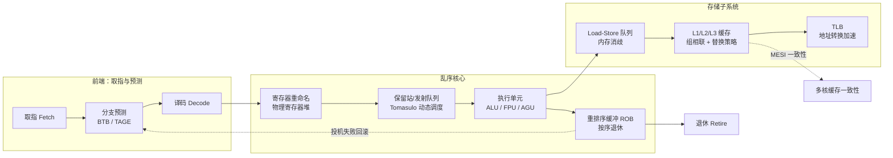
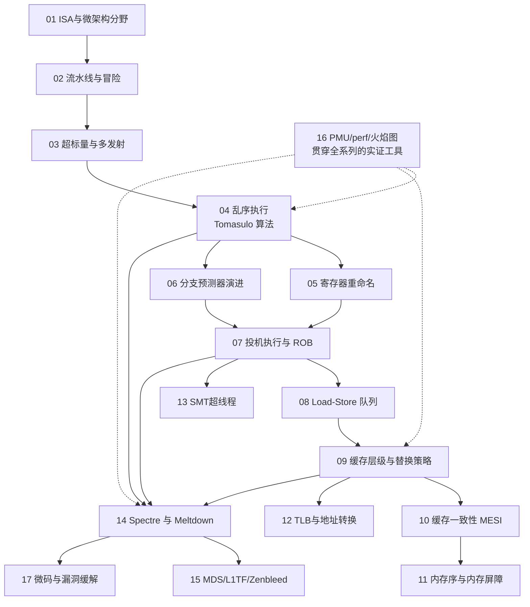

# CPU微架构与执行引擎 · 系列总览

> 从 ISA 到真实硅片实现的鸿沟：流水线、乱序、投机、缓存与预测器，既是理解性能的地基，也是 Spectre/Meltdown 一类微架构侧信道的根源。本系列不满足于"CPU 很快"这一黑盒认知，而是拆开乱序执行引擎的每一个齿轮——从取指到退休、从保留站到重排序缓冲——追问性能与安全在同一片硅上如何共享同一套机制。上承 [[21.Asm/01 汇编指令集对比|系列 21（汇编）]]，下接 [[37.密码学/61.侧信道攻击|密码侧信道]]。

## 执行引擎全景

> [!tip] 学习建议：按依赖关系阅读，而非按编号硬啃
> - 01-08 线性精读：这是乱序执行引擎的骨架（ISA 分野 → 流水线 → 超标量 → Tomasulo 乱序 → 重命名/预测 → 投机与 ROB），后续所有章节都依赖这里建立的概念。
> - 09-13 按需查阅：缓存、一致性、内存序、TLB、SMT 属于横向扩展的"存储与并发"专题，其中 10/11 与系列 21（汇编）的原子操作章节强相关，建议对照阅读。
> - 14-15（侧信道）务必在吃透 04（乱序）+ 07（投机执行）+ 09（缓存）之后再读，否则无法理解 Spectre 类攻击"借缓存计时通道读取投机泄露数据"的因果链。
> - 16（PMU/perf）是贯穿全系列的实证工具，建议读完 04 就动手实测、边读边验证，不必留到最后。
> - 17（微码与缓解）放在收尾，是对 14-16 的性能/安全权衡总结。

## 篇目导航

| # | 章节 | 说明 |
| --- | --- | --- |
| 01 | [[01.从ISA到微架构：架构与实现的分野]] | 指令集与实现解耦、微架构演进主线 |
| 02 | [[02.指令流水线与冒险]] | 取指译码执行访存写回、结构与数据与控制冒险 |
| 03 | [[03.超标量与多发射]] | 多执行端口、发射宽度、指令级并行 ILP |
| 04 | [[04.乱序执行与Tomasulo算法]] | 保留站、公共数据总线、动态调度 |
| 05 | [[05.寄存器重命名与物理寄存器堆]] | 消除假依赖、映射表、回收 |
| 06 | [[06.分支预测器演进]] | BHT/BTB、TAGE、间接跳转预测 |
| 07 | [[07.投机执行与重排序缓冲ROB]] | 按序退休、错误投机回滚 |
| 08 | [[08.存储子系统：Load-Store队列]] | 内存消歧、store-to-load 转发 |
| 09 | [[09.缓存层级与替换策略]] | 多级缓存、组相联、LRU/RRIP、预取 |
| 10 | [[10.缓存一致性协议MESI]] | 多核一致性、目录与嗅探，呼应系列 21 |
| 11 | [[11.内存序与内存屏障]] | 强弱内存模型、acquire/release，呼应系列 21 |
| 12 | [[12.TLB与地址转换加速]] | 页表遍历、TLB 结构、大页影响 |
| 13 | [[13.SMT超线程与资源共享]] | 前端后端共享、争用与隔离 |
| 14 | [[14.微架构侧信道：Spectre与Meltdown]] | 投机执行泄露、缓存旁路、边界绕过 |
| 15 | [[15.侧信道进阶：MDS与L1TF与Zenbleed]] | 微架构缓冲区泄露、跨域读取 |
| 16 | [[16.性能剖析：PMU与perf与火焰图]] | 硬件计数器、采样、瓶颈定位 |
| 17 | [[17.微码与CPU漏洞缓解]] | 微码更新、retpoline、缓解开销权衡 |

## 阅读路径与章节依赖

## 与知识库既有体系的衔接

- 汇编上承：[[21.Asm/28 原子操作与内存模型]]、[[21.Asm/39 缓存与缓存一致性]]、[[21.Asm/38 MMU与页表设置实战]]
- 侧信道呼应：[[37.密码学/61.侧信道攻击]]（密码实现层）与本系列（微架构层）互补
- 防护呼应：[[34.现代二进制防护机制/09.Intel CET]]、[[34.现代二进制防护机制/13.MTE内存标签扩展]]
