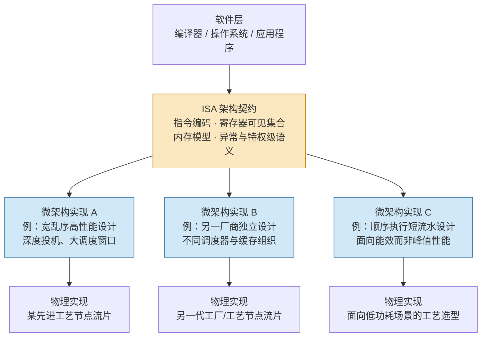
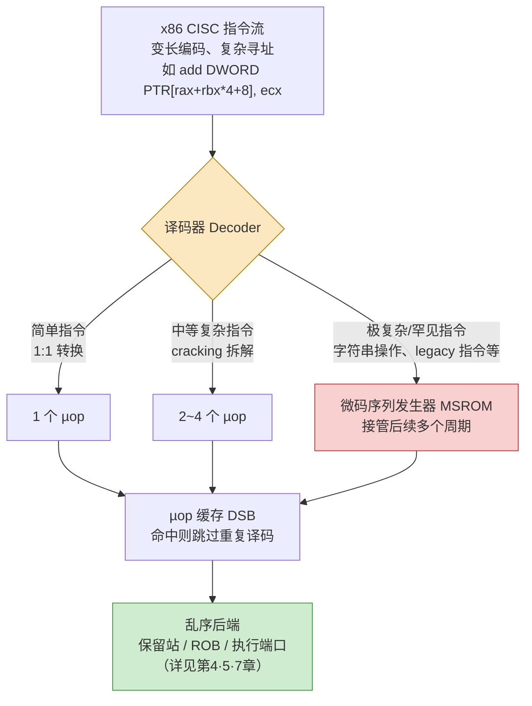
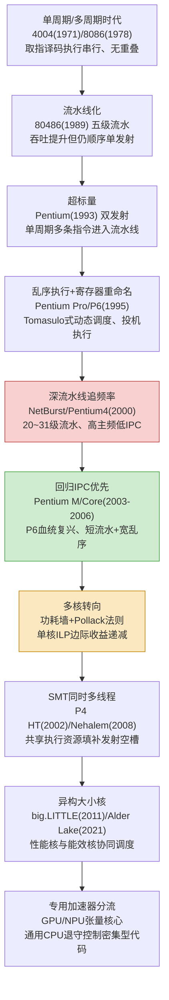

# CPU微架构与执行引擎（1）· 从ISA到微架构：架构与实现的分野

> [!abstract] TL;DR
> - **ISA 是 CPU 的"契约"**：只规定程序员/编译器/操作系统可观察、可依赖的东西——指令编码、寄存器可见集合、内存模型、异常与特权级语义；流水线深度、发射宽度、乱序窗口、缓存结构、分支预测算法这些"怎么做到"的细节完全不在契约范围内。
> - **三层抽象模型**：架构（Architecture/ISA）→ 微架构（Microarchitecture/组织方式）→ 物理实现（电路/版图/工艺节点）。三层变化速率、约束条件、责任团队都不同，理解这一分层是理解"同一 ISA 为何能有天差地别的实现"的钥匙。
> - **架构状态 vs 微架构状态**是全篇的核心区分：只要指令边界处的架构状态（寄存器/内存的最终值）"看起来像"程序顺序执行的结果，内部无论怎样乱序、投机、并行都算正确——这条"as-if 顺序语义"正是乱序执行、超标量、分支预测等一切后续章节机制得以存在的合法性来源。
> - **x86 的现代实现早已"RISC 化"内核**：译码器把变长 CISC 指令拆解成定长类 RISC 的 µop 交给乱序后端执行，"CISC 天生慢、RISC 天生快"是过时的误解——ISA 外观和微架构内核是两回事。
> - **微架构演进主线**：单周期 → 流水线化 → 超标量 → 乱序执行 → 深流水线追频率（NetBurst 的教训）→ 回归 IPC → 多核转向（功耗墙 + Pollack 法则）→ SMT → 异构大小核 → 专用加速器分流，每一次转向都是对上一代物理/功耗约束的正面回应。
> - **架构状态与微架构状态的分离，是 Spectre/Meltdown 一类侧信道攻击的体系结构根源**：ISA 只对前者的正确回滚背书，从未承诺后者（缓存行、预测器状态）不留可观测痕迹。

---

## 概述与定位

本系列后续十六篇要讲流水线冒险、超标量发射、乱序调度、寄存器重命名、分支预测、投机执行与重排序缓冲、Load-Store 队列、缓存与一致性、内存序、TLB、SMT、微架构侧信道，直到微码与漏洞缓解——这些主题表面上互不相关，但全部建立在同一个前提之上：**CPU 对外暴露的行为契约，和它内部达成这份契约的具体方式，是两件可以独立变化的事情**。如果不先把这层分离讲透，后面"乱序执行为什么不违反程序语义""Spectre 为什么能泄露数据却不改变任何一个寄存器的最终值"这类问题就无从谈起。本篇的任务，就是在系列开篇把这条分界线的位置、成因、边界讲清楚，为后面十六篇建立共同的词汇表和分析框架。

先给出两个核心定义。**指令集架构（Instruction Set Architecture, ISA）**是处理器对软件世界承诺的全部内容：指令的二进制编码格式、可编程可见的寄存器集合（名字、数量、位宽）、寻址方式、内存一致性模型、异常与中断的语义、特权级与保护模型、原子操作的行为。这是一份"契约"（contract/interface）——任何满足这份契约的硬件，都可以被认为是一颗合法的 x86-64、ARMv8 或 RISC-V 处理器，无论它内部如何组织。**微架构（Microarchitecture）**则是满足这份契约的具体组织方式：流水线有多少级、每周期能发射几条指令、乱序调度窗口有多大、缓存分几级、每级多大、替换策略是什么、分支预测器用什么算法、执行单元有几个端口分别能做什么运算。ISA 回答"处理器要做到什么"，微架构回答"具体怎么做到"。

这条分界线不是自古就有的工程共识，而是有明确的历史起点。1964 年 IBM System/360 项目中，Gene Amdahl、Gerrit Blaauw、Frederick P. Brooks Jr. 三人在论文《Architecture of the IBM System/360》里第一次系统化地把"体系结构"（architecture，程序员可见的属性：概念结构与功能行为）与"组织"（organization，数据通路与控制逻辑的实现）、"实现"（implementation，具体的物理构造）明确区分开——这也是"computer architecture"一词在计算机领域的历史起源。System/360 的商业动机很直接：IBM 想用一份指令集同时覆盖从低端到高端的一整条产品线，让客户的软件在便宜机型和昂贵机型之间无缝迁移，同时允许不同档位的机型用完全不同的硬件组织（有的机型微程序控制、逐字节处理数据通路，有的机型硬布线、并行处理宽数据通路）来达成同一份契约。这次工程决策的影响延续至今：今天英特尔和 AMD 各自独立设计的微架构能执行同一份 x86-64 二进制，苹果自研的 ARM 核心与高通自研的 ARM 核心能运行同一个 Android/iOS 应用二进制，本质上都是六十年前这次分层决策的当代回响。

在知识库的坐标系里，本篇上承 [[21.Asm/28 原子操作与内存模型]]、[[21.Asm/39 缓存与缓存一致性]]、[[21.Asm/38 MMU与页表设置实战]] 等系列 21 的内容——那个系列关注的是"同一段语义在 x86、ARM、RISC-V、LoongArch、MIPS 五种 ISA 上分别怎么编码"，是**横向**的 ISA 对比；本系列则转向**纵向**深入，追问"同一个 ISA 背后，微架构可以用哪些截然不同的方式去实现，各自的取舍是什么"。这是关注点从"指令语义是什么"转向"执行引擎内部如何运转"的转折点，也是为什么本篇必须先把这条边界钉死——后面每一篇讲的都是边界线内侧（微架构一侧）的具体技法。

## 原理与机制

### 三层抽象：架构、微架构、物理实现

完整的抽象栈其实是三层而不是两层：**架构（ISA）→ 微架构（组织）→ 物理实现（电路/版图/工艺）**。三层的变化节奏、约束条件、负责团队完全不同，这也是为什么必须把它们拆开理解。

架构层变化最慢——x86 的基础指令集为了向后兼容几十年前的二进制，核心部分几乎冻结不变，新增内容主要通过扩展位（如 SSE、AVX、AVX-512、AMX）附加而不是修改已有语义；负责这一层的是 ISA 委员会或厂商的架构组，产出物是像 Intel SDM、ARM Architecture Reference Manual 这样的规范手册。微架构层变化频率高得多，通常每一到两代产品（一两年）就会有新的核心设计（Golden Cove→Redwood Cove、Zen4→Zen5），负责团队是核心设计团队，受性能/功耗/面积（PPA）三角约束，产出物是 RTL 设计与验证模型。物理实现层则和制造工艺绑定——同一份微架构设计可以在不同代工厂、不同工艺节点上流片，例如 ARM 的参考核心设计被不同被授权厂商用三星、台积电等不同工艺实现，同一微架构在不同工艺下呈现出不同的主频上限和功耗曲线；AMD 从 Zen2 开始的 chiplet 架构更是把计算 die 和 I/O die 拆开、分别用不同工艺节点制造和封装，物理实现层的模块化程度已经独立于微架构设计本身。三层解耦意味着"同一颗芯片跑得快不快"不能只归因于某一层，必须分别追问：契约允许的指令集够不够用、微架构组织是否高效、物理实现是否把微架构的设计余量榨干。



### 架构状态与微架构状态

理解这一分层，关键要区分两类"状态"。**架构状态**是 ISA 承诺程序员能看到、能依赖的一切：通用寄存器的值、程序计数器、标志/状态寄存器、内存中的数据（按 ISA 定义的内存模型观察）、特权寄存器与页表项这些通过明确定义机制暴露的状态。**微架构状态**则是硬件里真实存在、但 ISA 从未给它起过名字、也从未承诺其行为的一切：保留站里排队的操作数、重排序缓冲区（ROB）的条目、物理寄存器堆（比架构寄存器数量多得多的物理存储）、寄存器重命名映射表、缓存行的内容与 MESI 状态位、TLB 条目、分支预测器的历史表（BHT/BTB/PHT）、store buffer、µop 缓存、预取器的历史流状态——这些内容会详细展开在 [[02.指令流水线与冒险]]、[[04.乱序执行与Tomasulo算法]]、[[05.寄存器重命名与物理寄存器堆]]、[[06.分支预测器演进]]、[[07.投机执行与重排序缓冲ROB]]、[[09.缓存层级与替换策略]] 诸篇。

ISA 唯一的硬性要求是：**在任意一条指令的边界处，可观察到的架构状态必须与"所有指令严格按程序顺序、一条接一条执行"得到的结果完全一致**——这就是所谓"as-if 顺序语义"（as-if sequential semantics）。这条规则单线程范围内成立；多线程之间寄存器/内存修改何时对其他核可见，则是更弱的另一份契约，由 ISA 的内存一致性模型单独规定，将在 [[11.内存序与内存屏障]] 详细展开，这里不能笼统地说"全局看起来都是顺序的"。正是因为契约只锁定了"最终架构状态等价于顺序执行"这一点，而对**内部怎么达到这个结果完全不做限制**，乱序执行、超标量并行发射、分支预测式的投机执行才有了存在的合法性空间：处理器可以在内部把指令拆成微操作、打乱执行顺序、猜测分支走向提前执行、发现猜错了就把结果作废重来——只要退休（retire）到架构状态的那一刻，呈现出来的效果和"老老实实按顺序算一遍"没有任何差别，这台处理器就是"正确"的。这也是为什么 ISA 有时被形容成一个"黑盒 + 顺序契约"：从外部纯功能角度，你完全无法分辨一颗 CPU 究竟是顺序执行还是疯狂乱序执行——唯一能揭示差异的是时间、功耗、缓存占用这些**契约从未覆盖**的副作用，这一点在"安全性与正确使用"一节会展开成侧信道问题的根源。

### 契约划定的边界：规定了什么，又刻意不规定什么

把 ISA 手册摊开会发现，它明确规定的内容和明确不规定（或显式声明"由实现决定"）的内容泾渭分明：

| 类别 | ISA 契约内（必须遵守） | 微架构自由（契约外） |
|---|---|---|
| 指令 | 编码格式、操作语义、寻址模式 | 译码需要几个周期、拆成几个 µop |
| 寄存器 | 架构可见寄存器的名字、数量、位宽 | 物理寄存器堆的实际条目数、重命名算法 |
| 内存 | 一致性模型（如 x86 的 TSO、ARM 的弱序） | 缓存层级、行大小、替换策略、预取策略 |
| 控制流 | 分支/异常/中断的最终语义、精确异常要求 | 分支预测算法、投机深度、误预测代价 |
| 时序 | 几乎不做任何承诺 | 主频、流水线级数、任意指令的实际延迟 |

precise exception（精确异常）是这张表里承上启下的一条关键规则：一旦发生异常或中断，架构状态必须表现得"恰好像该指令之前的所有指令都已完整执行、该指令及之后的所有指令都尚未开始"——这是一条纯架构层面的硬约束，却极大地限制了微架构能有多激进：即便执行阶段允许乱序，退休阶段也必须按程序顺序提交结果，这正是 [[07.投机执行与重排序缓冲ROB]] 里 ROB 结构存在的根本原因，此处先埋下伏笔。

手册里另一个值得留意的措辞是"implementation-defined"（实现定义）和"unspecified"（未规定）。ISA 文档经常显式声明某些行为留给具体实现自行决定——例如典型缓存行大小、某些边界条件下标志位的具体取值、乱序执行时可被观察到的中间过渡状态——这些"留白"正是微架构自由发挥的空间，也是不同厂商能在遵守同一份契约的前提下打得头破血流拼性能的原因。但这也是一个常见的工程陷阱：软件如果把某个"未在契约中承诺"的具体行为当成正确性判断的依据（比如依赖某个特定微架构下的指令执行时间、依赖乱序执行中偶然观测到的中间结果），换一代 CPU、换一个厂商实现，行为随时可能改变甚至彻底消失。这类反模式后面会在"安全性与正确使用"一节继续展开。

## 解耦机制与微架构演进主线详解

### CISC 外壳、RISC 内核：译码层是解耦的物理载体

x86 是教科书式的 CISC（复杂指令集）：变长编码、复杂寻址模式、单条指令可以完成"从内存读取、运算、写回内存"的复合操作。但从 Pentium Pro（P6 微架构，1995 年）开始，英特尔在译码阶段引入了一层关键的转换：译码器把外部可见的变长 x86 指令，翻译成内部定长、语义简单、更接近 RISC 风格的微操作（µop），后端的乱序调度、执行单元、寄存器重命名全部围绕 µop 运转，而不是直接操作原始 x86 指令。简单指令（如 `add reg, reg`）通常 1:1 转换成一个 µop；中等复杂的指令（如带内存操作数的读改写指令）被"拆解"（cracking）成两三个 µop；极端复杂或极少使用的指令（字符串批量操作、部分历史遗留指令）则整个移交给一个专门的**微码序列发生器**（MSROM，Microcode Sequencer ROM）——用预先固化在芯片里的一段"微码程序"控制多个周期完成，这部分内容在 [[17.微码与CPU漏洞缓解]] 会继续深入。为了不让热点循环反复承受译码开销，现代 x86 实现还在译码器之后加了一层 **µop 缓存**（Intel 称 DSB，Decoded Stream Buffer）：循环体第二次执行时直接从 µop 缓存取出已经译码好的微操作，跳过重新译码，省电又省时间。



这层译码/转换机制，正是"架构契约"与"微架构实现"分界线的物理载体：它的唯一职责就是把"契约语言"（外部 ISA 编码）翻译成"内部执行语言"（µop 表示），而 µop 的具体格式、数量、编码方式每一代都可以重新设计，完全不影响外部契约的向后兼容性。这也直接反驳了"CISC 天生慢、RISC 天生快"的过时说法——现代 x86 处理器的执行核心本质上是一台运行在 RISC 风格微操作之上的乱序机器，其吞吐效率与同代 ARM/RISC-V 高性能实现处于同一量级，ISA 的 CISC 外观并不决定微架构能达到的性能上限，只决定译码前端要多做一些转换工作。反过来，高性能 ARM 实现（如苹果、高通的自研核心）虽然指令编码本身已经是定长、相对贴近 µop 的粒度，但为了进一步压榨 IPC，同样会做宏操作融合（macro-op fusion，例如把比较指令和紧随其后的条件分支融合成一个内部操作）——"外部编码颗粒度"和"内部执行颗粒度"不完全相等这件事，在 RISC 阵营同样存在，只是幅度远不如 CISC 阵营剧烈。

### 微架构演进主线：从单周期到异构专用化

如果把 x86 微架构近半个世纪的演进串成一条主线，会发现每一次转向都不是随意的技术潮流，而是对上一代方案撞到的物理或经济墙壁的正面回应：



**从单周期到流水线**：早期设计里一条指令的取指、译码、执行、访存、写回在同一周期内串行完成，主频被最长的那一步锁死。把这几步拆成独立阶段、让多条指令像流水线上的工件一样交错重叠推进（[[02.指令流水线与冒险]] 详解），可以在不要求晶体管变快的前提下把吞吐量顶上去，代价是引入了结构、数据、控制三类冒险需要专门处理。**从流水线到超标量**：单条流水线的吞吐上限是每周期一条指令，要突破这个上限只能让多条独立流水线并行取指、并行发射（[[03.超标量与多发射]] 详解），代价是冒险检测要同时应付多路并发的依赖关系，复杂度陡增。**从超标量到乱序执行**：静态顺序发射的超标量有一个致命弱点——只要队首指令因为等待某个操作数或缓存缺失而卡住，排在它后面、原本互不相关的独立指令也会被迫一起停摆，白白浪费发射槽位。乱序执行打破了"必须按程序顺序占用执行资源"这条人为限制，只保留真正的数据依赖约束，用 Tomasulo 式动态调度（[[04.乱序执行与Tomasulo算法]]）和寄存器重命名（[[05.寄存器重命名与物理寄存器堆]]）让处理器自己去发现哪些指令可以提前算——这可以说是最彻底榨取"架构契约不限制内部执行顺序"这条自由度的一次工程突破。

**从乱序执行到深流水线追频率的教训**：上世纪末到本世纪初，市场上主频数字（MHz/GHz）一度被当作性能的代名词，英特尔 NetBurst 架构（Pentium 4）为了把主频冲到很高，把流水线级数拉到二十级以上（后期 Prescott 核心甚至逼近三十级），但流水线越深，每一级能做的实质工作越少，分支预测一旦猜错，需要冲刷的在制品指令也越多、代价越大，实际每周期完成的工作量（IPC）不升反降；叠加当时制程下漏电流随主频攀升而急剧增加，芯片发热和功耗撞上了"功耗墙"，原定四吉赫兹以上的后续型号最终被取消——这是体系结构史上一次广为流传的"优化错误指标"的反面教材：单纯堆高主频而不看单周期实际吞吐，是一条死路。**回归 IPC 优先**：英特尔以色列研发团队从移动端功耗受限的场景出发，把 P6 血统的短流水线、宽乱序设计重新发扬光大，做出 Pentium M，进而演化出 Core/Core 2（2006 年 Conroe），正式终结"唯主频论"，把设计目标重新校准为主频、IPC、核心数量三者的综合平衡。

**从单核优化到多核转向**：这次转向背后有两条独立却同时生效的物理/经济规律。一是 Dennard 缩放定律在约 90～65 纳米工艺节点附近失效——过去晶体管尺寸缩小时电压也能同比例下降，因此单位面积功耗基本不变，晶体管数目翻倍、主频也能顺势提高；但当漏电流不再随尺寸微缩而按比例下降后，同一块硅片上塞进更多晶体管，功耗预算却不再有相应余量，"晶体管数目还在涨（摩尔定律仍成立）、但已经不能全都跑更高频率了"。二是 Pollack 法则——单核内乱序资源（重排序缓冲区、调度器、寄存器堆等）每翻一倍面积和功耗，带来的性能提升大约只有平方根量级（约四成左右），边际收益急剧递减；而把同样的晶体管预算拆成多个相对简单的核心，对于可并行的负载几乎能获得线性提升。这两条规律叠加，让"继续造一个更大更快的单核"在经济上不再划算，"改造多个核心"成为更优的晶体管预算分配方式，直接催生了多核时代。

**多核之后的两条支线**：一条是 **SMT**（同时多线程）——即便是宽乱序核心，单个线程也常常因为依赖链或缓存缺失填不满每周期所有的发射槽位和执行端口，让第二个硬件线程的独立指令去补那些本来要被浪费的槽位，几乎不需要复制昂贵的乱序引擎本体就能多榨一些吞吐（[[13.SMT超线程与资源共享]] 详解，早期尝试见于 2002 年 Pentium 4 的 Hyper-Threading，真正成熟是 2008 年 Nehalem 把 HT 和完整乱序后端结合之后）。另一条是**异构大小核**——不是所有任务都需要跑满乱序资源，后台同步、界面刷新这类任务如果硬塞进一个高性能大核只会白白耗电，ARM 在 2011 年提出 big.LITTLE，把耗电的乱序"大核"和精简的顺序或轻乱序"小核"放进同一颗芯片，由调度器根据负载动态迁移线程；英特尔 2021 年 Alder Lake 引入性能核/能效核的设计说明这不是移动端或 ARM 阵营的专利，而是同一条物理规律在 x86 阵营的必然回响——这也是"同一 ISA、故意让不同微架构共存在同一块芯片上"的又一实践形态。

**专用加速器分流是这条主线目前的终点**：随着 Dennard 缩放早已失效、先进制程下每晶体管成本的下降也在放缓，通吞吐、数据并行的负载（机器学习推理训练、视频编解码、密码运算）越来越多地转移到专用硅片（GPU 张量核心、NPU、固定功能编解码/加密单元）——牺牲通用性换取数量级的能效提升；而通用 CPU 微架构（也就是本系列剩余篇幅要深入的对象）则愈发聚焦于自己不可替代的强项：低延迟、分支密集、控制流不规则、访存模式难以预测的"控制平面"代码。这个历史闭环解释了为什么在加速器遍地开花的今天，深入理解乱序执行、分支预测、缓存层级、Load-Store 队列这些 CPU 微架构机制依然至关重要——它们没有被取代，只是被推向了一个更精确定义的分工位置。

### 一套 ISA、多套微架构：产业实践的证据

理论说得再清楚，也不如产业实践直观。**ARM 的双轨授权模式**是最干净的证据：拿"核心授权"的厂商直接使用 ARM 自家设计的参考微架构（Cortex-A/X 系列）；拿"架构授权"的厂商只买下 ISA 契约的使用权，自己从零设计微架构——苹果的 Firestorm/Icestorm/Everest、高通收购 Nuvia 后的 Oryon、早年三星的 Mongoose、英伟达的 Denver/Carmel 都属于此列。一颗面向能效优化的 Cortex-A53 是顺序执行的短流水线设计，苹果的高性能核心则是译码宽度极高、调度窗口极大的深度乱序设计，二者在微架构层面几乎没有相似之处，却能运行完全相同的 ARMv8/ARMv9 二进制——这正是"契约相同、实现自由"的当代活教材。**RISC-V 把这种模块化写进了规范本身**：基础整数指令集（RV32I/RV64I）加上一组可选的标准扩展（M/A/F/D/C/V……）明确设计成可插拔组合，面向微控制器的顺序小核（如 Rocket）和面向应用处理器的宽乱序大核（如学术界的 BOOM 或产业界的高性能 RISC-V 核心）只需实现各自需要的扩展子集，就能共享同一份基础契约，详见 [[21.Asm/14 RISC-V]]。**x86 的英特尔/AMD 双雄格局**则是最贴近日常体感的例子：两家公司各自独立设计微架构（如 Golden Cove/Redwood Cove 对 Zen4/Zen5），却都必须严格实现同一份 x86-64 契约——"哪颗 CPU 更快"这个问题从来不是 ISA 层面的问题（两家实现的指令集本质等价），而是纯粹的微架构设计与物理实现较量。

### 二进制翻译：把解耦推向极致

如果 ISA 真的"只是一份契约"，那么理论上完全可以用软件在一台运行着完全不同底层机器的硬件上，去满足这份契约——这恰恰是二进制翻译技术存在的理论根基。Transmeta 在 2000 年推出的 Crusoe 处理器，物理上是一台 VLIW 机器，通过一层名为 Code Morphing Software 的软件翻译层在运行时把 x86 指令流转换成 VLIW 原生指令执行，x86 ISA 契约完全由软件满足，硬件对外甚至不直接暴露自己的真实指令集。苹果的 Rosetta 2 把这个思路又往前推了一步：x86-64 版本的 macOS 应用被翻译（既有提前编译也有运行时兜底）到 ARM64 上执行，之所以能做到接近原生的性能，很大程度上是因为苹果在自家 ARM 芯片里额外加了一个可切换的"TSO 内存模式"位——用微架构层面的硬件辅助去弥合 x86 较强内存序模型和 ARM 较弱内存序模型之间的语义鸿沟（这个话题在 [[11.内存序与内存屏障]] 会深入展开），否则纯软件插入内存屏障的翻译开销会大得多。日常做逆向分析常用的 QEMU 用户态模拟、Linux 的 `binfmt_misc` 跨架构执行，走的也是同一条路——完整的软件级 ISA 解释/翻译。这条支线给出的实践启示是：仿真/翻译层的性能天花板，恰好取决于宿主机微架构原生语义和目标 ISA 契约之间的"距离"有多远——距离越远，需要软件补的语义就越多，开销就越大，这正说明 ISA 契约划得越精确、越贴近硬件能自然提供的语义，工程上的翻译成本就越低。

## 工具视角与实战

### 从系统里同时读出"契约层"与"实现层"两份信息

`CPUID` 指令本身就是 ISA 契约的一部分——它的编码、调用方式、返回寄存器布局都由架构手册规定，但它返回的内容（family/model/stepping、品牌字符串、支持的扩展位图）恰恰是在告诉你"当前这台机器具体是哪一款微架构实现"。在 Linux 上执行：

```bash
lscpu
cat /proc/cpuinfo | grep -E "model name|cpu family|model|stepping"
```

`model name` 是面向人类的品牌字符串，`cpu family`/`model`/`stepping` 三元组则是软件（内核、hypervisor、编译器运行时探测代码）用来精确识别微架构代号、决定要不要打某个勘误补丁或启用某个优化路径的机器可读依据。Windows 下等价的信息可以用 `Get-CimInstance Win32_Processor` 或 Sysinternals 的 `coreinfo` 工具获取，后者还能直接打印出缓存层级拓扑——这些都是"契约明确定义了查询机制，但查询结果本身描述的是契约之外的实现细节"的具体例子。

### 编译器视角：`-march` 与 `-mtune` 是这条分界线最直接的映射

GCC/Clang 里这两个选项分别精确对应架构和微架构两层：

```bash
# -march 决定"允许生成哪些指令"——这是架构契约层面的决策
# 用了 -march=x86-64-v3（隐含 AVX2）编出来的二进制，在不支持 AVX2 的 CPU 上会 SIGILL
gcc -O2 -march=x86-64-v3 foo.c -o foo

# -mtune 只在 -march 允许的指令集合内做"选择"和"调度"，不会新增任何指令
# 影响指令选择顺序、延迟假设、乱序窗口相关的调度决策，纯粹的性能调优、不影响正确性和兼容性
gcc -O2 -march=x86-64-v3 -mtune=znver4 foo.c -o foo
```

`-march` 回答"允不允许用这条指令"，是不可协商的架构兼容性问题；`-mtune` 回答"在允许的指令里挑哪些、怎么排",是纯粹的微架构性能调优问题，调优表里针对不同核心编码了不同的指令延迟、吞吐、端口占用假设。`-march=native` 让编译器探测本机 CPU 并同时决定这两层,本地构建很方便,但**把 `-march=native` 编出来的二进制分发给不确定型号的机器是一个常见且危险的陷阱**——目标机器如果缺少某个被选中的扩展指令集,程序会直接非法指令崩溃,这在"安全性与正确使用"一节还会从工程实践角度再强调一次。

### 用静态分析与实测观察"同一段 ISA 代码在不同微架构上跑得不一样"

LLVM 自带的 `llvm-mca`（Machine Code Analyzer）可以针对一段固定的机器码，分别指定不同的目标微架构模型做静态吞吐量/端口压力分析：

```bash
# 同一段汇编，分别用两种微架构模型分析，不实际运行也能看出调度差异
llvm-mca -mcpu=skylake   snippet.s
llvm-mca -mcpu=znver3    snippet.s
```

两次分析会给出不同的预测 IPC、不同的瓶颈执行端口——这是"一套 ISA 编码，多种微架构行为"最直接、最可动手验证的实践方式，非常适合用来建立直觉。要看真实硬件上的差异，则要靠 `perf stat` 在两台不同微架构的物理机上跑同一份二进制，对比 `instructions`、`cycles`、IPC 等硬件计数器的实际读数，完整方法论会在 [[16.性能剖析：PMU与perf与火焰图]] 详细展开。学术与工业界常用的体系结构模拟器如 gem5、Sniper、ChampSim,则把这种"可插拔微架构模型"做成了标准科研工具——同一份 ISA（通常是 x86/ARM/RISC-V）、同一份跑在上面的二进制,可以自由切换顺序/乱序执行模型、缓存参数、分支预测器算法,直接对比性能差异,是分支预测器（[[06.分支预测器演进]]）、缓存替换策略（[[09.缓存层级与替换策略]]）学术研究和竞赛的标准底座。

### 逆向工程视角：两层语义都得读

做逆向分析时，工程师实际上要在两个平行的语义层面上推理:ISA 层面的语义回答"这条指令在算什么"，是理解程序行为、做反编译、判断正确性的基础;微架构层面的行为回答"这条指令实际要花多久、会不会摸到某个缓存行、会不会训练分支预测器",是做反调试、反虚拟机检测、时序类漏洞分析时才需要动用的更深一层推理。一个常见的实战场景是:恶意代码或加固壳读取 `CPUID` 的 family/model/stepping,或者用 `rdtsc` 测量一段已知开销的指令序列的实际耗时,来判断自己是运行在真实硅片上还是运行在 QEMU/VMware 这类以"功能正确"为目标的模拟器上——模拟器要做到 ISA 语义完全正确并不难,但要做到微架构行为(尤其是精确到周期的时序)也和真实硬件分毫不差则代价极高,这条"功能仿真容易、时序仿真难"的不对称性,正是本篇反复强调的架构/微架构分层留下的一条可被利用的缝隙。

## 安全性与正确使用

ISA 契约只对"架构状态最终正确"背书，对时间、功耗、缓存占用、分支预测器状态这些微架构副作用不做任何承诺——这不是某一次疏漏，而是这层抽象在设计之初就没有把"微架构状态是否可被外部观察"纳入契约范围。这正是微架构侧信道类攻击能够存在的体系结构根源:投机执行让一条指令即便走错了分支、猜错了地址,在架构层面也"从未真正发生过"——寄存器和内存的最终值会被完整回滚,ISA 契约毫发无损;但这条指令执行过程中对缓存、TLB、分支预测器造成的微架构状态改变**不会**被回滚。攻击者利用 flush+reload、prime+probe 这类手法测量这些残留的微架构副作用(比如某条缓存行是否在探测阶段被重新载入),就能把本不该泄露的数据经由一条 ISA 从未开放过的"影子信道"读出来。这不是某颗芯片违反了契约,而恰恰是契约本身自始至终就没有承诺"微架构状态不可观测"——完整的攻击机制会在 [[14.微架构侧信道：Spectre与Meltdown]] 与 [[15.侧信道进阶：MDS与L1TF与Zenbleed]] 两篇详细展开,这里只需要把根因定位清楚。

从这个根因出发，可以提炼出几条可落地的工程指导:

1. **不要把"ISA 手册未承诺"的行为当成正确性依据**。任何依赖具体指令执行时间、依赖乱序执行中偶然可观察到的中间状态做正确性判断的代码，都是在依赖微架构的自由裁量区，换一代硬件、换一个厂商实现随时可能失效——时序只应该用来做性能分析，不应该成为逻辑分支的判断条件。
2. **常数时间密码学实现必须在 ISA 契约之下更深一层推理**：只保证分支和访存指令的"架构语义"正确远远不够，还要保证分支走向、访存地址模式不依赖秘密数据——因为分支预测器状态、缓存占用行为是 ISA 从不管辖、但完全可被计时观测的微架构副作用，这与 [[37.密码学/61.侧信道攻击]] 呼应：那一篇讲的是密码实现层面具体的侧信道利用手法，本篇讲的是这类问题在体系结构层面为什么必然存在。
3. **正确使用编译目标选项**：库和发行版级别的二进制应该用保守的架构基线（如 `x86-64-v2`/`v3`）编译，配合运行时 CPU 特性探测（ifunc/dispatch 分发到针对具体微架构优化的多个实现版本），而不是在编译期用 `-march=native` 把二进制锁死到某一台构建机器的具体微架构上再分发出去。
4. **微码更新是"给实现层打补丁而不破坏架构契约"的正规渠道**：Spectre/Meltdown 系列漏洞的相当一部分缓解措施，正是通过微码更新新增可选的控制位（如间接分支限制相关的 MSR），配合操作系统/虚拟化层协同启用完成的——这说明架构契约本身具备"新增可选能力"的演化空间，既不破坏历史二进制的兼容性，又能让实现层针对新发现的微架构级问题打补丁，详见 [[17.微码与CPU漏洞缓解]]。
5. **形式化验证是"确保实现真的满足契约"的高阶实践**：RISC-V 的 Sail、ARM 的 ASL（Architecture Specification Language）把架构规范本身写成可执行、可验证的形式化模型，微架构的 RTL 设计可以针对这份形式化架构模型做一致性验证，在流片之前就抓住"微架构违反了自己应当满足的契约"这类问题。历史上英特尔奔腾处理器的 FDIV 除法缺陷就是一个反面案例——即便架构契约本身没有问题，实现未能完全满足契约同样会导致可观测的错误结果；那次事故是正确性问题而非安全漏洞，但根源与侧信道问题同源：都是"契约"与"实现"之间出现了缝隙，只是一个缝隙导致算错了数，另一个缝隙导致泄露了数据。

理解这条边界的意义并不止于攻防——它也是日常工程决策的基础判断依据：遇到"这个行为能不能依赖"的问题时，先问一句"这是 ISA 手册白纸黑字承诺的，还是我在某一颗具体芯片上观察到的现象"，往往就能避开一整类跨代际、跨厂商翻车的坑。

## 小结

- ISA 是处理器对软件世界的契约，只锁定程序员可见的架构状态如何变化，完全不约束内部如何达成这一结果；微架构是满足契约的具体组织方式，物理实现则是微架构在特定工艺上的落地，三层变化节奏和约束各不相同。
- "架构状态 vs 微架构状态"与"as-if 顺序语义"是全篇乃至全系列的核心判据：只要退休时架构状态等价于顺序执行结果，内部乱序、投机、并行都合法——这条自由度是后续超标量、乱序执行、分支预测等一切机制的合法性来源。
- x86 现代实现通过译码器把 CISC 指令拆解为类 RISC 的 µop 交给乱序后端，微码序列发生器兜底极端复杂指令，这是架构/微架构分界线的物理载体，也是"CISC 慢/RISC 快"过时论断的直接反例。
- 微架构演进主线（单周期→流水线→超标量→乱序→深流水线追频率→回归 IPC→多核→SMT→异构大小核→专用加速器分流）的每一次转折都对应着上一代方案撞上的物理或经济墙壁，理解"为什么转向"和理解"转向后的机制"同样重要。
- ARM 的架构/核心双轨授权、RISC-V 的模块化扩展、x86 的英特尔/AMD 双雄格局、以及 Rosetta 2/Transmeta 一类二进制翻译技术，是"一套 ISA、多套微架构乃至完全软件实现"这一分层在产业界的具体证据。
- 架构状态与微架构状态的分离没有被 ISA 契约完全约束，是微架构侧信道类攻击的体系结构根源；正确的工程姿态是绝不把"契约未承诺"的行为当作正确性依据。
- 下一篇 [[02.指令流水线与冒险]] 正式进入边界线内侧，从最基础的取指-译码-执行-访存-写回五级流水线讲起，拆解结构、数据、控制三类冒险及其处理方式。

## 相关阅读

- Intel® 64 and IA-32 Architectures Software Developer's Manuals——当代 CISC 架构契约与微架构实现分层的权威范本
- Arm Architecture Reference Manual for A-profile architecture——ARM 架构规范文本，及其形式化描述语言 ASL
- The RISC-V Instruction Set Manual（含 Sail 形式化模型）——模块化、可组合 ISA 设计的当代范本
- Gene M. Amdahl, Gerrit A. Blaauw, Frederick P. Brooks Jr., *Architecture of the IBM System/360*, IBM Journal of Research and Development, 1964——"架构"一词在计算机领域的起源论文
- [[00.CPU微架构与执行引擎总览]] · 系列总览
- [[21.Asm/28 原子操作与内存模型]]、[[21.Asm/39 缓存与缓存一致性]]、[[21.Asm/38 MMU与页表设置实战]] · 汇编层的上承内容
- [[37.密码学/61.侧信道攻击]] · 密码实现层的侧信道案例，与本篇的体系结构根因互补
- [[34.现代二进制防护机制/09.Intel CET]]、[[34.现代二进制防护机制/13.MTE内存标签扩展]] · 架构层新增安全扩展的具体实例

---

[[00.CPU微架构与执行引擎总览|⬆ 系列总览]] | [[02.指令流水线与冒险|→ 下一章]]
