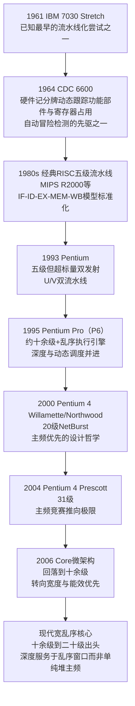
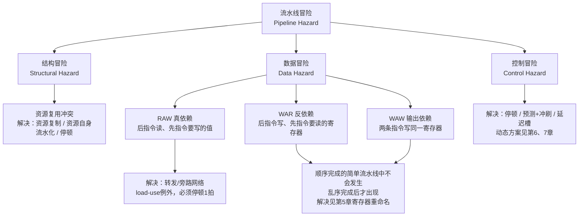
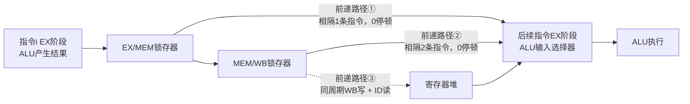
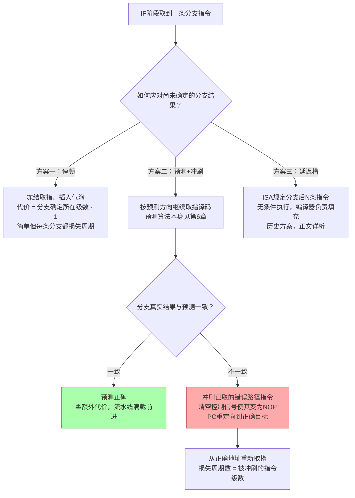

# CPU微架构与执行引擎（2）· 指令流水线与冒险

> [!abstract] TL;DR
> - 流水线的本质是"用硬件资源的空间复制换指令吞吐率"：把数据通路切成多级、级间插锁存器，让多条指令同时占用流水线的不同级，理想情况下每周期完成一条指令（CPI→1），但不会缩短、反而通常略微拉长单条指令的绝对延迟——吞吐与延迟的这组张力贯穿全系列。
> - 经典 IF-ID-EX-MEM-WB 五级流水线不是唯一可能的切法，而是"每条指令占用相同级数、用不上某一级也要空转过去"这一简化设计哲学的产物，用少量效率损失换取了控制逻辑复杂度的巨大简化。
> - 数据冒险中只有 RAW（真依赖）是硬约束，必须靠转发或停顿正面解决；WAR/WAW 只是共享寄存器编号造成的"假依赖"，在顺序完成的简单流水线里根本不会出现，直到乱序执行引入后才成为真问题——这个区分是理解寄存器重命名为何存在的钥匙。
> - 转发网络能消解绝大多数 RAW 冒险且不占用额外周期，但 load-use 冒险是一个纯物理限制的例外：数据要到 MEM 级末尾才产生，无论多少根旁路线都不能让它提前存在，至少 1 个气泡不可避免。
> - 控制冒险的应对方案本身就是一部微架构史缩影：停顿 → 预测+冲刷 → 延迟槽（把流水线深度焊进 ISA 语义，后来被证明是死胡同）→ 动态预测与投机执行，每一步都在拿更贵的硬件换更小的分支代价。
> - 流水线的转发/冲刷机制只维持"单核内程序序可见"这一错觉，并不解决多核间的内存可见顺序问题；也正是"预测中的指令还未提交、可以被安全冲刷、不留任何痕迹"这一假设，在数十年后的深度投机时代被证明并不总是成立，这正是后续侧信道章节的根源之一。

---

## 概述与定位

[[01.从ISA到微架构：架构与实现的分野|上一章]]把"指令集架构"和"微架构实现"这两个此前常被混为一谈的概念彻底拆开：ISA 是软硬件之间的契约，只承诺"指令按程序顺序、一条执行完再执行下一条"这一可观察的语义；微架构才是硬件工程师用来*兑现*这份契约的具体电路结构，而契约本身从不规定兑现的手段。流水线（pipeline）正是这份契约被兑现时用到的第一种、也是最基础的一种微架构技术——本章要讲清楚的，就是"取指-译码-执行-访存-写回"这套重叠执行的流水结构究竟是怎么一回事，以及一旦允许多条指令同时在硬件里"重叠"，会打破哪些原本在顺序执行模型下天然成立的假设，又该如何把这些假设一条条地重新补回去。

这后一半问题，就是"冒险"（hazard，也有教材译作"相关"或"冲突"，本文统一使用"冒险"这一最通行的译法）。冒险不是流水线设计的失误，而是流水线这种并行手段的必然代价：只要允许多条指令同时占用硬件的不同部分，就一定会出现"某条指令想用的资源被占着""某条指令要读的值还没被算出来""某条指令根本不知道该不该执行"这三类局面，分别对应结构冒险、数据冒险与控制冒险。理解流水线而不理解冒险，只理解了这项技术的收益一半，看不到它的工程代价，也就无法理解为什么第 3 章开始的超标量、乱序执行、寄存器重命名、分支预测器、投机执行与重排序缓冲——几乎全系列后续每一章——都可以被重新表述为"用更精巧的硬件，进一步压低本章这三类冒险造成的性能损失"。

需要在开篇就划清的边界是：本章只讨论**标量、单发射、顺序发出且顺序完成**的流水线——也就是每个周期只取一条指令、指令严格按程序序进入每一级、也严格按程序序离开每一级的最简单模型。这不是为了偷懒简化，而是因为这个模型本身极具解释力：它是所有更复杂设计的公共地基。[[03.超标量与多发射|第3章]]把"每周期一条"放宽成"每周期多条"；[[04.乱序执行与Tomasulo算法|第4章]]把"顺序完成"放宽成"数据就绪即可执行、完成顺序可以打乱"；[[05.寄存器重命名与物理寄存器堆|第5章]]专门处理放宽顺序完成之后冒出来的新麻烦；[[06.分支预测器演进|第6章]]和[[07.投机执行与重排序缓冲ROB|第7章]]则把本章"预测-冲刷"这一朴素思路，升级为一整套精确到能安全撤销任意深度投机的机制。本章建立的词汇表——冒险、停顿（stall/interlock）、转发（forwarding/bypassing）、冲刷（flush/squash）、气泡（bubble）、精确异常（precise exception）——会被后续所有章节反复使用而不再重新定义，这也是它被安排在系列第 2 章、紧跟 ISA/实现分野之后的原因：不吃透这一章，后面每一章的术语都会是悬空的。

读者应当已经具备第 1 章"取指-译码-执行-访存-写回"这一 ISA 层面指令周期的概念，以及基本数字逻辑常识——把流水级之间的锁存器理解为"每个时钟上升沿被拍下来的一张快照，快照的内容在下一级被下一拍读取"就足够进入本章。落地意义上，本章讲的不是历史考古：从 1980 年代的 MIPS R2000、Intel i486，到今天的 Zen5、Golden Cove 或任何一颗 Apple Silicon 核心，几乎每一颗执行指令流的通用处理器核心内部都能找到这套五级模型的影子——哪怕后续章节的乱序执行引擎会把它伪装得面目全非，流水线仍然是理解"此刻正在你电脑里被执行的每一条指令"绕不开的必修课。

---

## 原理与机制

### 流水线出现之前：单周期与多周期两种基线

要理解流水线"省"在哪里，得先看清它替代的是什么。最朴素的数据通路设计是**单周期实现**：不论指令类型，整条指令——取指、译码、寄存器读、ALU 运算或地址计算、可能的访存、写回——都必须在同一个时钟周期内跑完。这意味着时钟周期长度被迫等于*最慢*那类指令（通常是 load：寄存器读 + 地址计算 + 访存 + 写回四步都挤在一个周期里）的关键路径延迟，哪思一条最简单的空操作或寄存器到寄存器的加法指令，也必须白白等满这整个周期——绝大多数硬件在绝大多数指令执行时都在空闲。

**多周期实现**改善了这一点：把执行过程拆成若干步骤，每步一个周期，不同指令按需要的步骤数消耗不同的周期数（简单指令 3 拍，load/store 可能 4-5 拍），并且允许在不同步骤之间复用同一份硬件（例如同一个 ALU 既用来做周期 2 的地址计算，又用来做周期 1 的 PC+4）。这样时钟周期可以缩短到约等于单个步骤的延迟，硬件复用也降低了面积。但多周期实现仍然是**严格串行**的：一条指令的所有步骤走完，下一条指令才能开始第一步，任意时刻只有一条指令在被处理，CPI（每指令周期数）在 3~5 之间，硬件利用率仍然很低。

流水线的洞察恰恰来自对这种低利用率的观察：在多周期机器里，当指令 N 处于"访存"这一步时，译码器、ALU、寄存器读端口这些硬件此刻全部闲置——既然闲置，为什么不让指令 N+1 在*同一个周期*用这些闲置的硬件去做它自己的"译码"这一步？这就是流水线：不再要求一条指令走完全程下一条才能开始，而是让连续多条指令依次错开一拍进入同一条硬件流水线，在任意一个周期里，流水线的每一级都可能正被不同的指令占用。

### 流水线：用空间并行换时间并行

具体做法是把数据通路按功能切成 K 个阶段，并在每两个相邻阶段之间插入一个**流水线寄存器**（边沿触发锁存器），负责把指令 N 在阶段 i 产生的中间结果原样锁存下来，供指令 N 在下一拍进入阶段 i+1 时使用——与此同时，阶段 i 的硬件已经被清空，指令 N+1 可以在同一拍进入阶段 i。这样，K 个阶段的硬件在稳态下同时被 K 条不同的指令占用，宏观表现为：流水线被"灌满"（需要 K-1 拍的填充延迟）之后，每一个周期都有且仅有一条指令完成、也有且仅有一条新指令进入，理想 CPI 趋近于 1。

下面的空间-时间图展示了 5 条指令在无冒险理想情况下如何重叠：

```text
周期号→     1    2    3    4    5    6    7    8    9
指令1       IF   ID   EX   MEM  WB
指令2            IF   ID   EX   MEM  WB
指令3                 IF   ID   EX   MEM  WB
指令4                      IF   ID   EX   MEM  WB
指令5                           IF   ID   EX   MEM  WB
                                 ↑
                稳态区：从周期5起，每个周期都恰好有一条指令完成WB
                填充延迟 = 级数-1 = 4个周期；指令越多，填充延迟被摊得越薄
```

必须强调的是：流水线提升的是**吞吐率**（单位时间完成的指令数），而不是**延迟**（单条指令从取指到写回的绝对耗时）。恰恰相反，任何一条指令走完全部 5 级仍然需要 5 个周期，比多周期实现里同样指令可能只需要 3~4 拍还要多——流水线寄存器本身也有建立时间/保持时间的开销，进一步拉长了单指令延迟。流水线用"单指令变慢一点点"换来了"多指令的总完成速率大幅提升"，这组吞吐与延迟的张力会在后续每一章反复出现（超标量的发射宽度、乱序执行的窗口大小、内存层级的带宽与延迟……），第一次登场就在这里。

### 经典五级 RISC 流水线：逐级拆解

以 Hennessy 与 Patterson 在《计算机组成与设计》中系统化、并被 MIPS 等经典 RISC 实现直接采用的五级切分为例：

| 流水级 | 全称 | 核心动作 | 主要用到的硬件 |
|---|---|---|---|
| IF | Instruction Fetch 取指 | 按 PC 从指令缓存取出一条指令，PC 递增（或按预测更新） | I-Cache、PC 寄存器、+4 加法器 |
| ID | Instruction Decode 译码/读寄存器 | 译出操作码与控制信号，读出源寄存器操作数，符号扩展立即数 | 译码器、寄存器堆读端口、冒险检测单元 |
| EX | Execute 执行 | ALU 完成算术/逻辑运算，或计算 load/store 有效地址，或做分支比较与目标地址计算 | ALU、转发多路选择器 |
| MEM | Memory Access 访存 | 仅 load/store 真正读写数据缓存，其余指令原样传递 EX 阶段结果 | D-Cache |
| WB | Write Back 写回 | 把结果（来自 ALU 或访存）写入目的寄存器 | 寄存器堆写端口 |

这里有一处颇有意味的工程取舍值得点出：并不是每条指令都需要 MEM 这一级——除 load/store 外，其余指令在这一级什么也不做——但经典流水线仍然让它们"空转"过去，而不是设计成"访存类指令走 5 级、非访存类指令走 4 级"这种变长流水线。原因在于：变长流水线意味着不同指令可能在同一时刻处于不同的相对深度，两条指令甚至可能出现"后进先出"式的完成顺序，这会立刻引入本章第三节要讲的 WAR/WAW 假依赖与不精确异常问题，控制逻辑复杂度会指数级上升；而固定级数、哪怕浪费一两级的空转，换来的是一条极强的不变式——"任意时刻，任意两条相邻指令在流水线中的相对位置严格等于它们被取指的相对位置"——绝大多数冒险检测和转发逻辑都建立在这条不变式之上。这是本章会反复出现的主题第一次登场：体系结构设计里，"整齐划一但有点浪费"常常是比"精打细算但参差不齐"更优的工程选择，因为后者的控制复杂度往往会抵消、甚至反超它节省下来的那点效率。

四个流水线寄存器——IF/ID、ID/EX、EX/MEM、MEM/WB——各自承载着把指令"送到下一级"所需的全部状态：指令编码或已译码的控制信号、源操作数的值、目的寄存器编号（这个编号要一路往下传，一直传到 WB 级才知道该往哪里写）、PC 值（供异常处理与分支目标计算使用）、ALU 结果、访存数据等等。可以把这四个寄存器组看作贯穿整条流水线的一条"状态传送带"，每一级只处理传送带上属于自己那一段的字段，处理完毕后连同其余不需要修改的字段一起打包送入下一段。

### 性能计量：吞吐、延迟与"处理器铁律"

体系结构里评估任何一种优化手段（不止流水线），最终都要落回这条被称为"处理器铁律"（Iron Law）的性能方程：

```text
CPU时间 = 指令数(IC) × 每指令周期数(CPI) × 时钟周期时间

流水线化对三个因子的影响：
  IC          基本不变（流水线不改变要执行的指令总数）
  CPI         从多周期基线的 3~5，被拉向理想值 1
              （结构/数据/控制冒险造成的停顿会把它从 1 继续往上拉，
               这正是本章第三节要处理的"+stall"项）
  时钟周期时间  通常降低（每一级组合逻辑变薄，关键路径变短，主频天花板抬高）
```

这条公式解释了为什么流水线几乎总能带来净收益：即便流水线寄存器开销会让单条指令延迟略微上升、即便冒险会让 CPI 无法真正达到理想的 1，只要"CPI 的上升幅度"和"周期时间的下降幅度"两者相乘之后仍然小于 1（即净效果仍是加速），流水线就值得做。而这也正是为什么冒险处理不是"锦上添花"而是流水线能否兑现收益的生命线——一个冒险处理很差、动不动就要停顿好几拍的流水线设计，CPI 膨胀到 3 以上，即便周期时间缩短了一半，总体性能也可能不增反降。

### 流水线深度的权衡：切得越薄，主频越高，代价也越大

五级并非流水线深度的天花板。把每一级再拆得更细（superpipelining，超级流水线化），每一级的组合逻辑关键路径就更短，理论上能支持更高的时钟频率——这曾经是 1990 年代到 2000 年代初处理器性能竞赛的主战场之一。但拆得越深，两个代价也越大：其一，流水线寄存器的建立/保持时间开销占每一级"有效工作时间"的比例越来越高，边际收益递减甚至转负；其二，也是本章的核心——**冒险的惩罚随深度线性甚至超线性放大**：一条分支指令的结果要走到流水线第几级才能确定，就意味着前面已经多流入了多少条指令，一旦预测错误，这些指令全部需要被冲刷作废，流水线越深，每一次误预测浪费的周期数就越多。这条历史曲线走到极端就是 Intel 的 NetBurst 架构：



Pentium 4 Northwood 的 20 级流水线里，执行阶段要到第 17 级才真正发生；Prescott 更是把整数流水线拉长到 31 级——每一级承担的逻辑更薄，主频得以进一步冲高，但代价是分支误预测的冲刷代价随之膨胀到极其可观的周期数，加上功耗也随主频与晶体管切换频率同步上升，最终这条"靠拉长流水线换主频"的路线在功耗墙面前难以为继，Intel 于 2006 年转向源自 Pentium M 谱系、深度回落到十余级的 Core 微架构，把此后的性能增长重心转移到更宽的乱序发射窗口、更精准的分支预测（[[06.分支预测器演进|第6章]]）与多核并行，而非单纯堆叠流水线深度。这条历史曲线是理解"为什么现代高性能核心的流水线深度普遍稳定在十几级到二十级出头这个区间，既不像经典 RISC 那样只有 5 级，也远没有 NetBurst 那样激进"最直接的注脚，其量化分析方法——即前面那条处理器铁律公式——正是 Hennessy 与 Patterson 二人凭借《计算机体系结构：量化研究方法》一书系统化的方法论，也是他们二人获得 2017 年图灵奖的主要理由。

---

## 冒险详解：结构冒险、数据冒险与控制冒险

### 冒险的统一定义与三分类

**冒险**（hazard）的形式化定义是：在允许指令重叠执行的流水线里，出现了某种情况，使得下一条指令无法在它"本应该"所在的那个周期正常进入某一级——这里"本应该"指的是假设所有指令完全独立、互不干扰时，流水线按固定节拍推进所给出的理想调度。换句话说，冒险就是对"仿佛顺序执行"这条流水线必须维持的错觉的一次次现实冲击，而结构冒险、数据冒险、控制冒险这三个类别，穷尽了这种冲击的全部来源：



三类冒险的解决手段虽然细节各异，但底层思路只有两种：**消解**（让冒险根本不发生，比如转发、资源复制）和**忍受**（让冒险发生但代价可控，比如停顿、冲刷）。全系列后续章节讨论的几乎所有动态调度、预测、投机技术，本质上都是在用更复杂的硬件把某类冒险从"忍受"升级为"消解"，或者把"忍受"的代价进一步压低。

### 结构冒险：资源之争

结构冒险指两条（或多条）指令在同一周期里争用同一份硬件资源，而这份资源只有一套。最经典的教科书例子，是取指（IF）与访存（MEM）如果共享同一个内存端口：当指令 N 处于 MEM 级读写数据的同一周期，指令 N+3 恰好需要用同一个端口去取指——如果两者共享一份物理存储和一个端口，这个周期只能满足其中一个请求。现实中几乎所有处理器从 L1 起就把指令缓存和数据缓存分离（哈佛式的缓存组织，即便物理主存本身仍是冯·诺依曼式的统一编址），结构冒险正是促成这一设计的两大理由之一（另一理由是指令流与数据流的访问局部性模式本就不同，替换策略与预取策略也该分别调优，这部分留给[[09.缓存层级与替换策略|第9章]]细讲）——理解了结构冒险，才能理解"分离 I/D 缓存"不是一个随意的工程习惯，而是一条从流水线正确并发运行的硬性需求反推出来的设计结论。

第二个例子更贴近本章的单发射标量流水线本身：如果流水线里存在一个**未被流水线化**的多周期功能部件——比如一个需要多拍才能出结果、且拍与拍之间不能接受新操作数的浮点除法器——那么任何想使用它、而它此刻仍在处理前一个操作数的指令，都会遭遇结构冒险。解决办法一般有三条路：复制资源（多造几个除法器，直接花硅片面积换并发）、把资源本身也流水线化（让除法器也能像流水线主体一样每拍接受一个新操作，只是结果要晚几拍才出）、或者简单地停顿等待。这三条路径分别对应"用面积换性能""用设计复杂度换性能""什么都不做、直接吃惩罚"三种典型工程取舍，会在[[03.超标量与多发射|第3章]]讨论多个执行端口如何分摊争用、以及[[04.乱序执行与Tomasulo算法|第4章]]讨论如何用动态调度绕开忙碌部件时被反复用到，这里先埋下伏笔。

第三个例子是寄存器堆的写端口：如果某个周期里同时有两条指令想写回寄存器堆，而写端口只有一个，同样构成结构冒险。值得指出的是，在本章限定的标量、顺序发射、固定级数流水线里，这个问题在设计上几乎不会出现——因为每个周期至多只有一条指令处于 WB 级（这正是上一节强调的"固定级数、宁可空转"这一设计取舍带来的红利之一）。经典 5 级 MIPS 流水线教材经常会说"这套流水线没有结构冒险"，说的正是这层意思：不是结构冒险这个范畴不存在，而是这套流水线从一开始就被刻意配置成能规避它——而这份"刻意"一旦被打破（引入变长延迟的功能部件、或引入多发射），结构冒险立刻会重新成为必须正面处理的核心问题，这正是第 3 章要接手的话题。

### 数据冒险：RAW / WAR / WAW 与转发网络

数据冒险源于两条指令都要访问同一个寄存器（或内存位置），且访问顺序如果被流水线的重叠执行打乱，会得到与顺序执行不一致的结果。按照"谁先谁后、谁读谁写"，数据依赖可以精确分成三类：

- **RAW（Read After Write，真依赖）**：后一条指令要*读*前一条指令*将要写*的值。这是数据流本身固有的依赖——SUB 用到 ADD 刚算出来的结果——无法被消除，只能被正确地满足。
- **WAR（Write After Read，反依赖）**：后一条指令要*写*前一条指令*将要读*的寄存器。只有当后一条指令有可能在前一条指令完成读取*之前*完成写入时，这才构成真正的冒险。
- **WAW（Write After Write，输出依赖）**：两条指令都要写同一个寄存器，只有当两者的写回顺序有可能与程序序不一致时，这才构成冒险。

这里有一个对初学者极其关键、却经常被一带而过的结论：在本章限定的**顺序发射、顺序完成**的标准 5 级流水线里，WAR 和 WAW 根本不可能发生。原因直接来自上一节强调的那条不变式——任意两条相邻指令在流水线中的相对位置严格等于取指顺序，指令绝不会相互超车。寄存器读永远发生在 ID 级（第 2 级），寄存器写永远发生在 WB 级（第 5 级）；对于程序序中在后的指令，它的 ID 级不可能比程序序中在前的指令的 WB 级更早到达，而它自己的 WB 级更是必然晚于前面所有指令的 WB 级。也就是说，只要流水线是定长、顺序完成的，WAR 和 WAW 就是几何上不可能出现的情形。它们只在**允许乱序完成**（某些指令因为执行延迟不同，有可能后进先出地写回）的机器里才会真实发生——这正是[[04.乱序执行与Tomasulo算法|第4章]]要引入的模型，也正是它带来的新麻烦。WAR/WAW 因此常被称作"假依赖"或"名字依赖"：它们不是数据本身流动方向决定的，而只是两条互不相干的指令碰巧复用了同一个寄存器编号——这正是[[05.寄存器重命名与物理寄存器堆|第5章]]要解决的问题：给每一次写分配一个全新的物理寄存器名字，让"重名"这件事根本不再发生，WAR/WAW 也就随之消失。理解这一区分，才能理解重命名机制到底在"命名"什么、又是为了消灭哪一类原本并不真实存在数据流关系的冒险。

真正需要在本章正面解决的只有 RAW。看一个最基本的例子：

```text
周期号→              1    2    3    4    5    6
ADD R1,R2,R3        IF   ID   EX   MEM  WB
SUB R4,R1,R5              IF   ID   EX   MEM  WB
```

SUB 在自己的 ID 级（周期 3）需要读到 R1 的最新值，但 ADD 要到周期 5 的 WB 级才会把结果写入寄存器堆——如果什么都不做，SUB 在周期 3 读到的只会是 R1 的旧值，得到错误结果。

最朴素的解决方式是**停顿**（stall，早期 IBM/MIPS 文献也称 interlock 互锁）：硬件冒险检测单元发现 SUB 的源寄存器与前面某条尚未写回的指令的目的寄存器相同，就冻结 IF 与 ID 级、向 EX 级注入一个空操作（气泡），直到冲突自然消失。这个办法总能给出正确结果，但代价高昂——按上面的例子，若没有下述的转发机制，需要冻结足够多拍直到 ADD 完成 WB，白白损失若干个本可以用来做有用功的周期。

真正的标准解法是**转发/旁路网络**（forwarding / bypassing）：既然 ADD 的结果其实在 EX 级刚结束时就已经算出来了（只是按流水线的固定节奏，要一路捱到 WB 级才"正式"写回寄存器堆），那就干脆多拉几根线，把这个结果从它被产生的那个流水线寄存器，直接旁路送到需要它的后续指令的 ALU 输入端，绕开"先写寄存器堆、再从寄存器堆读出"这条更慢的常规路径：

| 前递路径 | 源 | 目的 | 覆盖场景 |
|---|---|---|---|
| EX/MEM → EX | 上一条指令的 ALU 结果锁存器 | 当前指令 EX 级的 ALU 输入选择器 | RAW 间隔 1 条指令（相邻） |
| MEM/WB → EX | 上上条指令的最终结果锁存器 | 当前指令 EX 级的 ALU 输入选择器 | RAW 间隔 2 条指令 |
| MEM/WB → ID（寄存器堆内部前递） | 本周期正在写回的值 | 本周期正在读取的 ID 级 | 写、读落在同一周期，靠"前半周期写、后半周期读"的约定实现 |



回到前面的例子：ADD 的结果在周期 3 的 EX 级算出后被锁存进 EX/MEM 寄存器，而 SUB 恰好在周期 4 进入 EX 级——EX/MEM → EX 这条前递路径正好在这一刻把结果送到 SUB 的 ALU 输入端，**全程 0 个停顿周期**，两条相邻、存在 RAW 依赖的 ALU 指令背靠背执行也不损失任何性能。这是转发网络最常见也最重要的覆盖场景。

但转发不是万能的，**load-use 冒险**是一个纯粹由物理时序决定、任何数量的旁路线都无法绕开的例外：

```text
周期            1     2     3     4     5     6     7
LW  R1,0(R2)   IF    ID    EX    MEM   WB
ADD R4,R1,R5         IF    ID    ID*   EX    MEM   WB

ID* = 硬件检测到load-use冒险，插入1个气泡，ID阶段结果保持一拍不变
```

LW 的数据要到周期 4 MEM 级*结束*时才真正从数据缓存里读出来；而 ADD 如果不停顿，它的 EX 级本应落在周期 4——与 LW 的 MEM 级恰好同一拍。数据在这一拍还没有被产生出来，不存在任何一条物理导线能把"尚不存在的值"提前送到需要它的地方。硬件唯一能做的，是让冒险检测单元识别出"前一条指令是 load、且其目的寄存器恰好是当前指令的源寄存器"这一特定模式，插入恰好 1 拍气泡，把 ADD 的 EX 级推迟到周期 5——此时 LW 的结果已经躺在 MEM/WB 锁存器里，MEM/WB → EX 前递路径正好能够供上。这个"即使拥有完整转发硬件、也无法消除的 1 拍停顿"，是每一本体系结构教材都会重点强调的边界情形，也是编译器指令调度要认真对待的第一号目标——如果能在 load 和使用它结果的指令之间插入一条独立、不依赖 load 结果的指令，这 1 拍气泡就能被这条独立指令填满而不浪费，"工具视角与实战"一节会展开这一点。

更进一步的问题是：当代码里能找到的独立指令数量不足以填满所有停顿窗口时，静态编译期调度就遇到了天花板——编译器只能在一个有限、且必须保证语义安全（不能跨越不确定分支、不知道运行时是否命中缓存）的窗口内重排指令，无法在全局范围内挖掘更多可以并行执行的独立工作。这正是[[04.乱序执行与Tomasulo算法|第4章]]动态调度存在的根本原因：把"寻找独立指令去填补停顿"这件事从编译期挪到运行期，用硬件在一个远大于编译器敢于承诺的窗口范围内实时发现并利用指令级并行。

### 控制冒险：分支从"未知"到"确定"之间的代价

控制冒险专属于会改变程序执行路径的指令——分支、跳转、调用、返回。问题在于：流水线的 IF 级*每个周期都必须取到点什么*，但分支指令"到底要不要跳、跳到哪里"这两个问题的答案，要等它自己往下走过若干级之后才能确定；在这若干级里，后续的 IF 已经在按照某种假设（通常是顺序取址）不断进行下去了。

量化地看，如果一条分支指令的结果与目标地址在流水线第 S 级（IF 记为第 1 级）才被确定，那么已经有 S-1 条后续指令被投机取入了流水线——一旦事后发现猜错了，这 S-1 条指令必须被作废。经典 MIPS 流水线如果按最朴素的方式，把分支比较放在 EX 级用主 ALU 完成，惩罚是 2~3 个周期；一个广为人知、也极具代表性的优化是给 ID 级单独加一个比较器和加法器，把分支的判定与目标地址计算提前到 ID 级完成，惩罚就压低到仅 1 个周期。这个例子很好地说明了一条可以推广到全书的原则：**把冒险的判定尽量往流水线前部挪，能直接买回停顿/冲刷周期**，第 6、7 章的分支预测与投机执行本质上是把这一原则推到了极致——干脆不等判定，直接猜。

处理控制冒险的历史方案本身就是一部浓缩的微架构演进史：



**方案一：停顿**，冻结 IF 直到分支结果确定。正确性上无懈可击，代价是体系结构文献中常被引用的经验数字——通用程序里大约每 5~7 条指令就有一条会改变控制流——意味着这个代价会被频繁地摊到几乎每一段代码上，纯停顿方案在追求性能的设计里几乎不会被单独采用。

**方案二：预测 + 冲刷**，是现代处理器的主流思路：先猜一个方向（哪怕只是最简单的静态规则，比如"总是猜不跳转"），按猜测方向继续取指、译码甚至进一步执行，一旦分支的真实结果被算出并且与猜测不符，就把已经进入流水线、按错误路径取来的指令**冲刷**掉——具体做法是清空这些指令在流水线寄存器里的控制字段，让它们退化为不产生任何架构副作用的空操作，同时把 PC 重定向到正确目标重新取指。这里有一条必须被严格维持的正确性不变式：被冲刷的指令，在被冲刷之前绝对不能已经修改任何架构可见状态（寄存器、内存）——如果这一点得不到保证，"冲刷"就不再是"仿佛从未发生过"，而会变成一次真实的错误。在简单的 5 级标量流水线里，这一点很容易保证：被投机取入的指令最早也只走到 EX 级，根本还没机会碰到 WB；但一旦流水线深度增加、投机的窗口拉长（[[07.投机执行与重排序缓冲ROB|第7章]]的话题），维持这条不变式所需要的机制会复杂得多。

**方案三：延迟分支**（delayed branch / branch delay slot），是 MIPS、SPARC 等经典 RISC ISA 早期采用的做法：直接把流水线的取指延迟写进 ISA 语义——规定紧跟在分支指令*之后*的 N 条指令，无论分支是否跳转，都必须无条件执行；编译器（或汇编器兜底）负责在这个"延迟槽"里塞入一条即使分支方向不确定也可以安全执行的独立指令，找不到就塞一条空操作。这个方案的吸引力在于它不需要任何冒险检测硬件、不需要预测器、也不需要冲刷逻辑，完全零硬件代价地消除了控制冒险——前提是流水线的分支确定延迟*恰好*等于 ISA 规定的延迟槽数目（经典 5 级 MIPS 是 1 个延迟槽）。但正是这个"恰好"埋下了它日后被淘汰的根子：延迟槽数目是一个属于*微架构*的时序细节（分支结果第几级才确定），却被永久烙进了*架构*语义里——这正好触及第 1 章反复强调的 ISA/实现分野。只要同一个 ISA 出现流水线深度不同的新实现（更深、判定更晚的高频版本，或者更宽、一次要填充多个延迟槽的超标量版本），延迟槽这一设计就会变成负担：要么被迫在判定完成之前提前用可能不准确的分支预测去"猜"延迟槽后面还没被判定完的分支，要么不得不引入笨拙的"作废"位去兼容不同延迟深度的实现。这正是为什么 1990 年代中期之后设计的几乎所有 ISA（ARM、后续的 SPARC 版本谨慎收缩、RISC-V 从一开始就不设延迟槽）都放弃了这条路线，转而全面押注动态预测——把微架构的时序细节留在微架构内部消化，绝不再泄漏进架构语义，这是一次深刻的历史教训，也是理解"为什么 ISA 该稳定、微架构该自由"的一个绝佳反例佐证。

**方案四**（本章仅作预告）：现代高性能处理器普遍采用的是动态分支预测（利用分支历史表、分支目标缓冲、乃至 TAGE 一类更复杂的预测结构，[[06.分支预测器演进|第6章]]详述）叠加全面的投机执行与精确回滚机制（[[07.投机执行与重排序缓冲ROB|第7章]]详述）。现代高端分支预测器在典型程序上的准确率普遍能做到 95% 以上，使得"冲刷"从家常便饭变成了小概率事件，但这并不意味着控制冒险被消灭了——只是把它从"每条分支都要付出的确定性代价"变成了"极少数被预测错误的分支要付出的、随投机深度放大的代价"，与上一节"流水线越深、误预测代价越大"的结论前后呼应。

### 精确异常：重叠执行下如何维持"仿佛顺序"的正确性承诺

流水线带来的正确性挑战不止于分支，异常与中断（非法指令、缺页、溢出、外部中断……）同样需要面对"多条指令同时在制品"这一现实。所谓**精确异常**（precise exception），要求处理器在响应任意一个异常时，都能让软件观察到一个干净利落的边界：程序序上排在异常指令*之前*的所有指令都已完整生效，排在它*之后*的所有指令则完全不产生任何效果，就仿佛机器是严格顺序执行到这条指令为止的——这条承诺是操作系统能够正确保存/恢复现场、重新执行或跳过异常指令的前提，一旦被打破，异常处理程序看到的寄存器/内存状态就会是一个"半新半旧"、逻辑上根本不可能在顺序执行模型下出现的诡异组合。

值得强调的是，在本章限定的顺序完成 5 级流水线里，精确异常几乎是"免费"获得的，代价只是一点点记账开销：给每一级的流水线寄存器都附加一个异常有效位与异常原因字段，指令在流水线中每经过一级，若该级检测到异常（例如译码级发现非法操作码，或 MEM 级访存触发缺页——缺页异常的硬件基础见[[21.Asm/38 MMU与页表设置实战|MMU与页表设置实战]]），就把这个标记原样带着继续往下走，同时立即抑制这条指令对任何架构状态的进一步修改（不允许它写寄存器、不允许它写内存），但仍然让它像一枚"携带异常标签的空指令"一样按部就班地流过剩余的级。因为前面已经反复强调过的那条不变式——顺序完成的流水线里，指令绝不会相互超车——所以当这条异常指令终于到达 WB 级（也就是它在程序序里"正式退休"的那一刻）时，可以保证程序序上所有更早的指令都已经在它之前完成了写回；处理器只需要在这一刻真正触发异常处理，同时把此刻仍处于流水线更靠前几级的所有后续指令（它们还没有机会修改任何架构状态）一并冲刷掉，跳转到异常处理程序——这样得到的现场，就完美符合精确异常的定义。

这份"几乎免费"的前提，恰恰是"顺序完成"这个假设本身。一旦引入哪怕一个执行延迟可变的功能部件（例如一个多周期乘法器/除法器）——使得后进入流水线的一条快指令有可能比先进入的一条慢指令更早完成——WB 顺序就可能第一次偏离程序序，WAR/WAW 假依赖开始真实存在，精确异常的"免费"前提也随之瓦解，需要额外机制（记账、按序提交点）来人为地把乱序完成重新"拉直"回精确的架构语义。这正是[[07.投机执行与重排序缓冲ROB|第7章]]重排序缓冲存在的根本原因——把它理解为"用一个显式的硬件结构，把本章在顺序流水线里几乎自动获得的精确异常保证，重新人为地构造出来，使其在乱序执行的世界里继续成立"，会让 ROB 的动机一下子变得清晰很多。

### 冒险的可见性边界：与内存序的关系

最后需要澄清一个极易与本章内容混淆、但性质完全不同的问题。本章讨论的全部冒险检测、转发、冲刷机制，其唯一目标是维持"**同一个核心内部**，软件看到的执行效果与程序序完全一致"这一错觉——这个错觉从来就没打算、也不需要对*其他核心*成立。当另一个核心通过共享内存去观察本核心执行的效果时，它看到的指令生效顺序，完全可能与本核心内部的程序序不同（其原因既包括编译器重排，也包括本核心内部写缓冲、更包括后续多核间的乱序执行与存储子系统行为）——这已经完全超出流水线冒险的范畴，而是**内存序**（memory ordering）要处理的问题，留给[[11.内存序与内存屏障|第11章]]详述，也正是[[21.Asm/28 原子操作与内存模型|原子操作与内存模型]]一章从汇编视角切入的同一个话题。初学者很容易把"流水线冒险"和"内存序"混为一谈，但两者的可见性范围、成因与解决手段（转发/冒险检测 vs. 内存屏障/一致性协议）都完全不同：前者是单核可见性问题，由硬件在核内自动、透明地解决，程序员完全不需要介入；后者是多核可见性问题，往往需要程序员或编译器显式插入同步原语才能获得正确的跨核语义。分清这条边界，是继续往下读乱序执行、内存一致性相关章节的必要前提。

---

## 工具视角与实战

### 用依赖链与独立链测量：延迟与吞吐的实证方法论

理论上讲清楚转发路径和 load-use 停顿之后，一个自然的问题是：具体到某一颗真实芯片，一条指令的延迟和吞吐到底是多少拍？绝大多数厂商并不会在公开文档里逐条列出，但有一套简单可靠的实证方法：构造一条**依赖链**——把同一个操作连续做 N 次，每一次都用上一次的结果作为输入（比如连续 N 次 `imul rax, rax`）——用循环计时（`rdtsc`或`perf stat -e cycles`）除以 N，得到的就是这条指令的**延迟**，因为链上每一步都必须等前一步通过转发网络把结果送过来才能开始；再构造一条**独立链**——N 次同样的操作，但彼此互不依赖、写向不同的寄存器——测得的则是这条指令的**吞吐**（更准确地说是"倒数吞吐"，即执行单元或端口每隔几拍能接受一条新指令）,因为此时限制因素不再是 RAW 依赖，而是执行端口/功能单元这一结构性资源的可用周期。这正是 Agner Fog 指令表、uops.info 这类广为人知的第三方指令延迟/吞吐数据库背后使用的核心方法论——不依赖任何厂商内部文档，纯靠对本章讲过的"数据冒险决定延迟、结构冒险决定吞吐"这一原理反向做黑盒测量，就能把一颗未公开微架构细节的芯片的流水线行为摸得八九不离十。

### llvm-mca：命令行里的流水线模拟器

如果说上一节的方法是"实测"，LLVM 工具链自带的 `llvm-mca`（Machine Code Analyzer）提供的则是"仿真"：给它一段汇编或反汇编片段并指定目标 CPU 型号（`llvm-mca -mcpu=<型号> file.s`），它会依据内置的调度模型（各条指令归属哪个执行端口、延迟多少拍、每个端口每周期的吞吐上限）模拟这段代码在目标流水线上的执行过程，输出预估的总周期数、每个执行端口的资源压力、以及关键依赖路径分析。这本质上就是一个把本章讲的"结构冒险（端口争用）"和"数据冒险（依赖链长度决定关键路径）"编码进模型、直接跑给你看的命令行流水线模拟器，是把理论迅速落地到真实代码优化的一条捷径，也是性能工程里排查"这段热点代码到底卡在哪一类冒险上"的常用手段。

### 编译器指令调度与反汇编中的调度痕迹

`-O2`/`-O3` 编译优化里的指令调度（instruction scheduling）passes，做的正是"工具视角"呼应"原理与机制"的最后一环：在不改变程序语义的前提下，重排指令顺序，把独立的、不依赖近邻结果的指令挪到 load-use 停顿或长延迟运算的"阴影"里，让原本会浪费掉的气泡周期被有用功填满。对比同一段源码在 `-O0`（基本按源码顺序线性生成、几乎不做调度）和 `-O2`（大量指令被重排、穿插）下的反汇编输出，能非常直观地看到编译器在"填补冒险造成的空当"这件事上做了多少工作。这里还有一个值得记住的横向对比：指令调度质量对**顺序流水线**的实际性能影响远大于对**乱序流水线**的影响——因为乱序核心本身会在运行时动态发现并利用独立指令（[[04.乱序执行与Tomasulo算法|第4章]]），相当于把编译期调度没做好的部分在硬件里补救了回来；这也是很多面向嵌入式/顺序执行核心的编译器后端，要在指令调度上投入远超面向桌面级乱序核心后端的工程精力的原因。

### 延迟槽在逆向工程中的陷阱：以 MIPS 为例

延迟槽不只是历史课本上的一段轶事，对任何要逆向 MIPS 架构固件（路由器、老式游戏主机、部分嵌入式设备）的人来说，它是一个必须提前知道、否则会直接读错控制流的真实陷阱：在 MIPS 反汇编里，紧跟在一条分支/跳转指令*之后*的那一条指令，语义上是在分支*之前*执行的——不管分支最终跳不跳。如果不了解延迟槽语义，很容易凭直觉把这条指令误判为"只在分支不跳转时才执行"或者干脆当成分支目标的一部分，从而画错整个基本块的控制流图。成熟的反汇编/反编译工具（IDA、Ghidra 等）的 MIPS 分析器都正确处理了延迟槽语义，但理解"这一条指令为什么必须紧跟在跳转后面执行"背后的硬件原因——本章讲过的、把流水线时序焊进 ISA 语义的历史选择——能帮助逆向工程师在遇到编译器生成的、刻意利用延迟槽塞入有效指令（而非简单填 NOP）的代码时，更快看穿其真实的执行顺序。

### 研究与教学工具：cycle-accurate 模拟器与硬件计数器

学术界研究流水线设计空间时，通常会用 gem5 一类周期精确（cycle-accurate）模拟器，把本章讲的每一类冒险的发生频率、停顿周期数、对 IPC 的量化影响做成可配置、可复现的实验，这也是计算机体系结构课程里把理论转化为动手实验最常用的平台。而在真实硬件上，Linux 的 `perf stat` 能够通过性能监控单元（PMU）直接读出诸如前端/后端停顿周期占比一类的真实计数——这部分内容属于[[16.性能剖析：PMU与perf与火焰图|第16章]]的完整话题，这里只作为"理论对应到真实可观测数据"的一个入口提示：本章讲的每一种冒险，最终都会在真实芯片的性能计数器上留下痕迹，可以被直接测量，而不只是停留在教科书图表里。

---

## 安全性与正确使用

### 冒险处理逻辑是正确性关键路径，不只是性能优化

需要澄清一个容易被"流水线是性能技术"这一印象带偏的认知：冒险检测、转发选择、冲刷时机这些逻辑，一旦出错，后果不是"变慢"而是"算错"——转发路径选错了源，会让 ALU 用上一个陈旧或本不该在此刻出现的操作数；冲刷不彻底，会让本该被作废的投机指令的某个副作用悄悄泄漏进架构状态。这类逻辑因此是 CPU 设计验证里公认的高风险区域，需要极大量的随机指令序列测试、断言检查乃至形式化验证（对转发选择逻辑、流水线互锁条件做模型检验）来覆盖各种指令间距、各种冒险叠加出现的边界组合——单纯靠人工审查很难穷尽所有"指令 A 与指令 B 相隔恰好 N 条、寄存器编号恰好重合"这类组合爆炸的场景。理解本章讲的转发路径与检测条件，也是理解为什么处理器验证团队的规模和投入长期以来都与设计团队相当甚至更大的原因之一。

### 自修改代码与 JIT：流水线不会替你同步指令缓存

一个所有 JIT 编译器、动态代码生成器、甚至老式游戏机homebrew 开发者都会撞上的正确性陷阱，直接源自本章的流水线模型：当程序把新指令字节写入内存、随后打算跳转过去执行时，处理器很可能*已经*把那个地址原先的旧指令取入了流水线（甚至已经译码、执行），这条"写内存"和"取指令"之间的顺序关系，在绝大多数通用 ISA 上都**不是**由硬件自动保证一致的——这与本章反复强调的"数据冒险由转发网络自动、透明地解决"形成了鲜明对比：数据冒险的转发对象是寄存器，而"写代码、随后执行这段代码"跨越的是指令缓存与数据通路两条本来就分离的路径（正是前文结构冒险一节提到的哈佛式缓存组织），两者之间没有默认打通的自动转发机制。这就是为什么 JIT 引擎在生成新代码之后、跳转执行之前，必须显式插入指令流同步操作——ARM 上是 `ISB` 指令屏障加相应的缓存维护指令，x86 上虽然对自修改代码的自动检测更激进，但跨核场景仍然需要显式的同步措施——本质上都是在人工弥合本章讲的流水线模型没有承诺过的那部分一致性。忽视这一步，会得到一类极难复现、只在特定时序窗口下出现的诡异 bug：新写入的代码有时执行的是修改前的旧版本。

### 延迟槽的可移植性陷阱

前文分析过延迟槽为何逐渐被淘汰，这里补一个更具体的"正确使用"提醒：延迟槽数目本质上是一段被固化进 ISA 语义的微架构时序细节，任何直接针对某一具体实现手写、且依赖延迟槽*具体行为*（而非仅仅依赖汇编器自动填充）的代码，都存在可移植性风险——同一 ISA 的不同实现如果延迟槽约定不完全一致（部分架构允许"作废"延迟槽指令、部分不允许），手工排布的延迟槽代码在移植到另一实现上时可能悄悄产生错误行为。这是[[01.从ISA到微架构：架构与实现的分野|第1章]]"ISA 应当独立于具体实现"这一原则在真实历史中留下的一处遗留伤疤，也是现代 ISA 设计者普遍选择不再让架构语义直接绑定流水线时序细节的现实原因。

### 面向未来的边界提示：投机-冲刷模型与后续章节的呼应

本章"预测 + 冲刷"这一解决控制冒险的思路里，隐含着一条正确性假设：被投机取入但尚未提交的指令，一定能够被"干干净净"地冲刷掉，不留下任何可被观察到的痕迹。在本章限定的简单标量流水线里，这条假设几乎是显然成立的——被冲刷的指令最多只走到 EX 级，不曾接触缓存、不曾修改任何长期可见的状态，谈不上任何有意义的可观测残留。但数十年后，当投机的深度、广度都被推向本章尚未涉及的量级（乱序执行、深度分支预测、跨越多条 load 的投机链，参见第 4、6、7 章），并且投机执行期间的缓存访问被证明会在缓存的计时行为上留下可测量的"痕迹"（参见[[09.缓存层级与替换策略|第9章]]）之后，这条"冲刷等于毫无痕迹"的假设就不再牢固——这正是 Spectre 一类微架构侧信道攻击（第 14 章）在概念上的根源，也是[[37.密码学/61.侧信道攻击|侧信道攻击]]一章在密码实现层要处理的同一类问题在微架构层的镜像。这里只作为面向后续章节的边界提示，不做展开：本章的投机-冲刷机制本身，在其原始、简单的形态下并不构成安全问题，风险只在后续章节引入更深层的投机与存储子系统交互之后才真正浮现，这也是为什么系列总览建议把侧信道相关章节安排在吃透乱序执行、投机执行与缓存层级之后再读。

---

## 小结

- 流水线把数据通路切成多级、级间插入流水线寄存器，让多条指令同时占用不同阶段的硬件，用"空间并行"换取吞吐率的提升；它不缩短、反而通常略微拉长单条指令的绝对延迟，吞吐与延迟的这组张力会贯穿全系列。
- 经典 IF-ID-EX-MEM-WB 五级流水线让每条指令统一走完全部五级、哪怕用不上某一级也要空转，用少量效率损失换来"相邻指令相对位置不变"这条支撑几乎全部冒险检测与转发逻辑的强不变式；处理器铁律（CPU时间 = IC × CPI × 周期时间）是评估这笔取舍是否划算的量化框架。
- 结构冒险源于硬件资源争用，标准 5 级流水线通过分离 I/D 缓存、限定单发射单写回等设计手段基本规避；一旦引入多周期功能部件或多发射，结构冒险会重新成为核心议题。
- 数据冒险中，RAW 是必须正面解决的真依赖，转发/旁路网络能以零额外周期消解绝大多数情形，唯独 load-use 冒险因为数据尚未产生这一物理限制，至少需要 1 拍停顿；WAR/WAW 是仅在乱序完成场景下才会出现的假依赖，顺序完成的简单流水线天然免疫，这个区分正是理解寄存器重命名意义的前提。
- 控制冒险的应对方案——停顿、预测+冲刷、延迟槽——是一部微架构设计哲学演进的缩影，延迟槽把流水线时序焊入 ISA 语义的教训，反过来印证了 ISA 应当独立于具体实现这一分野原则；精确异常在顺序完成流水线中近乎"免费"获得，但这份免费恰恰以"顺序完成"为前提，一旦被打破就需要 ROB 这样的显式机制重新构造。
- 本章建立的冒险分类、转发机制与冲刷模型，是[[03.超标量与多发射|第3章]]到[[07.投机执行与重排序缓冲ROB|第7章]]的共同地基；下一章将把"每周期一条指令"放宽为"每周期多条指令"，正式引入结构冒险与数据冒险在多发射场景下的新形态。

---

## 相关阅读

- [[00.CPU微架构与执行引擎总览|系列总览]]
- [[01.从ISA到微架构：架构与实现的分野|上一章：从ISA到微架构：架构与实现的分野]]——本章"流水线是最基础的微架构实现技术"这一定位，直接承接该章建立的 ISA/实现分野框架
- [[03.超标量与多发射|下一章：超标量与多发射]]——把本章单发射顺序流水线在发射宽度维度上展开
- [[04.乱序执行与Tomasulo算法|第4章：乱序执行与Tomasulo算法]]——当静态指令调度填不满 load-use 等待窗口时，动态调度接棒；WAR/WAW 假依赖也从这里开始成为真问题
- [[05.寄存器重命名与物理寄存器堆|第5章：寄存器重命名与物理寄存器堆]]——本章 WAR/WAW"假依赖"概念的正式消解方案
- [[06.分支预测器演进|第6章：分支预测器演进]]——本章控制冒险"预测"环节的算法纵深
- [[07.投机执行与重排序缓冲ROB|第7章：投机执行与重排序缓冲ROB]]——本章"冲刷不留痕迹"假设在乱序场景下的通用化解法，以及精确异常在乱序完成下的重新构造
- [[09.缓存层级与替换策略|第9章：缓存层级与替换策略]]——结构冒险"取指/访存端口争用"问题的经典解——分离 I/D 缓存——在此展开
- [[21.Asm/39 缓存与缓存一致性|缓存与缓存一致性]]——分离 I/D 缓存设计的汇编与硬件视角互补阅读
- [[21.Asm/28 原子操作与内存模型|原子操作与内存模型]]——单核流水线冒险（本章）与跨核内存可见顺序（该章/第11章）的边界之辨
- [[21.Asm/38 MMU与页表设置实战|MMU与页表设置实战]]——本章"精确异常"一节中缺页异常示例的硬件基础
- [[37.密码学/61.侧信道攻击|侧信道攻击]]——本章"投机-冲刷"模型数十年后成为 Spectre 类攻击根源的密码实现层呼应
- John L. Hennessy, David A. Patterson, *Computer Architecture: A Quantitative Approach*——经典五级流水线与冒险分类的权威原始出处，两位作者因此获得 2017 年 ACM 图灵奖
- David A. Patterson, John L. Hennessy, *Computer Organization and Design*（MIPS/RISC-V 版）——IF/ID/EX/MEM/WB 模型与相关教学插图的直接源头
- MIPS R2000/R3000 架构参考手册——分支延迟槽设计的历史原始 ISA 文档
- LLVM Machine Code Analyzer（`llvm-mca`）官方文档——"工具视角"一节流水线模拟器的权威说明

---

[[00.CPU微架构与执行引擎总览|⬆ 系列总览]] | [[01.从ISA到微架构：架构与实现的分野|← 上一章]] | [[03.超标量与多发射|→ 下一章]]