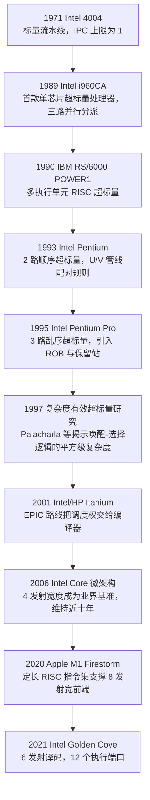
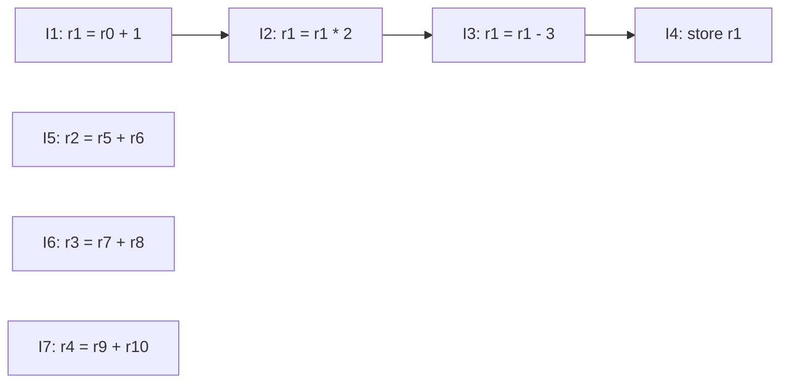

# CPU微架构与执行引擎（3）· 超标量与多发射
> [!abstract] TL;DR
> - 超标量通过复制取指/译码/执行/退休等流水级的宽度，把 IPC 上限从标量流水线的 1 提升到 N；但流水线各级宽度并不对等——前端译码宽度、后端执行端口数、退休宽度常常互相错位，这是读懂具体芯片参数表的关键。
> - 多执行端口不是简单堆叠 N 份相同 ALU：以 Skylake 为例，8 个端口中 4 个做整数 ALU、2 个专职 Load 地址生成、1 个专职 Store 数据、1 个仅支持简单寻址的 Store 地址生成——端口高度非对称、按实际指令流量特化，是面积/功耗与吞吐量之间的工程折中。
> - 可实现的 ILP 受真数据依赖链（RAW）、分支预测失败（Flynn 瓶颈）与结构冒险三重限制；Wall（1991）的经典研究测得"现实"假设下可捕获 ILP 均值约 5，"理想"假设下约 25——这解释了为何发射宽度早已超过 4，但通用代码的实测 IPC 很少突破 3~4。
> - 发射宽度扩展存在电路复杂度天花板：唤醒-选择（wakeup-select）逻辑必须在同一周期内完成才能让相关指令背靠背发射，其硬件代价随宽度与窗口大小近似平方增长（Palacharla et al., 1997），这也是 x86 译码宽度在 4 宽停滞近十年、之后转向宏指令融合与 SMT/多核而非一味加宽的深层原因。
> - 超标量（硬件动态调度）与 VLIW/EPIC（编译器静态调度）是把"找并行"的责任放在硬件还是编译器的两条路线；Itanium 的商业失败证明静态调度难以对抗不可预测的缓存延迟与分支行为，也不具备超标量固有的宽度代际二进制兼容性。
> - 多执行端口在 SMT 下由同核多个逻辑线程共享，PortSmash（CVE-2018-5407）已借助端口争用的计时差异从并发线程窃取 ECDSA 私钥——多发射带来的吞吐红利与旁路风险，是同一机制的两面。

## 概述与定位

上一篇《[[02.指令流水线与冒险]]》把 CPU 拆成取指、译码、执行、访存、写回五级，讲清了结构冒险、数据冒险、控制冒险如何在一条流水线里制造气泡。但那一篇始终锁定在一个隐含前提之下：**每一级流水线在每个周期里只处理一条指令**。哪怕气泡完全消除、流水线一直满载，标量流水线的吞吐量也有一条硬顶——每周期最多退休一条指令，即 CPI（Cycles Per Instruction）下限为 1、IPC（Instructions Per Cycle）上限为 1。这是标量（scalar）流水线的结构性天花板，与主频、缓存命中率、分支预测准确率都无关：就算一切都命中、一切都预测正确，一条流水线一次也只能吞一条指令。

本篇要回答的问题是：怎么把这条 IPC=1 的天花板打破？答案是沿着"宽度"这一维度做文章——把取指、译码、发射、执行、退休这几级流水线都从"单份"复制成"多份"，让多条指令在同一个周期里并肩穿过整条流水线。这就是**超标量（superscalar）**。需要先厘清的是，提升单线程性能历史上有三条相对独立的技术路线：**超流水线（superpipelining）**靠把每一级拆得更细、缩短单级延迟来推高主频（用深度换吞吐，代表如 Pentium 4 的 NetBurst，一度拉到 20 级以上流水线）；**超标量**靠横向复制流水级宽度、在同一周期处理多条指令（用面积换吞吐）；**VLIW/EPIC** 则是超标量的"编译器版"——同样是一个周期发射多条操作，但把"哪些指令能凑到一起"这件事从运行时的硬件判断挪到了编译期的静态调度。三条路线可以叠加使用（现代高性能核心几乎都是"深流水线 + 宽发射"的组合），本篇聚焦第二条：多发射本身的结构、它需要什么硬件资源、以及它的收益上限在哪里。

划定一下本篇与相邻章节的边界，避免重复：本篇只处理"宽度"和"结构"这一层——一个周期里最多能有多少条指令同时流经机器的各个阶段、这需要多少份物理执行单元、这个宽度的极限由什么决定。至于"给定一堆已经派遣（dispatch）到位的指令，硬件具体怎么算法级地判断谁的操作数就绪、该把谁送进哪个功能单元"，这属于动态调度算法，留给下一篇《[[04.乱序执行与Tomasulo算法]]》里的保留站与公共数据总线机制；"如何在不产生假依赖的前提下让乱序执行成为可能"，属于《[[05.寄存器重命名与物理寄存器堆]]》；"取指宽度如何在遇到分支时仍然保持满载"，其核心——分支预测器的内部结构——展开于《[[06.分支预测器演进]]》；"乱序执行出来的结果如何按程序序退休、错误路径又如何回滚"，属于《[[07.投机执行与重排序缓冲ROB]]》。本篇会在需要的地方点到这些机制作为前向引用，但不重复展开其内部算法。

还有一个常见的概念混淆值得在开篇就澄清：**超标量不等于乱序执行**，这是两条正交的轴。超标量说的是"一个周期能发射/执行几条指令"，乱序说的是"发射的顺序是否可以偏离程序原始顺序"。历史上第一批超标量处理器全部是顺序发射的——1993 年的 Intel Pentium 用两条整数流水线（U/V pipe）实现 2 路顺序超标量，靠硬布线的"配对规则"在译码阶段判断相邻两条指令能否同时下发；直到 1995 年 Pentium Pro 才把乱序动态调度引入 x86 阵营。即便在今天，顺序超标量也远没有消失：ARM Cortex-A53 是一颗 8 级流水线、2 路顺序发射的超标量核心，作为移动 SoC 里的能效核长期占据 2014~2025 年间出货量最大微架构的位置——它的静态顺序流水线意味着"避免结构冒险和数据依赖"这件事在很大程度上要靠编译器排布指令来配合，这也为本篇稍后讨论 VLIW/EPIC 的"编译器负责调度"埋下伏笔。下图勾勒超标量从诞生到现在的宽度演进主线，作为后续原理展开的历史坐标：



这条时间线里有两处值得先点出来的转折：一是 1995 年 Pentium Pro 开创的"译码为内部 uop、乱序执行、顺序退休"范式（业界称为 P6 微架构思想），此后除了 2000~2004 年 NetBurst 短暂押注"深流水线换主频"之外，x86 高性能核心至今仍是这套范式的直系后代；二是 2006 年之后译码宽度长期停滞在 4 宽附近，直到 2020~2021 年才被 Apple M1 与 Intel Golden Cove 先后突破——这背后的电路复杂度原因，是"原理与机制"和"端口结构与发射逻辑详解"两节要仔细拆解的核心内容。

## 原理与机制

### IPC、发射宽度与"宽度"的多重含义

要精确讨论超标量，先要把术语钉死，因为不同教材、不同厂商手册对流水线各阶段的叫法并不完全统一，而这套术语会在下一篇讲 Tomasulo 算法时被直接复用。本系列采用如下顺序：**取指（fetch）** 从指令缓存搬运指令字节；**译码（decode）** 识别指令类型、拆出操作数、生成内部微操作（uop）；**重命名（rename）** 把架构寄存器映射到物理寄存器（第 05 章详述）；**派遣（dispatch）** 按程序原始顺序把译码/重命名后的指令送入发射队列或重排序缓冲区；**发射（issue）** 从发射队列里挑出操作数已就绪的指令送往具体的执行单元——在乱序机器里这一步可以不按程序顺序进行；**执行（execute）** 由功能单元真正计算出结果；**写回（writeback）** 把结果通过旁路网络广播给所有等待它的指令；**退休/提交（retire / commit）** 按程序原始顺序把结果落到架构可见状态、并释放对应资源（第 07 章详述）。"发射宽度"（issue width）严格指的是发射这一步每周期能送往执行单元的指令条数上限，也是"N 路超标量"里 N 的正式定义；但媒体和厂商 slide 里常把取指宽度、译码宽度、发射宽度、执行端口数混着用同一个"N 宽"来说，读参数表时需要留意具体指的是哪一级。

关键的一点是：**流水线各级的宽度在真实芯片里几乎从不相等**。前端（取指/译码）的宽度通常要略大于后端稳态消耗速度，为的是在分支预测恢复、缓存缺失等前端抖动发生时，靠一个缓冲队列把抖动和后端解耦，不让后端跟着一起空转；执行端口数往往比译码宽度更高，因为端口既要消化前几周期积压下来的存量指令，也要覆盖那些低频但必须存在的专用单元（例如除法器）；退休宽度则大致要匹配译码/重命名宽度，否则重排序缓冲区会在持续高发射率下被填满、反过来把前端憋停。下图给出一条现代乱序超标量流水线的宽度分级视图：


理解这张图的要点在于：它不是一条等宽的管道，而是一串宽度互相牵制、又各自受不同物理约束支配的阶段。后面"端口结构与发射逻辑详解"一节会用 Skylake、Golden Cove、Zen4、Apple M1 四颗真实芯片的公开数据把这张示意图的每一级具体填上数字。

### 指令级并行 ILP：定义与三重上限

**指令级并行（Instruction-Level Parallelism, ILP）** 描述的是一段代码本身、独立于任何具体机器的属性：在不违反正确性的前提下，理论上最多有多少条指令可以同时执行。它由程序的真实依赖图（dependency DAG）决定，而不是由处理器决定——处理器只能决定"实际发挥出了这段代码可用 ILP 中的多少"，这个实际发挥值就是我们平时说的 IPC。二者的关系可以写成一句话：**IPC ≤ min(该代码段的可用 ILP，处理器的发射宽度)**，而现实中往往还要再打个折扣，原因是下面三类限制同时起作用：

第一类是**真数据依赖链（RAW，写后读）**。如果指令 I2 要用 I1 刚算出来的结果，I2 就必须等 I1 完成，这是数学意义上的强制串行，任何数量的执行端口都无法让它提速——这是"多发射不是万能药"最根本的原因，也是本节稍后"安全性与正确使用"部分要反复强调的误用陷阱源头。第二类是**控制依赖**，也称 Flynn 瓶颈：机器要往前多发射几条指令，前提是它已经知道（或猜对了）接下来的控制流走向；一旦分支预测错误，所有基于错误路径投机发射出去的宽度都是浪费，还要付出流水线冲刷的代价（第 06、07 章详述预测器与回滚机制）。第三类是**结构冒险**，即便两条指令彼此独立、分支也预测对了，只要它们同时抢同一个稀缺资源（比如同一周期里有两条除法指令，而处理器只有一个除法器），也必须有一条等待——这正是"多执行端口"这个话题要解决的问题：端口的数量和分工，直接决定了有多少"结构无冲突"的宽度是可以真正兑现的。

下面这张图用两组指令直观对比"真依赖链"和"相互独立"两种极端情形：



左边 I1→I2→I3→I4 是一条严格的 RAW 依赖链，哪怕处理器是 40 路超标量，这四条指令也只能一条接一条地执行，总延迟等于四条指令延迟之和；右边 I5、I6、I7 互不相干，只要有三个兼容端口同时空闲，它们完全可以挤在同一个周期里发射。一段真实代码的可实现 ILP，本质上取决于它的依赖图里这两种模式的混合比例——这也是为什么整数指针追逐类代码（链表遍历、树遍历、解释器的取指-译码循环）天生难以提速，而循环体规整、可归约为多路独立累加的数值计算代码天生对宽发射友好。

这不是纸上谈兵的直觉，而是有量化研究支撑的。David Wall 在 1991 年 DEC WRL 的经典研究《Limits of Instruction-Level Parallelism》里，用一组从"完全不做分支预测/寄存器重命名/别名分析"（他称为 Stupid 模型）到"近乎理想假设"（Great 模型）的多档处理器模型，跑了包含 SPEC89 在内的 13 个基准测试：Stupid 模型下 ILP 很少超过 2；较为"公平"（Fair）的现实模型下常见 ILP 落在 2~4 之间；即便是 Great 模型，ILP 也很少突破 8；综合下来，"现实可捕获"模型的平均 ILP 约为 5（不同程序之间波动范围 3~45），而"理想"模型平均约 25（范围 6~60）。Wall 还特别提醒：如果一项研究同时假设完美分支预测、完美别名分析、完美寄存器重命名，得出的乐观数字是一条"危险的花园小径"；如果只挑 fpppp、tomcatv 这类高度向量化的基准来说明 ILP 很高，同样具有误导性。这组三十多年前的数字放到今天依然成立——它解释了为什么发射宽度早已冲到 6~8，但绝大多数通用整数负载的实测 IPC 依然徘徊在 1~3 附近，只有循环密集、依赖链短的数值/向量代码才能把宽度真正吃满。

### 顺序发射 vs 乱序发射：以 Pentium U/V 流水线为例

即使排除了结构冒险，一台**顺序超标量**（in-order superscalar）机器要凑齐一组能同时发射的指令，也只能在"程序顺序里紧挨着的那几条"里挑——只要窗口内第 k 条指令和前面某条有任何依赖，第 k 条及其后续在本周期就只能作废重排到下一周期，哪怕再往后数几条其实是完全独立的。这个限制在 1993 年 Intel Pentium 的 U/V 双管线设计里体现得极其具体：U 管线可以执行完整指令集，V 管线只能执行一个"简单指令"子集；两条指令要配对同周期发射，必须同时满足一组硬布线判定条件（源自 Intel 专利文献里对配对逻辑的形式化描述）：

| 配对条件 | 说明 |
| --- | --- |
| I1、I2 都属于"简单指令" | 全硬布线单周期完成，如寄存器到寄存器 MOV、INC/DEC、简单 ALU 运算 |
| I1 不是跳转指令 | 跳转只能出现在配对的第二条（V 管线），且限定为条件跳转 Jcc |
| dest(I1) ≠ src(I2) | 无真数据依赖（RAW），否则本周期只发射 I1，V 管线空转 |
| dest(I1) ≠ dest(I2) | 无输出依赖（WAW）——Pentium 没有寄存器重命名，只能靠顺序发射硬性回避 |
| 不可同时含位移和立即数 | 受译码带宽限制 |

这张表本身就是一堂生动的"结构冒险如何在多发射场景下被放大"的案例课：Pentium 因为没有寄存器重命名（第 05 章的主题），连 WAW 这种本不应该限制并行度的"假依赖"也必须靠顺序发射规则原样避让，白白牺牲了一部分本可兑现的宽度。**乱序超标量**从根本上解决了这个"必须是程序序里相邻几条"的限制：指令仍然按程序顺序派遣进发射队列，但发射本身只看操作数是否就绪，不看在队列里排第几——这样机器可以越过一条尚未就绪的旧指令，去执行队列里更靠后但已经就绪的新指令，实质上是把"寻找可并行指令"的搜索范围从"接下来几条"扩大到了"整个指令窗口"（窗口大小即第 07 章重排序缓冲区的深度）。这正是 1995 年 Pentium Pro 引入乱序引擎后大幅甩开同期顺序超标量设计的根本原因，也是为什么乱序几乎已经成为高性能核心的标配——但正如"概述"一节所强调的，乱序解决的是"排布"问题，它并不减少本篇讨论的"宽度"本身所需要的硬件资源：不管顺序还是乱序，N 路发射依然需要 N 份可用的执行端口、足够的寄存器堆读写口，这正是下一节要展开的内容。

## 端口结构与发射逻辑详解

### 流水线宽度的分级：从取指到退休的真实数字

抽象的宽度分级图落到硅片上是什么样子？下表用四颗有公开微架构分析资料的芯片对照说明，直观感受"各级宽度互不相等"这件事：

| 微架构（发布年代） | 译码宽度 | 分配/重命名宽度 | 执行端口数 | 重排序缓冲深度 |
| --- | --- | --- | --- | --- |
| Intel Skylake（2015） | 经典 4 宽（1 复杂+3 简单）译码器；命中 uop 缓存时最高 6 uop/周期 | 6 uop/周期送入后端 | 8 个端口：P0/P1/P5/P6 做整数 ALU（P0/P1/P5 兼 FP/SIMD），P2/P3 做 Load 地址生成，P4 做 Store 数据，P7 做（仅简单寻址的）Store 地址生成 | 224 项 ROB，97 项统一保留站 |
| Intel Golden Cove（2021） | 6 个简单译码器（取消了此前的复杂译码器，复杂指令改由宏指令融合处理），取指带宽翻倍到 32B/周期；uop 缓存约 4K 项，最高 8 uop/周期 | 6 宽分配/重命名 | 12 个端口（较上代 Sunny Cove 的 10 个新增第 3 条 Load 地址生成通道） | 512 项 ROB（上代为 352 项） |
| AMD Zen4（2022） | 4 宽译码（由 20×16B 指令队列解耦供给） | — | 整数侧 4 ALU + 3 AGU + 1 分支单元，浮点侧 2 组 256 位 FMA + 2 FADD + 2 Store 数据通道，官方宣传口径合计"14 条执行管线" | 320 项 ROB |
| Apple M1 Firestorm（2020） | 8 宽译码（192KB L1I 供给），"流水线宽度"以 8 uop/周期计量 | 重命名阶段可对寄存器间 MOV/立即数加载做免费消除，最高 8 条/周期 | 6 个整数单元 + 4 个访存单元 + 4 个 SIMD/FP 单元（个别整数运算在特殊形式下可达 11 发射/周期，即一个 uop 触发多次发射） | 非常规设计：约 330 项"合并退休队列"（每组最多合并 7 个 uop）+ 约 623 项寄存器回收表，等效乱序窗口约 ±630 项，业界罕见 |

（以上数字均取自各芯片发布时的公开微架构分析资料，不同代际、不同 SKU 会有细微调整，实际以厂商当代优化手册为准，此处旨在说明"宽度分级"这一结构性规律而非充当精确规格书。）

几个观察值得点出来。第一，**译码宽度长期是 x86 阵营最紧的瓶颈**：x86 指令是变长编码，找到下一条指令的边界前必须先部分解码前一条，这个过程天然难以并行，所以 Intel 在 Core 2（2006）到 Skylake（2015）将近十年里译码宽度一直卡在 4 宽附近，直到 Golden Cove（2021）才升级到 6 宽——而且升级方式并不是简单堆更多复杂译码器，而是反过来**砍掉了唯一的复杂译码器**，靠宏指令融合把复杂指令的处理挪到指令序列发生器里、腾出面积去堆更多结构简单的译码器，同时把取指带宽翻倍到 32B/周期。第二，**定长 RISC 指令集在译码宽度上有先天优势**：AArch64 全部指令定长 32 位，边界定位是免费的，多路译码器可以直接并行工作而不必先串行扫一遍，这正是 Apple M1 能够一步跨到 8 宽译码、且比同期 x86 芯片省电得多的关键原因之一——Robert Graham 等分析者的评价很直接：x86 想做到 8 路同时译码，代价是海量晶体管和更慢的时钟，"是笔糟糕的买卖"。第三，**执行端口数普遍大于译码宽度**：这不是矛盾，而是执行端口既要消化前几个周期从发射队列里积压下来的存量指令，也要覆盖译码阶段一次通常凑不满、但必须常备的专用单元（分支口、除法口等），所以后端"看起来更宽"是补偿前端抖动与专用化需求的结果，而不是稳态吞吐真的能到那个数字。

### 端口特化：为什么不是 N 份相同的 ALU

一个自然而然的问题是：既然要 8 路发射，为什么不干脆造 8 个一模一样、什么都能干的执行单元，让调度逻辑随便挑？答案在于**成本不是线性的**。多端口寄存器堆的物理实现代价（版图面积、走线拥塞、访问延迟）随端口数增长的速度明显快于线性——每加一个读/写口，SRAM 存储单元和译码走线都要跟着膨胀，这是纯电路层面的物理约束，不是设计者偷懒。与此同时，真实代码里各类指令的动态占比并不均匀：整数 ALU 运算通常占动态指令流的三成到四成，Load 类访存占比常年高于 Store（读比写更频繁），分支指令占比约一到两成，而除法、复杂 SIMD 重排这类指令占比很低但延迟高、电路面积大。理性的设计选择因而是**按真实指令流量的统计特征做非对称特化**，而不是均匀复制最贵的那种单元。

Skylake 的端口划分就是这套逻辑的教科书案例：P0、P1、P5、P6 四个端口做整数 ALU（其中 P0/P1/P5 还兼职浮点/SIMD 运算，P6 还兼职一个分支单元），P2、P3 两个端口专职 Load 地址生成，P4 专职 Store 数据，P7 专职 Store 地址生成——但 P7 只是一个"简单 AGU"，只能处理 `[基址+偏移]` 这种简单寻址形式，遇到需要变址寄存器的复杂寻址 Store，地址生成还是要退回去和 Load 抢 P2/P3。这种"看起来是第 8 个端口、实际能力却打了折扣"的非对称设计，正是手工做微架构级性能调优或者做旁路时序分析时最容易被忽视的陷阱：两条表面上"同属地址生成类"的指令，实际吞吐特性可能完全不同。相比之下，AMD Zen4 走的是另一条更灵活的路线：整数侧的 ALU 与 AGU 共享同一组调度队列，指令派发时不必提前锁定必须去哪个物理端口，硬件在发射时有更大的自由度去做负载均衡——这体现了英特尔偏"端口专职、划分清晰"与 AMD 偏"队列共享、发射时动态分配"两种工程哲学的横向差异，二者都在解决同一个问题（如何用最少的物理资源覆盖真实指令流量分布），只是选择了不同的复杂度取舍点。

### 唤醒-选择逻辑：发射宽度的电路复杂度天花板

发射宽度并不是想设多宽就能设多宽，它背后有一个真实的电路复杂度天花板。乱序发射队列每个周期要做两件事：**唤醒（wakeup）**——所有已完成执行的指令把自己的目的寄存器标签广播到一条公共总线上，队列里所有还在等操作数的指令用 CAM（内容寻址）方式把自己等待的源标签跟广播比对，命中就标记"就绪"；**选择（select）**——在所有"就绪"的指令里，用类似优先编码器的仲裁逻辑，按照端口数量上限挑出真正能发射的赢家（通常按年龄优先，越老的指令优先级越高）。Palacharla、Jouppi 与 Smith 在 1997 年 ISCA 上发表的经典论文《Complexity-Effective Superscalar Processors》用 Spice 电路仿真在 0.8μm、0.35μm、0.18μm 三个工艺节点下量化了这套逻辑的代价，得出一个关键结论：**唤醒和选择必须在同一个时钟周期内首尾相接完成，两条相互依赖的指令才能背靠背连续发射**——一旦把这个环拆成跨两个周期的流水线，相关指令之间就会白白多出一个气泡，而依赖链在真实代码里又是常态，这个代价非常伤实际吞吐。更麻烦的是，唤醒比较器的数量和选择仲裁器的扇入，都随"发射宽度 × 窗口大小"的乘积近似平方增长，这意味着单纯靠堆宽度和堆窗口来换 IPC，电路关键路径延迟的增长速度会远超线性——这是一堵真实的、来自 VLSI 物理层面的墙，不是抽象的理论上限。

论文提出的应对思路是**基于依赖关系的聚簇（dependence-based clustering）**：既然相互依赖的指令天生没法并行执行，不如干脆把一条依赖链上的指令导向同一个小型 FIFO 队列，队列内部按顺序发射，不需要复杂的全相联 CAM 唤醒逻辑；多个这样的小队列并行工作，总体依然能保持不错的宽度，但每个队列内部的电路代价被摊薄了。这个思路是后来众多**聚簇化微架构（clustered microarchitecture）**的直接理论先驱——例如 Alpha 21264 把整数执行资源拆成两个各自拥有独立寄存器堆副本和 ALU 的簇，簇间通过一条额外多一拍延迟的旁路网络互连，用"偶尔多一拍转发延迟"换取"每个簇内部电路规模可控"。理解了这层电路约束，就能理解为什么 x86 译码宽度会在 4 宽附近停留将近十年——那些年里，单纯靠加宽后端发射逻辑收益已经很有限，产业界把更多精力投向了宏指令融合（下一节展开）、更大的 uop 缓存、以及本系列第 13 章要讲的 SMT/多核路线，而不是无脑加宽一条队列。

### 微指令融合：不硬加宽度也能提升有效吞吐

除了物理意义上的"加宽"，还有一条更"巧"的路子：**让同一份硬件资源承载更多有效工作量**，而不是复制资源本身。**宏指令融合（macro-op fusion）** 把两条架构指令在译码阶段合并成一个内部 uop，让它们此后在重命名、派遣、发射的每一级都只占一个"名额"，直到真正执行时才按需要拆解——x86 上最典型的例子是 `CMP`/`TEST` 紧跟 `Jcc` 的比较-跳转组合，融合之后整个组合只消耗一份译码/重命名/发射带宽，实质上是把前端有效吞吐"偷偷"提高了一截而不必真的多摆一套译码器。**微指令融合（micro-op fusion）** 则是在同一条架构指令内部，把地址生成和数据操作这类天然绑定的微操作捆成一个 uop 传递（例如"内存操作数 + ALU 运算"这种既要访存又要计算的形式）。这不是花架子：Golden Cove 明确把它当作核心设计策略之一——用宏指令融合去覆盖原来由唯一的复杂译码器负责的那部分指令，从而腾出面积把 5 个译码器（1 复杂 + 4 简单）换成 6 个结构简单、更省电的译码器。这提示了一个更普遍的设计原则：与其无差别地把昂贵结构复制 N 份，不如先想办法用更聪明的编码方式，把"每一份硬件资源能顶多少条架构指令"这个比值提高。

### 超标量 vs VLIW/EPIC：调度权放在硬件还是编译器

超标量把"判断哪些指令能并行"的责任放在运行时的硬件里，这带来两个直接好处：**二进制代际兼容**——同一份程序不需要重新编译，换到一颗发射宽度更大的新芯片上就能自动利用新增的并行度，因为调度是芯片每次运行时现场做的；**对不可预测事件的适应力**——缓存缺失要等多少周期、分支到底走哪边，这些运行时才能确定的信息，硬件可以见机行事，先执行队列里别的就绪指令，不必空等。代价是这套判断逻辑本身很贵：前面两节讲的多端口寄存器堆、唤醒-选择电路、乱序缓冲区，都是为"运行时现场找并行"这件事直接买单的面积和功耗。

**VLIW（超长指令字）与 EPIC（显式并行指令计算）** 走的是相反的路线：由编译器在编译期一次性做完依赖分析，把彼此独立的操作打包进一个固定格式的"捆绑"（bundle）里，硬件只管按固定槽位把捆绑拆开、无脑并行地喂给对应的执行单元，完全不需要唤醒-选择这类动态调度电路，核心可以做得更简单、更省电。最典型也是最著名的商业尝试是 2001 年 Intel 与 HP 联合推出的 **Itanium（IA-64/EPIC）**：128 位一个捆绑，内含 3 个 41 位指令槽和一个 5 位模板字段，模板既编码了这个捆绑属于哪种类型（比如 "MMI" 表示 2 条访存 + 1 条整数运算），也用"停止位"标出捆绑之间的依赖边界；EPIC 还加入了断言执行（predication）和推测/预先加载（speculative / advanced load）等特性，试图帮编译器进一步对冲运行时的不确定性。但结果是，**缓存缺失的真实延迟和分支的真实走向终究是编译期无法完全预知的**——编译器排不满的槽位只能填 NOP，直接拖累代码密度和指令缓存利用率；一旦某个槽位真的踩上一次意外的缓存缺失，整个捆绑都要跟着停顿，即便捆绑里其他槽位逻辑上完全独立、本可以继续执行。公开的对比数据很能说明问题：800MHz 的 Itanium 在 SPECint 上只达到 1GHz Alpha 21264（一颗乱序超标量处理器）约 85% 的成绩，每 FP 操作的功耗却是同频 Pentium 4 的约 1.78 倍——效率承诺没有兑现。更根本的是**VLIW 天生缺乏超标量那种代际二进制兼容性**：捆绑宽度、各操作延迟一旦在下一代芯片上发生变化，老程序的静态调度立刻失配，必须重新编译才能正确发挥新硬件的性能（部分场景甚至涉及正确性，见下节）。最终，Itanium 没能打过延续动态调度范式、顺势扩展到 64 位的 x86-64，HP、DEC、SGI 当年为了这次赌注放弃了各自本已成功的 PA-RISC、Alpha、MIPS 路线，代价高昂。VLIW 真正站稳脚跟的地方，是控制流和访存行为高度规整可预测的场景，比如 TI C6000 一类数字信号处理器，或者借助软件翻译层把 x86 语义"抹平"到内部 VLIW 执行的 Transmeta Crusoe/Efficeon——一句话总结：**当运行时的不确定性可以被压到很低时，把调度权交给编译器是划算的；面对通用、分支密集、访存行为多变的负载，动态硬件调度目前仍然更稳。**

这里也顺带澄清一个容易和"多发射"混淆的概念：GPU 的 **SIMT（单指令多线程）** warp 调度不是本篇讨论的 ILP 范畴，而是数据/线程级并行——同一条指令同时作用在多条并行数据通道上，本质上是 SIMD 的线程化包装，与"同一周期发射不同指令"是两个维度。现代 CPU 核心事实上同时具备两者：本节讨论的执行端口里，本来就包含专职处理宽 SIMD 向量指令的端口，宽发射（几条不同指令同周期执行）和宽向量（一条指令同时处理多路数据）是可以叠加、也经常被叠加使用的两条正交收益。

### 现实趋势：宽度增长放缓，SMT 与多核接棒

把"唤醒-选择电路平方级增长"和"Wall 研究里现实 ILP 均值只有个位数"这两个事实放在一起看，就能理解为什么进入 2010 年代之后，单核发射宽度的增长明显放缓：继续加宽单核，边际收益越来越薄，边际成本却越来越陡，这符合工程界常引用的 **Pollack 法则**（性能提升大致只随复杂度/面积增加的平方根增长）——把晶体管预算翻倍，指望换来两倍单核性能是不现实的。产业界的应对是把增量资源投向另外两条路：一是本系列第 13 章要讲的 **SMT（同时多线程）**，让第二个逻辑线程的独立指令去填补第一个线程因依赖链、分支预测等原因没能吃满的执行端口空闲周期，把"结构性浪费"直接转化成吞吐；二是**多核**，不再纠结于从单一指令流里榨取越来越难挖的指令级并行，转而依赖线程级并行（TLP）。Apple M1 用 8 宽译码、超大乱序窗口的设计路线，某种程度上是这条"宽度增长放缓"总规律下的例外——它能这样做，前提是选择了较低的目标频率和先天译码更省电的定长 RISC 指令集，本质上仍然是在 Pollack 法则这条曲线上换了一个不同的取舍点，而不是打破了这条规律本身。

## 工具视角与实战

### 用 perf 测量 IPC 与自顶向下分析

最基础的宽度利用率验证，是直接测 IPC：

```bash
# 整体 IPC = instructions / cycles，最粗粒度的宽度利用率指标
perf stat -e cycles,instructions ./workload

# Intel 自顶向下分析法（Top-Down Microarchitecture Analysis，TMAM）
# 需要较新内核+perf，或用 pmu-tools 的 toplev.py
perf stat --topdown -- ./workload
```

自顶向下分析把每个执行槽位的去向归到四个桶：Frontend Bound（前端供不上指令，常见于译码/uop 缓存缺失或分支目标缓冲区未命中）、Bad Speculation（分支预测错误导致的无效工作）、Backend Bound（后端资源不够用）、Retiring（真正有效退休的比例）。本篇最相关的是 **Backend Bound 再往下拆出的 Core Bound 子项**——如果一段代码的瓶颈落在 Core Bound 而不是 Memory Bound，通常就意味着执行端口或发射队列本身饱和了，而不是在等内存，这时候手工向量化、循环展开、减少依赖链长度这类"暴露更多 ILP"的优化才有意义；反过来如果瓶颈是 Memory Bound，无论怎么在指令级并行上下功夫都收效甚微，应该去查缓存层级（第 09 章）。

### 端口级 PMU 计数器与静态分析工具

定位到具体是哪个端口饱和，需要更细粒度的硬件计数器：

```bash
# 逐端口占用率（Intel Skylake 系列事件名），直接看出谁是瓶颈端口
perf stat \
  -e uops_dispatched_port.port_0 \
  -e uops_dispatched_port.port_1 \
  -e uops_dispatched_port.port_5 \
  -e uops_dispatched_port.port_6 \
  -e uops_dispatched_port.port_2_3 \
  -e uops_dispatched_port.port_4 \
  -e uops_dispatched_port.port_7 \
  -- ./workload
```

在没有真实机器、或者想在改代码之前先做静态预估时，**llvm-mca**（LLVM Machine Code Analyzer）和 uops.info 提供的 uiCA 模拟器是常用工具——它们不运行代码，而是根据目标微架构的端口/延迟模型，对一段汇编做静态调度模拟：

```bash
# 静态分析：不运行代码，按 Skylake 的端口/延迟模型估算调度瓶颈
llvm-mca -mcpu=skylake -timeline -bottleneck-report hot_loop.s
```

其 Resource pressure 表会把每条指令的微操作按可用端口逐列列出压力值，一眼看出哪个端口被压满；Bottleneck Report 部分则直接点名限制吞吐的资源类别（例如"某个端口的调度队列已满"）。要拿到逐指令、逐代际的精确端口分配与延迟数字，业界公认的权威资料是 **Agner Fog 维护的《The microarchitecture of Intel, AMD and VIA CPUs》与《Instruction tables》**（agner.org），以及在线数据库 uops.info——手工做微架构级性能调优或者审计他人代码的性能特征时，这两份资料通常比厂商 slide 更可靠、更细。

### 编译器视角：暴露更多可发射的独立指令

发射宽度是否被吃满，很大程度上取决于源码层面暴露了多少独立工作。可以用 [Compiler Explorer](https://godbolt.org) 直接观察 `-O2`/`-O3`、循环展开（`-funroll-loops`）前后生成汇编里独立指令流的变化，也可以用自动向量化报告（如 `-Rpass=loop-vectorize`）确认循环是否被转成了 SIMD 形式——向量化和本篇讨论的多发射是互补而非替代关系：向量化让"一条指令处理多个数据"，多发射让"一个周期执行多条指令"，二者同时命中才能真正把一颗宽发射核心的算力用满。一个常见的手动优化技巧是**用多个累加器打断规约（reduction）依赖链**：把 `for(i) sum += a[i]` 拆成 `sum0 += a[i]; sum1 += a[i+1]; ...` 几路并行累加、最后再合并，本质上就是人为地把左图那种"长依赖链"模式改造成右图那种"互相独立"模式，让乱序发射队列有更多同时就绪的候选指令可挑。

反向工程视角下，端口争用还是一种可以被测量的旁路信息：基于 `rdtsc` 的高精度计时循环可以探测到共享执行端口的争用模式，`taskset -c` 把探测线程和目标线程精确绑定到同一物理核心的两个逻辑 CPU 上，是复现类似端口争用实验（包括下一节要讲的 PortSmash）时控制噪声、排除操作系统调度干扰的常规手段。

## 安全性与正确使用

### 端口争用侧信道：PortSmash 与 SMT 的共享代价

多执行端口本身是一项性能特性，但当它在 **SMT（同时多线程，第 13 章详述）** 下被同一物理核心的多个逻辑线程共享时，就天然具备了成为旁路信道的条件——这正是 SMT 提高利用率的方式本身带来的副作用：一个线程没用满的端口周期被另一个线程拿去用，利用率提高了，但也意味着两个线程的执行行为会在端口层面互相"看得见"。2018 年 11 月，坦佩雷理工大学与哈瓦那科技大学（CUJAE）的研究者披露了 **PortSmash（CVE-2018-5407）**：攻击者在同一物理核心的兄弟逻辑线程上运行一个持续发射吞吐敏感指令的"探针"，通过测量这些指令完成的延迟波动，反推出受害线程当前在哪些端口上产生了争用，进而推断其执行的操作序列。研究者用这一方法针对 OpenSSL 里执行时间与密钥比特相关的 wNAF 标量乘法实现（用于 ECDSA 签名），成功从一个并发线程里还原出了目标 TLS 服务器的 secp384r1 私钥。需要特别指出：**PortSmash 与 Spectre/Meltdown 是完全不同机制**——它不涉及任何投机执行或分支预测误判，纯粹是资源争用带来的计时差异，即便把第 14、15 章讨论的所有投机执行类缓解措施都打上，PortSmash 依然成立，这划定了它与本系列后续侧信道章节的边界。

缓解手段方面，最彻底也最简单粗暴的是在 BIOS/固件层面**关闭 SMT/超线程**，云厂商和部分默认加固的操作系统在面对不可信租户共享物理核心的场景下会采用这一策略；软件层面，常量时间（constant-time）密码学实现——即执行路径和端口使用模式都不依赖秘密数据——能直接堵住这一类具体利用手法，OpenSSL 在 1.1.1 版本中已经修复了被利用的 wNAF 实现；虚拟化/容器场景下，"核心调度"（core scheduling，只把互相信任的线程调度到同一物理核心的兄弟逻辑 CPU 上）是介于"完全禁用 SMT"和"放任不管"之间的折中方案。也值得引用密码学界当时的一个冷静评价：该领域资深研究者 Alexander Peslyak（solar designer）与 Colin Percival 都指出，SMT 场景下执行引擎资源被跨线程共享，其存在旁路信道的可能性"本应是预期之中的设计属性"，而非全新的漏洞类别——这一评价有助于把风险感知校准在合理水平，而不是不假思索地把它和投机执行类漏洞的严重程度画等号（本篇也不做武器化利用细节展开，具体攻防留给第 14、15 章）。

### 正确认识发射宽度：常见误用与边界

第一个、也是最常见的误解是把"N 路发射"直接理解成"我的代码能提速 N 倍"。由"原理与机制"一节的分析可知，实际能兑现的加速比被 min(发射宽度, 代码的可用 ILP) 卡住，并进一步被分支预测失败和缓存缺失打折——指针追逐、链表/树遍历、解释器主循环这类天然长依赖链的代码，无论放到多宽的机器上跑，都不会有明显收益，因为限制它的是依赖链长度这个下限，不是端口数量这个上限。正确的应对方式不是寄希望于硬件，而是从算法和数据结构层面主动打断依赖链、暴露独立工作：把数组结构（AoS）改造成结构数组（SoA）以减少跨字段的假依赖、用多累加器打断规约链、必要时用编译器的循环展开与向量化提示——"实战"一节介绍的自顶向下分析可以在动手优化前先判断瓶颈是否真的落在执行端口上，而不是凭直觉猜。

第二个陷阱是**假依赖导致的隐性宽度损失**：x86 上对 `AL`/`AH` 这类部分寄存器写入、随后又读取完整 `EAX` 的场景，会触发"部分寄存器停顿"或额外的合并 uop，这是一种硬件层面的输出依赖/反依赖假象，并非代码逻辑真的要求串行，却依然会实实在在地吃掉一部分发射宽度——第 05 章要讲的寄存器重命名机制解决了其中大部分（但历史上并非全部）此类问题，理解这一机制的存在，有助于在阅读反汇编或做底层调优时识别"看起来独立、实则被迫串行"的指令组合。

第三个陷阱更偏向工具链正确性：在**顺序发射或 VLIW/EPIC 这类静态调度机器**上，指令排布本质上是正确性契约的一部分，而不仅仅是性能旋钮——如果编译器的指令调度阶段排错了顺序、违反了一条它没有识别出来的真实依赖（例如误判了一次内存别名关系），后果是**静默的错误结果**，而不是单纯变慢；这与乱序超标量机器形成鲜明对比——在乱序机器上，无论源码或编译器把指令排得多么"糟糕"，硬件的依赖检测都会保证最终结果正确，代码顺序不佳带来的代价永远只是性能损失，绝不是正确性问题。这个区别对编译器工程师和逆向分析者都有实际意义：审计一个基于静态调度架构（如老式 DSP 固件、Itanium 遗留二进制、或者编译器后端为 Cortex-A53 这类顺序核心生成的调度敏感代码）的目标时，指令调度相关的编译器缺陷需要被当作潜在的正确性缺陷来看待，而不能简单归为性能问题。

第四个陷阱是**拿宽度参数当唯一性能预测指标**做跨厂商、跨代际的简单类比。译码宽度、执行端口数、重排序缓冲深度和主频四者互相牵制（呼应前文的 Pollack 法则），"6 宽译码"不代表一定比"4 宽译码"的芯片跑得快，因为后者也许时钟更高、流水线更浅、分支预测命中率更好。唯一可靠的做法是用实测 IPC 与自顶向下分析在自己的真实负载上验证，而不是仅凭规格表上的发射宽度数字下结论。总的原则是：把发射宽度看作性能的**必要而非充分条件**——它决定了硬件能提供的并行度上限，但能否兑现，取决于代码是否提供了足够的独立工作、编译器是否正确且充分地暴露了这些独立性，以及在共享执行资源的多线程场景下，是否清楚这种共享本身也是一个需要纳入威胁模型的边界。

## 小结

- 标量流水线的 IPC 硬顶是 1；超标量通过复制取指/译码/发射/执行/退休等流水级的宽度突破这一顶，但各级宽度天然不对等，前端为吸收抖动通常略宽于稳态后端消耗，执行端口数常大于译码宽度，退休宽度大致匹配译码/重命名宽度。
- 多执行端口按真实指令流量做非对称特化（Skylake：4 ALU + 2 Load AGU + 1 Store 数据 + 1 受限 Store AGU），而非均匀复制，根源是多端口寄存器堆的物理代价随端口数超线性增长；不同厂商在"端口专职划分"与"调度队列共享"之间做出了不同取舍（Intel vs AMD 的横向对比）。
- 可实现 ILP 受真数据依赖链、分支预测失败（Flynn 瓶颈）、结构冒险三重制约；Wall（1991）测得现实模型下平均 ILP 约 5，这从根本上解释了"发射宽度远超实测 IPC"这一普遍现象。
- 唤醒-选择逻辑必须在单周期内完成才能支持相关指令背靠背发射，其电路代价随宽度和窗口大小近似平方增长（Palacharla et al., 1997）——这是发射宽度扩展的真实物理天花板，也是聚簇化微架构、宏指令融合、以及后续转向 SMT/多核的深层动因。
- 超标量（硬件动态调度）与 VLIW/EPIC（编译器静态调度）是互斥的两条路线；Itanium 的公开数据和商业结局表明，通用场景下运行时不确定性（缓存延迟、分支行为）几乎注定让静态调度处于劣势，且 VLIW 缺乏超标量固有的宽度代际二进制兼容性。
- 共享执行端口在 SMT 下会产生可测量的争用延迟（PortSmash / CVE-2018-5407），提醒我们"多发射带来的吞吐红利"与"共享资源带来的旁路暴露面"是同一机制不可分割的两面，需要在性能优化和威胁建模两个维度上同时看待发射宽度这一设计参数。

## 相关阅读

- [[00.CPU微架构与执行引擎总览]] · 系列总览
- [[02.指令流水线与冒险]] · 上一章：标量五级流水线与三类冒险
- [[04.乱序执行与Tomasulo算法]] · 下一章：保留站、公共数据总线与动态调度算法
- [[05.寄存器重命名与物理寄存器堆]] · 消除假依赖，呼应本篇端口与配对规则中的 WAW/WAR 问题
- [[06.分支预测器演进]] · 呼应本篇 Flynn 瓶颈与取指宽度的前置条件
- [[07.投机执行与重排序缓冲ROB]] · 呼应本篇退休宽度与乱序窗口深度
- [[13.SMT超线程与资源共享]] · 呼应本篇执行端口的跨线程共享
- [[14.微架构侧信道：Spectre与Meltdown]] · 与 PortSmash 划清投机执行类漏洞的边界
- [[15.侧信道进阶：MDS与L1TF与Zenbleed]] · 同属微架构缓冲区/资源共享类泄露
- [[21.Asm/28 原子操作与内存模型]]
- [[21.Asm/39 缓存与缓存一致性]]
- [[21.Asm/38 MMU与页表设置实战]]
- [[37.密码学/61.侧信道攻击]] · 密码实现层的侧信道，与本篇微架构层互补
- [[34.现代二进制防护机制/09.Intel CET]]
- [[34.现代二进制防护机制/13.MTE内存标签扩展]]
- David W. Wall, *Limits of Instruction-Level Parallelism*, WRL Technical Note / ASPLOS-IV, 1991
- S. Palacharla, N. P. Jouppi, J. E. Smith, *Complexity-Effective Superscalar Processors*, ISCA'97
- Intel® 64 and IA-32 Architectures Optimization Reference Manual
- Agner Fog, *The Microarchitecture of Intel, AMD and VIA CPUs* / *Instruction Tables*（agner.org）
- Hennessy & Patterson, *Computer Architecture: A Quantitative Approach*

[[00.CPU微架构与执行引擎总览|⬆ 系列总览]] | [[02.指令流水线与冒险|← 上一章]] | [[04.乱序执行与Tomasulo算法|→ 下一章]]
