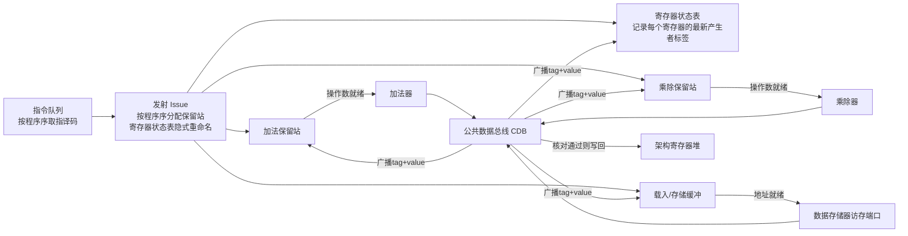
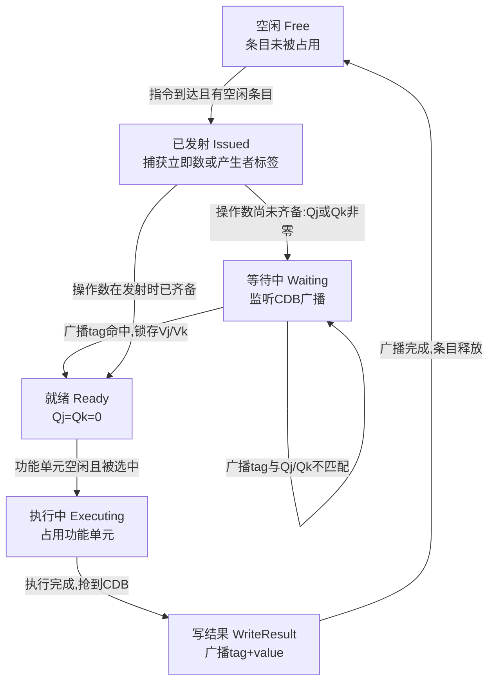

# CPU微架构与执行引擎（4）· 乱序执行与Tomasulo算法

> [!abstract] TL;DR
> - Tomasulo算法诞生于一个具体而尖锐的工程矛盾：IBM 360/91浮点部件拥有可以并行工作的流水化加法器与乘除器，架构上却只有4个浮点寄存器——1967年Robert Tomasulo用硬件动态调度而非扩指令集的方式，第一次把"寄存器名字"与"数据实际所在的物理槽位"解耦。
> - 保留站（分布式操作数缓冲）、寄存器状态表（记录每个寄存器"下一个值由谁产生"）、公共数据总线CDB（广播式一对多转发）三者协同，把WAR/WAW假依赖从"必须停顿等待"降级为"完全不需要处理"，而不是像CDC 6600记分板那样靠阻塞流水线来保正确性。
> - 算法本质是三条可以互相乱序的"序列"：发射序严格等于程序序，执行序按操作数就绪时间乱序，写结果/广播序按功能单元完成时间乱序且受CDB带宽仲裁——理解这三条序的独立性，是理解一切现代乱序CPU的钥匙。
> - 原始Tomasulo算法有一个经常被忽视的硬伤：它没有独立的"提交"阶段，结果一算完就广播并可能直接落地寄存器堆，因此异常不精确、也无法安全回滚投机执行——这正是第7章重排序缓冲ROB要补上的缺口，现代CPU实际运行的是"Tomasulo + 投机恢复"的合体。
> - 保留站的唤醒-选择（wakeup-select）比较网络是调度器规模的物理天花板：条目越多、CDB越宽，标签比较与结果转发的电路越接近O(N²)量级，直接顶到时钟频率的关键路径上，这也是历代CPU在统一调度器与分布式调度器之间反复摇摆的根本原因。

---

## 概述与定位

### 从"发射宽度"到"谁先执行"：一个没被回答的问题

第3章把发射宽度、多执行端口和指令级并行（ILP）的关系讲清楚了：前端每周期能同时译码、分派几条指令，直接决定了硬件"看到"了多大的一段指令窗口。但发射宽度本身只回答了"一次能塞进去几条"，没有回答一个更尖锐的问题——如果这批指令之间存在真实的数据依赖，而不同指令在不同功能单元上的延迟又天差地别（一次定点加法一两个周期，一次浮点除法可能要几十个周期），硬件应该怎么安排执行顺序？

如果继续按照最朴素的思路，让指令严格按照程序序被送入功能单元、前一条不算完后一条不能开始，那么只要队首指令卡在等待一个迟迟没有就绪的操作数上，后面哪怕已经操作数齐备、随时可以执行的指令，也只能干等着——这是一种"排头阻塞"（head-of-line blocking）效应：一个人排队时鞋带松了蹲下系鞋带，身后的人明明可以直接刷卡进站，却被迫跟着一起停下来。第2章讨论流水线冒险时给出的应对手段是插入气泡（stall），这只是承认问题存在并付出代价，并没有解决"能不能让后面的人先走"这件事。真正让"没有依赖的先走、有依赖的等"成为可能的，是本篇的主题：乱序执行（Out-of-Order Execution，OoOE），以及它在历史上第一个被完整工程化、至今仍是理解一切现代动态调度器的基石——Tomasulo算法。

### 历史锚点：一个被4个寄存器逼出来的算法

1967年，Robert Tomasulo在IBM Journal of Research and Development上发表《An Efficient Algorithm for Exploiting Multiple Arithmetic Units》，描述了他为IBM System/360 Model 91浮点部件设计的动态调度机制。这不是一次纯学术的思想实验，而是一个具体工程约束逼出来的解法：System/360的指令集架构（为了保持系列机型间的二进制兼容）只定义了4个浮点寄存器，但360/91的浮点部件在硬件上拥有相互独立、可以并行工作的流水化加法单元和乘除单元。如果严格按照寄存器名字串行地读写这4个寄存器，源码里大量"用完一个寄存器名字马上复用给下一个无关计算"的写法，会在硬件里制造出成堆的假依赖——加法器和乘除器本可以同时运转，却被4个寄存器名字的复用关系捆住了手脚，理论算力被架构层面的一个数字白白锁死。

Tomasulo的解法极其巧妙，也极具启发性：不修改指令集、不增加架构寄存器——那意味着要改变System/360这个跨机型的公共契约，代价高到不可接受——而是在硬件内部，用一套"保留站+标签"的机制，动态地把"程序里写的寄存器名字"这个软件层面的身份标识，与"数据实际存放在哪个物理槽位"这个硬件层面的事实彻底解耦。这个思路后来被证明极为深远：它是历史上第一个完整实现的硬件寄存器重命名雏形，也是后来所有乱序CPU动态调度器的共同祖先。Tomasulo本人也因这项工作后来获得了ACM/IEEE计算机学会联合颁发的Eckert-Mauchly奖，以表彰其对现代超标量处理器设计的奠基性影响。

### 在系列中的位置与边界声明

本篇上承[[01.从ISA到微架构：架构与实现的分野]]（Tomasulo算法本身就是"同一套ISA、硬件实现自由度可以有多大"这一命题最经典的历史案例）、[[02.指令流水线与冒险]]（本篇要系统性解决的正是数据冒险里WAR/WAW这一类"假依赖"）、[[03.超标量与多发射]]（本篇的调度机制运行在多发射前端把指令送进来之后）；下启[[05.寄存器重命名与物理寄存器堆]]（Tomasulo的标签机制是重命名的最初形态，05会把它推广为独立的、面向大规模物理寄存器堆的通用重命名阶段）、[[06.分支预测器演进]]、[[07.投机执行与重排序缓冲ROB]]（本篇会明确指出原始Tomasulo没有"提交"这一级，因此异常不精确、无法安全回滚投机执行，这正是07要补上的缺口）、[[08.存储子系统：Load-Store队列]]（本篇只讲清载入/存储缓冲作为保留站变体的基本形态，真正的内存消歧算法留给08）。

需要预先划清边界的地方：本篇不展开分支预测算法本身（留给06）、不展开物理寄存器堆与空闲链表的完整重命名体系（留给05）、不展开ROB的精确异常与投机回滚全套机制（留给07）、也不展开Load-Store Queue的内存消歧与store-to-load转发算法（留给08）——凡是必须触及这些话题的地方，本篇只给出最小闭环的解释和明确的前向指针，避免与后续章节重复造轮子。读者应当已经熟悉流水线基本级划分、结构/数据/控制三类冒险的定义（参见02），以及超标量发射宽度与多执行端口的概念（参见03）。

---

## 原理与机制

### 四种"序"：理解一切乱序CPU的坐标系

要理解乱序执行，最有效的思维工具不是纠结某条具体指令"提前"还是"推迟"了，而是把一段指令流沿时间轴拆成四条可以互相独立的"序"：

- **程序序（Program Order）**：源代码/指令流本身规定的顺序，是唯一"真实"、不可更改的顺序，架构上一切可见的最终效果都必须等价于按这个顺序逐条执行。
- **发射序（Issue Order）**：指令被送入保留站、开始接受硬件调度管理的顺序。经典Tomasulo算法严格保持发射序等于程序序——这一点常被忽视，但极其关键：乱序执行的"乱序"，乱的从来不是"看见指令的顺序"，而是"执行和完成的顺序"。
- **执行序（Execution Order）**：指令真正进入功能单元开始计算的顺序，由操作数就绪时刻和功能单元空闲情况共同决定，可以与程序序完全不同，这正是本篇标题里"乱序"二字的字面含义。
- **写结果/广播序（Write-Result Order）**：指令计算完成、把结果广播出去的顺序，同样可以乱序，还要额外受公共数据总线带宽（每周期能广播几个结果）的仲裁约束。

现代CPU在这四条序之外还有第五条——**提交/退休序（Commit/Retire Order）**，严格等于程序序，用来保证异常精确和投机可回滚，这是第7章重排序缓冲ROB的核心职责。原始Tomasulo算法里并不存在独立的第五条序：广播即生效，这正是本篇后半会反复强调的历史局限。把这四（五）条序牢牢记在脑子里，后面所有关于保留站、CDB、乱序调度的细节，都只是在回答"这几条序具体怎么在硬件里被解耦、又靠什么机制重新缝合出正确的架构语义"这一个问题。

### 数据冒险的再分类：真依赖与假依赖

第2章已经给出了RAW/WAR/WAW三类数据冒险的定义，这里做一次面向本篇主题的再分类，因为Tomasulo算法能做什么、不能做什么，完全取决于这个分类：

- **RAW（写后读，真依赖 / true dependence）**：后一条指令确实需要前一条指令算出来的值，这是程序语义本身要求的先后关系，任何硬件技巧都不能、也不应该消除它，只能想办法缩短"等待"本身付出的代价（更快的功能单元、更短的转发路径、更早的唤醒）。
- **WAR（读后写，反相关 / anti-dependence）**：后一条指令要写的寄存器，恰好是前一条指令要读的寄存器，两者之间没有任何数据流动关系，纯粹是"名字撞车"。
- **WAW（写后写，输出相关 / output dependence）**：两条指令先后写同一个寄存器，同样没有数据流动关系，只是最终"谁的值留下来"必须符合程序序。

WAR和WAW合称"名相关"（name dependence）——这个命名本身就点出了问题的本质：它们不是算法逻辑真正要求的顺序，而是"同一个寄存器名字被复用"这一编码事实制造出来的假象。既然是假象，理论上就存在一种做法，让"每一次赋值都拥有自己独一无二的物理身份"，名字复用带来的冲突也就随之消失——这正是寄存器重命名的哲学起点，Tomasulo算法是历史上第一次把这个哲学变成可以跑起来的硬件电路。

### 静态调度与动态调度：谁来决定执行顺序

在Tomasulo之前，"调度"（决定指令以什么顺序真正执行）主要是编译器的工作：编译器在编译期分析数据依赖图，把无关的指令交错排列，让流水线尽量少地因为等待而停顿——这就是静态调度。静态调度的根本局限在于编译器"看不到运行时才知道的信息"：一次load到底会不会命中缓存、一个分支到底会往哪边走，这些在编译时都是未知数，编译器只能基于静态假设做保守排布。动态调度把这个决策权下放到硬件：CPU在运行时才知道操作数到底什么时候真正就绪、缓存到底命不命中，因此能对真实发生的延迟做出反应，代价是需要额外的硬件面积、功耗和远比静态调度复杂的验证工作。这不是非此即彼的关系——现代系统两者都在用：编译器仍然会做尽量好的静态排布（减少活跃寄存器数量、拆解依赖链），硬件在此基础上做运行时的动态补救；理解这一点，也能解释为什么"读懂反汇编、判断编译器有没有把无关指令排在一起"在今天仍然是有意义的逆向与性能分析技能，即便CPU本身已经具备强大的乱序能力。

### CDC 6600记分板：动态调度的第一次真实尝试及其局限

在Tomasulo的论文之前三年，Seymour Cray与James Thornton已经在CDC 6600上实现了第一台具备硬件动态冒险检测能力的商用机器——**记分板（Scoreboard）**，由Thornton在1964年提出。CDC 6600拥有多个（公开资料常引用约10个）独立功能单元，记分板作为一个集中式的硬件裁判，追踪每个功能单元的忙闲状态、每个寄存器是否有"在飞"的写操作，据此允许指令乱序进入执行阶段。

记分板机制在思想上已经非常接近本篇主题，但它处理WAR/WAW的方式和Tomasulo截然不同——它选择的是**停顿**而不是**消除**：

- 对WAW冒险：记分板在"发射"阶段直接检测目的寄存器是否已经被一条更早、尚未完成的在飞指令占用，一旦发现就整条阻塞发射，直到前一个占用者完成写回。
- 对WAR冒险：记分板允许指令先进入"读操作数"阶段等待，但会推迟后写指令的"写回"阶段，直到所有更早发射、需要读取同一寄存器旧值的指令都已经完成读取。

这套机制之所以只能靠停顿而不能消除，根源在于记分板没有给指令提供任何"私有的操作数存放位置"——操作数最终都要从同一份寄存器堆里读、写回同一份寄存器堆，谁先谁后就必须靠严格的时间顺序来保证正确性，硬件层面没有任何东西能让"两个不同版本的同名寄存器值"同时安全共存。这正是Tomasulo算法要突破的关键——给每一份数据一个独立于寄存器名字的物理身份。

### Tomasulo的核心洞察：三件事协同解耦名字与数据

Tomasulo算法的核心可以概括为三个互相配合的机制，它们共同完成了"给每一份数据一个独立于寄存器名字的物理身份"这件事：

1. **保留站（Reservation Station）**：每个功能单元（或功能单元组）配备若干保留站条目，任何一条指令一旦被发射，就会在对应类型的保留站里获得一个专属槽位，用来存放它的操作码和两个操作数——操作数要么是"已经到手的实际值"，要么是"值还没来，但知道具体是哪一条在飞指令会产生它"（用标签表示）。
2. **寄存器状态表（Register Status）**：不再去问"寄存器堆里现在存的是什么值"，而是换一个问法——"这个寄存器接下来的值将由哪一条在飞指令产生"。把"寄存器名"到"数据来源"的映射做成一张可以随时更新的表，这本质上就是一次隐式的寄存器重命名：架构寄存器名字只是一个查表入口，真正承载数据的是保留站里那个由标签标识的物理槽位。
3. **公共数据总线（Common Data Bus，CDB）**：功能单元算完之后，结果不再是简单地写回寄存器堆等别人来读，而是带着"我是谁"（产生者标签）一次性广播给所有人；任何一个正在等待这个标签的保留站条目，都在广播发生的同一个周期里把值直接锁存进自己的槽位。这是一种"发布—订阅"式的转发，而不是"轮询—读取"式的转发，效率上的差别是本质性的。

这三件事合起来如何消除WAR/WAW假依赖，是理解Tomasulo算法真正精妙之处的关键，也是下一节要展开的重点：由于操作数在指令发射的那一刻就已经被复制或绑定进了保留站的私有槽位，任何"程序序更晚"的同名寄存器写入，物理上都不可能覆盖一个"程序序更早"的指令已经私有持有的操作数——反相关（WAR）因此根本不需要靠停顿来保证正确性，因为从物理载体的层面看，冲突压根不存在。输出相关（WAW）则靠寄存器状态表"永远只记录最新产生者"这条规则解决——谁是最后一个（按程序序）声明"我要写这个寄存器"的指令，寄存器状态表就记录谁的标签，这与各个产生者实际计算完成的先后顺序完全无关。这三件事具体如何在硬件流水线里落地——保留站的字段构成、三阶段流水线每一步的精确条件、CDB广播时的仲裁与核对逻辑——是下一节要逐一拆解的内容。

---

## 结构与算法详解

### 保留站与寄存器状态表的字段构成

用近似结构体的方式把保留站条目和寄存器状态表的字段列出来，比任何图示都更精确，也是理解后续三阶段流水线的前提：

```
保留站条目 ReservationStation {
    Busy   : bool     // 该条目是否被占用
    Op     : opcode   // 待执行的操作，如 ADD/SUB/MUL/DIV/LOAD/STORE
    Vj, Vk : value     // 两个源操作数的实际值（若已就绪）
    Qj, Qk : tag      // 产生 Vj/Vk 的保留站标签；置0（或空）表示对应操作数已经就绪，无需再等
    A      : address  // load/store 用的偏移/有效地址计算中间结果
    Dest   : tag      // 本条目自身的身份标签，广播到CDB上用来"自报家门"
}

寄存器状态表 RegisterStatus[r] {
    Qi : tag   // 寄存器 r 的最新产生者标签；空/0 表示寄存器堆里的当前值已经是最新有效值
}
```

这两张表加起来就是Tomasulo算法全部的状态机核心。保留站条目按功能单元类型分组（原始360/91里，加法器和乘除器各自拥有一组独立的保留站，load/store使用结构相近的缓冲区，细节在后文单列一节），寄存器状态表的条目数等于架构寄存器个数——在360/91上只有4项，体量小到可以用纯组合逻辑实现，这也是为什么小寄存器堆反而能撑起这套精巧机制的现实原因之一。

### 三阶段流水线：发射、执行、写结果

Tomasulo算法把每条指令的生命周期划分为三个阶段，每个阶段的进入条件和动作都可以精确描述：

```
阶段一 发射 Issue（按程序序，每周期至多N条；经典Tomasulo中N=1）
  前提：目标操作对应类型的保留站存在空闲条目（否则发生结构冒险，整条流水线在此停顿）
  动作：
    - 分配一个空闲保留站条目，填入操作码
    - 对每个源操作数：
        若 RegisterStatus[src].Qi 为空 → 直接从寄存器堆复制值到 Vj/Vk
        否则                       → 复制标签 RegisterStatus[src].Qi 到 Qj/Qk
    - 若指令有目的寄存器：RegisterStatus[dest].Qi ← 本条目自己的标签（隐式重命名在此刻发生）

阶段二 执行 Execute（乱序，谁先就绪谁先跑）
  前提：Qj == 0 且 Qk == 0（两个操作数都已就绪）且对应功能单元当前空闲
  动作：
    - 送入功能单元开始计算（load/store 需要先算出有效地址，再访问存储器）
    - 若同一周期多个条目都满足前提但功能单元只有一个 → 需要仲裁，常见策略是按"年龄"优先（程序序更早者优先），避免年轻指令持续抢占导致年长指令饿死

阶段三 写结果 Write Result（乱序，但每条CDB每周期只能承载一次广播）
  前提：功能单元完成计算，且本周期成功抢到了CDB的使用权
  动作：
    - 向所有保留站广播 (tag = 本条目标签, value = 计算结果)
    - 所有 Qj 或 Qk 等于该标签的条目：锁存 value，对应标签清零
    - 若 RegisterStatus[dest].Qi 此刻仍然等于本条目标签 → 提交写入寄存器堆，并清空该表项
      （若不相等，说明该寄存器已经被更晚发射的指令重新"认领"，本次广播只负责满足仍在等待这个标签的保留站条目，放弃写寄存器堆这一步——这正是WAW正确性的关键校验，下文有专门的反例推演）
    - 本保留站条目释放，回收供后续指令复用
```

这三个阶段合起来第一次把第2章讲的"取指-译码-执行-访存-写回"这条单一流水线，拆分成了"进入调度器"和"离开调度器"两段可以异步、乱序衔接的过程——这也是为什么很多资料会用"发射（issue）"专指指令进入保留站这一步、用"派遣/唤醒（dispatch/wakeup）"指代操作数就绪后被送入功能单元这一步：不同教材和不同厂商文档对这两个术语的使用并不完全统一（Intel的公开资料里"issue"有时特指前端把微操作送进后端这一步，等价于这里的发射；也有资料把"issue"整体等同于"从保留站送入功能单元"），阅读具体资料时需要留意上下文，本篇统一采用Tomasulo原始论文的用法：issue指进入保留站，execute指进入功能单元。

### 保留站如何消除WAR/WAW：一个完整算例

抽象的规则最好用一个具体的指令序列走一遍。取一组经典的浮点指令序列（延迟数字为便于说明手工构造的教学假设，并非任何具体处理器的真实参数）：

```
I1  L.D   F6, 34(R2)          ; 载入，占用载入单元，延迟1周期
I2  L.D   F2, 45(R3)          ; 载入，占用载入单元，延迟1周期
I3  MUL.D F0, F2, F4          ; 乘法，占用乘除单元，延迟4周期
I4  SUB.D F8, F6, F2          ; 减法，占用加法单元，延迟2周期
I5  DIV.D F10, F0, F6         ; 除法，占用乘除单元（与I3共享），延迟8周期
I6  ADD.D F6, F8, F2          ; 加法，占用加法单元，延迟2周期，重新定义F6
```

依赖关系：I4读取I1写的F6（RAW）、I4和I3都读取I2写的F2（RAW）、I5读取I3写的F0和I1写的F6（RAW）、I6读取I4写的F8和I2写的F2（RAW），同时**I6重新定义了F6，与I1构成WAW（输出相关），也与I4构成WAR（反相关，因为I4读F6发生在I6写F6之前）**——这正是本例要展示的重点。

假设单发射（每周期发射1条，与程序序一致）、各功能单元均为独占型（同一时刻只能处理一条指令）、广播发生在执行完成的下一周期，按前一节的规则逐周期推演，得到下表（"执行"列为占用功能单元计算的周期区间，"广播"列为CDB广播/写结果所在周期）：

| 指令 | 发射 | 执行区间 | 广播周期 | 使用的功能单元 |
| --- | --- | --- | --- | --- |
| I1 L.D F6 | 1 | 2 | 3 | 载入单元 |
| I2 L.D F2 | 2 | 3 | 4 | 载入单元 |
| I3 MUL.D F0 | 3 | 5–8 | 9 | 乘除单元 |
| I4 SUB.D F8 | 4 | 5–6 | 7 | 加法单元 |
| I5 DIV.D F10 | 5 | 10–17 | 18 | 乘除单元（须等I3让出） |
| I6 ADD.D F6 | 6 | 8–9 | 10 | 加法单元 |

可以看到执行完成的相对顺序是 I1→I2→I4→I3→I6→I5，与程序序（I1→I2→I3→I4→I5→I6）完全不同——I4虽然程序序排在I3之后，却因为操作数更早就绪、且加法单元比乘除单元快得多，反而先执行完；这正是"执行序独立于程序序"的直接体现。

再看第6周期结束时刻保留站的快照，可以直观看到"未就绪"和"已捕获"两种状态如何并存：

| 保留站 | 状态 | Op | Vj | Vk | Qj | Qk | 说明 |
| --- | --- | --- | --- | --- | --- | --- | --- |
| 乘除#1 | 执行中 | MUL.D | F2的值 | F4的值 | 0 | 0 | 对应I3，操作数早已捕获完毕，正在计算 |
| 加法#1 | 执行中→即将完成 | SUB.D | F6的值 | F2的值 | 0 | 0 | 对应I4，本周期末计算完成 |
| 乘除#2 | 等待中 | DIV.D | — | F6的值 | tag(I3) | 0 | 对应I5，Qj监听I3广播，一旦命中锁存F0 |
| 加法#2 | 等待中 | ADD.D | — | F2的值 | tag(I4) | 0 | 对应I6，Qj监听I4广播，一旦命中锁存F8 |

WAR安全性在这张表里已经一目了然：I4（第4周期发射）和I5（第5周期发射）读取F6时，F6早在第3周期就已经由I1广播完毕，两者在各自发射的那一刻，都是把F6的**实际数值**直接复制进了自己的Vj/Vk槽位——这个副本从复制的那一刻起就与寄存器状态表、与寄存器堆本身彻底脱钩。哪怕I6后来（第6周期）重新发射并声明"我要写F6"，也不可能触碰到I4、I5各自私有槽位里早已复制好的那份旧值。**这里安全的根本原因不是"I6恰好比I4、I5晚完成"这种时间上的巧合，而是操作数捕获这一动作本身就是按值复制、物理隔离的**——即便构造一个I6反而先执行完的极端情形，I4、I5持有的私有副本依然不受影响，这才是可以作为通用正确性证明的机制，而不是一个只在特定时序下成立的偶然结果。

WAW正确性则要靠"广播前核对寄存器状态表"这条规则来保证，用一个反证更容易看清楚为什么这条规则不可或缺：设想I1不是一条延迟很短的load，而是一条延迟很长的除法，导致I1的广播被意外拖到了第10周期之后——比I6（第10周期广播）还晚。如果CDB广播时不加任何检查、只要完成就无条件写寄存器堆，那么I1这次"迟到"的广播会用程序序更早、逻辑上早已过期的结果，覆盖掉I6程序序更晚、本应最终生效的正确结果，产生一次真实的WAW错误。Tomasulo算法的修复方式在上一节的伪代码里已经给出：**任何一次CDB广播在尝试写寄存器堆之前，必须先核对寄存器状态表当前记录的产生者标签是否仍然等于自己**——I1广播时若发现`RegisterStatus[F6].Qi`已经在第6周期被I6的发射改写为`tag(I6)`，就意味着I1已经不再是F6合法的"最新产生者"，广播依然要发生（因为可能还有别的保留站条目在等`tag(I1)`这个标签本身），但唯独放弃写寄存器堆这一步。这条"广播前核对身份"的规则，是WAW假依赖被彻底消除、而不是侥幸避开的真正原因。

下面这张时序图，用I3广播、I5被唤醒这一具体片段，展示CDB一对多广播与WAW核对同时发生的完整过程：

```mermaid
sequenceDiagram
    participant FU as 乘除单元(完成I3 MUL.D)
    participant CDB as 公共数据总线
    participant RS as 保留站条目(I5 DIV.D,Qj=tag(I3))
    participant RAT as 寄存器状态表
    participant REG as 架构寄存器堆F0

    FU->>CDB: 广播 tag=I3, value=乘法结果
    CDB->>RS: 同周期广播,Qj命中tag(I3),锁存Vj,Qj清零
    CDB->>RAT: 核对Status[F0]当前是否仍等于tag(I3)
    RAT-->>CDB: 是,I3仍是F0当前的最新产生者
    CDB->>REG: 核对通过,写入F0,Status[F0]清空
    Note over RS: Vj就绪;若Vk此前已就绪,下一周期即可参与功能单元选择
```

### 整体数据通路与保留站生命周期

把发射、寄存器状态表、多组保留站、功能单元、CDB串起来，就是Tomasulo算法完整的数据通路：



单个保留站条目从被分配到被回收，经历的状态转换是一个规律的闭环，可以用下面的状态流程表达：



### 唤醒-选择网络：调度器规模为什么不能无限扩大

CDB广播落到每个保留站条目上时，硬件要做的事情是：把广播出来的标签，和这个条目里所有尚未就绪的Qj、Qk同时做一次比较——这在电路上是一个类似内容寻址存储器（CAM）的并行比较操作，条目越多，需要的比较器就越多；如果同一周期允许多条广播（多条CDB，或者说多个可以产生结果的执行端口），每个条目还要同时对每一条广播分别比较，比较器数量随"条目数×广播路数"增长。这一步在业界通称"唤醒"（wakeup）。唤醒之后，一个周期内可能同时有多个条目变为就绪状态，但功能单元或发射端口数量有限，需要在这些就绪条目里选出真正能被送入执行的少数几个，这一步称为"选择"（select），常见策略是按程序序年龄优先，避免新到的年轻指令持续抢占导致年长指令饿死。

唤醒和选择加起来常被合称"唤醒-选择环"（wakeup-select loop），它是现代乱序CPU里最紧张的时序关键路径之一：为了让两条存在RAW依赖、延迟都很短的指令能够背靠背执行（生产者广播的下一周期消费者立刻执行，中间不插气泡），唤醒-选择这一整套逻辑必须在一个时钟周期内跑完，直接决定了处理器能跑多高的主频。学术界对这个问题有专门的经典研究——Palacharla、Jouppi与Smith在ISCA 1997发表的《Complexity-Effective Superscalar Processors》系统分析了唤醒-选择电路随发射宽度和调度器条目数增长的复杂度曲线，并据此提出用依赖关系聚簇（clustering）等方式缓解这一瓶颈，这篇论文后来深刻影响了业界对调度器规模的设计取舍。这也直接回答了一个常被问到的问题：既然"保留站越大、能看到的可并行指令越多"，为什么现实中的调度器条目数总是停留在几十到一百出头，而不是几千？答案就是唤醒-选择网络的物理代价接近条目数的平方量级，堆条目数会直接拖慢时钟频率或者被迫拉长调度本身的流水级数，两者都会侵蚀乱序执行带来的收益，这是一个必须权衡的硬性物理约束，而不是设计者不愿意做。

### 分布式保留站与统一调度器：两种路线的反复摇摆

原始360/91的保留站是按功能单元分组的分布式设计：加法器和乘除器各自拥有一组独立的保留站，互不共享。这种设计的好处是每一组保留站的比较网络规模小、时序容易收敛；代价是可能出现负载不均——一类运算扎堆到来导致对应的保留站排满，即便另一类保留站还空着，前端也必须为满了的那一组停止发射，即使理论上还有空闲的调度资源。

Intel P6微架构（1995年的Pentium Pro，x86历史上第一款乱序实现）走的是另一条路：用一个统一的保留站同时服务多个执行端口，避免了分组带来的负载不均问题，代价是比较网络必须覆盖全部条目和全部端口，规模和复杂度显著上升。这一取舍在后续几十年里被反复权衡：多数Intel桌面/服务器核心长期沿用统一调度器思路并持续扩容，而AMD的Zen系列则更多采用按整数/浮点分离、每一类再切分成若干更小队列的分布式思路，本质上是在"利用率"与"时序收敛难度"之间选择了不同的落点。这不是谁绝对正确的问题，而是每一代工艺、每一个频率目标下重新计算一次的工程折中，也是"复杂度有效超标量"（complexity-effective superscalar）这一研究方向长期关注的核心议题。

### 载入/存储缓冲：保留站在访存场景下的变体

浮点/整数运算类指令的操作数只涉及寄存器，而load/store指令的"操作数"还包括一个需要现场计算的有效地址，以及与存储器本身的交互。Tomasulo算法用一种结构上非常接近普通保留站、但增加了地址计算与访存排序考虑的缓冲区来处理这一类指令——原始设计里通常称为载入缓冲和存储缓冲。它们同样具备"捕获操作数或标签、操作数齐备后可以乱序执行"的基本特征，地址计算本身也可以当作一次微型运算，走一遍发射-执行-广播的完整流程。

但访存有一层寄存器运算不需要考虑的额外约束：两个内存地址是否重叠（是否别名）在运行时才能确定，一条store是否能安全地越过一条更早的load提前执行，取决于两者访问的地址会不会冲突——这是一个寄存器标签机制完全没有涉及的新维度，需要专门的地址比较与排序逻辑来保证正确性，这部分完整的算法（存储转发、内存消歧、投机性内存乱序及其回滚）留给[[08.存储子系统：Load-Store队列]]详细展开，本篇只需要建立一个认知：load/store buffer是保留站家族的一个变体，而不是另起炉灶的全新机制。

### 横向对比：记分板与Tomasulo

把前一节记分板的介绍和本节的细节放在一起做个系统对比，能更清楚地看到Tomasulo到底"贵"在哪、又"值"在哪：

| 维度 | CDC 6600记分板（1964） | IBM 360/91 Tomasulo（1967） |
| --- | --- | --- |
| 冒险检测方式 | 集中式记分板统一裁决全部功能单元与寄存器状态 | 分布式保留站，各功能单元组自行持有待发射指令与操作数状态 |
| RAW处理 | 指令在"读操作数"阶段轮询等待源寄存器就绪，就绪后直接从寄存器堆取值 | 发射时捕获立即数或产生者标签，CDB广播异步唤醒等待中的保留站，无需轮询寄存器堆 |
| WAR处理 | 停顿：推迟后写指令的写回阶段，直至所有更早的读者完成读取 | 消除：操作数在发射时即复制进保留站私有槽位，后续同名寄存器写入无法触及已读走的值 |
| WAW处理 | 停顿：发射阶段检测到目的寄存器被更早的在飞指令占用，直接阻塞发射 | 消除：寄存器状态表始终指向最新产生者标签，广播前核对身份决定是否提交寄存器堆 |
| 转发机制 | 无独立广播总线，结果落地寄存器堆，依赖指令重新读取寄存器堆 | 公共数据总线一对多广播tag+value，所有等待者同一周期锁存 |
| 隐式重命名 | 无 | 有，保留站标签即最早的硬件寄存器重命名雏形 |

这张表也说明了一个常被误解的地方：记分板并非"错误"或"过时"的设计，它在结构冒险与RAW检测上思路和Tomasulo是相通的，两者真正的分水岭只在WAR/WAW的处理策略——一个选择用时间顺序（停顿）保正确性，一个选择用空间隔离（私有槽位+标签）保正确性。后者代价更高（更多硬件状态、更复杂的广播与核对逻辑），但换来的是WAR/WAW完全不需要停顿流水线，这在指令级并行需求越来越高的年代，是決定性的性价比优势。

### 原始算法的边界：不精确异常与投机回滚缺口

必须明确指出的是，原始Tomasulo算法有一个从诞生起就存在、而且相当根本的局限：它没有独立的"提交"阶段。一条指令的结果一旦计算完成并成功广播，只要寄存器状态表核对通过，就会立即写入架构寄存器堆——这个动作和"这条指令前面是否还有尚未完成的指令""这条指令所在的路径是否真的应该被执行"完全无关。这带来两个严重的后果：

- **异常不精确**：如果某条指令在乱序执行过程中触发了一个异常（比如浮点除零、缺页），此时程序序在它之后的指令可能早已算完并把结果写回了寄存器堆——处理器此刻拿不出一个"恰好停在异常指令之前"的干净架构状态，异常处理程序看到的寄存器堆是一个乱序执行留下的、逻辑上不自洽的中间状态。
- **无法安全回滚投机**：一旦分支预测错误，需要把所有"实际上不该执行"的错误路径指令的影响撤销——但这些指令的结果可能早已经广播并写入了寄存器堆，覆盖了正确路径本该保留的值，而且这个动作在硬件里没有留下任何可以撤销的记录。

这两个问题合起来意味着，原始Tomasulo算法只能安全地用于"不需要精确异常、也不需要投机执行"的场景——这恰好符合360/91浮点部件当年的实际定位：浮点异常处理要求相对宽松，且当时也还没有现代意义上的分支预测与深度投机。但对于今天几乎所有需要支持虚拟内存缺页、精确调试、可靠信号投递、以及大规模分支投机的通用处理器，这个缺口必须被补上。[[07.投机执行与重排序缓冲ROB]]会完整展开这一补丁——引入一个按程序序管理"提交"的重排序缓冲（ROB），指令broadcast之后先把结果放进ROB暂存，只有轮到它按程序序退休时才真正提交进架构可见状态，从而让乱序执行的效率和精确异常/安全投机回滚同时成立。这个组合方案在教材里常被称为"Tomasulo算法 + 投机"（Tomasulo's algorithm with speculation），Intel P6微架构（1995年的Pentium Pro）是第一个把这套组合方案大规模商用于通用处理器的真实设计，它在Tomasulo风格的保留站之外引入了ROB，用ROB条目本身暂存尚未提交的结果，直到退休时才写入退休寄存器堆——这也是05章"物理寄存器堆"设计出现之前的一种典型历史形态，值得作为05的一个前置参照点记在这里。

---

## 工具视角与实战

### 用llvm-mca观察静态代码在乱序调度器里的行为

LLVM工具链自带的`llvm-mca`（Machine Code Analyzer）是最容易上手、也最贴近本篇主题的工具：它读入一段汇编或目标文件，基于LLVM内建的目标处理器调度模型（本质上就是每种微架构的功能单元数量、延迟、吞吐、调度器容量等参数的形式化描述），模拟指令如何被分派进调度器、如何乱序进入执行单元、又如何按顺序退休，并直接打印出时间线视图。典型用法：

```bash
llvm-mca -mcpu=skylake -timeline -resource-pressure input.s
```

输出的"Timeline View"会给每一条指令、每一个周期打一个标记（分派、执行中、退休等阶段各有专属符号），一眼就能看出哪些指令因为等待前一条指令的结果而被迫延后执行、哪些指令提前插队执行完毕——这正是本篇讲的执行序偏离发射序的现象，被工具具象化成了一张可以直接读的表格。"Resource Pressure View"则按执行端口统计每个端口的占用率，能直接定位"是调度器容量不够，还是某个特定端口过载"这类问题，对应本篇讨论的分布式/统一调度器负载均衡话题。需要注意的是，llvm-mca是一个静态模拟器，不会真正运行程序，也无法感知分支预测失败、cache miss等运行时才知道的事件，它给出的是"假设一切命中、一切预测正确"前提下的理论调度行为，是理解调度器机制、对比不同指令排布优劣的绝佳工具，但不能替代真实硬件上的性能测量。

### perf与自顶向下方法论：从外部现象定位调度器瓶颈

在真实硬件上，`perf`是最直接的观测手段。最基础的一组通用事件已经能看出问题大致落在哪个阶段：

```bash
perf stat -e task-clock,instructions,cycles,stalled-cycles-frontend,stalled-cycles-backend ./workload
```

`stalled-cycles-backend`偏高，往往意味着瓶颈落在执行/调度这一侧——可能是保留站被填满导致无法继续发射，也可能是某条依赖链的延迟本身就长到功能单元和调度器都无能为力。更精细的定位需要具体到某个微架构世代公开的专属性能事件，例如Intel处理器上（具体可用事件名随世代变化，`perf list`可以在目标机器上现查）：

```bash
perf stat -e rs_events.empty_cycles,uops_executed.stall_cycles,exe_activity.exe_bound_0_ports ./workload
```

`rs_events.empty_cycles`直接对应本篇反复强调的调度器状态——统计的是保留站处于"空"的周期数，如果这个数值很高，说明问题根本不在调度器容量不够，而在于前端压根没有产出足够多可调度的指令（更可能是取指/译码带宽或分支预测的问题，应该回头去查03、06的内容），这是一个很容易被误判为"乱序能力不足"、实际根因完全在别处的经典陷阱。反过来，如果保留站长期处于"满"的状态（可以通过对应的occupancy类事件观察）而IPC却上不去，才是真正指向调度器容量或依赖链过长的信号。Intel官方推广的自顶向下方法论（Top-Down Microarchitecture Analysis，TMA）把这一整套排查逻辑标准化成Frontend Bound/Bad Speculation/Retiring/Backend Bound四大类，Backend Bound又进一步细分为Core Bound（执行端口/调度器资源不足）与Memory Bound（访存延迟主导），是目前工业界排查这类问题最系统的框架，`perf`较新版本和`pmu-tools`的`toplev`脚本都可以直接产出这套分类结果。AMD处理器同样在其PPR（Processor Programming Reference）中公开了调度器相关的PMC事件，具体事件名随Zen世代变化，同样建议用`perf list`在目标机器上现查，不建议直接照搬Intel的事件名。

### 微架构模拟器：研究与教学场景下的可编程实验台

如果想亲手验证"调度器条目数从32改到64、CDB从1条改到2条，IPC会怎么变"这类假设性问题，真实硬件显然无法调参，需要借助周期精确的软件模拟器。学术界最主流的选择是gem5，它内建的乱序CPU模型（通常称为O3CPU）显式实现了Fetch/Decode/Rename/Issue-Execute-WriteBack（IEW）/Commit这几个阶段，其中Issue-Execute-WriteBack阶段内部的指令队列本质上就是一个可配置容量、可配置端口数的Tomasulo式保留站实现，修改配置文件里的调度器条目数、功能单元延迟、CDB（在gem5里体现为结果转发带宽与端口数）参数，重新跑一遍基准测试，就能定量看到本篇讨论的每一个权衡点如何影响最终IPC。ChampSim则是另一个在学术圈（尤其是历届Cache Replacement/Data Prefetching Championship）广泛使用的简化模拟器，虽然更偏重存储子系统研究，但同样内置了可配置的乱序核心模型，适合快速搭建实验。这两个工具都不是面向生产环境的工具，但作为验证本篇原理性论述最直接的实验台，是从"读懂原理"迈向"能定量论证"的关键一步。

### 亲手验证：依赖链与独立累加对吞吐量的真实影响

理解了保留站按操作数就绪度乱序调度这件事之后，一个立刻能落地的实战技巧是打断不必要的依赖链，让调度器有更多独立可调度的工作。经典例子是数组内积/规约求和：

```c
// 版本A：单一累加链，每次迭代的加法都依赖上一次的结果（RAW）
double sum = 0.0;
for (int i = 0; i < n; i++) {
    sum += a[i] * b[i];
}

// 版本B：四路独立累加，四条依赖链互不相干，可被调度器同时喂给功能单元
double s0 = 0, s1 = 0, s2 = 0, s3 = 0;
for (int i = 0; i < n; i += 4) {
    s0 += a[i + 0] * b[i + 0];
    s1 += a[i + 1] * b[i + 1];
    s2 += a[i + 2] * b[i + 2];
    s3 += a[i + 3] * b[i + 3];
}
double sum = (s0 + s1) + (s2 + s3);
```

版本A的吞吐量上限由"乘加延迟"直接锁死，无论调度器多大、功能单元多快、执行端口多宽都无济于事——因为每一次迭代都必须等上一次迭代的结果广播完成才能开始，保留站里同一时刻至多只有一到两条相关指令可调度，多余的调度资源完全闲置。版本B构造出四条彼此独立的依赖链，四条链可以同时"挂"在保留站里，只要功能单元和发射带宽允许，调度器就能在同一批周期里从四条链各挑一条就绪的指令送去执行，实际吞吐量能够接近功能单元的流水线吞吐上限而不是被单条链的延迟卡住。用`perf stat -e cycles,instructions ./a.out`分别测两个版本，直接比较IPC差异，就是对本篇"操作数就绪度决定执行序"这条核心原理最直观的现场验证——这也是编译器自动向量化、循环展开背后真正的物理动机，理解了保留站机制，这些编译优化选项就不再是"玄学参数"，而是有明确因果关系的工程手段。

### 查阅真实处理器的调度器参数：Agner Fog文档与uops.info

具体某一代真实处理器的保留站/调度器到底有多少条目、CDB（或者说结果转发网络）到底有多宽，这些数字并不会出现在官方营销材料里，长期以来主要靠社区逆向测量与公开的微架构分析文档整理。Agner Fog维护的《The microarchitecture of Intel, AMD and VIA CPUs》是这个领域最常被引用的公开资料，WikiChip与uops.info（后者提供了针对具体指令、具体微架构世代的延迟/吞吐/端口占用实测数据库）是另外两个常用的交叉验证来源。下表按这些公开资料长期整理的量级（不同资料口径存在出入，例如是否把load/store buffer单独计数），仅用于说明数量级和演进趋势，精确数值请以厂商手册及上述资料的最新版本为准：

| 微架构（大致年代） | 调度器条目数量级 | 结构特点 |
| --- | --- | --- |
| Intel P6/Pentium Pro（1995） | 约20 | 单一统一保留站，服务5个执行端口 |
| Intel Core（2006前后） | 约32 | 延续P6统一调度器思路并扩容 |
| Intel Nehalem（2008） | 约36 | 统一调度器 |
| Intel Sandy Bridge（2011） | 约54 | 引入物理寄存器堆，保留站只存标签不存值（详见05） |
| Intel Skylake（2015） | 约97 | 统一调度器大幅扩容 |
| AMD Zen系列（2017起） | 整数/浮点分离，各自再切分多个更小队列 | 分布式多队列思路，兼顾时序收敛与可扩展性 |

这张表最重要的信息不是任何一个具体数字，而是趋势本身：调度器容量确实在持续扩大，但扩大的速度远低于晶体管预算的增长速度，且不同厂商在统一与分布式之间做出了不同选择——这正是前一节"唤醒-选择网络物理代价"这一约束在真实产品世代上的具体投影。

---

## 安全性与正确使用

### 乱序调度是瞬态执行攻击的地基，而非攻击本身

必须先说清楚一个容易被夸大的因果关系：Tomasulo式的动态调度本身不是一个安全漏洞，它只是让"一条指令的执行时机与它在程序里的位置解耦"这件事成为可能。真正引出安全问题的，是这种解耦被投机执行进一步放大之后的结果——处理器为了不让流水线空转，会在分支结果、异常合法性尚未确认之前就先把后续指令送进保留站执行，一旦事后发现这次投机是错的，架构上会把寄存器和内存的可见效果"撤销"，但撤销撤不掉这些指令在执行过程中对缓存、TLB等微架构状态留下的物理痕迹——这些痕迹后来被证明可以通过计时旁路信道读出，这正是Spectre一类攻击的核心机制。之所以在本篇提前点出这一点，是因为保留站与CDB广播机制正是"操作数一就绪就可以执行、不必等前面所有指令确认安全"这一决策链条上不可或缺的一环：没有乱序动态调度，投机执行也就无从谈起。完整的攻击原理、变体分类与缓解方案留给[[14.微架构侧信道：Spectre与Meltdown]]与[[15.侧信道进阶：MDS与L1TF与Zenbleed]]系统展开，密码实现层面的旁路信道呼应可参见[[37.密码学/61.侧信道攻击]]，本篇只负责讲清楚"为什么乱序调度是这一整类问题的物理前提"。

### CDB与调度器资源争用：同核多线程下的旁路信道

CDB广播和保留站本身是核内共享资源，这一点在单线程视角下只是性能问题，但在同时多线程（SMT/超线程）场景下，共享调度器会让不同硬件线程的指令混合排队、混合竞争执行端口——学术界已经证明，通过精细测量自己这条硬件线程的指令被延迟了多久，可以反推出同核另一条硬件线程正在使用哪些执行端口，进而侧信道地推断对方在执行什么类型的运算，这类技术统称端口争用攻击，PortSmash是其中较早也较有代表性的公开研究。这类攻击的立足点不是本篇任何一个具体机制的"漏洞"，而是调度器和执行端口在SMT下被多个信任边界共享这一架构事实本身——它与本系列[[13.SMT超线程与资源共享]]讨论的资源共享话题是同一枚硬币的两面，安全敏感的负载（尤其是密码学实现）在部署时需要把"是否与不受信任的邻居共享SMT硬件线程"作为一个明确的威胁模型输入，而不能假设核内调度器的时序细节对外不可观测。

### 精确异常缺口的正确性代价，而不只是性能话题

前一节已经指出原始Tomasulo算法没有独立的提交阶段，因此异常不精确、投机不能安全回滚。这里要强调的是，这不仅仅是一个会拖慢缺页处理的"性能"话题，而是直接关系到系统正确性的"安全"话题：操作系统的信号投递、调试器的单步执行、虚拟化环境下的陷入陷出（trap-and-emulate），全部要求处理器能够精确地说出"程序恰好执行到了哪一条指令，它之前的所有指令效果都已生效，它之后的所有指令效果都还没有发生"。如果处理器只能提供一个乱序执行留下的、逻辑上不自洽的中间状态，操作系统和管理程序（hypervisor）就无法安全地保存、恢复或迁移这个进程/虚拟机的执行现场——这也是为什么现代通用处理器无一例外都要在Tomasulo式动态调度之上叠加[[07.投机执行与重排序缓冲ROB]]描述的按序提交机制：精确异常不是一个可选的性能优化项，而是虚拟内存、可靠调试、安全虚拟化这些现代系统赖以成立的正确性地基。

### 硬件验证复杂度与静默数据损坏

保留站、CDB广播、唤醒-选择网络在同一时刻要处理大量并发的、彼此交织的时序关系，这使得乱序调度器成为现代处理器里最难形式化验证的部件之一——需要证明的不是某一条具体路径正确，而是所有可能的操作数就绪时序交错组合下都不会出现"漏广播""错误转发""标签匹配错乱"这类问题。这不是纯理论担忧：Google在HotOS 2021发表的《Cores that Don't Count》与Meta同年发布的《Silent Data Corruptions at Scale》两篇论文，各自独立披露了在超大规模数据中心机队里观测到的、由个别CPU核心制造缺陷引发的静默数据损坏（Silent Data Corruption，SDC）现象——处理器不崩溃、不报错，却在极少数指令上算出错误结果，其中相当一部分根因被追溯到乱序执行相关的复杂时序逻辑角落场景。这类故障极难复现和定位，也是芯片厂商近年来大幅加码形式化验证、生产阶段在线自检电路投入的直接动因。对系统工程师而言，这个事实的现实意义是：不能想当然地假设"CPU算出来的结果一定是对的"，大规模分布式系统需要在应用层引入校验和、结果重算比对等纠错手段作为纵深防御的一环，而不是把正确性完全托付给硬件。

### 面向软件开发与逆向分析的正确使用建议

从性能与正确使用的角度，理解Tomasulo机制能直接转化成几条可执行的工程判断：第一，乱序执行不代表"依赖链的长度不再重要"——保留站和后续ROB能看到的指令窗口是有限的，一条依赖链如果长到超出这个窗口的可视范围，乱序引擎照样无能为力，前文的多路累加示例正是利用这一点主动打断依赖链、把工作摊开成调度器能并行消化的形状；第二，x86上一些历史遗留的"部分寄存器写"行为（比如只写低32位却让高位保持不变）会在硬件里制造出额外的假依赖，迫使调度器把后续读取完整寄存器的指令错误地当成对旧值有依赖，编译器和手写汇编都倾向于用`xor eax, eax`这类清零惯用法而不是直接赋值0，正是为了从根源上斩断这种假依赖，让保留站不必为一个本不存在的RAW关系空等；第三，性能分析时看到"保留站空闲周期占比很高"不代表乱序能力过剩，恰恰相反，往往是前端供给不足的信号，排查方向应该转向取指/译码/分支预测而不是盲目怀疑调度器容量，这一点在"工具视角与实战"一节已有展开；第四，过度的循环展开虽然能创造更多独立依赖链喂给调度器，但也会同时推高寄存器压力、指令缓存占用和ROB/保留站的占用密度，展开倍数并非越大越好，需要结合实测数据而非直觉来确定，这是一个经典的、容易被简化教程忽略的边界陷阱。

---

## 小结

Tomasulo算法用一个具体的历史约束——360/91的4个浮点寄存器与并行功能单元之间的矛盾——逼出了一整套至今仍是所有乱序CPU共同祖先的机制：保留站给每条在飞指令一个私有的操作数槽位，寄存器状态表把"寄存器名"改造成"指向最新产生者的指针"，公共数据总线用广播取代轮询完成异步转发。三者协同的效果，是把WAR/WAW这类因寄存器名字复用而生的假依赖从"必须靠停顿保正确"降级为"物理上根本不存在冲突"，而RAW这条真依赖则通过标签唤醒尽可能缩短了等待代价。理解发射序（严格程序序）、执行序（乱序）、写结果序（乱序且受CDB带宽约束）这三条可以互相独立的序，是搞懂一切后续章节的公共坐标系。同样重要的是记住原始算法的边界：没有提交阶段意味着异常不精确、投机不可安全回滚，这个缺口由[[07.投机执行与重排序缓冲ROB]]补上；Tomasulo的标签机制只是重命名的雏形，完整的物理寄存器堆体系由[[05.寄存器重命名与物理寄存器堆]]展开；保留站的唤醒-选择网络是调度器规模的物理天花板，这条约束会在后续讨论超线程资源共享、缓存与调度协同时反复出现。下一章将沿着"保留站标签即隐式重命名"这条线索继续深入，正式引入独立于任何具体保留站设计的物理寄存器堆与重命名表机制。

---

## 相关阅读

- [[00.CPU微架构与执行引擎总览]]——系列全景与阅读路径
- [[01.从ISA到微架构：架构与实现的分野]]——Tomasulo算法是"同一ISA、不同硬件实现自由度"的经典历史案例
- [[02.指令流水线与冒险]]——RAW/WAR/WAW冒险分类的基础定义
- [[03.超标量与多发射]]——发射宽度与多执行端口，本章调度机制的前置输入
- [[05.寄存器重命名与物理寄存器堆]]——Tomasulo标签机制的完整推广形态
- [[06.分支预测器演进]]——投机执行需要的前端输入
- [[07.投机执行与重排序缓冲ROB]]——补齐精确异常与投机回滚，"Tomasulo + 投机"的完整形态
- [[08.存储子系统：Load-Store队列]]——载入/存储缓冲的完整内存消歧算法
- [[13.SMT超线程与资源共享]]——调度器与执行端口在同核多线程下的共享与争用
- [[14.微架构侧信道：Spectre与Meltdown]]——乱序与投机结合后的攻击面
- [[21.Asm/28 原子操作与内存模型]]——寄存器/内存操作数在汇编层面的呼应
- [[21.Asm/39 缓存与缓存一致性]]——CDB广播式转发与总线嗅探式缓存一致性协议的思想同源
- [[21.Asm/38 MMU与页表设置实战]]——精确异常缺口与缺页处理正确性的呼应
- [[37.密码学/61.侧信道攻击]]——密码实现层面的旁路信道，与本篇端口争用讨论互补
- R. M. Tomasulo, "An Efficient Algorithm for Exploiting Multiple Arithmetic Units", *IBM Journal of Research and Development*, Vol. 11, No. 1, 1967
- J. E. Thornton, "Parallel Operation in the Control Data 6600", *AFIPS Proceedings*, 1964（记分板原始描述）
- S. Palacharla, N. P. Jouppi, J. E. Smith, "Complexity-Effective Superscalar Processors", *ISCA*, 1997
- John L. Hennessy, David A. Patterson, *Computer Architecture: A Quantitative Approach*（动态调度与Tomasulo算法章节）
- P. H. Hochschild et al., "Cores that Don't Count", *HotOS*, 2021
- H. D. Dixit et al., "Silent Data Corruptions at Scale", 2021

---

[[00.CPU微架构与执行引擎总览|⬆ 系列总览]] | [[03.超标量与多发射|← 上一章]] | [[05.寄存器重命名与物理寄存器堆|→ 下一章]]
