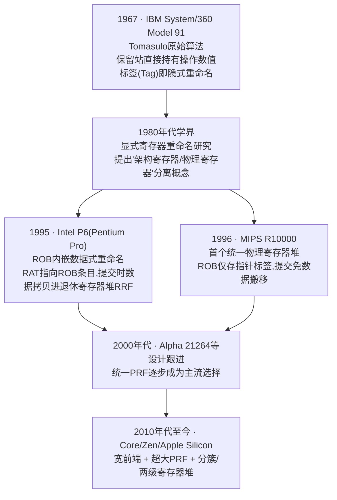
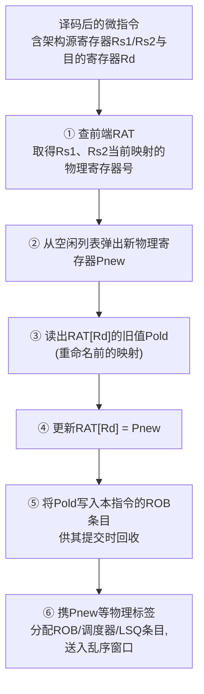
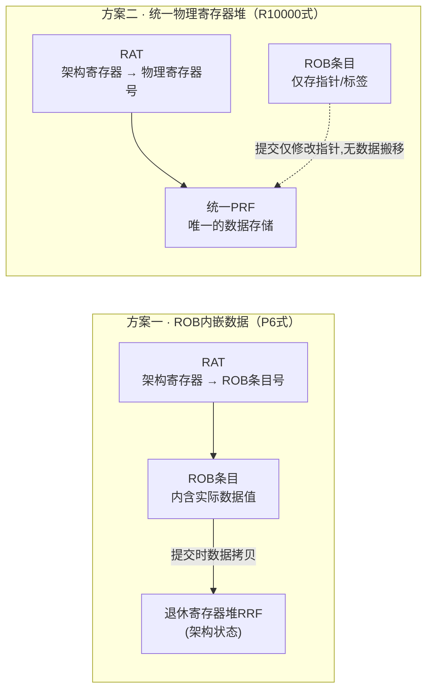
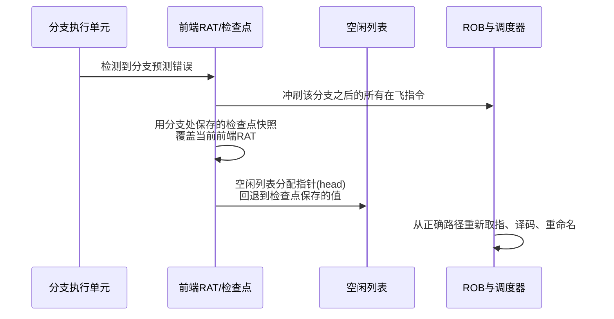
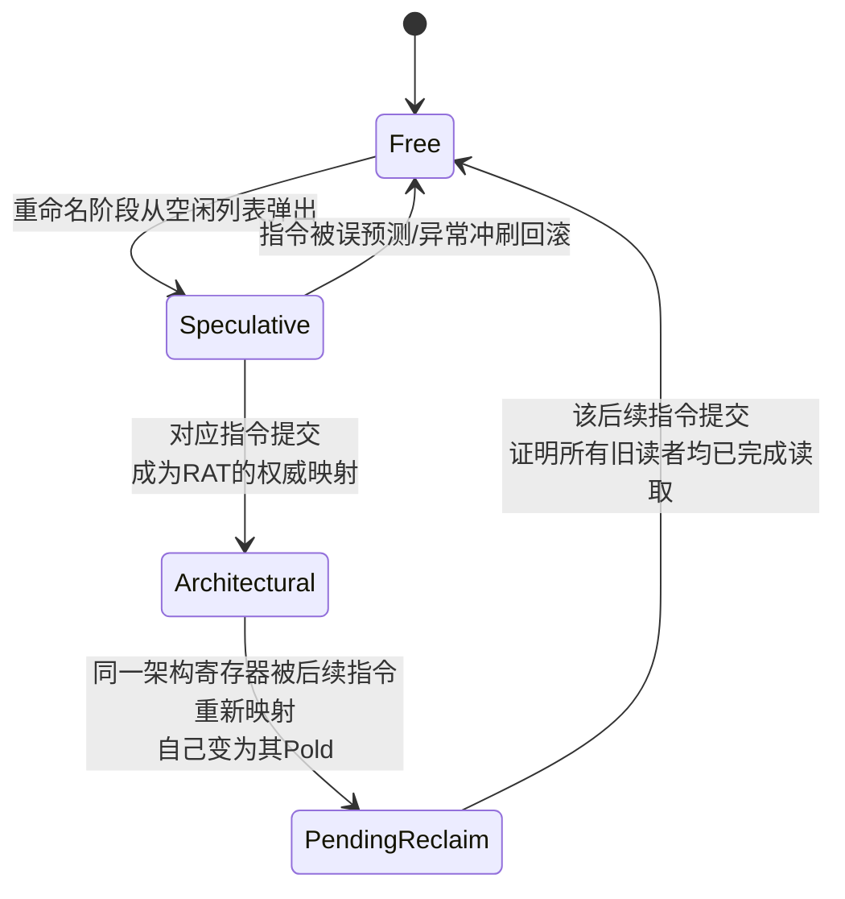

# CPU微架构与执行引擎（5）· 寄存器重命名与物理寄存器堆

> [!abstract] TL;DR
> - 寄存器重命名的本质，是把架构寄存器名（数量由ISA固定、有限）与物理存储位置（数量远大于架构寄存器、纯硬件内部概念）彻底解耦，让WAR、WAW这两种"因重复使用同一个名字而产生的假依赖"在物理层面直接消失，只留下真正携带数据流的RAW依赖需要调度器等待。
> - 重命名表（RAT）通常需要前端推测版本与提交端架构版本两份，或配合分支处的检查点做快照/回滚，用一次指针/映射表的整体覆盖而非逐条重放来应对分支误预测，恢复代价是O(1)量级而非O(窗口大小)。
> - 一个物理寄存器的正确回收时机不是"产生它的指令提交时"，而是"下一条重新映射同一架构寄存器的指令提交时"——这背后有一个依赖"重命名与提交都严格按程序序进行"的简洁正确性论证，是整个机制里最容易被讲错的一点。
> - 现代实现主要分两大流派：Intel P6式"ROB内嵌数据、提交时把数据拷贝进架构寄存器堆"，与MIPS R10000开创、后来被x86/ARM主流设计采用的"统一物理寄存器堆、提交只改指针不搬数据"；后者随发射宽度和乱序窗口增大而成为绝对主流。
> - 空闲列表若实现为循环缓冲区，分配指针（头）可被检查点、回收指针（尾）因为只在不可逆的提交事件之后才推进而永远无需回滚——这是重命名机制里最优雅的工程细节之一。
> - 重命名让指令得以在分支结果、异常状态尚未确定时，先用不影响架构状态的暂存物理寄存器提前执行，这正是乱序/投机执行能够安全存在的底层支柱，也是理解Spectre类瞬态执行攻击"为什么在硬件层面可能发生"的关键拼图之一。

## 概述与定位

### 从"消除假依赖"这个动机说起

上一章讲乱序执行与Tomasulo算法时，核心矛盾是：指令按程序序进入流水线，但执行阶段想按数据就绪与否乱序展开。真正阻止乱序的，理论上应该只有一种依赖关系——RAW（Read After Write，真数据依赖，消费者必须等生产者把值算出来）。但现实中的指令流里还混杂着另外两种"看起来像依赖、实际上不是"的关系：WAR（Write After Read，反相关）和WAW（Write After Write，输出相关）。它们之所以存在，纯粹是因为架构寄存器数量太少——x86-64可见的通用寄存器只有16个，RISC-V是32个，ARM64是31个——编译器/汇编程序员在生成代码时不得不反复复用同一批寄存器名字来存放彼此毫无关系的中间值。WAR、WAW描述的不是数据从一条指令流向另一条指令，而是"两条互不相干的指令碰巧写/读了同一个名字"。这类因为命名空间狭小而被迫产生的伪依赖，业界统称为**假依赖（false dependency）**，与之相对的RAW则叫**真依赖（true dependency）**。

寄存器重命名（register renaming）要解决的问题，说到底就是一句话：**给每一次"写"动态分配一个独一无二的物理存储位置，使得假依赖赖以存在的"名字冲突"根本不再发生**。这不是一个可有可无的优化，而是乱序执行能够正确、有效展开的前提条件——没有重命名，Tomasulo算法里的保留站即便能追踪RAW，也无法摆脱WAR/WAW对指令派发顺序的束缚，乱序窗口会被大大压缩。

### 在本系列坐标系中的位置

需要先厘清一个容易混淆的历史脉络：Tomasulo在IBM 360/91上提出的原始算法，其实已经内含了一种"隐式重命名"——保留站（Reservation Station）在指令派发时直接把源操作数替换成"产生该操作数的保留站标签"，而不是架构寄存器编号；一旦某条指令占用了某个保留站，后续对同一架构寄存器的读，会通过寄存器状态表指向新的保留站标签而不是旧的，WAR/WAW由此被自然规避。这正是详见 [[04.乱序执行与Tomasulo算法]] 的内容。但原始Tomasulo把"重命名"和"操作数存储"焊死在了保留站结构内部——保留站既是调度队列，又是数据暂存区，两者合一。本章要讲的，是这个思路被后来的处理器设计解耦、独立、通用化之后的产物：**显式的重命名表（RAT）+ 独立的物理寄存器堆（PRF）**，它们不再依附于某个具体保留站，而是成为乱序核心里独立的一层基础设施，为整个乱序前端（包括调度器、ROB、LSQ等）统一提供"名字到存储"的翻译服务。

这一独立化也是为了服务 [[03.超标量与多发射]] 里讨论的宽发射需求——多发射机器每周期要同时对多条指令做重命名，读、写多个寄存器映射，如果重命名逻辑还捆死在保留站里，很难扩展到每周期4~8条指令的规模。重命名表和物理寄存器堆独立出来后，才能作为一个可以单独设计端口数、单独做时序优化的模块。

本章聚焦"重命名机制本身"：假依赖为何存在、如何被消除、映射表怎么组织、物理寄存器何时能安全回收。与其紧密配合的两个结构会在后续章节展开：**ROB（重排序缓冲区）的完整字段与精确异常机制**放在 [[07.投机执行与重排序缓冲ROB]]；**分支预测本身的算法**放在 [[06.分支预测器演进]]，本章只处理"预测错了之后，重命名相关状态怎么被撤销"这一半。

下图给出重命名这一机制在处理器发展史上的位置——注意它并非一次性发明，而是从Tomasulo的隐式标签逐步演化出显式RAT，又分裂出两条实现路线：



## 原理与机制

### 假依赖到底假在哪里：两个最小例子

先用最小的例子把WAR和WAW的"假"字讲透——这一点看不看代码都应该能讲清楚，代码只是加深印象。

WAR（反相关）：

```
I1: MUL R1, R2, R3     ; 读 R2、R3，写 R1（长延迟运算）
I2: ADD R2, R4, R5     ; 写 R2
```

I1要读R2的旧值参与乘法，I2要把R2覆写成新值。如果调度器允许I2先于I1完成写入，而I1还没来得及取R2的旧值，I1就会错误地读到I2刚写进去的新值，结果算错。但请注意：I1和I2之间根本没有任何数据从I2流向I1——I1需要的是"R2这个名字曾经代表的那个旧值"，与I2要写入的新值毫无关系。二者唯一的联系是"恰好用了同一个寄存器名字"，这就是反相关，一种彻头彻尾的命名冲突而非数据流冲突。

WAW（输出相关）：

```
I1: DIV R1, R2, R3     ; 写 R1（长延迟运算）
I2: ADD R1, R4, R5     ; 也写 R1
```

若I2先于I1完成并写入R1，随后I1才姗姗来迟地把自己的（过时）结果写进R1，那么架构上R1的最终值会变成I1的结果，而不是程序顺序中"真正最后写它的那条指令"I2的结果——这就破坏了程序应有的语义。同样，I1、I2之间没有任何数据依赖，只是写向了同一个名字，谁的写生效应该完全由程序顺序决定，而不该被物理写入的时序意外决定。

### 重命名如何同时消灭WAR和WAW

解法极其简洁：**不要让R1、R2这样的架构名字直接对应任何固定存储，而是让每一次"写"都去申请一个全新的、此前从未被占用的物理寄存器**。这样一来：

- WAR自然消失：I1读的是它被重命名时拿到的旧物理寄存器，I2写的是它自己新分配的物理寄存器——物理上是两块完全不相干的存储，谁先谁后执行完，都不会互相覆盖，读永远读到该读的那份数据。
- WAW也自然消失：I1和I2各自写向不同的物理寄存器，不存在"谁的写覆盖了谁"的时序竞争问题；最终架构上R1这个名字该等于谁，由重命名表按程序顺序更新指向哪个物理寄存器号来决定，而不是由两次物理写入谁先到达来决定——即便I1真的比I2晚完成，只要重命名表的更新顺序正确（严格按程序序），最终R1也一定正确地指向I2产生的那个物理寄存器。

也正因为如此，重命名之后，调度器需要关心的依赖只剩下RAW一种：消费者指令必须等它引用的物理寄存器被生产者写入完成，除此之外，指令可以以任意顺序、任意时机执行——这正是乱序执行敢于大胆调度指令的根本原因，也是本系列把"重命名"安排在"Tomasulo算法"之后、作为其独立支柱来讲的原因：Tomasulo给出了"怎么用标签追踪RAW并唤醒等待者"的机制，重命名给出的是"如何从源头上让WAR/WAW不复存在"的机制，二者互补，共同构成乱序执行的完整地基。

### 架构寄存器与物理寄存器：一次名字空间的解耦

这里必须把两个概念严格区分开：

- **架构寄存器（architectural register）**：ISA手册里定义、汇编代码里直接书写、对程序员和编译器可见的寄存器名字，数量固定且很小（RAX/EAX这类，或R0~R31）。它是"软件契约"的一部分，任何实现都必须支持恰好这么多个可寻址的名字，多一个少一个都会破坏二进制兼容性。
- **物理寄存器（physical register）**：处理器内部真实存在的存储单元，数量远超架构寄存器（现代高性能核心通常是架构寄存器数量的5~15倍甚至更多），对软件完全不可见，纯粹是微架构实现细节，换代、换厂商可以随意调整数量而不影响ISA兼容性。

重命名表（RAT，Register Alias Table，也常被称为寄存器映射表/别名表）就是连接这两个名字空间的翻译层：`RAT[架构寄存器编号] = 物理寄存器编号`。任何时候，只要有人（无论是正在被重命名的后续指令，还是调试器要读架构状态）想知道"当前RAX的值在哪"，都要先查RAT，再去物理寄存器堆里取值——架构寄存器本身不再对应任何固定的存储位置，它只是一个不断被重新指派的指针目标。

### 映射表的两份拷贝与检查点

重命名表必须能应对一个棘手问题：分支预测错误或异常发生时，所有推测性的重命名都要被撤销，处理器必须能回到"最后一条确认正确的指令之后"那一刻的架构状态。为此，实践中通常维护不止一份映射表：

- **前端（推测）RAT**：在重命名阶段随着指令流按程序序被连续更新，反映的是"假设所有分支都预测正确"这条推测路径上的最新映射。
- **提交端（架构/退休）RAT**：只有指令真正提交（确认不会被回滚）时才更新，任何时刻它反映的都是精确、非推测的架构状态。

最朴素的恢复方式，是误预测发生时直接把提交端RAT整份拷贝回前端RAT——正确，但如果提交点和误预测点之间隔了很多条指令，逐路径重放/等待提交推进到误预测点会带来明显延迟，且如果每次误预测都要“追上”提交进度，代价随窗口深度线性增长。更高效的做法是**检查点（checkpoint）机制**：在每条分支指令重命名的同时，把当时的前端RAT整体做一次快照，误预测发生时直接用该快照覆盖当前RAT，一步到位，恢复延迟是O(1)而不是O(窗口大小)。代价是快照本身要占芯片面积，所以检查点数量有限，直接限制了处理器同时能"未确认"多少条分支——这是乱序窗口深度与分支密度之间的一个真实工程约束，也会在 [[06.分支预测器演进]] 中从预测器一侧再次被提及。还有一种折中方案是维护一份历史缓冲区/撤销日志（history buffer），记录"这次重命名覆盖前的旧映射"，误预测时反向回放日志逐条撤销——比整表快照省面积，但恢复延迟与需要撤销的指令数成正比，是面积与延迟之间的经典trade-off。

### 重命名阶段的基本算法与流水线位置

重命名通常作为独立流水级出现在解码之后、派发进入调度器/ROB之前：取指→译码→**重命名/分配**→派发→发射→执行→写回→提交。对每条正在被重命名的指令，硬件依次完成：



这六步里，第③④⑤步是全篇最容易被略过、却是回收正确性的关键，下一节会展开为什么Pold必须被记录、必须在恰当时机才能释放。

值得一提的是"结构性冒险"的另一面：如果第②步空闲列表恰好是空的（所有物理寄存器都已被在飞指令占用），重命名阶段必须整体停顿（stall），无法继续往下派发新指令。这不是数据冒险，而是一种真实存在的结构冒险（结构冒险的一般概念见 [[02.指令流水线与冒险]]），现代处理器主要靠增大物理寄存器堆容量、以及让提交尽快推进来缓解它，而不是靠算法本身消除——物理寄存器终究是有限资源。

## 结构与算法详解：重命名流水线与回收正确性

### 两大实现流派：ROB内嵌数据 vs 统一物理寄存器堆

历史上出现过两种截然不同的"物理存储放在哪"的选择，理解这两种选择的取舍，是理解现代乱序核心内部数据通路的关键。

**方案一：ROB内嵌数据（以Intel P6/Pentium Pro为代表）**。物理存储直接就是ROB条目本身的一个数据字段：RAT里存的不是"物理寄存器号"，而是"这个架构寄存器的最新值将由哪个ROB条目产生"。指令执行完，结果直接写进自己的ROB条目；后续指令要读该架构寄存器，如果RAT指向的ROB条目还没提交，就直接从ROB里把数据取出来（如果ROB条目还没执行完，则记录标签等待唤醒，与 [[04.乱序执行与Tomasulo算法]] 里CDB广播唤醒的机制完全一致）；如果RAT显示该架构寄存器目前没有未提交的ROB条目在覆盖它，就说明当前架构值已经稳定，直接去一个较小的、只存"已确认架构状态"的寄存器堆（Intel当时称为Retirement Register File，RRF）里读。**指令提交时，真正发生了一次数据搬移**：把ROB条目里的结果值拷贝进RRF，然后释放该ROB条目。

**方案二：统一物理寄存器堆（MIPS R10000开创，后成为x86/ARM主流）**。物理寄存器堆是一个独立于ROB的、扁平的存储阵列，无论数据是"刚算出来的推测结果"还是"早已确认的架构值"，一律存放在同一个物理寄存器堆里，没有"两个地方存数据"的区分。ROB条目里不存数据，只存指针/标签（就是本章反复提到的Pnew、Pold等物理寄存器编号）。**提交这个动作，在这个方案下完全不涉及任何数据搬移**——提交只是确认"RAT当前这个映射已经不可撤销地成为架构状态"，物理上那份数据从始至终就待在同一个位置，压根不需要挪窝。



两者的取舍非常清楚：方案一不需要一个远大于架构寄存器数量的独立寄存器堆（数据本来就散落在ROB各条目里），但代价是**读操作变成两级查找**（先查RAT判断数据在ROB还是RRF，再去对应结构里取），逻辑更复杂，且提交要付出真实的数据拷贝功耗；方案二读操作是单一层级、单一存储的直接索引，提交近乎零代价（只是让某个指针"过期"），但代价是需要一块足够大、足够多端口的独立物理寄存器堆，其容量必须覆盖"架构寄存器 + 乱序窗口内所有可能同时在飞的推测结果"。随着现代处理器发射宽度和乱序窗口越来越深，方案二"提交无需搬数据"的优势被不断放大，而"需要一块大寄存器堆"在工艺进步、SRAM成本下降后不再是致命缺点，这正是方案二后来居上、成为Alpha 21264、Pentium 4及之后几乎所有高性能设计标准做法的根本原因。

### 多发射下的同周期重命名相关性

宽发射机器每周期要同时对一组指令（比如4~8条）做重命名，这组指令内部也可能存在依赖，必须被当场正确处理，否则会引入真实的正确性bug。举例，设某周期同时重命名以下三条指令：

```
I1: ADD  R1, R2, R3      ; 写 R1
I2: SUB  R4, R1, R5      ; 读 R1（组内RAW：读的是I1刚写的新值）
I3: MUL  R1, R6, R7      ; 又写 R1（组内WAW：与I1写同一个架构寄存器）
```

若重命名逻辑天真地"先统一查一次周期开始时的RAT，再统一写回"，就会出错：I2会读到RAT里*周期开始前*的旧映射，而不是I1本周期刚刚分配的新物理寄存器，产生错误结果。正确做法是在重命名阶段内部再插入一层**同周期旁路网络**：把本组内每条指令的目的架构寄存器，与本组内*排在它后面*的所有指令的源架构寄存器做组合逻辑比较，一旦发现命中，后面的指令直接拿前面指令刚分配的Pnew作为自己的源操作数标签，而不是去查尚未更新的RAT。对于I3这样的组内WAW，还要保证它记录的Pold是"I1分配的那个物理寄存器"，而不是周期开始时RAT里那个更早、已经被I1超越的旧映射——即同一组内多次改写同一个架构�12寄存器时，Pold必须是链式的、层层传递的，而周期结束后RAT里R1最终指向的必须是组内*程序序最后一个*写者（本例是I3）分配的物理寄存器。

这套组内旁路逻辑的比较器数量随发射宽度的平方级增长（N宽发射需要比较约N²/2对源/目的寄存器），是宽发射重命名级面积和时序开销的主要来源之一，也是为什么把发射宽度从4宽做到8宽的成本远不止翻倍——这一点呼应了 [[03.超标量与多发射]] 里"宽度越宽、结构性代价越不成比例增长"的整体结论，重命名级正是这一现象最典型的体现之一。

### 检查点式误预测恢复的完整流程

结合前面提到的检查点机制，一次分支误预测触发的完整恢复流程大致如下：



这里"空闲列表分配指针回退"这一步，会在下一节展开讲为什么它可以做到O(1)——这其实是本章最值得细品的工程细节之一。

### 物理寄存器回收的正确性：为什么必须等"下一个写者提交"

这是全篇最容易被讲错、也是本章种子要点里"回收"部分理应讲透的核心问题：**一个物理寄存器该在什么时刻被放回空闲列表，重新变得可分配？**

一个常见的直觉误区是："指令提交时，把它自己产生的物理寄存器释放掉"——这是错的。指令提交那一刻，它新分配的物理寄存器Pnew恰恰**正要成为**架构状态的权威存储，此时释放它会导致灾难性的数据损坏。正确规则反过来：**指令提交时，释放的是它当初记录的Pold——也就是被它自己的重命名所替换掉的那个"旧映射"**，而不是它自己刚创建的新映射。

回忆重命名算法第③步：指令i在重命名目的架构寄存器r时，记录了`Pold = RAT[r]`（重命名前r指向的物理寄存器），然后才把`RAT[r]`改写成`Pnew`。指令i提交时，要释放的正是这个Pold。为什么这样一定安全？可以用一个简洁的三段论说清楚：

1. **重命名严格按程序序发生**（前端顺序处理指令流），**提交也严格按程序序发生**（顺序退休，这也是精确异常得以实现的前提，详见 [[07.投机执行与重排序缓冲ROB]]）。
2. 假设有某条更早的指令j（程序序上j先于i），它在被重命名时，把Pold作为自己某个源操作数的物理寄存器标签读走了（即j是"上一次给r赋值的那条指令"和i之间，某个读了r的消费者）。既然j在程序序上先于i，根据规则1，**j必定先于i提交**。
3. 而一条指令能够提交，前提是它已经执行完毕（否则无法确认结果、无法确认无异常）——也就是说，j提交之前，j早已完成了对Pold的读取。既然j提交先于i提交，那么当i提交这一刻到来时，所有"程序序上位于r的这次改写之前、且读了r旧值"的指令都已经提交，也就必然都已经完成了对Pold的读取。

结论：**指令i提交这一时刻，可以在数学上保证不会再有任何指令需要读取Pold了**，因此把Pold放回空闲列表是绝对安全的，不多不少，恰好是这个时刻。这个论证的精妙之处在于，它完全建立在"重命名与提交都是严格程序序"这两个"前后夹逼"的边界条件之上——乱序执行发生在中间，两头却都是有序的，这也是本系列反复出现的"乱序执行、顺序提交"范式不仅仅服务于精确异常，同样是物理寄存器能够被简单、正确回收的结构性前提。

还有一个常见疑问：如果同一个架构寄存器被短时间内多次改写（比如展开的循环体里反复写同一个寄存器，乱序窗口很深，可能同时有好几次改写都还没提交），会不会出现"该释放谁"混乱的问题？答案是不会——因为每次改写各自记录了自己的Pold，形成一条隐式的链：写者W2记录的Pold正是写者W1分配的Pnew，W2提交时释放W1的Pnew；写者W3记录的Pold是W2分配的Pnew，W3提交时释放W2的Pnew……每个ROB条目只需要对"自己记录的那一个Pold"负责，无论同时有多少次改写在飞，回收逻辑都是完全局部、无需全局协调的。

### 空闲列表的循环缓冲区实现与O(1)回滚

理解了"何时释放"，接下来是"如何高效实现"。多数实际设计把空闲列表实现为一个**循环缓冲区（circular buffer）**，用一对头/尾指针管理：

```
空闲列表（循环缓冲区实现，容量 = 物理寄存器总数 N）：

           head（分配指针）                tail（回收指针）
              ↓                              ↓
  [ P07 | P22 | P03 | P91 | ... | P45 | P12 ]
   ← 新分配从这里弹出               新释放从这里压入 →

  重命名时分配： 取 buf[head]，然后 head = (head + 1) mod N
  指令提交时释放Pold： buf[tail] = Pold，然后 tail = (tail + 1) mod N
```

这里有一个初看反直觉、细想却非常优雅的性质：**物理寄存器是完全可互换的**——任何一个空闲物理寄存器分配给任何一次重命名请求，效果都完全等价，因为寄存器本身不携带"含义"，含义完全由RAT的映射赋予。这意味着空闲列表不需要维护"释放顺序与分配顺序的身份对应关系"，只需要是一个正确的"当前可用编号"集合即可，用简单先进先出的循环缓冲区实现，纯粹是因为它硬件上最省（只需两个指针加移位/取模，不需要任意顺序的堆或链表管理逻辑），并不是因为分配和释放事件在时间上有天然的一一配对关系（事实上二者并没有：一个物理寄存器被释放时，"归还"的那个编号，与它当初是在哪次分配事件中被取走的，二者在全局时间线上几乎不存在固定的相对位置关系，因为不同架构寄存器被重新映射的频率天差地别）。

更值得注意的是分支误预测回滚在这个实现下的代价：**回收指针（tail）永远不需要回滚**，因为它只在指令真正提交——也就是不可逆的、已经确认不会被撤销的事件——发生后才会前进；既然被撤销的只可能是尚未提交的推测指令，tail的历史轨迹里就不可能包含任何需要撤销的动作。需要回滚的只有**分配指针（head）**，而它的回滚极其廉价：分支指令重命名时，把当时的head值也存进检查点快照里，误预测发生后，直接把head重置为快照里保存的值即可——被那些如今已知走错路的推测指令占用的物理寄存器编号，不需要逐个显式地重新压回队列，只需一次指针赋值，它们就自动"重新变得可分配"了。这正是前面误预测恢复流程图里"空闲列表分配指针回退"那一步为何能做到O(1)而不是O(需要撤销的指令数)的根本原因，也是重命名子系统里检查点思想的第二次、更精巧的一次应用（第一次是RAT本身的快照）。

一个现实实现中的细节补充：由于流水线存在寄存器读取相对"逻辑释放时刻"略有滞后的物理延迟（比如某条消费者指令的寄存器读发生在流水线更晚的阶段），部分实际设计会在Pold真正变为可再分配之前引入一段小延迟或额外的旁路检测，为物理时序留一点安全余量，而不是让释放与再分配在理论上的同一拍无缝衔接——这是"理论正确性证明"与"物理电路实现"之间常见的、值得逆向工程者留意的一处細微差异。

### 端口压力、分簇与两级寄存器堆

物理寄存器堆是一块多端口SRAM阵列（或类SRAM的定制存储结构），N宽发射机器通常每周期需要至多约2N个读端口（多数指令两个源操作数）与N个写端口（外加分支/标志位等隐含目的操作数）。多端口存储的面积与功耗大致随端口数的平方增长，这意味着一味加宽发射、加大PRF条目数，读写端口的物理代价会迅速失控。工业界的应对手段包括：

- **分簇（clustering）**：把执行单元和它们各自需要的寄存器堆拆分成若干簇，每簇只覆盖一部分端口需求，簇间通过额外的旁路网络（有延迟代价）交换数据，用"局部宽、全局窄"换取端口数量可控——AMD Bulldozer系列、部分学术上的"complexity-effective superscalar"研究（Palacharla、Jouppi、Smith等人的工作）是这一思路的代表。
- **读写端口不对称设计**：多数指令是"两读一写"，因此读端口数量通常比写端口配置得更多，按实际使用比例而非按最坏情形对称配置。
- **两级/分层寄存器堆**：设置一个更小、更快、离执行单元更近的"一级"寄存器缓存，暂存最近产生的结果并直接服务旁路网络，命中率高的常见操作数不必每次都打一个完整的大PRF访问周期，从而把主PRF的端口压力和访问延迟都摊薄——这与后续 [[09.缓存层级与替换策略]] 里"用小而快的一级结构挡住大而慢的下一级"的分层设计哲学是同一套原理在寄存器堆维度上的复用。

这些代价也解释了为什么条件码/标志寄存器（如x86的EFLAGS、ARM的NZCV）在很多设计里会拥有独立的、规模小得多的重命名与物理存储结构——它们位宽窄、端口需求模式与通用寄存器不同，合并进同一套PRF反而不划算。类似地，支持AVX-512的Intel核心也会对掩码寄存器k0~k7做独立的重命名跟踪，历史上P6世代甚至对x87浮点栈顶指针做过专门的重命名处理，把栈相对寻址转换成绝对寄存器编号以便乱序调度——这些都是"同一套重命名思想，针对不同资源类型的独立实例化"，篇幅所限本章不逐一展开，但值得知道这一机制并不只局限于通用寄存器。

### 重命名顺手带来的优化：move消除与清零惯用法

重命名基础设施一旦存在，会自然衍生出两个经典的"零延迟"优化，都值得作为实战知识点单独记住：

- **Move消除（move elimination）**：`mov rax, rbx`这类寄存器间搬运指令，语义上只是让rax以后和rbx指向同一个值，完全不需要真的申请新物理寄存器、真的搬一次数据——重命名阶段直接让`RAT[rax] = RAT[rbx]`（有的实现是引入一次对同一物理寄存器的引用计数），指令甚至不需要真正派发到任何执行端口即可"完成"。这项优化在Intel Ivy Bridge之后以及AMD Zen系列都有文档记载。
- **清零惯用法识别（zeroing idiom elimination）**：`xor eax, eax`、`sub eax, eax`、`pxor xmm0, xmm0`这类"自己异或/自己减自己"的写法，语义上必然产生0，与源操作数的旧值完全无关。重命名阶段能识别这类模式，直接给目的物理寄存器打上"已就绪且值为0"的标记，不必等待任何执行单元真正跑一遍运算，也不需要真的去读源操作数——这正是为什么编译器总是偏爱用`xor eax, eax`而不是`mov eax, 0`来清零寄存器：前者字节更短是次要原因，**打断一条本可能很长的依赖链、让重命名器把它当成零延迟操作**才是主要原因。这也是本章"消除假依赖"主题在指令选择层面的一个具体呼应：`xor eax, eax`虽然读写了同一个寄存器名字，但硬件明确知道这是一种惯用法而非真依赖，从而主动把潜在的假依赖链在源头掐断。

## 工具视角与实战

### 用perf观测重命名相关的资源失速

重命名/回收相关的失速在Linux perf的世界里，通常归入"资源相关停顿（resource stall）"或现代Top-Down Microarchitecture Analysis（TMA，Ahmad Yasin提出的方法论）的Backend Bound分类之下。由于具体事件名称随微架构世代变化较大（例如`RESOURCE_STALLS.ROB`、`RESOURCE_STALLS.RS`一类事件在不同Intel世代的编号、甚至是否存在都不尽相同），实战中更稳妥的做法不是死记某一代的事件表，而是：

```
perf list | grep -i -E "resource_stalls|rat|rob|rs\."
```

在目标机器上现场枚举，配合Intel官方`pmu-tools`仓库里的`toplev`脚本（TMA方法论的参考实现）跑一次自动分类，直接得到"当前工作负载在Backend Bound里，因ROB/调度队列/物理寄存器等资源耗尽而失速"的量化占比，比手工挑事件更可靠、也更能跨代复用。此外，`MACHINE_CLEARS`（流水线清空计数）与`INT_MISC.RECOVERY_CYCLES`（误预测/清空后的恢复周期数）这两个指标，本质上就是在直接测量本章"检查点回滚"这条路径的现实开销——recovery_cycles越高，说明RAT/空闲列表回滚加上重新填充流水线的代价在整体执行时间里占比越大，是分支预测质量与重命名恢复效率共同作用的结果。AMD在其Processor Programming Reference（PPR）文档中同样公开了一组"dispatch stall"类事件，思路与Intel的资源失速事件基本对应。

### 汇编层面的实战信号：清零惯用法与部分寄存器停顿

前一节提到的清零惯用法不只是编译器的选择，写手工汇编或做逆向分析、性能调优时都值得主动利用：看到`mov reg, 0`可以判断这是未经优化的代码或有意图避免依赖链打断的特殊场景（极少见），看到`xor reg, reg`则可以合理推断编译器/程序员在有意打断依赖链。反过来，逆向一段被优化过的二进制时，密集出现的`xor`自清零，往往是循环展开或长依赖链场景下人为插入的"依赖链断点"，是判断编译器优化等级和意图的一个实用线索。

另一个值得记住的历史实战坑是x86的**部分寄存器停顿（partial register stall）**：早期到中期的x86实现里，写AL（AX/EAX/RAX的最低8位）之后再读整个EAX，由于重命名/合并逻辑处理"部分宽度写、全宽度读"不够理想，会插入额外的合并微操作甚至造成流水线停顿——这本质上也是一种"寄存器命名粒度与实际读写宽度不匹配"引发的假依赖问题的变体。Sandy Bridge之后这一情况有显著改善（低8位、次低8位如AL/AH的合并代价大幅降低甚至消除），但按Agner Fog长期维护的微架构实测文档记载，AH/BH/CH/DH这类"高8位"寄存器在部分现代实现里仍可能触发额外代价，是写高性能x86代码或逆向分析异常延迟时值得留意的细节，也是理解"重命名并不只是简单的整寄存器映射，还要处理宽度不一致的读写"这一现实复杂度的一个好例子。

### 用微基准测量隐藏的ROB/PRF容量

物理寄存器堆的确切规模，处理器厂商未必总是逐代详细公开，但可以用经典的微基准方法论反推出一个下界估计，Henry Wong针对Sandy Bridge所做的ROB/调度器容量测量是这一方法论广为人知的范例：构造一条很长延迟的指令（比如连续的除法链）挡在前面，随后接一长串彼此独立、不依赖前面结果的指令，逐步拉长"独立指令串"与"阻塞指令"之间的距离，同时观测这些独立指令能提前多远开始执行——当拉开的距离超过某个阈值后，独立指令不再能提前执行，说明乱序窗口（受ROB容量、调度队列容量、物理寄存器堆容量三者中最小的那个制约）已经耗尽。若想单独把物理寄存器堆容量分离出来测（而不是笼统的ROB容量），常见做法是刻意让"独立指令"都各自产生新的目的寄存器（而不是复用同一个寄存器，避免因为WAW产生额外的假串行化），从而让测得的窗口边界更接近PRF容量而不是笼统的ROB/RS容量——三者中最先耗尽的那个资源，就是当前测试场景下真正的瓶颈。这套方法论对逆向理解一颗不公开详细参数的CPU、或验证某代marketing材料里给出的数字，都是可复现、门槛不高的实战手段。

作为量级参考（以下数字来自各厂商优化手册与WikiChip、Chips and Cheese等第三方分析整理，不同资料出入较大，且逐年逐步进（stepping）也可能有差异，仅供建立数量级直觉，不建议作为精确设计参数引用）：Intel Skylake一代的ROB约在两百出头的条目量级、整数物理寄存器堆约在一百八十条目量级；Sunny Cove/Ice Lake把ROB扩大到三百五十条目量级；再往后的Golden Cove世代进一步扩大到五百条目量级；AMD Zen系列自Zen2起也在两百多条目量级并逐代上探；Apple Silicon的Firestorm等大核，据第三方独立逆向工程测算，ROB深度可能达到六百条目以上的量级，是目前公开可查资料中相当激进的乱序窗口设计。这一路演进的总趋势非常清楚：乱序窗口越做越深，物理寄存器堆作为其容量下限的直接决定因素之一，规模也在持续膨胀。

### 编译器视角的镜像问题

有意思的是，"寄存器重命名"在编译器领域存在一个方向相反的镜像问题：编译器在生成代码时做的**寄存器分配（register allocation）**，本质上是把数量几乎不受限的虚拟寄存器/临时变量，压缩映射进ISA规定的那一小撮架构寄存器里（经典算法如图着色分配、线性扫描分配），过程中不可避免地要复用寄存器名字，凡是复用之处，天然就会引入WAR/WAW这类假依赖。可以说：**编译器的寄存器分配制造了假依赖（把宽名字空间压扁进窄名字空间），硬件的寄存器重命名再把假依赖消除掉（把窄名字空间重新展开进更宽的物理名字空间）**。这两层看似矛盾的处理，其实是同一枚硬币的两面，都是"寄存器命名空间大小是有限资源、需要被反复复用"这一根本约束的产物，只是压缩发生在编译期、静态、服务于ISA兼容性，展开发生在运行期、动态、纯粹服务于性能，二者互不知晓对方的存在，却在流水线的两端完美衔接。理解这一点，对同时理解"为什么编译器还要在寄存器分配阶段做溢出（spill）决策优化"以及"为什么硬件重命名对性能如此重要"都很有帮助——如果ISA架构寄存器数量给得足够多，两层处理的必要性都会相应减弱，这也是为什么RISC-V、ARM64等较新ISA刻意把可见寄存器数量定得比x86-64更宽裕的设计考量之一。

### 用gem5等模拟器动手实验PRF大小对IPC的影响

想直观建立"物理寄存器堆容量如何影响IPC"的量化直觉，比空等厂商公开数据更直接的办法是自己跑一次模拟器实验。gem5的乱序核心模型（O3CPU/DerivO3CPU）把本章讨论的几乎所有容量参数都暴露成可配置项，其中直接对应本章主题的包括`numPhysIntRegs`（整数物理寄存器堆容量）、`numPhysFloatRegs`（浮点/向量物理寄存器堆容量），此外还有`numROBEntries`、`numIQEntries`（调度队列容量）等相邻资源的容量参数。把某个SPEC类基准测试跑几组不同的`numPhysIntRegs`取值（比如从64一路加到256），观察输出的IPC统计如何随之变化并在某个点趋于饱和，就是一次成本很低、却能亲手验证本章"PRF容量是乱序窗口三大限制资源之一"这一论断的实践练习，也是研究生课程和微架构研究里的常规操作。

## 安全性与正确使用

### 正确性即安全性：一个不容有失的有限状态机

寄存器重命Nan涉及的核心结构——RAT、空闲列表、Pold/Pnew的记账关系——从软件工程视角看，是一个规模不大、状态转移规则却必须被"零缺陷"实现的有限状态机（本章前面给出的物理寄存器生命周期正是这样一个状态机的简化视图）：



这个状态机一旦实现有误——比如某个物理寄存器在仍被"待回收"状态引用时就提前被当作"空闲"重新分配给了另一条指令（双重分配/过早释放），或是检查点恢复时RAT与空闲列表没有原子地一起回滚（二者其中一个回滚了、另一个没跟上）——后果不是崩溃或报错，而是**静默的数据损坏**：某条指令悄悄读到了本不该读到的、属于另一条毫不相干指令的数据，计算结果却在架构层面看起来"正常完成"、没有任何异常标志。这正是为什么这类结构历来是芯片形式化验证（formal verification/model checking）投入重兵的高价值目标：状态空间相对有限、性质容易形式化表述（"任意时刻不存在两条不同的RAT映射同时指向同一个处于Speculative状态之外的物理寄存器"这类不变式可以直接写成模型检测器的断言），但一旦漏检，后果是价值极高的静默错误而非可观测的崩溃。近年来业界对大规模服务器集群中"静默数据损坏（Silent Data Corruption, SDC）"现象的关注（如Google在HotOS 2021发表的相关工作对"偶发性错误核心"现象的讨论）也从侧面印证了一点：处理器内部这类复杂投机/乱序逻辑的正确性，本身就是一种需要长期、系统性投入去保障的可靠性与安全属性，而不仅仅是"跑得对不对"这种开发阶段就能一次性验证完的性能特性。

### SMT下的物理寄存器堆共享与资源侧信道

同时多线程（SMT/超线程，详见 [[13.SMT超线程与资源共享]]）场景下，物理寄存器堆往往需要在同一物理核心上的多个逻辑线程之间静态划分或动态共享。这意味着一个线程对物理寄存器的占用压力，可能通过"另一个线程能分配到多少空闲物理寄存器、多久发生一次因资源耗尽导致的重命名停顿"这种间接方式被观测到——学术界对"端口争用/后端资源争用"类微架构侧信道（例如利用共享调度端口、共享执行单元排队延迟推断兄弟线程行为的研究）已有较多探讨，物理寄存器堆、ROB、调度队列这类同样在SMT线程间共享的后端资源，在原理上处于同一类风险模型之下。本章不展开具体的攻击构造方法（那属于更专门的武器化研究范畴），但作为设计与使用层面的常识：**任何在SMT线程间共享、且占用量会随对方负载变化而变化的微架构资源，都天然具备成为计时类旁路信道的潜质**，这是评估SMT安全边界时必须纳入考虑的一类结构，而不只是缓存、执行端口这些更常被提及的资源。密码学实现层面对应的旁路防御思路可参考 [[37.密码学/61.侧信道攻击]]，两者互补：一个是微架构机制成因，一个是上层实现的应对策略。

### 重命名是投机执行的"使能者"而非"泄露者"

必须澄清一个容易混淆的因果关系边界：寄存器重命名本身**不是**Spectre/Meltdown类瞬态执行攻击的泄露机制，但它是这类攻击得以存在的必要底层支柱之一。原因在于，重命名机制提供的"暂存、不影响架构状态的物理寄存器"，正是处理器敢于在分支结果、权限检查结果尚未确定前就大胆提前执行后续指令的物质基础——如果没有重命名，投机执行的指令根本无处安放自己的中间结果而不破坏架构状态，"错了就能撤销"这个前提就不成立，激进的乱序/投机执行也就无从谈起。而真正造成信息泄露的，是这些被投机执行、后来又被正确撤销了*架构*效果的指令，在执行过程中顺带留下的*微架构*副作用（最典型的是把某块内存数据带进了缓存、改变了缓存命中状态，即便对应的寄存器写入已经被本章讨论的RAT/空闲列表回滚机制彻底抹除）。也就是说，**RAT和物理寄存器堆的回滚，撤销的是架构可见状态，撤销不了缓存驻留状态这类微架构副作用**——这正是Spectre/Meltdown类攻击能够绕过"投机执行错了会被完整回滚"这一朴素直觉的关键所在，具体的攻击构造与利用链条留给 [[14.微架构侧信道：Spectre与Meltdown]] 与 [[15.侧信道进阶：MDS与L1TF与Zenbleed]] 详细展开，本章需要交代清楚的只是这层因果边界：重命名负责让投机执行"敢于发生"，不负责、也管不到投机执行"发生之后留下了什么痕迹"。

理解了这层边界，也就能理解为什么类似`LFENCE`这样的推测屏障指令代价高昂——按Intel官方文档描述，`LFENCE`要求它之前的所有指令都已在本地完成执行之后，它才能完成，且它之后的指令要等它完成才能开始执行。这本质上就是强行按下暂停键，让重命名/乱序机制原本要提供的"跨越未决分歧点提前执行"的能力在这一点上失效——理解重命名到底提供了什么能力，才能理解为什么压制这项能力的软件级缓解措施会有实打实的性能代价，这也是 [[17.微码与CPU漏洞缓解]] 里讨论各类缓解手段性能成本时的一个共同底层原因。

### 给不同读者的"正确使用"边界

寄存器重命名是纯硬件内部机制，普通应用层软件开发者并不能、也不需要直接操作它，但不同角色仍有各自的"正确使用"边界值得明确：

- **硬件/RTL验证工程师**：应把RAT、空闲列表、检查点/回滚三者的联合不变式（无双重分配、无过早释放、回滚原子性）作为形式化验证的核心目标之一，这类结构状态空间有限、性质可枚举，是形式化方法投入产出比最高的模块类别之一。
- **编译器与性能工程师**：正确使用体现为生成/编写"配合重命名器"而非"对抗重命名器"的代码——优先用清零惯用法而非立即数赋零来打断依赖链，警惕不必要的部分宽度寄存器读写引入的合并代价，在做微基准测试时要意识到测的可能是ROB、调度队列、PRF三者中的任意一个（或它们的组合），需要设计对照实验加以区分，避免把"物理寄存器不够用"误诊断为"其他原因导致的IPC瓶颈"。
- **安全研究与SMT容量规划者**：在为多租户/云环境做SMT开启与否的风险评估时，应把物理寄存器堆这类后端共享资源纳入侧信道风险模型的考察范围，而不是只盯着更常被讨论的缓存和执行端口；对性能而非安全优先的场景，也应知晓关闭SMT或做静态资源划分是当前工业界应对此类风险最常见、最保守的手段。

## 小结

寄存器重命名把"架构寄存器名字有限、必须反复复用"这一由ISA兼容性带来的硬约束，和"消除WAR/WAW假依赖以最大化乱序并行度"这一纯性能诉求，通过一层动态的名字翻译彻底解耦：每次写分配全新物理寄存器，读永远通过映射表间接寻址，真依赖（RAW）被完整保留并交给调度器处理，假依赖在物理层面根本不再发生。围绕这一核心思想，实践中沉淀出了一整套配套设施——前端/提交端双份RAT配合检查点应对分支误预测、以Pold字段和"下一写者提交时释放"规则实现可证明正确的物理寄存器回收、循环缓冲区式空闲列表把回滚代价压到O(1)、以及ROB内嵌数据与统一物理寄存器堆两条并行演化的实现路线。这些设计彼此咬合得非常紧密：程序序对重命名和提交两端的双重约束，既是精确异常的基础（下一章 [[07.投机执行与重排序缓冲ROB]] 的核心议题），也同时是本章物理寄存器回收正确性论证的基础；检查点思想在RAT和空闲列表上被复用了两次；重命名提供的"推测暂存而不污染架构状态"的能力，又直接构成了投机执行乃至瞬态执行攻击存在的物质前提。把这条主线理顺，后续几章讨论分支预测、ROB、SMT乃至微架构侧信道时，都会不断回到本章建立的这套词汇和心智模型上来。

## 相关阅读

- [[00.CPU微架构与执行引擎总览|系列总览]]
- [[01.从ISA到微架构：架构与实现的分野]]
- [[02.指令流水线与冒险]]
- [[03.超标量与多发射]]
- [[04.乱序执行与Tomasulo算法]]
- [[06.分支预测器演进]]
- [[07.投机执行与重排序缓冲ROB]]
- [[09.缓存层级与替换策略]]
- [[13.SMT超线程与资源共享]]
- [[14.微架构侧信道：Spectre与Meltdown]]
- [[15.侧信道进阶：MDS与L1TF与Zenbleed]]
- [[17.微码与CPU漏洞缓解]]
- [[21.Asm/28 原子操作与内存模型]]
- [[21.Asm/39 缓存与缓存一致性]]
- [[21.Asm/38 MMU与页表设置实战]]
- [[37.密码学/61.侧信道攻击]]
- [[34.现代二进制防护机制/09.Intel CET]]
- [[34.现代二进制防护机制/13.MTE内存标签扩展]]
- Robert M. Tomasulo, "An Efficient Algorithm for Exploiting Multiple Arithmetic Units", IBM Journal of Research and Development, 1967
- Kenneth C. Yeager, "The MIPS R10000 Superscalar Microprocessor", IEEE Micro, 1996
- Dezső Sima, "The Design Space of Register Renaming Techniques", IEEE Micro, 2000
- Intel 64 and IA-32 Architectures Optimization Reference Manual（乱序执行引擎与寄存器重命名相关章节）
- Agner Fog, "The microarchitecture of Intel, AMD and VIA CPUs"（微基准实测的部分寄存器停顿、move消除等条目）
- John L. Hennessy, David A. Patterson, 《Computer Architecture: A Quantitative Approach》（乱序执行与寄存器重命名相关章节）
- John Paul Shen, Mikko H. Lipasti, 《Modern Processor Design: Fundamentals of Superscalar Processors》（寄存器重命名一章的系统化处理）
- gem5 官方文档，O3CPU模型中的numPhysIntRegs/numPhysFloatRegs等配置参数说明

[[00.CPU微架构与执行引擎总览|⬆ 系列总览]] | [[04.乱序执行与Tomasulo算法|← 上一章]] | [[06.分支预测器演进|→ 下一章]]