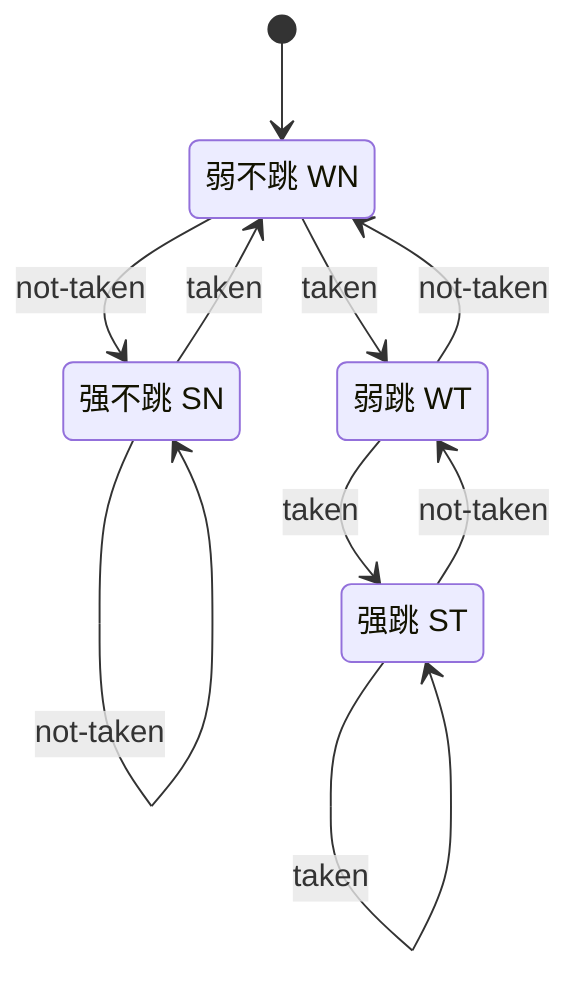
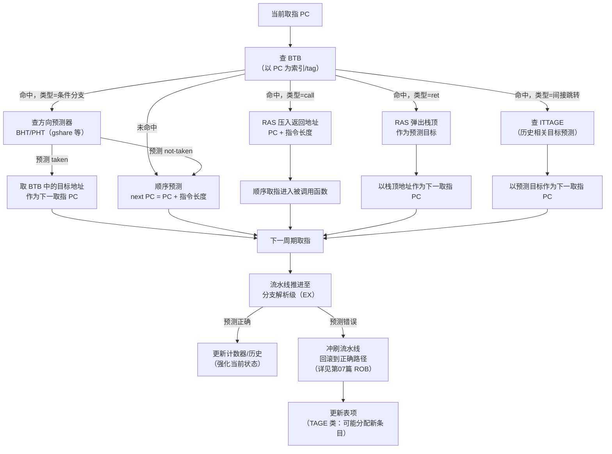
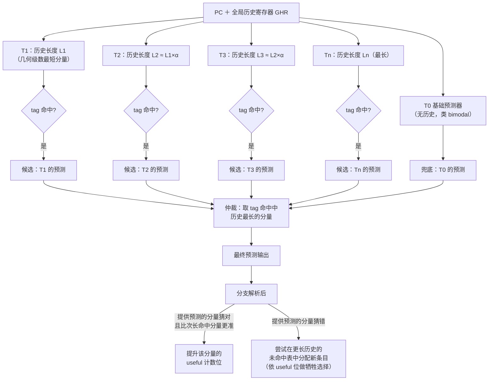
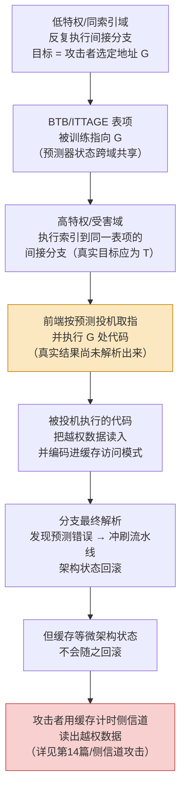

# CPU微架构与执行引擎（6）· 分支预测器演进
> [!abstract] TL;DR
> - 分支预测本质是用"空间换时间、历史换准确率"对抗控制冒险：现代深流水线下一次误预测的清空代价可达十余到二十个周期，预测精度每提升一个百分点对 IPC 的边际收益远超多数其他微架构优化。
> - 方向预测（跳不跳）与目标预测（跳到哪）是两套独立硬件：BHT/PHT 猜方向，BTB 猜地址，RAS 专门猜 `ret`；三者协同才能让前端在不等待 EX 级结果的情况下连续取指，"预测是预测的预测"。
> - 从 1-bit 历史位、2-bit 饱和计数器，到两级自适应预测（correlating predictor）、gshare、竞赛预测器（tournament），演进主线是不断挖掘"更长、更相关的历史"而不让硬件预算爆炸。
> - TAGE（TAgged GEometric history length）用多张几何递增历史长度的带 tag 预测表并行查找、取最长命中者，是当前学术与工业界公认精度最高的方向预测框架，衍生出 TAGE-SC-L、ITTAGE 等变体，几乎垄断了近十余年的 Championship Branch Prediction 竞赛榜首。
> - 间接跳转（虚函数调用、switch 跳转表、解释器 dispatch）的目标预测远比方向预测难：同一条指令在不同调用点会跳到不同目标，ITTAGE 把几何历史思想搬到目标地址预测上，这也是解释器要用 computed goto、控制流平坦化混淆会拖垮 IPC 的底层原因。
> - 分支预测器状态是跨特权域共享的微架构资源，这正是 Spectre v2（Branch Target Injection）的根源——本篇讲清预测器"为什么能被跨域训练"的机制层原理，攻击链与缓解细节留给第14、17篇。

## 概述与定位

第02篇把控制冒险列为流水线三大冒险之一，给出的基本对策是"暂停等待"；第03、04、05篇则分别用超标量多发射、Tomasulo 动态调度、寄存器重命名把"数据层面"的并行度榨到了极致——但这一切都建立在一个隐藏前提上：**前端必须持续不断地喂给后端正确的指令流**。分支指令平均每 5~7 条动态指令就出现一次，若每次都等到执行级算出跳转方向和目标地址才决定下一条取指地址，取指带宽会被切成一个个几指令宽的碎片，宽发射、乱序调度、大规模重命名寄存器堆全部无米下锅。分支预测器的使命，就是在分支真正被解析之前，**赌**出接下来的指令流该从哪里取，让前端不停顿。

这一篇是从"给定正确指令流、怎样高效执行"（04/05 的主题）向"指令流本身从哪来、错了怎么办"的视角切换。预测器产生的是一条**投机的（speculative）**指令流：它可能是错的，一旦错了，所有基于它取的指令都要作废。这个"作废并回滚"的机制是第07篇《投机执行与重排序缓冲ROB》的主题——本篇只负责"如何尽可能少犯错地猜"，07篇负责"猜错了怎么干净地收场"。两篇合起来才是完整的投机执行闭环。此外，预测器状态被证明是可以跨越特权边界训练和探测的微架构资源，这是第14篇 Spectre/Meltdown 与第17篇缓解措施的直接技术源头，本篇在"安全性与正确使用"一节交代机制根源，不重复展开攻击链细节。

## 原理与机制

### 控制冒险：流水线为什么"怕"分支

流水线级数越深、发射宽度越大，一次误预测需要冲刷（squash）的"在途"指令就越多。一条分支指令从取指（IF）到在执行级（EX）确认真实方向和目标，中间隔着译码、重命名、发射等若干级；这段时间内前端已经按预测方向连续取了好几拍的后续指令，它们已经进入乱序窗口、可能已经开始执行。一旦确认猜错，这些指令的架构状态改变必须全部作废，流水线从正确路径重新取指——这就是**误预测代价（misprediction penalty）**，现代高性能 x86 核心的量级普遍在十余到二十个周期（具体数值随微架构、误预测在哪一级被发现而不同）。用一张时序示意说明"猜对不停顿、猜错整体冲刷"的差别：

```text
理想情况（预测正确，流水线不停顿）：
cycle:      1    2    3    4    5    6
分支 I :    IF   ID   EX   MEM  WB
I+1    :         IF   ID   EX   MEM  WB
I+2    :              IF   ID   EX   MEM  WB
                       ↑
                  EX 级确认方向与目标，与预测一致，不冲刷

误预测情况（EX 级才发现猜错）：
cycle:      1    2    3    4    5    6    7    8
分支 I :    IF   ID   EX   MEM  WB
猜测 I+1:        IF   ID   EX* ←  此周期发现预测错误
猜测 I+2:             IF   ID   ✗ ←  与 I+1 一起被冲刷，架构状态不受影响
正确 I+1':                      IF   ID   EX   MEM  WB  ←  从正确目标重新取指
```

用公式量化这份代价：`CPI 惩罚 ≈ 分支频率 × 误预测率 × 误预测代价(周期)`。设分支占动态指令 18%、误预测率 4%、误预测代价 16 周期，则每条指令平均因误预测多付出约 `0.18 × 0.04 × 16 ≈ 0.115` 个周期的 CPI——对于目标 CPI 在 0.3~0.5 量级的高端乱序核心，这已是不可忽视的比例，也解释了为什么芯片厂商愿意为预测器投入数以万计晶体管的存储预算：**预测精度每提升一个百分点，换来的 IPC 收益通常远超同等面积投在别处**。

### 预测器要回答的三类问题

分支预测其实是三个正交子问题的合称，现代 CPU 用三套独立硬件分别应对：

| 结构 | 回答的问题 | 索引依据 | 典型代表 |
|---|---|---|---|
| BHT / PHT（方向预测器） | 这条分支跳不跳（taken / not-taken） | PC，常与历史寄存器组合 | 2-bit 计数器表、gshare、TAGE |
| BTB（分支目标缓冲） | 如果跳，跳到哪个地址 | PC（当作一个小型 cache 来查） | 直接映射/组相联目标地址表 |
| RAS（返回地址栈） | `ret` 该弹回哪里 | 硬件 LIFO 栈，与 `call` 配对 | 深度 16~32 级的专用栈 |

方向预测解决"分支指令本身"的不确定性；目标预测解决"跳转地址不能简单用 PC+偏移量算出"的问题（这对无条件跳转、`call`、间接跳转尤其关键）；返回地址预测则是目标预测里的一个特例，但因为 `call`/`ret` 严格配对成 LIFO 关系，值得单独用一个栈结构解决，而不是塞进通用 BTB 里稀释命中率。

### 从 1 位到 2 位：饱和计数器与滞后设计

最早的动态预测器只给每条分支保留 **1 个历史位**：记录上次的方向，这次原样预测。它在规则的顺序型热点循环里表现尚可，但对**嵌套循环边界**极不友好：外层循环每次进入内层循环时，内层循环的最后一次迭代（不跳）会把这一位翻转，下次外层循环再次进入内层循环的第一次迭代（跳）又会翻转回来——每次嵌套都在循环入口和出口各错一次，误预测次数正比于外层循环的迭代次数。

Smith 在 1981 年提出用 **2-bit 饱和计数器**取代 1 位历史，把"这次的结果"和"稳定的倾向"解耦成滞后关系：四个状态（强不跳、弱不跳、弱跳、强跳）构成一个有"惯性"的状态机，单次反常结果只把状态从"强"推到"弱"，不会立刻翻转预测方向；只有连续两次同向的反常结果才会真正改变预测。这样一次性的边界异常不再传播成两次误预测，只在真正稳定改变行为倾向时才跟着改变预测——这正是"2 位优于 1 位"的核心设计动机，也是此后几乎所有预测器计数单元的标准配件。



> [!note] 初始状态与真实实现的差异
> 上图以"弱不跳"为初始态仅为示例；真实实现的复位状态、计数器位宽（部分设计用 3 位以获得更强滞后）、以及是否额外附带独立的"有效位"来区分"从未训练过"与"训练为弱倾向"，都因具体微架构而异。理解状态机的滞后思想比记住某一款芯片的具体编码更重要。

### BHT：方向预测表的组织与别名问题

把 2-bit 计数器组织成一张表——**分支历史表（Branch History Table，BHT）**，也常被称为模式历史表（Pattern History Table，PHT），以 PC 的低位做索引直接映射查找。这是所有动态预测器的地基，但它天生带着一个无法回避的矛盾：程序里的分支数量远超表项数量（一张几千项的表要覆盖成千上万条静态分支指令），必然有多条不同的分支被哈希（通常就是取 PC 低几位）到同一表项，彼此的训练结果互相覆盖——这就是**别名/混叠（aliasing）**，具体表现为一条分支的预测精度被另一条毫不相关、只是恰好共享表项的分支"污染"。表越大别名越少，但存储预算永远有限，这是贯穿本篇所有结构设计的核心张力：**用有限的硬件预算，覆盖近乎无限的"PC × 历史"组合空间**，后文的两级自适应预测、gshare、TAGE 本质上都是在跟这个张力做斗争。

### BTB：目标地址的缓存化

方向预测器只回答"跳不跳"，回答"跳到哪"要靠**分支目标缓冲（Branch Target Buffer，BTB）**。BTB 本质上就是一个小型 cache：以 PC 做 tag/index 查找，命中则给出上次记录的目标地址与分支类型（条件/无条件/call/ret/间接），未命中则前端只能假设顺序取指（PC+指令长度），直到译码甚至执行阶段才会发现这其实是一条跳转指令，中间产生的气泡（bubble）虽然比误预测代价小，但同样蚕食取指带宽。这解释了为什么现代高性能前端会做**多级 BTB**：一级容量小（几十到上百项）但只需一个周期就能出结果，命中即可全速取指；二级容量大（数千到数万项）但延迟稍高，只在与一级结果不一致时触发一次代价较小的"重定向"（overriding），而不是等到真正执行级才发现错误——这是用一次小气泡换取整体命中率与延迟的折中，本质上和"内存里加一层 L1/L2 cache"是同一种设计哲学的复用（呼应 [[21.Asm/39 缓存与缓存一致性]] 里缓存层级的取舍逻辑，也是第09篇《缓存层级与替换策略》会展开的同一套思想在前端的变体）。

### RAS：为 call/ret 量身定制的硬件栈

`ret` 形式上也是一条间接跳转（从栈上弹出返回地址跳过去），但它有一个通用 BTB 无法利用的强约束：`call`/`ret` 严格配对成后进先出关系。与其让 `ret` 挤占通用间接跳转预测器的表项（一个函数如果被多处调用，它的 `ret` 指令在 BTB 里对应的"最近一次目标"会在不同调用点之间反复颠簸，命中率极低），不如直接用一个硬件栈镜像这层调用关系：**返回地址栈（Return Address Stack，RAS）**在 `call` 执行（更准确地说，是被前端预测为 `call` 时）把返回地址压栈，在 `ret` 被预测时弹栈顶作为目标地址。只要调用深度不超过 RAS 的物理深度（通常在 16~32 级量级，因微架构而异），这个结构几乎能做到对 `ret` 的完美预测，代价仅是深度受限的一个小栈，远比把 `ret` 塞进通用间接跳转预测器划算。深递归、协程栈切换、以及后文安全一节要讲的 RSB 下溢/投毒问题，根源都在于这个栈的深度和一致性假设被打破。

### 前端时序：预测是"预测的预测"

BHT/BTB/RAS 三者协同的关键在于时序：它们必须在**取指阶段**、也就是分支指令本身还没被译码识别出"这是一条分支"之前，就已经用上一周期的 PC 查完表、给出下一周期的取指地址。换句话说，取指阶段用来查预测器的 PC，本身也是前一周期预测器给出的结果——"预测是预测的预测"，一旦某一级出错，后续所有依赖它的取指都建立在错误的地基上，直到真正的执行结果把链条纠正回来。下图给出一次完整的前端预测/更新回路：



## 预测器结构与算法详解

### 两级自适应预测：从局部偏好到相关性

单个 2-bit 计数器只能记住"这条分支总体上偏向跳还是不跳"，却记不住"在特定的近期模式下它会怎么做"。例如某个分支的结果和它自己最近几次迭代的结果强相关（典型如固定次数的循环边界），或者和**另一条**刚执行过的分支强相关（典型如相邻的 if 条件测试相关变量）——这类"条件相关性"是单一饱和计数器结构性地捕捉不到的，因为它对同一个 PC 永远只维护一份状态，不区分"当前处于哪种历史情境"。

Yeh 与 Patt 在 1991 年提出的**两级自适应预测（Two-Level Adaptive Predictor）**解决了这个问题：第一级是一个**历史寄存器（Branch History Register，BHR）**，记录最近 N 次分支结果的比特串；第二级是模式历史表 PHT，但索引不再只用 PC，而是把 BHR（或 BHR 与 PC 的组合）也编码进索引，让"同一个 PC，但历史模式不同"对应到 PHT 里不同的表项，各自训练各自的 2-bit 计数器。这样预测器学到的不再是"这条分支的平均倾向"，而是"这条分支在给定近期模式下的倾向"。按 BHR 是"每条分支各自维护一份局部历史"还是"全局共享一份历史"、PHT 是否按地址分组，衍生出 PAg/PAp（局部历史）、GAg/GAp（全局历史）等经典分类（Yeh-Patt 分类法），核心差异在于局部历史更擅长捕捉分支自身的周期性模式，全局历史更擅长捕捉分支间的相关性。

**gshare**（McFarling，1993）是这条路线上影响最深远的具体方案：把全局历史寄存器与 PC **异或**后再索引 PHT，而不是简单拼接截断（gselect 的做法）。异或的好处在于：对固定大小的表，异或让 (PC, 历史) 的组合更均匀地散布到全表，而不是让 PC 的高位恒定占用索引的固定区段、把表在事实上切成互不共享的小块——这直接提高了有限表容量下的利用率，是 McFarling 论文里被反复验证的经验结论，也是"gshare"这个名字里 share（共享历史索引空间）的由来。

### 竞赛/混合预测器：让预测器自己选裁判

局部历史预测器和全局历史预测器各有盲区：局部历史需要给每条分支攒足够长的自身历史才能学到周期性，表项开销大，也学不到跨分支相关性；全局历史容易捕捉跨分支相关性，但当很多互不相关的分支共享同一段全局历史上下文时，破坏性别名会更严重。与其赌唯一一种历史组织方式，不如让 CPU 自己在运行时学习"这条分支该信哪个"——这就是**竞赛预测器（tournament predictor）**的思路：额外维护一张**元预测器（meta-predictor）**表，本身也是一组 2-bit 计数器，但记录的不是分支方向，而是"最近局部预测器和全局预测器谁更准"，用这个历史结果来选择本次采信哪一路的输出。Alpha 21264 是这一思路最经典的工业落地：局部历史路径（1024 项局部历史表 + 局部预测表）与全局路径（gshare 类结构）并行给出预测，元预测器裁决，官方数据显示其在 SPEC 系列测试集上把误预测率压到了此前单一结构难以企及的水平，成为教科书级案例。

### 感知机分支预测器：线性可分的另一条路

竞赛预测器仍然只是在"两种固定长度的历史"之间二选一。Jiménez 与 Lin 在 2001 年提出了一条完全不同的路线：**感知机预测器（perceptron predictor）**。把最近 N 位历史的每一位映射成 +1（taken）/ −1（not-taken），为每条分支（或每个索引到的表项）维护一个等长的整数权重向量，预测时做**加权求和**（点积）并与阈值比较决定 taken/not-taken；训练规则很简单——预测错误、或预测正确但求和结果没有超出某个置信边界时，按"历史位与实际结果同号则增大对应权重、异号则减小"的规则更新，这是标准的线性分类器训练法则。它的核心卖点在于**存储开销随历史长度线性增长**（一条历史位对应一个权重），而不像纯查表式方案那样名义容量随历史长度指数增长——这让感知机类结构可以用可承受的硬件预算利用远比表格式方案更长的历史。代价是每次预测要做一次多操作数加法（虽可用移位加法树在一两个周期内完成），硬件延迟和面积特性与"直接查表读比特"的路线不同。据业界分析与相关专利文献，AMD 的多代产品线在方向预测器设计上采用了感知机及其变体（如哈希感知机），这被认为是 AMD 与 Intel 预测器设计哲学上一个可观察的分野方向（厂商通常不完整公开具体微架构细节，这里的描述基于公开研究与逆向分析，非官方逐位披露）。

### TAGE：带标签的几何历史长度预测器

Seznec 与 Michaud 在 2006 年提出的 **TAGE（TAgged GEometric history length）**，是迄今学术界与工业界公认精度最高的方向预测框架，此后十余年的 Championship Branch Prediction（CBP）竞赛榜首方案几乎全部建立在它之上。它要解决的问题可以直白地表述为：**不同的分支需要不同长度的历史才能被准确刻画**——有的分支只看最近两三次结果就够了，有的分支要看几十甚至上百位历史才能捕捉到真正的规律（典型如解释器主循环、复杂状态机）；单一固定长度的历史（无论 gshare 用多长）对前一类分支是浪费、对后一类分支又完全不够。

TAGE 的做法是同时维护多张预测表 `T0, T1, ..., Tn`：`T0` 是无历史的基础预测器（近似 bimodal），`T1` 到 `Tn` 各自用**几何级数递增**的历史长度索引（例如长度约为 `L(i) = L(1) × α^(i-1)`，实际实现中给出的样例序列大致是 0、几位、十几位、几十位一路到上百位），每张表的每一项除了预测计数器，还额外带一段**标签（tag）**——用另一段哈希值确认"这一项确实是当前 (PC, 这个长度的历史) 组合训练出来的"，而不是别的分支因为别名巧合命中的。查找时所有 `T1..Tn` 并行用各自的历史长度去索引、比对 tag，**取 tag 命中且历史长度最长的那一个分量的预测作为最终输出**，若全部未命中则退回 `T0`。"取最长命中者"背后的直觉是：越长、越具体的历史上下文如果确实被训练过、tag 确认无误，通常意味着越精确的相关性——这与路由表里"最长前缀匹配优先"的直觉是同一类思想的不同应用。



TAGE 真正精妙、也是最容易被简化描述忽略的部分在于它的**分配与老化策略**。每个表项除了预测计数器和 tag，还带一个小的"有用位"（usefulness 计数器，常见 1~2 位）：只有当某个分量确实提供了最终预测、且这次预测比"如果退到次长命中分量会得到的结果"更准时，它的有用位才会提升；预测出错时，分配器会尝试在历史更长、当前还没有该 (PC, 历史) 组合对应表项的那些表里"抢占"一个新条目，但只会牺牲有用位已经归零的旧条目——如果候选牺牲位置当前全部"看起来还有用"，本次分配就放弃，宁可这次不学习也不轻易踢掉尚有价值的旧知识；同时有一个全局周期性的老化机制，定期把所有有用位打折，防止某些条目因为"曾经有用过一次"就永久霸占位置而不给新模式让路。这套"证明有用才保留、定期老化腾位置"的策略，本质上是在极其有限的标签表容量下模拟一个近似 LRU/LFU 的价值判断，是 TAGE 能在真实硬件预算下逼近理论上限精度的关键工程细节，而不只是"多开几张表"这么简单。

### TAGE-SC-L：统计校正器与循环预测器

纯 TAGE 在某些模式上仍有系统性弱点：当提供最终预测的分量本身计数器只是"弱倾向"（离饱和状态较远、置信度低）时，单纯的最长匹配未必是最优选择；另外一些模式（比如某个方向的结果实际上是多个弱相关比特"投票求和"决定的）天生更适合感知机式的线性求和，而不是 TAGE 式的精确 tag 匹配。**统计校正器（Statistical Corrector）**并行跑几个开销很低、彼此独立的简单统计预测分量（各自基于不同的特征，如一段全局历史的奇偶校验、局部历史哈希、路径历史哈希等给出简单投票），当 TAGE 自身置信度低时，用这些独立信号的汇总投票去修正甚至覆盖 TAGE 的原始输出。**循环预测器（Loop Predictor）**则是另一个专用小结构：显式检测并记录"这条分支是否表现出固定的循环次数"，一旦学到稳定的迭代次数，就能在除退出边界外的所有迭代给出确定性预测，并精确在预期的最后一次迭代预测"不跳"——这类边界原本是通用历史类预测器的老大难（因为"跳"的次数天然远多于"不跳"，历史模式要攒很久才能在退出前准确切换），循环预测器用显式计数直接绕开了这个学习过程。TAGE + 统计校正器 + 循环预测器组成的 **TAGE-SC-L** 是 Seznec 在 CBP-4/CBP-5 等竞赛中的冠军方案，也是当前学术界事实上的精度标杆。

### 间接跳转预测与 ITTAGE

间接跳转（`jmp *rax`、C++ 虚函数调用、`switch`-case 编译成的跳转表、解释器字节码 dispatch）比条件分支更难预测，因为它面对的不是"跳/不跳"的二选一，而是**同一条静态指令在不同执行时刻可能落到任意多个不同目标**（多态调用点）。最朴素的 BTB 只能缓存"最近一次的目标"，遇到目标在几个值之间反复交替的调用点（虚函数多态、interpreter 主 dispatch 循环）就会持续抖动、命中率坍塌。这类问题的结构和方向预测里"需要更长、更相关历史"是同构的——只不过要预测的不是一个比特，而是一个地址。**ITTAGE（Indirect TAGE）**正是把 TAGE 的几何历史长度多表 tag 匹配思想原样搬到目标地址预测上：用不同长度的历史索引多张表，每张表存的不再是方向计数器而是候选目标地址，同样取 tag 命中中历史最长的分量作为预测目标。这是当前处理间接跳转最强的公开方案，也被认为是多款高端商用核心间接预测器的设计取向（同样受限于厂商不完整公开细节，这里的描述基于公开学术研究与业界分析）。

一个对逆向工程/编译器从业者格外有现实意义的推论：**字节码解释器的中央 dispatch 跳转，是最典型的间接跳转性能杀手**。一个朴素的 `while(1) { op = *pc++; goto *dispatch_table[op]; }` 型解释器主循环只有一条 `goto *` 指令，却要在几十上百种不同的字节码目标之间跳转，历史相关性极强但落在单一 PC 上，对 BTB/ITTAGE 都是高压力场景。这正是**direct threading**、**computed goto**（GCC/Clang 的 `&&label` 扩展）等解释器优化技术存在的底层原因之一：把单一 dispatch 点拆散成"每个 opcode handler 执行完后紧跟自己的一条 `goto *next`"，让原本集中在一条 PC 上的间接跳转分散到几十条不同 PC 上，每条各自积累自己的历史模式，大幅缓解了单点 ITTAGE/BTB 表项被过度复用而抖动的问题。

### 多级 BTB 与 overriding 设计权衡

延续"原理与机制"一节提到的多级 BTB 思想，这里给出更完整的横向对比。快速但简陋的一级结构（无论是方向预测还是目标预测）能以极低延迟跟上取指节奏，但容量小、精度有限；容量大、算法复杂（如 TAGE/ITTAGE 全套多表并行查找）的结构精度高，但天然需要更多周期才能给出结果。工业界的解法不是二选一，而是**分层**：一级结构先给出一个立即可用的猜测供下一周期取指，容量更大、更慢的二级结构在随后一两个周期内给出更准确的结果；两者一致则什么都不用做，不一致则触发一次**overriding**（用二级结果覆盖并小幅重定向前端取指），代价是一次远小于"真正误预测"的小气泡，而不是白白浪费掉快速一级结构带来的吞吐收益。这是"用一次小代价的自我纠正，避免依赖单一速度/精度折中点"的通用设计手法，读者可以把它类比成缓存层级里"先查 L1 未命中再查 L2"的思路——只不过这里两级永远都会被查，只是谁先给出可用结果的问题。

### 主流实现横向对比

> [!tip] 以下描述基于公开资料、学术论文与逆向分析，厂商通常不逐位公开真实微架构细节，数字和结构描述应理解为"量级与取向"而非精确规格。

| 厂商/平台 | 演进取向（据公开研究） | 间接跳转处理 | 备注 |
|---|---|---|---|
| Intel（P6 → 现代 Core 系列） | P6 首次引入独立 BTB；Pentium 4 强化两级历史结构；Core 2/Nehalem 起加入专用循环检测器；Sandy Bridge 之后随 μop cache 演进持续扩容 BTB；现代 Golden Cove 等被学术逆向分析认为采用 TAGE 类多历史长度结构 | 现代高端核心具备专用间接目标预测结构 | 官方 SDM 通常只描述行为语义，不披露具体表结构 |
| AMD（Zen 系列） | 公开专利与研究文献指向感知机/哈希感知机路线，Zen 3/4 持续扩大 BTB 容量与历史深度 | 独立的间接目标预测单元，随代际增强 | 与 Intel 路线呈现出可观察的设计哲学差异 |
| ARM（Cortex-A / Neoverse） | 官方优化手册强调"大容量 BTB""长历史"，具体算法未公开，学术逆向分析倾向 TAGE 类结构 | 面向虚函数密集的移动/服务端负载持续优化 | 移动端功耗预算对预测器面积/历史长度有额外约束 |
| Apple（Apple Silicon） | 宽译码前端配合大容量多级 BTB，具体细节高度保密 | 侧信道研究（如面向 Apple Silicon 前端资源的定时分析工作）间接印证其间接预测结构复杂度较高 | 逆向研究只能通过定时旁路间接推断，非官方数据 |

### 精度的量化：MPKI 与 IPC 的关系

评估预测器质量的标准指标是 **MPKI（Mispredictions Per Kilo-Instructions，每千条指令的误预测次数）**：`MPKI = 每千条指令中的分支数 × 误预测率`。历史上极简单的 1-bit/2-bit 单一 bimodal 结构在典型整数负载上的 MPKI 常在两位数量级；两级自适应/gshare/竞赛预测器一代普遍能把它压到个位数；TAGE-SC-L 级别的现代方案在学术评测集上往往能进一步压到个位数的低端甚至更低。MPKI 每降低 1，按前文的 CPI 惩罚公式，对深流水线宽发射核心的 IPC 收益是非线性放大的——这也是为什么预测器的硬件预算增长速度长期跑赢大多数其他微架构部件：**它几乎是"投机执行整个大厦"的地基精度参数**，精度每降一分，后端乱序调度、寄存器重命名、ROB 容量投入的收益都会被更频繁的冲刷按比例打折。

## 工具视角与实战

### perf 与硬件 PMU：测量分支预测质量

Linux `perf` 直接暴露了处理器 PMU 里的分支相关事件，是定位预测质量问题最直接的入口：

```bash
# 总体统计：分支总数与误预测数（据此可自行算出误预测率与 MPKI）
perf stat -e branches,branch-misses,instructions ./your_program

# 按函数/指令定位误预测热点
perf record -e branch-misses -c 1000 ./your_program
perf report
perf annotate   # 精确到具体汇编指令行
```

Intel 平台对应的具体 PMU 事件通常是 `BR_INST_RETIRED.ALL_BRANCHES`（已退休分支总数）与 `BR_MISP_RETIRED.ALL_BRANCHES`（已退休的误预测分支数），AMD 平台有对应的等价事件名；`perf list` 可以列出当前内核/CPU 支持的完整事件名集合。观察到某个函数 MPKI 异常偏高，往往意味着那里存在一个"megamorphic"间接调用点、一个数据依赖且不规律的条件分支，或者一个历史相关性超出了当前预测器历史长度覆盖范围的复杂模式。

### LBR 与 Intel PT：从预测器状态重建执行路径

Intel 的 **Last Branch Record（LBR）**是一个硬件环形缓冲区，逐条记录最近若干次（典型 16~32 条，具体量级因代际而异）分支的源地址、目标地址与是否误预测——它本质上就是分支预测器/BTB 实际工作状态的一份低开销采样。`perf record --call-graph lbr` 利用这一点做低开销的调用栈回溯采样，不需要栈展开或帧指针，代价远小于传统 `--call-graph dwarf`。**Intel PT（Processor Trace）**则是更重的机制，力图完整记录整条执行路径（而不只是最近 N 条分支），是 kAFL、syzkaller 等覆盖率制导模糊测试工具重建控制流覆盖率的底层依据。两者的关系可以概括为：LBR 是"预测器状态的轻量抽样窗口"，PT 是"面向完整执行路径重建的专用追踪硬件"，前者开销更低但只看得到最近一小段，后者开销更高但能完整还原路径——在逆向分析间接调用密集的代码（虚函数密集的 C++ 二进制、混淆后的 dispatch 循环）时，两者都是比纯静态反汇编更可靠的"实际都走了哪些分支"的证据来源。

### 编译器视角：PGO 与 likely/unlikely 如何"喂"预测器

编译器提供的 `__builtin_expect`（GCC/Clang）以及 C++20 的 `[[likely]]`/`[[unlikely]]` 属性，本质上不是直接操纵硬件预测器状态，而是影响编译器的**代码布局**：把标注为"很可能"的分支路径安排成顺序 fall-through，把"不太可能"的路径挪到远处的冷代码块，减少 I-cache 占用并让静态预测（现代 CPU 对从未训练过的分支仍会有一个默认倾向）与实际运行行为更一致。**PGO（Profile-Guided Optimization）**把这一过程自动化：先跑一遍插桩或采样版本收集真实分支频率，再据此重新编译，不仅优化分支布局，还会影响函数内联决策与代码热/冷路径分离——这与硬件预测器是互补关系而非替代关系：PGO 优化的是"预测器还没学会之前的默认表现"和"冷热代码的 cache 局部性"，硬件预测器优化的是"运行一段时间后的动态学习精度"，具体机制与实测数据参见 [[41.Compiler/05.PGO_Profile_Guided_Optimization]]。

### 逆向视角：cmov 消权、控制流平坦化与预测器的博弈

用条件传送（如 x86 的 `cmovcc`、ARM 的条件执行/`csel`）替代短小的 `if`-`else` 分支是编译器和手工优化中常见的技巧：`cmov` 无条件计算两条路径的结果再按条件选一个，彻底消除了这段代码里的分支预测/误预测代价，但代价是两条路径的计算都真实发生（可能有额外功耗、以及两条路径若涉及不同延迟操作时反而更慢），且**执行两条路径本身与数据无关**这个性质，恰好是密码学等场景做常量时间编程（constant-time programming）刻意利用的特性——避免让秘密数据决定分支走向，从根源上消除"分支预测器的训练模式可被外部观测"这一类旁路（这与 [[37.密码学/61.侧信道攻击]] 中密码实现层面的时序侧信道防护是同一思路在不同层面的呼应）。

另一个对二进制分析/反混淆从业者更直接相关的现象是**控制流平坦化（control flow flattening）**：这种混淆技术把原本清晰的多个直接分支揉进一个巨大的 `switch`/状态机 dispatch 结构，所有基本块的跳转都经过同一个中心间接跳转点。这在语义上和字节码解释器的中央 dispatch 循环是同一种结构，天然会让该间接跳转点的目标集合暴增，压垮 BTB/ITTAGE 的命中率——用 `perf stat -e branch-misses` 或 LBR 采样观察到某个孤立的间接跳转点误预测率异常畸高、且目标地址高度发散，往往就是控制流平坦化混淆存在的一个可观测旁证，可以作为定位反混淆切入点的辅助信号（不能单独作为确证依据，需结合静态结构特征交叉验证）。

## 安全性与正确使用

### 预测器状态为何能跨域共享：BTI 的机制根源

分支预测器的所有表——BHT/PHT、BTB、RAS、TAGE 各级、ITTAGE——为了在有限硬件预算下服务整个系统的所有代码，通常按 PC（有时结合特权级、地址空间标识等做部分隔离，但历史上很长一段时间、以及很多场景下隔离并不完整）索引，这意味着**不同特权级、不同进程、甚至不同虚拟机的代码，客观上可能共享同一批预测器表项**。这本是提高硬件利用率的合理设计——正如缓存要在不同代码间共享才能物尽其用——但也意味着一段低特权代码理论上可以通过反复执行特定的间接跳转模式，"训练"某个预测器表项指向攻击者选定的地址；如果受害代码后续执行的间接分支恰好索引到同一个（被污染的）表项，前端会按预测投机执行到攻击者选定的目标，在真实分支解析出结果并冲刷流水线之前，这段被投机执行的代码可能已经把不该访问的数据读入寄存器并编码进了缓存访问模式——即便架构状态最终被正确回滚，缓存这类微架构状态并不会一并回滚，从而给旁路测信道留下了窗口。这正是 **Spectre v2（Branch Target Injection，CVE-2017-5715）** 的机制根源：本篇只交代"预测器为什么能被跨域训练与利用"这一层机制原理，具体的攻击链构造、gadget 挑选与真实 PoC 细节属于第14篇《微架构侧信道：Spectre与Meltdown》的范畴，这里不再展开。



### RSB 下溢与 ret2spec

RAS（Intel 文献中常称 RSB，Return Stack Buffer）同样可能被打破一致性假设。当调用深度超过 RAS 物理容量、或者调用/返回没有严格配对（例如通过 `longjmp`、协程切换等非常规控制流跳过正常 `ret`），RAS 可能下溢（underflow）。多数实现在下溢时会退化成用通用 BTB 的记录来预测 `ret` 的目标——这就重新引入了"目标可被污染"的攻击面，学术界称之为 **ret2spec / Spectre-RSB**：攻击者故意制造 RAS 下溢或提前用可控调用序列污染 RAS/BTB 记录，诱导受害代码的 `ret` 投机跳转到攻击者选定地址。这是"为特定场景设计的专用结构（RAS）在其假设被打破时退化为通用结构（BTB），而通用结构又继承了通用结构的可训练性"这一类问题的典型样本，也是为什么现代缓解方案会格外关注**在特权级切换时刷新/隔离 RAS**。

### 缓解机制的原理层概览

以下按机制层面（而非操作指南）概述几类缓解手段做什么、为什么有效，具体部署方式与性能开销权衡留给第17篇《微码与CPU漏洞缓解》：

| 机制 | 作用层面 | 原理 |
|---|---|---|
| Retpoline | 纯软件、编译期改写间接跳转 | 把间接跳转替换成一段受控的"跳进一个无限循环陷阱"再由 `ret` 完成真正跳转的序列，让投机执行即使被误导也只会落入不产生可观察副作用的陷阱，而不依赖对预测器硬件本身打补丁 |
| IBRS（Indirect Branch Restricted Speculation） | 硬件/微码，运行时可配置 | 限制间接分支预测器的结果在特权级切换后被更低特权级代码复用/污染，本质是给预测器状态加一层特权域边界 |
| STIBP（Single Thread Indirect Branch Predictors） | 硬件/微码，SMT 场景 | 限制同一物理核心的两个逻辑线程之间共享/影响间接分支预测器状态，呼应第13篇 SMT 资源共享的隔离问题 |
| IBPB（Indirect Branch Predictor Barrier） | 硬件/微码，显式屏障指令 | 在关键切换点（如上下文切换）显式清空间接分支预测器已学到的状态，代价是清空后要重新"热身" |
| eIBRS（Enhanced IBRS） | 硬件层面的持续隔离 | 把 IBRS 从"需要软件频繁显式设置"的开销模型，改造成硬件持续维护域隔离，降低纯软件方案反复触发屏障的性能损耗 |

这些机制的共性是：**都在给"预测器状态可以自由跨域共享"这一原本为了提高硬件利用率的设计加边界**，边界越严格，硬件复用率越低，预测器"热身"越频繁，MPKI 就越容易反弹——这正是为什么这些安全补丁几乎总是伴随着可观的性能损耗：它们在直接对抗预测器赖以高效的共享假设。理解这层因果关系，才能理解为什么"开不开某个缓解开关"在实践中是一个需要结合威胁模型权衡的工程决策，而不是非黑即白的选择。

### 正确使用与加固边界

对系统/内核工程师而言，正确的姿势是：保持微码与操作系统更新（缓解逻辑的绝大部分正确性依赖两者协同，任一缺失都可能导致缓解形同虚设）；在虚拟化/多租户场景下确认 hypervisor 在 VM 切换点做了必要的预测器状态隔离或清空；不要仅凭"开了某个 CPU 特性位"就假设完全免疫，缓解措施普遍存在粒度与残余风险（例如 IBT 只保证间接跳转落点合法但不保证语义正确，本篇第三节提到的多表几何历史结构本身也不是为对抗攻击设计的，安全边界需要专门的缓解层去后补——这与 [[34.现代二进制防护机制/09.Intel CET]] 里 IBT 前向 CFI 面对的"合法落点集合过粗"问题在思路上是同构的：IBT 用安全视角回答"这个间接跳转允许落到哪"，ITTAGE 用性能视角回答"这个间接跳转大概率落到哪"，两者都要处理间接跳转目标不唯一这个共同的硬问题，只是目标函数完全相反）。对应用/密码实现工程师而言，正确的姿势是识别并避免"秘密数据直接决定分支走向"的写法，改用常量时间的算术/`cmov`/掩码技术；对性能工程师而言，正确的姿势是善用 PGO 与 likely/unlikely 标注去帮助预测器的冷启动阶段，而不是试图猜测或依赖具体某代硬件的私有实现细节做微架构相关的优化——那些细节既不公开也可能随下一代芯片彻底改变。

## 小结

- 分支预测把控制冒险从"必须暂停等待"变成"投机猜测、错了再回滚"，是超标量、深流水线、乱序执行整套投机执行大厦得以成立的地基；预测精度的边际收益在深流水线宽发射核心上被放大得尤为明显。
- 方向（BHT/PHT）、目标（BTB）、返回地址（RAS）是三套分工明确又协同工作的硬件，"预测是预测的预测"的时序特性决定了它们必须在取指阶段就抢先给出结果。
- 演进主线是"挖掘更长、更相关的历史，同时不让硬件预算爆炸"：2-bit 饱和计数器解决滞后问题，两级自适应/gshare 引入历史相关性，竞赛/感知机预测器扩展历史组织方式，TAGE 用几何递增的多表 tag 匹配把"不同分支需要不同历史长度"这一核心矛盾系统化解决，TAGE-SC-L/ITTAGE 是当前公认的精度天花板。
- 间接跳转预测是比方向预测更难的目标地址预测问题，ITTAGE 是 TAGE 思想的自然延伸；解释器 dispatch、虚函数多态调用、控制流平坦化混淆都是"单 PC 多目标"这一共同结构在不同领域的具体投影，也是逆向分析中可观测的性能旁证来源。
- 预测器状态天然跨域共享是 Spectre v2 的机制根源，各类缓解手段本质上都是在这份共享性上强行划边界，性能损耗与安全收益的权衡是理解补丁部署决策的关键框架，具体攻击链见第14篇、缓解部署见第17篇。
- 常见陷阱：嵌套循环边界对 1-bit 预测器的双重惩罚、有限表容量下不可避免的别名干扰、RAS 深度耗尽后退化为通用 BTB 预测带来的新攻击面、以及"厂商不公开细节，逆向结论应始终带着不确定性表述"的研究伦理边界。

## 相关阅读

- [[00.CPU微架构与执行引擎总览]] · 系列总览
- [[04.乱序执行与Tomasulo算法]] · 误预测冲刷与动态调度窗口的交互
- [[07.投机执行与重排序缓冲ROB]] · 下一章：预测错误后如何干净回滚
- [[09.缓存层级与替换策略]] · BTB 作为"小型 cache"的组织哲学同源
- [[14.微架构侧信道：Spectre与Meltdown]] · Spectre v2/BTI 完整攻击链
- [[17.微码与CPU漏洞缓解]] · IBRS/STIBP/IBPB/eIBRS 的部署与开销
- [[21.Asm/39 缓存与缓存一致性]] · 缓存层级设计思想的汇编层呼应
- [[37.密码学/61.侧信道攻击]] · 常量时间编程与预测器训练模式旁路的呼应
- [[34.现代二进制防护机制/09.Intel CET]] · IBT 前向 CFI 与 ITTAGE 对"间接跳转目标不唯一"问题的正反两面
- [[41.Compiler/05.PGO_Profile_Guided_Optimization]] · PGO 如何用运行时profile反哺分支布局
- 论文/书目参考（非本库链接）：Smith, *A Study of Branch Prediction Strategies* (1981)；Yeh & Patt, *Two-Level Adaptive Training Branch Prediction* (1991)；McFarling, *Combining Branch Predictors* (1993)；Jiménez & Lin, *Dynamic Branch Prediction with Perceptrons* (2001)；Seznec & Michaud, *A Case for (Partially) Tagged Geometric History Length Branch Prediction* (2006)；Kocher et al., *Spectre Attacks: Exploiting Speculative Execution* (2019)；Hennessy & Patterson, *Computer Architecture: A Quantitative Approach*（分支预测章节）

[[00.CPU微架构与执行引擎总览|⬆ 系列总览]] | [[05.寄存器重命名与物理寄存器堆|← 上一章]] | [[07.投机执行与重排序缓冲ROB|→ 下一章]]
