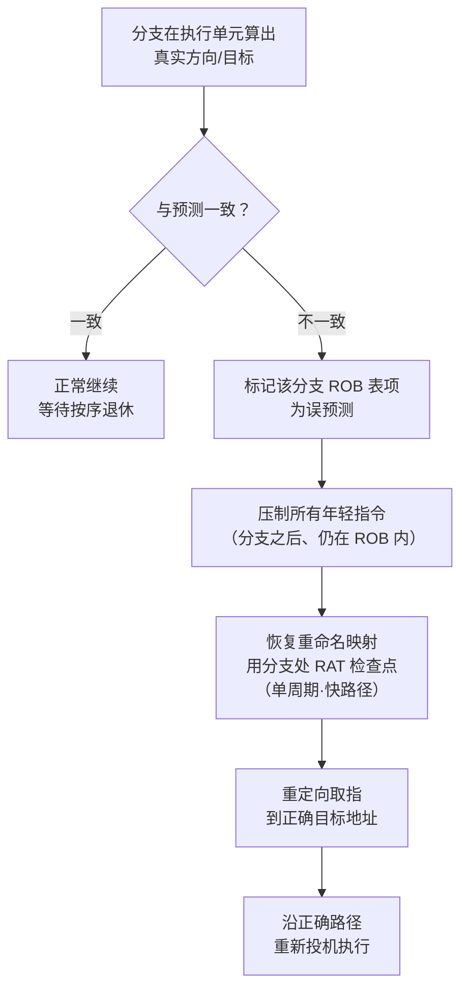
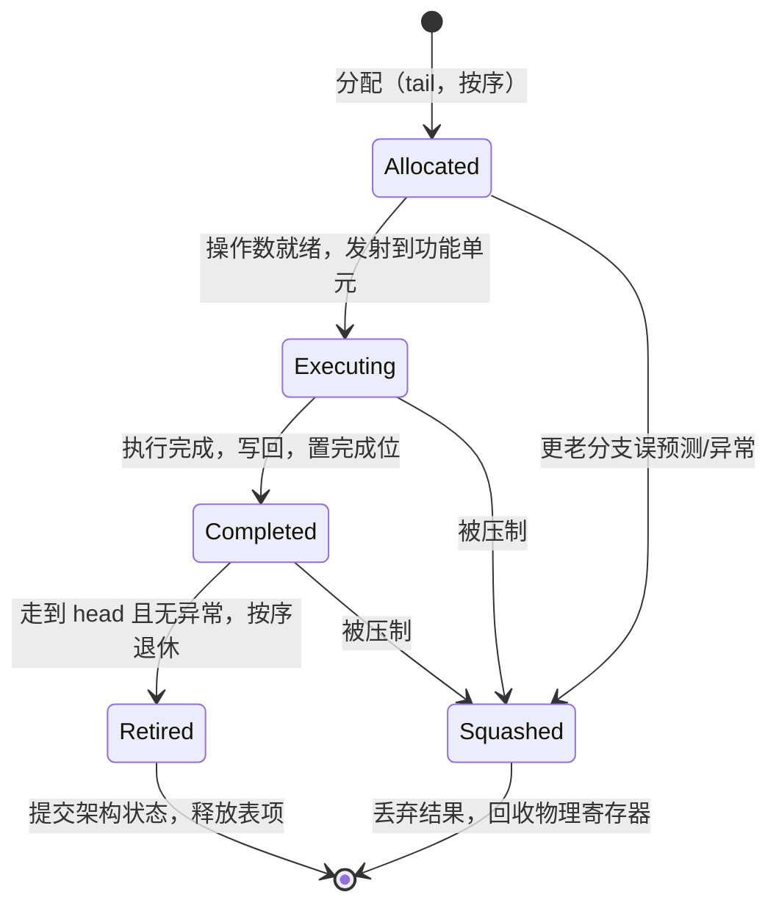
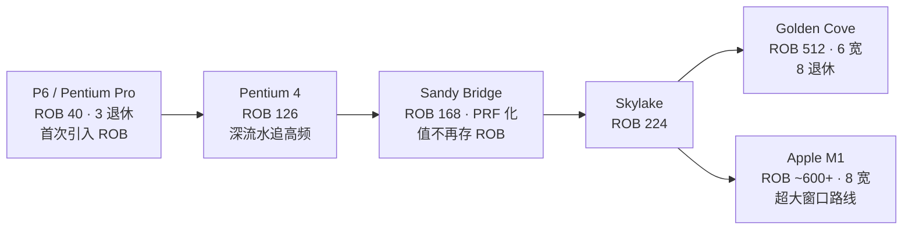

# CPU微架构与执行引擎（7）· 投机执行与重排序缓冲ROB
> [!abstract] TL;DR
> - 乱序执行让指令**乱序完成**，而重排序缓冲（ROB, Reorder Buffer）强制它们**按程序序退休**：一个环形 FIFO 把"执行完成"与"架构可见"两件事解耦，于是能同时拿到乱序的性能和顺序的语义。
> - 按序退休是**精确异常/中断**的地基——异常信息挂在 ROB 表项上，只在该指令走到队头、真正退休那一刻才抛出，保证被打断时架构状态恰好是程序执行流的一个干净"前缀"。
> - 投机执行的本质是"先斩后奏"：沿预测路径先跑，结果暂存在 ROB / 物理寄存器里不提交；一旦预测被推翻，就**压制（squash）**分支之后的所有年轻指令并恢复重命名映射，架构上如同什么都没发生。
> - 错误投机回滚有快慢两条路：分支误预测在**执行阶段**用 RAT **检查点（checkpoint）**单周期恢复；异常在**退休阶段**用**退休态 RAT** 慢速恢复——因为它罕见且天然精确，无需为每条指令留快照。
> - ROB 完美回滚**架构状态**，却从不回滚**微架构状态**（cache/TLB/预测器痕迹）——这道设计裂缝正是 Spectre / Meltdown 一类瞬态执行漏洞的物理根源。
> - ROB 容量 = 乱序窗口大小：从 Pentium Pro 的 40 项一路涨到 Golden Cove 的 512 项、Apple M1 的六百余项，是隐藏内存延迟、榨取指令级并行（ILP）的核心资源，也是最常见的后端瓶颈。

## 概述与定位

前面几篇已经把乱序执行的"发动机"逐块装好：[[04.乱序执行与Tomasulo算法|Tomasulo 算法与保留站]]让指令谁的操作数先就绪谁先算，[[05.寄存器重命名与物理寄存器堆|寄存器重命名]]消除了假相关（WAR/WAW），[[06.分支预测器演进|分支预测]]则让取指不必等分支解析。这些机制共同的效果是：一条 cache miss 不再堵死它后面所有指令，独立的工作可以绕过阻塞点抢先完成。

但抢跑带来一个尖锐的矛盾。**指令完成的顺序被彻底打乱了**，而软件——尤其是操作系统的异常与中断处理——却依赖一个古老的假象：程序是一条接一条、严格按顺序执行的。当第 100 条指令触发缺页异常时，内核期望看到的现场是"前 99 条全部生效、第 100 条及其之后一条都没生效"。可在乱序引擎内部，第 101、第 105 条很可能早就算完、结果都写好了。如果放任它们把结果落地，异常现场就"脏"了，操作系统无法正确处理缺页、无法可靠地保存/恢复上下文，程序语义就崩了。

**重排序缓冲（ROB）就是弥合这道裂缝的部件。**它是一个按程序序在尾部分配、按程序序从头部释放的环形队列。指令乱序执行的结果先记在它名下（或写进物理寄存器、由它记账），只有当一条指令走到队头、且它之前的所有指令都已确认无误，它才"退休"（retire / commit / graduate），把结果正式提交为架构状态。这样一来，**架构状态的推进永远是严格顺序的，乱序只发生在幕后**。ROB 就像一个严格的出纳：车间里工人（功能单元）可以乱序把零件做完，但入库单必须按订单编号一张一张地签，签到哪张，账面（架构状态）就只认到哪张。

投机执行是这套机制的自然延伸。既然有了一个能整体撤销的缓冲区，CPU 就敢沿着分支预测的路径大胆往前跑，把还没被证实"该不该执行"的指令也塞进 ROB。赌对了，这些指令照常退休，性能白赚；赌错了，把它们从 ROB 里一笔勾销即可。**ROB 既是"按序退休"的执行者，也是"错误投机可回滚"的物质基础**——没有它，投机执行就成了无法收拾的野马。

本篇的定位很清晰：它承接 04/05/06，讲乱序引擎的"收尾与兜底"——如何把乱序算出的结果安全、精确地落地，以及赌错时如何干净地擦除。Load/Store 之间的顺序与内存消歧留给 [[08.存储子系统：Load-Store队列|下一篇]]，把投机当武器的 Spectre/Meltdown 攻防留给 [[14.微架构侧信道：Spectre与Meltdown|第14篇]]。本篇聚焦三件事：**ROB 结构、按序退休、错误投机回滚**。

历史坐标也值得一提：精确中断（precise interrupts）问题由 Smith 与 Pleszkun 在 1985 年系统化，ROB 是他们给出的三种经典解法之一。而 Tomasulo 1967 年的原始算法（用于 IBM System/360 Model 91 的浮点单元）恰恰**没有**精确异常——它只顾把浮点流水跑满，异常是"不精确"的，出错时根本说不清停在哪。ROB 正是后来把"乱序性能"和"精确异常"这两件曾经不可兼得的事缝合到一起的关键发明。

## 原理与机制

现代乱序核心可以抽象成一个"两头按序、中间乱序"的三阶段模型。理解了这三阶段，ROB 的作用就一目了然。

**阶段一：分派 / 分配（Dispatch / Allocate）——按序。**前端取指、译码后，按程序序在 ROB 尾部（tail）为每条指令分配一个表项；在 PRF 设计下同时分配一个物理寄存器作为它的目标，并更新重命名表（RAT）。这一步是严格顺序的：谁在程序里靠前，谁的 ROB 表项就靠前。这一步也是把"程序序"这个信息**烙进硬件**的地方——ROB 里的表项相对位置，就是全部的顺序真相。

**阶段二：发射与执行（Issue / Execute）——乱序。**指令进入调度器（保留站/发射队列），一旦其源操作数全部就绪，就被选中发射到某个功能单元执行。执行完成后，把结果写回（物理寄存器或 ROB 表项），并置该指令 ROB 表项的"完成位（done/complete）"。**这一步完全乱序**：后面的指令可能先算完，长延迟指令（cache miss、除法）则可能拖很久。ROB 表项此时只是一个"占着位置、等着被确认"的记账条目。

**阶段三：退休 / 提交（Retire / Commit）——按序。**退休逻辑只盯着 ROB 头部（head）。若队头指令的完成位已置且无异常，就把它的效果提交为架构状态，然后释放表项、head 前移，接着看下一条。一个周期可以退休若干条连续的、都已完成的指令（退休宽度，retire width）。**这一步又是严格顺序的**——这正是把乱序"收束"回顺序语义的地方。

```
ROB 环形缓冲区（示意，PRF-based）

                分配(allocate)在 tail →
   ┌────┬────┬────┬────┬────┬────┬────┬────┐
   │ i0 │ i1 │ i2 │ i3 │ i4 │    │    │    │
   └────┴────┴────┴────┴────┴────┴────┴────┘
     ↑head(最老)              ↑tail(下一空位)
     └ 退休(retire)从 head 按序弹出

分配在 tail、退休在 head，二者都按程序序移动；
中间"谁先执行完"完全乱序。当 tail 追上 head 即 ROB 满，
分配停顿 → 前端堵塞 → 常见的后端瓶颈。
```

**ROB 表项里装什么。**这是理解退休和回滚的关键。以主流的 PRF 设计为例，一个表项大致包含：占用位、完成位、目标架构寄存器号（如 RAX=0）、本指令新分配的物理寄存器号、**被本指令覆盖的那个旧物理寄存器号**（退休时要把它归还空闲链表）、异常/故障状态位、指令地址 PC（精确异常定位用）、以及"是不是分支/是不是 store"等类型标志。ROB-based 设计（见下一节）还会直接在表项里存**结果数值**。

**退休时到底做了什么。**这一步的动作决定了架构状态如何精确推进：其一，更新架构可见的寄存器状态——ROB-based 把结果值从 ROB 拷进架构寄存器堆，PRF-based 则只需把"旧物理寄存器"还给空闲链表，并把新映射写入退休态 RAT；其二，把 store 从"投机"升级为"senior store"，此刻才允许它把数据 drain 进 cache（细节见 08，这是"投机不能改内存"的关键闸门）；其三，用真实结果去更新分支预测器等预测结构的训练状态；其四，若表项带着异常，此刻才**抛出精确异常**。

**投机的种类。**广义的投机不止分支一种：**控制投机**（分支预测，最主要，本篇重点）；**内存依赖投机**（load 越过一个地址尚未算出的旧 store，赌它们不冲突，见 08）；**值投机**（预测某个数值，商用 CPU 罕见）。它们共享同一套"ROB 隔离 + 错了就压制"的回滚底座。

**精确异常为什么必须按序退休。**异常不在执行阶段立刻抛，而是先**记在 ROB 表项里**，随指令流一路漂到队头；到退休点才抛。此刻它之前的指令已全部退休（架构状态 = 故障点之前的精确前缀），它之后的指令还都困在 ROB 里、一条都没退休，可以直接整体压制。于是操作系统看到的现场天然精确。**"按序退休"既是精确异常的充分条件，也是必要条件**——只要退休是顺序的，任何退休点上的架构状态都必然是程序的一个合法前缀。

## 结构与算法详解

这一节深入 ROB 的两种实现流派、错误投机回滚的具体算法，以及"为什么分支和异常要用两套不同的恢复路径"这个最见功力的设计取舍。

### 两种流派：ROB-based 与 PRF-based

历史上把投机结果"存在哪"有两条路线，直接决定了退休和回滚的复杂度。

**ROB-based（P6 / Pentium Pro 路线）：结果值直接存进 ROB 表项，ROB 兼当"重命名寄存器堆"。**每个架构寄存器的 RAT 表项要么指向"架构寄存器堆"（该寄存器的已提交值），要么指向"某个 ROB 表项"（还在飞的投机值）。退休时把值从 ROB 搬进架构寄存器堆。优点是**回滚极其简单**：架构寄存器堆天然只含已提交状态，丢弃 ROB 表项就等于抹掉一切投机，无需额外恢复。缺点是值要存两份、退休要做数据搬移、读操作数时要在"从 ROB 读"和"从架构堆读"之间多路选择，布线与功耗都重。

**PRF-based（MIPS R10000 / Pentium 4 / Sandy Bridge 起）：一个统一的物理寄存器堆同时存投机值和已提交值，ROB 只存元数据（映射关系），不存值。**退休时不搬任何数据，只是把"被覆盖的旧物理寄存器"释放回空闲链表。优点是值只存一份、零数据搬移、读端口统一、更省功耗，适合把 ROB 和寄存器堆都做大。代价是回滚要**主动恢复 RAT 映射**、要管理物理寄存器空闲链表。现代高性能核心几乎清一色 PRF-based。这套物理寄存器堆的机制在 [[05.寄存器重命名与物理寄存器堆|第5篇]]详述，本篇只强调它与 ROB 的分工：**PRF 存值，ROB 管序**。

### 状态恢复三法（Smith–Pleszkun 谱系）

Smith & Pleszkun 1985 给出的三种精确异常方案，本质是"何时更新架构状态、如何撤销"的三种权衡，至今仍是所有恢复机制的祖先：

1. **重排序缓冲法（Reorder Buffer）**：更新推迟到退休，投机结果隔离在 ROB / 物理寄存器里，回滚 = 丢弃。正常路径要"晚提交"，但撤销干净。今天几乎所有 CPU 走这条。
2. **历史缓冲法（History Buffer）**：立刻更新架构寄存器堆（不等退休），但把每次覆盖的**旧值**记进历史缓冲；回滚时逆序把旧值倒灌回去。正常路径快（直接写架构堆），但撤销要逐条"倒带"，异常恢复慢。
3. **未来文件法（Future File）**：两套寄存器堆——"未来堆"给前端投机用、"架构堆"存已提交值，ROB 负责协调二者在退休点同步。现代 PRF 设计可以看作 future file 与 ROB 的融合变体。

### 错误投机回滚：分支与异常的快慢两条路

这是本篇最见微架构智慧的地方。同样是"压制年轻指令、恢复重命名映射、重定向取指"，**分支误预测和异常走的是完全不同的两条恢复路径**，原因只有一个字：频率。

**分支误预测——快路径（检查点）。**误预测是在**执行阶段**发现的：分支单元算出真实方向/目标，与预测一比对，不符即误预测。此刻这条分支可能还远没走到退休（前面堵着一堆没算完的老指令）。关键在于**误预测很频繁**——平均每几十条指令就来一次，恢复慢一拍就是巨大的性能损失。所以做法是：在**重命名一条分支时，就给它拍一张 RAT 快照（checkpoint）**存起来。一旦该分支被判误预测，直接用它的快照**单周期**恢复前端 speculative RAT，压制其后所有年轻指令，重定向取指到正确目标。代价是检查点数量有限（比如支持 16 个在飞分支同时有快照），用光了就得停止继续投机，或退化到下面的慢速遍历法。

**异常/中断——慢路径（退休态 RAT）。**异常是在**退休阶段**才抛的（因为要精确，见上一节）。而异常/中断本身**很罕见**，恢复慢一点完全无所谓。所以根本不必给每条"可能出异常"的指令都留检查点——那太奢侈。做法是：直接拿**退休态 RAT（retirement RAT）**来恢复。因为故障指令走到退休那一刻，退休态 RAT 恰好等于"故障点之前的架构映射"；而故障点之后的指令全是尚未退休的年轻指令，整个 ROB 一压制即可。于是异常恢复"免费"地拿到了精确的架构状态。

**两张 RAT 的意义。**前端在重命名时更新 **speculative RAT**（含投机映射，可能是错的），退休时更新 **retirement RAT**（只含已提交映射，永远正确）。retirement RAT 的存在，本身就是为了让异常恢复能零成本地取到精确架构映射——它是"架构状态的镜像"。

**检查点耗尽的兜底：ROB 遍历回退（walk）。**当在飞分支太多、检查点不够分时，可以放弃快照，改用遍历：从 ROB 的 tail 朝目标分支方向逐项遍历，对每一项用它存的"旧物理寄存器号"字段**逐条撤销**它对 RAT 造成的映射改变。慢（要走很多拍），但省下了检查点的存储。真实设计常是"少量快照 + 遍历兜底"的组合。



### 指令与 ROB 表项的生命周期

把上面所有阶段串起来，一条指令在 ROB 里的一生就是下面这张状态机。注意"被压制（Squashed）"这条边可以从任何未退休状态发生——这正是投机可回滚的体现：**只要还没退休，就还能被整体抹掉**。



### ROB 容量演进：为什么越做越大

ROB 有多少表项，就意味着乱序窗口里最多能同时容纳多少条"在飞"指令，直接决定了 CPU 能往一条 cache miss 后面塞多少独立工作来隐藏延迟。下表是主流微架构的 ROB 大致容量（表项数）：

```
Intel:
  Pentium Pro / P6 ......  40
  Pentium 4 (NetBurst) ... 126
  Core 2 ................. 96
  Nehalem ............... 128
  Sandy Bridge .......... 168
  Haswell ............... 192
  Skylake ............... 224
  Sunny Cove (Ice Lake) . 352
  Golden Cove (Alder Lk). 512

AMD:
  Zen ................... 192
  Zen 2 ................. 224
  Zen 3 ................. 256
  Zen 4 ................. 320
  Zen 5 ................. 448

Apple:
  M1 (Firestorm) ........ 约 600+（超大乱序窗口）
```

**为什么敢一路加大？**内存延迟是"墙"：一次 LLC miss 到 DRAM 动辄上百个周期。要在这么长的等待里不空转，就得有足够多的独立指令在 ROB 里排队执行——ROB 越大，能隐藏的延迟越长，暴露的 ILP 越多。**但 ROB 不能孤立地变大。**它必须和物理寄存器数、调度器/保留站容量、Load/Store 队列深度**协同放大**：任何一个更小的资源都会先成为瓶颈，形成木桶效应（比如 ROB 有 512 项，但物理寄存器只够覆盖 300 条在飞指令，那实际窗口就卡在 300）。此外，ROB 变大还要付出面积、功耗，以及"回滚时要清更多表项、唤醒/选择逻辑规模更大"的代价。Apple M1 用超大 ROB 配超宽（8 发射/8 退休）前端，正是"以极大乱序窗口换 IPC"的极致路线；而追求高频的设计（如当年 NetBurst）则受制于大结构难以跑高频而有所取舍。



## 工具视角与实战

ROB 是看不见摸不着的内部结构，但它的"满"会实实在在地拖慢程序，而且可以被精确测量和反推。这一节讲怎么观测它、怎么逆向它的容量。

**用 PMU 事件抓 ROB 满停顿。**Intel 处理器提供一系列 `RESOURCE_STALLS.*` 事件，其中 `RESOURCE_STALLS.ROB` 统计"因 ROB 已满而无法分配"的停顿周期，`RESOURCE_STALLS.RS` 统计保留站满，`RESOURCE_STALLS.SB` 统计 store buffer 满。在 Top-down 微架构分析法里，ROB 满属于 **Backend Bound → Core/Memory Bound** 的典型症状。示意用法：

```bash
# 观测 ROB 满导致的分配停顿（事件名随微架构略有差异）
perf stat -e cycles,instructions \
  -e cpu/event=0xa2,umask=0x10,name=RESOURCE_STALLS_ROB/ \
  ./your_program

# 用 Top-down 分层定位后端瓶颈（需要 toplev / VTune）
toplev.py -l3 --no-desc -- ./your_program
```

**逆向 ROB 容量：Henry Wong 的经典测量法。**这是从软件侧"隔空"测出微架构结构大小的漂亮手法，值得每个做性能/逆向的人掌握。核心思路：用一条**长延迟 load**（指针追逐链，保证每次都 cache miss、延迟稳定上百周期）当"堵头"，在它后面塞 N 条**互相独立、也不依赖该 load 结果**的填充指令；然后紧跟第二条同样的长延迟 load。

- 当 N 较小、这 N 条填充指令连同两条 load 都能装进 ROB 时，第二条 load 可以在第一条还没回来时就被分配、发射出去，两次 miss 的延迟**部分重叠**（内存级并行 MLP），平均每次访问的耗时较低。
- 当 N 增大到把 ROB 填满时，第二条 load 无法再被分配进来（ROB 满、分配停顿），它只能等第一条 load 退休腾位后才能启动，两次 miss **串行**，平均耗时出现明显**拐点**。

扫描 N、画出"每次访问耗时 vs N"曲线，那个拐点的位置就是 ROB 的有效容量。更妙的是，**换不同类型的填充指令**能分别测出不同结构的大小：占物理寄存器的指令（如 add）测寄存器堆，不占的（如 nop）测纯 ROB，load/store 类填充测 LSQ 深度……用一组精心设计的探针，就能把整个乱序窗口的"资源画像"逆出来。这正是 uops.info、wikichip 等站点微架构数据的来源方法之一。

**逆向/调优视角的直觉。**当你在火焰图或 `perf` 里看到 IPC 骤降、Backend Bound 高、`RESOURCE_STALLS.ROB` 占比大，几乎可以断定：**某个长延迟操作撑爆了乱序窗口**——通常是 cache miss 串成的依赖链，或除法/开方这类长延迟运算，或一条过长的数据依赖链把 ROB 头卡死（队头退不了，后面全堵着）。此时正确的动作**不是加计算**，而是缩短关键依赖链、提高 MLP（让多个独立 miss 并行）、插入软件预取、或改数据布局减少 miss。ROB 再大也救不了"一条依赖链把队头长期钉住"的情形——因为退休是按序的，队头不退，整个窗口就慢慢饿死。

**趁手的参考资料。**Agner Fog 的《The microarchitecture of Intel, AMD and VIA CPUs》逐微架构列出了 ROB / PRF / 调度器的容量与流水细节；Intel《优化参考手册》给出官方的资源尺寸与 PMU 事件；uops.info / wikichip 提供社区逆向的详尽数字。做微架构逆向时，这三者互相印证最可靠。

## 安全性与正确使用

ROB 和投机执行本是纯粹的性能机制，却在 2018 年后成了系统安全的风暴中心。理解这一点，要抓住一句话：**ROB 只回滚架构状态，从不回滚微架构状态。**

**瞬态执行窗口 = ROB 的"执行到退休"间隙。**投机执行的指令在退休前对架构（寄存器、内存的可见值）完全不可见——赌错了会被干净压制。但它们**真真切切在功能单元上跑过**：它们访问过的 cache 行被载入、TLB 被填充、分支预测器历史被改写、执行端口被占用过。这些**微架构痕迹**，ROB 的压制机制一个都不擦。架构层面"什么都没发生"，微架构层面"到处是脚印"。这段"跑了又被抹掉、却留下脚印"的窗口，就是**瞬态执行（transient execution）**。

**Spectre：诱导受害者投机走错路，把秘密编码进 cache。**攻击者先反复训练分支预测器，让受害者代码在某个分支上**投机地**走进越界或本不该走的路径；在这段瞬态窗口里，受害者用秘密数据当索引去访存，把"秘密值"编码成了某条 cache 行的"冷/热"状态。事后分支解析、ROB 把这些投机指令全部压制——架构上边界检查正确地拦住了越界，"什么都没发生"——**但那条 cache 行的状态留下了**，攻击者用时序侧信道（测量访问快慢）就能把秘密读出来。

**Meltdown：投机 load 抢在异常抛出前读走越权数据。**这里 ROB 的精确异常机制反被利用：一条 load 去读无权限的内核地址，本该触发权限异常——但正如本篇反复强调的，**异常被延迟到退休才抛**。于是在异常抛出之前的那段瞬态窗口里，非法读到的数据已经被**前递（forward）**给了后续指令，并被它们编码进 cache。最终 load 走到退休、异常正确抛出、该 load 及其后指令全被压制——架构上滴水不漏——但秘密早在几十个周期前就泄漏了。

**深层根因：一个设计契约的盲区。**ROB 是为"**架构状态**可回滚"而设计的，微架构状态的可观测性从来不在它的正确性契约里——几十年来这被认为无害，因为安全边界（权限、进程隔离）只在架构层定义。投机执行把"检查点之后的微架构副作用"暴露了出来，于是架构层的隔离被微架构层的侧信道旁路。这不是某个 bug，而是"性能靠投机、安全靠架构边界"这两条几十年独立演进的设计哲学，在瞬态窗口里第一次正面相撞。

**缓解手段（点到为止，详见 14/15/17）。**软件侧：在 Spectre v1 的边界检查后插入 `lfence` 等序列化指令，强制"投机不得越过此点"，或用位掩码把越界索引直接钳到合法范围（比 lfence 更省）；对 Spectre v2（分支目标注入）用 retpoline 或 IBRS/eIBRS。系统侧：KPTI（页表隔离）把内核地址从用户态页表里摘掉来堵 Meltdown。硬件侧：新一代核心不再从"注定会故障"的 load 前递数据，从根上关掉 Meltdown 路径。这些机制的原理与代价属于 [[14.微架构侧信道：Spectre与Meltdown|第14篇]]、第15篇与[[17.微码与CPU漏洞缓解|第17篇]]的范围。

**正确使用的边界。**对绝大多数软件，投机执行**完全透明、无需干预**——它就是性能的免费午餐，你写普通业务代码永远不用关心 ROB。真正需要警惕的，是**跨信任边界处理秘密**的代码：操作系统内核、hypervisor、加密库、JIT 沙箱、浏览器渲染进程。这些地方的正确姿势是：要么依赖编译器/硬件缓解（如上），要么用**常量时间实现**——避免让秘密去决定分支走向或访存地址，从源头上不给瞬态窗口可泄漏的东西。密码实现层面的侧信道防护见 [[37.密码学/61.侧信道攻击]]，它与本系列的微架构层视角互补：一个讲"算法别让秘密影响时序"，一个讲"硬件为何会把时序暴露"。

**最典型的误用心智**，是想当然地认为"投机指令没退休 = 没执行 = 没影响"，进而在安全敏感代码里**用一个分支来做隔离**（"越权就跳走"）。Meltdown/Spectre 的全部威力恰恰证明：在瞬态窗口里，"没退休"绝不等于"没影响"。凡涉及秘密与信任边界，隔离必须建立在架构保证（权限、内存标签如 [[34.现代二进制防护机制/13.MTE内存标签扩展|MTE]]、控制流完整性如 [[34.现代二进制防护机制/09.Intel CET|Intel CET]]）或明确的缓解措施之上，而不能寄望于"分支应该会拦住"。

## 小结

ROB 用一个"两头按序、中间乱序"的环形队列，把乱序执行的高性能收束回顺序执行的干净语义。它做成了三件相互咬合的事：

- **按序退休**把乱序算出的结果按程序序落地，任何退休点上的架构状态都是程序的一个合法前缀——这是**精确异常/中断**的地基。
- **投机执行**让 CPU 敢沿预测路径先跑，而 ROB 的隔离与压制机制让它**赌得起**——错了就整体抹掉架构效果，用检查点（分支·快路径）或退休态 RAT（异常·慢路径）恢复重命名映射。
- ROB 容量 = 乱序窗口，是隐藏内存延迟、榨取 ILP 的核心资源，也是最常见的后端瓶颈；但它必须与物理寄存器、调度器、LSQ 协同放大，否则短板先崩。

而它最深刻的一课是那道**性能与安全的裂缝**：ROB 完美回滚架构状态，却从不回滚微架构状态。这道几十年来被认为无害的盲区，正是 Spectre/Meltdown 的物理根源。承上启下——[[08.存储子系统：Load-Store队列|下一篇]]接着讲"store 为何只有退休后才落 cache"背后的 Load-Store 顺序与内存消歧；而这道投机裂缝如何被真正武器化，则是 [[14.微架构侧信道：Spectre与Meltdown|第14篇]]的主题。

## 相关阅读

- 论文：J. E. Smith, A. R. Pleszkun, *Implementation of Precise Interrupts in Pipelined Processors*（ISCA 1985 / IEEE TC 1988）——ROB、历史缓冲、未来文件三法的源头。
- 论文：G. S. Sohi, *Instruction Issue Logic for High-Performance, Interruptible, Multiple Functional Unit, Pipelined Computers*（IEEE TC 1990）——RUU（Register Update Unit），把 ROB 与调度合一的经典设计。
- 书：Hennessy & Patterson，《计算机体系结构：量化研究方法》（*Computer Architecture: A Quantitative Approach*）第 3 章——投机、ROB 与精确异常的教科书级论述。
- 书：Shen & Lipasti，《现代处理器设计》（*Modern Processor Design*）——乱序退休与恢复机制的系统讲解。
- 手册：Agner Fog，*The microarchitecture of Intel, AMD and VIA CPUs*；Intel，*64 and IA-32 Architectures Optimization Reference Manual* 与 *SDM*——各微架构 ROB/PRF 尺寸与 PMU 事件的权威出处。
- 实证：Henry Wong，*Measuring Reorder Buffer Capacity*（博客）——用长延迟 load + 填充指令反推 ROB/寄存器堆/LSQ 容量的方法。
- 本系列：[[04.乱序执行与Tomasulo算法]]、[[05.寄存器重命名与物理寄存器堆]]、[[06.分支预测器演进]]、[[08.存储子系统：Load-Store队列]]、[[14.微架构侧信道：Spectre与Meltdown]]。
- 同库延伸：[[21.Asm/28 原子操作与内存模型]]、[[21.Asm/39 缓存与缓存一致性]]、[[21.Asm/38 MMU与页表设置实战]]、[[37.密码学/61.侧信道攻击]]、[[34.现代二进制防护机制/09.Intel CET]]、[[34.现代二进制防护机制/13.MTE内存标签扩展]]。

[[00.CPU微架构与执行引擎总览|⬆ 系列总览]] | [[06.分支预测器演进|← 上一章]] | [[08.存储子系统：Load-Store队列|→ 下一章]]
