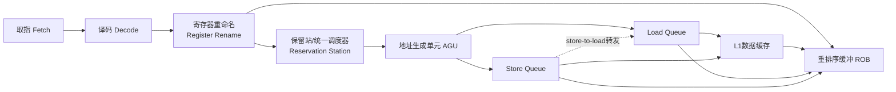
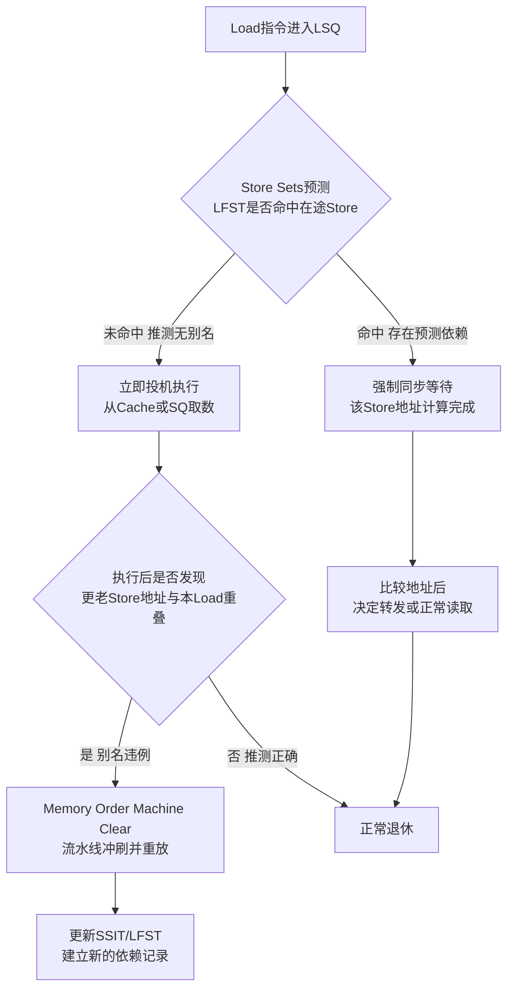
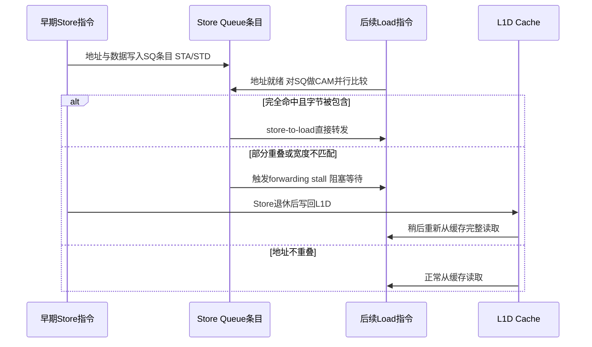
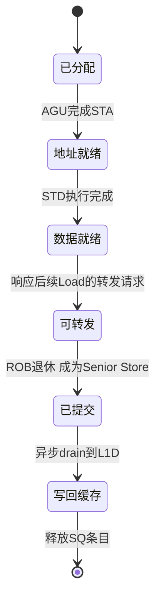

# CPU微架构与执行引擎（8）· 存储子系统：Load-Store队列

> [!abstract] TL;DR
> - Load-Store队列（LSQ）是乱序执行流水线中专门追踪访存指令的结构，通常拆分为独立的Load Queue（LQ）与Store Queue（SQ），二者共同弥补"寄存器可在译码期重命名、内存地址却要到运行时才能算出"这一根本差异。
> - 内存消歧（memory disambiguation）决定一条Load能否抢在地址尚未算出的更早Store之前执行；现代CPU普遍采用以Store Sets为代表的记忆式预测器，而不是"全保守等待"或"全投机抢跑"这两个极端。
> - Store-to-load转发让Load直接从SQ里在途Store的数据缓冲区取值，绕开缓存往返，但地址/宽度不完全匹配（含4K别名）会触发代价高昂的forwarding stall。
> - 消歧预测错误由LQ的地址监听（snoop）机制兜底检测，一旦确认违例即触发Memory Ordering Machine Clear，流水线整体冲刷重放，代价常常比一次分支预测失败更重。
> - Store在ROB退休前只能滞留SQ、不得写入L1D，这既保证了精确异常状态可回滚，也让SQ天然成为x86-TSO等内存模型里"store buffer"这一抽象的物理实体。
> - 该投机路径正是Spectre变种4（Speculative Store Bypass，CVE-2018-3639）的根源，软硬件通过SSBD等按信任边界opt-in的机制，在正确性、机密性与性能之间做取舍。

## 概述与定位

在本系列前七篇里，我们已经搭建起乱序执行引擎的核心骨架：寄存器重命名（05）消除了假依赖，Tomasulo算法与保留站（04）让指令按数据就绪顺序乱序发射，重排序缓冲ROB（07）把乱序执行的结果重新按程序序退休，对外维持精确状态（precise state）。但这套体系里有一类指令始终游离在"重命名即可解决一切依赖"的舒适区之外——访存指令，也就是Load与Store。

对寄存器操作数而言，依赖关系在译码、重命名阶段就能一次性、静态地判定清楚：寄存器编号是有限的、在指令编码里显式给出的符号，重命名表一查便知两条指令是否读写同一个逻辑寄存器。但内存操作数完全不是这么回事。一条`mov [rax+8], ebx`到底写到哪个地址，必须等`rax`的值被算出来、地址生成单元（AGU）跑完地址计算才能确定。这意味着两条访存指令之间是否存在真依赖（RAW：后面的Load读了前面Store刚写的地址）、反依赖（WAR）或输出依赖（WAW），在指令刚进入乱序窗口的那一刻是**原理上不可判定**的——必须先投机地假设无依赖、放手让Load去执行，等地址真正算出来之后再回头验证这个假设是否成立。Load-Store队列（Load-Store Queue，LSQ）正是承载这套"先猜后验、错了重放"机制的专用硬件结构，也是本篇的主角。

LSQ通常被拆分成两个独立的子结构：Load Queue（LQ）与Store Queue（SQ），Intel在专利与手册中把二者合称为Memory Order Buffer（MOB）。拆分的原因很直接：典型代码里Load的数量通常接近Store的两倍，独立定容、独立进出（Load可以相对Store队列的拥堵独立完成、退休）比一个大而化之的统一队列更灵活，也更省面积和功耗（早期一些实现，例如P6家族的初代设计，确实更接近统一队列，后续世代普遍转向LQ/SQ分离）。无论是否物理拆分，LQ与SQ都在重命名/分派阶段按**程序序**分配条目，条目的队列位置本身就隐式编码了指令的"年龄"（age），这个年龄信息是后面消歧和转发逻辑做比较时不可或缺的坐标系。

需要提前划定本章边界：LSQ要解决的问题可以分为"核内"和"跨核"两个层面。核内层面——同一个核里，一条Load能不能安全地在更早的、地址还没算出来的Store之前执行（内存消歧），以及Load能不能直接从尚未提交的Store里拿到数据抄近道（store-to-load转发）——是本章的主战场。跨核层面——多个核之间如何通过缓存一致性协议看到彼此的写、以及Load/Store在弱序/强序内存模型下对其他核可见的顺序保证——分别属于后续的《09.缓存层级与替换策略》《10.缓存一致性协议MESI》《11.内存序与内存屏障》，本章只在LSQ与它们的物理交界处点到为止，不做展开，以免与相邻篇章重复。

## 原理与机制

要理解LSQ为什么长成现在这个样子，得先把"地址晚知"这件事的后果想透。一条指令进入乱序核心后，如果它是ALU运算，操作数来自重命名后的物理寄存器，调度器只需等待生产者写回、打一个"就绪"标记即可发射；但如果它是Load或Store，它的"操作数"实际上是一段**运行时才能确定的地址区间**，而这个地址区间可能因为分支路径、循环下标、指针运算等因素而千变万化。更麻烦的是，两条访存指令即便地址表达式在源码里长得完全不像，运行时也完全可能算出同一个地址（经典的指针别名/aliasing问题）；反过来，两条看起来会访问同一个数组的指令，运行时也完全可能落在不重叠的字节区间。这种"地址相关性只能在运行时、逐动态实例地判定"的特性，是LSQ存在的全部理由。

LSQ的工作流程大致如下（对应下图中的位置）：指令在重命名/分派阶段按程序序进入LQ或SQ，此时地址还是未知的，条目只是占了一个位置、记下了年龄。指令被保留站选中发射后，AGU计算出有效地址，把地址写回对应的LQ/SQ条目——在x86上，Store在内部会被拆成STA（store address，算地址）和STD（store data，算数据）两个微操作，二者可以独立乱序执行，只要在数据真正需要转发或提交前都完成即可；Load通常是单一微操作，地址算出后立即可以尝试访问。地址一旦就绪，硬件就要做全篇最关键的一次判断：这条Load的地址，是否与**任何更老、地址已知的Store**存在字节级重叠？这个判断依赖一个按年龄过滤的内容寻址存储器（CAM，Content-Addressable Memory）结构——用Load的地址去和SQ里所有"更老"（年龄小于该Load）的有效条目做并行比较，同时算出字节掩码的重叠情况。这一并行比较逻辑的硬件代价随队列深度线性甚至更差地增长，是LQ/SQ容量始终显著小于ROB容量的核心原因之一：不是不想做大，而是CAM比较器阵列的面积、时延、功耗撑不住无限做大。



这次CAM比较会导向三种结果之一，也是下一节要深入展开的三条主线：其一，没有发现任何更老Store与之重叠（无论是真的不重叠，还是那些更老Store的地址干脆还没算出来、只能先假定不重叠），Load被放行，直接访问L1D缓存或触发缺失处理；其二，发现了某个更老Store确实与之重叠且该Store的数据（STD）已经就绪，此时硬件可以选择让Load不去碰缓存，而是直接从SQ里把数据"抄"过来，这就是store-to-load转发；其三，发现了重叠但情况复杂（数据还没就绪，或者字节范围只是部分重叠而非完全包含），既不能放行也不能干净地转发，只能让Load阻塞等待。

还有一点常被忽视但对理解LSQ至关重要：Store的数据算出来之后，并不会立即写入L1D缓存，而是老老实实地留在SQ里，直到该Store在ROB中退休、被确认"绝不会被这条指令之前的任何异常或分支误预测所撤销"之后，才会变成Intel文档里所称的senior store，此后才允许（通常是异步地）把数据drain（排流）进L1D。这么做有两个原因：第一，这是维持精确状态、支持乱序回滚的必要条件——如果Store提前写了缓存，一旦它前面的指令触发异常，或者它自己所在的分支路径被判定为误预测，这次内存写入就无法撤销，精确异常模型就被破坏了（这与07章讨论的ROB精确退休是同一枚硬币的两面）；第二，这直接决定了其他核何时能看到这次写入，SQ因此天然就是x86-TSO等内存模型里"store buffer"这个抽象概念的物理实现——同一块硬件，既服务于核内的乱序加速，又服务于核间的内存序语义，这是一个值得单独品味的设计巧合（或者说，与其说是巧合，不如说TSO这类内存模型在被形式化的时候，本就是照着当时硬件已经在做的事情去描述的）。

## 消歧算法与转发机制详解

这一节展开本章的技术核心：Load该不该抢跑（内存消歧）、抢跑之后数据该怎么拿（store-to-load转发）、猜错了怎么兜底（违例检测与重放），以及支撑这一切的队列结构细节。

### 内存消歧：从保守到投机

最朴素的做法是完全不投机：一条Load必须等到它之前**所有**Store的地址都已算出、并确认没有重叠之后才允许执行，如果有任何一个更老Store的地址还未知，Load就干等。这个方案实现简单、绝对正确，但代价是灾难性的——现实代码里Store的地址计算经常依赖较长的运算链甚至缓存缺失，如果每条Load都要等到所有前驱Store地址浮出水面，乱序执行对访存指令基本形同虚设，这完全违背了引入OoO引擎的初衷。

另一个极端是激进投机：任何Load只要自己的地址算出来，立即执行，完全不管前面有没有Store地址未知。这在吞吐上是最优的，但一旦某个更老Store随后算出的地址与该Load重叠，就必然发生一次内存序违例（memory order violation），需要靠重放机制兜底纠正——如果代码里这种真实的Load-Store别名很常见（比如栈上频繁的spill/reload、链表节点先写后读、循环携带的指针别名），激进投机会带来大量昂贵的流水线冲刷，得不偿失。

现代主流实现选择了中间路线：**记忆式内存相关性预测**，其中最具代表性的是Chrysos与Emer在1998年ISCA提出的Store Sets算法。其核心思想是：不预测"这条Load会不会和某个Store冲突"这种笼统问题，而是让每条动态Load"记住"它历史上曾经真实依赖过的那条Store（用PC识别的静态指令身份），下次再执行到同一条Load时主动去同步等待，而不是盲目投机。具体靠两张表实现：SSIT（Store Set ID Table）按PC索引，给每条Load/Store指令分配一个"Store Set ID"（SSID）；LFST（Last Fetched Store Table）按SSID索引，记录当前"在途"的、属于该store set的最近一条Store的动态实例标识（例如它的ROB编号）。当一条Load被取到时，查SSIT拿到SSID，再查LFST：如果LFST里对应条目正指向一条尚未完成的Store，就强制这条Load同步等待那条Store（等地址、必要时等数据），而不是自由投机；如果没有命中在途Store，则正常投机执行。一旦检测到一次真实的违例（某条Load投机执行后被发现确实依赖了某条更老Store），硬件就把这条Load与那条Store合并进同一个store set，让预测器"学会"这对指令之间存在依赖，此后同一对静态指令再次动态执行时就会被提前同步，避免重蹈覆辙。

Store Sets并不完美，值得指出两处边界：其一，预测粒度是**静态PC**而不是**动态实例**——同一条Load的两次动态执行，即便这一次实际上不会跟被记录的那条Store冲突（比如循环下标已经错开），预测器仍会保守地强制同步，这是用一定的"误保守"换取"避免误投机"的权衡；其二，LFST这类结构容量有限，需要定期老化/重置，否则会积累过时的关联关系。历史上还有更简化的方案：DEC Alpha 21264没有实现完整的store sets，而是给每条Load维护一个较粗的"历史违例"标志位——一旦某条Load曾经触发过内存序违例，就在此后一段时间内强制它做保守同步，命中率和精细度都不如Store Sets，但结构开销小得多；MIPS R10000则代表了另一种思路，它不依赖预测器，而是让所有Load都盲目投机执行，完全依靠地址队列（Address Queue）在Store地址算出后做全量CAM检查外加违例重放来保证正确性，性能上的赌注押在"实际违例频率足够低"这一经验事实上。这三种方案沿着"保守程度"这条轴排开，恰好呈现出与本系列06章分支预测器演进相似的设计哲学——用历史行为预测未来行为，用可容忍的误预测代价换取平均情形下的高吞吐。



### Store-to-load转发的精细规则

即便一条Load被判定确实与某条更老、仍在SQ中的Store地址重叠，也不代表就能顺利转发——转发能不能成立，取决于字节级的重叠形态：

- **完全命中/完全包含**：Load的地址与字节范围被Store完全覆盖（例如Store写了8字节，Load只读其中对齐的4字节），且该Store的STD已经算出数据，这是最理想的情形，硬件直接从SQ条目的数据缓冲里把对应字节多路选择（mux）出来送给Load，全程不碰缓存，延迟通常只有几个周期，比等Store退休再走一次完整的缓存读写往返快得多。
- **数据未就绪**：地址重叠关系已经确定，但STD还没执行完，Load仍要阻塞，只是等待的对象从"地址"变成了"数据"，等待窗口通常短得多。
- **部分重叠、非包含关系**：Load读取的字节范围只是与Store部分重叠，既不被完全包含也不完全脱离（典型场景：先窄字节Store，紧接着一个跨越该字节又覆盖其他未写字节的宽Load），这种情况下转发逻辑无法干净地拼出一份正确数据（一部分字节该来自SQ，另一部分该来自缓存里的旧值），绝大多数实现选择直接判定为**forwarding stall**：阻塞该Load，直到相关Store退休、数据落盘到L1D后，Load再完整地从缓存重新读一遍。这类停顿在Intel优化手册中被专门列为性能陷阱，实测代价可达十几到二十多个周期，是"改小成员变量宽度导致后续宽读被拖慢"这类看似无关代码改动却引发显著性能回退的常见元凶之一。
- **4K别名（4K aliasing）**：为了让地址比较能在流水线早期、TLB转换尚未完成前就先做一轮快速筛查，一些实现只比较地址的低若干位（通常是页内偏移，例如低12位，因为4KB页内偏移在虚拟地址和物理地址之间是恒等的，无需等地址转换即可安全比较）。这个捷径的代价是：两个页内偏移相同、但分属不同物理页、实际上毫不相关的地址，会被这套快速比较误判为"可能重叠"，从而触发一次完全没必要的阻塞。这就是被称为4K aliasing/4K混叠的经典陷阱，在Intel平台上有专门的性能计数器（`ld_blocks_partial.address_alias`）用于观测，常见诱因是两个各自独立、但栈偏移/堆偏移恰好模4096同余的缓冲区被交替访问。



### 违例检测与重放

无论消歧预测器多聪明，只要还存在投机执行，就一定要有一张兜底的安全网——这张网靠LQ的地址监听（snoop）逻辑实现。每条Load在拿到（哪怕是投机拿到的）数据之后，其地址在LQ里仍保持"活跃"状态直到退休；LQ持续监听两类事件：本核后续Store在退休drain进L1D时触碰到的地址，以及外部核通过一致性协议（详见10章MESI）发来的写失效/RFO请求所触碰的地址。一旦这两类事件中的任意一个，落在了某条尚未退休、已经投机读取过数据的LQ条目的地址范围内，就意味着这条Load当初读到的值现在看来可能是"过早"读到的、不满足程序序或内存模型要求的值——这就是内存序违例。对于源于本核消歧预测出错的这类违例，Intel称之为Memory Ordering Machine Clear：一旦确认，流水线会从违例指令开始整体冲刷、重新取指执行，代价与分支预测失败类似，但往往更重——因为违例的发现时机通常远晚于Load本身的执行（要等到那条更老Store的地址真正算出来才能确认），被牵连冲刷的年轻指令窗口平均而言比一次典型的分支误预测更宽。也正因为代价高昂，消歧预测器的存在意义就是尽量把"要靠重放兜底的违例"次数压到最低，而不是完全消灭投机——投机本身仍然是让Load尽早执行、隐藏延迟的唯一手段。

### 队列结构与容量的现实约束

LQ和SQ在物理上通常实现为循环缓冲区，按程序序、以匹配分派宽度的粒度（例如每周期4~6条）分配和回收条目，条目里除地址、数据外还要携带年龄标签（往往直接复用ROB编号）供CAM比较时判断"谁更老"。以公开资料及第三方实测常引用的Skylake为例，其Load Buffer约72项、Store Buffer约56项，均明显小于同代ROB的224项——这不是设计疏漏，而是前面提到的CAM比较器面积/时延约束使然，也解释了为什么"LQ/SQ占满"是一类独立于"ROB占满"的性能瓶颈：即便ROB还有空位，只要LQ或SQ耗尽，前端一样要停止分派新的访存指令。这个瓶颈与缓存缺失直接联动——一条Load一旦在L1D缺失，它会一直占着LQ条目直到缺失处理完成（涉及09章会讲的MSHR，Miss Status Handling Register），如果程序访存局部性差、缺失率高，LQ很容易被大量"挂起等待缺失返回"的条目占满，进而反向压垮整个前端的分派节奏，这也是为什么"缓存友好"和"访存并行度"这两个看似不同层面的优化，最终都会在LSQ这个资源上汇合。AMD Zen系列同样采用LQ/SQ分离设计，具体容量随世代递增；ARM阵营（包括Apple Silicon这类高性能核心）同样依赖深度可观的LSQ支撑其宽乱序窗口，具体数字因厂商未必公开细节而更依赖第三方实测，此处不做未经核实的精确数字罗列，读者若需要具体世代的准确容量，应以对应厂商的优化手册或权威第三方测量（如WikiChip、Agner Fog的微架构文档）为准。



一个可以用来直观理解CAM比较逻辑的示意如下（省略了流水化、多端口仲裁等实现细节）：

```text
Store Queue (SQ) 条目，概念示意，具体位宽因微架构而异：
+-------+------+----------------+------+---------+--------+------------+
| Valid | Age  | 地址(线性/物理) | Size | 字节掩码 | 数据   | STA/STD就绪|
|  1b   | ROB# |  约44~52 bits  | 4b   | 8b/64b  | 64b起  |   2 x 1b   |
+-------+------+----------------+------+---------+--------+------------+

# 每当一条Load的地址在AGU算出后（简化伪代码，实际是并行CAM比较而非串行循环）：
for entry in SQ:
    if entry.Valid and entry.Age < Load.Age:      # 仅考虑更老的Store
        if overlap(entry.Address, entry.Size, Load.Address, Load.Size):
            if contains(entry, Load):              # 宽Store完全包含窄/等宽Load
                if entry.STD_ready:
                    forward(entry.Data -> Load)    # store-to-load转发
                else:
                    stall(Load, until=entry.STD_ready)
            else:
                stall(Load, until=entry.Retired)   # 部分重叠：forwarding stall
            break_on_oldest_conflict()
# 若未命中任何更老Store，则正常访问L1D；后续仍受LQ snoop持续监督
```

## 工具视角与实战

LSQ的行为绝大多数时候对软件不可见，但它留下的性能足迹是完全可测的。在Intel平台上，`perf`可以直接读取与本章主题对应的性能监控事件（不同世代命名和可用性略有差异，建议现场用`perf list | grep -iE 'ld_blocks|machine_clears'`核实）：`ld_blocks.store_forward`统计因转发规则不满足而被阻塞的Load次数，`ld_blocks_partial.address_alias`专门统计4K混叠导致的阻塞，`machine_clears.memory_ordering`（或对应世代的等价事件）统计因内存序违例触发的流水线清空次数。典型用法：

```bash
perf stat -e ld_blocks.store_forward,ld_blocks_partial.address_alias,machine_clears.memory_ordering ./your_binary
```

如果`ld_blocks.store_forward`异常高，通常提示代码里存在"窄写宽读"或"跨越对齐边界读写"的模式；如果`ld_blocks_partial.address_alias`偏高，往往是若干独立缓冲区的偏移量恰好模4096同余，可以通过调整栈变量/堆分配布局、插入无用padding打破同余关系来缓解。Intel VTune的Memory Access分析视图会把这些事件直接翻译成"Loads Blocked by Store Forwarding""4K Aliasing"这类可读的指标条目，适合不熟悉具体PMU事件编码的场景下快速定位。

一个能稳定复现forwarding stall的最小示例是"宽窄不匹配"的读写序列，例如先以`char`粒度写入结构体的一个字段，紧接着以`long`粒度、跨越该字段边界读取一个更宽的区间：

```c
struct S { char a; long b; } s;
for (int i = 0; i < N; i++) {
    s.a = (char)i;              // 窄Store
    long x = *(long*)&s;        // 紧跟着的宽Load，与s.a部分重叠但不被单一Store完全覆盖
    use(x);
}
```

以及在SIMD代码中更常见的一种变体：用一条32字节的AVX宽Store写完一段缓冲区后，立即用标量Load去读其中某个子区间——这在Intel优化手册中被专门提示为"宽Store转发给窄Load"的已知限制场景（并非所有宽窄组合都能转发成功），实践中的规避方式通常是保持读写宽度一致，或者用寄存器内的shuffle/extract指令代替"写内存再读内存"的模式来传递数据。

从逆向与微架构测量的角度看，LQ/SQ的容量不像缓存大小那样可以通过CPUID直接枚举（对比：L1/L2/L3大小可以经由CPUID leaf 4，或AMD的leaf `0x8000001D`拿到），必须靠微基准实测。经典手法与07章探测ROB/RS容量的思路同源：构造一条指针追逐（pointer-chasing）的依赖Load链，中间穿插数量可变的独立Store，观察当穿插的Store数量超过某个阈值后延迟出现台阶式跃升的位置，即可反推SQ深度的大致范围；替换成穿插独立Load链可类似反推LQ深度。这类方法在学术界与个人研究者（例如Henry Wong对Intel/AMD微架构容量的公开实测）中被反复使用，也是理解"厂商公开的手册数字与实测数字为何有时存在出入"的必经之路——手册给的往往是设计规格，实测受限于测量方法本身引入的其他资源争用，需要交叉验证。此外`perf mem record`/`perf mem report`基于PEBS的访存采样能给出单次Load的延迟分布和数据来源（例如命中L1、命中转发路径等，具体粒度因世代而异），`perf c2c`则用于定位跨核缓存行争用（与LSQ通过一致性协议产生的交互相关，是排查false sharing的利器）。

有一点需要向排查并发疑难问题的读者澄清：LSQ的消歧误预测对软件永远是**透明且被自动纠正**的——重放机制保证了架构可见的结果绝对正确，因此如果你在调试多线程代码时遇到"看起来违反内存序"的诡异行为，几乎可以肯定问题出在软件层缺失的同步原语（数据竞争、遗漏的原子操作或屏障），而不是LSQ硬件出了错；把这类问题错误地归因于"CPU乱序搞乱了内存"，往上游追查一次真正的锁/内存序bug会更有效率，这也是为什么11章会专门梳理内存屏障的正确使用方式。

## 安全性与正确使用

首先要把"安全"这个词在本章的含义讲清楚：就单线程架构正确性而言，LSQ的投机消歧机制是**绝对安全**的——上一节反复强调的重放/Machine Clear机制正是这份安全的保证：任何一次消歧预测错误，都会在退休之前被检测并撤销，软件永远观察不到一个违反程序序语义的结果。从这个意义上说，消歧投机对软件是完全透明的"免费"加速。

但2018年披露的Spectre变种4（Speculative Store Bypass，SSB，CVE-2018-3639）揭示了另一层完全不同的"安全"问题：功能正确性的保证不等于**信息不泄露**的保证。SSB的攻击结构与经典Spectre v1（围绕分支/边界检查做文章）互为镜像——v1利用分支预测器的投机窗口，SSB则利用内存消歧器的投机窗口。具体机制是：攻击者设法让一条Store的地址计算被拖慢（例如让计算该地址的依赖链本身发生一次缓存缺失），同时安排一条更年轻的Load，消歧器（无论是因为预测器判定无关联，还是干脆还没来得及判定）允许这条Load投机地抢跑，从缓存中读到了Store**即将覆盖但尚未覆盖**的旧值；如果这个旧值紧接着被用作另一次内存访问的下标（典型Spectre套路：`arr2[secret_old_value * stride]`），就会在缓存里留下与旧值相关的可探测足迹，攻击者随后用Flush+Reload一类手法把这个足迹读出来。即便这条Store最终会正确完成、这条Load最终也会被违例检测机制抓到并重放纠正架构状态，攻击者需要的信息已经在那个转瞬即逝的投机窗口里，通过缓存这条边信道泄露出去了——重放能纠正**寄存器和内存的最终取值**，却纠正不了**缓存状态这个已经被永久改变的副作用**。

针对SSB，业界给出的缓解手段是SSBD（Speculative Store Bypass Disable）：通过`IA32_SPEC_CTRL`一类MSR中新增的控制位（AMD侧有对应机制），强制消歧器对指定代码路径退化回本章第三节讨论过的"保守同步"策略，即不再对地址未知的更老Store做无根据的旁路投机。这个开关的代价是实打实的吞吐损失，访存密集型负载尤其明显，因此没有任何主流操作系统把它设成全局默认开启，而是做成按进程/按线程的opt-in控制——Linux通过`prctl(PR_SET_SPECULATION_CTRL, PR_SPEC_STORE_BYPASS, ...)`暴露给用户态，并与seccomp沙箱联动，对不受信任代码自动收紧；浏览器JS引擎（如V8、SpiderMonkey）则倾向于更细粒度的软件方案，在JIT生成的、涉及类型化数组等敏感访问的代码位置显式插入`lfence`这类串行化指令，只在真正跨越信任边界的访问点付出代价，而不是整段代码统一降速。这种"默认开启投机换性能，仅在信任边界处按需关闭换机密性"的取舍逻辑，与14章将要讨论的其他Spectre缓解手段（如retpoline针对分支目标预测）在设计哲学上是一致的：安全和性能从来不是免费的二选一，工程实践永远在寻找"只在真正需要的地方付费"的最小代价方案。

还有一处更边缘、但值得警惕的关联：forwarding stall与4K aliasing带来的延迟差异，理论上构成了一条微弱但真实存在的、数据相关的计时边信道——如果一段代码的访存宽度、对齐方式或地址低位取决于秘密数据，那么"是否触发了转发失败/别名冲突"这件事本身就可能通过执行时间被外部观察到。这比SSB隐蔽得多，也很少被单独列为漏洞，但对追求恒定时间（constant-time）实现的密码学代码而言，是在"控制流恒定""访存地址模式恒定"之外还应纳入考量的细节，与本库[[37.密码学/61.侧信道攻击]]一文讨论的密码实现层侧信道形成呼应——那一篇关注的是算法/实现如何避免泄露，本章关注的是泄露赖以发生的微架构机制本身。

对不同角色的读者，本章给出的"正确使用"建议可以归纳为：应用与系统开发者不需要、也不应该试图"帮助"LSQ的正确性——它对单线程语义完全透明，只有在需要跨线程可见性顺序保证时才需要显式的内存屏障或原子操作（详见11章），这是同步原语要解决的问题，不是访存指令本身的问题；安全敏感代码（密码学实现、沙箱、JIT、虚拟化边界）的作者应当了解SSB的存在，在信任边界处主动启用平台提供的SSBD/`prctl`类控制，而不是尝试手工模拟缓解效果；性能工程师应当用上一节列出的PMU事件做实测定位，而不是凭直觉猜测forwarding stall或4K别名是否是瓶颈；最后，从硬件验证的角度看，消歧+转发+重放这条逻辑因为要同时处理"地址重叠关系 × 时序 × 投机深度"的组合爆炸，历来是CPU验证团队投入精力最多、勘误表（errata）出现相关条目频率也较高的模块之一，这也是为什么即便是这类看似"纯硬件"的结构，微码更新有时仍然承担着修复其边界行为的职责。

## 小结

Load-Store队列同时扮演着三重角色：它是核内乱序执行的安全网，靠内存消歧预测与违例重放，保证Load可以大胆抢跑而不破坏程序序语义；它是核内乱序执行的加速器，靠store-to-load转发把Load从缓存往返的延迟中解放出来；它还是内存一致性模型在硬件上的物理落脚点，Store Queue天然承担了x86-TSO等模型里store buffer的语义。三者共用同一套年龄有序的CAM比较结构，这种"一鱼三吃"的设计既是历史演进的产物，也解释了为什么理解LSQ需要同时具备乱序执行、缓存体系与内存模型三方面的知识——它正好坐在这三者的交汇点上。消歧策略从"全保守"到"全投机"再到以Store Sets为代表的"记忆式预测"，其设计哲学与06章的分支预测演进一脉相承：用可控的误预测代价换取平均情形下的高吞吐；而违例检测与重放机制，则与07章讨论的ROB精确状态回滚共享同一套底层原理。LQ条目被缓存缺失长期占用而引发的反压，是通往09章缓存层级与MSHR机制的自然入口；SQ的snoop逻辑如何与外部一致性消息交互，则是10章MESI与11章内存序两篇要正式展开的内容。SSB/Spectre v4的存在提醒我们，消歧投机在带来性能的同时，也在缓存这个副作用信道上开了一扇窗，这扇窗与14、15两章讨论的其他瞬态执行漏洞共享同一个根本矛盾：硬件保证的是"最终架构状态正确"，而不是"投机过程中不产生任何可观测副作用"。

## 相关阅读

- [[10.缓存一致性协议MESI]]
- [[11.内存序与内存屏障]]
- [[14.微架构侧信道：Spectre与Meltdown]]
- [[21.Asm/28 原子操作与内存模型]]
- [[21.Asm/39 缓存与缓存一致性]]
- [[21.Asm/38 MMU与页表设置实战]]
- [[37.密码学/61.侧信道攻击]]
- [[34.现代二进制防护机制/09.Intel CET]]
- [[34.现代二进制防护机制/13.MTE内存标签扩展]]
- G. Chrysos, J. Emer, *Memory Dependence Prediction Using Store Sets*, ISCA 1998
- K. Yeager, *The MIPS R10000 Superscalar Microprocessor*, IEEE Micro, 1996
- R. E. Kessler, *The Alpha 21264 Microprocessor*, IEEE Micro, 1999
- Intel® 64 and IA-32 Architectures Optimization Reference Manual（Store Forwarding / Memory Disambiguation 相关章节）
- Intel, *Analysis of Speculative Execution Side Channels*（Speculative Store Bypass / Variant 4 白皮书）
- P. Sewell et al., *x86-TSO: A Rigorous and Usable Programmer's Model for x86 Multiprocessors*, CACM 2010

[[00.CPU微架构与执行引擎总览|⬆ 系列总览]] | [[07.投机执行与重排序缓冲ROB|← 上一章]] | [[09.缓存层级与替换策略|→ 下一章]]
