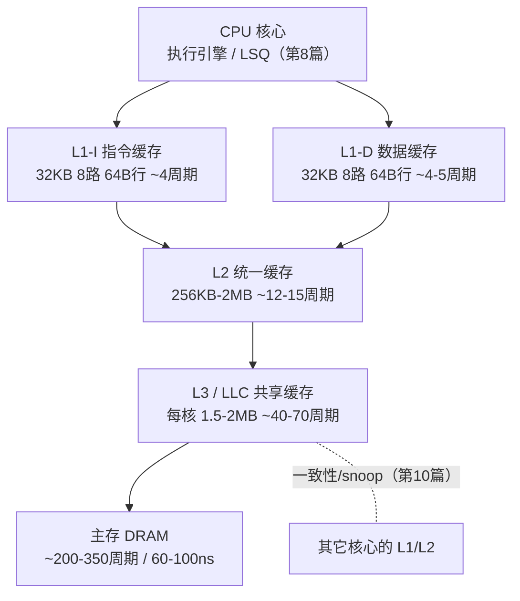
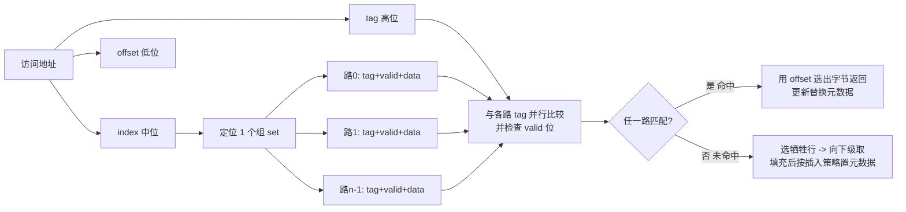
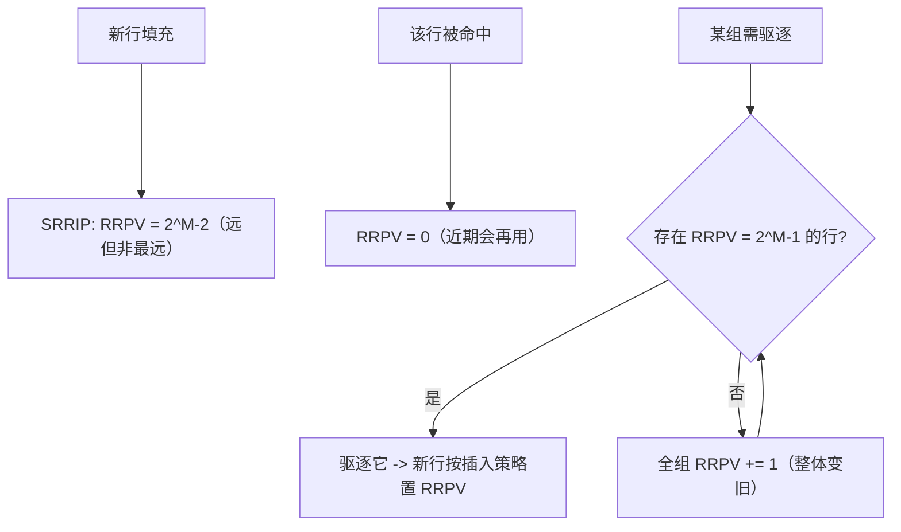
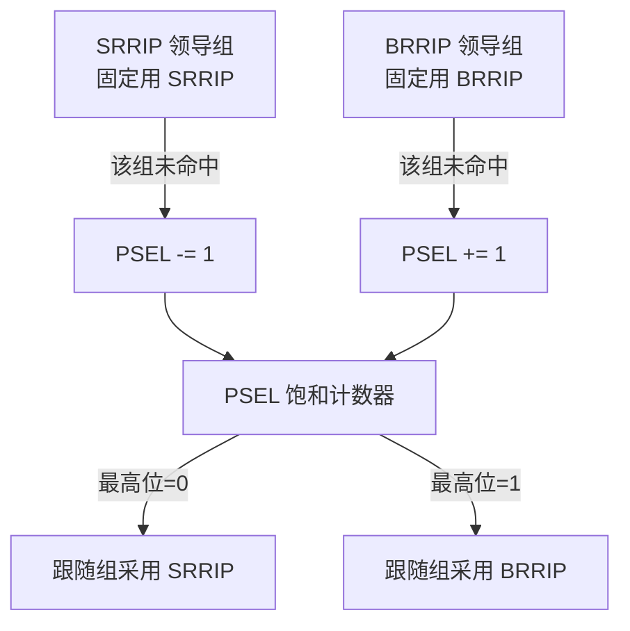

# CPU微架构与执行引擎（9）· 缓存层级与替换策略

> [!abstract] TL;DR
> - 缓存的存在是为了弥合 CPU 与 DRAM 之间近百倍的延迟鸿沟，其一切设计——分级、分组、替换、预取——都是在「命中率、访问延迟、面积/功耗、实现复杂度」四个约束下的工程折衷，而非某个单点最优。
> - 组相联把「全相联的灵活」与「直接映射的廉价」折中：`index` 选组、`tag` 并行比较、`offset` 选字节。32KB/8 路/64B 的 L1 恰好让 `index+offset=12` 位对齐 4KB 页，这正是 VIPT 不产生别名、L1 能在 TLB 翻译的同时并行查表的前提。
> - 真 LRU 需要 `ceil(log2(n!))` 位且更新逻辑随路数爆炸，实机几乎都用 Tree-PLRU（n−1 位）近似；面对「扫描（scan）」与「抖动（thrash）」型负载，纯 LRU 会全军覆没，于是催生了 RRIP/DRRIP、DIP/BIP 这类抗扫描、抗抖动的插入-提升策略。
> - RRIP 用 M 位重引用预测值 RRPV 把「多久后会再被访问」量化：SRRIP 插入即置「远」、命中才拉「近」；BRRIP 以低概率给新行留活路来抗抖动；DRRIP 用 set dueling 在两者间自适应。
> - 硬件预取器（next-line / stride / stream / BOP / SPP）用局部性预测提前搬数据，但预取污染与预取过量会反噬带宽和命中率；Intel 的 MSR `0x1A4` 可逐位关闭四个预取器，是性能剖析与侧信道复现实验的常用开关。
> - 命中/未命中在时间上可分辨——这既是性能优化的标尺，也是 Flush+Reload / Prime+Probe 侧信道的物理基础；替换策略、LLC slice 哈希、包含性策略共同决定驱逐集构造难度，也框定了 CAT/页着色这类防护的思路。

## 概述与定位

现代处理器最尴尬的现实，是执行引擎快得离谱、主存慢得离谱。一条 ALU 运算在乱序核里不到一个周期就退休了（见本系列第 4、7 篇），而一次 DRAM 访问动辄两三百个周期。若每条 load 都直捣主存，前面辛苦堆起来的超标量、乱序、投机（第 3、4、6 篇）全都白搭——流水线绝大多数时间在空转等数据。这个「处理器算力增长远快于内存延迟改善」的历史趋势，就是著名的 **内存墙（memory wall）**。缓存层级正是为翻越这堵墙而生的核心装置。

缓存之所以能work，根植于程序访问的两条经验规律，即 **局部性原理**：**时间局部性**（刚访问过的地址，很可能马上再访问，比如循环变量、栈顶）与 **空间局部性**（访问了某地址，其邻近地址很可能接着被访问，比如数组顺序遍历、结构体成员、顺序取指）。缓存把「最近用过的、以及其物理邻居」的数据留在离核心更近、更快的 SRAM 里，用小容量的高速存储去过滤掉绝大多数对大容量慢速存储的访问。注意：局部性是**统计规律不是保证**，一旦负载违背它（随机指针追逐、超大流式扫描），缓存收益骤降——这一点会贯穿后文对替换与预取的讨论。

在微架构版图上，本篇处于承上启下的位置。上游是第 8 篇的 **Load-Store 队列（LSQ）**：load/store 在此排队、做地址消歧与 store-to-load 转发，真正「要访存」的请求才会打到 L1。下游是主存控制器与 DRAM。本篇聚焦**单核视角下缓存自身的组织结构与替换/预取策略**，刻意把几个相邻话题留给专章，避免重复：多核之间的数据一致性（谁改了、别人怎么看到）是第 10 篇 **MESI**；虚拟地址到物理地址的翻译加速是第 12 篇 **TLB**；把缓存时序差当武器的攻防细节是第 14、15 篇 **侧信道**。本篇只在「安全性」一节点出缓存作为侧信道的**物理机理与防护边界**，不展开攻击构造。

从层级看，典型现代 x86/ARM 大核是三级结构：**L1** 按指令/数据拆分（L1-I、L1-D，哈佛结构），每核私有、最小最快；**L2** 统一（指令数据混放）、每核私有、居中；**L3（LLC，末级缓存）** 通常多核共享、最大最慢。容量与延迟逐级放大，形成「小而快」到「大而慢」的连续谱。为什么要分级而不是做一个大 L1？因为 SRAM 的访问延迟随容量与相联度增长（更大的阵列、更长的位线、更多的 tag 比较器与更宽的多路选择），单级无法同时满足「够快」和「够大」；分级让每一级各自逼近自己那档的最优点，是**延迟-容量权衡的空间化展开**。



## 原理与机制

**缓存行（cache line / block）是缓存管理的最小单位**，主流为 64 字节。为什么不是按字节或按字管理？因为按行管理能一次性把「空间局部性」变现（取一个字节顺带把邻居 63 字节拉进来），同时大幅压缩 tag 的开销（每 64 字节只存一份 tag 而不是每字节一份）。行大小是折衷：太小则空间局部性利用不足、tag 占比高；太大则「拉进来却用不到」的浪费（污染）加剧、且未命中时搬运延迟更长。64B 是长期演化出的甜点。

**地址被切成三段来定位数据**。给定一个（物理或虚拟）地址，从低位到高位切为：`offset`（组内/行内字节偏移）、`index`（选哪一组 set）、`tag`（用于确认是否真是想要的那一行）。三者位宽由「行大小、组数、地址位宽」决定：

```
物理地址  [ tag 高位 | index 中位 | offset 低位 ]
offset 位数 = log2(行大小)              例：64B  -> 6 位
index  位数 = log2(组数 sets)           例：64组 -> 6 位
tag    位数 = 地址位数 - index - offset
组数 sets = 缓存容量 / (行大小 × 相联路数 ways)
```

以经典 32KB / 8 路 / 64B 行的 L1-D 为例：行 64B → offset 6 位；行数 = 32768/64 = 512；组数 = 512/8 = 64 → index 6 位。于是 `index+offset = 12 位 = 4KB`，**恰好等于一个页面**。这不是巧合而是刻意设计：它让 index 与 offset 全落在页内偏移里（页内偏移在虚实翻译中不变），于是 L1 可以**用虚拟地址的 index 先去查 tag 阵列，同时让 TLB 并行翻译出物理地址再比对 tag**，即 **VIPT（虚拟索引、物理标签）**，把 TLB 翻译延迟藏进缓存访问里。一旦 L1 想做得更大或降低相联度，`index` 就会越过第 12 位、吃到会被翻译改变的高位，产生 **同义（aliasing）** 问题——这正是 L1 长期卡在 32KB/48KB、要扩容就得靠加相联度的底层原因（详见第 12 篇 TLB 与 [[21.Asm/38 MMU与页表设置实战]]）。

**映射方式有三档**。**直接映射（1 路）**：每个地址只能进唯一一组的唯一一个位置，硬件最简单（一次比较），但两个 index 相同的热地址会互相驱逐、命中率差。**全相联**：任意地址可进任意行，命中率最好，但要拿 tag 和所有行并行比较，比较器与功耗随行数爆炸，只在 TLB 这种小结构里用。**组相联（n 路）** 是折衷主力：先用 index 选定一组，组内有 n 个「路（way）」，把 tag 与这 n 路并行比较——n 通常是 4/8/16。相联度越高、冲突未命中越少，但 tag 比较器、多路选择器、命中判定关键路径都变长、功耗变大。**相联度本质是在「冲突未命中」和「延迟/功耗」之间买卖**。



**未命中不是铁板一块，Mark Hill 的 3C 模型**把它分类：**强制未命中（compulsory / cold）**——数据第一次被访问，谁都躲不掉，只能靠预取或加大行来缓解；**容量未命中（capacity）**——工作集大于缓存容量，即便全相联也装不下；**冲突未命中（conflict）**——容量够但因为映射受限（相联度不足）被挤掉，提高相联度或换替换策略可缓解。多核语境下还有第 4 个 C：**一致性未命中（coherence）**——别的核写了你缓存里的行，把它作废掉，这是第 10 篇的主题。**会分类未命中，才能对症下药**：cold 找预取、capacity 找算法分块、conflict 找相联度/替换。

**写策略决定「写命中/写未命中时数据往哪走」**。命中时：**写直达（write-through）** 同时写本级和下级，实现简单、下级永远最新，但写带宽压力大；**写回（write-back）** 只写本级并置 **dirty 位**，被替换时才回写下级，省带宽，是 L1/L2/L3 的主流，代价是需要 dirty 位与回写逻辑、且掉电/一致性处理更复杂。未命中时：**写分配（write-allocate）** 先把行取上来再写（配合写回），**非写分配（no-write-allocate）** 直接把写透传到下级而不占本级（配合写直达）。**dirty 位、valid 位是缓存行的两个关键元数据**：valid 决定这行是否有效，dirty 决定驱逐时是否需要回写。

**包含性策略决定各级之间的数据重叠关系**。**包含式（inclusive）**：上级有的，下级必有——L3 inclusive 时可充当 **snoop filter**，别的核来窥探时只查 L3 就知道要不要打扰本核 L1/L2，极大简化一致性（第 10 篇），代价是浪费容量（数据在多级重复）且 L3 驱逐要连带作废上级（back-invalidation）。**排他式（exclusive）**：数据只在一级出现，把有效容量最大化（AMD 的 victim L3 是典型），但一致性过滤要另建目录。**非包含非排他（NINE）**：不强制任何关系，Intel 自 Skylake-X 起把 L3 从 inclusive 改为 non-inclusive+victim，配独立的 snoop 目录——这一改动直接改变了跨核缓存侧信道的可行性（安全一节再述）。

**缓存不是阻塞式的**。现代缓存是 **非阻塞/lockup-free** 的：一次未命中不会冻结整条流水线，而是把未命中登记进 **MSHR（Miss Status Handling Register）**，允许在其等待期间继续处理后续命中甚至更多未命中（**hit-under-miss / miss-under-miss**），从而榨取 **内存级并行（MLP）**。MSHR 的条目数就是「同时在飞的未命中数」上限，与 LSQ（第 8 篇）、ROB（第 7 篇）的容量共同决定了核能容忍多深的内存延迟。配套技巧还有 **关键字优先（critical-word-first）** 与 **提前重启（early restart）**：未命中搬运整行时，先把 CPU 当下要的那个字送回去让它继续跑，剩余字节随后填。

## 组相联结构与替换算法详解

选定一组后，若这组 n 路都被占满，新行进来就必须踢掉一个——**踢谁，就是替换策略（replacement policy）要回答的问题**。理论上限由 1966 年 Belady 给出的 **OPT/MIN 算法**：踢掉「未来最久才会被再次访问」的行，命中率最优——但它需要预知未来，只能作为离线评估其它策略好坏的标尺，不可实现。所有真实策略，都是在「不知道未来」的前提下，用**过去的访问历史去预测未来的重引用**。

**最朴素的几档**。**随机（Random）**：无需元数据、无更新逻辑，硬件几乎零成本，抗特定 pathological 模式意外地不差，常用作 L2/L3 的低成本近似或与其它策略混用。**FIFO（先进先出）**：按进入顺序踢，忽略了「进来后被反复命中」的热行，且存在反直觉的 **Belady 异常**（增大容量反而命中率下降）。这两档说明一件事：**替换策略的关键不在「进入顺序」而在「重用价值」**。

**LRU（最近最少使用）是长期的黄金基线**：踢掉「最久没被访问」的行，直接对应时间局部性，对绝大多数良性负载效果好。但**真 LRU 的实现代价随路数爆炸**。要精确维护 n 路的完整访问次序，等价于表示 n 个元素的一个全序，有 `n!` 种排列，至少需 `ceil(log2(n!))` 位；且每次命中都要把被访问路提到「最近」、其余相应下移，更新逻辑是 O(n) 的重排。

```
真 LRU 的位开销（每组）：
  4 路: log2(4!)  = log2(24)    ≈ 4.6  -> 5 位
  8 路: log2(8!)  = log2(40320) ≈ 15.3 -> 16 位
 16 路: log2(16!) ≈ 44.3               -> 45 位
常见「矩阵法」实现：n×(n-1)/2 位（8路=28位），命中即置行、清列
```

正因如此，**实机极少用真 LRU，而用「伪 LRU（PLRU）」近似**。最流行的是 **Tree-PLRU（树形伪 LRU）**：用一棵满二叉树，每个内部节点存 1 个方向位，指向「较少被使用」的那半子树。n 路只需 **n−1 位**（8 路仅 7 位）。命中某路时，把从根到该路路径上的所有方向位翻向「远离该路」；替换时从根一路沿方向位下行，走到的叶子就是牺牲者。它不保证踢的是真正最久未用的那个，但**用极小的位开销和 O(log n) 更新换来接近 LRU 的命中率**，是工程上的经典胜利。另一变体是 **bit-PLRU（MRU 位法）**：每路 1 个 use 位，命中置 1，全 1 时清零重来，替换选第一个 use=0 的路。

**但 LRU 家族有两个致命软肋，恰是现代策略要解决的**。其一 **扫描（scan）**：一段只用一次、长度超过缓存的顺序访问（如遍历大数组一遍），会把整组占满且这些「一次性」行在 LRU 里全被当「最近使用」保护起来，把真正会重用的热数据冲刷出去。其二 **抖动（thrash）**：循环工作集略大于缓存（比如反复扫 33 路数据放进 32 路），LRU 下每个循环每行都刚好在被再次用到之前被踢掉，**命中率趋近于 0**，而此时哪怕随机保留一部分行都会更好。

**RRIP（Re-Reference Interval Prediction，重引用间隔预测，Jaleel 等 ISCA 2010）** 直击这两点。核心是给每行配 **M 位的 RRPV（重引用预测值）**，把「这行还要多久才会被再次访问」量化为一个区间：**0 = 马上会用（近）**，**2^M−1 = 很久才用/几乎不用（最远）**，中间值线性过渡（M 常取 2，值域 0–3）。三条规则：

- **插入**：新行不默认当「最近」。**SRRIP（Static RRIP）** 把新行的 RRPV 置为 `2^M−2`（「远，但不是最远」）——即**先假设它没那么快会被再用，给它一次「证明自己」的机会但不把它捧上天**。
- **命中**：把该行 RRPV 拉到 0（证明了它确实会被重用，晋升为「近」）。
- **驱逐**：扫描本组，找 RRPV = `2^M−1`（最远）的行踢掉；若没有，就把全组所有行 RRPV **一起加 1**（整体「变旧」）后重扫，直到出现最远者。

这套「插入即置远、命中才拉近」的机制天然 **抗扫描**：一次性的扫描行插入后 RRPV 已经很高，只要不被再次命中，很快被判为最远而清走，不会长期霸占。而针对 **抖动**，**BRRIP（Bimodal RRIP）** 让绝大多数新行直接以 `2^M−1`（最远）插入、只以很低概率（如 1/32）给一行 `2^M−2`——相当于**只让一小撮新行「保命」，其余随时可弃**，从而在工作集略超容量时保住一个能稳定命中的子集。问题是 SRRIP 对普通负载好、BRRIP 对抖动负载好，**如何自动二选一？**



答案是 **DRRIP（Dynamic RRIP）** 与其思想同源的 **DIP（Dynamic Insertion Policy，Qureshi 等 ISCA 2007）** 共用的杀手锏——**set dueling（组对决）**。做法：从所有组里各拿出少量「领导组（leader sets）」，一批**固定用策略 A（如 SRRIP）**、另一批**固定用策略 B（如 BRRIP）**，其余绝大多数是「跟随组（followers）」。一个饱和计数器 **PSEL** 记账：A 领导组发生一次未命中就让 PSEL 减、B 领导组未命中就让 PSEL 加；**PSEL 的最高位就代表当前哪个策略更差**，跟随组据此实时采用**胜出的那个策略**。妙处在于：它**不做建模、不加大结构，只用「让两种策略在同一负载上真刀真枪比一小撮组的表现」来在线自适应**，硬件成本几乎只有几个计数器。DIP 里对决的是 **LIP（LRU 位置插入，新行直接放最容易被踢的位置）/BIP** 与传统 LRU；DRRIP 里对决的是 SRRIP 与 BRRIP。它们是同一套「**插入位置/年龄 + 在线对决**」哲学的不同外衣。后续 **SHiP** 更进一步：不再全局二选一，而是**按「访问的 PC 签名 / 内存区域」预测每条流的重用性**，给不同来源的行以不同插入 RRPV，粒度更细。



**预取（prefetch）是从另一个方向打击未命中**：替换策略优化「留谁」，预取则试图在数据被用到之前就搬进来，直接消灭 cold/capacity 未命中带来的停顿。**硬件预取器**按复杂度递增：**next-line（下一行）**——取了 N 行就顺手预取 N+1 行，最简单、抓顺序流；**stride/stream（定步长）**——检测「地址每次 +K」的等差模式（如 `a[i]`、按行遍历矩阵），预测 K 并沿途预取，还能按 PC/IP 区分不同的 load 流（IP-based stride）；再往上是 **GHB（全局历史缓冲）、Markov（关联预取，学「访问 X 后常访问 Y」的不规则模式）**。近十年的研究型强者有 **BOP（Best-Offset Prefetching，Michaud HPCA 2016，DPC2 冠军）**——不显式建流，而是**用近期访问历史打分、动态选出当前最佳预取偏移**，隐含考虑了「预取要及时（timing）」；以及 **SPP（Signature Path Prefetcher，MICRO 2016）**——用「路径签名」压缩历史、能跨页预测且带**置信度自节流**。Intel 大核实际内置四个：L2 stream、L2 相邻行（凑一对 128B）、L1 DCU（next-line）、L1 IP（stride），均可经 MSR `0x1A4` 逐位开关。

**预取的三个关键旋钮与两大反噬**必须讲清。旋钮：**距离（distance / lookahead，提前多少）**——太近来不及、太远占位早；**度（degree，一次预取几行）**；**及时性（timing）**——预取要「不早不晚」正好在用之前到。反噬其一 **预取污染（pollution）**：预取错的行挤掉了本来有用的热行，命中率不升反降；反噬其二 **带宽/功耗浪费**：预取过量吃满内存带宽，挤压真实需求访问。因此现代预取器都带 **节流（throttling）**：用「预取准确率、及时率、是否造成污染」等反馈动态调激进程度，甚至在带宽紧张时退让。**软件预取指令**（x86 `PREFETCHT0/T1/T2/NTA`、`PREFETCHW`）把控制权交给程序员：T0 拉进各级、T1/T2 只到较外层、**NTA（non-temporal）** 走「用完即弃」路径以最小化对常规缓存的污染，适合明知一次性的流式数据。软件预取的难点恰恰是**手工调距离**——放早了被替换、放晚了没藏住延迟，且会与硬件预取相互干扰，通常只在硬件预取抓不到的**不规则但可由软件提前算出的地址**（如链表、哈希、间接寻址 `a[b[i]]`）上才划算。

## 工具视角与实战

**第一步永远是「摸清目标机器的缓存到底长什么样」**，别凭想象。Linux 下有几条稳妥途径：

```bash
# 1) lscpu 直接给出各级容量
lscpu | grep -i cache
# 2) sysfs 逐级读取：容量/行大小/相联度/组数/共享范围
cat /sys/devices/system/cpu/cpu0/cache/index0/{level,type,size,ways_of_associativity,coherency_line_size,number_of_sets,shared_cpu_list}
# 3) x86 直接问 CPUID（leaf 4 枚举每级 cache 的参数）
cpuid -1 | less        # 或自写 CPUID leaf 0x4 解析
```

`shared_cpu_list` 尤其关键：它告诉你**哪些逻辑核共享同一块缓存**——同物理核的两个超线程（第 13 篇）共享全部私有缓存，而 LLC 常被整个 die 共享。这决定了你分析「false sharing、跨核侧信道、NUMA 亲和」时谁和谁在抢同一份缓存。

**第二步是量化命中/未命中，用 `perf`**：

```bash
# 看总体缓存行为与各级未命中
perf stat -e cycles,instructions,\
cache-references,cache-misses,\
L1-dcache-loads,L1-dcache-load-misses,\
LLC-loads,LLC-load-misses ./your_program

# 定位是哪段代码在丢缓存（采样 LLC 未命中）
perf record -e LLC-load-misses:pp -c 1000 ./your_program
perf report
```

读数要点：**未命中「率」比「绝对数」更有意义**（除以对应 loads）；`LLC-load-misses` 高意味着大量访问穿透到 DRAM，是最贵的停顿源，优先治理。想验证「某优化到底改善了哪一级」，就分别看 L1/L2/LLC 三档 miss 的升降。第 16 篇会把 PMU/perf/火焰图讲透，这里只强调**缓存问题一定要用硬件计数器证实，而不是猜**。

**第三步：不看手册也能反推缓存参数——微基准法**，这是逆向与性能工程的通用手艺。经典手法是 **指针追逐（pointer chasing）**：构造一个环形链表，步长 `stride` 递增、工作集 `size` 递增，测每次解引用的平均延迟。当 `size` 越过某级容量，延迟出现台阶式跳变——**台阶的位置就暴露了各级缓存容量**；固定 size、扫 stride，当 stride 使访问全部撞进同一组时命中率崩塌，**崩塌点能反推组数/相联度**（这正是 lmbench、Calibrator 等工具的原理）。同一套思路稍加改造，就是侧信道里**构造驱逐集（eviction set）** 的基础——找出一批「index 相同、能把目标行从组里挤走」的地址（详见第 14/15 篇）。

**第四步：预取器开关是实验利器**。Intel 上以 MSR `0x1A4` 逐位控制（1=关闭）：

```bash
modprobe msr
# bit0=L2硬件预取, bit1=L2相邻行, bit2=L1 DCU, bit3=L1 IP 预取
rdmsr -a 0x1a4                 # 读当前值
wrmsr -a 0x1a4 0xf             # 全部关闭（每核都写）
wrmsr -a 0x1a4 0x0             # 全部开启
```

关预取的两个典型用途：一是**判断某段负载到底吃不吃预取**（关掉看 miss/性能变化）；二是**侧信道/延迟测量要排除预取干扰**（否则预取会把你以为的 miss 变成 hit，污染时序）。注意这是**平台相关**的实现细节，AMD、ARM 各有各的控制方式甚至不可控，务必以自家手册为准。

**第五步：把缓存意识写进数据结构与算法**。几条高杠杆手艺：**对齐到缓存行**（热点结构 `alignas(64)`，避免一个对象横跨两行导致双份未命中）；**SoA vs AoS**——只遍历某字段时用「结构体数组转数组结构体（SoA）」让所需字段在内存里连续，把空间局部性拉满；**分块/瓦片化（blocking/tiling）**——矩阵乘、卷积把大遍历切成能装进 L1/L2 的小块，把 capacity 未命中转成命中，是 HPC 的看家优化；**缓存无关算法（cache-oblivious）**——用递归分治让算法**无需知道具体缓存参数**也能在所有层级上接近最优（如递归分块矩阵乘、van Emde Boas 布局），可移植性极佳。这些优化的共同内核是**让「访存模式」去迎合「缓存组织」**，而不是反过来。相关汇编级视角见 [[21.Asm/39 缓存与缓存一致性]]。

## 安全性与正确使用

**缓存最深刻的安全含义是：它把「数据的访问历史」编码进了「访问延迟」这个可测的物理量。** 命中快、未命中慢，这个几十到几百周期的稳定差异，用 `rdtsc`/`rdtscp` 就能测出。于是「某地址此刻在不在缓存里」变成一个可读的**状态比特**，而这个状态又取决于「之前谁访问过它」——**一条隐蔽的信息流就此成立**。这不是实现 bug，而是「用共享的、状态化的、时序可分辨的资源做性能优化」这一范式的固有副作用。

由此衍生的经典缓存侧信道（构造细节属第 14、15 篇与 [[37.密码学/61.侧信道攻击]]，此处只讲与本篇机制的接口）：**Flush+Reload** 依赖攻防双方**共享物理页**（如共享库、页去重），攻击者 `clflush` 冲掉目标行、等受害者运行、再 reload 测时——快则受害者访问过。**Prime+Probe** 不需共享内存：攻击者先用自己的一组地址**填满某个缓存组（prime）**，等受害者运行，再**重新访问自己那组（probe）**，若变慢说明受害者的某次访问把攻击者的行挤了出去——**受害者的访问地址，通过「谁被替换」泄露了出来**。看得出：**替换策略直接决定攻击难度**——LRU/PLRU 下「谁会被踢」是确定可推的，利于攻击者构造精准驱逐；而 RRIP、随机成分、以及 set dueling 带来的**不确定性会增加驱逐集构造与噪声控制的难度**（这也催生了针对特定替换策略的驱逐集构造研究）。

**层级与包含性同样是安全变量**。**包含式 LLC** 是跨核攻击的温床：攻击者在共享 LLC 上驱逐一行，会因 back-invalidation **连带把受害者私有 L1/L2 里的副本也作废**，从而隔着核去影响、探测对方——这是很多跨核 Flush+Reload/Prime+Probe 的立足点。Intel 自 **Skylake-X 把 LLC 改为 non-inclusive**，正是（部分地）打断了这条链，但换来 snoop 目录，攻击者转而研究目录侧信道。**LLC 的 slice 哈希**（多个 LLC slice 由一个未公开的地址散列函数分配）也是攻防焦点：不知道哈希就难以稳定命中目标 slice 的目标组，逆向该哈希是构造高效 LLC 驱逐集的前提。此外 **way prediction（路预测，AMD 用于降 L1 延迟/功耗）** 曾被「Take A Way」攻击利用，说明**任何为省延迟/功耗引入的、依赖历史的预测结构，都可能成为新侧信道**——预取器亦然（已有基于预取器状态的泄露研究，如 AfterImage 类工作）。

**正确使用与加固边界**分两个层面。**给写敏感代码的开发者**：核心准则是**不要让「秘密」影响「访存地址」或「访存是否发生」**，即 **constant-time / data-oblivious 编程**——查表用位切片或全表线性扫描代替按秘密下标取（避免 T-table AES 那类泄露）、分支不依赖秘密、必要时用 `PREFETCHT0` 或 dummy 访问把整张表拉进缓存以抹平时序。**给系统/平台方**：可用 **Intel CAT（Cache Allocation Technology，RDT 一部分）** 按 way 给不同安全域**划分 LLC**，让攻防双方不共享同一批 way，从而堵住 Prime+Probe 的共享前提；也可用 **页着色（page coloring）** 在软件层把不同域映射到不重叠的缓存组；对共享内存去重（KSM/透明大页去重）在多租户环境要谨慎关闭以断掉 Flush+Reload 的共享前提。这些防护都有**性能代价**（划走 way 等于缩小可用缓存），本质是**拿性能换隔离**，需按威胁模型权衡。

**最后是最常见、非攻击性的「误用」——伪共享（false sharing）**：两个核各写一个变量，但两个变量**恰好落在同一条 64B 缓存行**里，于是每次写都触发一致性协议（第 10 篇）把整行在两核间反复弹来弹去，性能断崖。它不是安全漏洞，却是缓存「以行为单位」这一机制被无意踩中的典型陷阱。修法：把被不同核写的热变量**用填充/对齐拆到不同缓存行**（`alignas(64)` 或结构体填充），并用 `perf c2c` 定位。理解本篇的「行/组/替换」，才能一眼看穿这类问题的根因。原子与内存模型层面的配套认知见 [[21.Asm/28 原子操作与内存模型]]；内存标签类硬件（如 [[34.现代二进制防护机制/13.MTE内存标签扩展]]）与控制流防护（[[34.现代二进制防护机制/09.Intel CET]]）则从「访问合法性」而非「访问时序」的维度补齐内存安全图景。

## 小结

缓存层级是「内存墙」时代榨取性能的第一发动机，也是把无数微架构优化（超标量、乱序、投机）从纸面拉进现实的地基。本篇的主线是：**一切都是折衷**。分级，是延迟-容量权衡的空间化；组相联，是冲突未命中与延迟/功耗的买卖；行大小、写策略、包含性，各自在带宽、面积、复杂度间取舍。替换策略从 Belady 的不可实现最优出发，经真 LRU（太贵）→ Tree-PLRU（廉价近似）→ RRIP/DRRIP、DIP（抗扫描抗抖动 + set dueling 在线自适应）→ SHiP（按签名细粒度预测），一路都在回答同一个问题——**在不知未来的前提下，如何用过去更聪明地预测重用**。预取则从另一侧提前搬运、消灭 cold/capacity 未命中，但受预取污染与带宽反噬制约，靠距离/度/节流拿捏火候。工具层面，摸清参数（sysfs/CPUID）、量化未命中（perf）、微基准反推、MSR 开关预取、以及把访存模式写去迎合缓存（对齐/SoA/分块/cache-oblivious），构成了完整的实战闭环。安全层面，命中/未命中的时序可分辨性是缓存侧信道的物理根，替换策略、slice 哈希、包含性共同框定了攻击难度与 CAT/页着色/constant-time 这些防护的边界。掌握这一层，才能读懂下一篇 **MESI**——当多个核各自缓存同一份数据、又各自替换与写回时，如何维持一个所有核都认账的一致内存视图。

## 相关阅读

- 本系列上下文：[[00.CPU微架构与执行引擎总览|系列总览]] · 上游访存请求源自 [[08.存储子系统：Load-Store队列]] · 多核一致性专章 [[10.缓存一致性协议MESI]] · 地址翻译与 VIPT 关联 [[12.TLB与地址转换加速]] · 缓存时序侧信道攻防 [[14.微架构侧信道：Spectre与Meltdown]]、[[15.侧信道进阶：MDS与L1TF与Zenbleed]] · 计数器与剖析 [[16.性能剖析：PMU与perf与火焰图]]
- 同库汇编视角：[[21.Asm/39 缓存与缓存一致性]]（缓存的汇编级观察）、[[21.Asm/28 原子操作与内存模型]]（原子/内存序）、[[21.Asm/38 MMU与页表设置实战]]（分页与 VIPT 前提）
- 密码实现层侧信道：[[37.密码学/61.侧信道攻击]]（与本系列微架构层互补）
- 内存安全防护呼应：[[34.现代二进制防护机制/13.MTE内存标签扩展]]、[[34.现代二进制防护机制/09.Intel CET]]
- 权威文献：Hennessy & Patterson《Computer Architecture: A Quantitative Approach》（缓存与存储层级章节）；Ulrich Drepper《What Every Programmer Should Know About Memory》；Intel《64 and IA-32 Architectures Optimization Reference Manual》（预取器与缓存优化）与《Intel SDM Vol.3》（MSR/CAT/RDT）；Belady（1966）最优替换；Jaleel 等《High Performance Cache Replacement Using RRIP》（ISCA 2010）；Qureshi 等《Adaptive Insertion Policies for High Performance Caching / DIP》（ISCA 2007）；Michaud《Best-Offset Prefetching》（HPCA 2016）；Kim 等《Signature Path Prefetching / SPP》（MICRO 2016）；Jouppi《Victim Cache》（ISCA 1990）

[[00.CPU微架构与执行引擎总览|⬆ 系列总览]] | [[08.存储子系统：Load-Store队列|← 上一章]] | [[10.缓存一致性协议MESI|→ 下一章]]