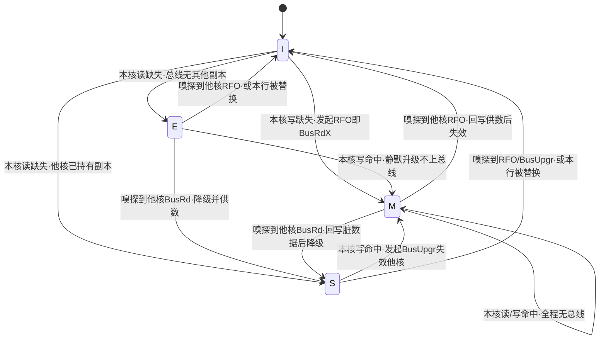
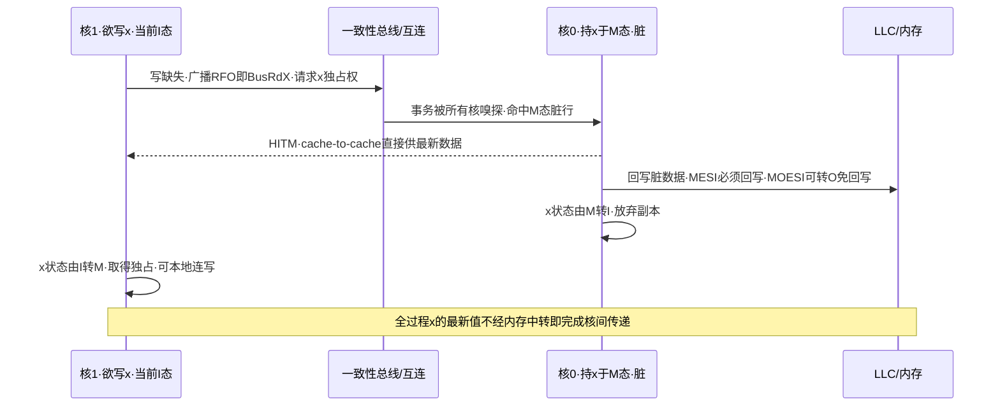
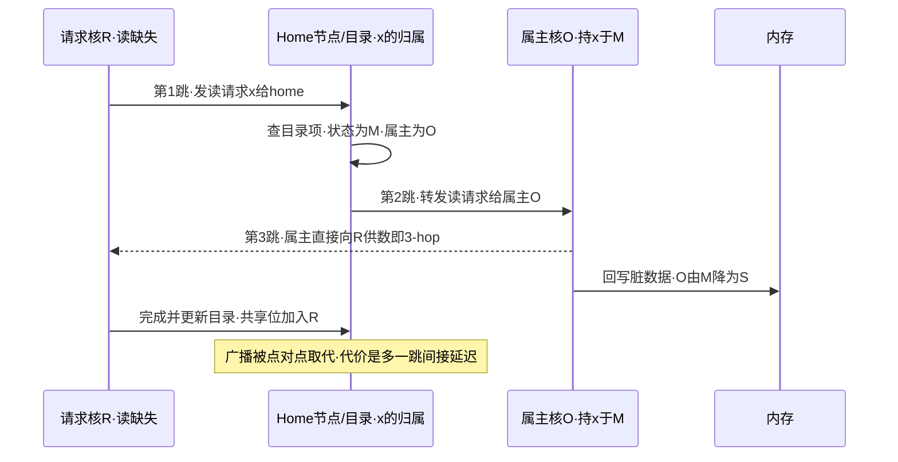
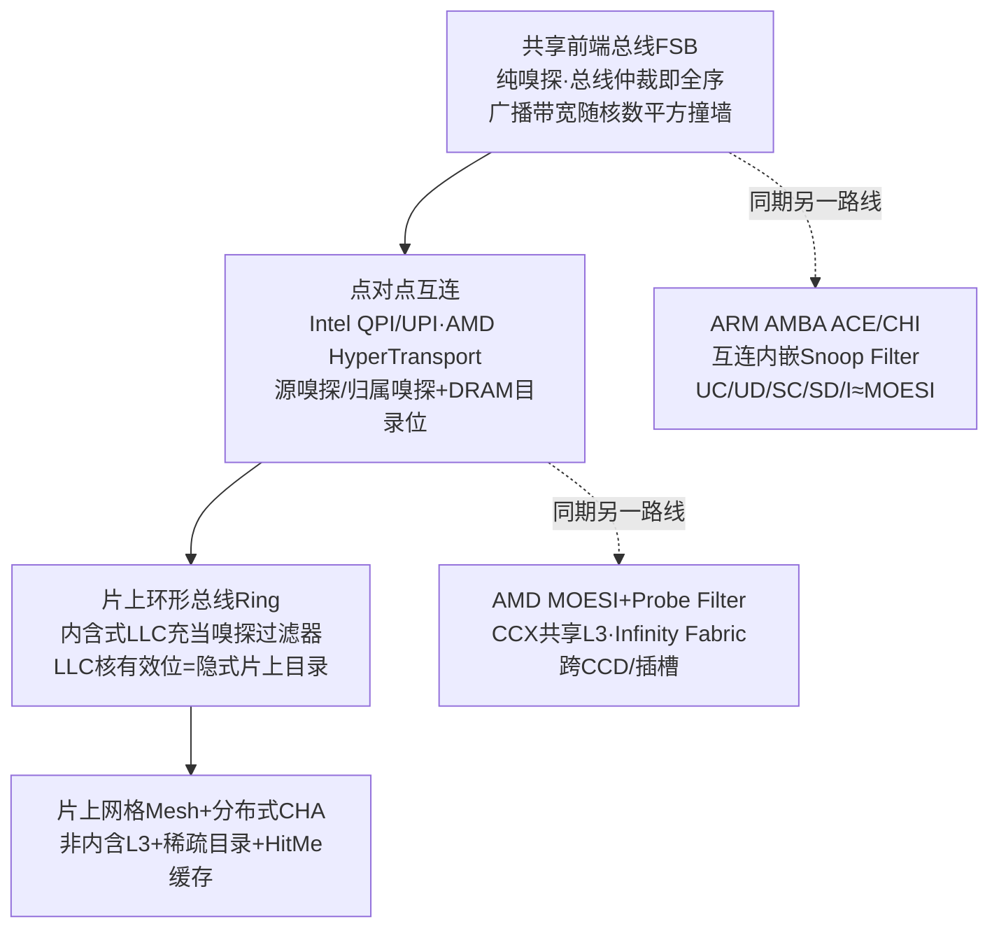

# CPU微架构与执行引擎（10）· 缓存一致性协议MESI

> [!abstract] TL;DR
> - 缓存一致性要维护两条不变量：单写多读（SWMR，任一时刻某地址要么被唯一一个核以可写方式独占、要么被任意多核只读共享）与写序列化（所有核以同一顺序看到对同一地址的写）。MESI 用每缓存行的四个状态把这两条落到硬件。
> - 一致性（coherence）只约束「单个地址」的可见性与顺序，不等于内存一致性模型（consistency）对「跨多个地址」的排序保证——后者是第 11 章的主题；把二者混为一谈是并发 bug 的头号根源。
> - E 态是 MESI 相对 MSI 的关键增量：它让「先读后写」的私有数据在写时从 E 静默升到 M、免掉一次总线失效广播，这是线程局部数据高频访问的性能来源。
> - 嗅探（snooping）靠广播加总线全序，实现简单、延迟低，但广播带宽随核数近似平方增长而撞墙；目录（directory）用 home 节点加 presence 位把广播换成点对点，可扩展但多一跳间接延迟——现代多核用「内含式 LLC / 嗅探过滤器」这一片上目录把两者缝合。
> - MOESI 的 O 态（AMD）让脏行可共享而免于回写内存、由属主直接 cache-to-cache 供数；MESIF 的 F 态（Intel）在多个共享副本中指定唯一转发者——两种主流变体都在优化「谁供数、要不要写回」。
> - 一致性协议是原子 RMW、LL/SC 以及跨核缓存侧信道（Flush+Reload / Prime+Probe）与 split-lock DoS 的共同底座；读懂 M/E/S/I 的迁移，才能解释伪共享的性能塌陷与这些安全现象的根因。

## 概述与定位

在前面几章里，我们一直站在「单个核」的视角看流水线：取指、乱序发射、ROB 精确退休、Load-Store 队列做内存消歧。到本章，视角要从一个核扩展到多个核，问题也随之从「一个核如何自洽」变成「多个核如何互不打架」。矛盾的源头非常朴素：每个核都有自己私有的 L1、L2 缓存（第 09 章讲过缓存层级与替换策略），而这些私有缓存缓存的是同一块共享物理内存的内容。于是同一条 64 字节缓存行，完全可能在核 0 的 L1、核 1 的 L1、共享 L3 里同时存在多份副本。一旦某个核改写了自己那份副本，如果不做任何协调，其他核手里的副本就成了过期数据，而它们对此一无所知——这就是「缓存不一致」。

把这件事讲到底：现代高性能缓存普遍是**写回（write-back）**而非写穿（write-through）的，一次写只落在本核私有缓存里、并不立即同步到内存或别处（写回缓存是性能刚需，因为写穿会让每次写都吃一次内存带宽）。写回带来的直接后果是：内存里的值可能是陈旧的，而「最新的、权威的那一份」藏在某个核的私有缓存里。此时如果核 1 去读这个地址，它既不能盲目相信内存（内存是旧的），也不知道该找哪个核要最新值。缓存一致性协议要解决的，正是「谁持有最新值、以什么状态持有、别人要读要写时该走什么流程」这一整套账本管理问题。

学术上，一致性有一个干净的形式化定义（见 Sorin、Hill、Wood 的经典教材《A Primer on Memory Consistency and Cache Coherence》）：一个存储系统是一致的，当且仅当它同时满足两条不变量。其一是**单写多读不变量**（Single-Writer-Multiple-Reader，SWMR）：对任意一个内存地址，在任意一个逻辑时刻，要么存在恰好一个核可以读写它（写者），要么存在零个或多个核只能读它（读者），二者不可兼得。其二是**数据值不变量 / 写序列化**（write serialization）：某地址的所有写操作，会被所有核观察到一个**一致的先后顺序**，且一次读返回的是「按这个顺序排在它之前的最后一次写」的值。MESI 这套四态机，本质上就是把这两条抽象不变量，用硬件可实现的状态与状态迁移规则精确地兜住。

这里必须立刻划清一条边界，否则后面全乱：**一致性（coherence）不等于一致性模型 / 内存序（consistency）**。这两个中文都译作「一致性」，但说的是完全不同的事。Coherence 只管**单个地址**——它保证你对某一个地址不会读到「凭空过期」的值，保证对这一个地址的写有全序。但它**完全不承诺**跨越多个不同地址之间的可见顺序：核 0 先写 A 再写 B，核 1 能否保证「看到 B 的新值时也一定看到 A 的新值」，这属于 consistency（内存一致性模型，如 x86-TSO、ARM 的弱序），是**第 11 章《内存序与内存屏障》**的主题，本章一律不展开。一句话记牢：**MESI 保证的是每个地址各自的原子可见性与全序，屏障和内存模型才负责把多个地址之间的顺序绑起来**。把「我的缓存不一致」当成并发 bug 的原因，几乎总是错的——缓存永远是一致的，你缺的是屏障。

本章在系列中的定位由此清晰：它向下承接第 09 章的缓存层级（缓存行、组相联、MSHR、内含性都是本章的舞台道具，本章不再重述）；它与第 08 章的 Store Queue 在物理上直接接壤——store buffer 里的写要真正生效，靠的就是向一致性结构发起「获取独占权」的请求；它向上为第 11 章的内存序提供底座——没有一致性这层地基，内存模型无从谈起。同时，本章是汇编层 [[21.Asm/39 缓存与缓存一致性]] 那张「五架构维护指令对照表」的深水区版本：那篇给广度（MESI 四态是什么、各 ISA 的 `clflush`/`DC`/`cbo.*`/`CACOP` 怎么对应），本篇给原理（状态怎么迁移、嗅探与目录怎么运作、变体为何存在）。至于设备 DMA 与缓存的一致性、自修改代码的 I-cache 同步，那属于「缓存与非缓存主体之间」的一致性，与本章「多个核的缓存之间」的一致性是近亲但不同题，已在 [[21.Asm/39 缓存与缓存一致性]] 覆盖，本篇不再展开。

## 原理与机制

### 从写穿到写回：为什么一定要有协议

理解 MESI 的最好起点，是先看没有它会怎样、以及最笨的方案笨在哪里。假设我们用「写穿 + 写失效」：每个核每次写都同时写进本地缓存并把这次写广播到总线上，其他核一看到广播就把自己对应行作废。这套方案确实能维持一致性，而且简单到几乎不需要状态。但它的死穴是带宽：**每一次写都要上总线**，哪怕这个变量是纯线程局部、永远没有第二个核碰过，也照样白白广播一遍。现代程序里绝大多数写都是私有的（栈、局部对象、per-CPU 数据），把它们全广播出去，总线瞬间被打爆。

于是我们退回写回缓存：写只落本地、脏了就先攒着。可写回一旦引入，就必须回答那个账本问题——「这行现在是不是只有我有？是不是被我改脏了？别人读的时候找谁要？」这几个问题的答案，恰好就是缓存行需要携带的**状态**。最小的一套状态是 MSI 三态：Modified（本核独占且已改）、Shared（可能多核共享的只读副本）、Invalid（无效）。有了这三态，协议就能工作：读缺失时发 BusRd 拿到 S；要写一个 S 行时发 BusUpgr / RFO 让别人全失效、自己升到 M；被别人 RFO 时把 M 的脏数据回写并作废。

### E 态：MESI 相对 MSI 的点睛之笔

MSI 能用，但有一个高频的浪费，而 MESI 里的 **E（Exclusive，独占且干净）** 就是专为消除这个浪费而生的，理解了它就理解了 MESI 名字里那个 E 的全部价值。

设想最常见的访存模式：一个核读一个变量、紧接着写它（`i++`、初始化一个刚分配的对象、更新一个只有本线程访问的计数器，全是这个形态）。在纯 MSI 下，这需要**两次总线事务**：第一次读缺失，发 BusRd，把行以 S 态装进来；随后要写，发现自己是 S、按规矩必须发 BusUpgr 广播失效，才能升到 M。但如果这行压根没有第二个核持有过，那第二次的 BusUpgr 广播就是纯粹的浪费——它去失效了一堆根本不存在的副本。

E 态的洞见是：在读缺失那一刻，硬件其实**能知道**有没有别人也持有这行——在嗅探总线上表现为「其他核对这次 BusRd 有没有响应 / 有没有拉起 shared 信号线」，在目录协议里表现为「目录项里除我之外还有没有别的共享者」。如果确认没有别人持有，就把这行装成 **E 态**（独占、干净、与内存一致）而不是 S 态。E 态的特权是：后续这个核要写它时，可以从 **E 静默升级到 M，完全不上总线**——因为它已经确知自己是唯一持有者，无需再广播失效任何人。这样「读后写私有数据」就从两次总线事务降为一次，省下的正是最高频那类访问的开销。可以说，E 态是 MESI 为「私有数据占绝大多数」这一经验事实量身定做的优化，也是它能取代 MSI 成为业界基线的根本原因。

### 一致性事务：协议在总线上说的几句「话」

无论嗅探还是目录，协议在缓存之间来回传递的核心消息（事务）就那么几种，先建立词汇表，后面流程才看得懂：

| 事务 | 由谁在何时发起 | 语义 | 是否携带数据 |
|------|----------------|------|--------------|
| BusRd | 读缺失（I 态读） | 「我要读，谁有最新值给我一份」 | 应答方回数据 |
| BusRdX / RFO | 写缺失（I 态写） | 「我要写，给我独占并失效所有其他副本」 | 应答方回数据 + 全体失效 |
| BusUpgr / Invalidate | 写命中 S 态 | 「我已有数据，只需你们全失效」 | 不回数据，仅失效 |
| Flush / Writeback | 被嗅探到需交出 M，或 M 行被替换 | 「把我改脏的最新值写回内存 / 直接供给请求方」 | 携带脏数据 |

其中 **RFO（Read For Ownership，为所有权而读）** 是理解写操作的关键词：一个核想写一个自己没有（I）或只只读共享（S）的行，都必须先「买断」这行的独占所有权，方式就是发起 RFO，让所有其他持有者作废、并把最新数据取到手，之后才升到 M 开始写。第 08 章讲过，Store Queue 里的写在退休后要 drain 进 L1D，那一刻发出的正是 RFO——**store buffer 的存在，很大程度上就是为了把「等 RFO 完成」这段延迟从关键路径上藏起来**，让核在等所有权到手期间还能继续跑后面的指令。这是第 08、10、11 三章在物理上真正咬合的齿轮。

### 写失效 vs 写更新：为什么业界选了失效

维护一致性有两条哲学路线。**写失效（write-invalidate）**：我要写，就先把别人的副本全作废，之后这行归我独占，我爱写多少次写多少次都不再上总线。**写更新（write-update，如历史上的 Dragon、Firefly 协议）**：我每写一个新值，就把新值广播出去，让所有持有者原地更新到最新，副本们始终有效。

绝大多数现代 CPU 选择写失效，原因在于典型的写行为是**成串的**：一个核拿到一行后往往连续写很多次（循环里累加、memset、构造一个对象的多个字段）。写失效下，只有第一次写要付「失效广播」的代价，之后的连写全是本地零成本；而写更新要为**每一次**写都广播一遍新值，写得越多越亏。写更新只在一种特定模式下占优——生产者写一次、多个消费者随即各读一次（写完立刻被广泛读取），此时更新省去了消费者们各自的读缺失。但这种模式不是主流，且写更新的广播流量和实现复杂度都更高，于是写失效成了事实标准。理解这层取舍，也就理解了为什么**伪共享（false sharing）代价如此惨烈**：两个核各写同一行的不同字节，在写失效协议下会不停互相 RFO、把这一行的独占权在两核间反复「乒乓」，每一轮都是一次完整的跨核所有权转移，后面第四、五节会专门算这笔账。

下面这张状态机把 MESI 一个缓存行的完整迁移画出来——注意它同时包含两类迁移：由**本核请求**触发的（读/写命中或缺失）和由**嗅探到他核请求**触发的（被动降级或失效），这正是一致性协议「主动」与「被动」两面的体现。



读这张图有个诀窍：**向右上走（往 M）都是「我要更多权力」，必然伴随让别人失效的代价；向左下走（往 I / S）都是「被迫交权」，由别人的请求或替换逼出来**。E 那条「E→M 静默升级」的边没有任何总线动作，是全图性价比最高的一步，也是 E 态存在的全部理由。

## 协议与流程详解

这一节是本章的技术主体，依次深入：四态迁移的完整语义、嗅探协议如何用总线全序「白嫖」写序列化、目录协议如何用存储换广播、现代片上互连如何把两者缝合，以及 MOESI/MESIF 两大变体各自在优化什么，最后落到与原子操作、LL/SC 的接口。

### 四态迁移的完整语义

把状态机用散文重述一遍，确保不看图也能推：

- **M（Modified）**：本核独占，且已改脏，与内存不一致，是全系统唯一的最新副本。可以自由读写不上总线。一旦被他核 BusRd 嗅探到，必须把脏数据交出去（回写内存或直接供数），降为 S；被他核 RFO 嗅探到则供数后直接作废为 I；被本地替换则回写为 I。**M 态承担着「我欠内存一次写回」的义务**，这是它区别于 E 的唯一负担。
- **E（Exclusive）**：本核独占，但干净，与内存一致。读随便读；写则静默升 M（无总线）；被他核 BusRd 降为 S；被 RFO 或替换降为 I（因为干净，替换无需回写，可直接丢弃——这是 E 相对 M 省事的地方）。
- **S（Shared）**：只读共享，可能多核各持一份，均与内存一致。读随便读；要写必须发 BusUpgr 把其余共享者全失效、自己升 M；被他核 RFO/BusUpgr 嗅探到则作废为 I；替换可静默丢弃。
- **I（Invalid）**：无效，等同于没有。读要发 BusRd，写要发 RFO。

一个容易被忽略的对称性：**只有 M 和 E 是「独占」的，S 是「可能共享」的，而 SWMR 不变量的「单写」正对应 M（唯一可写者），「多读」正对应 S**。协议的所有迁移，本质都在维护这条不变量——任何时刻不允许出现「两个核同时以 M/E 独占同一行」或「一个核 M 而另一个核 S」这种违反 SWMR 的组合。你可以拿这条去反推任意一条边为什么必须存在。

### 嗅探协议：总线本身就是全序点

嗅探（snooping）的模型极简：所有核和 LLC 都挂在一条共享的一致性总线（或逻辑上等价的广播介质）上，任何一次一致性事务都**广播**给所有参与者；每个核持续「嗅探」总线上的每一笔事务，用事务里的地址去查自己的缓存标签（tag），命中了就按前述规则被动迁移状态、必要时供数或失效。

嗅探最漂亮的地方在于它**免费得到了写序列化**。因为所有事务都要经过同一条总线，而总线的仲裁天然给出一个全局的先后顺序——谁先抢到总线谁先做，这个顺序就是所有核都认同的那个「写的全序」。换句话说，**总线仲裁点就是一致性的序列化点（serialization point）**。这也是为什么早期对称多处理（SMP）系统清一色用共享前端总线（FSB）：不是因为总线快，而是因为它把「维护全序」这件最难的事，用一条物理总线的独占仲裁一次性解决了。

下面这张时序图走一遍最有代表性的场景——核 1 想写一个当前被核 0 以 M 态持有的脏行：



注意 **HITM** 这个信号：当被嗅探的行处于 M 态（脏），持有者会拉起 HITM（Hit-Modified）表明「命中了我的脏行、由我供数」。cache-to-cache 直接供数比让请求方等内存快得多，是现代多核的常规路径，也是后面 `perf c2c` 诊断伪共享时最重要的观测量。

嗅探的死穴是**不可扩展**。广播意味着每一笔事务都要送达每一个核、每一个核都要拿它查一次标签。核数一多，广播流量和标签查询端口压力就爆炸——粗略地说，事务数正比于核数、每笔又要广播给核数个对象，嗅探带宽近似随核数**平方**增长。硬件为此打过很多补丁：给标签阵列做**双端口或复制一份影子标签（duplicate tags）**专供嗅探查询、免得和本核访问抢端口；引入**嗅探过滤器（snoop filter）**记录「哪些行根本没被任何核缓存」从而免去无谓广播。但这些都是延缓，治本要换协议。

### 目录协议：用存储换广播

目录（directory）协议的核心思想是：**别再广播了，我记账**。为每一块内存（通常按缓存行粒度）在一个固定的「归属节点」（home node，一般绑在管这块地址的内存控制器上）维护一条**目录项**，记录这块行当前的全局状态，以及**谁持有它**。这样一来，任何请求都先发给 home，由 home 查账后**点对点**地只联系真正相关的那几个核，而不是惊动全体。

一条典型的目录项长这样（概念示意）：

```text
目录项（每内存块一条，位于home节点/内存侧）：
+---------+--------------------------------+
| 全局状态 | 共享者位向量 presence bits     |
| U/S/M   | [核0][核1]...[核N-1] 各1bit     |
+---------+--------------------------------+
  U = Uncached 无人缓存
  S = Shared   位向量中置位的核各持只读S副本
  M = Modified 位向量中唯一置位的核以M独占（脏），home需向它索回
```

读缺失的流程（属主为脏的经典 3 跳）如下：



写缺失（RFO）则相反：请求核发给 home，home 根据目录项里的共享者位向量，**只向真正的持有者们**发失效、收齐它们的失效应答（ack）后，才把独占权授予请求核并更新目录（属主指向请求核、其余清零）。这一步「收齐所有 ack 才算数」是目录协议正确性的关键——它替代了嗅探里「总线全序」的角色，成为新的序列化点。

目录的好处是可扩展（点对点、无广播风暴），代价有两块。**其一是存储开销**：最朴素的**全位向量目录**给每块内存都配一个「核数」位宽的位向量，存储量正比于「内存大小 × 核数」，几百核时这笔开销大到荒唐。于是有了各种压缩方案：**有限指针目录（limited pointer，Dir_i）**只记最多 i 个持有者（超了要么广播兜底、要么强制踢掉一个）；**粗粒度位向量（coarse vector）**一位代表一组核；以及现代最常用的**稀疏目录 / 影子标签目录（sparse directory）**——不给全部内存配目录，而是只给「当前真被缓存的那些行」配目录项（本质是把目录做成一个缓存，容量满了就淘汰、淘汰即触发对应行的回收）。**其二是间接延迟**：多了 home 这一跳，简单场景比嗅探慢。还有一个微妙的正确性坑：S 态副本被本地替换时，嗅探协议可以**静默丢弃**（反正下次广播还会问到），但目录协议若不通知 home，home 就会一直以为你还持有、日后徒劳地给你发失效——所以严格的目录协议要求 S 替换也上报，或容忍这种「过时共享者」带来的无效流量。

### 嗅探与目录的融合：片上互连与嗅探过滤器

现实里的现代 CPU 不是「纯嗅探」也不是「纯目录」，而是把两者缝在一起。关键变化是：**片内早已没有一条物理共享总线**了。核数上去后，互连从共享总线演进为**环形总线（ring，如 Intel Sandy Bridge 到 Broadwell）**、再到**二维网格（mesh，如 Skylake-SP 及之后的服务器）**，AMD 用的是 Infinity Fabric（脱胎于 HyperTransport）。在这些点对点互连上，「广播」已不再天然、也不再廉价。

于是一个巧妙的复用出现了：**内含式（inclusive）LLC 天然就是一个片上目录**。第 09 章讲过内含性——如果 L3 强制包含所有 L1/L2 的内容，那么 L3 的每个缓存行只要额外附带几个「核有效位（core valid bits）」记录「这行被哪几个核的私有缓存缓存了」，它就变成了一个**嗅探过滤器 / 目录**：任何一致性请求先查 L3，L3 一看核有效位就知道该不该、该向哪几个核转发嗅探，别的核根本不必被打扰。这就是为什么很长一段时间里 Intel 坚持 LLC 内含——内含性是免费嗅探过滤的前提。代价也在第 09 章点过：内含性要求 L3 淘汰一行时必须**回灌失效（back-invalidate）**所有下级副本，这会误伤本还在被高频使用的行。近年 Intel 服务器（Skylake-SP 起）转向**非内含 L3 + 独立的稀疏目录（snoop filter）+ 分布式的 CHA（Caching/Home Agent）**挂在 mesh 各节点上，还配了个叫 **HitMe cache** 的小结构缓存最近的「命中远端 M 态」目录信息以降延迟——这一步正是「嗅探思想（广播命中脏行）」与「目录思想（点对点记账）」在同一芯片上的合体。跨插槽（多路服务器）则再叠一层：Intel 用 **UPI（前身 QPI）** 链路加**存在 DRAM 里的目录位**协调各插槽，AMD 用 **probe filter** 过滤跨 CCD/跨插槽的探测。ARM 阵营则把一致性做进互连 IP（AMBA **ACE/CHI** 协议、CMN/CCI/CCN 系列互连内嵌 snoop filter），其状态命名不叫 MESI 而叫 UniqueClean/UniqueDirty/SharedClean/SharedDirty/Invalid，但一一对应得上（UC≈E、UD≈M、SC≈S、SD≈O、I=I），本质是同一套 MOESI 语义换了身衣服。

演进脉络用一张流程图收束（历史线用箭头，不用时间线）：



### MESI 的变体：MOESI 与 MESIF

MESI 在「一个脏行要被多个核共享读」时有个不划算的地方，两大厂各加了一个状态来治它，方向不同但都在优化「谁供数、要不要回写内存」。

先看问题：核 0 持有某行于 M（脏），核 1 来读（BusRd）。标准 MESI 的处理是——核 0 供数给核 1，**同时把脏数据回写内存**，两核都变 S。那次回写内存是必要的吗？其实不是：数据明明已经通过 cache-to-cache 给了核 1，只是因为 MESI 里 S 态被定义为「干净、与内存一致」，为了不违反这个定义，才被迫先把内存补成最新。这次回写白白吃了一次内存写带宽。

- **MOESI（AMD 用）** 加 **O（Owned，脏且共享）** 态解决它：核 0 供数后不回写内存，而是转入 O 态——「我持有的是脏数据，但允许别人以 S 只读共享；由我这个 owner 负责将来供数、并最终承担回写义务」。于是一个脏行可以被多核共享读，内存始终是旧的，回写被推迟到这个 O 行真正被替换时才发生。MOESI 让**脏数据的 cache-to-cache 共享免于反复回写内存**，特别契合 AMD 那种「多个 CCX 各有 L3、跨 die 传数据比回内存便宜」的拓扑。ARM 的 SharedDirty（SD）态就是 O 的等价物。

- **MESIF（Intel 用）** 加 **F（Forward，共享者中的指定转发者）** 态解决另一个相关问题：在点对点互连上，一行若被**多个核以 S 共享**，现在来了个新读者，谁来供数？若让内存供，慢；若让所有 S 持有者都供，会撞车、且浪费。MESIF 规定这些共享副本里**恰好有一个**处于 F 态、由它（且只由它）负责 cache-to-cache 转发，其余是普通 S 只旁观；通常**最近一次取得该行的核成为新的 F**（把转发义务交给「最热」的那个副本，且 F 副本被替换时转发权自然转移或回落到内存）。MESIF 让**多共享副本场景有唯一、干净的供数者**，避免了 QPI/UPI 上的多响应冲突。注意 MESIF 的 F 态数据仍是干净的（F 是「谁来转发这份干净数据」），这与 MOESI 的 O 态是脏的（O 是「谁持有并共享这份脏数据」）有本质区别——**一个在优化共享干净行的转发，一个在优化共享脏行的免回写**。

四套协议的状态维度对比：

| 状态 | MSI | MESI | MOESI | MESIF | 含义速记 |
|------|-----|------|-------|-------|----------|
| M Modified | 有 | 有 | 有 | 有 | 独占·脏·唯一最新 |
| E Exclusive | 无 | 有 | 有 | 有 | 独占·干净·写可静默升M |
| S Shared | 有 | 有 | 有 | 有 | 只读共享·干净 |
| I Invalid | 有 | 有 | 有 | 有 | 无效 |
| O Owned | 无 | 无 | **有** | 无 | 脏·可被他核S共享·由O供数免回写 |
| F Forward | 无 | 无 | 无 | **有** | 多S副本中唯一的cache-to-cache转发者 |

（历史上还有**写更新**家族的 Dragon、Firefly 协议，用「更新+共享脏/共享干净」态支持写广播更新，因前述带宽劣势未成主流，此处只作谱系备忘。）

### 与原子操作、LL/SC、写缓冲的接口

一致性协议不是躺在底层的静态账本，它是上层同步原语能工作的**直接机制**，这一点值得单独讲清，也正好呼应 [[21.Asm/28 原子操作与内存模型]]。

**原子读改写（RMW，如 x86 `lock add`、`cmpxchg`、`xchg`）** 怎么保证「读—改—写」中间不被别人插一脚？现代实现的常规做法是**缓存锁（cache lock）**：先通过 RFO 把目标行拿到 M 态独占，在完成 RMW 的这几个周期里**推迟（defer）响应任何针对这行的嗅探请求**——别人想来抢这行的所有权，得排队等我这次原子操作做完。这样既保证了原子性，又只锁一行、不影响别的地址。它取代了老式的**总线锁（bus lock，`#LOCK` 拉低总线锁信号锁住整条总线）**——总线锁会冻结全系统的内存访问，代价极大。但有一个情况会强制退回总线锁：**当原子访问的数据跨越两条缓存行边界（split lock，非对齐原子）**，缓存锁锁一行不够用，硬件被迫祭出全局总线锁，这不仅巨慢，还是个安全隐患（后面安全一节详述）。

**LL/SC（ARM 的 `ldxr`/`stxr`、RISC-V 的 `lr`/`sc`）** 则把一致性的失效事件直接**暴露成可编程语义**，是「一致性即机制」最干净的例证。LL（load-linked）会在本地对目标行的一个**保留粒度（reservation granule）**设一个监视器；此后到 SC（store-conditional）之间，只要该行**被任何一致性失效击中**（典型是别的核对它发了 RFO），监视器就清掉、SC 随之**失败**返回，程序据此重试整个 RMW。也就是说，SC 的成功与否，字面上就是在问「从我 LL 到现在，这行有没有被别人的一致性协议动过」。ARM/RISC-V 的弱内存序之所以能用这套轻量机制实现原子，正是站在 MESI/MOESI 的失效通知肩上。

最后收束与第 08 章的接口：Store Queue 里退休的写要落 L1D，发出的正是 RFO；**store buffer 的容量与 RFO 的延迟，共同决定了一个核能「欠着多少笔尚未对外可见的写」而不阻塞**——这既是性能窗口，也正是 x86-TSO 里「store buffer 造成 StoreLoad 重排」这一著名现象的物理来源，但那属于第 11 章内存序的地界，本章到接口为止。

## 工具视角与实战

一致性协议本身对软件不可见，但它的性能足迹（尤其是伪共享和跨核争用）是可以精确测量的，这一节给可落地的观测手段。

**`perf c2c`（cache-to-cache）** 是诊断伪共享的首选武器，它的原理正是抓前面讲的 HITM——统计哪些缓存行发生了大量「命中他核脏副本」的跨核传递，并精确到**行内偏移**告诉你是哪几个变量在同一行里互相踩。典型用法：

```bash
perf c2c record -F 60000 -a -- ./your_multithread_binary
perf c2c report -NN --stdio
```

报告里重点看 `HITM`（跨核脏命中，越多越糟）以及每条热点行内不同 offset 的读写核分布——如果看到两个不同的偏移分别被两个不同的核高频读写，几乎可以断定是伪共享。**`perf mem record` / `perf mem report`**（基于 Intel PEBS 或 ARM SPE 的访存采样）则能给出每次 load 的**数据来源**（L1 / LFB / L2 / 本地 LLC / 本地 DRAM / 远端 DRAM / HITM 等），远端与 HITM 来源占比高，说明数据在跨核/跨插槽来回搬，是一致性开销的直接信号。**Intel MLC（Memory Latency Checker）** 能直接跑出「本地缓存命中」「跨核 cache-to-cache HIT/HITM」「跨插槽」几档延迟的量化数字，是建立「一次跨核所有权转移到底值多少纳秒」直觉的好工具。

一段能稳定复现伪共享的最小样例，以及它为什么慢：

```c
// 两个线程各自狂增一个计数器，二者相邻、同处一条64B行
struct { long a; long b; } shared;          // a、b 大概率同行
// 线程0: for(;;) shared.a++;   线程1: for(;;) shared.b++;
```

逻辑上 a、b 毫不相干、无需同步，但因为同处一行，线程 0 每次写 a 都要 RFO 把整行抢成 M、顺带失效线程 1 手里的副本；线程 1 写 b 时同样反向抢一次。这一行的独占权就在两个核之间**每次写都乒乓一轮**，每轮是一次完整的跨核 RFO + 失效 + cache-to-cache 传输，实测吞吐可能比「a、b 各自独占一行」慢一个数量级。修复就是把高频独立写的字段**按缓存行对齐并填充**隔到不同行（C11 `alignas(64)`、Linux 内核 `__cacheline_aligned`、C++ `std::hardware_destructive_interference_size`），这一点 [[21.Asm/39 缓存与缓存一致性]] 从写法角度讲过，这里补上的是「怎么用 `perf c2c` 先量出来、确认它真是瓶颈再改」的闭环——不测就改是性能优化的大忌。

从逆向与微架构测量的角度，一致性状态本身是**可探测**的：读一个「当前被远端核以 M 持有」的行，会因为要走 cache-to-cache HITM 路径而比读一个本地 E/S 行明显慢十几到几十纳秒，这个时间差既是 `perf c2c` 诊断的依据，也是构造「一致性状态隐蔽信道」的物理基础（下一节安全部分展开）。此外，**竞争激烈的锁**在这里现出原形：一个自旋锁的锁字（lock word）本身就是一条被反复 RFO 争夺的缓存行——这正是 MCS/CLH 这类**队列锁**要让每个等待者自旋在自己**本地**节点、以及各种退避（backoff）策略要存在的根本原因：它们都是在设法**减少那条锁行的一致性乒乓**，与 [[21.Asm/28 原子操作与内存模型]] 里讨论的无锁结构一脉相承。需要提醒的是，具体 PMU 事件名、`c2c` 字段和延迟数字随微架构世代和平台（Intel/AMD/ARM）差异较大，现场务必用 `perf list` 核实事件可用性，不要照搬别代的经验数字。

## 安全性与正确使用

先把「安全」在本章的两层含义分开：**正确性安全**与**信息安全**。

就**正确性**而言，缓存一致性对软件是**透明且自动保证**的：你永远不会因为「缓存没同步」而对**单个地址**读到一个凭空过期的值。因此，当你在调多线程 bug、怀疑「是不是 CPU 缓存没刷新」时，答案几乎总是否定的——真正的问题通常是**缺了跨地址的顺序保证**，也就是少了 acquire/release、少了屏障或用错了内存序（memory_order）。这里必须再次强调本章开篇划的那条边界：**一致性保证每个地址各自的原子可见，但绝不保证多个地址之间的可见顺序**。指望 MESI 替你排好「先看到 flag 再看到 data」是彻底的误解，那是第 11 章内存屏障的职责。把并发 bug 甩锅给「缓存一致性」，方向就错了，往上游查一个真正缺失的同步原语要高效得多。

**信息安全**层面，一致性协议是一系列微架构攻击的共同底座，这一点务必清醒：

- **跨核缓存侧信道的物理通路**。Flush+Reload、Prime+Probe 这类攻击之所以能**跨核**工作，正是靠一致性 + 内含式 LLC：攻击者在自己的核上 `clflush` 一条共享行，一致性协议会把它从**所有层级、所有核**清掉；受害者在另一个核上访问该行会把它重新载入共享 LLC；攻击者再计时读这行，快就说明受害者碰过它。**是一致性让一个核的访存足迹对另一个核变得可观测**。这类攻击的深入分析属于第 14、15 章（微架构侧信道）和 [[37.密码学/61.侧信道攻击]]（密码实现层），本章只点明其赖以成立的机制根基——正如那两处与本章互补：一个讲攻击怎么打、一个讲密码实现怎么防，本章讲泄露发生的微架构地基。
- **一致性协议本身的隐蔽/侧信道**。即便不共享具体地址，收发双方也能用一行的 **S↔M↔I 状态迁移的时延差**编码信息：接收方持有某行于 S/E，发送方对它发起写（RFO）使接收方降为 I，接收方下次访问变慢即读到「1」——这是一条直接架设在一致性事务上的隐蔽信道，跨核甚至跨插槽都可能奏效。理解它需要的正是本章的状态机知识。
- **Split-lock / bus-lock 拒绝服务**。前面讲过，跨缓存行的非对齐原子操作会迫使硬件祭出**全局总线锁**，冻结**全系统所有核**的内存访问达上千周期。一个**非特权**用户态程序只要反复执行这种 split-lock，就能把整机拖到崩溃边缘——这是一个真实的本地 DoS 向量。缓解手段：Intel 提供 **split-lock 检测（触发 `#AC` 对齐检查异常）** 和 **bus-lock 检测（`#DB` 或经 MSR 计数）**，Linux 有 `split_lock_detect` 内核参数（`warn`/`fatal`/`ratelimit` 几档，可把触发 split-lock 的进程告警或直接杀掉）。正确使用的铁律是：**原子操作的对象必须自然对齐、绝不跨缓存行**，锁字、原子计数器都应对齐到其自身大小乃至缓存行。

对不同角色，把「正确使用」的边界归纳如下。**应用/系统开发者**：不要试图「帮」一致性做正确性——它对单地址完全透明；需要跨线程、跨地址的顺序时，用原子操作与屏障（第 11 章），而不是假设缓存会替你排序；把高频独立写的共享数据按缓存行对齐以躲开伪共享。**性能工程师**：用 `perf c2c`/`perf mem` 先量后改，别凭直觉猜一致性开销。**安全敏感代码作者**（密码学、沙箱、JIT、虚拟化边界）：追求 constant-time 时，除了控制流与访存地址模式恒定，还要意识到跨核 Flush+Reload 的存在，必要时借助缓存划分（如 Intel CAT/RDT）或关闭对不受信代码暴露 `clflush` 的途径来收缩攻击面；同时按平台建议启用 split-lock 检测。值得一提的是，本系列所处的现代硬件防护版图里，一致性与其他机制是并肩关系——[[34.现代二进制防护机制/09.Intel CET]] 用影子栈和间接分支跟踪防控制流劫持、[[34.现代二进制防护机制/13.MTE内存标签扩展]] 用内存标签（其标签本身也要随数据在缓存/一致性体系中流转）防空间/时间内存错误，它们与一致性各管一摊，共同构成「微架构层」的防御纵深。地址转换侧的配套背景可参见 [[21.Asm/38 MMU与页表设置实战]]。

## 小结

缓存一致性协议要维护的是两条朴素而严格的不变量：单写多读（SWMR）与写序列化，MESI 用每缓存行的四个状态把它们兜死，其中 E 态是相对 MSI 的点睛之笔，专为消除「私有数据读后写」的多余广播而生。协议靠 BusRd / RFO / BusUpgr / Flush 这几种事务在缓存间协调，普遍选择写失效而非写更新，因为典型写是成串的、失效只在第一次付费——也正因如此，伪共享才会把一行的独占权在多核间反复乒乓、造成数量级的性能塌陷。实现层面有两条路线：嗅探用广播加总线全序，简单低延迟但随核数平方撞墙；目录用 home 节点加 presence 位换来可扩展性，代价是存储开销与间接延迟。现代多核把两者缝合——用内含式 LLC 或稀疏目录充当片上嗅探过滤器，在环形/网格互连上做分布式记账；MOESI 的 O 态与 MESIF 的 F 态则分别在「共享脏行免回写」和「多共享副本唯一转发者」两处继续压榨。向上，一致性是原子 RMW、LL/SC 得以实现的直接机制，也是 store buffer 落盘的必经之路；向下，它撑起了跨核缓存侧信道、一致性隐蔽信道与 split-lock DoS 的物理基础。最关键的一条认知贯穿全篇：**一致性只保证单个地址的原子可见与全序，跨地址的顺序要靠内存屏障**——这条边界把本章与第 11 章干净地分开，也是无数并发 bug 归因错误的分水岭。理解 M/E/S/I 的每一次迁移，你就同时握住了性能（伪共享、锁争用）与安全（跨核泄露、总线锁）两条线索的源头。

## 相关阅读

- [[09.缓存层级与替换策略]]
- [[11.内存序与内存屏障]]
- [[13.SMT超线程与资源共享]]
- [[14.微架构侧信道：Spectre与Meltdown]]
- [[21.Asm/39 缓存与缓存一致性]]
- [[21.Asm/28 原子操作与内存模型]]
- [[21.Asm/38 MMU与页表设置实战]]
- [[37.密码学/61.侧信道攻击]]
- [[34.现代二进制防护机制/09.Intel CET]]
- [[34.现代二进制防护机制/13.MTE内存标签扩展]]
- D. J. Sorin, M. D. Hill, D. A. Wood, *A Primer on Memory Consistency and Cache Coherence*, Morgan & Claypool（一致性/内存序权威入门）
- J. L. Hennessy, D. A. Patterson, *Computer Architecture: A Quantitative Approach*（多处理器与一致性章节）
- D. Culler, J. P. Singh, A. Gupta, *Parallel Computer Architecture: A Hardware/Software Approach*（嗅探与目录协议经典）
- J. R. Goodman, H. H. J. Hum, *MESIF: A Two-Hop Cache Coherency Protocol for Point-to-Point Interconnects*（MESIF 原始论文）
- Intel® 64 and IA-32 Architectures Software Developer's Manual, Vol. 3A（多处理器管理、内存排序、锁与总线锁）
- AMD64 Architecture Programmer's Manual（MOESI 协议描述）
- Arm® AMBA® CHI / ACE Architecture Specification（ARM 一致性状态与互连）

[[00.CPU微架构与执行引擎总览|⬆ 系列总览]] | [[09.缓存层级与替换策略|← 上一章]] | [[11.内存序与内存屏障|→ 下一章]]
