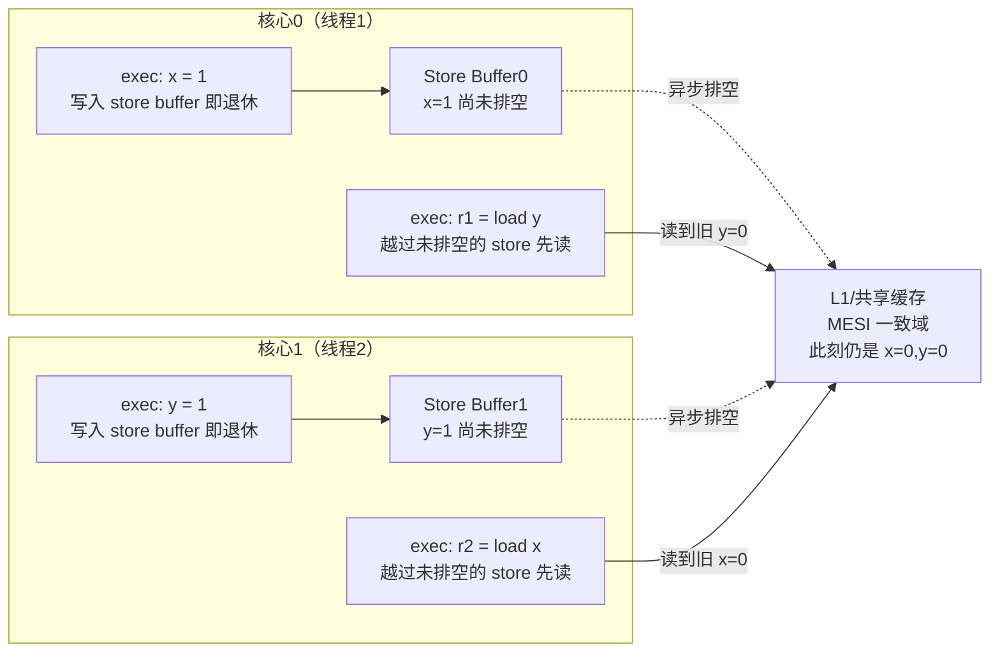
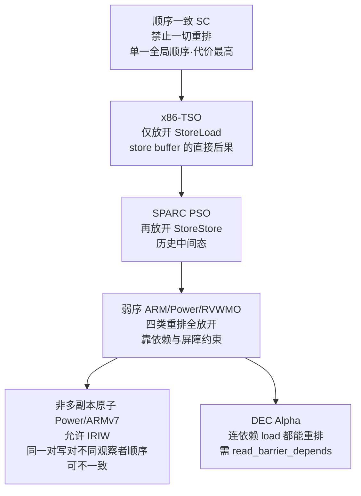
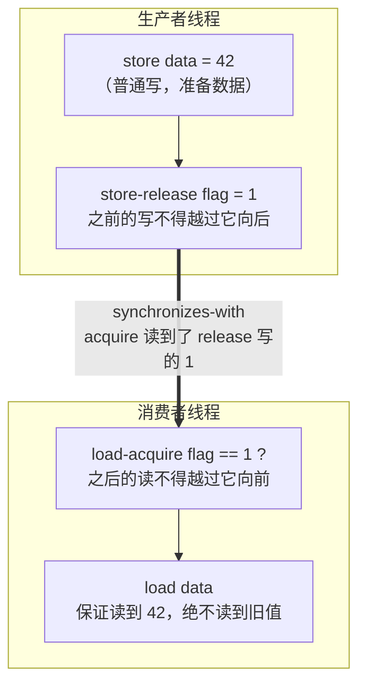

# CPU微架构与执行引擎（11）· 内存序与内存屏障

> [!abstract] TL;DR
> - 内存序（memory ordering / consistency）描述的是：一个核心的访存操作以何种顺序被**其他核心**观测到。它与缓存一致性（coherence）正交——一致性只保证"同一地址所有人最终看到同一写序列"，内存序管的是"**不同地址之间**的先后关系跨核如何呈现"。
> - 乱序来自两层：编译器重排 + 硬件重排（store buffer、乱序流水线、非多副本原子的互连）。即便"强序"的 x86-TSO 也允许 StoreLoad 重排，这是 store buffer 的直接后果，也是唯一被放开的一类。
> - 内存模型是硬件与软件的契约，按强弱排成谱系：SC → x86-TSO → ARM/Power/RISC-V 弱序。越弱越省晶体管、越省能、越快，代价是把"保证顺序"的责任甩给程序员。
> - acquire/release 是 release consistency 的核心：release 存储"发布"其之前的所有写，acquire 载入"获取"其之后的所有读，二者配对成 synchronizes-with，进而构筑 happens-before——这是无锁编程与 C++11 内存模型的地基。
> - 屏障分编译器屏障与硬件屏障两类；`volatile` 只挡编译器、不挡硬件、不保证原子，绝不是线程同步原语。正确姿势是用 `std::atomic` / 内核 `READ_ONCE`+`smp_*`，让编译器按目标架构填对指令。
> - DRF-SC 定理：无数据竞争的程序，其可观测行为等价于顺序一致——这是"只要同步写对，就不必关心弱序细节"的理论兜底，也是所有高级并发原语的正确性根基。

## 概述与定位

前面第 10 篇讲清了 MESI 如何让**单个缓存行**在多核间保持一致：任何时刻同一地址至多一个写者、读者读到的都是最新值，所有核心对"这一个地址的写历史"达成共识。很多人到此产生一个致命误解——"既然缓存一致了，多线程读写共享内存就天然正确了"。本篇要击穿的正是这个误解：**一致性（coherence）与内存序（consistency）是两个正交的问题**。一致性管一个地址，内存序管地址与地址之间的相对可见顺序。你可以有一台缓存完全一致、却允许两个核心对同一对变量的写入观察到相反顺序的机器——事实上 ARM 和 Power 在很长一段历史里就是这样。

用一句话定位本篇在系列中的位置：第 04 篇的乱序执行、第 07 篇的 ROB、第 08 篇的 Load-Store 队列解释了**单核内部**为什么指令不按程序顺序完成；第 10 篇的 MESI 解释了**跨核**如何就单地址达成一致；而本篇解释的是——当这些"单核乱序"的效果**泄漏到多核可见性**上时，会产生什么后果、我们如何用一份叫"内存模型"的契约去约束它、又如何用"内存屏障"这把手术刀去修补契约留下的缺口。它是把前十篇的微架构细节收束成"程序员能依赖的语义保证"的关键一环，也是理解无锁编程、C++/Java 并发、Linux 内核 RCU、乃至第 14 篇 Spectre 缓解（`lfence`）的共同前提。

为什么内存序如此反直觉？因为它是**性能优化的必然副产品**。store buffer 让写操作不必等缓存行到手就能"退休"、让流水线不被写停顿卡住；乱序引擎让 load 尽早发射以掩盖延迟；弱序互连让多核不必为"全局单一顺序"付出昂贵的同步。每一项都在提速，但每一项都在悄悄打破"程序写的顺序 = 别人看到的顺序"这个朴素假设。内存序，本质上就是硬件厂商和你签的一份**最低保证书**：写着"我会替你保住这些顺序，其余的顺序我不保证，你要自己用屏障买"。

## 原理与机制

### 乱序的两个源头：编译器与硬件

一个共享变量的写，从源码到被另一核心看见，要穿过两道会重排它的关口。第一道是**编译器**：优化器会把 load 提前（消除冗余读）、把 store 延后或合并、把循环不变量外提、把访存换序以利于流水。只要它认为"单线程语义不变"，它就有权重排——而单线程语义完全不覆盖"别的线程什么时候看到"。第二道是**硬件**：即便编译出的机器码顺序是 A 再 B，CPU 也可能让 B 先于 A 对外可见。二者叠加，才是完整的重排图景。很多初学者只想到硬件，写了 `asm volatile("":::"memory")` 挡住编译器却发现程序在 ARM 上照样错——因为硬件那一层没挡；反过来只加硬件屏障却让编译器把变量缓存进寄存器，也一样错。**正确同步必须同时封住两层**，这也是为什么 Linux 内核的 `READ_ONCE`/`WRITE_ONCE`（防编译器）和 `smp_mb`（防硬件）总是成对出现。

### store buffer：StoreLoad 重排的元凶

为什么连以"强序"著称的 x86 都允许一类重排？根源是 store buffer（第 08 篇讲过的写缓冲）。一条 store 执行时，若目标缓存行不在本核（或处于 Shared 需先发 RFO），等它到手可能要上百周期。为了不让流水线干等，CPU 把这笔写塞进 store buffer 就让指令退休，写值稍后异步排空（drain）到 L1。这带来两个效果：其一，本核后续的 load 可以**越过**尚未排空的、指向不同地址的 store 先去读内存——这就是 **StoreLoad 重排**；其二，本核的 load 若读的正是自己刚写、还压在 buffer 里的地址，会从 buffer 直接**转发**（store-to-load forwarding）拿到新值，而此时别的核心还看不到这个写。第一个效果是 x86-TSO 唯一放开的重排；第二个效果使 x86 不是严格"多副本原子"，但仍满足"**其他**核心多副本原子"（一个写一旦对任一其他核心可见，就对所有其他核心同时可见，只有写者自己能提前看到）。

经典的 Store Buffering（SB）石蕊测试把这一点暴露得淋漓尽致：

```text
初始 x = y = 0
线程1:            线程2:
  x = 1             y = 1
  r1 = y            r2 = x
问题：r1 == 0 且 r2 == 0 可能吗？
  顺序一致(SC)下：不可能（两个 store 必有先后，后发的那个线程一定能读到对方）
  x86-TSO / ARM / Power 下：可能——两个写都还在各自 store buffer 里，
                            两个 load 都读到了内存中的旧 0
修补：在两个 load 前各插一条全屏障（x86: mfence / lock；ARM: dmb ish），
     强制 store buffer 排空后再读
```



### 内存模型谱系与四类重排

把"允许哪几类重排"作为坐标，各家架构排成一条从强到弱的谱系。四类重排以"前一操作—后一操作"命名：LoadLoad、LoadStore、StoreStore、StoreLoad。

```text
模型            LoadLoad  LoadStore  StoreStore  StoreLoad  依赖load重排
顺序一致 SC       禁        禁         禁          禁          禁
x86-TSO          禁        禁         禁         【允许】      禁
SPARC PSO        禁        禁       【允许】     【允许】      禁
ARMv8/Power/RVWMO 允       允         允          允          禁(*)
DEC Alpha        允        允         允          允        【允许】(唯一!)
(*) 弱序机器仍保证有地址/数据依赖的 load 不被重排——Alpha 是历史上唯一的例外
```



**x86-TSO** 是被形式化得最彻底的模型（Sewell 等人 2009 年给出精确公理化）。它只放 StoreLoad 一类，直觉是"写晚一点没关系，只要读得到的都是某个全局store顺序里的值"。**ARM/Power** 则把四类全放开，还在早期放弃了多副本原子性，于是出现更诡异的 IRIW（Independent Reads of Independent Writes）：两个核心各写一个变量，另两个核心各自读这两个变量，可以观察到相反的顺序——仿佛两个写没有全局公认的先后。**Alpha** 是传说级的最弱：它连"有依赖关系的 load"都敢重排——`p = load(&ptr); v = load(p)` 中第二个 load 可能读到比第一个还旧的缓存，源于其分 bank 的缓存设计。这使 Alpha 成为唯一需要 `smp_read_barrier_depends()` 的架构，Linux 直到 4.15 前后彻底移除这个宏，正是因为不再需要迁就 Alpha 的这一变态行为。

## 屏障指令与 acquire/release 语义详解

### 从"禁止重排"到"发布/获取"：release consistency

全屏障（full fence）简单粗暴——它禁止四类重排里跨越它的一切组合，等价于把 store buffer 排空、把乱序窗口对这条边界封死。但它太贵：每次都排空 buffer、每次都串行化，等于放弃了弱序换来的性能。工程上真正想要的往往只是一个**单向**的、**有语义**的约束，这就是 **acquire/release**（源自 1990 年 Gharachorloo 的 release consistency）。

- **release 存储**：它之前（程序序）的所有读写，都不能被重排到它**之后**。它像一次"发布"——把此前准备好的数据一次性对外亮出。语义上是 `LoadStore + StoreStore` 屏障压在这条 store 之前。
- **acquire 载入**：它之后的所有读写，都不能被重排到它**之前**。它像一次"获取"——一旦拿到，后续操作必然看得到发布方发布的一切。语义上是 `LoadLoad + LoadStore` 屏障压在这条 load 之后。

一个绝妙的记忆模型叫"**蟑螂屋**"（roach motel）：操作可以从外面**进入**临界区（穿过 acquire 往下、穿过 release 往上），但绝不能从里面**逃出**。临界区只进不出，正好是锁要的语义。注意 acquire/release **不**提供 StoreLoad 顺序，所以"一个 release 后面跟一个 acquire"仍可被重排——想要那种顺序必须上 seq_cst（全屏障）。

### synchronizes-with 与 happens-before

acquire/release 单独看只是"本线程内的单向栅栏"，真正让它跨线程生效的是配对规则：**若某个 acquire 载入读到了某个 release 存储写入的值，则该 release 与该 acquire 之间建立 synchronizes-with 边**。把线程内的程序序（sequenced-before）与跨线程的 synchronizes-with 取传递闭包，就得到 **happens-before** 偏序。凡是 happens-before 关系确定的两个操作，其可见性就有保证。消息传递（Message Passing, MP）是这套语义最典型的用例：



在弱序机器上，若没有这对 release/acquire：生产者的 `data=42` 与 `flag=1` 可能被 StoreStore 重排，使 `flag` 先可见；消费者的两次 load 也可能被 LoadLoad 重排，先读 `data`。两头任一处出错，消费者就会看到 `flag==1` 却读到 `data` 的旧值——一个经典的、只在 ARM 上复现而在 x86 上"侥幸正确"的 bug。x86-TSO 因为天然保住 StoreStore 与 LoadLoad，MP 无需硬件屏障（只需编译器屏障），这正是大量"在 x86 上跑得好好的"无锁代码一移植到手机 ARM 就崩的根因。

### 各架构屏障指令对照

```text
语义/用途        x86               ARMv8(AArch64)          Power             RISC-V
全屏障(StoreLoad) mfence / lock前缀  dmb ish                 sync (hwsync)     fence rw,rw
acquire          （load即acquire）  ldar 或 ldapr(v8.3)     lwsync / isync+依赖 fence r,rw / .aq
release          （store即release） stlr                    lwsync            fence rw,w / .rl
仅StoreStore      sfence(仅NT写)     dmb ishst               lwsync            fence w,w
仅LoadLoad        lfence(*)         dmb ishld               lwsync            fence r,r
取指同步(改码)     （序列化指令）      isb                     isync             fence.i
(*) x86 的 lfence 对普通 WB 内存排序近乎 no-op，其现代主战场是"投机执行屏障"，见安全一节
```

几点值得展开的深层差异。其一，**x86 的不对称**：因为 load 天生 acquire、store 天生 release，C++ 的 acquire 载入和 release 存储在 x86 上都编译成一条普通 `mov`，成本为零；只有 seq_cst 的 store 需要额外的 `mfence`（或用 `xchg` 这类 locked 指令自带全屏障），也就是"代价全压在 store 侧"。其二，**ARMv8 的 RCsc vs RCpc**：`ldar`/`stlr` 提供的是 RCsc（顺序一致的 acquire/release，release 与 acquire 之间也维持 SC），比 C++ 的 `memory_order_acquire`（RCpc）语义更强、也更贵；为精确匹配 C++ 语义，ARMv8.3 才补上 `ldapr`（Load-AcquirePC）。其三，**Power 的 lwsync**：它是"轻量 sync"，一次搞定 LoadLoad/LoadStore/StoreStore 却**不**管 StoreLoad，正好是 acquire/release 想要的形状，比全 `sync` 便宜得多。其四，**累积性（cumulativity）**：Power 的 `sync` 是累积屏障，它不仅排本核的操作，还把"本核已观察到的其他核的写"一并纳入排序，这对传递型 MP（WWC/ISA2 石蕊测试）的正确性至关重要，也是弱序机器上"屏障要放对、还要够强"的微妙所在。其五，**ARMv8 的多副本原子化转向**：ARM 在 v8 架构的一次修订中把内存模型从"非多副本原子"改成"其他多副本原子"，从此 IRIW 的诡异结果在合规实现上被禁止——这是把"过度弱"回收一点、以降低软件负担的现实妥协。

### C++11 内存序与到硬件的映射

语言层面，C++11/C11 用六档 `memory_order` 把上述硬件语义抽象成可移植 API：

```text
memory_order_relaxed  只保证该原子操作自身的原子性，不提供任何跨变量顺序
memory_order_consume  依赖序（比 acquire 弱，只约束有数据依赖的后续读）——编译器普遍"提升"为 acquire
memory_order_acquire  获取语义（用于读，如锁的加锁、标志位的消费端）
memory_order_release  发布语义（用于写，如解锁、标志位的生产端）
memory_order_acq_rel  读改写(RMW)兼具两者
memory_order_seq_cst  顺序一致（默认档）：所有 seq_cst 操作存在单一全局顺序
```

`consume` 是个有故事的失败设计：它本想利用弱序机器"天然保住依赖 load"的免费特性（RCU 的核心正是靠指针依赖发布数据），从而在 Power/ARM 上比 acquire 更省一条屏障。但编译器无法在各种优化（公共子表达式消除、值预测）中稳定跟踪"依赖链"，一旦依赖被优化断裂就会出错，于是所有主流编译器干脆把 `consume` 实现成 `acquire`。C++17 起官方也建议避免使用它。这段历史是"硬件给的免费保证，语言却兜不住"的经典案例，值得逆向者在读到 RCU 相关代码时心里有数。

底层的正确性定理是 **DRF-SC**（Data-Race-Free implies Sequential Consistency）：如果程序在 SC 语义下不存在数据竞争（所有对共享变量的冲突访问都被同步关系隔开），那么它在真实弱序机器上的所有可观测行为，都等价于某个 SC 执行。换言之，**只要你用原子和锁把同步写对、消灭了数据竞争，就完全不必关心底层是 x86 还是 ARM、store buffer 多深、互连多弱**——编译器会替你在每个架构上填对屏障。这就是整套语言内存模型的价值：把"面对 N 种硬件模型的噩梦"收敛成"只需保证无数据竞争"这一条可检验的纪律。

## 工具视角与实战

### 在反汇编里认出屏障

看一段无锁代码到底在目标架构上加没加屏障，最直接的办法是读编译产物。把 `std::atomic<int> flag; flag.store(1, std::memory_order_release);` 丢进 Compiler Explorer（godbolt）：x86-64 下你会看到光秃秃的一条 `mov`（release 免费）；若改成 `seq_cst` 的 store，则尾随一条 `mfence` 或整体变成 `xchg`。同一段码切到 `-target aarch64`，release 存储会变成 `stlr`，acquire 载入变成 `ldar`，全屏障处出现 `dmb ish`。逆向时反过来：在 ARM 反汇编里看到 `ldar`/`stlr`/`dmb`、在 x86 里看到 `lock` 前缀或 `mfence`，基本就是"这里有跨线程同步"的强信号，往往标记着锁、引用计数、无锁队列的关键边界。`objdump -d`、`llvm-mc`、IDA/Ghidra 都能看到这些助记符；注意 x86 的原子性来自 `lock` 前缀而非单独指令，容易被粗看漏掉。

### 内存模型的形式化工具

真要验证一段无锁算法在某模型下是否正确，靠人脑推弱序几乎必错。业界标准工具是剑桥/INRIA 团队的 **herd7 + litmus7**（diy 套件）：你用简洁的 litmus 语法写下多线程访存片段与"禁止/允许"的末态断言，herd7 依据用 **cat 语言**写就的模型规范（x86-TSO、AArch64、PPC、RISC-V 均有官方 cat 模型）**穷举**所有合法执行，告诉你目标末态可不可达；litmus7 则把同一测试编译成真实二进制，在真机上疯狂跑几百万次去**实测**能否复现。前者是"规范允许吗"，后者是"这颗芯片真的会吗"，二者互补。Linux 内核自带 **LKMM**（`tools/memory-model/`），用 cat 精确定义了内核自己的内存模型，配套 `klitmus` 能把 litmus 测试跑进内核态——这是理解 `smp_mb`/`smp_load_acquire`/RCU 语义的权威参照。

### 动态检测：数据竞争与竞态

- **ThreadSanitizer（TSan）**：`-fsanitize=thread` 编译，运行期基于 happens-before 影子内存检测数据竞争。它抓的是"两个线程冲突访问且无同步边"这一 DRF 违背，恰好对应 DRF-SC 定理的前提。它不理解你的无锁算法对不对，但能可靠地告诉你哪里漏了同步。
- **perf c2c**（cache-to-cache）：定位伪共享与缓存行乒乓，虽不直接查内存序 bug，却常与"为省屏障而滥用 relaxed 导致的争用"同框出现。
- **压力复现**：弱序 bug 有极强的偶发性与平台相关性，x86 上百万次不复现的问题，换到多核 ARM（如服务器 Graviton、手机 SoC）可能几秒就炸。CI 里加一台 ARM 机器专跑并发压力测试，是把这类 bug 挡在生产线外的务实手段。

### 一个反复咬人的实战陷阱：双重检查锁定（DCL）

```text
if (instance == nullptr) {        // 快路径：无锁读
    lock();
    if (instance == nullptr)
        instance = new Singleton(); // 危险：分配、构造、发布指针三步
    unlock();
}
return instance;
```

这段"经典优化"在弱序（甚至仅编译器重排）下是错的：`instance = new Singleton()` 隐含三步——分配内存、调用构造函数、把指针写入 `instance`。若"写指针"被重排到"构造完成"之前，另一线程走快路径就会看到**非空的 instance 却指向尚未构造完的对象**，随后访问其成员即读到垃圾。修法是把 `instance` 声明为 `std::atomic`，发布端用 `store(p, release)`、消费端用 `load(acquire)`，让"构造完成"happens-before"读者拿到指针"；或者干脆用 `std::call_once`/静态局部变量（C++11 起保证线程安全初始化）。这个例子也点破了 `volatile` 的无力——把 `instance` 标 `volatile` 既不阻止硬件重排也不建立 happens-before，Java 5 之前的 `volatile` 甚至语义更弱，正是 JSR-133 重修 JMM 才让 Java 的 `volatile` 具备了 acquire/release + 禁重排的强语义（Java `volatile` ≈ C++ seq_cst，与 C 的 `volatile` 貌合神离，切勿混淆）。

## 安全性与正确使用

内存序的"安全"有两副面孔：一副是**正确性安全**（用错屏障导致的并发 bug 本身就是安全隐患），一副是**微架构安全**（屏障被用作投机执行的缰绳）。

**正确性维度的误用与加固边界**。最常见的三类误用：其一，**该 acquire/release 处用了 relaxed**——图省事用 `memory_order_relaxed` 传递"数据已就绪"标志，等于没有 happens-before，读者可能读到半成品；relaxed 只该用于纯计数器（如统计、引用计数的递增，但递减释放时仍需 release+acquire 配对）这类不承载"发布数据"职责的场景。其二，**只封了编译器没封硬件，或反之**——`volatile` 只挡编译器重排、不提供原子性、不建立跨核顺序，用它做线程同步是教科书级错误；反过来手写内联汇编屏障却让编译器把变量缓存进寄存器，读者永远读不到更新。其三，**屏障放错位置或强度不足**——在弱序机器上把本该 release 的地方用了仅 StoreStore 的屏障（漏了 LoadStore）、或忽视了累积性导致传递可见性失效。加固的根本原则是**不要自己发明同步**：优先用 `std::mutex`、`std::atomic` 高档接口、内核 `smp_load_acquire`/`smp_store_release`/RCU 这些经过形式化验证的原语，把"填对屏障"的责任交给编译器与内核维护者；只有在 profiler 明确指出锁是瓶颈、且你能用 herd7 证明无锁方案在目标模型下正确时，才下沉到手写 acquire/release。

**微架构维度：屏障作为投机屏障**。x86 的 `lfence` 在普通 WB 内存的排序上近乎 no-op，但它有一个副作用被用来救命——它**序列化投机执行**，保证其后的指令不会在其前的指令（尤其是分支/边界检查）retire 之前被投机取数。这正是 Spectre v1（边界检查绕过）的官方缓解之一：在数组越界检查与后续依赖访问之间插 `lfence`，切断"投机越界读 → 依据秘密值访问缓存 → 侧信道泄漏"的链条（详见 [[14.微架构侧信道：Spectre与Meltdown|第14篇]]）。这层含义提醒我们：屏障不只是"内存可见顺序"的工具，在推测执行时代它还是"信息流是否被投机泄漏"的闸门。但要清醒——`lfence` 缓解 Spectre 的代价极高（等于放弃该点的投机并行），只应精准点在真正的信任边界上，全局滥撒会把 CPU 打回顺序执行的性能深渊；现代更倾向用编译器自动插桩（如 `-mspeculative-load-hardening`）或架构级的 CSDB/SB（ARM 的投机屏障）做更精细的控制。

**正确使用的心智清单**：写共享数据用 release 发布、读用 acquire 获取，二者必须配对且读到的确实是发布写的值；需要多个变量间存在单一全局顺序（如 Dekker 互斥、seqlock 的某些实现）时才上 seq_cst；纯私有或已被锁保护的数据不需要任何原子语义；跨设备/DMA 的内存要用更强的 `dsb`/`sync`（涉及可见性到设备而非仅到其他核）。始终记住 DRF-SC 的承诺是**有条件**的：它只在"无数据竞争"时成立，一旦你留下一个未同步的冲突访问，整个程序的行为就滑出 SC 保护、进入"未定义行为"的深渊，编译器有权做出任何假设——这才是内存序误用最危险的地方：它往往不是"偶尔算错一个值"，而是让整个程序的语义地基崩塌。

## 小结

内存序是把前十篇所有"单核乱序""跨核一致"的微架构机制，收束成一份程序员可依赖之契约的关键抽象。它与缓存一致性正交：一致性管单地址的最终共识，内存序管多地址间相对可见顺序。乱序有编译器与硬件两个源头，必须同时封堵。以 store buffer 为代表的性能结构直接催生了 StoreLoad 重排，使 x86-TSO 也非严格顺序一致；沿谱系向下，SPARC、ARM、Power、RISC-V、乃至变态的 Alpha 逐级放开更多重排、放弃多副本原子，以晶体管和能耗换速度，代价是把保序责任转嫁给软件。acquire/release 以"发布/获取"的单向栅栏与 synchronizes-with/happens-before 的配对规则，提供了比全屏障便宜得多的精确同步；C++11 六档 `memory_order` 与 DRF-SC 定理，则把"面对 N 种硬件模型"收敛成"只需消灭数据竞争"这一条可检验纪律。工具上，godbolt 读屏障、herd7/litmus 验模型、TSan 抓竞争、LKMM 定义内核语义，构成完整的验证闭环。安全上，屏障既是并发正确性的手术刀，也是推测执行时代封堵投机泄漏的闸门——但两种用途都讲究"放对、放准、够强、不滥"。下一篇转向地址转换的加速结构 TLB，看虚拟内存如何在不拖垮流水线的前提下完成每一次访存的地址翻译。

## 相关阅读

- 本系列上下文：[[00.CPU微架构与执行引擎总览|系列总览]]、[[10.缓存一致性协议MESI|第10篇·缓存一致性协议MESI]]（本篇的正交前提）、[[08.存储子系统：Load-Store队列|第08篇·Load-Store队列]]（store buffer 与 StoreLoad 重排之源）、[[04.乱序执行与Tomasulo算法|第04篇·乱序执行]]、[[07.投机执行与重排序缓冲ROB|第07篇·ROB]]、[[14.微架构侧信道：Spectre与Meltdown|第14篇·Spectre与Meltdown]]（lfence 作为投机屏障）
- 汇编层承接：[[21.Asm/28 原子操作与内存模型]]（语言/指令层的原子与内存序实操）、[[21.Asm/39 缓存与缓存一致性]]、[[21.Asm/38 MMU与页表设置实战]]
- 防护呼应：[[34.现代二进制防护机制/09.Intel CET]]、[[34.现代二进制防护机制/13.MTE内存标签扩展]]
- 权威文献：《A Primer on Memory Consistency and Cache Coherence》(Nagarajan, Sorin, Hill, Wood)；McKenney《Memory Barriers: a Hardware View for Software Hackers》；Sewell 等《x86-TSO: A Rigorous and Usable Programmer's Model》(CACM 2010)；C++ 标准 `[atomics.order]`；Intel SDM Vol.3 §8–9；Arm ARM 内存模型章节（B2）；Linux 内核 `tools/memory-model/` 与 `Documentation/memory-barriers.txt`；Preshing "Weak vs. Strong Memory Models" 系列博文

[[00.CPU微架构与执行引擎总览|⬆ 系列总览]] | [[10.缓存一致性协议MESI|← 上一章]] | [[12.TLB与地址转换加速|→ 下一章]]
