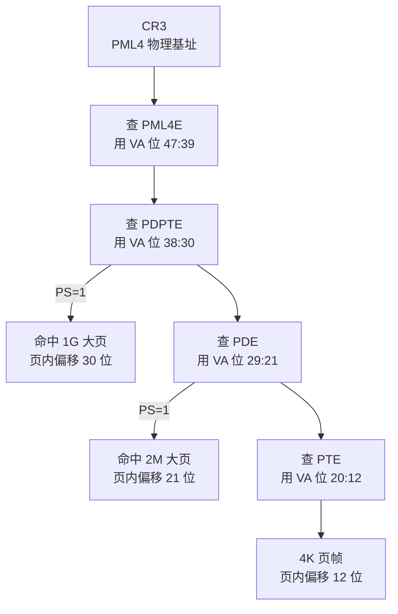
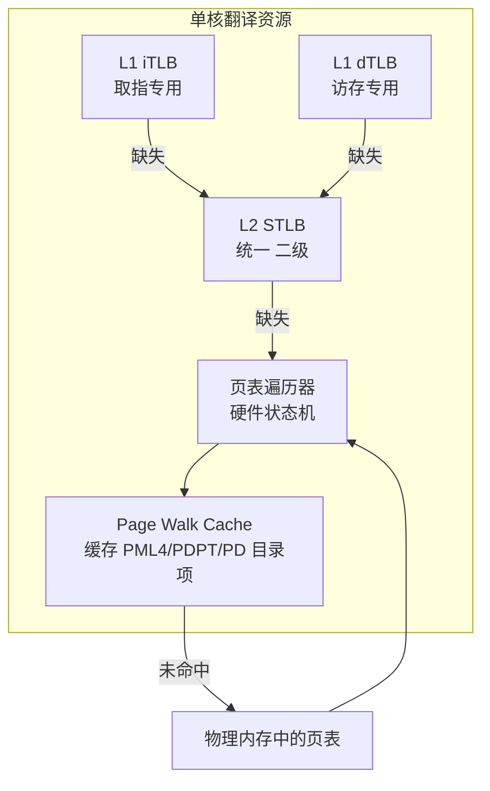
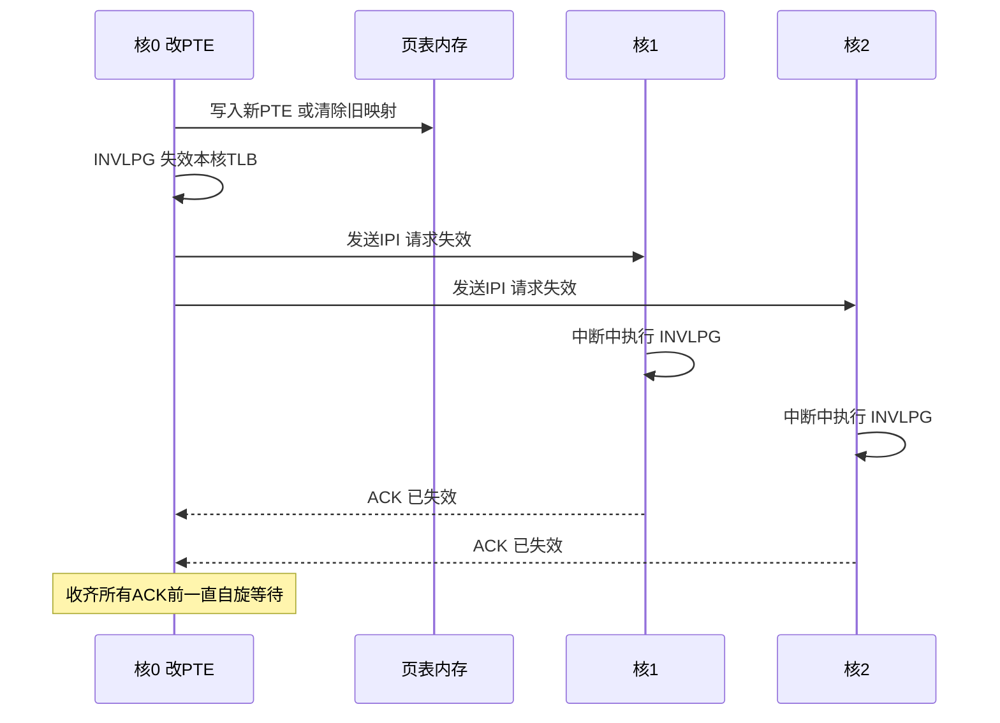
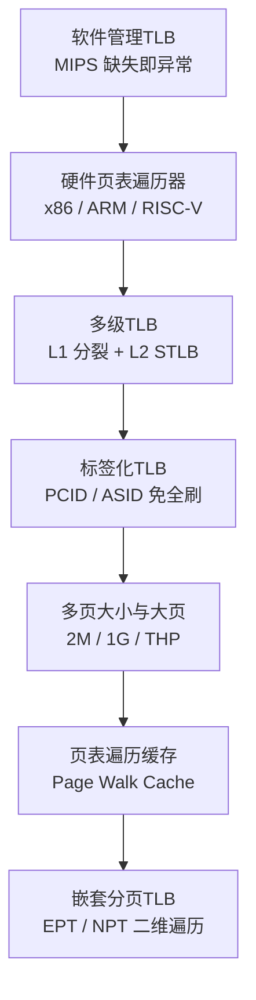

# CPU微架构与执行引擎（12）· TLB与地址转换加速

> [!abstract] TL;DR
> - 每一次取指与访存都隐含一次虚拟地址到物理地址（VA→PA）的翻译；页表是一棵稀疏的多级基数树，一次页表遍历（page walk）是 3~5 次相互依赖的内存访问，慢到必须缓存——TLB 就是缓存「最终翻译结果」的专用结构，坐在地址生成与缓存访问之间的关键路径上。
> - 现代 TLB 是多级的：L1 拆成 iTLB/dTLB（小、快、按页大小分数组），L2 STLB 统一且更大；页表遍历器（MMU）自身还带 Page Walk Cache 缓存中间级目录项，让缺失后的遍历不必每次都从 CR3 在内存里重头走。
> - TLB 硬件不做一致性（与数据缓存的 MESI 截然不同）：改了页表，软件必须显式失效对应项；多核还要 TLB shootdown（x86 靠 IPI、ARM 靠广播 TLBI），这是 MMU 编程最隐蔽的 bug 来源，也是内核可扩展性的老瓶颈。
> - 上下文切换不必清空整个 TLB：PCID（x86）/ASID（ARM、RISC-V）给表项打上地址空间标签，让多个进程的翻译共存；全局位（G）让内核映射跨切换常驻。
> - 大页（2M/1G）是对抗「TLB reach 不足」的核心手段：一个表项覆盖 512× 乃至 262144× 的内存，且遍历层数更少；代价是碎片、内存膨胀与 THP 抖动，Redis 这类 fork 敏感负载常主动关闭透明大页。
> - 翻译机制是一批漏洞的温床：Meltdown 催生的 KPTI 靠切换页表隔离内核、又靠 PCID 把它的 TLB 冲刷代价压回可接受区间；TLBleed、AnC 则把 TLB 争用与页表遍历本身变成了侧信道。

## 概述与定位

在冯·诺依曼机器的抽象里，程序拿着地址去读写内存，仿佛地址就是内存条上的物理位置。但自从虚拟内存成为标配，这个抽象就被撑开了一道缝：程序看到的是虚拟地址（VA），内存控制器认的是物理地址（PA），二者之间隔着一层由操作系统维护、由硬件强制执行的映射。虚拟内存带来的好处是根本性的——进程间隔离（各自独立的地址空间）、地址无关的重定位（同一份可执行文件在不同进程映射到相同 VA）、内存超额分配与按需换页（overcommit、demand paging）、以及权限保护（只读、不可执行）。这些能力的代价，是**每一次访存、每一次取指，都要先做一次 VA→PA 的翻译**。翻译若慢，整台机器就慢；翻译若错，隔离与保护就形同虚设。本篇要讲的，正是硬件如何把这道本可能拖垮一切的翻译，加速到几乎「免费」的程度，以及这份加速在性能与安全上留下的所有痕迹。

把本篇放回系列脉络：第 08 篇的 Load-Store 队列负责算出访存指令的**虚拟地址**，第 09 篇的缓存层级负责用**物理地址**去命中数据。这两者之间，正好卡着地址翻译这一环——TLB 与页表遍历器就是连接「VA 已知」与「PA 可用」的桥。更微妙的是，翻译并不是缓存访问之前一个纯粹串行的前置步骤：现代 L1 缓存普遍采用 VIPT（虚拟索引、物理标签）组织，利用「页内偏移在 VA 与 PA 之间恒等」这一事实，让 TLB 查找与缓存组索引**并行**进行，等 TLB 吐出物理页号时正好用来比对缓存标签。于是翻译被巧妙地藏进了缓存访问的阴影里——只要 TLB 命中。一旦 TLB 缺失，这层遮蔽就被掀开，几百个周期的页表遍历直接暴露在关键路径上。理解 TLB，本质上就是理解硬件如何让「TLB 命中」成为绝对主流事件。

需要提前划清边界，以免与相邻篇章重复：**各架构的页表格式细节、启用 MMU 的具体步骤、TLB 失效指令的逐条对照**（x86 的 `invlpg`、ARM 的 `tlbi`、RISC-V 的 `sfence.vma`、LoongArch 的 `invtlb`、MIPS 的软件管理），已在 [[21.Asm/38 MMU与页表设置实战]] 里横向铺开，本篇不再复述五家页表的位定义，只在需要讲原理时引用其结论；**缓存本身的组相联、替换策略、VIPT 别名**属于第 09 篇；**缓存一致性协议**属于第 10 篇（本篇会反复用它作对比，因为 TLB 恰恰**不**走这套）；**内存序**属于第 11 篇；**虚拟化下的两级翻译（EPT/NPT）** 的完整机制留给系列 28，本篇只讲它对翻译开销的冲击；**侧信道的武器化细节**留给第 14、15 篇，本篇只讲 TLB/页表遍历作为泄露信道的微架构根因。本篇聚焦的是翻译加速这一件事的微架构实现：TLB 长什么样、遍历怎么走、大页怎么帮忙、以及这一切在 perf 里留下的足迹和在攻防上开的口子。

## 原理与机制

要理解 TLB 为什么必须存在，得先算清楚「不用 TLB」有多贵。设想 x86-64 的四级分页，一个 48 位虚拟地址要经过 PML4→PDPT→PD→PT 四级目录逐级索引，每一级都要读一个 8 字节的页表项（PTE），而下一级目录的物理基址正藏在上一级刚读出的 PTE 里——这是一条**严格数据依赖的指针追逐链**：不读出 PML4E 就不知道 PDPT 在哪，不读出 PDPTE 就不知道 PD 在哪。四级意味着四次串行、相互依赖的内存访问，每一次都可能在缓存里缺失、进而真的走一趟内存（上百周期）。如果每条访存指令都老老实实走一遍完整遍历，内存子系统的有效延迟会被放大数倍，虚拟内存将是一个没人敢开的功能。

那为什么可以缓存？因为翻译具有极强的**局部性**。一个 4KB 页里装着上千个字节，一段顺序执行的代码、一个被循环扫描的数组、一次函数调用的栈帧，往往长时间落在同一个或少数几个页里——同一个 VA→PA 映射会被复用成千上万次。既然映射本身变化极慢（页表由 OS 修改，频率远低于普通数据写），把「刚算出来的翻译结果」存进一个小而极快的表里、下次直接查，就是顺理成章的事。这个表就是 TLB（Translation Lookaside Buffer，地址转换后备缓冲）。它本质上是一个专门缓存「VPN→PPN + 权限」的缓存，遵循与第 09 篇数据缓存相同的设计轴（相联度、替换策略、多级），但缓存的内容是翻译、且**不参与硬件一致性**——这两点差异是本篇后续所有故事的分水岭。

下面这张图是地址翻译的完整数据通路，也是本篇的骨架：地址生成单元（AGU）算出 VA 后，先查 L1 TLB；命中则约一个周期拿到 PA；缺失则下探 L2 STLB；再缺失才唤醒硬件页表遍历器（MMU），而遍历器自己还先问 Page Walk Cache（缓存了 PML4/PDPT/PD 等上层目录项），只有连它都没命中，才真的去物理内存里读页表；无论从哪一步拿到结果，都会回填 TLB，供后续复用。


这里有一个架构分岔值得先讲清楚：**TLB 缺失后由谁来填**。x86、ARM、RISC-V 走的是**硬件页表遍历**——遍历器是 CPU 里的一个专用有限状态机，TLB 缺失时它自动接手，沿页表把翻译走出来、回填 TLB，整个过程对软件透明，程序甚至察觉不到发生过一次缺失。MIPS 则走另一条极端：**纯软件管理 TLB**，TLB 缺失直接触发一个异常，跳进操作系统的 TLB 重填处理程序，由软件读页表、执行 `tlbwi` 把表项写进 TLB。硬件遍历的优点是快、且不打断流水线；软件管理的优点是页表格式完全由 OS 定义、极其灵活（可以用任意数据结构而非固定的多级目录）。历史选择了硬件遍历成为主流，原因很直接：软件重填要走一次异常进出、要保存恢复上下文，其固定开销远大于硬件状态机走几步内存；当缺失频繁时，软件方案会被异常开销拖垮。LoongArch 则是两者皆备（老核软件重填、新核带硬件 walker HPTW），这些架构差异在 [[21.Asm/38 MMU与页表设置实战]] 里有完整对照，此处不再展开。

还有一个常被忽略、却直接关系正确性的机制：**访问位（A）与脏位（D）的更新**。操作系统要回收内存、要决定哪些页可以换出、哪些脏页必须先写回，靠的就是 PTE 里的 A/D 位。在硬件遍历的架构上，遍历器在成功翻译时会把 A 位置 1、在这次访问是写时把 D 位置 1——注意这是一次对内存中 PTE 的**原子读-改-写**，而不是随手一写，因为可能有多核同时在动同一个 PTE。软件管理的架构则把 A/D 更新也交给缺失异常处理去做。这个细节之所以重要，是因为它意味着「一次看似只读的 Load，也可能悄悄对页表所在的缓存行发起一次写」，这既是某些跨核伪共享的隐秘来源，也是后文侧信道能观测到「翻译确实发生过」的物理基础。

## 结构、遍历与大页详解

这一节展开本篇的三个技术核心，恰好对应种子里点名的三件事：页表遍历怎么走、TLB 结构长什么样、大页如何改变游戏规则；并顺带把标签化、一致性与虚拟化这三条与之纠缠的支线讲透。

### 多级页表遍历：一次穿过物理内存的指针追逐

先把「为什么是多级」讲清楚，这是理解遍历开销的前提。假设用一张扁平页表覆盖 48 位 VA、4KB 页，需要 2^(48-12) = 2^36 个表项，每项 8 字节，就是 512 GB——光页表本身就塞不进内存，而且绝大多数进程只用到地址空间的极小一角，这张巨表 99.99% 是空的。多级页表（radix tree）的精髓就是**按需分配、稀疏铺开**：只有真正映射了内容的区域，才需要分配对应的下级目录，未使用的高层目录项直接标为无效，一整棵子树都不必存在。代价则是把「一次索引」换成了「逐级索引」——覆盖范围越大、级数越多，遍历越长。这是一个典型的空间-时间权衡：用遍历时间换页表空间。

x86-64 四级分页的 VA 切分如下，每级取 9 位索引一张 512 项的目录，页内偏移固定 12 位：

```text
x86-64 四级分页，48 位虚拟地址的切分（每级 9 位，索引 512 项目录）：

  47      39 38      30 29      21 20      12 11          0
 +---------+---------+---------+---------+--------------+
 | PML4 idx| PDPT idx|  PD idx |  PT idx |   页内偏移   |
 |  9 bit  |  9 bit  |  9 bit  |  9 bit  |    12 bit    |
 +---------+---------+---------+---------+--------------+
      |         |         |         |             |
   CR3→PML4  →PDPTE    →PDE      →PTE       → +offset = PA

  2M 大页：PDE.PS=1，遍历止于 PD，页内偏移 = 低 21 位
  1G 大页：PDPTE.PS=1，遍历止于 PDPT，页内偏移 = 低 30 位
  5 级分页(LA57)：再加 PML5 idx = VA 位 56:48，需 CR4.LA57=1
```

遍历的过程就是沿着 CR3 指向的 PML4 起步，用 VA 的高位段逐级索引、逐级读出下一级基址，直到读到叶子 PTE、拼上页内偏移得到 PA。关键在于**这四次内存访问是严格相互依赖的**——它们不能并行、不能乱序，只能一个接一个，任何一级在缓存里缺失都会把整条链拖长。这就是页表遍历慢的根本原因，也是 TLB 存在的全部理由。



正因为遍历慢，硬件在 TLB 之外又加了一层专门的加速结构：**Page Walk Cache**（Intel 术语「paging-structure caches」，AMD 称 PWC）。它缓存的不是最终翻译，而是遍历**中间级**的目录项（PML4E、PDPTE、PDE）。为什么这一层特别值：因为上层目录的局部性极强——一个 PML4E 覆盖 512 GB、一个 PDPTE 覆盖 1 GB、一个 PDE 覆盖 2 MB，程序在相当长的地址范围里反复遍历时，走到的上层目录项往往是同几个。于是即便 TLB 缺失、必须走一遍遍历，遍历器多数时候也能从 PWC 直接拿到前几级、只需为最后一两级真的访问内存，把「四次依赖访存」压缩成「一两次」。这层缓存对软件同样透明，但它的存在解释了一个反直觉现象：TLB 缺失的代价并不是恒定的几百周期，而是高度依赖 PWC 命中情况、呈现出很宽的分布——这一点在后文的 perf 实测与 AnC 侧信道里都会再次出现。

### TLB 层级结构：为何拆分、为何分级、为何按页大小分数组

TLB 的组织几乎复刻了数据缓存的多级思路，但每一处拆分都有其独特理由。**L1 拆成独立的 iTLB 与 dTLB**：取指发生在流水线前端、访存发生在后端 AGU/Load 单元，二者在同一周期并行进行，若共用一个 TLB 就会互相抢端口；拆开各自独占，正好呼应第 09 篇里 L1I 与 L1D 的分裂。L1 TLB 很小（几十项）、极快（约一个周期），常用较高相联度甚至全相联，因为它必须在关键路径上单周期给出结果。**L2 STLB（统一二级 TLB）** 则更大（上千项）、稍慢（约 7~8 周期），把取指侧与访存侧的翻译工作集合并到一个大结构里摊薄面积成本，正如 L2 缓存统一 i/d 一样。



一个 TLB 表项里存的东西，比数据缓存行多出好几样，每一样都对应一条正确性或性能约束：

```text
TLB 表项概念示意（具体位宽随微架构而异）：
+-------+----------+----------+-------+------+---------+-----+------+
| Valid | VPN 标签 | PPN 物理 | 权限  | PCID | 页大小  | G位 | A/D  |
|  1b   | 虚拟页号 | 物理页号 | RWXU  | ASID | 4K/2M/1G|全局 |访问/脏|
+-------+----------+----------+-------+------+---------+-----+------+
查找：用 VA 的 VPN 并行比较各路标签(并匹配 PCID)，命中即输出 PPN 与权限位
```

这里藏着一个 TLB 特有、数据缓存没有的设计难题：**如何在一个组相联结构里同时容纳多种页大小**。组相联缓存靠 VA 的中间若干位做组索引，但对 TLB 而言，「哪几位是页号、哪几位是页内偏移」取决于页大小——而页大小要等翻译完才知道，这就成了鸡生蛋。业界有三条解法：其一，**为每种页大小设独立的小数组**，查找时并行探测（这正是 L1 dTLB 常见的做法，例如给 4K、2M、1G 各配一小块）；其二，**全相联**，干脆不用索引、所有项并行比较，代价是容量受限；其三，**统一的大 STLB 用一些技巧**（如偏斜索引、哈希、或按最小页粒度索引再存页大小）同时容纳 4K 与 2M。以业界常被引用的 Skylake 为例（仅作数量级示意，各世代差异很大，精确值应以厂商优化手册或 WikiChip、Agner Fog 的实测为准）：L1 dTLB 约 64 项 4K、32 项 2M、4 项 1G；L1 iTLB 约 128 项 4K 加 8 项 2M；L2 STLB 约 1536 项、4K 与 2M 共享。这些数字本身不必背，但「大页项数远少于 4K 项数」这个结构事实，直接决定了后文大页的收益边界。

### 标签化 TLB：PCID / ASID 与全局位

设想没有标签的 TLB：每次上下文切换（进程 A 切到进程 B），因为两个进程用的是同一批 VA 但映射到不同 PA，旧的 TLB 项全部作废，硬件只能把非全局项**全部冲刷**。切换后进程 B 面对一个空 TLB，头一批访存全部缺失、全部触发遍历——一场「翻译风暴」。而上下文切换在现代系统里极其频繁（时间片轮转、系统调用、中断），这场风暴的累计代价相当可观。

解法是给 TLB 项打上**地址空间标签**：x86 叫 PCID（Process Context Identifier，12 位，需 `CR4.PCIDE` 使能，放在 CR3 低 12 位），ARM 与 RISC-V 叫 ASID（ARM 可配 8 或 16 位、放在 TTBR，RISC-V 放在 satp）。打了标签，多个进程的翻译就能在同一个 TLB 里共存，切换地址空间时只要换标签、不必冲刷（x86 上写 CR3 时把最高位置 1 即表示「保留 TLB」）。此外还有**全局位（G）**：内核映射在所有进程里都相同，把它们标记为全局、不打进程标签，则任何切换都不会动它们——内核代码与数据的翻译因此常驻 TLB，省下每次陷入内核后重新遍历的开销。

标签化不是免费午餐，它带来一个必须由软件小心处理的**标签回收陷阱**：PCID/ASID 的位宽有限（x86 只有 4096 个），当进程数超过标签数、OS 不得不把某个旧标签复用给新地址空间时，**必须先把该标签对应的所有 TLB 项冲刷掉**，否则新进程会读到旧进程残留的翻译——这既是数据泄露、也是完整性破坏。x86 提供 `INVPCID` 指令做精细失效（按 PCID、按地址、或全部）。这个陷阱在下一节「安全性」里还会以更严重的形式出现。

### TLB 一致性与 shootdown：软件必须扛起的责任

这是 TLB 与数据缓存最根本的差异，也是 MMU 编程最容易出错的地方：**TLB 不由硬件维护一致性**。第 10 篇讲的 MESI 让多核的数据缓存自动保持一致——一个核写了某缓存行，其他核的副本自动失效。但 TLB 没有这套。当软件修改了内存里的一个 PTE（比如解除一段映射、改动权限），CPU 里已经缓存的旧翻译**不会自动失效**，硬件会继续用那份过时的映射，直到软件明确告诉它「这条作废了」。

为什么硬件不给 TLB 也上一套一致性协议？权衡使然：PTE 的修改频率远低于普通数据写，而让每一次 PTE 写都去嗅探、失效所有核的所有 TLB 项，硬件代价（额外的嗅探端口、比较逻辑、总线流量）与收益完全不成比例；何况操作系统在改页表时本就有明确的「我改完了」的时间点，把失效的责任交给软件，是更经济的分工。于是有了失效指令：单核内改完 PTE，用 `invlpg`（x86）/`tlbi`（ARM）/`sfence.vma`（RISC-V）/`invtlb`（LoongArch）失效对应项——具体指令与参数在 [[21.Asm/38 MMU与页表设置实战]] 里有完整对照表。

多核的情况更棘手，因为改 PTE 的核只能失效**自己**的 TLB，别的核缓存的旧翻译它够不着——这就需要 **TLB shootdown（TLB 击落）**。x86 没有硬件广播失效的机制，只能由发起核通过 **IPI（处理器间中断）** 通知其他所有相关核，让它们各自在中断处理里执行 `invlpg`，发起核则自旋等待所有核回 ACK 后才能继续。这套流程开销大、且随核数线性恶化，是 `munmap`、`madvise`、页迁移等操作在大核数机器上臭名昭著的可扩展性瓶颈。ARM 则走了硬件广播路线：`tlbi ...is`（inner-shareable）指令会在共享域内硬件广播失效，配合 `dsb` 保证完成，省去了 IPI 的软件开销——这是两种设计哲学的分野。



一句必须刻进 MMU 程序员脑子里的铁律：**改了页表，必须失效对应 TLB 项；多核还必须 shootdown**。忘了这一步，CPU 就会继续用旧映射——轻则读到过时数据、重则出现「本应已解除的映射仍可写」这种直接可被利用的安全漏洞（详见下一节）。这类 bug 极其隐蔽，因为在改 PTE 的那台核上、在低负载单核测试里，往往一切正常，只有在多核并发、时序恰好的生产环境里才偶发爆炸。

### 大页与 TLB reach：为什么数据库都在喊「开大页」

现在把前面所有铺垫收束到种子的第三个点：大页。定义一个关键指标——**TLB reach（TLB 覆盖范围）= TLB 项数 × 页大小**，它衡量的是「TLB 能同时罩住多大的内存」。以 64 项 dTLB、4K 页算，reach 只有 256 KB；一旦程序的热数据工作集超过这个范围，TLB 就开始持续缺失、持续遍历。对内存密集型负载——大型数据库、图计算、科学计算、内存 KV、虚拟机——工作集动辄几十上百 GB，4K 页的 reach 简直杯水车薪，实测中 TLB 缺失引发的页表遍历可以吃掉 20%~50% 的执行周期，成为**头号**性能杀手。

大页正是对症下药：把页从 4K 放大到 2M、1G，同样的 TLB 项数，reach 立刻放大 512 倍、262144 倍。64 项配 2M 页就有 128 MB reach，配 1G 页更是到 64 GB。而且如前所述，大页还有**第二重红利**——遍历层数更少（2M 页遍历止于 PD、只需 3 级，1G 页止于 PDPT、只需 2 级），即便偶尔缺失，代价也更小。此外大页还省页表内存本身（一个 2M 大页项替代 512 个 4K 项）。三重好处叠加，这就是为什么 Oracle、PostgreSQL、JVM（`-XX:+UseLargePages`）、DPDK、KVM 虚拟机都把大页列为标配调优项。

```text
                4K 页        2M 大页          1G 大页
TLB reach(64项) 256 KB       128 MB           64 GB
遍历层数(x86)   4 级         3 级             2 级
分配难度        容易         中(需连续2M)     难(常需开机预留)
内部碎片/膨胀   小           中               大
典型来源        默认         THP / hugetlbfs  hugetlbfs + 启动参数
```

但大页绝非「无脑开就对」，它的代价同样实打实，这也是 Linux 默认不激进使用它的原因。其一，**内部碎片与内存膨胀**：一个只用到几十 KB 的映射若被凑成 2M 大页，剩下的空间就白占，成千上万个这样的映射能把内存吃穿。其二，**分配困难**：2M 大页需要 2M 物理连续的内存，1G 更需 1G 连续，系统运行久了内存碎片化，临时凑出大块连续内存要么失败、要么触发昂贵的内存规整（compaction）。Linux 提供两条获取途径：**hugetlbfs**（显式、预留式，通过 `nr_hugepages` 预先从池子里留好，`mmap` 带 `MAP_HUGETLB`，1G 页通常得靠启动参数 `hugepagesz=1G hugepages=N` 在开机内存还完整时预留）；**THP 透明大页**（自动、由 `khugepaged` 在后台把连续的 4K 页「折叠」成 2M，`/sys/kernel/mm/transparent_hugepage/enabled` 控 always/madvise/never，进程可用 `madvise(MADV_HUGEPAGE)` 主动请求）。

THP 的「透明」是把双刃剑：它省心，但也带来**难以预测的延迟抖动**——`khugepaged` 折叠时要扫描、要迁移、要短暂锁定，直接分配大页失败时会陷入同步内存规整而卡住，fork 时写时复制（COW）的粒度变成 2M（复制一个 2M 页远比 4K 页贵）。正因如此，Redis 官方明确建议关闭 THP：它的 `fork` 做 RDB 快照时，THP 会让 COW 复制放大、造成明显的延迟尖刺。这也是「透明大页对延迟敏感、fork 密集的负载常常是负优化」这一经验的由来。相比之下，hugetlbfs 的预留式更可控、更适合追求确定性的场景。较新内核还提供 `madvise(MADV_COLLAPSE)` 让进程按需、同步地把一段区域折叠成大页，把控制权交还给应用。一句话总结这场权衡：**大页用碎片、膨胀与分配复杂度，换 TLB reach 与更短的遍历**——值不值，取决于你的工作集有多大、对延迟抖动多敏感。

### 嵌套分页：虚拟化把翻译开销乘了一个数量级

最后补上虚拟化这条支线，因为它把翻译开销直接抬到了另一个量级。在虚拟机里，客户机以为自己在做 VA→PA 翻译，但它得到的「物理地址」其实是客户机物理地址（GPA），还要再经宿主机的第二层页表（Intel 的 EPT、AMD 的 NPT、ARM 的 stage-2）翻成真正的宿主机物理地址（HPA）。于是翻译从一维变成**二维遍历**：

```text
嵌套分页（EPT/NPT）下的二维遍历，客户机四级 × 宿主机四级：
  客户机遍历用到的每一个"页表所在的客户机物理地址(GPA)"，
  都要先用宿主机页表把该 GPA 翻成宿主机物理地址(HPA)才能真正去读。
  gCR3(GPA)--EPT-->HPA, 读 gPML4E(GPA)--EPT-->HPA, ... 共 5 个 GPA
  每个 GPA 各需一次宿主机 4 级遍历 → 最坏约 5×4 + 4 = 24 次内存访问
  TLB 直接缓存 GVA→HPA 的合并结果，并按 VPID/VMID 打标签隔离各客户机
```

一次完整的嵌套遍历最坏要 24 次内存访问，是原生四级的六倍。这就是为什么虚拟化环境里 TLB 命中率、Page Walk Cache、以及大页显得**更加**关键——大页在客户机与宿主机两层同时缩短遍历，收益翻倍。硬件通过给 TLB 项打 VPID（Intel）/VMID（ARM）标签来隔离不同客户机、避免每次 VM 切换都冲刷 TLB。完整的 EPT/NPT 机制留给系列 28，这里只需记住一个结论：**虚拟化不改变翻译的原理，但把它的最坏开销乘了一个数量级，因此一切翻译加速手段在虚拟化下都更值钱**。

### 一条演进主线

把这些机制按历史串起来，能看清一条清晰的加速主线：



每一步都在回答同一个问题：怎样让「TLB 命中」更普遍、让「缺失后的遍历」更便宜。从软件重填到硬件遍历、从单级到多级、从全刷到标签、从单一页大小到大页、再到缓存中间目录，直至为虚拟化打标签——这条线与第 06 篇分支预测、第 09 篇缓存的演进哲学一脉相承：**用结构换命中率，用历史局部性换平均延迟**。

## 工具视角与实战

TLB 的行为对软件语义完全透明，但它的性能足迹在 perf 里一览无余。Intel 平台上，与本篇主题直接对应的性能事件是 `dtlb_load_misses.*` 与 `itlb_misses.*` 系列（事件名随世代和平台有差异，务必先 `perf list | grep -iE 'tlb|walk'` 现场核实）：`miss_causes_a_walk` 数触发遍历的次数，`walk_completed`（及按页大小细分的 `_4k`/`_2m_4m`/`_1g`）数完成的遍历，`walk_active` 数遍历占用的周期，`stlb_hit` 数「漏了 L1 dTLB 但命中 STLB」的次数。典型用法：

```bash
# 观测数据侧 TLB 缺失与页表遍历开销（事件名随世代/平台而异，先 perf list 核实）
perf stat -e dtlb_load_misses.miss_causes_a_walk,\
dtlb_load_misses.walk_completed,\
dtlb_load_misses.walk_active,\
dtlb_load_misses.stlb_hit,\
itlb_misses.walk_completed ./your_binary

# 判据：walk_active / cpu-cycles 偏高（比如 >10%），即"翻译受限"，
# 应优先考虑：开大页、改善访存局部性、缩小热数据工作集
```

解读的核心指标是「遍历占用周期占总周期的比例」——`walk_active` 除以 `cpu-cycles`。若这个比例偏高，说明程序卡在翻译上，此时最有效的三招依次是：给热数据开大页（把 reach 拉大）、改善访存局部性（让工作集落进 reach）、缩小工作集本身。反过来，如果比例很低，那 TLB 就不是瓶颈，别在这上面浪费精力——这正是 perf 的价值：用数据而非直觉定位。

想确认大页是否真的用上了，看几个地方：`/proc/meminfo` 里的 `AnonHugePages`（THP 匿名大页量）、`HugePages_Total`/`HugePages_Free`（hugetlbfs 池）；`/sys/kernel/mm/transparent_hugepage/enabled` 看 THP 策略；`/proc/<pid>/smaps` 能逐 VMA 看 `AnonHugePages` 到底哪段用上了大页。想查 TLB 本身的几何结构，x86 用 CPUID：现代用 leaf `0x18`（deterministic address translation parameters）枚举各级 TLB 的项数、相联度、支持的页大小，旧机器用 leaf `0x02` 的描述符；AMD 用 `0x80000005`/`0x80000006`/`0x80000019` 分查 L1/L2/1G 的 TLB。命令行直接 `cpuid -1` 就能 dump 出来。

从逆向与微架构测量的角度，TLB 的项数与 reach 无法完全靠 CPUID 拿准（厂商公布的是设计规格，实测受其他资源争用影响），经典手法是**指针追逐微基准**，思路与第 09 篇探缓存大小、第 07/08 篇探 ROB/队列深度同源：

```text
探测 TLB 容量/reach 的指针追逐（与 09 探缓存、07/08 探 ROB 同源）：
  以"页"为步长构造一条依赖链：每跳都落到下一页的同一偏移，
  每页只触碰一个缓存行（避开缓存缺失干扰，突出翻译开销），
  逐步增大覆盖的页数 N，测单次跳转的平均延迟：
    N×页大小 ≤ L1 dTLB reach → 延迟最低（命中 L1 dTLB）
    超过后   ≤ STLB reach     → 出现第一级台阶（落到 STLB）
    再超过                    → 第二级台阶（触发页表遍历）
  台阶位置反推各级 TLB 项数；换 2M 大页重测，可见 reach 台阶显著右移
```

这套方法既能验证厂商数字，也能直观「看见」大页把 reach 台阶往右推的效果，是理解本篇一切抽象数字的最好动手实验。此外还有一些现成工具：`perf mem` 基于 PEBS 的访存采样能给出单次访问的延迟与来源；社区的 `tlbstat`（perf-tools 里）能实时看 TLB 缺失率；`bpftrace` 可以挂到相关 tracepoint 上做更定制的观测。逆向视角还有一层特别的意味——正因为 TLB 缺失与页表遍历会在缓存里留下可测量的时间差，攻击者甚至能反过来用「翻译到底走了几步」来推断页表结构、乃至击穿 ASLR，这一点直接引出下一节。

## 安全性与正确使用

先厘清「安全」在本篇的两层含义：**正确性安全**与**机密性安全**，二者在 TLB 上都有分量十足的故事。

正确性这一层，核心风险只有一个名字：**过时 TLB（stale TLB）**。如前所述，TLB 不做硬件一致性，改了页表却忘了失效、多核忘了 shootdown，CPU 就继续用旧映射。这在单核低负载下往往「看起来正常」，却是最危险的一类 bug：设想一段内存被 `munmap` 解除映射、物理页被内核回收并重新分配给别的用途，而某个核的 TLB 里还残留着那条**可写**的旧翻译——于是这个核可以继续写一块「本应已经不属于它」的物理内存，这既是 use-after-free、也是直接的提权原语。因此内核在改任何页表项后，必须精确地失效、并在多核上正确地 shootdown；标签回收也一样——复用 PCID/ASID 前必须冲刷旧标签的项，否则新地址空间会读到旧空间的残留翻译，同样是跨进程的信息泄露与破坏。正确使用的边界很硬：**失效与 shootdown 不是性能优化选项，而是正确性与安全的强制要求**；能用 `INVPCID` 做精确失效就别粗暴全刷，既省性能又不破坏无关映射。

机密性这一层，则是近十年微架构安全的重灾区。第一桩是 **Meltdown 与 KPTI**：历史上内核为省一次页表切换，把内核地址空间也映射进每个进程的用户页表（只是用权限位挡住用户态访问）。Meltdown 证明，投机执行能在权限检查生效前把内核数据读进瞬态、再经缓存侧信道泄露出去。缓解方案 KPTI（内核页表隔离，前身 KAISER）釜底抽薪：给用户态和内核态各用一套页表，用户态运行时内核干脆**不在页表里**，Meltdown 无从投机读起。但代价是每次系统调用、每次陷入内核都要切 CR3、伴随大规模 TLB 冲刷——性能损失一度惊人。**正是 PCID 把 KPTI 从「不可接受」拉回「可以忍受」**：给用户/内核两套页表打不同标签，切换时不必全刷，只是换标签。这条因果链把本篇的 PCID、全局位、TLB 冲刷与第 14 篇的 Meltdown 缝在了一起——全局位在 KPTI 下还必须被谨慎收敛，因为「跨切换常驻」恰恰是隔离要消除的东西。

第二类是**把 TLB 本身当侧信道**。**TLBleed**（2018，VU Amsterdam）证明：在开启超线程（SMT）时，同核两个逻辑线程共享 L1 dTLB 与 L2 STLB，攻击线程可以通过监测 TLB 组的争用（哪些组被对方占用、延迟如何变化）来推断受害线程的访存模式，进而窃取密码密钥——即便缓存侧信道已被封堵，TLB 这条路照样漏。它与第 13 篇的 SMT 资源共享直接相关，缓解手段包括关闭 SMT、或用核调度（core scheduling）保证敏感任务不与不可信任务同核。第三类是 **AnC（ASLR⊕Cache，2017）**：它利用「页表遍历器读页表也是走可缓存内存」这一事实——攻击者从 JavaScript 里精心驱逐 Page Walk Cache 与页表所在的缓存行，再计时目标访问触发的遍历，从遍历「走了几步、命中了哪级」反推出页表项在内存中的位置，从而在浏览器里去随机化 ASLR。它揭示的深层教训是：**遍历器自己的内存访问也是可观测的副作用**，翻译从来不是一个无痕的黑盒。此外还有投机页表遍历、投机的 A/D 位更新等更细的瞬态执行问题，其武器化留给第 14、15 篇，这里只需记住它们共享同一个根：硬件保证的是「最终架构状态正确」，而非「翻译过程不留可观测痕迹」。

对追求恒定时间（constant-time）的密码学实现，TLB 还贡献了一条常被忽略的泄露维度：即便你做到了控制流恒定、缓存行访问模式恒定，只要**秘密相关的访问跨越了页边界**、导致不同的 TLB 命中/缺失或遍历长度，执行时间就会随秘密变化而波动——这是比缓存行（64 字节）更粗、但真实存在的页粒度（4KB）信道。因此「恒定时间」的检查单里，除了「访存地址模式恒定」，还应加上「页访问足迹恒定」。这与 [[37.密码学/61.侧信道攻击]] 讨论的密码实现层侧信道形成呼应——那篇关注算法与实现如何避免泄露，本篇关注泄露赖以发生的微架构机制本身。与之相邻的硬件加固还有 [[34.现代二进制防护机制/13.MTE内存标签扩展]]（内存标签，其检查随翻译/访问一同进行）与 [[34.现代二进制防护机制/09.Intel CET]]（控制流完整性），它们从不同侧面收紧内存安全，与本篇的翻译机制正交但互补。

把「正确使用」按角色收束：**内核与 hypervisor 开发者**——务必把失效、shootdown、标签回收做对，优先用精确失效指令，别为省事全刷、更别漏刷；**应用与性能工程师**——用大页要有的放矢，追求确定性用 hugetlbfs、能容忍抖动再用 THP，且一切以 perf 的 `walk_active` 占比为准而非拍脑袋，Redis 这类 fork 敏感负载记得评估关闭 THP；**安全敏感代码作者**——在开启 SMT 的环境里，默认假设 TLB 是一条侧信道，考虑核隔离、并让秘密无关于页访问足迹；**所有人**——不要为了那点性能盲目关掉 KPTI、PCID 或其他缓解，它们的开销正是用来买你可能根本没意识到的隔离。

## 小结

TLB 与页表遍历器，是虚拟内存这个宏大抽象得以「几乎免费」运转的幕后引擎。翻译坐在每一次取指与访存的关键路径上，而页表作为一棵稀疏的多级基数树，用遍历时间换来了页表空间的可行性——一次遍历是几次严格依赖的内存访问，慢到必须缓存。TLB 缓存最终翻译、Page Walk Cache 缓存中间目录，二者合力把「TLB 命中」压成绝对主流事件，把遍历藏进 VIPT 缓存访问的阴影里。TLB 的结构处处是权衡：L1 分裂 iTLB/dTLB 求并行、L2 STLB 统一求容量、按页大小分数组解「变长页」的索引难题、PCID/ASID 标签让地址空间共存、全局位让内核常驻。它与数据缓存最深的裂缝在于**不做硬件一致性**——失效与多核 shootdown 的责任被交给软件，这既是最经济的分工，也是最隐蔽的 bug 与漏洞来源。大页则是对抗 TLB reach 不足的主武器，用碎片、膨胀与分配复杂度，换回成百上千倍的覆盖范围和更短的遍历，而虚拟化的二维遍历又把这一切的开销与收益同时放大了一个数量级。

顺着这些机制向外看，本篇正好是几条线的交汇：VIPT 与缓存别名接第 09 篇；「TLB 不走 MESI」这个对比接第 10 篇；标签回收、shootdown 的并发正确性与第 11 篇的内存序同属「软件必须显式管理硬件状态」的母题；TLBleed 借 SMT 共享泄露接第 13 篇；Meltdown/KPTI/PCID 这条因果链接第 14 篇；嵌套分页接系列 28；而各架构页表格式与失效指令的实操，则始终以 [[21.Asm/38 MMU与页表设置实战]] 为落地参考。翻译加速的每一处巧思，最终都在提醒同一件事——性能与安全共享同一片硅，任何为快而生的机制，都可能在别处成为一扇需要小心看守的窗。

## 相关阅读

- [[09.缓存层级与替换策略]] · VIPT、组相联与替换，与 TLB 同为「缓存」家族
- [[10.缓存一致性协议MESI]] · 数据缓存的硬件一致性，正是 TLB 所缺失的对照
- [[11.内存序与内存屏障]] · shootdown/标签回收的并发正确性同属显式管理硬件状态
- [[13.SMT超线程与资源共享]] · TLB 在超线程下的共享与 TLBleed 的土壤
- [[14.微架构侧信道：Spectre与Meltdown]] · Meltdown、KPTI 与 PCID 的因果链
- [[21.Asm/38 MMU与页表设置实战]] · 五架构页表格式、启用步骤与 TLB 失效指令对照
- [[21.Asm/28 原子操作与内存模型]] · PTE 的原子读改写与内存模型背景
- [[21.Asm/39 缓存与缓存一致性]] · 缓存与一致性的汇编视角
- [[37.密码学/61.侧信道攻击]] · 密码实现层侧信道，与本篇微架构层互补
- [[34.现代二进制防护机制/09.Intel CET]] · 相邻的硬件加固机制
- [[34.现代二进制防护机制/13.MTE内存标签扩展]] · 随访问一同检查的内存标签
- Intel® 64 and IA-32 Architectures Software Developer's Manual, Vol. 3A（Paging / Caching Paging-Structure Information）
- Intel® 64 and IA-32 Architectures Optimization Reference Manual（TLB 与大页相关章节）
- Arm® Architecture Reference Manual for A-profile（VMSAv8-64：Translation、ASID、Broadcast TLBI）
- J. Hennessy, D. Patterson, *Computer Architecture: A Quantitative Approach*（Memory Hierarchy / Virtual Memory 附录）
- U. Drepper, *What Every Programmer Should Know About Memory*（TLB 与大页一节）
- A. Bhattacharjee, D. Lustig, *Architectural and Operating System Support for Virtual Memory*（Synthesis Lectures）
- B. Gras et al., *Translation Leak-aside Buffer: Defeating Cache Side-channel Protections with TLB Attacks*, USENIX Security 2018
- B. Gras et al., *ASLR on the Line: Practical Cache Attacks on the MMU (AnC)*, NDSS 2017

[[00.CPU微架构与执行引擎总览|⬆ 系列总览]] | [[11.内存序与内存屏障|← 上一章]] | [[13.SMT超线程与资源共享|→ 下一章]]
