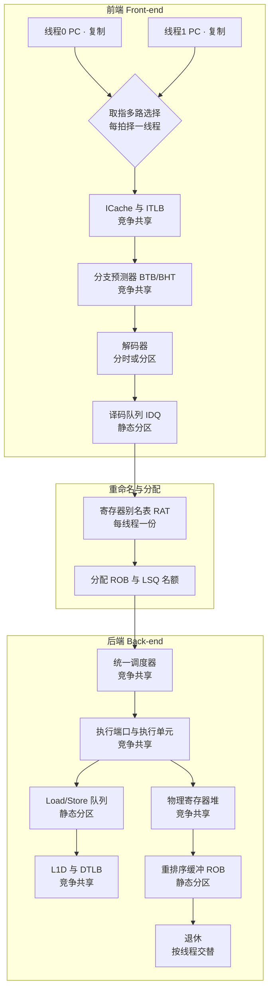
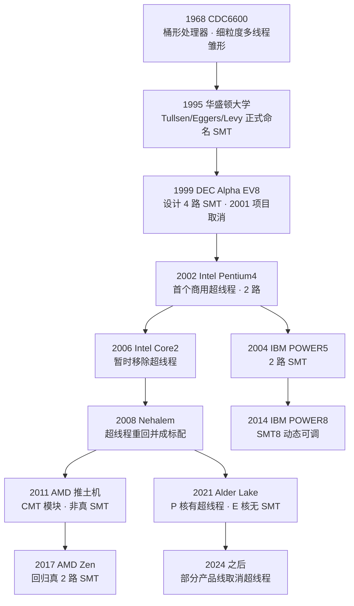
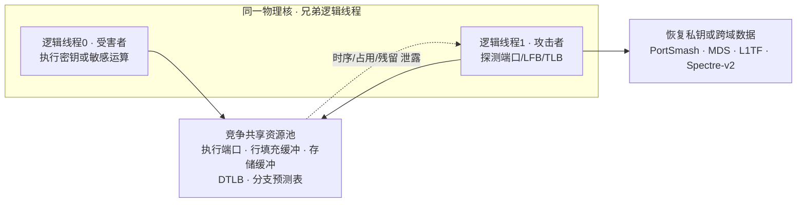

# CPU微架构与执行引擎（13）· SMT超线程与资源共享
> [!abstract] TL;DR
> - SMT 让单个物理核维护多套架构状态，用线程级并行（TLP）填补单线程指令级并行（ILP）留下的发射空槽，典型吞吐增益 20%~30% 而非翻倍，硅片面积代价仅约 5%。
> - 核内资源分三类处理：架构寄存器/PC 等【复制】，ROB 与 Load/Store 队列等【静态分区】以防饿死，执行端口/调度器/物理寄存器堆/缓存/TLB 等【竞争共享】以求利用率——隔离与利用率是此消彼长的设计张力。
> - 前端在取指口按周期择一线程、共享 ICache 与分支预测器；后端调度器与执行端口对所有就绪 μop 一视同仁——这正是跨线程微架构侧信道的物理根源。
> - 兄弟逻辑核闲置（HLT/MWAIT）时分区资源会【重组】还给活跃线程，故开启 SMT 不牺牲单线程峰值；这也是"关不关 SMT"可动态权衡的底层依据。
> - SMT 放大 PortSmash、TLBleed、MDS、L1TF、Spectre-v2 等跨线程泄露；安全边界靠禁用 SMT、Linux core scheduling（核内同调度）或恒定时间实现来守。
> - 谱系上 SMT 区别于粗/细粒度多线程与 AMD 推土机的 CMT 模块；ARM 大核与 Intel 能效核多不用 SMT，近年 Intel 甚至在部分产品线取消超线程。

## 概述与定位

在本系列前面十二篇里，我们把一个现代高性能核心从取指、译码、重命名、乱序发射、执行、访存到退休拆解得相当彻底：超标量能一拍发射多条指令（第 03 篇），乱序执行与 Tomasulo（第 04 篇）让不相关的指令绕过阻塞前行，物理寄存器堆（第 05 篇）为重命名提供弹药，ROB（第 07 篇）负责精确退休，Load-Store 队列（第 08 篇）管住访存序。所有这些机器都是为一件事服务的：尽可能挖出单条指令流里的**指令级并行（ILP）**，把每一拍的发射带宽都填满。

问题是——**单线程几乎永远填不满**。一颗 4~6 发射的乱序核，实测单线程 IPC 往往只有 1.5~2.5，大量发射槽是空的。空槽来自三处根本性限制：数据依赖链把指令串成长队、分支误预测清空流水线留下气泡、以及最致命的**长延迟访存停顿**（一次末级缓存未命中动辄上百拍，期间就绪指令很快枯竭）。这些空洞是 ILP 的天花板，靠加宽发射、加深乱序窗口只能逼近而无法消除，收益还急剧递减。

**SMT（Simultaneous Multithreading，同时多线程）**换了个思路：既然一个线程喂不饱执行引擎，那就同时喂它两个（或更多）线程。当线程 A 因缓存未命中而无就绪指令时，线程 B 的指令正好补进空槽；当线程 A 在等一条长延迟除法时，线程 B 的加法照样在别的端口上跑。SMT 用**线程级并行（TLP）填补 ILP 的空隙**，把闲置的执行资源变成吞吐。Intel 的商品名叫**超线程（Hyper-Threading, HT）**，AMD、IBM POWER 直接叫 SMT。其杀手锏在于代价极小：核心的执行单元、缓存、乱序机器本来就已经存在，SMT 只需**复制一份架构状态**（寄存器、PC 等）并给若干队列加上线程标签，硅片面积开销约 5%，却能换来两三成的吞吐提升——这是计算机体系结构里少有的"低投入高回报"设计。

要精确定位 SMT，得把它放进**硬件多线程谱系**里。历史上有三种做法：**粗粒度多线程**只在遇到长延迟事件（如 L2 未命中）时才切换线程，切换本身有过渡气泡；**细粒度多线程**（桶形处理器，barrel processor）每一拍轮流从不同线程取指，掩盖短延迟但每拍仍只服务单一线程；而 **SMT 是唯一能在同一拍内混合多个线程的指令去占用超标量发射宽度**的技术——它必须站在超标量+乱序这套底座上才成立，这也是它 1995 年才被学术界正式命名、2002 年才商用的原因。本篇聚焦 SMT 的资源共享全景：**前端如何分时、后端如何竞争、哪些资源复制、哪些分区、哪些共享，争用从何而来，隔离如何实现，以及由共享滋生的安全代价**。它上承第 03~08 篇的核心机器，下启第 14/15 篇的微架构侧信道——SMT 恰是那些跨线程攻击的物理温床。

## 原理与机制

SMT 的核心洞见可以用"发射槽占用图"一眼看懂。设想一颗 4 发射的核，横轴是时间（拍），每拍有 4 个发射槽，字母代表指令属于哪个线程，`.` 表示空槽（浪费的带宽）：

```
时间→     每拍 4 个发射槽，字母=所属线程，点=浪费的空槽
单线程    A A . .    A . . .    A A A .    ← 依赖/停顿造成大量空槽
粗粒度    A A . .    A . . .    B B B .    ← 长延迟才整体切到 B，切换有气泡
细粒度    A A . .    B . . .    A A A .    ← 每拍轮流取指，但每拍仍只跑一个线程
SMT      A A B .    A B C .    A A B C    ← 同一拍混合多线程，把空槽填满
```

只有最后一行做到了"同一拍水平方向上混装多个线程"，这就是 Simultaneous 的字面含义。要让这件事成立，核心内部必须回答一个关键问题：**哪些部件需要为每个线程各来一份，哪些可以你争我抢地共用？** 答案落成三个类别，构成整个 SMT 设计的骨架：

- **复制（Replicated）**：每个逻辑线程独享一份、彼此不可见的状态。包括架构寄存器（通用寄存器、标志寄存器、部分控制/段寄存器）、程序计数器、寄存器别名表（RAT）的逻辑映射、返回栈缓冲（RSB，多数实现每线程一份以免污染）、本地 APIC 与中断控制逻辑。复制是"两个逻辑 CPU"这个抽象得以成立的基础——操作系统看到的两套上下文正对应这两份复制的架构状态。
- **静态分区（Partitioned）**：一块结构在两线程都活跃时被**对半切开**，每线程固定占一半，谁也不能越界。典型代表是重排序缓冲 ROB、Load 缓冲、Store 缓冲、指令译码队列（IDQ）。分区的唯一目的是**防止饿死与死锁**：如果 ROB 让两线程自由竞争，一个疯狂占坑的线程会把另一个彻底堵死，甚至因为退休必须按序而形成跨线程的相互等待。对半切开牺牲了峰值利用率，换来了**前进保证（forward progress guarantee）**。
- **竞争共享（Competitively Shared）**：资源汇成一个大池，两线程按需动态争抢，硬件不区分指令来自谁。执行端口与执行单元、统一调度器/保留站、物理寄存器堆（PRF）、L1/L2 缓存、各级 TLB、分支预测表（BTB/BHT/PHT）全部属此类。竞争共享把利用率拉满，代价是**争用**——两线程抢同一个端口、互相踢出对方的缓存行，性能便相互干扰。这一类也是所有跨线程侧信道的来源。

下图把一条 SMT 流水线自前端到退休走一遍，并标出每个部件的资源类别：



有一条极其重要的机制常被忽略：**分区资源的动态重组（recombination）**。当兄弟逻辑核进入停机状态（执行了 HLT，或用 MONITOR/MWAIT 睡眠，或长时间 PAUSE 自旋让权），硬件会把原本切给它的那一半 ROB、Load/Store 缓冲、IDQ **全部归还给活跃线程**，使其恢复到"单线程独占全核"的资源规模。这解释了一个反直觉的事实：在支持 HT 的处理器上，只跑一个线程时并不会因为"另一半资源被预留"而变慢——空闲的兄弟不占坑。反过来，一旦兄弟被唤醒，硬件会重新对半分区。正因为重组是硬件自动、廉价的，操作系统才能把"要不要用兄弟逻辑核"当作一个可动态调度、甚至可随时关闭（`nosmt`）的旋钮。

## 前端后端资源共享与争用详解

这一节是本篇的核心，我们把前端、后端、访存三条战线上的共享与争用逐一拆开，讲清每处"为什么这么分"以及争用从何而来。

### 前端：取指口是天然的串行瓶颈

前端第一道关就带着 SMT 的根本约束：**取指多路选择器每拍只能锁定一个线程的 PC 去访问 ICache**。指令缓存是单口（或有限口）的，不可能同一拍既按线程 A 的 PC 取一整行、又按线程 B 的 PC 取另一行。Pentium 4 的做法是"乒乓（ping-pong）"——奇偶拍交替服务两线程；后续实现则按取指队列的空满、线程优先级动态择一。这意味着**前端取指带宽在两线程间是分时复用的**，不是加倍的。当两线程都跑得顺（分支预测准、无停顿）时，前端反而可能成为瓶颈：各自只拿到一半取指带宽。

ICache 与 ITLB 是竞争共享的。两线程若跑同一份代码（同一进程的两线程、或共享库），会在 ICache 里**建设性共享**——彼此复用对方拉进来的指令行，命中率反而更高；若跑完全不同的代码，则相互驱逐，指令未命中上升。**分支预测器（BTB/BHT/间接跳转预测/PHT）也是竞争共享**，这里埋着两个大坑：其一，两线程的分支地址在预测表里**别名（aliasing）**，A 的历史会污染 B 的预测，制造额外误预测；其二，正因为共享且可被一方训练、被另一方消费，它成了 **Spectre-v2（分支目标注入 BTI）跨线程投毒**的信道——攻击线程训练 BTB，受害线程的间接跳转就被带向攻击者选定的 gadget（详见第 14 篇）。返回栈缓冲 RSB 出于同样的污染顾虑，多数实现选择每线程一份（复制）。

译码之后进入 **IDQ（译码/μop 队列），静态分区**。这里体现了"分区防饿死"的哲学：如果译码队列让两线程自由竞争，一个取指顺畅、疯狂灌队列的线程会把另一个的名额挤光，后者即便有指令也进不了后端。对半切开保证每个线程至少有一半缓冲深度，维持前进。重命名/分配阶段（RAT 每线程一份、逻辑到物理的映射互不相扰）通常也按拍在两线程间交替，或按队列占用择一。

### 后端：调度器与端口的"线程无关"是双刃剑

越往后端走，资源越倾向于**纯竞争共享**，因为后端的价值就是把执行单元喂满，任何静态切分都是浪费。**统一调度器（保留站）从一个共享池里挑选就绪 μop**，它根本不关心也不需要关心这条 μop 属于哪个线程——只要操作数就绪、目标端口空闲就发射。**执行端口与执行单元完全竞争共享**：任一拍、任一端口都可服务任一线程。这带来了 SMT 最大的增益来源（一个线程的乘法器空闲时另一个立刻用上），也带来了最直接的争用：**若两线程都在猛跑同一类指令（比如都在做重浮点、都挤 AVX 的 FMA 端口），端口被彻底打满，SMT 不但无益反而因排队而互相拖慢**。这正是高性能计算（HPC）几乎一律关闭 SMT 的原因——科学计算单线程就能把 FPU 填满，加个兄弟线程只会增加端口争用和缓存压力，得不偿失。

**物理寄存器堆（PRF）竞争共享**：重命名把两线程的架构寄存器统统映射进同一个物理寄存器池。池子大小固定，一个消耗大量在途寄存器（长依赖链、大乱序窗口）的线程会挤占另一个的可用物理寄存器，导致对方重命名阶段停滞。**ROB 则静态分区**——退休必须严格按序，若两线程共用一个自由竞争的 ROB，队头一个长延迟未退休的指令会连带堵住另一个线程的退休，形成跨线程的队头阻塞（head-of-line blocking），对半切开正是为切断这种耦合。**Load/Store 队列与存储缓冲同样静态分区**，除了防饿死，还有内存序的考量：每个线程的访存必须维护自己的 program order 与内存屏障语义（见第 08、11 篇），混在一个队列里会让序的维护变得极其复杂。退休阶段按线程交替进行。

下表把 Intel 类实现里典型的资源分类汇总（不同微架构代际有出入，但大类稳定）：

| 资源 | 类别 | 为什么这么分 |
| --- | --- | --- |
| 架构寄存器 / PC / RAT 映射 | 复制 | "两个逻辑 CPU"抽象的物理基础 |
| 本地 APIC / 中断逻辑 | 复制 | 每个逻辑核要能独立收中断 |
| 返回栈缓冲 RSB | 复制（多数） | 避免跨线程调用/返回污染 |
| ROB / Load 缓冲 / Store 缓冲 | 静态分区 | 防饿死、切断退休与访存序的跨线程耦合 |
| IDQ 译码队列 | 静态分区 | 保证前端前进保证 |
| 统一调度器 / 保留站 | 竞争共享 | 最大化端口喂饱率 |
| 执行端口 / 执行单元 | 竞争共享 | SMT 增益主源，亦是端口争用与 PortSmash 之源 |
| 物理寄存器堆 PRF | 竞争共享 | 弹性分配，但会相互挤占 |
| L1I/L1D/L2、各级 TLB | 竞争共享 | 容量弹性，但会相互驱逐（缓存颠簸） |
| 分支预测表 BTB/BHT/PHT | 竞争共享 | 别名污染 + Spectre-v2 跨线程投毒信道 |

### 访存与缓存：有效容量减半的隐形税

L1I、L1D、L2 与各级 TLB 都是竞争共享。**缓存争用是 SMT 负加速最常见的元凶**：如果一个线程的工作集本来就逼近 L1/L2 容量，加进兄弟线程后，两者相互驱逐，各自的**有效缓存容量近似减半**，未命中率非线性飙升，一次访存停顿又拖累全核。是否受益因此高度依赖工作负载：**内存延迟受限、分支密集、ILP 低、工作集小于缓存**的负载（OLTP 数据库、Web 服务、编译、消息中间件）从 SMT 获益明显；**缓存敏感、计算密集、端口易饱和**的负载（稠密线性代数、科学模拟、部分视频编码）则常常零收益甚至负收益。共享 TLB 还有别名问题：有的实现给 TLB 表项打**线程 ID 标签**以隔离，有的则静态分区，否则一个线程的地址翻译会污染另一个（TLBleed 攻击正是利用共享 DTLB，见安全一节）。

### SMT 不是 CMT：与 AMD 推土机的深层对比

理解 SMT 的边界，最好的参照是 AMD 2011 年的**推土机（Bulldozer）CMT（Clustered Multithreading，聚簇多线程）**。CMT 把一个"模块"设计成：两个**物理独立的整数核**（各有自己的 ALU、AGU、L1D）+ **共享的前端**（取指、译码）+ **共享的一个浮点单元（FPU）** + 共享 L2。它比 SMT 复制得更多（整数后端是真的翻倍），又不像双核那样彻底独立（前端和 FPU 共享）。其得失很清晰：整数吞吐接近双核，但**共享前端与 FPU 成了瓶颈**——译码带宽喂不饱两个整数核、浮点负载一争用就崩，导致单线程性能疲软、每瓦性能不佳。AMD 在 2017 年的 Zen 架构果断回归**真正的 2-way SMT**：与其花晶体管复制整数后端却被前端卡住，不如把一个宽而强的乱序核用 SMT 榨满——工艺进步后，SMT 的面积效率明显胜过 CMT。这段历史精准诠释了 SMT 的定位：**它是"共享一套强执行引擎"的极致，而非"复制多套弱引擎"**。

再看谱系另一端：IBM POWER 把 SMT 推到极限，POWER5（2004）2 路、POWER7 4 路、POWER8/9 做到 **SMT8（每核 8 线程）**，且支持 SMT1/2/4/8 动态切换，靠的是远大的资源池和更精细的分区。Sun Niagara T1（2005）每核 4 线程但是**细粒度多线程**（每拍轮流取指、非同一拍混装），T2 升到 8 路——它牺牲单线程性能换极高的线程吞吐密度，服务器上专治高并发 I/O 型负载。下面把这条演进脉络画成流程图：



## 工具视角与实战

**检测与枚举拓扑**是 SMT 实战的第一课。CPUID 是权威来源，但要注意历史陷阱：`CPUID.01H:EDX[28]` 是 HTT 位，它只表示"本封装含多个逻辑处理器"，在多核时代**它为 1 并不等于开了超线程**（多核也会置位）；`CPUID.01H:EBX[23:16]` 给出每封装可寻址逻辑处理器数上限。要准确算出"每核几线程"，必须用**扩展拓扑枚举**：`CPUID.0BH`（Leaf 0x0B）或更新的 `CPUID.1FH`（Leaf 0x1F），它们逐层（SMT 层→Core 层→…）给出每层的位宽与该层逻辑处理器数。核心思想是 **APIC ID 是分层位域**，低位是 SMT_ID，往上是 Core_ID、Package_ID：

```
x2APIC ID 位布局（示意，宽度由 CPUID.1FH 给出）
+-----------------+-----------+-----------+
|   Package_ID    |  Core_ID  |  SMT_ID   |
+-----------------+-----------+-----------+
 高位 ←                              → 低位
 · SMT_Mask_Width = 1  → 每核 2 线程（两个 SMT_ID: 0/1）
 · 用 SMT 掩码对齐两个 APIC ID，高位相同即为同核兄弟线程
```

在 Linux 上无需手写 CPUID，直接读内核已解析好的拓扑最省事：`lscpu` 顶部的 `Thread(s) per core:` 一眼看出 SMT 路数；`/sys/devices/system/cpu/cpu0/topology/thread_siblings_list` 列出与 cpu0 同物理核的兄弟逻辑核编号；`core_id` 给出物理核号；`/proc/cpuinfo` 里 `siblings`（每封装逻辑核数）与 `cpu cores`（每封装物理核数）之比即 SMT 路数。**逆向/取证视角**下，识别"两个逻辑 CPU 是否兄弟"至关重要——调度、NUMA、侧信道分析都依赖它：把两个逻辑核的 APIC ID 右移掉 SMT_Mask_Width 位后若相等，即同核。

**开关 SMT** 有多种粒度。BIOS/UEFI 里的开关最彻底（连架构状态都不呈现给 OS）；内核启动参数 `nosmt` 让 Linux 只上线每核一个线程；运行时可写 `/sys/devices/system/cpu/smt/control`（`on`/`off`/`forceoff`），读 `/sys/devices/system/cpu/smt/active` 看当前状态。云与安全场景常在启动就 `nosmt` 或 `mitigations=auto,nosmt`。要注意：运行时 `off` 只是把兄弟逻辑核**下线（offline）**，其架构状态仍可能保留，`forceoff` 才禁止再上线。

**性能评估**别只看理论。判断某负载该不该开 SMT，正确姿势是对照实测吞吐：把负载分别跑在 `SMT=on` 与 `nosmt` 下比较总吞吐与尾延迟。用 `perf` 观测争用信号：端口/执行单元的占用（不同微架构有 `uops_dispatched_port.*`、`exe_activity.*` 等事件）、`cycle_activity.stalls_*` 看停顿构成、L1/L2 未命中率、以及每逻辑核的 IPC。**关键判据**：若开 SMT 后总 IPC 提升但单线程 IPC 明显下降且尾延迟恶化，说明落进了"缓存/端口争用"象限，此时对延迟敏感的在线服务宁可关 SMT 或用绑核隔离。自旋等待代码要记得插 `PAUSE`（或 ARM 的 `YIELD`/`WFE`）——它向核心提示"我在空转"，从而把发射资源让给兄弟线程，否则一个忙等的自旋循环会白白霸占共享端口拖慢兄弟。

**调度器视角**：SMT-aware 的 OS 调度器遵循"先摊开后打包"——优先把可运行任务分散到不同物理核（spread），只有物理核都占满才启用兄弟逻辑核（pack），因为兄弟线程共享 L1/L2、彼此干扰。Linux 用 sched domain 的 SMT 层级表达这一拓扑，`thread_siblings` 决定负载均衡的粒度。绑核（`taskset`/`sched_setaffinity`、cgroup cpuset）是把关键负载钉在专属物理核、避免与吵闹邻居共享兄弟线程的常用手段。

## 安全性与正确使用

SMT 在性能账本上是笔好买卖，但在**安全账本**上是重负债。根源清晰得近乎冷酷：**兄弟线程同时在运行、又共享大量微架构资源，一个线程对共享资源的使用会以时序、占用、残留数据的形式泄露给另一个线程**。这条物理事实催生了整整一族跨线程侧信道：



- **PortSmash（CVE-2018-5407）**：纯粹的**执行端口争用**信道。攻击线程反复发射会争用特定端口的指令，测量自己被延迟的程度，就能推断兄弟线程此刻在用哪些端口、进而重建其指令序列——研究者据此从同核的 OpenSSL 里恢复了 P-384 ECDSA 私钥。它不依赖缓存，只依赖"端口是竞争共享"这一事实。
- **TLBleed**：利用共享 DTLB，通过监视 TLB 组的活动泄露兄弟线程的访存地址模式，同样能打穿密码实现。
- **MDS（微架构数据采样）**：RIDL、Fallout、ZombieLoad 三兄弟，分别对应行填充缓冲（LFB，CVE-2018-12130）、存储缓冲（CVE-2018-12126）、加载端口（CVE-2018-12127）里的**在途数据残留**。这些微小缓冲是竞争共享的，兄弟线程能采样到对方刚经手的数据。SMT **显著放大** MDS——软件的 `VERW`/`MD_CLEAR` 缓解只能在上下文切换时刷本线程的缓冲，**挡不住兄弟线程并发的实时采样**，所以 Intel 官方明确：要完整缓解 MDS，需在启用 `MD_CLEAR` 之外**禁用 SMT**。
- **L1TF（Foreshadow）**：L1 数据缓存终端错误，兄弟线程能越权读到 L1D 里的数据（含 SGX、VMM 内存）。SMT 让攻击线程与受害者同核并发，极大提升可利用性。
- **Spectre-v2（BTI）**：如前所述，共享的 BTB 让攻击线程能跨兄弟线程投毒间接分支目标。

因此**误用风险**集中在多租户与跨信任域共核：公有云上把两个互不信任租户的 vCPU 调度到同一物理核的兄弟线程，等于给上述侧信道敞开大门；浏览器里不可信 JS 与敏感页同核，也构成风险面。**正确使用与加固边界**有几条清晰准则：

1. **按信任域决定 SMT 策略**。裸金属、单租户、同一信任域内的负载，开 SMT 收吞吐无妨；跨信任域共核则要么禁用 SMT，要么用调度隔离。OpenBSD 自 2018 年起**默认禁用 SMT**（`hw.smt=0`），正是把"共享即不可信"作为默认立场。
2. **Linux Core Scheduling（核内同调度，5.14+ 合入）**是禁用 SMT 之外的折中：给任务打上"调度 cookie"，硬性保证**只有相同 cookie（互信任）的任务才能同时占用一个物理核的兄弟线程**，否则宁可让兄弟线程空转。它以牺牲部分吞吐为代价，在保留 SMT 的同时挡住 L1TF/MDS 类跨线程泄露，适合"想保留 SMT 又要多租户隔离"的场景。
3. **密码与敏感代码走恒定时间实现**：消除数据依赖的分支与访存、避免依赖秘密的端口使用模式，从源头削弱 PortSmash/TLBleed 的可观测性（与第 37 篇密码侧信道一节呼应）。
4. **保持微码与内核缓解链更新**：MDS/L1TF/Spectre 的缓解是微码（`VERW` 语义、IBRS/eIBRS/STIBP）+ 内核（缓冲清刷、`STIBP` 抑制跨线程分支预测共享）协同的结果；`STIBP`（Single Thread Indirect Branch Predictors）专门用于抑制兄弟线程间的间接分支预测器共享。

还有一类常被忽视的问题：**性能型拒绝服务**。兄弟线程无需"泄露"什么，只要恶意占满共享资源——反复 flush 缓存、疯狂发射抢端口、把 PRF/调度器占爆——就能让同核的另一线程性能雪崩。这在共享租户环境是真实的 QoS 威胁，缓解手段包括绑核隔离、资源配额（如 Intel RDT/CAT 做缓存路划分）以及把关键负载钉在独占物理核上。

一句话概括正确姿势：**SMT 的安全性等于其资源共享的最弱环**——凡是共享的都可能被观测或被占满。在同一信任域内放心用，在跨信任域要么关掉 SMT，要么用 core scheduling 与恒定时间实现把共享面按住。

## 小结

SMT 是体系结构里"用线程级并行填补指令级并行空隙"的经典解法：复制一份架构状态、给若干队列加线程标签，就把本已存在的宽乱序执行引擎从单线程的半饱状态推向满载，两三成吞吐提升只换来约 5% 面积。它的全部精妙与全部代价，都浓缩在**三类资源处理**里——复制保证"两个逻辑 CPU"的抽象，静态分区（ROB/LSQ/IDQ）以牺牲峰值利用率换前进保证与解耦，竞争共享（端口/调度器/PRF/缓存/TLB/分支预测）榨干利用率却引入争用与侧信道。前端在取指口天然串行、共享 ICache 与分支预测；后端调度器与端口对 μop 一视同仁——这份"线程无关"既是增益之源，也是 PortSmash、MDS、L1TF、Spectre-v2 等跨线程攻击的物理根基。是否受益高度依赖负载：内存受限、ILP 低、工作集小者获益，端口饱和、缓存敏感者常负加速，故 HPC 惯于关闭 SMT。谱系上它区别于粗/细粒度多线程与推土机的 CMT，而分区资源在兄弟闲置时的自动重组，让"开不开 SMT"成为一个可动态、可按信任域权衡的旋钮。下一篇进入微架构侧信道的正题——Spectre 与 Meltdown，届时你会看到本篇讲的共享分支预测器与投机执行如何被武器化。

## 相关阅读

- 本系列上下文：[[00.CPU微架构与执行引擎总览|系列总览]]、[[03.超标量与多发射]]（发射带宽为何填不满）、[[04.乱序执行与Tomasulo算法]]、[[05.寄存器重命名与物理寄存器堆]]（共享 PRF 的重命名底座）、[[07.投机执行与重排序缓冲ROB]]（ROB 分区的退休语义）、[[08.存储子系统：Load-Store队列]]（LSQ 分区与内存序）、[[09.缓存层级与替换策略]]（共享缓存的争用）。
- 安全呼应：[[14.微架构侧信道：Spectre与Meltdown]]（共享分支预测器的武器化）、[[15.侧信道进阶：MDS与L1TF与Zenbleed]]（SMT 放大的跨线程数据采样）。
- 汇编与系统层：[[21.Asm/28 原子操作与内存模型]]、[[21.Asm/39 缓存与缓存一致性]]、[[21.Asm/38 MMU与页表设置实战]]（共享 TLB 与地址翻译）。
- 侧信道对照：[[37.密码学/61.侧信道攻击]]（密码实现层的恒定时间对策，与本篇微架构层互补）。
- 防护机制：[[34.现代二进制防护机制/09.Intel CET]]、[[34.现代二进制防护机制/13.MTE内存标签扩展]]。
- 官方文档与经典文献：《Intel 64 and IA-32 Architectures Software Developer's Manual》Vol.3A（超线程与拓扑枚举章节）、《Intel 64 and IA-32 Architectures Optimization Reference Manual》（HT 资源共享与优化建议）；Tullsen、Eggers、Levy，《Simultaneous Multithreading: Maximizing On-Chip Parallelism》（ISCA 1995，SMT 命名之作）；Linux 内核文档 `Documentation/admin-guide/hw-vuln/core-scheduling.rst` 与 `l1tf.rst`、`mds.rst`；OpenBSD `hw.smt` SMT 默认禁用公告；PortSmash（CVE-2018-5407）、TLBleed、RIDL/ZombieLoad/Fallout（MDS）、Foreshadow（L1TF）原始论文。

[[00.CPU微架构与执行引擎总览|⬆ 系列总览]] | [[12.TLB与地址转换加速|← 上一章]] | [[14.微架构侧信道：Spectre与Meltdown|→ 下一章]]
