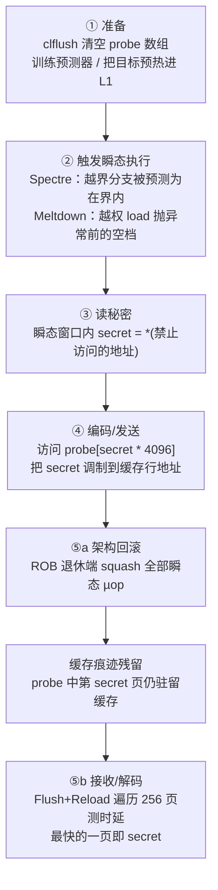
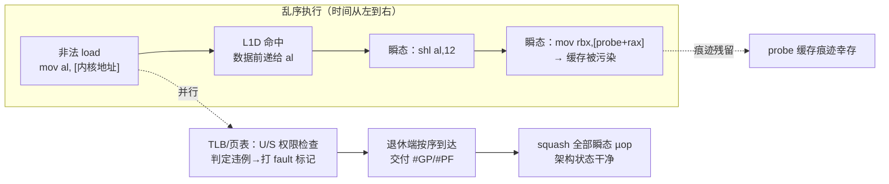
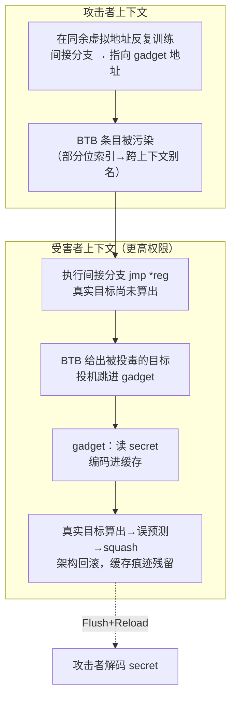

# CPU微架构与执行引擎（14）· 微架构侧信道：Spectre与Meltdown

> [!abstract] TL;DR
> - Spectre / Meltdown 的共同根源是**瞬态执行（transient execution）**：CPU 为压榨性能会投机、乱序地执行尚未确认合法的指令，事后在**架构层面**把它们抹掉，却在缓存等**微架构状态**里留下无法回滚的痕迹。
> - 全部攻击的支点是一句话——**架构状态可回滚、微架构状态不可回滚**。秘密从"被判无效而丢弃的计算"里，经**缓存隐蔽信道**（Flush+Reload / Prime+Probe）泄给攻击者。
> - **Meltdown（v3）**利用 Intel 把 L1 数据前递给相关 µop 的时刻**早于**页表权限检查落定，让用户态在瞬态窗口内读到映射进地址空间的内核数据；它是一次"越权读"。
> - **Spectre（v1/v2）**不越权，而是**欺骗预测器**：v1 训练 PHT 让越界分支预测为"在界内"，v2 投毒 BTB/RSB 劫持间接分支的投机目标，诱导受害者自己执行泄露 gadget——因此**权限隔离对它无效**。
> - 缓解只能分而治之：Meltdown 靠 **KPTI** 卸载内核页表映射；v2 靠 **retpoline / IBRS / IBPB / STIBP**；v1 靠 **array_index_nospec / lfence** 逐 gadget 设障——代价是可观且长期的性能税。
> - 影响是范式性的：从 2018 年起，"投机回滚"不再等于"什么都没发生"，CPU 安全模型必须把**微架构可观测性**一并纳入。

## 概述与定位

要理解 Spectre 与 Meltdown，先要把本系列第 01 篇立下的那条界线重新举起来：**ISA 定义的架构状态（architectural state）**——通用寄存器、程序计数器、内存的可见内容、条件标志——是软件"契约"里承诺可见、可回滚的部分；而为了兑现这份契约所引入的一切实现细节——分支预测器的历史表、缓存里驻留了哪些行、TLB 里缓存了哪些翻译、乱序引擎里正在飞行的 µop——属于**微架构状态（microarchitectural state）**，ISA 从不承诺它对软件不可见，也从不承诺它会随架构回滚而复原。

几十年来体系结构界心照不宣地依赖一个假设：只要一条指令最终**没有退休（retire）**、其架构效果被投机引擎正确地丢弃，那么它"等于没发生"。第 07 篇讲投机执行与 ROB 时我们反复强调的正是这套机制——错误路径上的指令被 squash，寄存器重命名回退，store 不写入内存，异常延迟到退休点才交付。Spectre 与 Meltdown 在 2018 年 1 月同时公开，一举击穿了这个假设：**被丢弃的指令确实改变了世界，只不过改变的是微架构状态而非架构状态**。攻击者不需要那条越权指令的架构结果，他只需要它在缓存里留下的"脚印"。

把这两组漏洞放进本系列的坐标系，它们几乎是前十三篇的"综合应用题"：没有第 06 篇的**分支预测器**（PHT / BTB / RSB）就没有 Spectre 的投机劫持；没有第 07 篇的**投机执行与 ROB**（乱序发射、in-order 退休、异常延迟交付）就没有瞬态窗口；没有第 08 篇的 **Load-Store 队列**（投机 load、store-to-load 前递）就没有 Meltdown 的数据前递与 v4 的 store bypass；没有第 09、10 篇的**缓存层级与 MESI**（inclusive LLC、跨核一致性）就没有 Flush+Reload 这条又快又准的信道；没有第 12 篇的 **TLB 与页表权限位**就无从谈"延迟的权限检查"；没有第 13 篇的 **SMT** 就没有兄弟线程之间共享预测器所需的 STIBP。可以说，正是过去三十年为提升 IPC 而层层叠加的这些优化，共同织成了泄露的地基。

需要先厘清命名与归属：Meltdown 对应 **CVE-2017-5754**，业界又称 Variant 3 / Rogue Data Cache Load；Spectre 有两个原始变体，**CVE-2017-5753**（Variant 1，Bounds Check Bypass，边界检查绕过）与 **CVE-2017-5715**（Variant 2，Branch Target Injection，分支目标注入）。发现者是 Google Project Zero 的 Jann Horn、格拉茨工业大学（TU Graz）团队、Paul Kocher 等多组研究者的独立汇流。二者最本质的分野在于**瞬态窗口从哪来**：Meltdown 型靠**故障（fault）**——一条会抛异常的指令，在异常交付前的空档里让后续 µop 瞬态执行；Spectre 型靠**误预测（misprediction）**——预测器被诱导走错路，在纠正前的空档里让错误路径瞬态执行。这个二分法是后来 Canella 等人《A Systematic Evaluation of Transient Execution Attacks and Defenses》系统分类的骨架，也是本篇组织材料的主线。

## 原理与机制

**瞬态指令（transient instructions）**指的是那些被 CPU 真正执行了、但最终不会退休、其架构效果被丢弃的指令。它们存在于两种空档里：一是投机执行走了错误路径（分支/间接跳转/返回地址预测错误），二是某条指令终将抛出异常但异常尚未交付（乱序引擎允许后续指令先跑起来）。无论哪种，纠正机制启动时——ROB 在退休端发现预测错误或异常——都会把这批瞬态指令连同它们的重命名寄存器一起 squash。**架构层面它们干净利落地消失了；微架构层面，它们碰过的缓存行、激活过的预取器、占用过的端口，统统留了下来。**

于是攻击被拆成"发送端"与"接收端"两半，中间是一条**隐蔽信道（covert channel）**。发送端是运行在瞬态窗口里的几条指令：它们读到一个本不该读的字节 `secret`，再用这个字节去索引一个探测数组，例如访问 `probe[secret * 4096]`。这一步把 8 位的秘密"调制"到了地址上——秘密取值 0~255，就会让 `probe` 里 256 个相隔一页的位置中**恰好那一个**被载入缓存。接收端在瞬态窗口结束、架构状态回滚之后登场：它遍历 `probe` 的 256 个候选位置逐一计时，**唯独被瞬态代码碰过的那一页**因为已在缓存里而访问飞快，其余 255 个都要走内存慢腾腾地取回。哪一页快，秘密就是几。至此，一个架构上"从未发生"的读操作，其结果被完整解调了出来。

这就引出了那个反复出现的**五步通用攻击模板**，无论 Spectre 还是 Meltdown 都套用它：



为什么探测数组要用 `* 4096`（一页）而不是紧挨着排？这是被硬件**预取器**逼出来的工程细节，也是"删掉代码也要讲清"的典型点。缓存的空间局部性优化会在你访问一行时顺带把相邻行也拉进来（相邻行预取、流预取、步长预取，见第 09 篇）。若 256 个候选彼此只差一个缓存行，接收端就会看到一片"糊成一团"的命中，无法判定究竟是哪一个被真正碰过。把候选拉开到整整一页（4 KiB）、并刻意跳过页首页尾，就能让预取器的"顺手牵羊"落空，让信号从噪声里干净地立起来。同理，`probe` 数组本身要足够大、跨足够多的缓存组（cache set），避免候选之间在组相联映射上互相踩踏。

再看**接收端的计时**。x86 上用 `rdtsc` / `rdtscp` 读时间戳计数器，配合 `lfence` / `mfence`（第 11 篇的序列化屏障）把乱序引擎"钉住"，防止计时指令自己被重排到测量区间外。校准时先测一批已知命中与已知未命中，取二者时延分布中间的一个阈值：L1 命中约几个周期、L2 约十几、LLC 约四十、走 DRAM 则两三百周期——阈值卡在"LLC 命中"与"DRAM 未命中"之间即可。这套"用时间读缓存"的手法本身不是 2018 年的发明，它源自早年的缓存计时攻击（针对 AES 表查找等，见密码实现层的侧信道笔记）；Spectre/Meltdown 的真正创新在于**用瞬态执行去驱动这条老信道**，让它能读到本来受硬件权限保护、软件永远碰不到的数据。

最后强调一个常被误解的点：缓存隐蔽信道只是**目前最好用**的那条，并非唯一。凡是"执行历史会改变后续可观测时序"的共享微架构资源，理论上都能当信道——TLB 占用、分支预测器状态、执行端口争用（PortSmash）、AVX 单元的功耗/唤醒延迟、乃至 DRAM 行缓冲。理解到这一层，就能明白为什么"堵掉缓存信道"从来不是根治：瞬态执行只要还能把秘密调制进任一微架构资源，攻防就还在继续。

## 变体剖析与传输原语详解

### Meltdown（v3 / Meltdown-US）：延迟的权限检查

Meltdown 的杀伤力在于它**直接越权**：一段普通用户态代码，能读出映射在本进程地址空间里的**内核内存**。为什么内核会被映射进用户地址空间？这本是性能优化（见第 12 篇）：把内核常驻映射在每个进程页表的高半区，系统调用与中断陷入内核时就不必切换 CR3、不必刷 TLB。更要命的是 Linux 的**直接物理映射（direct-physical map / physmap）**把几乎全部物理内存线性映射在内核空间——于是"读到内核地址"实质等于"读到整台机器的物理内存"。

微架构上究竟发生了什么，是本节的核心。当一条 load 在乱序引擎里执行时，它并行地做两件事：其一，用虚拟地址查 TLB / 页表，拿到物理地址**和权限位**（U/S 位标明该页是否允许用户态访问）；其二，把物理地址送进 L1D，若命中就把数据取出来。**在受影响的 Intel 核上，L1D 取出的数据会被前递（forward）给依赖它的后续 µop，而这一前递发生在权限检查尚未落定之时。** 权限违例并不会当场阻断数据流动，它只是给这条 load µop 打上"该 fault"的标记，异常要等到这条指令在 ROB 的**退休端按序到达**时才真正交付（第 07 篇：异常精确交付、in-order retirement）。问题就出在这段"标记了 fault、但还没退休"的空档里——依赖那个非法数据的后续 µop 早已抢跑，`probe[secret*4096]` 早已把秘密写进了缓存。等异常终于交付、瞬态 µop 被 squash，木已成舟。



几个实战关键点，光看代码看不出来：

- **抑制异常**是必备工程。让 CPU 每读一个字节就抛一次真异常、走一次信号处理，慢到没法用。实用手法有三：用 Intel **TSX 事务内存**把非法访问包进事务，违例会让事务静默 abort、不产生架构异常；或安装 `SIGSEGV` 处理程序从故障点跳回继续（较慢）；或干脆用一次**故意的分支误预测**把非法访问放到永不会架构执行的路径上——最后一种其实已经把 Meltdown 拉回了 Spectre 的形态。
- **目标必须在 L1D 里**。Meltdown 主要泄露 L1D 中已有的行；若目标不在 L1，前递拿到的往往是 0（读出全零而非真值）。因此攻击前常要设法把目标预热进 L1（例如借一次合法的内核路径顺带把它带进来），这也是 Meltdown 相较后来 L1TF/MDS 的一个局限。
- **为什么 AMD 基本免疫 Meltdown**：AMD 明确声称其处理器不受 Variant 3 影响。深层原因是其微架构在权限不符时**不会把数据前递**给依赖 µop——权限检查在数据流动的关键路径上、而非旁路。ARM 则分核而定：Cortex-A75 等少数核受 v3 影响，更多核受 v3a（Meltdown-GP，越权读系统寄存器）影响。这正说明 Meltdown 不是"投机执行"的必然产物，而是**某种特定实现选择（乐观前递 + 延迟检查）**的产物——它可以在不牺牲太多性能的前提下被硬件修掉，Intel 后续的 Whiskey Lake、Cascade Lake、Ice Lake 就带上了硬件修复。

按 Canella 的系统命名，Meltdown 家族按"绕过了哪种保护"细分：Meltdown-US（本节，越 User/Supervisor 位）、Meltdown-P（Foreshadow / L1TF，越 present 位——留给第 15 篇）、Meltdown-GP（v3a，越权读系统寄存器）、Meltdown-NM（LazyFP，惰性浮点上下文）、Meltdown-RW（v1.2，越只读位写）等。它们共享同一台"引擎"：故障延迟交付造出的瞬态窗口。

### Spectre-v1（Bounds Check Bypass / Spectre-PHT）：训练分支去越界

Spectre v1 不越任何权限——它让**受害者自己**去越界读，再把秘密送出来。经典 gadget 只有短短两行：

```c
if (x < array1_size)                       // ①边界检查
    y = array2[array1[x] * 4096];          // ②双重取址：先读 array1[x]，再据其索引 array2
```

攻击分两拍。**训练拍**：反复用**合法**的 `x`（确实小于 `array1_size`）调用这段代码，把管辖 `①` 这个分支的**模式历史表 PHT**（Pattern History Table，第 06 篇）训练成"这个分支总是 taken、总是走进界内分支体"。**攻击拍**：此时故意把 `array1_size` 从缓存里挤走（clflush），再传入一个**越界**的 `x`。由于 `array1_size` 要从内存慢慢取回，`①` 的判定迟迟无法落定；而 PHT 信誓旦旦地说"走进去"，于是 CPU 投机执行 `②`：`array1[x]` 越过 `array1` 边界，读到了攻击者觊觎的 `secret`；`array2[secret*4096]` 随即把它调制进缓存。几十上百周期后 `array1_size` 到位，判定"其实越界了"，分支误预测、`②` 被 squash——但缓存痕迹已在，接收端照旧解码。

它与 Meltdown 的分野在此一目了然：Meltdown 是"我自己去越权读"，靠故障开窗；v1 是"骗受害者替我越界读"，靠误预测开窗。也正因为 v1 里的越界读**在受害者的合法权限内**（`array1[x]` 本身是一次合法虚拟地址的访问，只是逻辑越界），任何基于特权级的隔离都拦不住它——这也是 v1 至今**没有通用硬件修复、只能逐 gadget 设障**的根本原因。它的变体 v1.1（Bounds Check Bypass Store）更进一步：在投机窗口里做**越界写**，可临时改写栈上返回地址等，为投机 ROP 提供跳板；v1.2（Meltdown-RW）投机绕过只读位。

### Spectre-v2（Branch Target Injection / Spectre-BTB）：劫持投机的去向

如果说 v1 是"骗预测器对某个分支的取/不取判断"，v2 就是"骗预测器对某个**间接分支该跳去哪**的判断"。间接分支（`jmp *%rax`、虚函数调用、跳表）的目标由**分支目标缓冲 BTB**（Branch Target Buffer）预测。BTB 出于成本只用虚拟地址的**部分位**做索引与标签，这意味着不同地址、甚至不同地址空间的分支会在 BTB 里**别名（alias）**到同一条目。

攻击者据此**投毒 BTB**：在自己的进程里，于一个与受害者间接分支**同余（congruent）**的虚拟地址处，反复把某条间接分支训练成"跳向攻击者选定的目标"。当受害者随后执行它那条间接分支时，BTB 给出的投机目标是被污染的那个——于是受害者**投机地跳进攻击者挑好的一段代码（gadget）**。这段 gadget 位于受害者自己的地址空间、以受害者的权限运行，它做的正是"读秘密 + 编码进缓存"。这在形态上极像 ROP（返回导向编程），只不过发生在投机窗口、事后会回滚——因此叫**投机 ROP / 投机 gadget**。v2 的杀伤面因此极广：跨进程、跨特权级（用户投毒内核）、跨虚拟机（Guest 投毒 Hypervisor），只要能找到并触达合适 gadget。



与 v2 同源的还有 **Spectre-RSB / ret2spec**：`ret` 的目标由**返回栈缓冲 RSB**（Return Stack Buffer，第 06 篇）预测；通过制造 RSB 上溢/下溢或跨上下文污染，同样能把 `ret` 的投机目标劫持到 gadget。它是理解 retpoline 缓解手法的关键前提——retpoline 恰恰反过来利用 RSB 来"喂"一个安全的投机目标。

### Spectre-v4（Speculative Store Bypass / Spectre-STL）：投机绕过 store 转发

v4 出自另一处投机：内存消歧（memory disambiguation，第 08 篇）。当一条 load 的地址与在飞的 store 地址还没算清时，处理器会**投机地假设二者不冲突**，让 load 越过 store 直接从更旧的内存值取数、而不等 store-to-load 前递。若假设错了，这条 load 就在瞬态窗口里读到了**本应被前一条 store 覆盖的陈旧值**，据此可泄露信息。缓解是微码提供的 **SSBD**（Speculative Store Bypass Disable），关掉这项投机。v4 提醒我们：投机无处不在，凡有投机处，皆可能有瞬态泄露。

### 隐蔽信道原语：Flush+Reload 与 Prime+Probe

信道决定了攻击的适用面与信噪比，值得单列。

- **Flush+Reload**：需要与受害者**共享只读内存**（共享库、写时复制前的页去重 KSM 等）。攻击者 `clflush` 掉共享行→等受害者（或瞬态代码）可能访问它→自己 reload 并计时：快则说明被访问过。它**分辨率高（精确到行）、噪声低**，且因 LLC 是 inclusive（第 09/10 篇），一核 clflush 会把该行逐出全层级，**跨核**也照测不误——这是它成为 Spectre/Meltdown 首选信道的原因。局限是必须有共享内存与 `clflush` 权限。
- **Prime+Probe**：**不需共享内存**。攻击者先用自己的数据填满某个缓存组（prime）→受害者运行、若碰了该组会逐出攻击者的某行→攻击者重新访问自己那组并计时（probe），据"哪些行被逐出"反推受害者碰过哪些组。它**适用面更广**（无共享、无需 clflush，甚至能在 JavaScript 里做），但**分辨率低（到组）、噪声大**、需精心构造 eviction set。
- 另有 **Evict+Reload**（无 `clflush` 时用访问逐出替代刷新，常见于浏览器）与 **Flush+Flush**（直接给 `clflush` 计时——行不在缓存时 `clflush` 更快——更隐蔽且不产生访存）。

选哪条信道，取决于攻击者与受害者是否共享内存、是否有 `clflush`、能否读高精度时钟。浏览器场景里 `clflush` 和 `rdtsc` 都不可用，攻击者才转而用 Evict+Reload + `SharedArrayBuffer` 自建高精度计时器——这也解释了各家浏览器为何一度**禁掉 SharedArrayBuffer、给 `performance.now()` 加抖动**（详见下一节）。

## 工具视角与实战

> 以下命令与观察点均为**在自有/授权机器上做体检与研究**之用，不含针对他人系统的攻击配方。

**查漏与看缓解状态**是第一步。Linux 内核把每类瞬态漏洞的状态导出在 sysfs，一眼可知本机受不受影响、开了哪种缓解：

```bash
# 逐项查看内核判定与已启用的缓解
grep -r . /sys/devices/system/cpu/vulnerabilities/
# 典型输出：
#   meltdown:        Mitigation: PTI
#   spectre_v1:      Mitigation: usercopy/swapgs barriers and __user pointer sanitization
#   spectre_v2:      Mitigation: Enhanced IBRS, IBPB: conditional, RSB filling, ...
#   spec_store_bypass:Mitigation: Speculative Store Bypass disabled via prctl

lscpu | sed -n '/Vulnerab/,$p'     # lscpu 同样汇总各漏洞与缓解
```

社区经典体检脚本 **spectre-meltdown-checker.sh**（speed47）会综合读取 CPUID、微码版本、内核选项与 sysfs，逐 CVE 报告"硬件是否易感 / 缓解是否生效"，比裸看 sysfs 更友好；它是运维评估补丁覆盖面的常用工具。

**逆向视角：识别 Spectre gadget。** 对 v1 而言，gadget 的特征是"**一次边界/条件检查**紧跟"**用受检值做索引的双重取址**"（`array2[array1[x]*stride]` 这种"取出的值又拿去当地址"的二级依赖链）。在反汇编里，它表现为一个条件跳转后面跟着两条有数据依赖的 load，第二条 load 的地址由第一条 load 的结果左移/乘常数得来。对 v2/RSB 而言，关注**间接分支/返回**之后能被投机触达、且含"读敏感值→据其访存"的代码片段。学术界为此做了静态/符号执行工具：**Spectector**（用符号执行验证一段代码是否满足"投机不泄露"的 speculative non-interference）、**oo7**、**Respectre** 等，用来在大型代码库里自动找候选 gadget。理解这些工具的判定准则，本身就是理解"什么样的代码模式危险"的最好方式。

**教学级 PoC 的结构**（仅描述形态，不给可武器化的完整目标利用）：Paul Kocher 公开的 v1 演示程序是最好的教材——它在**同一个进程内**放一个"受害者函数"和一段"秘密字符串"，训练拍喂合法下标、攻击拍喂越界下标，接收端用 Flush+Reload 扫 256 页、对每个候选做多轮测量取众数以压噪声，最后把秘密逐字节打印出来。它的价值在于把五步模板落成可运行、可观测的代码，让学习者亲眼看到"架构上没发生的读"如何被解码；它读的是**自己进程里的**数据，不越任何边界，因而适合课堂与靶场。

**观测投机行为**可借第 16 篇要展开的 PMU。`perf` 能统计分支误预测、投机执行的指令数等事件，帮助你在"设了缓解 vs 没设"两种配置下量化投机被抑制的程度与性能代价：

```bash
perf stat -e branches,branch-misses,cycles,instructions ./workload
# 对比开关 mitigations 前后：br-miss 率、IPC 的变化能侧面反映 retpoline/IBRS 的影响
```

**编译器侧的实战**：GCC/Clang 提供 `-mretpoline`（间接分支改用 retpoline 序列）、`-mindirect-branch=thunk`、以及针对 v1 的 `-mspeculative-load-hardening`（SLH，用数据依赖的"投机毒值"污染越界路径上的指针）；MSVC 有 `/Qspectre` 会对识别出的 v1 gadget 自动插 `lfence`（但官方也承认它**不保证覆盖所有 gadget**——静态识别 v1 本就不完备）。内核里则有手写的 `array_index_nospec()` 与各处 `barrier_nospec()` / `lfence`。把这些开关的行为对照上一节的原理去读，才知道每个 flag 具体在堵哪条投机路径。

## 安全性与正确使用

> [!caution] 合规与伦理边界
> 本文仅供**自有设备或获得明确书面授权的环境**、**CTF 靶场**与**防御性安全研究、教学**之用，一切内容以**防御/教育**为立场。文中对瞬态执行、隐蔽信道与各变体的讲解意在让读者理解风险成因与缓解原理，**不提供**针对真实生产系统、他人主机、云上邻居租户或商业授权保护的**可直接武器化**步骤与成品利用；不要用它去读取你无权访问的任何数据。缓存计时攻击可能违反计算机滥用相关法律与服务条款，测量、复现请只在你完全掌控的隔离环境内进行。研究若发现新可利用面，走**负责任披露**流程通报厂商，而非公开投放利用。

缓解之所以必须"分而治之"，是因为三组漏洞的根因各异，没有银弹。

**Meltdown → KPTI / KAISER。** 既然泄露的前提是"内核被映射进用户地址空间、可被瞬态触达"，那就**把这个前提拿掉**：内核页表隔离（Kernel Page Table Isolation，源自学术方案 KAISER）在用户态运行时只保留一份极小的陷入跳板映射，其余内核映射一律卸载——瞬态代码就算越权读，那个地址在当前页表里**根本没有映射**，无从泄露。代价是每次系统调用/中断都要切 CR3、刷 TLB，syscall 密集型负载损失可观；**PCID / INVPCID**（进程上下文标识，第 12 篇）通过给 TLB 项打进程标签、避免全量刷新，把这笔开销显著压回。由于 Meltdown 是特定实现选择所致，**新硬件已在微架构里修复**，其上可关掉 KPTI 免除这笔税。

**Spectre-v2 → retpoline + IBRS/IBPB/STIBP。** 软件侧的 **retpoline**（return trampoline）思路精巧：把所有间接跳转/调用改写成一段用 `ret` 抵达目标的序列，并预先把 RSB 引导到一个 `pause; lfence; jmp` 的**死循环**——这样即便 BTB 被投毒，投机也只会被困在这个无害自旋里空转，绝不会跳进 gadget，而架构上通过 `ret` 正确到达真实目标：

```asm
; 原始（可被 BTB 投毒劫持投机目标）：
;   jmp *%rax
; retpoline 改写：
        call  set_target
capture:                       ; 投机被困在此空转，读不到任何秘密
        pause
        lfence
        jmp   capture
set_target:
        mov   %rax, (%rsp)     ; 用真实目标覆盖返回地址
        ret                    ; RSB 把投机导向 capture；架构上正确返回真实目标
```

硬件/微码侧则有 **IBRS**（Indirect Branch Restricted Speculation，进入高权限后限制被低权限训练的预测生效）、**IBPB**（Indirect Branch Predictor Barrier，上下文切换时清空间接分支预测器，阻断跨进程投毒）、**STIBP**（Single Thread Indirect Branch Predictors，阻断 SMT 兄弟线程互相投毒——直接呼应第 13 篇的资源共享）。较新平台的 **eIBRS**（enhanced IBRS）把限制做成"常开"、开销更低，逐步取代 retpoline。选型是安全与性能的权衡：全开 STIBP 会拖累 SMT 性能，发行版常按需（`conditional`）启用。

**Spectre-v1 → 逐 gadget 设障。** 它无法靠特权隔离或统一硬件开关根治，只能在每一处危险 gadget 上打补丁。内核的 `array_index_nospec(index, size)` 用**数据依赖**而非控制流生成一个掩码：越界时把 `index` 强制 `& 0`，这样即便分支被误预测、后续访存也只会打到 0 号元素，读不到越界秘密——关键在于它制造的是数据依赖，不依赖那条已被绕过的分支判断：

```c
if (x < size) {
    x = array_index_nospec(x, size);     // 越界则 x 被掩成 0；数据依赖，误预测也拦得住
    y = array2[array1[x] * 4096];
}
```

其余手段还有在检查与使用之间插 `lfence`（投机屏障，强制分支落定后再放行）、以及编译器的 SLH。共同的痛点是**必须先找全 gadget**，而 v1 gadget 的静态识别不完备，这决定了 v1 是一场旷日持久的"打地鼠"。

**浏览器与 JS 沙箱**是另一条战线。远程攻击者能用 JavaScript 打 Spectre，前提是拿到高精度计时器。各家因此一度**禁用 `SharedArrayBuffer`（可用于自建纳秒级计时器）、给 `performance.now()` 加抖动降低分辨率**；后来又在**跨源隔离（COOP/COEP）**条件下重新放开 SAB。更根本的是**站点隔离（Site Isolation）**：让每个源跑在独立进程里，使得就算 Spectre 得手，同进程里也没有别源的敏感数据可偷。

需要清醒认识的现实：这些缓解都有**性能税**（KPTI 的 syscall 开销、retpoline/IBRS 的间接分支开销、v1 屏障对热点路径的拖累），且是一场**持续的猫鼠游戏**——L1TF、MDS、Zenbleed 等后续变体（第 15 篇）不断出现，微码与内核缓解层层叠加（第 17 篇）。这也是为什么"关掉全部 mitigations 换性能"在很多场景是**不可接受**的取舍，必须结合威胁模型来定。

## 小结

Spectre 与 Meltdown 不是某个厂商的实现 bug，而是**"投机 + 乱序 + 缓存"这套现代高性能范式的系统性代价**在安全维度上的显形。它们把第 01 篇那条"架构 vs 微架构"的界线变成了攻击的主战场：**架构状态会随投机回滚而复原，微架构状态不会**——被判无效而丢弃的瞬态指令，仍在缓存里留下了可被计时读出的秘密。

三组漏洞共享同一套五步模板（准备信道 → 触发瞬态 → 读秘密 → 调制进缓存 → 计时解码），却各有各的"开窗方式"与根因：**Meltdown** 靠故障延迟交付开窗，利用 Intel 数据前递早于权限检查的实现选择直接越权读内核，可被 KPTI 与新硬件根治；**Spectre-v1** 靠训练 PHT 让受害者越界读，**Spectre-v2** 靠投毒 BTB/RSB 劫持投机去向，二者都不越权、只骗预测器，因而无法靠隔离根治，只能用 retpoline/IBRS 与逐 gadget 屏障苦守。信道一侧，Flush+Reload 与 Prime+Probe 的取舍决定了适用面与信噪比。

它留下的最深印记是范式性的：**"投机回滚"从此不再等于"什么都没发生"**。CPU 设计必须把微架构可观测性纳入安全模型，"安全投机"（隐形投机、命中前不改缓存状态、瞬态痕迹清理）成为体系结构研究的新方向。理解本篇，你才有基础去读懂下一篇更精细的 MDS、L1TF、Zenbleed，以及第 17 篇里微码与内核如何层层设防。

## 相关阅读

- 汇编与底层上承：[[21.Asm/28 原子操作与内存模型]]、[[21.Asm/39 缓存与缓存一致性]]、[[21.Asm/38 MMU与页表设置实战]]
- 本系列相邻篇目：[[06.分支预测器演进]]（PHT/BTB/RSB 结构）、[[07.投机执行与重排序缓冲ROB]]（瞬态窗口与异常精确交付）、[[08.存储子系统：Load-Store队列]]（投机 load 与 store 前递、v4 根因）、[[09.缓存层级与替换策略]] 与 [[10.缓存一致性协议MESI]]（Flush+Reload 信道基础）、[[12.TLB与地址转换加速]]（权限位、KPTI、PCID）、[[13.SMT超线程与资源共享]]（STIBP 与跨线程投毒）
- 本系列下承：[[15.侧信道进阶：MDS与L1TF与Zenbleed]]、[[17.微码与CPU漏洞缓解]]
- 侧信道互补：[[37.密码学/61.侧信道攻击]]（密码实现层的缓存计时/功耗攻击，与本篇微架构层互为表里）
- 防护呼应：[[34.现代二进制防护机制/09.Intel CET]]（控制流完整性）、[[34.现代二进制防护机制/13.MTE内存标签扩展]]（内存标签）
- 原始论文与官方资料：Kocher 等《Spectre Attacks: Exploiting Speculative Execution》（IEEE S&P 2019）；Lipp 等《Meltdown: Reading Kernel Memory from User Space》（USENIX Security 2018）；Canella 等《A Systematic Evaluation of Transient Execution Attacks and Defenses》（USENIX Security 2019）；Intel《Speculative Execution Side Channel Mitigations》白皮书；ARM《Cache Speculation Side-channels》白皮书；Linux 内核文档 `Documentation/admin-guide/hw-vuln/` 与 `admin-guide/kernel-parameters`（mitigations 开关）

[[00.CPU微架构与执行引擎总览|⬆ 系列总览]] | [[13.SMT超线程与资源共享|← 上一章]] | [[15.侧信道进阶：MDS与L1TF与Zenbleed|→ 下一章]]