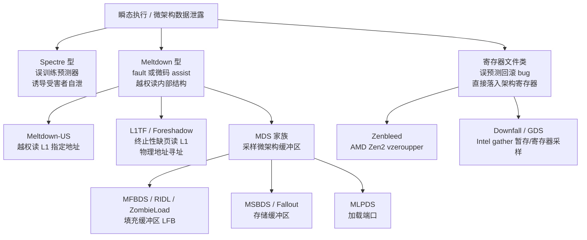
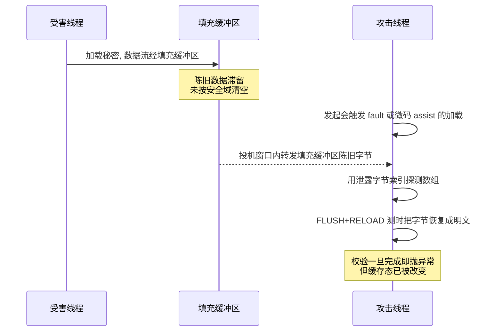
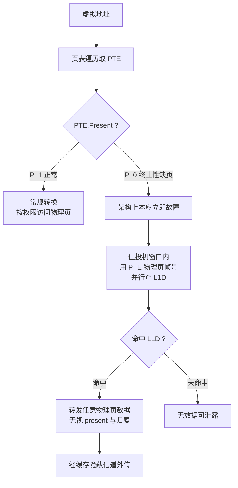
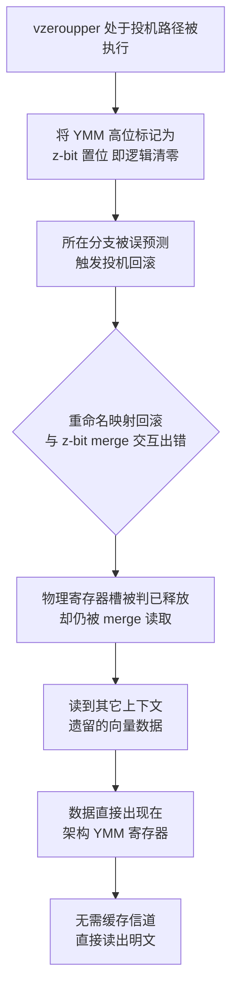
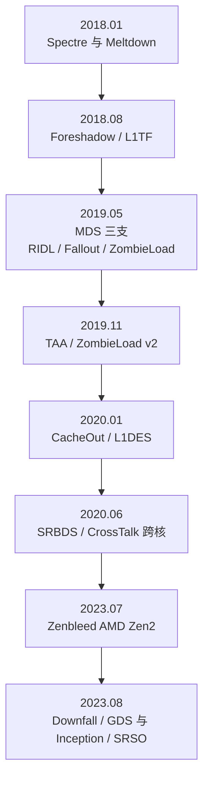

# CPU微架构与执行引擎（15）· 侧信道进阶：MDS与L1TF与Zenbleed
> [!abstract] TL;DR
> - MDS 不像 Meltdown 那样「点名读某个地址」，而是**采样**填充缓冲区/存储缓冲区/加载端口里正在流动的陈旧数据——你拿到什么由运气决定，靠海量重复加过滤把秘密捞出来，且这些缓冲区在 SMT 兄弟线程之间共享。
> - L1TF/Foreshadow 利用**终止性缺页**：PTE 的 Present=0 本应立刻故障，但 CPU 在投机窗口里先拿 PTE 的物理页帧号去查 L1D，于是能越过权限与 present 检查读取任意驻留 L1 的物理内存——直接击穿 SGX 机密性与虚拟机隔离。
> - Zenbleed 是 AMD Zen2 寄存器文件的 use-after-free：`vzeroupper` 在误预测路径上被投机执行后回滚不当，已被「释放」的物理寄存器仍被 merge 逻辑读到，跨域向量数据**直接出现在架构 YMM 寄存器**——无需缓存隐蔽信道解码，约 30KB/s 静默泄露。
> - 三者共同根因是「CPU 在完成权限校验之前就转发了数据」，但泄露的**结构**不同（缓冲区 vs L1 vs 寄存器文件），这决定了检测、利用与缓解手段各不相同。
> - 缓解是「逐结构」的微码加内核协同：VERW/MD_CLEAR 冲刷缓冲区、L1D_FLUSH 加 PTE 反转对付 L1TF、DE_CFG 鸡贼位或微码堵 Zenbleed；多租户环境还要在关 SMT 与核内调度之间权衡吞吐。

## 概述与定位

上一篇（[[14.微架构侧信道：Spectre与Meltdown|Spectre与Meltdown]]）确立了瞬态执行攻击的两条主干：Spectre 型通过**误训练预测器**，诱导受害者在投机路径上泄露它自己的数据；Meltdown 型则借助一次**错误（fault）**，在异常真正抛出之前的投机窗口里，越权读取一个**指定地址**的数据。本篇要讲的 MDS、L1TF、Zenbleed，是这个家族的「第二波」，它们把泄露面从「点名地址」推进到三个全新的内部结构，并在攻击哲学上出现了三处质变，正是本篇要穷尽说清的东西。

第一处质变是**从「寻址读」到「采样读」**。Meltdown 攻击者能挑地址：想读内核某个字节，就构造一条指向它的加载。MDS（Microarchitectural Data Sampling，微架构数据采样）却做不到寻址——它转发的是**恰好正在填充缓冲区、存储缓冲区、加载端口里流动的陈旧字节**，攻击者不能选，只能「守株待兔」：疯狂重复触发泄露，把捞到的字节按上下文特征过滤，从噪声流里拼出秘密。这也是它名字里「Sampling（采样）」的由来。

第二处质变是**从虚拟地址越权到物理地址越权，隔离边界被整层击穿**。L1TF（L1 Terminal Fault，L1 终止性缺页；Intel 称 Foreshadow）不看虚拟地址权限，而是拿页表项里的**物理页帧号**去查 L1D 数据缓存。这意味着攻击者只要能构造一个 Present=0 的页表项、并把它的物理地址位指向目标，就能读取任何驻留在 L1 里的物理页——于是恶意**虚拟机**能读宿主机与邻居 VM，非 enclave 代码能读 **SGX** enclave 的明文乃至证明密钥。这是比 Meltdown 更可怕的爆炸半径。

第三处质变来自 **Zenbleed**：它根本不是「瞬态窗口加缓存隐蔽信道」那套。它是 AMD Zen2 寄存器文件在处理 `vzeroupper` 时的管理错误，泄露的数据**直接落进架构可见的 YMM 寄存器**，读出来就是明文，不需要 FLUSH+RELOAD 去测时解码。这让它又快又稳又安静，也让很多「盯着缓存计时模式」的检测手段直接失灵。

把三者摆进瞬态执行的谱系里：MDS 与 L1TF 属于 **Meltdown 型**（由攻击者自己代码里的一次 fault 或微码 assist 打开投机窗口，读到本无权读的数据），而 Zenbleed 是一类**由误预测触发、但经由寄存器文件直接泄露**的数据采样 bug，介于两者之外自成一类。它们共同印证了本系列反复出现的主题：**为性能而生的每一处「先转发、后校验」的优化（转发缓冲、投机 L1 查找、寄存器重命名省寄存器），都会开出一道让数据在校验完成前跨越安全域的缝**。理解这道缝在哪个结构上、宽多少、如何按结构收口，就是这一篇的全部。



## 原理与机制

三种漏洞机制迥异，但都可以拆成「触发—转发—外传」三段。下面逐个把「为什么会这样设计（why）」和「一步步怎么泄露」讲透，删掉后面的代码也能独立看懂。

### MDS：把正在流动的缓冲区数据采样出来

现代乱序核为了不被访存拖死，在加载与存储的通路上塞满了**转发缓冲**。当一条加载无法按正常路径立刻完成时——比如它引发了缺页、访问了不可缓存内存、跨了缓存行边界、或触发了一次**微码 assist**（例如需要回写页表的 Accessed/Dirty 位）——CPU 会走「异常/重放」慢路径。问题在于：**在这条慢路径确认「该数据不该给你」之前的极短窗口里，流水线已经把某个中间缓冲里的字节转发给了依赖它的后续指令**。这些字节不是攻击者请求地址的数据，而是缓冲区里「上一位租客」留下的陈旧内容。按泄露的结构，MDS 分成几支：

- **填充缓冲区（Line Fill Buffer, LFB）**——对应 MFBDS（CVE-2018-12130，即 RIDL、ZombieLoad）。LFB 是 L1 未命中时登记在途请求、暂存搬运中缓存行的结构，天然横跨 L1 与 L2/内存的数据流，什么都经手。
- **存储缓冲区（Store Buffer）**——对应 MSBDS（CVE-2018-12126，即 Fallout）。它缓存尚未提交的存储；store-to-load 转发本应按地址精确匹配，但在地址还没完全消歧时，它会**按部分地址匹配**把陈旧存储数据转发给加载。
- **加载端口（Load Port）**——对应 MLPDS（CVE-2018-12127），泄露正在加载端口上流转的数据。
- **不可缓存内存变体**——MDSUM（CVE-2019-11091），把上述采样扩展到 UC/WC 内存访问路径。

为什么这么设计？因为转发是**延迟优化的命根子**：store-to-load 转发省掉了「存了又立刻读」的缓存往返，LFB 让缓存「非阻塞」、支撑多路未命中并行（MLP）。bug 不在转发本身，而在于**转发通路可能在权限/地址匹配确认之前就投机激活，且这些缓冲区在切换安全域时没有被清空**。更糟的是，LFB 与存储缓冲区在 **SMT 兄弟线程之间物理共享**——于是你在一个逻辑核上采样，捞到的可能是同物理核另一逻辑核（跑着受害进程或内核）刚刚流经的秘密。这就是 MDS 天生「跨线程」的根源，也是为什么彻底缓解它常常要连 SMT 一起关。



### L1TF/Foreshadow：终止性缺页里的物理地址越权

x86 的地址转换在页表遍历时读到页表项（PTE）。若 **Present 位为 0**，架构语义是「该转换非法，立刻缺页」，这叫**终止性缺页**——遍历到此终止。但 L1D 是 **VIPT（虚拟索引、物理标签）**结构，为了省一个周期，CPU 会**在判定这次缺页的同时，并行地拿 PTE 里的物理页帧号字段去查 L1D**。如果 L1D 里恰好有一条物理标签与之匹配的行（那条行可能是宿主机、别的 VM、SGX enclave 放进去的），数据就在投机窗口里被转发给了后续指令——**Present=0 这道本该拦住一切的门，被绕过了**。

为什么这是灾难级？因为它是**物理地址寻址**且绕过了 present 检查这一层信任根：

- **SGX（Foreshadow, CVE-2018-3615）**：enclave 内存对外部代码按「abort page」语义呈现（读返回 -1），底层正是靠 not-present 之类机制。L1TF 直接读 L1 里的 enclave 明文，连远程证明用的密封/证明密钥都能捞出来，动摇整个 enclave 信任模型，Intel 被迫做 TCB recovery（撤销并升级证明基线）。
- **虚拟机（Foreshadow-NG, CVE-2018-3646）**：恶意**客户机自己就能构造客户 PTE**，把物理地址位填成任意**宿主机物理地址**。只要目标数据在 L1D，客户机就读到了宿主或邻居 VM 的内存。云上多租户共享物理核，这一条足以让厂商全体加班。
- 还有 OS/SMM 变体（CVE-2018-3620），针对内核换出页与 SMM。

一句话：Meltdown 是「越过用户/内核权限位读虚拟地址」，L1TF 是「越过 present 位读物理地址」，后者的隔离层级更底、波及面更广。



### Zenbleed：寄存器文件的 use-after-free

Zen2 为省物理寄存器做了一个优化：YMM（256 位）寄存器的**高 128 位**若为零，不必真的分配/合并一个物理寄存器，而是用一个 **z-bit（zero bit，「高位为零」标记）**记账。`vzeroupper` 指令的语义正是把所有 YMM 的高 128 位清零——在这个优化下，它更像是「把一批 z-bit 置位」，而非真去写零。

Zenbleed（CVE-2023-20593，Tavis Ormandy 2023 年 7 月披露）的核心是：当 `vzeroupper` 处在一条**会被误预测的分支**的投机路径上、随后因误预测而**回滚**时，寄存器重命名映射的回滚与 z-bit/merge 逻辑**交互出错**——一个本应被判为「已释放」的物理寄存器槽，仍被后续的 merge 操作当作有效来源读取。而这个「已释放」的槽，早晚会被分配给**其它上下文**（另一个线程、进程、甚至 VM）的向量操作复用。于是别人遗留在该物理槽里的向量数据，就**直接出现在你的架构 YMM 寄存器**里。

它为何比 MDS/L1TF 更「趁手」？因为它**跳过了整套瞬态执行加缓存信道模型**：泄露物是架构态，读出即明文，不必构造探测数组、不必测时解码，因而快（约 30KB/s/核）、稳、静。又因为 SIMD 寄存器无处不在——glibc 的 `memcpy`/`strlen`/`strcmp` 用 AVX 实现、各种加密库用向量指令——你等于在核上架了一根**跨域数据的消防水管**，密码、密钥、内存内容随流而出。它只影响 **Zen2**（Ryzen 3000、部分 4000/5000、EPYC 7002「Rome」等），Zen1、Zen3 的寄存器管理不同，不在此列。



## 微架构缓冲区与数据通路详解

这一段深入被泄露的**结构本身**——它们的生命周期、转发通路、以及「为什么陈旧数据会滞留、又为什么能被投机读到」。把结构讲清，缓解手段为何长成那样就不言自明了（结构层可回顾 [[08.存储子系统：Load-Store队列|Load-Store队列]]、[[09.缓存层级与替换策略|缓存层级]]、[[05.寄存器重命名与物理寄存器堆|寄存器重命名与物理寄存器堆]]）。

### 触发器：fault 与「微码 assist」为何能开窗

MDS 的窗口不只由缺页开启，更常见、更隐蔽的是**微码 assist**。当一条微指令遇到 CPU 硬件不便直接处理的边角情况——需要置位页表 A/D 位、非规范地址、跨行加载需拆分、浮点异常辅助等——流水线会陷入一段**微码流程**去善后，并**重放**该加载。恰是这段「先给个临时结果、稍后重放纠正」的机制，制造了「结果已转发、纠正还没到」的投机窗口。理解这点很关键：**你甚至不需要一个真正会送死的越权加载**，只要能稳定诱发 assist（比如故意让 PTE 的 A 位未置、或制造对齐边角），就能反复开窗采样。

**TAA（TSX Asynchronous Abort，CVE-2019-11135，即 ZombieLoad v2）**是同一批缓冲区的**另一个触发口**：在一个 TSX 事务里发起加载，再异步中止事务，中止的善后同样会转发缓冲区陈旧数据。它的意义在于——有些较新的 CPU 硬件枚举了 `MDS_NO`（宣称 MDS 已修），却仍带 TSX，于是 TAA 又把 MDS 的缓冲区泄露以新触发口复活。这解释了为何缓解清单里 `tsx_async_abort` 常与 `mds` 并列，以及「不用 TSX 就干脆关掉」成了推荐做法。

### 填充缓冲区与存储缓冲区的生命周期

**LFB** 类似 MSHR（Miss Status Handling Register）：L1 未命中时分配一项，登记地址、掩码与在途状态，作为搬运中缓存行的暂存；数据回填后释放。释放≠清零——项里的字节会一直**滞留**到被下一次分配覆盖。投机转发通路又允许「数据看似已就绪就先转发」，两者叠加，陈旧字节便可被采样。**存储缓冲区**每项记一条在途存储的地址与数据；store-to-load 转发在地址**尚未完全消歧**时按部分位匹配抢跑，于是一条本不该匹配的加载，拿到了某条存储项的陈旧数据（MSBDS）。这两个结构都**按物理核在 SMT 兄弟间共享**，这正是跨线程泄露与「关 SMT 才彻底」的物理根据。

CacheOut/L1DES（CVE-2020-0549）是精彩的一手「组合技」：它先**主动把目标行从 L1D 逐出**，逐出必经 LFB，从而把「随机采样」升级为**近乎寻址**的读——把 MDS 的运气成分显著压低。这说明缓冲区类漏洞的利用可以不断被工程化。

### L1D 的 VIPT 与 PTE 字段

L1TF 能成立，仰仗 L1D 的 **VIPT**：用虚拟地址低位（页内偏移，转换前后不变）当索引、用物理标签作命中判定，好处是**索引与地址转换并行**、省一拍。代价是——当 PTE 呈 present=0 时，那一拍并行里，物理页帧号已经被送去比对标签了。下面把 4KB 页 PTE 的关键布局摊开，L1TF 觊觎的正是中间那段 PFN：

```
x86-64 页表项 PTE 关键字段 (4KB 页, 64 位)
 63    62 .. 52       51 ................ 12    11 .. 9   8 .. 1     0
+----+------------+------------------------------+--------+---------+-----+
| NX | 保留/软件位 |        物理页帧号 PFN         | 软件位 |  标志位  |  P  |
+----+------------+------------------------------+--------+---------+-----+
                   ^^^^^^^^^^^^^^^^^^^^^^^^^^^^^^                      ^
                   L1TF 在投机窗口拿它去查 L1D                     Present=0
                   (无视此刻 P=0 本应终止遍历)                  本应触发终止性缺页
```

内核缓解据此有一招极精巧的 **PTE 反转（PTE inversion）**：对 present=0 的项，把地址位**取反**，使投机时算出的物理地址落到「远高于已装内存」的区间，L1 必然未命中，泄露归零。它不需要额外指令开销，是「用语义换安全」的典范。运行时另一路是 **L1D_FLUSH**（写 IA32_FLUSH_CMD MSR 的 bit0），在**每次 VM entry 冲掉 L1D**，让客户机进来时 L1 里没有宿主/邻居的秘密可读。两招合并，再叠加「不与不可信 SMT 兄弟同核并跑」，L1TF 才算收口。

### 寄存器文件与部分宽度写的 merge

Zenbleed 要放到**物理寄存器堆（PRF）加重命名**的框架里看。当你只写 XMM（低 128 位），YMM 高 128 位按语义要保持不变（非 VEX 编码）或按规则处理，重命名器要么保留旧高位、要么做一次 **merge**（把两个物理来源合成一个逻辑 YMM）。z-bit 优化就是为「高位是零」这种超常见情形省掉物理分配与 merge。投机执行要求重命名映射能在误预测时**回滚到检查点**。Zenbleed 恰是回滚这条路径上，`vzeroupper` 造成的 z-bit 状态与「物理槽是否仍被引用」的账目对不齐——**槽被当作可回收，却仍被一次 merge 消费**，读出了它未来租客（或曾经租客）的数据。这也解释了它的两个特征：数据是**架构态**（因为 merge 的产物就是架构 YMM），且**与缓存无关**（泄露发生在寄存器堆内部）。

顺带厘清一条**演化脉络**：Zenbleed 之后一个月，Intel 侧的 **Downfall/GDS（Gather Data Sampling, CVE-2022-40982）**披露——`gather` 指令用于暂存分散数据的内部缓冲/寄存器文件同样会跨域采样，被视为 MDS 在**寄存器与 gather 暂存**层面的「精神续作」，影响 Skylake 到 Tiger Lake 一大片。再加上跨核的 **SRBDS/CrossTalk（CVE-2020-0543）**——`RDRAND`/`RDSEED`/`EGETKEY` 经由**全 socket 共享的一个 staging buffer**取值，于是一个核能采样到另一个核的随机数输出（罕见的**跨核**泄露），缓解只能把这些指令**串行化**（`RDRAND` 因此重罚性能）。把 MDS、L1TF、Zenbleed、Downfall、SRBDS 摆在一条时间线上，能清楚看到攻击面**从缓存到缓冲区、再到寄存器堆、乃至跨核共享暂存**逐级迁移的轨迹。



## 工具视角与实战

本节全部站在**防御与研判**视角：如何判断自己是否受影响、缓解是否真正生效、微码/内核旋钮各管什么。所有涉及 PoC 的部分只讲**结构骨架**用于理解原理，不给可直接打真实目标的成品。

### 一眼看清「我中招没有、堵上没有」

Linux 把结论集中在 sysfs，最省事：

```bash
# 逐条查看内核对各微架构漏洞的判定与当前缓解状态
grep -r . /sys/devices/system/cpu/vulnerabilities/ 2>/dev/null
# 关注: mds  l1tf  tsx_async_abort  srbds  mmio_stale_data  gather_data_sampling
# 典型输出语义:
#   "Not affected"                 硬件不受影响 (可能枚举了 MDS_NO 等)
#   "Mitigation: Clear CPU buffers; SMT vulnerable"   已用 VERW 冲缓冲, 但 SMT 仍是缺口
#   "Vulnerable"                   受影响且未缓解 (缺微码或被关闭)
```

判「硬件本身修没修」要看 **IA32_ARCH_CAPABILITIES（MSR 0x10A）**里的枚举位（如 `RDCL_NO`、`MDS_NO`、`TAA_NO` 等）；判「缓解能力在不在」要看 CPUID：`MD_CLEAR`（CPUID.7.0:EDX[10]）表示微码已把 **VERW** 升级为「顺带冲刷微架构缓冲区」。这两组要分开看——枚举了 `MDS_NO` 只说明这一条硬件已修，**不代表 TAA 也修**（前面讲过 TSX 会复活它）。`lscpu` 会把这些汇总成人话，社区脚本 `spectre-meltdown-checker.sh` 则逐项给「受影响/已缓解/建议」。微码版本从 `/proc/cpuinfo` 的 `microcode` 字段或 `dmesg | grep microcode` 读，**缓解生效的前提是微码到位**。

### 内核旋钮与它们各自的代价

```bash
# 内核命令行 (grub) 常见缓解开关及其含义:
mds=full,nosmt            # VERW 冲缓冲; nosmt 关超线程以堵跨兄弟采样
l1tf=flush                # VM entry 冲 L1D (默认); full 另含条件性关 SMT
tsx_async_abort=full,nosmt
mmio_stale_data=full
gather_data_sampling=force # Downfall/GDS
tsx=off                   # 不用 TSX 就关掉, 直接消灭 TAA 触发口
mitigations=auto,nosmt    # 一把梭: 启用推荐缓解并关 SMT
```

理解**代价**才能做对权衡：VERW 会在**每次返回用户态/进 VM/进 idle** 时冲一遍缓冲，路径上多几十到上百周期；`L1D_FLUSH` 在**每次 VM entry** 冲 L1D，访存密集型 VM 退换频繁时开销可观；`nosmt` 直接砍掉一半逻辑核的并行度；SRBDS 缓解让 `RDRAND` 串行化，重度依赖它的负载会明显变慢。这是一条**安全与吞吐的连续旋钮**，不是开关。

### Zenbleed：微码优先，鸡贼位兜底

AMD 对 Zen2 发了微码修复，走 BIOS 或操作系统 early microcode loading 落地。微码未到位时，可用 **DE_CFG（MSR 0xC0011029）的 bit 9（FP_BACKUP_FIX，俗称 chicken bit）**做临时缓解——它关掉那条出问题的寄存器优化路径，代价是一点向量性能：

```bash
# 读取所有核的 DE_CFG 现值 (需要 msr-tools 与 root; 属排障/加固用途)
rdmsr -a -c 0xc0011029
# 置位 bit 9 作为微码到位前的临时缓解 (示意: 原值 OR (1<<9) 后写回)
# wrmsr -a 0xc0011029 <原值|0x200>
# 之后重跑 grep .../vulnerabilities/ 确认状态变化, 并优先升级微码而非长期依赖鸝贼位
```

### PoC 的结构（仅原理，不武器化）

理解利用形态有助于**写检测与验证**，故只给骨架。MDS/L1TF 属瞬态执行，末端都要**缓存隐蔽信道**把「投机读到的字节」外传，经典是 FLUSH+RELOAD：

```
探测数组 probe[256 * 4096]      // 每个可能字节值占一独立 4KB 页, 拉开距离避免硬件预取串扰
恢复一个泄露字节 secret 的思路:
  1) clflush 冲刷整个 probe      // 令其初始全部不在缓存
  2) 在瞬态窗口内: tmp = probe[secret * 4096]   // 把 secret 编码进"哪一页被带入缓存"
  3) 逐页测量访问延迟: 延迟明显偏低(命中)的页下标 i  =>  secret == i
  // MDS: secret 来自缓冲区采样, 需重复海量次并按上下文特征过滤噪声
  // L1TF: secret 来自 present=0 的 PTE 所指物理地址在 L1D 的命中
```

Zenbleed 则**没有这一步**——它的骨架是一段「诱发 `vzeroupper` 落在误预测路径并回滚、随后读 YMM」的循环，读出的寄存器里**直接就是**别的上下文的向量数据：

```
; 概念骨架, 仅为讲清"泄露物是架构态", 非完整可用 PoC
  vzeroupper                 ; 将 YMM 高 128 位标记为逻辑清零 (z-bit)
  ; ... 构造一条会被误预测的分支, 使上面的 vzeroupper 处在投机路径 ...
  ; 误预测回滚后, "已释放"的物理槽仍被 merge 消费
  vmovdqa ymm0, [rsi]        ; 读出的 YMM 高位混入其它上下文遗留的向量数据
  ; 循环重复即得到跨域数据流 (memcpy/strlen/crypto 的向量寄存器内容)
```

逆向/研判视角的三个抓手：一是 `dmesg`/sysfs 交叉验证「微码版本 ↔ 缓解状态」是否自洽（微码没升却显示已缓解，多半是旋钮误配）；二是用 `perf` 量 VERW/L1D_FLUSH 带来的退出路径开销，评估缓解的真实成本；三是对 Zenbleed 这类**无缓存计时特征**的漏洞，别再指望缓存 side-channel 检测器，只能靠**微码版本与 DE_CFG 位**来断定是否已堵。

## 安全性与正确使用

> [!caution] 合规边界（务必先读）
> 本文所有原理、骨架与命令仅用于**自有或已获明确书面授权的环境、CTF 靶场与防御性安全研究**，立场是**防御与教育**。严禁将其用于攻击真实生产系统、他人系统、云上邻居租户，或用于绕过 SGX/商业授权等保护以窃取数据。文中**刻意不提供**针对真实目标的武器化配方（如现成的跨 VM 提取脚本、SGX 密钥导出成品、稳定的 Zenbleed 数据抓取器），只把机制讲透以便**检测、加固与验证缓解**。在多租户或受监管环境部署验证前，须获授权、走变更评审，并优先在隔离靶机复现。

站在防守方，落地要点如下。**第一，微码是地基**：VERW 的缓冲区冲刷、L1D_FLUSH、Zenbleed 修复全靠微码，务必让 BIOS 与 OS 的 microcode 都升到含修复的版本，并核对 `microcode` 字段——没有微码，内核旋钮多是空转。**第二，SMT 要做决策**：MDS 与 L1TF 的跨兄弟采样根子在 SMT 共享缓冲/缓存；多租户云、跑不可信代码的主机应认真评估 `nosmt` 或**核内调度（core scheduling）**——后者保证同物理核只跑同信任域，兼顾一部分吞吐。**第三，虚拟化要冲 L1D 加 PTE 反转**：VM entry 的 `L1D_FLUSH` 配内核的 PTE 反转，是挡 Foreshadow-NG 的组合拳；不需要嵌套/EPT 特性时收敛攻击面同样有效。**第四，不用的功能就关**：TSX 若无业务依赖，`tsx=off` 直接铲掉 TAA 触发口，比逐个缓解更干净。

要有**纵深防御**的自觉：这些漏洞反复证明「物理共置本身就是威胁」，别把机密性寄托在「攻击者和我不在同一台机器」的假设上。密码实现仍要坚持**常量时间**（呼应 [[37.密码学/61.侧信道攻击|密码实现层侧信道]]），因为一旦寄存器/缓冲区里的中间态被采样，算法层的时序恪守能显著抬高攻击门槛。硬件加固特性（[[34.现代二进制防护机制/09.Intel CET|CET]] 挡控制流劫持、[[34.现代二进制防护机制/13.MTE内存标签扩展|MTE]] 抓内存安全）与本篇的瞬态执行缓解**正交但互补**，共同构成体系化防线。最后务必**闭环验证**：改完旋钮/升完微码，回到 `/sys/.../vulnerabilities/` 逐条确认状态从 `Vulnerable` 变为 `Mitigation` 或 `Not affected`，别停在「我配了」而不看「它生效没」。

## 小结

MDS、L1TF、Zenbleed 是 Spectre/Meltdown 之后瞬态执行与数据采样攻击的三次结构性推进：**MDS** 把泄露从「寻址读」变成「采样读」，目标是填充缓冲区、存储缓冲区、加载端口，且天然跨 SMT 兄弟；**L1TF** 借终止性缺页拿 PTE 物理页帧号越权查 L1D，以物理地址击穿 SGX 与虚拟机隔离；**Zenbleed** 则是寄存器文件在 `vzeroupper` 回滚上的 use-after-free，跨域数据直接落进架构 YMM，连缓存信道都省了。三者同根——**投机转发跑在权限校验之前、且共享结构不按域清理**——却因泄露结构不同而各需其药：VERW/MD_CLEAR 冲缓冲、L1D_FLUSH 加 PTE 反转堵 L1TF、DE_CFG 位或微码补 Zenbleed，再辅以关 SMT 或核内调度。从 Meltdown 到 MDS，再到 Downfall/Zenbleed 的寄存器堆，攻击面持续向更内层的微架构结构迁移，也把「缓解 = 逐结构的微码与内核协同设计」这一现实钉死。承上启下地看，下一篇（[[16.性能剖析：PMU与perf与火焰图|PMU与perf]]）会介绍如何用性能计数器量化这些缓解的真实开销，而其机理与体系化收口留待 [[17.微码与CPU漏洞缓解|微码与CPU漏洞缓解]]。

## 相关阅读

- 同系列上承：[[14.微架构侧信道：Spectre与Meltdown|（14）Spectre与Meltdown]]（Meltdown 型与 Spectre 型的基础谱系）
- 同系列结构基础：[[13.SMT超线程与资源共享|（13）SMT超线程与资源共享]]、[[08.存储子系统：Load-Store队列|（08）Load-Store队列]]、[[09.缓存层级与替换策略|（09）缓存层级与替换策略]]、[[12.TLB与地址转换加速|（12）TLB与地址转换]]、[[05.寄存器重命名与物理寄存器堆|（05）寄存器重命名与物理寄存器堆]]
- 同系列下承：[[16.性能剖析：PMU与perf与火焰图|（16）PMU与perf与火焰图]]、[[17.微码与CPU漏洞缓解|（17）微码与CPU漏洞缓解]]、[[00.CPU微架构与执行引擎总览|系列总览]]
- 汇编底层：[[21.Asm/39 缓存与缓存一致性|缓存与缓存一致性]]、[[21.Asm/38 MMU与页表设置实战|MMU与页表设置实战]]、[[21.Asm/28 原子操作与内存模型|原子操作与内存模型]]
- 侧信道呼应：[[37.密码学/61.侧信道攻击|密码实现层侧信道]]（与本篇微架构层互补）
- 防护呼应：[[34.现代二进制防护机制/09.Intel CET|Intel CET]]、[[34.现代二进制防护机制/13.MTE内存标签扩展|MTE内存标签扩展]]
- 官方与论文（按名检索）：Intel 官方技术白皮书 *Microarchitectural Data Sampling (MDS)*、*L1 Terminal Fault (L1TF)*、*Special Register Buffer Data Sampling (SRBDS)*；AMD 安全公告 *AMD-SB-7008 / CVE-2023-20593 (Zenbleed)*；论文 *RIDL: Rogue In-Flight Data Load*、*ZombieLoad*、*Fallout*、*Foreshadow*、Canella 等 *A Systematic Evaluation of Transient Execution Attacks and Defenses*、Moghimi *Downfall (GDS)*；Tavis Ormandy 的 Zenbleed 技术说明；Linux 内核文档 *Documentation/admin-guide/hw-vuln/*（mds、l1tf、tsx_async_abort、special-register-buffer-data-sampling、gather_data_sampling）

[[00.CPU微架构与执行引擎总览|⬆ 系列总览]] | [[14.微架构侧信道：Spectre与Meltdown|← 上一章]] | [[16.性能剖析：PMU与perf与火焰图|→ 下一章]]
