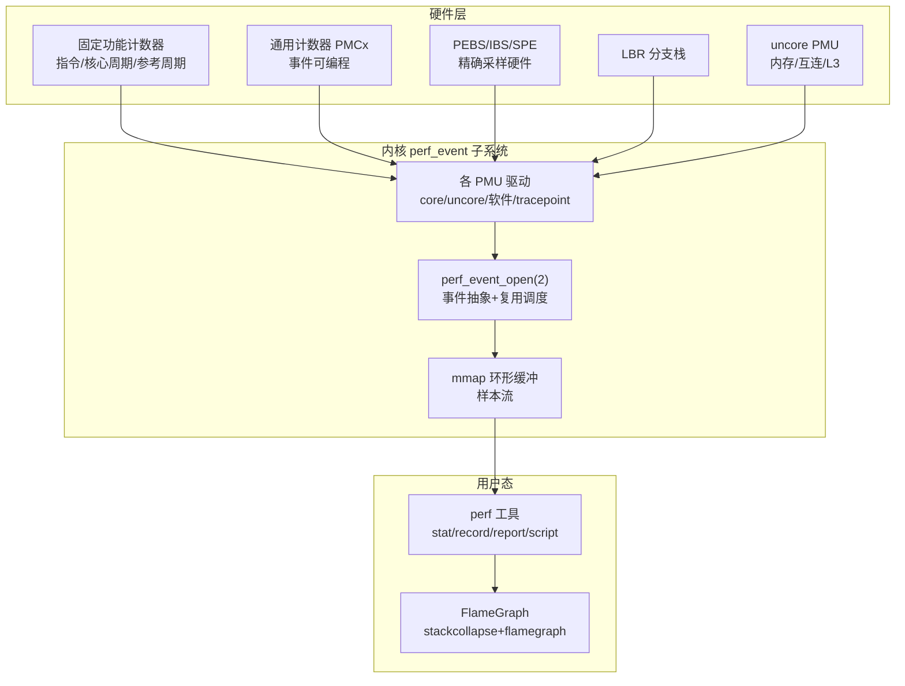
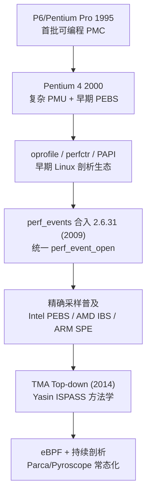
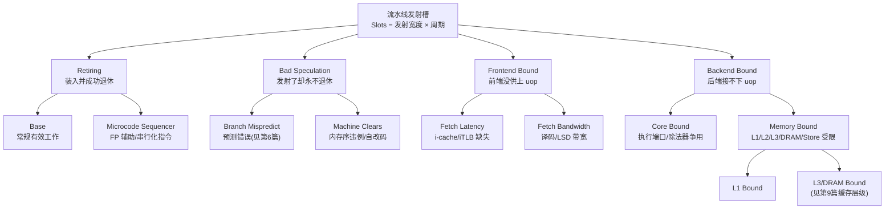

# CPU微架构与执行引擎（16）· 性能剖析：PMU与perf与火焰图

> [!abstract] TL;DR
> - PMU（性能监控单元）是 CPU 内建的一组可编程硬件计数器，通过写 MSR 选定「事件编号+子掩码+条件」后，在退休或执行路径上近乎零侵入地累加；**计数（counting）回答「有多少」，采样（sampling）借计数器溢出触发中断、抓取当时的指令指针与调用栈，回答「在哪里」**。
> - perf 是 Linux 把 Intel/AMD/ARM 各家 PMU、内核软件事件、tracepoint、kprobe/uprobe 统一到一个 `perf_event_open(2)` 系统调用之下的框架：`perf stat` 做计数、`perf record`/`perf report` 做采样、`perf top` 做实时、`perf mem`/`perf c2c` 做访存与伪共享定位。
> - 采样天生有 **skid**（采到的 IP 滞后于真正触发事件的那条指令），Intel PEBS / AMD IBS / ARM SPE 用硬件在事件发生点直接把现场写回内存，把偏差压到 1 条指令，这是可信归因的前提。
> - 火焰图**不是时间轴**：x 轴是把海量调用栈按字母序折叠合并后的样本占比，宽度=占用 CPU 的比例，塔高=调用深度；读图要看「顶部平顶」而不是「最高的塔」。
> - Top-down（TMA）方法把每个流水线发射槽归类为 Retiring / Bad Speculation / Frontend Bound / Backend Bound 四类，用少量事件逐层下钻，直接指出瓶颈在前端取指、后端资源、访存还是错误投机，取代了「盲猜哪个计数器要紧」。
> - 调用栈还原有帧指针（快但需 `-fno-omit-frame-pointer`）、DWARF（准但拷栈开销大）、LBR（省但深度受限）三条路；`perf_event_paranoid`、`kptr_restrict`、CAP_PERFMON 决定你能看到多少内核与他人的现场。

## 概述与定位

在本系列前十五篇里，我们拆开了乱序执行引擎的每一个齿轮：流水线如何分级、超标量如何多发射、Tomasulo 如何动态调度、分支预测器如何猜、缓存与 TLB 如何吸收延迟、投机如何在错误时回滚、SMT 如何共享资源，直到 Spectre/Meltdown/MDS 如何把这些机制变成泄露通道。所有这些论述都建立在一个隐含前提上——**这些微架构现象是真实发生、且可被观测的**。本篇要回答的正是「怎么观测」：当一段代码跑得慢，慢在前端喂不饱、后端排不开、缓存频繁缺失，还是分支老猜错？源代码的语义（「这里做一次加法」）和硅片上的实际行为（「这条加法因为等一个 L3 缺失的载入而在保留站里坐了 200 个周期」）之间隔着一条鸿沟，而 PMU、perf、火焰图正是架在这条鸿沟上的桥。

性能剖析要回答两个根本不同的问题，务必分清。**第一个是「热点在哪」（where）**：程序把时间花在了哪些函数、哪些代码行上，这是**定位**问题，火焰图是它的最佳可视化。**第二个是「为什么慢」（why）**：同样是在这个热点函数上,CPU 的执行资源到底卡在了哪一环,这是**归因**问题,Top-down 分析与具体事件计数是它的武器。很多人只做到第一步——找到热点函数就开始优化，却不问这个函数是计算密集（该向量化）还是访存密集（该改数据布局），结果南辕北辙。本篇会强调：**先用采样定位到热点，再用计数与 Top-down 判定瓶颈性质，最后才动手**。

要把三个易混概念钉死。**计数（counting）** 是让某个计数器从头跑到尾，最后读一个总数，回答「这段程序一共发生了多少次 L1 缺失」，`perf stat` 干这个，开销极低、结果精确无偏。**采样（sampling）** 是让计数器每累积 N 个事件就中断一次、抓一张「快照」（当时的 IP、寄存器、调用栈），用统计学意义上的样本分布近似「事件密集地」，`perf record` 干这个，开销可控但有统计噪声与 skid。**插桩（instrumentation）** 则是往代码里塞探针（编译期 `-pg`、运行期动态改写、tracepoint），精确但侵入、开销大且会改变被测对象的行为。三者与「profiling（剖析，看整体分布）/ tracing（追踪，看逐事件时间线）/ benchmarking（基准，看单一指标）」是正交的两组维度。本篇主线是**基于硬件计数器的采样式剖析**，这是理解真实微架构性能的主干道。

必须警惕的第一原则是**观测者效应（observer effect）**：任何测量都会扰动被测系统。采样频率越高、调用栈越深、拷栈越多，perf 自身占的 CPU、抢的缓存、发的中断就越多，测出来的分布就越偏离「不测时」的真实分布。好的剖析追求「用最低扰动拿到足够可信的信号」，而不是「频率拉满」。这一点贯穿全篇的每个取舍。

## 原理与机制

### PMU：藏在核心里的可编程秒表

现代 CPU 每个逻辑核心里都有一小组硬件计数器，分两类。**固定功能计数器（fixed-function counter）** 是焊死用途的，Intel 上通常三个：退休指令数（`INST_RETIRED.ANY`）、核心时钟周期（`CPU_CLK_UNHALTED.THREAD`，随频率变化）、参考时钟周期（`REF_TSC`，恒定频率）。**通用计数器（general-purpose counter，PMCx）** 才是可编程的，每逻辑核通常 4 个（Intel 关掉 SMT 后可能 8 个，近几代更多；AMD 每核 6 个），你可以让每个通用计数器去数任意一个受支持的事件。

「让计数器去数某事件」的动作，是往一对 MSR（Model-Specific Register，需内核态特权指令 `wrmsr` 访问）写值完成的：`IA32_PERFEVTSELx`（事件选择寄存器，一个「遥控器」）配对 `IA32_PMCx`（存计数值）。事件选择寄存器的位布局是理解 PMU 的钥匙，用文字+代码块讲清比硬塞进 Mermaid 更直观：

```
IA32_PERFEVTSELx (MSR 0x186 + x)  ——  选“数什么、怎么数”的遥控器
 63          32 31    24 23 22 21 20 19 18 17 16 15       8 7        0
[  保留/扩展  ][  CMASK ][I ][E ][A ][E ][P ][E ][O ][U ][  UMASK  ][ EventSel ]
                          NV EN NY N  C  DG S  SR
 EventSel[7:0] : 事件编号（如 0xC0 = INST_RETIRED，0xC4 = BR_INST_RETIRED）
 UMASK[15:8]   : 事件子掩码，限定同一编号下的细分口径（如载入命中 L1/L2/L3 是同族不同 umask）
 USR[16]/OS[17]: 只在用户态(ring 3) / 内核态(ring 0)计数——perf 的 :u / :k 修饰符即改此位
 E[18]         : 边沿检测，对布尔型状态记“上升沿次数”而非“驻留周期数”
 PC[19]        : pin control（历史遗留，罕用）
 INT[20]       : 溢出时产生 PMI 中断——采样模式必须置位，纯计数不置
 ANY[21]       : SMT 下把同物理核所有逻辑线程一起计入（呼应[[13.SMT超线程与资源共享]]，新核多已弃用）
 EN[22]        : 使能本计数器
 INV[23]+CMASK : 阈值比较——每周期事件数≥CMASK 记 1，INV 反转判据；用于“每周期发射≥1条uop”这类度量
```

一个事件的完整身份是「EventSel + UMask + 若干标志位」的组合，这也是为什么 `perf list` 里同一族事件（如 `MEM_LOAD_RETIRED.L1_HIT` / `.L2_HIT` / `.L3_HIT` / `.L3_MISS`）共享事件编号、只差 umask。这些编码**强平台相关**：Intel、AMD、ARM 的事件号完全不同，甚至 Intel 不同微架构代际之间也在变，所以 perf 才要维护庞大的每型号事件表（JSON），把人类可读的事件名翻译成具体 CPU 的原始编码。你也可以用 `-e r<umask><event>`（如 `r01c0`）直接下原始编码，绕过事件表——逆向或跑未被 perf 收录的新核时常用这招。

### 从计数到采样：溢出、PMI 与快照

纯计数很简单：置好遥控器、清零 PMC、让程序跑、最后读 PMC。采样则用了一个精巧的反向技巧——**不是数到 N 停，而是从「溢出前 N 个」开始数**。内核把 PMC 预置为 `2^计数器位宽 − 采样周期`，于是每累积「采样周期」个事件，计数器就溢出一次；溢出通过 Local APIC 的 LVT（本地向量表）投递一个**性能监控中断 PMI（Performance Monitoring Interrupt）**。CPU 陷入内核的 PMI 处理程序，此刻抓一张快照：当前指令指针 IP、线程 ID、时间戳，以及（如果开了 `-g`）调用栈。抓完重置计数器，程序继续跑。把海量快照的 IP 按地址归并、映射回符号，「哪些函数被采样命中得多」就等价于「哪些函数占 CPU 多」——这就是采样式剖析的统计学根基。

采样周期可以按事件数固定（`-c` 指定周期），也可以让内核动态调整以维持目标**采样频率**（`-F` 指定 Hz，如 `-F 99`）。频率模式更常用，因为它自适应负载。选 99 而非 100，是为了避开与程序里 100Hz、10ms 之类周期性行为「同频共振」造成的系统性偏采——这是一个被反复验证的老经验。


### perf_event：把万物计数器统一到一个系统调用

Linux 的 perf 子系统（2009 年并入 2.6.31，作者 Ingo Molnar、Peter Zijlstra 等，早期名 Performance Counters for Linux）做的最大贡献，是把「可被计数/采样的一切」抽象到唯一入口 `perf_event_open(2)`。调用者填一个 `struct perf_event_attr`：`type` 指定事件大类——`PERF_TYPE_HARDWARE`（PMU 硬件事件的通用别名，如 `cycles`/`instructions`）、`PERF_TYPE_RAW`（下原始事件编码）、`PERF_TYPE_HW_CACHE`（缓存事件的结构化编码）、`PERF_TYPE_SOFTWARE`（内核软件事件，如 `context-switches`/`page-faults`/`cpu-clock`，不占硬件计数器）、`PERF_TYPE_TRACEPOINT`（内核静态探针）；`config` 给出具体事件；`sample_period`/`sample_freq` 定采样节奏；`sample_type` 用位掩码勾选样本里要带哪些字段（IP、TID、TIME、ADDR、CALLCHAIN、BRANCH_STACK……）。系统调用返回一个 fd，用户态 `mmap` 它得到一段**环形缓冲**，内核把样本源源不断写进来，perf 在用户态消费并落盘成 `perf.data`。

这套抽象的威力在于：**硬件 PMU 事件、内核软件事件、静态 tracepoint、动态 kprobe/uprobe 走的是同一条采样管线**，因此 `perf record` 既能采「CPU 周期」也能采「每次进入某内核函数」，`perf stat` 既能数「L3 缺失」也能数「上下文切换」。此外 PMU 还分 **core PMU**（每核，数指令/周期/分支等）与 **uncore PMU**（核外，数内存控制器带宽、L3/CHA、UPI/Infinity Fabric 互连流量等），后者对分析 NUMA、内存带宽瓶颈不可或缺。



### 计数器不够用：复用与缩放

硬件通用计数器只有 4~8 个，但你常想同时看十几个事件（Top-down 一层就要好几个）。内核的对策是**时分复用（multiplexing）**：把事件分组轮流上机，每组只占几十毫秒，然后按「启用时间/总时间」的比例**线性外推**估算完整计数。代价是引入误差——尤其对突发性、非均匀分布的事件，某组恰好错过一次爆发就会系统性低估。`perf stat` 输出里那两列百分比（如 `[62.50%]`）就是每个事件的实际在机比例，**低于 100% 就意味着该数字是外推的、要打折看**。避免复用的办法：减少同时测的事件数，或利用 Ice Lake 及以后的硬件 Top-down 度量（`PERF_METRICS` MSR）——它用专用硬件槽直接给出 L1 四分类，几乎不占通用计数器、不需复用，这是近代 PMU 的一大进步。

### 演进脉络



早期 Linux 上剖析靠 oprofile（系统级采样）、perfctr、PAPI（跨平台计数器库）各自为战，perfmon2 曾试图进主线但被否，最终 perf_events 以更简洁的设计胜出并成为事实标准。精确采样硬件则是另一条线：Intel PEBS 起于 Pentium 4/Core，AMD IBS 起于 2007 年的 Barcelona，ARM SPE 是 ARMv8.2（约 2016）才补上的。方法学层面，Ahmad Yasin 2014 年的 Top-down 论文把「一堆事件」升级为「一套自顶向下的诊断流程」。最近十年的主题则是 eBPF 让采样与内核态分析可编程化，以及**持续剖析（continuous profiling）**——常态化低频采样整个机群，把性能剖析从「出事后救火」变成「生产环境常开的可观测性」。

## 采样偏差、调用栈还原与 Top-down 瓶颈定位详解

这是本篇的核心。前面讲清了「样本怎么产生」，这一节讲清让样本**可信、可解释、可下钻**的三块硬骨头：skid 与精确采样、调用栈还原、Top-down 归因。

### skid：为什么采到的地址常常是「错」的

PMI 从计数器溢出到内核真正抓下 IP，中间隔着好几拍：流水线很深（[[07.投机执行与重排序缓冲ROB]] 里退休与执行本就不同步）、中断有投递与响应延迟。等 CPU 停下来时，**触发事件的那条指令早已退休，IP 指向的是它后面若干条指令**。这个偏移叫 **skid（打滑）**。对「周期」这种到处发生的事件，skid 只是让热点在几行代码间稍微糊开，尚可接受；但对「L3 缺失」「分支预测错误」这种要精确落到某一条载入/某一个分支的事件，skid 是致命的——你会把缺失归罪到隔壁无辜的指令，优化错对象。

**精确采样（precise sampling）** 是硬件给的解药。Intel **PEBS（Precise Event-Based Sampling）** 在事件真正发生的那条指令退休时，由硬件把架构现场（触发事件的精确 IP、通用寄存器、对于访存事件还有数据地址与命中层级、载入延迟）直接写进内存中的 DS（Debug Store）缓冲区，PMI 只是稍后来搬运，于是归因偏差被压到「触发指令的下一条」（所谓 off-by-one，新一代自适应 PEBS 连这个都修了）。AMD **IBS（Instruction-Based Sampling）** 思路更彻底：不是「数某事件溢出」，而是周期性地随机**标记（tag）一条取指或一条微操作**，全程跟随它走完流水线，退休时汇报这一条的完整履历（是否缺失、在哪级命中、延迟多少、地址多少），因此 IBS 的归因天生精确、信息极丰富。ARM **SPE（Statistical Profiling Extension）** 是 ARM 的对应物，同样按指令采样并附带延迟与地址。在 perf 里，事件名后缀 `:p`/`:pp`/`:ppp`（或 `:P`）逐级要求更高精度，本质就是要求内核用 PEBS/IBS 而非普通溢出来采——**采访存、采分支、做 `perf mem`/`perf c2c` 时，不加精确修饰符的结果基本不可信**，这是实战第一条铁律。

### 调用栈还原：只知道叶子函数是不够的

采到叶子函数 `memcpy` 占了 30% CPU，然后呢？是谁在疯狂调 `memcpy`？必须还原**调用栈**才能把开销归到「业务上有意义的调用者」。perf 提供三条还原路径，各有取舍：

| 方式 | 原理 | 优点 | 代价与陷阱 |
| --- | --- | --- | --- |
| 帧指针 FP（`--call-graph fp`） | 沿 RBP 链逐帧回溯 | 快、样本小、开销低 | **需全程序 `-fno-omit-frame-pointer` 编译**；现代编译器默认省 RBP 做通用寄存器 → 栈断裂、只剩一两帧 |
| DWARF（`--call-graph dwarf`） | 采样时拷一段用户栈（默认 8KB），事后用 `.eh_frame`/CFI 在用户态展开 | 无需 FP、最准 | 每样本拷栈 → **数据量与开销暴涨**；栈深超过拷贝上限会截断；需调试信息 |
| LBR（`--call-graph lbr`） | 复用硬件末端分支记录栈重建调用链 | 开销极低、不需 FP 与调试信息 | **深度受 LBR 条目数限制（16~32）**，深栈还原不全；主要覆盖用户态 |

这张表背后是一个长期困扰整个行业的现实问题：**为了几个百分点的通用寄存器收益而默认 `-fomit-frame-pointer`，让基于 FP 的采样在生产二进制上大面积失灵**。近两年 Fedora、Ubuntu 等发行版顶着争议重新默认开启帧指针编译，正是因为可观测性（尤其持续剖析）的价值被重新认识——一个典型的「微观性能」让位于「可观测性」的取舍。内核栈的展开则另有一套：现代内核用 ORC unwinder（`.orc_unwind` 段）替代脆弱的 FP/DWARF，稳健地回溯内核调用链。

还有两个高频翻车点。其一是 **JIT/解释型语言**：Java、Node、Python 的热代码是运行期生成的，地址不在任何 ELF 符号表里，perf 采到一堆 `[unknown]`。解法是让运行时导出符号映射 `/tmp/perf-<PID>.map`（Java 用 perf-map-agent 或 async-profiler，Node 用 `--perf-basic-prof`），perf 读它把地址翻译回方法名；或干脆用懂运行时栈的专用剖析器（async-profiler 直接读 JVM 内部栈，还能避开 `AsyncGetCallTrace` 的安全点偏差）。其二是**符号缺失**：strip 过的二进制、缺 `-debuginfo`、`kptr_restrict` 挡住内核符号，都会让栈变成一串地址。

顺带一提 **LBR（Last Branch Record）** 本身：它是一圈硬件寄存器，滚动记录最近若干次分支的「从-到」地址对（外加 TSX 中止、周期数等元数据）。它一物三用——`--call-graph lbr` 借它拼调用栈；`-b`/`--branch-filter` 用它做**分支级剖析**（哪个分支最热、误预测率多高，直接印证[[06.分支预测器演进]]）；以及给精确 Top-down 提供「误预测恢复」信号。

### 火焰图：把百万调用栈压成一张图

有了带调用栈的样本，火焰图（Brendan Gregg 约 2011 年发明）负责可视化。它的构造是一条朴素但高效的管线：


**读火焰图必须破除的最大误解：x 轴不是时间**。它是把所有样本的调用栈按函数名**字母序**排布、把相同前缀合并后得到的——一个盒子的**宽度**代表「该函数（连同其祖先路径）在样本中出现的比例」，也就是它占的 CPU 比例；**纵轴**是调用深度，父调用在下、子调用在上；**颜色通常无意义**（多为随机暖色调，只为区分相邻盒子）。因此正确的读法是：**看顶部的「平顶（plateau）」**——那是正在烧 CPU 的叶子函数；**不要盯最高的塔**——塔高只说明调用链深，不代表耗时多。宽而平顶的盒子才是优化靶心。

火焰图有一族变体，各解一类问题：**冰柱图（icicle）** 是上下翻转、自顶向下展开，适合从入口往下看；**Off-CPU 火焰图**采集的是线程**阻塞**（睡眠、等锁、等 I/O、被抢占）的时间而非 on-CPU 时间，宽度=阻塞时长，它和 on-CPU 火焰图互补，合起来才拼出「墙钟时间都去哪了」——很多真实卡顿是 off-CPU 的，纯 on-CPU 采样根本看不见；**差分火焰图（differential）** 把两次剖析相减，红色表示变多、蓝色表示变少，是回归定位与「优化前后对比」的利器；此外还有内存分配火焰图、热/冷火焰图等。

### Top-down（TMA）：一套自顶向下的归因流程

定位到热点、还原了栈，最后一步是判定「这个热点为什么慢」。裸看几十个事件容易迷失，Ahmad Yasin 的 **Top-down Microarchitecture Analysis（TMA）** 给了一个纪律化的框架。它的建模基点是**流水线发射槽（pipeline slot）**：乱序核心的分配/重命名级每个周期能发射固定数目（发射宽度，如 4 或 6）的微操作，于是「总槽数 = 发射宽度 × 运行周期数」就是这台机器的**理论工作上限**。TMA 把每一个槽按其命运归入四类之一：

| 顶层类别 | 含义 | 典型病根 | 下钻方向 |
| --- | --- | --- | --- |
| **Retiring** | 槽装入了 uop 且成功退休——有效工作 | 本身是好事；但可能是非向量化/微码序列器在做低效工作 | Base / Microcode Sequencer |
| **Bad Speculation** | 槽装了 uop 但永不退休——白干 | 分支预测错误、机器清障（内存序违例/自改码） | Branch Mispredict / Machine Clears |
| **Frontend Bound** | 槽空着，因前端没供上 uop | i-cache/iTLB 缺失、译码带宽、LSD | Fetch Latency / Fetch Bandwidth |
| **Backend Bound** | 槽空着，因后端接不下 | 执行端口争用、除法器、缓存/内存延迟、store 缓冲满 | Core Bound / Memory Bound |



关键在**顺序与因果**：这四类构成流水线的「资源账」，加起来正好是 100%。你先看哪一类占比最大，只往那一支下钻，其余分支不必管——这就避免了「二十个计数器一起看、不知谁重要」的困境。举例：Retiring 高说明流水线在有效满负荷工作，此时想更快只能减少指令数（算法/向量化/[[03.超标量与多发射]] 层面）；Memory Bound 高、且下钻到 DRAM Bound，说明卡在主存延迟，该优化数据布局、预取、命中率（对应[[09.缓存层级与替换策略]]、[[12.TLB与地址转换加速]]）；Bad Speculation 高则回到[[06.分支预测器演进]]，考虑消除难猜分支或改用无分支写法。

底层的计算用少数几个事件：`TOPDOWN.SLOTS`（总槽）、`UOPS_ISSUED.ANY`（发射的 uop）、`UOPS_RETIRED.RETIRE_SLOTS`（退休占的槽）、`IDQ_UOPS_NOT_DELIVERED.CORE`（前端欠交）、`INT_MISC.RECOVERY_CYCLES`（误投机恢复）等，按公式组合出四类占比。手算容易错，实践中用 Andi Kleen 的 `toplev.py`（pmu-tools）全自动跑完各层，或用 `perf stat --topdown` / `-M TopdownL1..L6`。Ice Lake 之后更有专用硬件度量，`PERF_METRICS` 直接吐出 L1 四分类、几乎不占通用计数器也无需复用，让 Top-down 在生产上开销可忽略。

## 工具视角与实战

perf 是一整套子命令，按用途记住主力即可。**计数类**：`perf stat` 跑一条命令并汇总计数（`-d`/`-dd`/`-ddd` 逐级加细，`-M`/`--topdown` 上度量组，`-r N` 重复取均值方差，`-I 1000` 周期打点，`-a` 全系统，`-C` 指定核）。**采样类**：`perf record`（`-g`/`--call-graph {fp,dwarf,lbr}` 采栈，`-F` 频率，`-e` 选事件，`-p`/`-a` 定范围，`--` 后接被测命令），`perf report`（TUI/`--stdio` 浏览），`perf annotate`（把样本落到源码+反汇编逐行，直接看哪条指令热），`perf top`（实时热点），`perf script`（导出逐样本文本，喂给火焰图或自定义脚本），`perf diff`（两份 perf.data 对比）。**专项类**：`perf mem record/report`（访存采样，借 PEBS 载入延迟/IBS，给出地址与命中层级），`perf c2c`（cache-to-cache，用 HITM 类事件定位**伪共享**——两个核反复争抢同一缓存行，直接印证[[10.缓存一致性协议MESI]] 的代价），`perf sched`/`perf lock`/`perf trace`/`perf probe`（调度/锁/类 strace 系统调用/动态插桩）。用 `perf list` 查本机支持的全部事件。

一条最常用的**火焰图工作流**长这样：先 `perf record -F 99 -g -- ./app` 采集（`-g` 记得配合可用的栈还原方式，栈断裂就换 `--call-graph dwarf`），再 `perf script | stackcollapse-perf.pl | flamegraph.pl > out.svg` 生成交互式火焰图，浏览器打开点击下钻、`Ctrl-F` 搜函数高亮。判瓶颈性质则先 `perf stat -M TopdownL1 -- ./app` 看四分类，哪类高再往下 `TopdownL2`…或直接 `toplev.py -l3 ./app`。

**读 `perf stat` 输出的要点**：`instructions` 除以 `cycles` 得 IPC——IPC 远低于机器发射宽度就说明流水线没喂饱，值得 Top-down 深挖；`stalled-cycles-frontend`/`-backend` 占比直接提示卡在哪一端；`branch-misses`/`branches` 是误预测率（呼应第6篇）；`cache-misses`/`cache-references` 看末级命中。别忘了看每行末尾的在机百分比，低于 100% 的数字是复用外推来的、要打折。

perf 之外还有一片生态，按场景选：Intel **VTune** 图形化、Top-down 与访存分析成熟；`toplev`/pmu-tools 是命令行 Top-down 首选；AMD **uProf**、ARM **Streamline** 是对应厂商工具；**eBPF/bpftrace** 让你写小程序在内核里聚合自定义事件、做 off-CPU 与调度延迟分析；托管语言用 **async-profiler**（JVM，规避安全点偏差、能出混合火焰图）；生产机群则上 **Parca/Pyroscope/Google-Wide Profiling** 这类**持续剖析**系统，用 eBPF 常态化低频采样，事后按时间/服务/版本切片看火焰图。

**实战翻车清单**（几乎人人踩过）：火焰图只有一两层、全是 `[unknown]` → 栈没还原（缺帧指针改 dwarf/lbr，或缺 JIT map）；符号全是地址 → 二进制被 strip 或没装 debuginfo；内核栈是十六进制 → `kptr_restrict` 挡了 `/proc/kallsyms`；访存/分支归因明显错位 → 忘了加 `:pp` 精确修饰符；事件在机率远低于 100% → 事件太多在复用、减少或换硬件 Top-down；云主机上 `perf` 报事件不可用 → 虚拟化环境 vPMU 常被阉割（见下节）；采样一开程序就变慢、分布诡异 → 频率过高触发观测者效应或被 `perf_event_max_sample_rate` 限流。

## 安全性与正确使用

PMU 的强大也正是它的危险：它能**精确观测微架构层的时序与事件**，这既是性能工具，也是侧信道的放大器。它给出的高分辨率信号（缓存命中/缺失计数、精确周期、误预测数）可被用来构造隐蔽信道，或作为[[14.微架构侧信道：Spectre与Meltdown]]、[[15.侧信道进阶：MDS与L1TF与Zenbleed]] 中计时通道的更锐利测量手段——把「猜测数据是否被缓存」从统计计时升级为直接读缺失计数。反过来，PMU 也被用于**防御检测**：异常的缓存缺失率、分支误预测尖峰可作为侧信道攻击的运行时指纹。这种双刃性决定了它必须被特权门控。

Linux 的核心闸门是 `perf_event_paranoid`（sysctl，默认 2，语义**累积**），配合 5.8 起从 `CAP_SYS_ADMIN` 拆分出来的细粒度 `CAP_PERFMON`：

| 值 | 无 CAP_PERFMON 的普通用户能做什么 |
| --- | --- |
| `-1` | 几乎不设防：所有事件放开，并忽略 mlock 上限 |
| `0` | 禁用 ftrace 函数 tracepoint 与原始 tracepoint 访问；CPU 事件仍可用 |
| `1` | 在 0 基础上，进一步禁用 CPU 事件访问 |
| `2`（默认） | 在 1 基础上，进一步禁用**内核态**剖析（只能采用户态） |
| `3`（部分发行版/安卓） | 禁用一切非特权 perf |

配套的 `kptr_restrict`（0/1/2）控制 `/proc/kallsyms` 是否暴露内核符号地址：收紧后非特权用户采到的内核栈只剩地址、无法解析成函数名。**正确的加固姿势**是：生产环境保持 `perf_event_paranoid=2`、`kptr_restrict=1` 作默认；给确需剖析的运维账号授予 `CAP_PERFMON`（而非老式一把梭的 `CAP_SYS_ADMIN`，最小权限原则），或临时降 paranoid 后立即恢复。

`perf_event_open` 本身是一个**庞大的特权攻击面**——它历史上出过严重的本地提权漏洞（如 CVE-2013-2094，perf_event_open 的符号扩展越界写导致 LPE），这也是发行版默认收紧 paranoid、并把能力从 CAP_SYS_ADMIN 拆细的直接动因。因此在多租户与容器环境里，是否放开 perf 是一道明确的安全权衡：**云厂商普遍限制或虚拟化 PMU**（vPMU 常被禁用或只做部分透传），一来防跨租户侧信道，二来 PMU 状态在迁移/嵌套虚拟化下难保真——这就是「云上 `perf` 常常缺事件」的根因，剖析云负载往往要专门申请开启 vPMU 或退回软件事件。

除了权限，**正确使用的另一半是结果的可信度**，误用同样会「安全地」得出错误结论、误导优化：其一，**skid** 未用精确采样就对访存/分支归因，会冤枉无辜指令——采这类事件必须 `:pp`；其二，**复用缩放**在机率低时数字是外推的，不能当精确值汇报；其三，**观测者效应**——采样频率、DWARF 拷栈、tracepoint 密度都会扰动被测系统，务必用最低够用的强度，并留意 `perf_event_max_sample_rate` 的限流会悄悄丢样本；其四，火焰图只反映 on-CPU，真正的卡顿若是阻塞/等锁，要补 off-CPU 视角才不漏判。把这四条记牢，PMU 才是可信的裁判而非误导源。

## 小结

一句话：**PMU 是硅片里的可编程秒表，perf 是把它统一暴露的框架，火焰图与 Top-down 是把海量样本变成可读结论的两种语言**。计数回答「有多少」、采样回答「在哪里」、Top-down 回答「为什么」，三者层层递进。用好它的关键心法有四条：采访存/分支必开精确采样（PEBS/IBS/SPE）压 skid；调用栈还原按场景在 FP/DWARF/LBR 间取舍，托管语言另配符号映射；读火焰图看顶部平顶而非最高塔、必要时补 off-CPU 与差分视角；判瓶颈用 Top-down 顺着占比最大的分支下钻，而不是盲看一堆计数器。同时牢记它是双刃剑——既是本系列一切微架构现象的实证仪器，也是侧信道的放大镜，`perf_event_paranoid` 与 `CAP_PERFMON` 划定了你能观测的边界。带着它回头重读前十五篇：分支误预测率、缓存缺失、TLB walk、伪共享、SMT 争用，如今都不再是纸上术语，而是你能亲手测出、量化、优化的真实信号。下一篇 [[17.微码与CPU漏洞缓解]] 将谈缓解措施的性能代价——而衡量这份代价的尺子，正是本篇。

## 相关阅读

- 同系列：[[00.CPU微架构与执行引擎总览|⬆ 系列总览]]、[[04.乱序执行与Tomasulo算法]]（发射槽与调度的机理基础）、[[06.分支预测器演进]]（误预测计数与 LBR 分支剖析）、[[09.缓存层级与替换策略]] 与 [[12.TLB与地址转换加速]]（Memory Bound 下钻对象）、[[10.缓存一致性协议MESI]]（`perf c2c` 伪共享）、[[13.SMT超线程与资源共享]]（AnyThread 与逻辑核归属）、[[14.微架构侧信道：Spectre与Meltdown]] 与 [[15.侧信道进阶：MDS与L1TF与Zenbleed]]（PMU 作为侧信道测量与检测）、[[17.微码与CPU漏洞缓解]]（缓解开销的度量）
- 汇编上承：[[21.Asm/28 原子操作与内存模型]]、[[21.Asm/39 缓存与缓存一致性]]、[[21.Asm/38 MMU与页表设置实战]]
- 侧信道呼应：[[37.密码学/61.侧信道攻击]]（密码实现层，与本系列微架构层互补）
- 防护呼应：[[34.现代二进制防护机制/09.Intel CET]]、[[34.现代二进制防护机制/13.MTE内存标签扩展]]
- 官方文档与经典文献：Intel《64 and IA-32 Architectures Software Developer's Manual》Vol.3B 第 18-20 章（性能监控）与《Optimization Reference Manual》（Top-down/TMA 附录）；AMD《Processor Programming Reference (PPR)》与 IBS 章节；Arm《Architecture Reference Manual》PMUv3 与 SPE（Statistical Profiling Extension）；Ahmad Yasin,《A Top-Down Method for Performance Analysis and Counters Architecture》(ISPASS 2014)；Brendan Gregg,《Systems Performance》(2nd ed.)、《BPF Performance Tools》及其火焰图原始论述；Linux 内核 `tools/perf` 文档、`man perf-stat`/`perf-record`/`perf-report` 与 `Documentation/admin-guide/perf-security.rst`；Andi Kleen 的 pmu-tools / `toplev`。

[[00.CPU微架构与执行引擎总览|⬆ 系列总览]] | [[15.侧信道进阶：MDS与L1TF与Zenbleed|← 上一章]] | [[17.微码与CPU漏洞缓解|→ 下一章]]