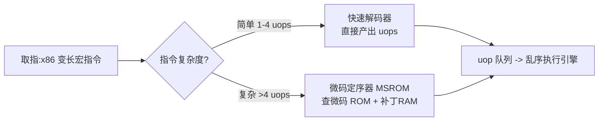
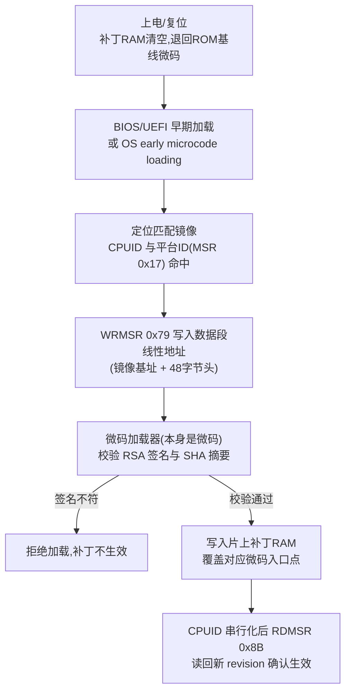
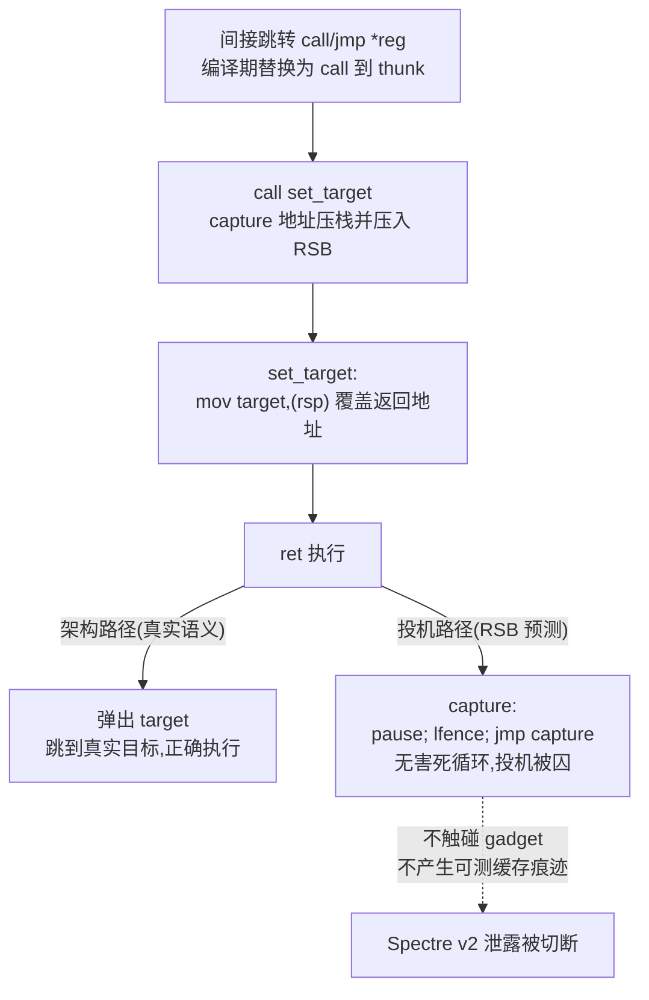
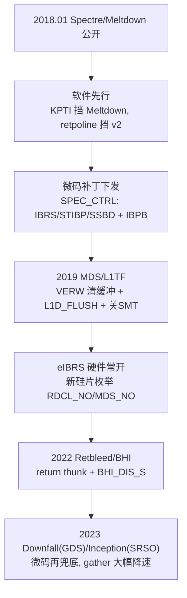

# CPU微架构与执行引擎（17）· 微码与CPU漏洞缓解
> [!abstract] TL;DR
> - **微码（microcode）是一层可签名下发、易失、需每次开机重灌的"硬件补丁"**：它把 x86 复杂宏指令展开成 uop，也让 Intel/AMD 能在硅片出货后改指令语义、加新 MSR、给旧指令挂新副作用——这正是 Spectre/Meltdown 时代绝大多数缓解得以落地的底座。
> - **微码更新走 `WRMSR 0x79`（Intel）触发验签写补丁 RAM，`RDMSR 0x8B` 读回 revision 确认**；镜像必须精确匹配 CPUID+平台 ID，且由厂商 RSA+SHA 签名，攻击者无私钥不能伪造。
> - **retpoline 把间接分支转成"RSB 预测 + 死循环陷阱"**：不让 `jmp/call *reg` 走可被污染的 BTB，而用刚亲手填的 RSB 预测，把投机路径钉死在 `pause;lfence;jmp self` 里，从而切断 Spectre v2 泄露。
> - **纯软件方案是被迫层层加码的猫鼠游戏**：RSB 下溢（Skylake）、Retbleed（连 `ret` 都能被预测污染）、BHI（分支历史共享）逐个逼出 RSB stuffing、return thunk、eIBRS、`BHI_DIS_S`，最终趋势是"软件→微码→硅片修死"。
> - **缓解开销永远 workload-dependent**：syscall 密集吃 PTI、间接调用密集吃 retpoline、vmexit 密集吃 L1D flush、AVX gather 密集吃 Downfall 微码；`mitigations=off` 只在完全可信、单租户、物理隔离环境里才谈得上。

## 概述与定位

前两篇（第 14 篇 Spectre/Meltdown、第 15 篇 MDS/L1TF/Zenbleed）站在攻击者视角，把"投机执行留下的微架构副作用"如何被磨成可测的信息泄露讲透了。本篇是它们的**防守面镜像**：当漏洞已经烧进几亿颗已出货、无法召回的硅片里，业界靠什么把它按住？答案沿两条主线展开——**微码**这层"可写的硬件补丁"，以及以 **retpoline** 为代表的**编译器/软件缓解**。贯穿全篇的第三条暗线是**开销权衡**：几乎每一项缓解都在拿性能换安全，搞清它在哪种工作负载上有多贵，是运维与体系结构决策的真正核心。

要理解微码为什么会成为漏洞时代的关键角色，得先给它定位。承接第 01 篇"架构与实现的分野"：ISA（架构可见的宏指令集）是对外契约，而微架构是私有实现。x86 是重度 CISC，变长复杂指令不可能全部用硬连线电路实现，于是**复杂指令由微码定序器（Microcode Sequencer，MSROM）展开成一串内部微操作 uop**。微码本是纯粹的"实现细节"，却因为一个副产品意外封神——它**可更新、可签名、可远程下发**。这意味着厂商能在不换硅片的前提下修硬件 bug、改指令行为、甚至凭空长出新的 MSR 和指令副作用。当 2018 年 Spectre/Meltdown 引爆时，正是这层可变的微码，让 IBRS/STIBP/SSBD 这些"投机控制开关"得以在几周内推送到旧机器上。

本篇刻意**不重复攻击原理**（那是第 14、15 篇的地盘），而聚焦"补丁怎么造、怎么加载、代价几何"：微码镜像的二进制结构与加载握手、retpoline 的构造与暗礁、缓解开销的量化直觉，以及在自有/授权环境里如何检测与调参。

## 原理与机制

### 微码是什么、住在哪里

x86 取指后进入解码器。**简单指令**（如 `add`、`mov`，通常 1~4 个 uop）走**快速解码器**，直接生成 uop 进入乱序引擎；**复杂指令**（`rep movs` 串操作、远调用/中断门、部分 `gather`、以及异常与 microcode assist 处理等，展开后 >4 个 uop）则**陷入 MSROM**，由微码定序器像"调子程序"一样喷出一长串 uop。

物理上，微码存在两处：一是**微码 ROM**，掩模阶段烧死在硅片里，不可改；二是**补丁 RAM（patch RAM）**，片上一小块可写 SRAM。补丁 RAM 的工作方式是"匹配替换"：加载新微码后，当译码触及某个有 bug 的微码入口时，硬件优先命中补丁 RAM 里的新版本，从而绕开 ROM 里的旧逻辑。补丁 RAM 容量有限（几 KB 量级），所以微码更新只能"打补丁"式覆盖关键入口，不能整体重写微码。



**为什么这么设计**：把最常用的简单指令用硬连线做快（低延迟、多解码器并行），把长尾复杂指令用微码做小（省晶体管、可事后修）。这个"快慢分层"本身就是 CISC 前端的经典权衡；而"补丁 RAM 可写"这一步，是厂商在良率与可维护性压力下留的后门——最初为了修硅片 bug，后来成了漏洞缓解的生命线。

### 微码更新机制：一次特权握手

Intel 的加载流程是一段严格的 MSR 握手（详见下一段的二进制解剖）：软件把微码镜像**数据段的线性地址**写入 `IA32_BIOS_UPDT_TRIG`（MSR `0x79`），CPU 内部的**微码加载器（它本身也是微码）**读取镜像、**校验厂商 RSA 签名与 SHA 摘要**，通过后把新微码写入补丁 RAM；随后执行一条 `CPUID` 做串行化，再 `RDMSR 0x8B`（`IA32_BIOS_SIGN_ID`）读回当前 revision 确认生效。AMD 类似，但通过 `MSR 0xC0010020`（PATCH_LOADER）载入、`0x8B` 读 patch level，容器格式不同（含 equivalence table 与多个 patch block）。

两个必须刻进脑子的性质：**其一，签名不可伪造**——镜像由厂商私钥签名，攻击者即便有 ring 0 也造不出被 CPU 接受的新微码（历史上签名机制本身出过篓子，见安全一节，但那是实现缺陷不是设计允许）。**其二，易失**——补丁 RAM 在复位/掉电后清空，退回 ROM 基线微码，所以**每次开机都必须重新灌**：要么 BIOS/UEFI 极早期加载，要么操作系统 early microcode loading（Linux 把微码打进 initramfs，在启用分页前就应用），要么运行期 late loading（有风险）。



### 缓解控制面：微码新开的 MSR 与指令副作用

微码不只修 bug，还能**凭空扩出控制寄存器和指令语义**——这是缓解得以落地的关键。Spectre/Meltdown 缓解所依赖的开关，很多是微码更新才长出来的：

```
IA32_SPEC_CTRL (0x48, 读写):
  bit0 IBRS    限制间接分支投机(进特权级后隔离预测)
  bit1 STIBP   禁止兄弟超线程共享间接分支预测
  bit2 SSBD    关闭投机式存储旁路 (对抗 Spectre v4)
  bit10 BHI_DIS_S  禁止分支历史注入 (较新增补)

IA32_PRED_CMD (0x49, 只写命令):
  bit0 IBPB    间接分支预测屏障:在边界处一次性冲刷预测器

IA32_FLUSH_CMD (0x10B, 只写命令):
  bit0 L1D_FLUSH  冲刷 L1 数据缓存 (VM entry 对抗 L1TF)

IA32_ARCH_CAPABILITIES (0x10A, 只读枚举):
  bit0 RDCL_NO         本核不受 Meltdown/RDCL 影响
  bit1 IBRS_ALL        支持增强型 eIBRS (可常开)
  bit2 RSBA            RSB 空时 ret 会回退 BTB 预测 (retpoline 隐患!)
  bit3 SKIP_L1DFL...   VM entry 无需 L1D flush
  bit5 MDS_NO          本核不受 MDS 影响
  bit8 TAA_NO          本核不受 TSX 异步中止影响
```

尤其精妙的是 **`VERW` 指令被微码改写**：这条老掉牙的"验证段选择子"指令，被微码悄悄挂上了"冲刷 store buffer / fill buffer / load port"的副作用（`MD_CLEAR` 能力）。于是内核只要在返回用户态、进入虚拟机之前执行一条 `VERW`，就能清掉 MDS 攻击赖以采样的微架构缓冲——**一条现成指令被微码赋予全新语义，省去了改 ISA 的漫长周期**。`IA32_ARCH_CAPABILITIES`（`0x10A`）则反向而行，它是一张**只读的"免罪证明"**：CPU 通过它告诉软件"我不受哪些漏洞影响、我支持哪些缓解"，内核据此在新硅片上**自动跳过昂贵的缓解**（例如枚举 `RDCL_NO` 就不必开 KPTI）。

## 微码更新格式与retpoline构造详解

### Intel 微码镜像的二进制解剖

一个 Intel 微码更新块默认 2048 字节：48 字节头 + 2000 字节签名主体（可含扩展签名表）。头部字段逐个看，每一个都对应一层安全或兼容考量：

```
偏移    大小   字段              作用与陷阱
0x00    4      Header Version    固定 0x00000001
0x04    4      Update Revision   本镜像版本号, 与 MSR 0x8B 比对新旧
0x08    4      Date              BCD 打包 年/月/日
0x0C    4      Processor Sig     目标 CPUID(family/model/stepping) 精确匹配
0x10    4      Checksum          整块 32 位求和归零, 防传输损坏
0x14    4      Loader Revision   要求的加载器版本
0x18    4      Processor Flags   平台掩码, 与 MSR 0x17[52:50] platform ID 比对
0x1C    4      Data Size         0 表示 2000 字节
0x20    4      Total Size        0 表示 2048 字节
0x24    12     Reserved
0x30    ...    加密+签名的微码主体
 ...    ...    可选: 扩展签名表 (一个镜像覆盖多个 CPUID/平台组合)
```

**为什么这样设计**：`Processor Signature` + `Processor Flags` 双重匹配，保证一颗物理型号（同 CPUID 可能对应多个"平台档位"，靠 `MSR 0x17` 的 platform ID 区分）只吃对应的微码——**灌错型号会砖**，所以匹配必须精确到 stepping 与平台位。`Update Revision` 让加载器能"只装更新的、不降级"（策略层面）。`Checksum` 防线路/存储损坏。扩展签名表是省空间的巧思：多个近亲 CPUID 共用同一份签名主体，避免为每个型号复制一遍几 KB 的 body。加载参考算法（伪码）：

```
; Intel 微码加载参考算法 (伪码)
mov  ecx, 0x8B
xor  eax, eax
xor  edx, edx
wrmsr                  ; 先清 IA32_BIOS_SIGN_ID
mov  eax, 1
cpuid                  ; 串行化, 让 CPU 填回当前 revision
mov  ecx, 0x8B
rdmsr                  ; edx = 当前微码 revision, 与镜像头比对决定是否更新
; ... 若镜像 UpdateRevision 更新, 则触发加载 ...
mov  ecx, 0x79         ; IA32_BIOS_UPDT_TRIG
lea  rax, [image + 48] ; 关键: 传入的是"数据段"地址 = 镜像基址跳过 48 字节头
xor  edx, edx          ; 高 32 位
wrmsr                  ; 触发加载 -> 内部验签 -> 写补丁 RAM
mov  eax, 1
cpuid                  ; 串行化
mov  ecx, 0x8B
rdmsr                  ; 读回, 确认 revision 已跳变
```

注意那个容易踩的细节：写入 `0x79` 的地址**不是镜像基址，而是基址 + 48**（跳过头部，指向数据段）。Linux 内核 `microcode/intel.c` 里正是 `native_wrmsrl(MSR_IA32_UCODE_WRITE, (unsigned long)mc->bits)`，`mc->bits` 恰好是 48 字节头之后的数据起点。

### retpoline：把间接分支变成"可控的返回"

先一句话回顾攻击面（细节在第 14 篇）：Spectre v2 / 分支目标注入（BTI）靠**污染 BTB（分支目标缓冲）**，让受害者的 `jmp *reg` / `call *reg` 在投机阶段跳到攻击者选定的 gadget，gadget 把秘密编码进缓存供旁路读出。**retpoline（return trampoline，返回蹦床）**的核心思想是：既然 BTB 可被训练污染，那就**根本不让间接分支走 BTB 预测**，改走"我刚亲手填的" RSB（返回栈缓冲），并把投机落点钉死在一个无害死循环里。GCC/Clang 生成的 thunk 长这样：

```
; retpoline thunk (以间接跳转 *%rax 为例)
__x86_indirect_thunk_rax:
        call    .Lset_target
.Lcapture:                     ; 投机落点: 无害死循环 (speculation trap)
        pause
        lfence
        jmp     .Lcapture
.Lset_target:
        mov     %rax, (%rsp)   ; 用真实目标覆盖栈上的返回地址
        ret                    ; 架构上: 回真目标; 投机上: RSB 预测回 .Lcapture
```

逐步拆解这段"魔术"：

- `call .Lset_target`：这条 call 有两个效果——把 `.Lcapture` 的地址**压入架构栈**，同时把它**压入 RSB**（RSB 是硬件维护的返回地址预测栈，它"记住"接下来那条匹配的 `ret` 应该返回 `.Lcapture`）。
- `.Lset_target: mov %rax, (%rsp)`：把栈顶的返回地址**改写成真实目标** `%rax`。此刻架构状态与 RSB 预测出现了**故意的分歧**。
- `ret`：**架构层面**，它弹出被改写后的栈顶，跳到真实目标 `%rax`——程序行为完全正确；**投机层面**，CPU 用 RSB 预测这条 `ret` 会回 `.Lcapture`，于是投机执行冲进 `pause; lfence; jmp .Lcapture` 的**死循环**——做无用功、不触碰任何攻击者 gadget、不产生可测的缓存痕迹。



**为什么它成立**：攻击者能训练的是 BTB；retpoline 把预测源从 BTB 挪到 RSB，而 RSB 里那一项是我在 `call` 时刚亲手压进去的、指向我选定的陷阱。攻击者无从污染"我下一拍就要用的 RSB 项"。`pause` 让忙等对 SMT 友好，`lfence` 进一步收窄投机窗口——双保险确保投机死循环不外溢。

### retpoline 的暗礁：RSB 下溢与 Skylake

漂亮的构造有个致命前提：**`ret` 必须始终用 RSB 预测**。但从 Skylake 起，Intel 的 RSB 行为变了：**当 RSB 为空时，`ret` 会回退到 BTB 预测**（`ARCH_CAPABILITIES` 的 `RSBA` 位就是标示此行为的"警告灯"）。RSB 会在什么时候空？深层调用链返回超过 RSB 深度（典型 16 或 32 项）、被 SMM/中断打断、上下文切换……一旦 RSB 下溢，retpoline 里那条本应回陷阱的 `ret` 反而去查了可被污染的 BTB——**缓解前提当场崩塌**。

对策有二：**RSB stuffing（填塞）**——在上下文切换、vmexit 等边界处用约 32 次 `call` 把 RSB 填满安全项（内核里的 `FILL_RETURN_BUFFER`），避免下溢时回退 BTB；以及 Intel 干脆在 Skylake 一代**建议改用 eIBRS 而非 retpoline**。这也解释了为何"retpoline 一招鲜"在现实里从来不成立，配置项 `spectre_v2=` 才会有 `retpoline`、`eibrs`、`eibrs,retpoline`、`eibrs,lfence` 等一堆组合。顺带一个变体：AMD 曾推荐更便宜的 **`lfence; jmp *reg`（lfence retpoline）**，因为 AMD 的 `lfence` 语义可界定投机窗口，省去了完整蹦床的开销。

### 当 `ret` 本身也不可信：Retbleed / SRSO 与 return thunk

2022 年的 **Retbleed（CVE-2022-29900 AMD / CVE-2022-29901 Intel）**把整个 retpoline 的地基掀了：研究者证明**连 `ret` 指令都能被 BTB 式地预测污染**——于是 retpoline 赖以立身的那条 `ret` 自己成了 Spectre v2 gadget。对策再度加码：AMD 引入 **`__x86_return_thunk` 配合 `UNTRAIN_RET`（jmp2ret 去训练）**，在关键返回前"洗掉"被污染的预测；Intel 部分型号则**退回到内核入口开 IBRS**（`CONFIG_CPU_IBRS_ENTRY`），等于官方承认"纯软件方案顶不住了"。2023 年 AMD Zen 的 **SRSO / Inception（CVE-2023-20569）**是返回栈溢出式投机的又一变种，靠**微码 + 安全返回 thunk**兜底（`srso=` 开关）。同年的 **BHI / Spectre-BHB（CVE-2022-0001）**则说明**连 eIBRS 也不够**——因为分支历史（BHB）仍跨特权级共享，需要 `BHI_DIS_S` 位或一段软件"清 BHB 循环"。

把这条主线串起来看，缓解就是一场**层层加码的猫鼠游戏**：堵了 BTB（IBRS/retpoline）→ 冒出 RSB 下溢 → 堵了 RSB（stuffing）→ 冒出 `ret` 本身可预测（Retbleed）→ 堵了 `ret`（return thunk）→ 冒出分支历史共享（BHI）。每一层的深层原因都是同一个：**只要"预测器状态跨安全域共享"这个微架构事实不变，攻击面就会换个入口再来**。

### eIBRS 与硬件常开：开销单调下降的终局

值得单独点出 IBRS 的两代差异，因为它是"开销权衡"的教科书案例。**legacy IBRS** 要求每次进内核都 `WRMSR 0x48` 写一次——而写 `SPEC_CTRL` 是重量级串行化操作，syscall/中断风暴下开销惊人。**eIBRS（`IBRS_ALL`）**改为"开机设一次、硬件常态隔离特权级预测"，几乎免去了每次进出内核的写 MSR 成本。再往后，新硅片直接把免疫烧进枚举位（`RDCL_NO`/`MDS_NO`/`IBRS_ALL`），内核一看就整段跳过缓解。**这就是整篇的终极趋势线：同一个漏洞的应对成本，沿"纯软件 → 微码 → 硅片修死"单调下降**。理解这条曲线，就能理解为什么"上新一代 CPU"往往是性价比最高的缓解手段。



## 工具视角与实战

以下命令均为**只读检查或在自有/授权机器上的调参**，用于理解与自检，不针对他人系统。

**查微码版本与加载方式**：`grep microcode /proc/cpuinfo` 看当前 revision；`dmesg | grep -i microcode` 或 `journalctl -k | grep -i microcode` 看内核是 early 还是 late 加载、revision 从 `0x??` 跳到 `0x??`。`lscpu` 给出型号与部分缓解概览。

**查漏洞与缓解状态（最重要）**：`/sys/devices/system/cpu/vulnerabilities/` 下每个漏洞一个文件，内容是一行人类可读的判定，例如 `spectre_v2` 可能是 `Mitigation: Enhanced / Automatic IBRS, IBPB: conditional, RSB filling, PBRSB-eIBRS: SW sequence`，或 `Not affected`（对应枚举位命中），或 `Vulnerable`。逐个 `cat` 这些文件，是判断一台机器缓解现状最直接的手段。社区脚本 `spectre-meltdown-checker.sh` 把这些聚合成报表。

**直接读 MSR**：`modprobe msr` 后 `rdmsr -a 0x10a` 读 `ARCH_CAPABILITIES` 全核、`rdmsr 0x48` 读 `SPEC_CTRL`。**读安全，写要极慎**——`wrmsr` 到这些寄存器可能让机器状态与内核假设不一致。

**灌微码**：发行版的 `intel-ucode` / `amd64-microcode` 包提供签名镜像，`iucode_tool` 负责按 CPUID 拆分匹配、生成 initramfs 的 early-load 镜像。运行期 late loading 可 `echo 1 > /sys/devices/system/cpu/microcode/reload` 触发——但见下节风险提示，生产上优先 early loading。

**看编译产物里的 retpoline**：`objdump -d vmlinux | grep __x86_indirect_thunk` 能看到间接调用被替换成调 thunk；内核配置 `CONFIG_MITIGATION_RETPOLINE`（旧名 `CONFIG_RETPOLINE`）、`CONFIG_CPU_IBRS_ENTRY`；用户态可用 GCC/Clang 的 `-mindirect-branch=thunk -mfunction-return=thunk`（或 clang `-mretpoline`）自行编译带缓解的二进制。

**内核命令行调缓解（性能对拍时用）**：`mitigations=off | auto | auto,nosmt` 是总开关；细粒度有 `spectre_v2=`、`pti=on/off`（`nopti`）、`spec_store_bypass_disable=`、`kvm-intel.vmentry_l1d_flush=`、`retbleed=`、`gather_data_sampling=`、`nosmt`。对比开关前后的基准，是量化开销最诚实的办法。

**逆向视角**：分析可疑内核模块 / hypervisor / rootkit 时，重点看它是否**主动关闭或绕过**这些缓解（比如 patch 掉 `__x86_indirect_thunk`、清 `SPEC_CTRL`、late-load 一份可疑微码、或篡改 `vulnerabilities/*` 的上报），这类"降低防护"的行为本身就是强 IOC（入侵指标）。

## 安全性与正确使用

> [!caution] 合规边界与红线
> - 本篇一切内容仅用于**自有/授权环境、CTF 靶场与安全研究**，一律**防御与教育视角**。检测、加固、性能对拍都应在你有权处置的机器上进行。
> - **不提供**针对真实生产系统或他人设备的武器化步骤，**不为**降级微码以重开已修漏洞、或绕过商业授权/正版校验提供成品配方。
> - 原理讲透是为了让你能防得住、查得出，而不是拿去打某个真实目标；把这些机制用于未授权系统可能违法。

几条真正影响安全姿态的要点。**其一，信任根也会塌**：微码只接受厂商签名镜像，攻击者无私钥造不出——这是设计上的强保证；但**在部分平台可以降级到旧的、仍被签名的镜像**，而旧镜像可能没有某项缓解，等于重新打开已修的洞。因此在你自己的机器上，加固点是"锁 BIOS、禁止运行期降级、只走 early loading 的可信链"。历史上微码签名机制**自身也出过缺陷**（例如 AMD Zen 微码签名校验被曝使用弱哈希、可被构造碰撞的事件），提醒我们"可签名"不等于"永远安全"，信任根需要持续审计。

**其二，late microcode loading 的一致性风险**：运行期热换微码，可能与流水线里已经在跑的指令、已建立的内部状态不一致，导致死机或未定义行为。生产环境应优先 **early loading**（分页前应用，状态干净），微码变更走维护窗口、可回滚。

**其三，`mitigations=off` 是一把只在特定场景才该碰的钝刀**：关掉全部缓解确实能拿回性能，但它把第 14、15 篇讲的整片攻击面重新敞开。**只有在完全可信、单租户、物理隔离**的场景（如封闭的 HPC 集群、离线基准测试）才谈得上；多租户云、桌面、任何跑不可信代码（包括浏览器 JS）的机器一律**不许关**。**关闭 SMT（超线程）**是最钝但最狠的缓解——它一举掐断跨线程的 MDS/L1TF/侧信道，代价是牺牲约一半的并行吞吐；是否值得，取决于你的威胁模型里"同物理核相邻租户"是否可信。

**其四，开销权衡要按工作负载谈，不要一刀切**：PTI 的成本集中在 syscall/陷入密集型负载（有 PCID 会便宜很多）；retpoline 的成本集中在**间接调用密集**的代码（解释器的 computed-goto、C++ 虚函数、内核里成千上万的函数指针）；L1D flush 的成本集中在 **vmexit 密集**的虚拟化负载；而像 Downfall（GDS）的微码缓解会给 AVX `gather` 指令加锁、在**向量 gather 密集**的科学计算里可能吃掉可观的吞吐。**正确姿势是：能上新硅片（枚举位免疫、eIBRS）就上，开销最低；必须缓解时按负载特征精调单项开关，用真实基准对拍，而不是盲目 `mitigations=off`。**

## 小结

- **微码是一层可签名下发、易失、需每次开机重灌的"硬件补丁"**：它既承担 CISC 复杂指令的 uop 展开，又是漏洞时代的救命稻草——通过 `WRMSR 0x79` 验签写补丁 RAM，凭空扩出 `SPEC_CTRL`/`PRED_CMD`/`ARCH_CAPABILITIES` 等控制面，甚至给老 `VERW` 挂上清缓冲的新副作用。加载握手、精确的 CPUID/平台匹配、RSA 签名，共同保证"能修、能防伪、装不错"。
- **retpoline 用"RSB 预测 + 死循环陷阱"切断 Spectre v2**：把间接分支转成受控返回，让投机落进无害死循环。但它有 RSB 下溢（Skylake 回退 BTB）、Retbleed（`ret` 自身可被污染）、BHI（分支历史共享）等一连串暗礁，逼出 RSB stuffing、return thunk、eIBRS、`BHI_DIS_S`——本质是"预测器状态跨安全域共享"这一微架构事实不除，攻击面就换个入口再来。
- **缓解开销永远 workload-dependent，且沿"软件→微码→硅片"单调下降**：syscall 密集吃 PTI、间接调用密集吃 retpoline、vmexit 密集吃 L1D flush、gather 密集吃 Downfall 微码；eIBRS 与新硅片枚举位是把开销压到最低的正道。
- **决策原则**：能上新硬件就上；必须缓解就按负载精调、用真实基准对拍；`mitigations=off` 与关 SMT 只在完全可信、物理隔离的环境里才谈得上，多租户一律从严。

## 相关阅读

- 本系列攻击面前情：[[14.微架构侧信道：Spectre与Meltdown]]、[[15.侧信道进阶：MDS与L1TF与Zenbleed]]；剖析工具：[[16.性能剖析：PMU与perf与火焰图]]；系列全貌：[[00.CPU微架构与执行引擎总览|系列总览]]。
- 汇编与体系结构基础：[[21.Asm/28 原子操作与内存模型]]（内存序与屏障，理解投机重排的前提）、[[21.Asm/39 缓存与缓存一致性]]（侧信道的物理载体）、[[21.Asm/38 MMU与页表设置实战]]（KPTI/PTI 的页表隔离机理）。
- 侧信道的另一层视角：[[37.密码学/61.侧信道攻击]]（密码实现层的时序/功耗侧信道，与本系列的微架构层互补）。
- 防护机制横向对照：[[34.现代二进制防护机制/09.Intel CET]]（IBT/影子栈，与 retpoline/FineIBT 的控制流防护同源）、[[34.现代二进制防护机制/13.MTE内存标签扩展]]（硬件辅助的内存安全另一路线）。
- 官方一手资料：Intel《64 and IA-32 Architectures SDM》Vol.3 第 9 章"Microcode Update Facilities"；Intel《Speculative Execution Side Channel Mitigations》白皮书与 Software Security Guidance；Google Project Zero 与 support.google.com 的 retpoline 技术说明；Linux 内核 `Documentation/admin-guide/hw-vuln/` 全目录；AMD《Software Optimization Guide》与官方安全公告（Retbleed / Inception）。

[[00.CPU微架构与执行引擎总览|⬆ 系列总览]] | [[16.性能剖析：PMU与perf与火焰图|← 上一章]]