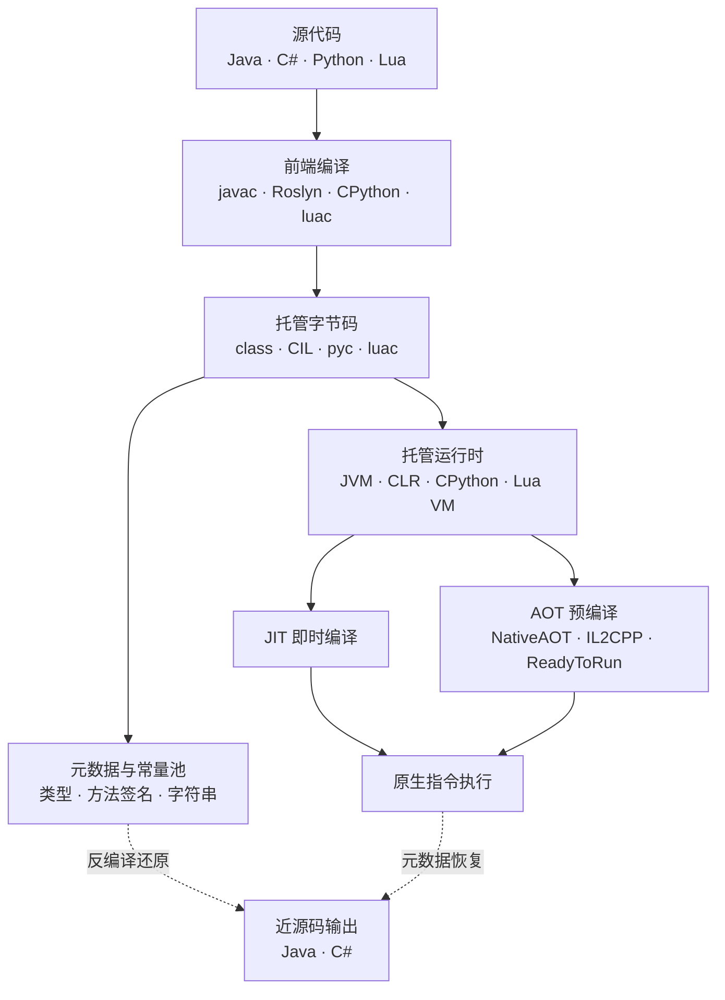
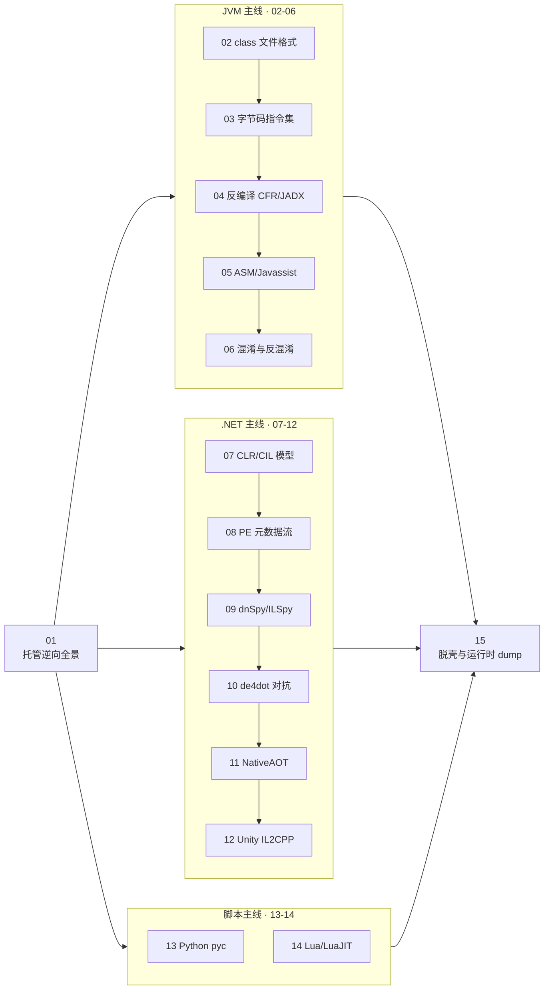

# 托管代码与字节码逆向 · 系列总览

> 面向 JVM、.NET CLR、Python、Lua 等托管运行时的逆向：字节码格式、反编译、混淆对抗与运行时脱壳。与原生 x86/ARM 逆向不同，托管字节码随身携带完整的类型元数据与符号，反编译常可近乎还原源码——攻防重心遂从"读懂汇编"转向"对抗混淆与运行时保护"。补齐 [[35.Android逆向与运行时/04.Dalvik字节码与smali|DEX]] 与 [[40.WASM与虚拟化壳逆向/01.WASM二进制格式与模块结构|WASM]] 之外的桌面托管世界。

## 统一执行模型

四类运行时共享同一套逆向骨架：**源码 → 前端编译 → 携带元数据的字节码 → 运行时装载与校验 → JIT 或 AOT → 原生执行**。字节码内保留的常量池与元数据表（类型、方法签名、字符串常量）是反编译能还原高级结构的根本；逆向即沿此链反向行走，而混淆器在每个环节埋设干扰——名称抹除、控制流平坦化、字符串加密，直至 AOT 原生化彻底剥离元数据。看懂这条链的正向流动，才能定位每种保护该在哪一层拆解。

## 篇目导航

| # | 章节 | 说明 |
| --- | --- | --- |
| 01 | [[01.托管运行时与字节码逆向全景]] | 托管与原生、JIT/AOT、通用逆向路径 |
| 02 | [[02.JVM架构与class文件格式]] | 常量池、方法表、验证与类加载 |
| 03 | [[03.JVM字节码指令集详解]] | 操作数栈、局部变量表、指令族 |
| 04 | [[04.Java反编译：CFR与Procyon与JADX]] | 反编译原理与工具对比 |
| 05 | [[05.Java字节码操纵：ASM与Javassist]] | 插桩、注入、运行时改写 |
| 06 | [[06.Java混淆与反混淆]] | 名称混淆、控制流、字符串加密与还原 |
| 07 | [[07.dotNET-CLR与CIL执行模型]] | CLI、程序集、AppDomain、JIT |
| 08 | [[08.PE中的dotNET元数据与流]] | 元数据表、#Strings/#Blob、Method RVA |
| 09 | [[09.dnSpy与ILSpy反编译实战]] | IL 到 C 反编译、调试与编辑 |
| 10 | [[10.dotNET混淆器对抗与de4dot]] | 控制流平坦化、字符串解密、脱壳 |
| 11 | [[11.dotNET-AOT与NativeAOT逆向]] | ReadyToRun、原生化后的元数据恢复 |
| 12 | [[12.Unity游戏逆向：Mono与IL2CPP]] | global-metadata、符号恢复、Il2CppDumper |
| 13 | [[13.Python字节码与pyc反编译]] | code object、marshal、uncompyle/decompyle |
| 14 | [[14.Lua与LuaJIT字节码逆向]] | Lua 5.x 指令、LuaJIT 字节码与反汇编 |
| 15 | [[15.托管代码脱壳与运行时dump]] | 内存转储、反射加载、动态解密还原 |

## 学习路径与阅读建议

> [!tip] 阅读顺序建议
> - **先读 01** 建立"托管 vs 原生、JIT/AOT、元数据驱动反编译"的统一心智模型，再分线深入。
> - **三条主线相互独立，按目标平台择一切入**：JVM 线 `02→03→04→05→06`、.NET 线 `07→08→09→10→11→12`、脚本线 `13`（Python）/ `14`（Lua）。
> - 每条线遵循同一递进——**格式 → 指令语义 → 反编译 → 字节码改写 → 混淆对抗**：务必先吃透 class / 元数据格式（02、08）与指令语义（03），才能看清反编译器的还原能力与失败边界（04、09）。
> - **15 脱壳与运行时 dump 是全系收敛点**，宜在掌握至少一条主线后再攻——它把"静态反编译打不开的加壳样本"拉回内存态求解，与前述各线互补。
> - 上手门槛低：JVM 用 CFR/JADX、.NET 用 dnSpy、Python 用 decompyle3，多数场景"拖入即出源码"，适合边读边动手验证。

## 与知识库既有体系的衔接

- 原生对照：[[23.C_C++运行时与ABI/01.运行时与ABI概览]]（原生 ABI）与托管运行时的差异
- 格式前置：[[13.PE文件详解/07-详解PE文件(七)：数据目录]]（.NET 元数据寄生在 PE）
- 同族参考：[[35.Android逆向与运行时/03.DEX文件格式]]、[[40.WASM与虚拟化壳逆向/02.WASM指令集与执行模型]]
