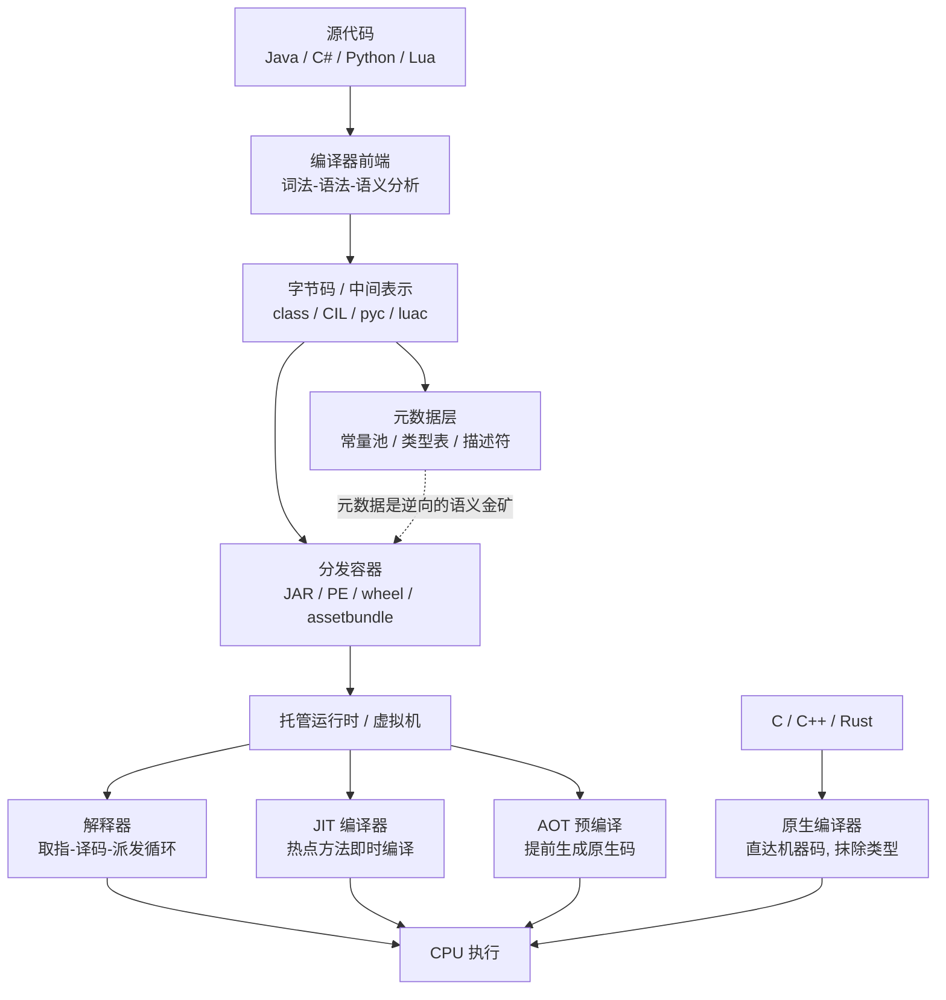
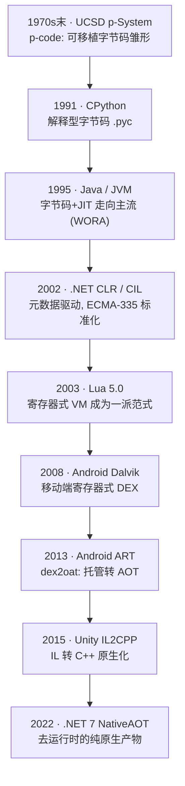
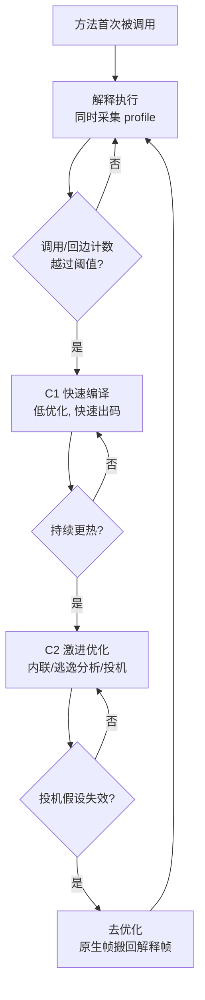
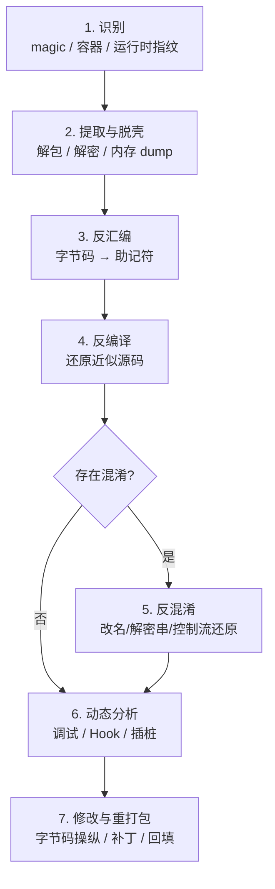

# 托管代码与字节码逆向（1）· 托管运行时与字节码逆向全景
> [!abstract] TL;DR
> - **托管代码 = 编译到字节码 / 中间表示、运行在带 GC 与类型系统的虚拟机之上**；与原生码"直达 CPU、类型信息在编译期抹除"形成根本对立，这条分界线决定了两类逆向工具链（反编译器 vs 反汇编器）的分野。
> - 字节码"天生易逆"的根因是**元数据契约**：为支撑字节码验证、反射与动态加载，`class` / `CIL` / `pyc` 必须保留类/方法/字段的名字与类型描述符，于是反编译能接近无损地还原出带名字的源码。
> - 执行模型是一条**谱系**：纯解释 → JIT（分层编译 + 去优化）→ AOT；越靠近 AOT，逆向越接近原生难度，IL2CPP / NativeAOT 本质就是"用原生化对抗逆向"。
> - 无论目标是 JVM、CLR、CPython 还是 Lua，跨平台逆向共享**同一套七步方法论**：识别 → 提取脱壳 → 反汇编 → 反编译 → 反混淆 → 动态分析 → 修改重打包。
> - 混淆是**减速带而非墙**；真正的资产（密钥 / 核心算法）必须放服务端或可信执行环境，客户端字节码只能做纵深防御，任何"藏在 IL 里的秘密"都应视同已泄露。

## 概述与定位

本系列《托管代码与字节码逆向》讨论的是一类共享同一"架构基因"的逆向目标：Java、C# / .NET、Python、Lua、Unity 游戏、Android 应用……它们的源代码并不直接编译成 CPU 能执行的机器指令，而是先降解为一层**字节码**（bytecode，也叫中间语言 IL / 中间表示 IR），再交给一个**运行时**（runtime，俗称虚拟机 VM）去解释或即时编译执行。这层夹在源码与硬件之间的抽象，既是这些语言"一次编写、到处运行"的技术底座，也是它们在逆向工程面前近乎"半透明"的根本原因。

本篇作为全景开篇，刻意**不深入任何单一平台的字节码细节**——那是第 2 篇《JVM 架构与 class 文件格式》之后各章的任务。本篇要建立的是一张贯穿全系列的**概念地图与方法论骨架**：什么是"托管"、托管与原生的分界线究竟画在哪、字节码为何易于还原、执行模型如何从解释一路走向原生、以及一套跨越 JVM / CLR / CPython / Lua 的**通用逆向流水线**长什么样。读完本篇，你应当能拿到一个陌生的二进制，先判断它"是不是托管、是哪种托管、该用哪条逆向路径"，再翻到对应平台的分册去查手艺。

"托管"（managed）一词并非泛泛而谈，它源自微软 CLR 的术语体系：运行在公共语言运行时（CLR）**管理之下**的代码称为托管代码，"管理"具体指内存由垃圾回收器（GC）托管、类型安全由运行时强制、异常与安全策略由运行时统一介入。Java 圈子习惯说"运行在 JVM 上"，本质是同一件事。与之相对的**原生代码**（native code）直接以机器指令形态存在，内存靠手动 `malloc/free` 或 RAII 管理，类型信息在编译期就被抹除，运行时没有一个"监工"在旁边看着——关于原生侧运行时与调用约定的细节，可对照 [[23.C_C++运行时与ABI/01.运行时与ABI概览]]，本系列正是站在它的对面。理解这条分界线，是理解"为什么 .NET 程序能一键还原成几乎和源码一样的 C#，而 C++ 程序在 IDA 里往往只剩一堆没有名字的 `sub_401000`"的钥匙。

## 原理与机制

要理解托管代码为何易逆，必须先看清它的**编译—分发—执行**三段式管线，以及每一段为什么被设计成现在这样。

**第一段：为什么要多插一层字节码。** 传统原生编译把源码一路压到目标 CPU 的机器码，代价是产物**绑死平台**（x86 的二进制不能在 ARM 上跑）、**丧失动态性**（运行期无法反射出类型、无法安全地加载未知代码）。托管平台的设计者选择在中间"停一站"，先编译到一套与硬件无关的虚拟指令集。这一停带来四项能力：其一是**可移植**——Java 的"Write Once, Run Anywhere"就靠字节码在各平台 JVM 上重新落地；其二是**可验证**——运行时能在加载时用字节码验证器（verifier）检查类型是否自洽、栈是否平衡，从而在不信任来源代码的前提下保证内存安全；其三是**动态性**——反射、动态代理、运行期生成类都依赖字节码里保留的完整元数据；其四是**自动内存管理**——GC 需要精确知道每个栈槽和对象字段是不是引用，这份"类型地图"也只能靠元数据承载。

**第二段：元数据契约——易逆的真正根因。** 这是全系列最关键的一句话：**字节码为了能被验证、被反射、被 GC 精确扫描，就必须在文件里显式保留类型系统的骨架**。JVM 的常量池里躺着完整的类名、方法名、字段名、方法描述符（如 `(Ljava/lang/String;)I` 表示"吃一个 String、吐一个 int"）；.NET 的元数据表（`TypeDef`/`MethodDef`/`Field` 等一系列表）同样把类型全貌编成结构化表格，寄生在 PE 文件的第 15 项数据目录（索引 14，CLR Header）指向的区域里，具体寄生方式见 [[13.PE文件详解/07-详解PE文件(七)：数据目录]]。这份"契约"对运行时是刚需，对逆向者却是**免费的语义大礼包**：反编译器不需要靠启发式去猜一个函数叫什么、参数是什么类型，直接读元数据就行。这就是为什么托管代码的反编译能**接近无损**，而原生代码的反编译（如 Hex-Rays）只能产出没有名字、类型全靠推断的伪代码。

**第三段：栈式 VM 与寄存器式 VM。** 字节码指令集的组织方式主要有两派。**栈式虚拟机**（JVM、.NET CLR、CPython）把操作数压进一个求值栈，指令隐式地从栈顶取参、把结果压回——`iadd` 就是"弹两个 int、相加、压回"，指令本身不带操作数寄存器号，因而指令流极其紧凑、易于生成，也天然地把表达式树的结构暴露在指令序列里，反编译器顺着栈的进出就能重建 `a + b * c` 这样的表达式。**寄存器式虚拟机**（Lua 5.x、Android Dalvik、LuaJIT）则给每条指令显式编号的虚拟寄存器，`ADD R2, R0, R1` 一条顶栈式好几条，解释时派发次数少、更快，但指令更宽、更贴近真实汇编。Android 的 DEX 就是典型寄存器式格式，其结构见 [[35.Android逆向与运行时/03.DEX文件格式]]。这一分野直接影响逆向手感：栈式的反编译更容易还原出漂亮的表达式，寄存器式则更像在读一段"虚拟汇编"，需要额外的寄存器合并与生命周期分析。



**这套三段式管线不是一天建成的，历史脉络本身就能解释很多设计取舍。** "可移植中间码"的想法极其古老——1970 年代末 UCSD p-System 的 p-code 就已在做"编译到一套虚拟指令、各机器上再解释"的事。真正让"字节码 + JIT"成为工业主流的是 1995 年的 Java，它把 WORA（Write Once, Run Anywhere）与安全沙箱一起推向大众；2002 年的 .NET 则把设计重心压到**元数据驱动**上，用一整套元数据表把类型系统结构化标准化（ECMA-335）。移动时代带来另一条支线：为在低端设备上跑得快，Lua 5.0（2003）与 Android Dalvik（2008）选择**寄存器式** VM 减少派发开销。而最近十年的主旋律是"**向原生回摆**"——ART 的 `dex2oat`、Unity 的 IL2CPP、.NET 的 NativeAOT 纷纷把托管码提前编译成原生码，用性能与"抗逆向"双重收益，换掉了字节码的可移植与易调试。理解这条从"离开原生"到"回到原生"的钟摆，就理解了本系列后半程为何越来越像在做原生逆向。



**内存与对象模型这一层也别忽略。** 托管对象在堆上通常带一个**对象头**（Java 的 mark word + 类指针，.NET 的 method table 指针 + sync block），GC 靠它识别类型、做标记—清除 / 复制 / 分代回收。做**运行时 dump**与内存取证时（本系列第 15 篇专讲），你必须能从这些头部反推对象类型、遍历托管堆。这也是托管逆向区别于原生逆向的一个独特面向：你不只是读一段死代码，还常常要在一个"活着的、被 GC 管理的堆"里打捞对象。

## 从解释到原生：执行模型与逆向路径详解

这是本篇的核心。**执行模型不是非此即彼，而是一条从"纯解释"到"纯原生"的连续谱系**，目标程序落在谱系的哪个位置，直接决定你能不能做静态反编译、要不要上动态手段、以及最终难度接近 Java 还是接近 C++。

**纯解释执行。** 最朴素的形态：运行时是一个用 C 写的"取指—译码—派发"大循环（dispatch loop），字节码只是喂给这个循环的**数据**。CPython 的 `ceval.c`、早期无 JIT 的 JVM 都是这样。对逆向者，这是**最友好**的局面：字节码原封不动躺在文件里（`.pyc` / `class`），拿反编译器直接还原即可。代价是慢——每条字节码都要过一遍 C 层的派发开销，所以纯解释很少单独用于性能敏感场景。

**JIT（即时编译）。** 为了兼顾"启动快 + 峰值性能高"，主流 JVM（HotSpot）和 .NET（RyuJIT）采用**分层编译**：方法先解释执行并顺便采集 profile（调用次数、分支概率、实际类型），当某方法的调用计数或循环回边计数越过阈值，判定为"热点"，才交给 JIT 编译成原生码；HotSpot 更分 C1（快速出码、低优化）与 C2（激进优化：方法内联、逃逸分析、标量替换、基于 profile 的**投机优化**）两级。投机意味着"赌"——比如赌某个虚调用永远是同一个实现，于是内联它；一旦赌错（加载了新子类），就触发**去优化**（deoptimization），把执行状态从已编译的原生帧安全地搬回解释器帧继续跑。热循环执行中途从解释切到编译码，则靠**栈上替换**（OSR）。



JIT 对逆向的含义很微妙：**字节码本身仍在文件里，静态反编译不受影响**（你逆的是 IL / 字节码，不是 JIT 出的原生码）。JIT 真正带来的麻烦在**动态**侧——热点代码只在运行期存在于可执行内存，某些壳会**推迟到运行时才把真正的字节码交给 JIT**（运行时解密），静态就看不到；而 JIT 的内联又会打乱你对"哪段原生码对应哪个方法"的对应关系。所以对付 JIT 型保护，往往要在"JIT 拿到字节码的那一刻"或"方法被编译前"下钩子 dump，这正是第 15 篇脱壳章的主场。

**AOT（提前编译）。** 谱系的另一端：在**发布前**就把字节码全量编译成目标平台原生码，运行时不再需要（或只需极薄的）JIT。代表有 .NET 的 ReadyToRun（R2R，部分 AOT）与 NativeAOT（完全原生化，第 11 篇专讲）、GraalVM Native Image、Android ART 的 `dex2oat`、以及 Unity 的 IL2CPP（把 IL 先转成 C++ 再由原生编译器编译，第 12 篇专讲）。**AOT 是托管逆向的"降维打击"**：一旦原生化，前面说的"元数据契约"红利大幅缩水，产物退化成和 C++ 一样需要 IDA / Ghidra 去啃的原生二进制，栈式表达式、带名字的方法统统消失。这里藏着全系列一个反直觉的洞见——**AOT 常被当作最强的"混淆"手段**，因为它从根子上抹掉了字节码这一易逆层。但 AOT 往往**不能把元数据也扔干净**：IL2CPP 为了支撑反射与泛型，仍要随包发出 `global-metadata.dat`；ART 的 `.oat` 里也保留了到 DEX 的映射。逆向者的突破口，正是这些"没舍得删的元数据"——把它和原生码对齐，就能把匿名函数重新贴回名字。

**从谱系推出通用逆向路径。** 把上面串起来，无论面对哪种托管目标，逆向都收敛到同一条七步流水线：



**第一步"识别"是整条链的起点，也最容易被忽略**。判断一个陌生文件属于哪种托管目标，主要看头部魔数与容器结构，几个高频指纹：

```
CAFEBABE              Java class 文件（注意：也是 Mach-O 胖二进制魔数，需结合上下文区分）
504B0304  (PK\x03\x04) ZIP 容器 → JAR / APK / nupkg / wheel，须再看内部条目
4D5A (MZ) + PE 头      Windows PE；若数据目录第 15 项(索引14, CLR Header)非空 → .NET 程序集
64 65 78 0A (dex\n)   Android DEX（后接版本号如 035\0）
16-bit magic + 0D0A   CPython .pyc（前 2 字节魔数随 CPython 版本变化，后接 \r\n）
1B 4C 75 61 (\x1bLua)  Lua 预编译 chunk（luac 头，后接版本与格式字节）
1B 4C 4A   (\x1bLJ)    LuaJIT 字节码
```

识别之后，谱系位置也就大致明朗：看到 `CAFEBABE` / `.pyc` 基本是解释 + JIT 型，静态反编译即可有大收获；看到一个"体积很大、导入表却干净、字符串里有 `il2cpp` / `Mono` 痕迹"的原生 PE / SO，则要意识到它是 AOT 原生化目标，得走原生逆向 + 元数据对齐的路子。**为什么静态反编译对托管如此有效、对原生如此无力，深层原因还是那句话**：托管产物里编译期没被抹除的类型与名字，让"字节码 → 源码"几乎是可逆映射；而原生编译把寄存器分配、指令调度、内联全做完还删了符号，"机器码 → 源码"是严重多对一的有损过程。顺带一提，WebAssembly 作为一种新兴的可移植字节码，其栈式模型与验证机制和 JVM/CLR 一脉相承，逆向思路也高度相通，见 [[40.WASM与虚拟化壳逆向/02.WASM指令集与执行模型]]。

## 工具视角与实战

把七步流水线映射到工具生态，就能看清整个系列的"工具地图"。下表按平台 × 阶段铺开，后续各分册会逐一展开；本篇只需你记住"每个格子里该拿什么家伙"：

| 阶段 \ 平台 | Java / JVM | .NET / CLR | CPython | Lua |
|---|---|---|---|---|
| 反汇编 | `javap -c` | `ildasm` / `monodis` | `dis` 模块 | `luajit -bl` |
| 反编译 | CFR / Procyon / **JADX** | **dnSpy** / ILSpy / dotPeek | uncompyle6 / decompyle3 | luadec / unluac |
| 反混淆 | 手工 + 脚本 | **de4dot** | 脱壳脚本 | 定制脚本 |
| 字节码操纵 | **ASM** / Javassist | dnSpy 编辑 / Mono.Cecil | `bytecode` 库 | 手工改字节 |
| 动态插桩 | JDWP / Java Agent / **Frida** | dnSpy 调试器 / **Frida** | pdb / sys.settrace | Frida / gg |

几点实战心法，比记工具名更重要。其一，**反汇编与反编译是两个层次，不要混用**：反汇编（如 `javap -c`）给你**忠实**的指令序列，永不"猜错"，适合核对反编译器有没有骗你、或在反编译崩溃时兜底；反编译（如 JADX）给你**可读**的近似源码，但面对畸形字节码或混淆时可能产出错误甚至拒绝工作。老练的做法是**双工具交叉验证**——一个反编译器还原不出来，换另一个内核（CFR 与 Procyon 的控制流恢复算法不同，常能互补）。其二，**动态永远是静态的解药**。当目标做了字符串加密、反射调用、运行时解密字节码，静态怎么读都是密文，这时在运行期用 Frida 之类插桩，直接打印"解密后的字符串""反射真正调到的方法""JIT 编译前的字节码"，一切豁然开朗。Frida 的价值在于**跨平台通吃**：它既能 hook 原生函数，也能桥接进 Android 的 ART 去 hook Java 方法、进 iOS 去 hook Objective-C，是托管与原生之间的"万能撬棍"。其三，**修改要闭环**。逆向的终点常常是"改点东西再跑起来"，这就要求你会用 ASM / Mono.Cecil 这类字节码操纵库把改动**写回**并通过验证器——改完不平衡栈、描述符对不上，运行时加载即报 `VerifyError`，所以字节码操纵本质是"戴着验证器镣铐跳舞"，这也是第 5 篇的主题。

一个把七步跑通的最小实战剧本：拿到未知样本 → 用魔数与 `file` / `DIE`（Detect It Easy）**识别**为 .NET PE → 若加壳先在运行期把解密后的模块从内存 **dump** 出来 → 用 dnSpy **反编译**，发现类名全是 `​` 之类不可见字符、字符串是密文 → 判定 ConfuserEx 系混淆，上 **de4dot** 一键**反混淆**还原名字与解密串 → 对仍看不懂的运行时行为，用 dnSpy **动态调试**下断点看真实数据流 → 最后按需在 dnSpy 里**编辑 IL 并另存**完成打补丁。这套动作在 JVM / Python / Lua 上换汤不换药，正是全系列想让你形成的肌肉记忆。

## 安全性与正确使用

**先讲清这套机制的安全影响。** 托管代码"易逆"是一把双刃剑。对**攻击/分析方**，它意味着恶意样本、灰产 App、疑似侵权程序的分析成本极低，这对安全研究、恶意软件溯源、漏洞审计是天然利好；对**开发/防守方**，它意味着**任何随客户端分发的 .jar / .dll / .pyc / assetbundle 都应被默认视为"源码已公开"**——里面硬编码的 API 密钥、加密密钥、License 校验逻辑、私有算法，反编译几分钟就能拿到。历史上无数次密钥泄露、付费墙绕过、外挂泛滥，根子都在"把不该放客户端的秘密放进了字节码"。

**再讲误用与边界。** 逆向工程本身在多数法域属于"为兼容、安全研究、教学"目的的合法行为，但**用途决定合法性**：分析你无权处置的商业软件以绕过授权、批量破解、二次分发去壳程序，可能触碰著作权法与许可协议红线。本系列的立场与库内其他逆向篇一致——**面向授权范围内的安全研究、恶意样本分析、互操作与兼容性、自有程序的调试加固**，不提供成品化的破解 / 脱保 / 授权绕过方案。做恶意样本分析时还要注意样本会反调试、反虚拟机、甚至带真实 payload，务必在隔离沙箱内操作。

**最后讲正确的加固边界，这对防守方是刚需。** 既然字节码天生易逆，正确的心智模型是"**混淆是减速带，不是墙**"：名字混淆、字符串加密、控制流平坦化能提高逆向**成本**，却挡不住有决心的分析者，且往往与调试、崩溃上报、反射相冲突，要按资产价值权衡投入。真正稳妥的做法是**纵深防御**：核心算法与敏感校验放**服务端**，客户端只做无价值的前置；密钥走**动态下发 + 一次性使用**而非硬编码；高价值逻辑用 **AOT 原生化**（IL2CPP / NativeAOT）抬高逆向门槛到原生级别，必要时叠加**代码虚拟化壳**；用**完整性校验 + 远程证明（attestation）**对抗篡改重打包。同时要善用托管平台**内建的安全设施**：字节码**验证器**（JVM verifier / .NET PEVerify）在加载期就拦截类型不安全、栈不平衡的恶意字节码，是运行时沙箱安全的第一道闸——它既是安全特性，也是逆向者的"标尺"（改坏的字节码过不了验证，等于告诉你哪里改错了）。一句话收束：**别指望客户端的字节码保守任何秘密，把安全边界建立在服务端与密码学之上，混淆只用来抬高对方的时间成本。**

## 小结

本篇搭好了全系列的骨架。核心心智模型有三条：**其一，托管与原生的分界在于"有没有一层保留了类型元数据的字节码 + 一个管理内存与安全的运行时"**，这层元数据契约是托管代码近乎无损可反编译的根因，也是它区别于原生逆向的本质。**其二，执行模型是一条从纯解释、JIT、到 AOT 的连续谱系**，目标落点决定你走静态反编译还是动态脱壳、难度接近 Java 还是接近 C++；IL2CPP / NativeAOT 这类原生化正是"用降维抹掉字节码红利"的防守终极形态。**其三，跨平台逆向共享识别 → 提取脱壳 → 反汇编 → 反编译 → 反混淆 → 动态分析 → 修改重打包这条七步流水线**，各平台只是把每一步换成对应工具。带着这张地图，接下来第 2、3 篇钻进 JVM 与 class / 字节码指令，第 7、8 篇转向 CLR 与寄生在 PE 里的元数据，第 11、12 篇处理 AOT 与 Unity 的原生化，第 13、14 篇覆盖 Python 与 Lua，第 15 篇收束于脱壳与运行时 dump——每一篇都是这张全景图上的一块拼图。

## 相关阅读

- 系列总览与相邻篇：[[00.托管代码与字节码逆向总览|系列总览]]、[[02.JVM架构与class文件格式]]、[[07.dotNET-CLR与CIL执行模型]]、[[11.dotNET-AOT与NativeAOT逆向]]、[[13.Python字节码与pyc反编译]]、[[15.托管代码脱壳与运行时dump]]
- 原生对照：[[23.C_C++运行时与ABI/01.运行时与ABI概览]]（原生 ABI、调用约定与"无监工"的运行时，与托管运行时的根本差异）
- 格式前置：[[13.PE文件详解/07-详解PE文件(七)：数据目录]]（.NET 元数据如何寄生在 PE 的第 15 项数据目录 / CLR Header）
- 同族参考：[[35.Android逆向与运行时/03.DEX文件格式]]（寄存器式字节码的代表）、[[40.WASM与虚拟化壳逆向/02.WASM指令集与执行模型]]（新一代可移植栈式字节码）
- 权威规范（官方文档 / 标准）：*The Java Virtual Machine Specification*（Oracle 官方 JVMS）；*ECMA-335 Common Language Infrastructure (CLI)*（.NET IL 与元数据标准）；CPython 官方文档 `dis` 模块与 `Doc/library/dis`；论文 *The Implementation of Lua 5.0*（Ierusalimschy 等，寄存器式 VM 设计）；Android *ART and Dalvik* 官方文档。

[[00.托管代码与字节码逆向总览|⬆ 系列总览]] | [[02.JVM架构与class文件格式|→ 下一章]]
