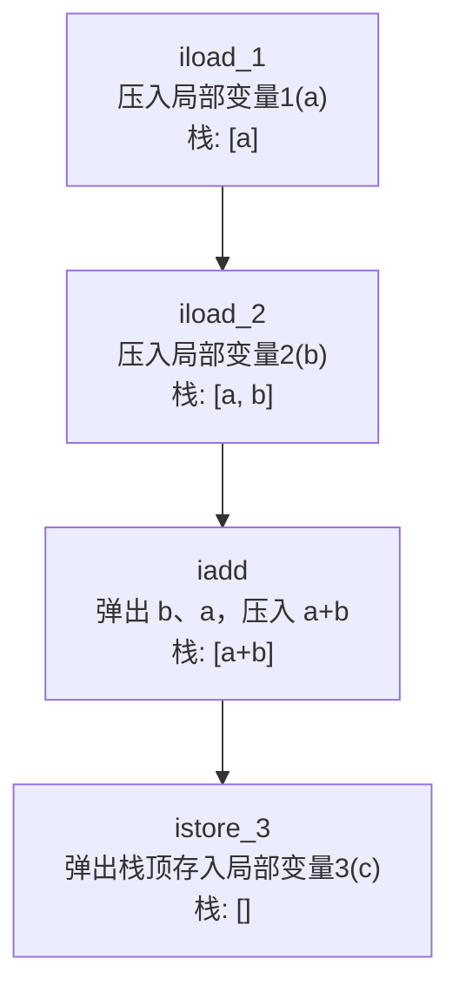
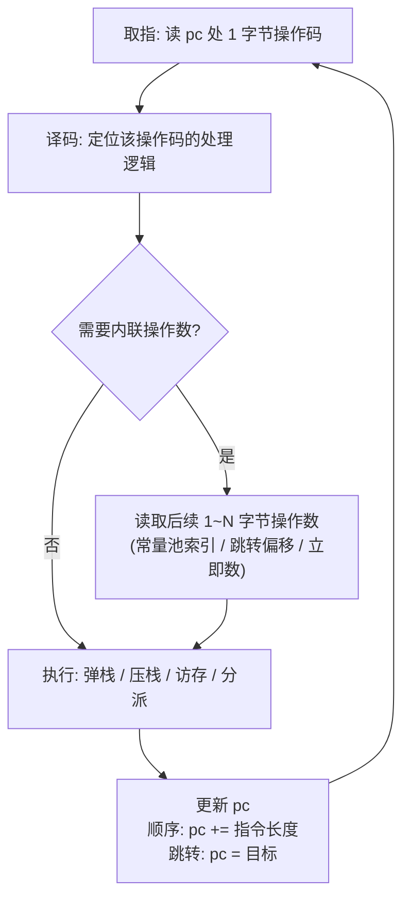
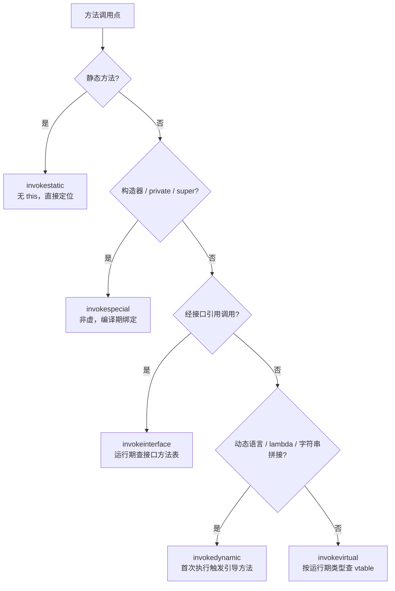

# 托管代码与字节码逆向（3）· JVM字节码指令集详解
> [!abstract] TL;DR
> - JVM 是**栈式虚拟机**：几乎每条指令的输入输出都在「操作数栈」上，指令本身极少带寄存器/临时变量操作数，因此字节码紧凑、平台无关，但一条表达式往往展开成一串「压栈—运算—存局部变量」的动作。
> - 每次方法调用创建一个**栈帧**，帧里两块核心数据是**局部变量表**（按 slot 索引寻址，`this`/参数/局部变量共用，`long`/`double` 占两槽）与**操作数栈**（LIFO 工作区）；`max_locals`、`max_stack` 在编译期算好写进 Code 属性。
> - 全套约 **205 个操作码**（含 3 个 JVM 内部保留）按前缀 `i/l/f/d/a/b/c/s` 标类型，可归为常量、加载存储、算术、类型转换、栈管理、对象数组、控制转移、方法调用返回、异常、同步十族；`byte/short/char/boolean` 在栈上一律按 `int` 计算，窄类型只存在于字段与数组。
> - `new`/`dup`/`invokespecial` 建对象、五条 `invoke*` 分派、`tableswitch`/`lookupswitch` 选择、`invokedynamic` 承载 lambda 与字符串拼接——这些**定式**是读字节码与看穿反编译结果的关键。
> - 字节码必须过**验证器**（类型安全、栈平衡、跳转合法），Java 6+ 用 `StackMapTable` 做「分离式验证」；能通过验证却不可反编译的畸形字节码是反反编译的常见手段，而生成字节码时漏算栈图会直接 `VerifyError`。

## 概述与定位

本系列第 1 篇给出了托管运行时与字节码逆向的全景，第 2 篇拆解了 JVM 架构与 class 文件的静态格式。本篇聚焦 class 文件里真正「会动」的那部分——**方法体内的字节码指令流**，也就是 JVM 的「汇编语言」。理解它是承上启下的枢纽：第 4 篇讲的反编译器（CFR/Procyon/JADX）本质就是把这套指令还原成 Java 源码，第 5 篇讲的字节码操纵（ASM/Javassist）本质就是直接生产与改写这套指令。反编译器不是万能的，遇到混淆、损坏、或根本无法用 Java 语法表达的构造时，逆向者必须回到指令层面亲手读；即便反编译成功，也需要懂指令集才能判断反编译结果是否忠实、哪里被「美化」或「误判」了。

要一句话定位 JVM 指令集，可以说：它是一套**有类型、带符号引用、可被静态验证的栈式虚拟指令集**。与原生机器码（见 [[23.C_C++运行时与ABI/01.运行时与ABI概览]]）相比，它高层得多——不假设寄存器数量、不暴露调用约定与栈布局、操作数不是裸地址而是指向常量池的符号，因此天生「可反编译性」远高于 x86/ARM 机器码。这也是「托管代码逆向」整体比原生逆向轻松的根本原因：信息在编译到字节码时**损失得很少**，类型、方法名、字段名、控制结构大多原样保留。

栈式（stack-based）是 JVM 指令集最重要的性格。与之相对的是寄存器式（register-based），典型代表是 Android 的 Dalvik/DEX（见 [[35.Android逆向与运行时/03.DEX文件格式]]）。栈式的取舍贯穿全篇：好处是编译器不必做寄存器分配、字节码短、天然平台无关；代价是同一段逻辑需要更多条指令（多了大量入栈出栈的搬运动作），解释执行时分派次数更多，且 JIT 必须先把线性的栈操作「反推」回表达式树才能优化。理解了这个取舍，后面许多指令的存在理由就顺理成章了。

## 原理与机制

### 栈帧：指令执行的舞台

字节码指令不在真空里执行，它们操作的是当前**栈帧**（frame）。每当一个方法被调用，JVM 就在当前线程的 Java 虚拟机栈上压入一个新帧；方法返回或抛异常离开时，帧被弹出销毁。一个帧里与指令直接相关的有三样东西：**局部变量表**、**操作数栈**、以及一个指向当前类**运行时常量池**的引用。前两者的容量在编译期就已确定，随方法一起编码进 class 文件的 `Code` 属性：

```
Code_attribute {
    u2 attribute_name_index;
    u4 attribute_length;
    u2 max_stack;          // 操作数栈的最大深度（槽数）
    u2 max_locals;         // 局部变量表的槽位数
    u4 code_length;
    u1 code[code_length];  // 真正的字节码指令流（本篇主角）
    u2 exception_table_length;
    { u2 start_pc; u2 end_pc; u2 handler_pc; u2 catch_type; } exception_table[];
    u2 attributes_count;
    attribute_info attributes[];  // LineNumberTable / LocalVariableTable / StackMapTable ...
}
```

`max_stack` 与 `max_locals` 不是运行时动态增长的，而是编译器静态算好、验证器复核的上界。这一设计的深层原因是：**帧的大小必须在方法进入时一次性确定**，这样 JVM 才能用一段连续内存表示帧、O(1) 地压栈弹栈，也才能让验证器在不实际运行的前提下静态推断每一处的栈状态。换句话说，JVM 用「编译期定容」换来了「运行期高效且可验证」。

### 局部变量表：按槽索引的变量数组

局部变量表是一个从 0 开始编号的**槽（slot）数组**，每个槽逻辑上是 32 位宽。它同时承载三类东西，且不加区分地混用同一片编号空间：方法参数、方法内声明的局部变量，以及实例方法里隐含的 `this`。规则是：

- 实例方法的 slot 0 恒为 `this`（接收者引用），参数从 slot 1 起顺次排布；静态方法没有 `this`，参数从 slot 0 起。
- `long` 与 `double` 是「类别 2」类型，**占据连续两个槽**（`n` 与 `n+1`），并以较小的索引 `n` 寻址，`n+1` 不能被单独引用。

举个静态方法的例子直观感受槽分配：

```
static long f(int a, long b, int c)
   slot 0 : a  (int)
   slot 1 : b  (long 低半)
   slot 2 : b  (long 高半，不可单独寻址)
   slot 3 : c  (int)
```

局部变量表还有一个容易被忽视却对逆向很关键的性质——**槽复用**。作用域不重叠的两个局部变量可以共用同一个槽，编译器会把已经死掉的变量的槽再分配给后来的变量。这就是为什么反编译时你偶尔会看到一个变量「变了类型」或语义突然切换——底层其实是同一个 slot 被复用了。调试信息（可选的 `LocalVariableTable` 属性）会记录每个槽在哪段 PC 范围内叫什么名字、是什么类型；一旦这个属性被剥掉（release 构建或混淆器所为），反编译器就只能自造 `var0`、`i`、`this` 之类的占位名。

### 操作数栈：指令的工作台

操作数栈是一个后进先出的临时区，是绝大多数指令真正干活的地方。它在帧创建时为空，随指令执行反复涨落。JVM 的计算模型可以概括为：**把要用的值先加载到栈上 → 用指令消费栈顶若干值并把结果压回栈 → 需要保存时再把结果从栈弹到局部变量表**。以 `c = a + b`（三者都是 `int`，分别在 slot 1/2/3）为例，字节码是：

```
   0: iload_1     // 取局部变量1(a) 压栈        栈: [a]
   1: iload_2     // 取局部变量2(b) 压栈        栈: [a, b]
   2: iadd        // 弹出 b、a，压入 a+b          栈: [a+b]
   3: istore_3    // 弹出栈顶存入局部变量3(c)    栈: []
```

这段四条指令把栈式虚拟机的本质演示得淋漓尽致：没有「寄存器 a、b」的概念，`iadd` 也不带任何操作数——它天生就知道自己作用于栈顶两个 `int`。这正是栈式紧凑的来源：**操作数隐含在栈顶，无需在指令里编码地址**。同样一句加法，寄存器式的 Dalvik 会写成 `add-int v0, v1, v2`，一条指令带三个寄存器号；孰长孰短，取决于比较的维度，但 JVM 选择了「指令数多、单指令短」这一侧。



### 类型系统：栈上只有四类值加引用

一个常被误解的点：操作数栈与局部变量表在**存储**层面并不区分 `byte/short/char/boolean`。它们在栈上一律被提升为 `int` 参与运算，真正的窄类型只存在于**字段**与**数组元素**里。栈与局部变量能承载的实际类别只有：`int`、`long`、`float`、`double`、`reference`（对象引用），以及一个特殊的 `returnAddress`。其中 `long`、`double` 是类别 2（占两槽两栈位），其余是类别 1（占一槽一栈位）。`returnAddress` 是唯一没有对应 Java 语言类型的类型，它由已废弃的 `jsr` 指令产生、`ret` 消费，值是一个字节码偏移，源码层面无法构造。

这个「窄类型皆按 int 算」的设计大幅精简了指令集：算术指令只需为 `int/long/float/double` 各出一套，而不必为 `byte`、`short`、`char` 单独造加减乘除。代价是编译器必须在需要时插入**显式的窄化转换**（`i2b`、`i2c`、`i2s`），以及为数组读写提供专门的窄类型存取指令（`baload/bastore` 等）。逆向时看到一个 `iadd` 后面紧跟 `i2b`，多半就是源码里对 `byte` 做了运算又赋回 `byte`。

### 操作码编码与符号引用

每条指令由**一字节操作码**开头，后接 0 到多个操作数字节。一字节操作码意味着编码空间上限 256，JVM 实际用掉约 205 个（其中 `0xCA` breakpoint、`0xFE`/`0xFF` impdep 三个保留给虚拟机内部实现）。操作码名字里的前缀直接编码了类型：`i`=int、`l`=long、`f`=float、`d`=double、`a`=reference、`b`=byte、`c`=char、`s`=short。于是 `iload` 是「加载 int 局部变量」，`aload` 是「加载引用局部变量」，`istore`/`astore` 对应存储，一望而知。

指令的操作数并非裸地址或裸字符串，而多是**指向常量池的两字节索引**——这是 JVM「符号引用」哲学的落地。看几个编码实例：

```
字节流:   04              // iconst_1        (0x04) 无操作数
          3C              // istore_1        (0x3C) 无操作数（槽号1隐含在助记符里）
          B2  00 0F       // getstatic  #15  (0xB2 + 2字节常量池索引 → Fieldref)
          12  20          // ldc        #32  (0x12 + 1字节常量池索引)
          B6  00 21       // invokevirtual #33 (0xB6 + 2字节索引 → Methodref)
```

因为字段、方法、类都以「常量池索引」而非「全限定名字符串」的形式嵌在指令里，字节码本身才如此紧凑，同一个方法引用被多处使用时只存一份。逆向时 `javap` 会自动把索引解引用成人可读的符号，这也是字节码「保留了名字」的直接体现。像 `iconst_1`、`istore_1` 这类把小常量或小槽号**折进操作码本身**的指令，则是空间优化的极致：连操作数字节都省了。

### 执行模型：取指—译码—执行循环

解释器执行字节码是一个经典循环：以程序计数器 `pc` 指向当前指令，读一字节操作码，据此译码，按需再读若干操作数字节，执行相应的栈/内存/跳转动作，最后更新 `pc`（顺序执行则 `pc += 指令长度`，跳转则 `pc = 目标偏移`）。热点方法会被 JIT（C1/C2）进一步编译为原生码，但那属于 JVM 架构范畴（见第 2 篇）；对逆向而言，**字节码指令集是稳定的 ISA 契约，而 JIT 产物不是**——我们分析、patch、混淆的对象永远是字节码。



## 指令与执行详解

下面按功能族逐一展开。族的划分沿用 JVM 规范的思路，但重点放在**语义为何如此、逆向如何识别**。

### 一、常量加载：把立即数搬上栈

需要一个字面量时，得先把它压栈。JVM 按数值大小与类型分了好几档，本质是空间优化：`aconst_null` 压 `null`；`iconst_m1..iconst_5` 压 −1 到 5 这几个高频小整数（连操作数都省）；`lconst_0/1`、`fconst_0/1/2`、`dconst_0/1` 同理。超出这几个特例但仍是小整数时，用 `bipush`（带 1 字节，−128..127）或 `sipush`（带 2 字节，−32768..32767）。再大的整数、浮点、字符串、`Class`、`MethodType`、`MethodHandle` 就得从常量池取：`ldc`（1 字节索引）/`ldc_w`（2 字节索引）加载类别 1 常量，`ldc2_w` 加载 `long`/`double` 这类类别 2 常量。Java 11 起 `ldc` 还能加载**动态计算常量**（`CONSTANT_Dynamic`，即 condy），首次求值时调用引导方法算出值并缓存，为常量也引入了惰性与可定制性。逆向看到一串 `bipush`/`sipush`/`ldc`，基本就是在还原源码里的字面量。

### 二、加载与存储：局部变量表与栈之间搬运

这是最高频的一族，负责在局部变量表与操作数栈之间倒腾值。加载方向 `Tload`（`iload/lload/fload/dload/aload`）把某槽的值压栈，存储方向 `Tstore` 把栈顶弹到某槽。为压缩常见情形，slot 0..3 有专门的「合体」变体 `iload_0`、`aload_1`、`istore_2`……省掉操作数字节。当局部变量索引超过 255（`iinc` 的常量超出有符号字节范围时同理）就要靠 `wide` 前缀（`0xC4`）把随后的索引扩到 2 字节。数组元素的存取是另一组：`Taload`（`iaload/laload/faload/daload/aaload/baload/caload/saload`）与 `Tastore`，其中 `baload/bastore` 同时服务 `byte` 与 `boolean` 数组——又一次印证「布尔在底层就是字节」。

### 三、算术与逻辑：只为宽类型服务

加减乘除余取负（`iadd/isub/imul/idiv/irem/ineg` 及 `l/f/d` 版本）、移位（`ishl/ishr/iushr`，`iushr` 是无符号右移，对应 Java 的 `>>>`）、位运算（`iand/ior/ixor`）——全部只为 `int/long/float/double` 提供，窄类型先提升到 `int` 再算。它们几乎都不带操作数，从栈上取一或两个值、把结果压回。唯一的「异类」是 `iinc`：它**直接对某个局部变量槽原地加一个常量，全程不碰操作数栈**。这条指令是为循环计数器 `i++` 量身定制的优化——否则一个自增要写成「iload/iconst_1/iadd/istore」四条，`iinc` 一条搞定。逆向时看到 `iinc 1, 1` 就基本锁定这是个循环变量递增。整数除以零抛 `ArithmeticException`，而浮点除零得到 `Inf`/`NaN` 不抛异常，这套语义差异在字节码层同样成立。

### 四、类型转换：显式的拓宽与窄化

Java 语言里的隐式/显式类型转换，到字节码都变成一条条**显式指令**：拓宽如 `i2l/i2f/i2d/l2f/f2d` 等一般无损；窄化如 `l2i/f2i/d2i/i2b/i2c/i2s` 可能丢精度或截断。特别地，`i2b/i2c/i2s` 是「int→int」的截断，用来把一个在栈上按 int 计算的值塞回 `byte/char/short` 的取值范围。逆向时这些转换指令是恢复源码类型的重要线索：一处 `d2i` 告诉你源码把 `double` 强转成了 `int`。

### 五、操作数栈管理：pop、dup 与 swap

因为一切在栈上流动，就需要直接调栈的指令：`pop`/`pop2` 丢弃栈顶一个/两个槽的值（丢弃一个方法返回值而不使用时常见）；`swap` 交换栈顶两个类别 1 的值；`dup` 家族复制栈顶。`dup` 家族是逆向的重点，也是坑点——它们按**槽（word）**而非类型工作：`dup` 复制栈顶一槽；`dup2` 复制栈顶两槽（可能是两个 int，也可能是一个 long/double）；`dup_x1`/`dup_x2`/`dup2_x1`/`dup2_x2` 则在复制后把副本**插到栈下方 1~2 槽处**。最经典的用途是「建对象」与「赋值同时取值」，例如 `putfield` 前用 `dup_x1` 让赋的值既存进字段又留在栈上作为表达式结果（对应 `return this.x = v;` 这类写法）。看懂 `dup_x` 的插入语义，才能读懂许多「一步两用」的紧凑字节码。

### 六、对象与数组：new/dup/invokespecial 定式

创建对象是 `new`（只分配并压引用，尚未初始化）；随后几乎总跟一个 `dup`，再 `invokespecial` 调 `<init>` 构造器。为什么要 `dup`？因为 `invokespecial` 会**消耗**那个引用作为 `this`，若不先复制一份，构造完对象引用就没了。于是标准定式是：

```
   new           #2   // class java/lang/StringBuilder   栈: [ref]
   dup                //                                  栈: [ref, ref]
   invokespecial #3   // <init>()V  消耗一个 ref          栈: [ref]
   ...                // 剩下的 ref 继续参与后续表达式
```

这个 `new/dup/invokespecial` 三连是识别「对象创建」最可靠的指纹。字段访问用 `getfield/putfield`（实例，需先压对象引用）与 `getstatic/putstatic`（静态，无需对象），操作数都是指向 `Fieldref` 的 2 字节索引。数组创建分三条：`newarray`（基本类型数组，带 atype 立即数标元素类型）、`anewarray`（引用类型数组，带 Class 索引）、`multianewarray`（多维）。另有 `arraylength` 取长度、`instanceof`（压 0/1）与 `checkcast`（失败抛 `ClassCastException`）。值得强调的是，由于 Java 泛型是**类型擦除**，字节码里看不到泛型参数，只有 `Object` 加 `checkcast`（泛型信息仅存在于可选的 `Signature` 属性供反射用）——这与 .NET CIL 把泛型**具体化**（见第 7 篇）形成鲜明对照，也是 Java 逆向里「泛型信息可能已丢失」的根源。

### 七、控制转移：条件跳转与两种 switch

结构化的 `if/for/while` 在字节码里被摊平成**条件跳转 + goto**。与 0 比较的一元条件跳转有 `ifeq/ifne/iflt/ifge/ifgt/ifle`（从栈弹一个 int 与 0 比）；两个 int 相比用 `if_icmpeq/ne/lt/ge/gt/le`；引用相等比较用 `if_acmpeq/if_acmpne`；判空用 `ifnull/ifnonnull`。无条件跳转是 `goto`（`goto_w` 为宽偏移）。`long/float/double` 没有直接的条件跳转，得先用 `lcmp`、`fcmpl/fcmpg`、`dcmpl/dcmpg` 把两值比较结果化成 −1/0/1 压栈，再用一元 `if<cond>` 跳——`fcmpl` 与 `fcmpg` 的区别仅在于 `NaN` 参与时取 −1 还是 1，用来正确实现 `NaN` 的「任何比较皆假」语义，是个易被忽视的细节。

多分支 `switch` 有两条专用指令，编译器按 case 值的稠密程度择一：`tableswitch` 用于 case 值连续或接近连续的情形，内部是一张按索引直接寻址的跳转表，O(1) 命中；`lookupswitch` 用于稀疏情形，存「值→偏移」的有序对，二分查找。两者的操作数都要求 4 字节对齐，故操作码后会填 0~3 个字节 padding（这也是 `nop`/对齐存在的场景之一）。逆向时数一数是 `tableswitch` 还是 `lookupswitch`，能反推原 case 值的分布。

顺带一提历史包袱：早期 `jsr/ret` 用「子程序」方式编译 `finally` 块以避免代码重复，但它引入的 `returnAddress` 类型让验证极其复杂（多态子程序问题）。自 class 版本 51.0（Java 7）起 `jsr`/`jsr_w` 被禁止，`javac` 早在引入 `StackMapTable` 时（版本 50，Java 6）就改为**内联复制** `finally` 代码。所以现代字节码里你会看到 `finally` 逻辑被复制进正常路径与每条异常路径——这是读现代字节码时的常态。

### 八、方法调用与返回：五条 invoke 的分工

方法调用是理解字节码语义的重头戏，五条指令各司其职：

- `invokestatic`：调静态方法，无 `this`，按符号引用直接定位，绑定最简单。
- `invokespecial`：调「不需要虚分派」的实例方法——构造器 `<init>`、`private` 方法、以及 `super.xxx()`。编译期即可确定目标，故又称非虚调用。
- `invokevirtual`：最常见的虚方法调用，按接收者对象的**运行期实际类型**查虚方法表（vtable）分派，是多态的实现基础。
- `invokeinterface`：通过接口引用调用，因接口无法用固定 vtable 槽位，需在运行期于对象的接口方法表中查找。其指令格式还带一个历史遗留的 `count` 字节与一个必须为 0 的字节。
- `invokedynamic`：动态调用点，见下节详解。



区分 `invokespecial` 与 `invokevirtual` 对逆向很实用：前者说明这是构造/私有/父类调用，不会被子类重写「劫持」；后者才是真正的多态点。返回指令按类型分 `ireturn/lreturn/freturn/dreturn/areturn`（带返回值）与 `return`（`void`），它们会弹出当前帧、把返回值（若有）交回调用者帧的栈顶。

### 九、invokedynamic：lambda 与字符串拼接的引擎

`invokedynamic`（JSR 292，Java 7 引入）是指令集里最「现代」也最需要单独讲的一条。它把「调用目标的确定」从编译期推迟到**首次执行时**：指令引用一个 `CONSTANT_InvokeDynamic` 常量，后者关联 class 的 `BootstrapMethods` 属性里的一个**引导方法**（bootstrap method）。首次执行该指令时，JVM 调用引导方法，返回一个 `CallSite`（内含 `MethodHandle`），此后该调用点就链接到这个句柄，后续执行直接走。

它最初为 JRuby/Groovy 等动态语言在 JVM 上高效实现方法分派而生，但真正让它无处不在的是 Java 8 的 **lambda 表达式**。一个 lambda 编译后并不生成匿名内部类，而是：lambda 体被编译成一个合成的私有方法（名字形如 `lambda$原方法名$0`），调用点用 `invokedynamic` 绑定到 `LambdaMetafactory.metafactory` 引导方法，首次执行时动态生成一个实现目标函数式接口的类。逆向 lambda 时的正确姿势就是：看到 `invokedynamic`，去 `BootstrapMethods` 找引导方法，再到合成的 `lambda$...` 方法里读真正的逻辑。Java 9 起字符串拼接（`+`）也默认改用 `invokedynamic` + `StringConcatFactory`（所谓 indify string concat），取代了以往的 `StringBuilder` 定式——这是「同一句源码在不同 JDK 上字节码不同」的典型例子，逆向时需据 class 版本预期不同形态。

### 十、异常与同步

抛异常用 `athrow`：从栈顶取异常对象抛出。异常的捕获不靠指令，而靠 `Code` 属性里的**异常表**——每个表项是 `[start_pc, end_pc)` 的保护范围、`handler_pc` 处理器入口、以及 `catch_type`（捕获的异常类，`0` 表示 `finally`/`any`）。当范围内抛出且类型匹配的异常发生时，JVM **清空当前帧的操作数栈，把异常对象压栈**，然后跳到 `handler_pc`。理解这一点就明白为什么 `catch` 块开头总能直接拿到异常对象（`astore` 存起来）。同步方面，`synchronized` 代码块编译成 `monitorenter`/`monitorexit` 配对，且编译器会额外生成异常处理器保证异常路径上也 `monitorexit`（所以你常看到两处 `monitorexit`）；而 `synchronized` **方法**不用这两条指令，靠方法的 `ACC_SYNCHRONIZED` 访问标志由 JVM 隐式加解锁——这个差异也是逆向识别同步方式的依据。

## 工具视角与实战

反汇编字节码的标准工具是 JDK 自带的 `javap`。常用 `javap -c -p -v <Class>`：`-c` 反汇编方法体，`-p` 连 `private` 成员一起显示，`-v` 输出常量池、`max_stack`/`max_locals`、异常表、`StackMapTable`、`BootstrapMethods` 等全部细节。读一个最简单的方法能立刻把前面的原理对上号：

```
  int add(int, int);
    Code:
       0: iload_1
       1: iload_2
       2: iadd
       3: ireturn
```

真正的逆向功力在于识别**编译定式**——高级语法糖在字节码里都有稳定指纹，记住它们就能快速「反糖」：

- **对象创建**：`new/dup/invokespecial <init>` 三连。
- **自动装箱**：`invokestatic Integer.valueOf(I)` 之类；拆箱是 `invokevirtual intValue()`。
- **字符串拼接**：Java 8 及以前是 `new StringBuilder`/`append`/`toString`；Java 9+ 是 `invokedynamic makeConcatWithConstants`。
- **字符串 switch**：两级——先 `hashCode()` 做 `lookupswitch`，再 `equals()` 确认，最后才跳真正的 case。
- **枚举 switch**：借助一个合成的 `$SwitchMap$...` int 数组做序号映射。
- **增强 for**：数组上退化为下标循环 + `arraylength`；`Iterable` 上是 `iterator()`/`hasNext()`/`next()`。
- **try-with-resources**：展开成 try/finally 加 `close()` 调用与 `addSuppressed` 抑制异常的样板代码。
- **合成桥接方法**：泛型协变返回或桥接会生成带 `ACC_SYNTHETIC`/`ACC_BRIDGE` 的方法，只是转调真实方法。

反编译器（第 4 篇）本质是把这条线性的栈式指令流「反推」回结构化源码：它先做数据流分析把栈操作重建成表达式树（谁产生了栈顶、谁消费了它），再做控制流分析把 `if/goto/switch` 的跳转网重建成 `if/for/while/switch` 块。理解指令集，你才能判断反编译结果何处可信、何处是启发式猜测，并在反编译失败（栈图损坏、非法但可运行的跳转、被混淆）时**直接读字节码**补齐真相。指令层的 patch 同样常见——改一个 `ifeq` 为 `ifne` 翻转判断、把 `invokevirtual` 的常量池索引改指向别的方法——但改后必须同步维护栈平衡与 `StackMapTable`，否则加载即失败，这就引出下一节。

## 安全性与正确使用

JVM 从设计之初就假定**字节码可能来自不可信来源**（早年的 applet 沙箱是直接动因）。因此在类加载的链接阶段，字节码必须通过**验证器**（bytecode verifier）：核验类型安全（`iadd` 两侧确是 int、`getfield` 的对象确是该类实例、方法调用实参类型匹配）、操作数栈在任意可达路径上深度与类型一致（不会下溢/上溢、汇合点栈状态自洽）、跳转目标落在方法内合法指令边界、`final` 约束不被破坏等。这一步把「一段字节能否被信任」从运行期崩溃前移为**加载期静态判定**，是 JVM 内存安全的基石之一。

早期验证器用迭代式数据流分析推断每条指令处的类型状态，慢且复杂。Java 6（class 版本 50）起引入 `StackMapTable` 属性，改为**分离式验证**（split verifier / type checking）：编译器把每个跳转目标处的栈与局部变量类型「快照」预先算好写进 class，验证器只需一遍线性核对而非迭代求不动点，大幅提速。代价是**生成字节码的工具必须正确产出栈图**——这是实践中最常见的坑：手写或用 ASM 生成字节码若忘了 `COMPUTE_FRAMES`/`COMPUTE_MAXS`，类加载时就抛 `VerifyError`。所以「会写字节码」的前提是「会算栈状态」，这也是第 5 篇字节码操纵的核心难点之一。

从攻防角度看，验证器本身也是攻击面：历史上多个 JVM 逃逸漏洞正是验证器的类型混淆缺陷（让本不合法的字节码蒙混过关，制造类型混淆进而破坏内存安全），这提醒我们「验证通过」不等于「绝对安全」，验证器的正确性至关重要。另一类现实是**反反编译**：JVM 接受的合法字节码是 `javac` 能生成之集合的**超集**，攻击者可手工构造「能通过验证、能正常运行，却无法用 Java 语法表达、从而让反编译器崩溃或吐出错误源码」的字节码（畸形但合法的跳转、异常表、栈操作）。逆向遇到反编译器罢工时，回退到 `javap` 读原始指令往往是唯一出路。

正确使用的边界也需厘清：出于分析目的读取、反汇编字节码通常是正当的；`-noverify`（或新版 `-Xverify:none`）可关闭验证以加载「脏」字节码用于研究，但这等于自废内存安全护栏，**绝不可用于生产**，仅限隔离的分析环境。生成/改写字节码要坚持三条底线：栈必须平衡、`StackMapTable` 必须与实际类型状态一致、常量池引用必须有效——否则轻则 `VerifyError` 重则运行期崩溃。至于把 patch 过的字节码重新分发，则涉及软件许可与完整性（签名、篡改检测）的合规边界，属于「能做」与「可做」的分野，需另行评估。

## 小结

JVM 字节码指令集是一套栈式、带类型前缀、以常量池符号引用为操作数、且可被静态验证的虚拟指令集。它的一切都围绕**栈帧**里的两块数据展开：局部变量表（按 slot 索引、`this`/参数/局部共用、宽类型占双槽、可复用）与操作数栈（LIFO 工作区、深度编译期定容）。约 205 个操作码按前缀分类型、按功能分十族；`byte/short/char/boolean` 在栈上皆按 `int` 计算，窄类型只活在字段与数组里。逆向的关键不在背全指令表，而在识别 `new/dup/invokespecial`、五条 `invoke*` 分派、两种 `switch`、`invokedynamic` 承载 lambda 与字符串拼接等**编译定式**，并理解验证器与 `StackMapTable` 如何约束合法字节码的边界。掌握指令集，才能看穿反编译器的还原、在它失效时亲手读字节码、并安全地生成与改写字节码——这正是接下来「反编译」（第 4 篇）与「字节码操纵」（第 5 篇）两篇的地基。

## 相关阅读

- 系列上一篇（格式前置）：[[02.JVM架构与class文件格式]] —— Code 属性所在的 class 文件整体结构与 JVM 运行时内存模型。
- 系列下一篇（指令的还原）：[[04.Java反编译：CFR与Procyon与JADX]] —— 反编译器如何把本篇的栈式指令流重建成结构化源码。
- 系列参考（指令的生产）：[[05.Java字节码操纵：ASM与Javassist]] —— 直接编写/改写字节码，以及 `StackMapTable` 与 `COMPUTE_FRAMES` 的实战。
- 系列总览：[[00.托管代码与字节码逆向总览|托管代码与字节码逆向总览]]。
- 寄存器式对照：[[35.Android逆向与运行时/03.DEX文件格式]] —— Dalvik 寄存器式指令集与 JVM 栈式的深层取舍差异。
- 结构化控制流对照：[[40.WASM与虚拟化壳逆向/02.WASM指令集与执行模型]] —— 同为栈式但采用结构化控制流（无任意 goto）的现代设计。
- 原生对照：[[23.C_C++运行时与ABI/01.运行时与ABI概览]] —— 与原生机器码/ABI 相比，托管字节码为何「可反编译性」更高。
- 泛型具体化对照：[[13.PE文件详解/07-详解PE文件(七)：数据目录]] —— .NET 元数据寄生于 PE，其 CIL 与泛型模型与 JVM 的类型擦除形成对比（详见系列第 7~8 篇）。
- 官方规范：Oracle《The Java Virtual Machine Specification》第 2.11 节（指令集综述）、第 4.7.3/4.7.4 节（Code 与 StackMapTable 属性）、第 6 章（操作码逐条定义）、第 4.10 节（验证）。
- 书目：周志明《深入理解 Java 虚拟机》——字节码执行引擎与类加载/验证章节的中文权威讲解。

[[00.托管代码与字节码逆向总览|⬆ 系列总览]] | [[02.JVM架构与class文件格式|← 上一章]] | [[04.Java反编译：CFR与Procyon与JADX|→ 下一章]]
