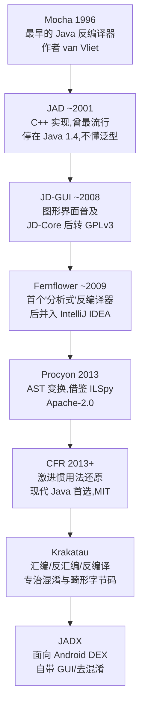
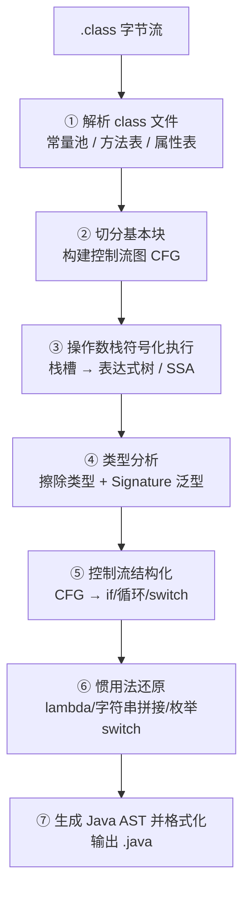
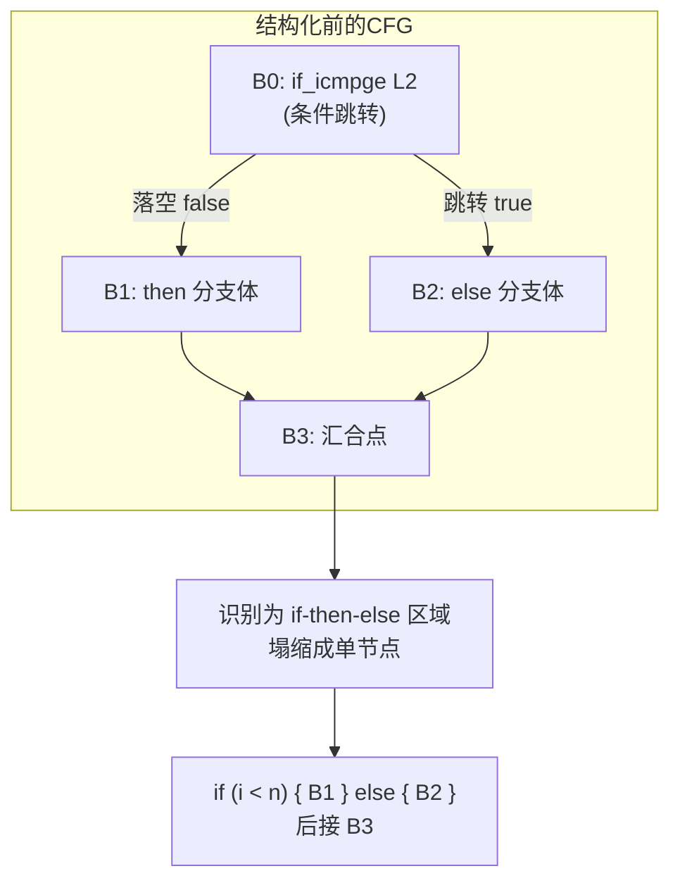

# 托管代码与字节码逆向（4）· Java反编译：CFR与Procyon与JADX
> [!abstract] TL;DR
> - Java 字节码是**带类型的栈式中间码**，方法边界清晰、常量池与调试属性丰富，因此能高保真反编译回近似源码——这是它与原生机器码逆向的根本差异，也是本篇一切工具得以存在的前提。
> - 反编译真正的难点不在"逐条指令翻译"，而在把 `goto` 式的**非结构化控制流图（CFG）**重构成 `if`/循环/`switch`，其算法地基是支配树（dominator tree）、自然循环（natural loop）与可归约性（reducibility）。
> - 编译期"惯用法"——字符串拼接、lambda 的 `invokedynamic`、字符串/枚举 `switch`、try-with-resources、内部类桥接方法——必须逐一模式匹配还原，否则输出虽语义正确却"不像人写的"。
> - **CFR** 长于现代 JVM 特性与惯用法还原，**Procyon** 走 AST 变换路线、思路源自 .NET 的 ILSpy，**JADX** 面向 Android 寄存器式 DEX 且自带 GUI/去混淆——三者定位互补，实战中应交叉验证。
> - 反编译是**有损且多对一**的：源码不可能逐字复原，变量名与泛型强依赖调试属性，混淆与不可归约 CFG 会显著降质，输出常常无法直接重新编译。
> - 反编译暴露硬编码密钥、私有算法与业务逻辑，既是审计/取证/互操作的利器，也是攻击面；防御只能"抬高成本"（混淆、服务端化、原生化），无法从原理上根除。

## 概述与定位

反编译（decompilation）是把已编译产物**逆向恢复为高级语言源码**的过程。它与上一章讨论的反汇编（disassembly）有本质区别：反汇编只是把字节码线性翻译成人类可读的助记符（`iload_1`、`invokevirtual …`），信息量与原始字节等价，是一一对应的"换一种写法"；反编译则要跨越一整个抽象层级——从栈操作、跳转标号、常量池索引，重建出变量、表达式、`if/for/while/switch`、异常处理块乃至 lambda 与泛型。这一跃迁是**信息重构**而非信息转写，因此充满不确定性。

本篇在系列中的位置很关键。第 02 篇讲清了 `class` 文件的物理格式（常量池、方法表、属性表），第 03 篇讲清了字节码指令集的语义，它们是反编译器的**输入**；第 05 篇要讲的 ASM/Javassist 则是反编译的"镜像"——直接构造或改写字节码，是反编译的**逆操作**。换句话说，本篇处在"读懂字节码"与"操纵字节码"之间：只有先能把字节码读回源码，才谈得上定位改写点、理解混淆（第 06 篇）在对抗什么。

**为什么 Java 特别好反编译？** 与原生 C/C++ 逆向（见 [[23.C_C++运行时与ABI/01.运行时与ABI概览]]）相比，托管字节码保留了大量"编译器本该丢弃"的高层信息：每条指令自带类型（`iadd` 是 int 加、`dadd` 是 double 加，不像 x86 的 `add` 需要靠上下文推断宽度）；方法有明确的描述符 `(Ljava/lang/String;I)Z`，参数与返回类型无歧义；字段、方法、类名以符号形式存于常量池，除非被混淆否则可读；`javac -g` 还会额外写入 `LocalVariableTable`（局部变量名与作用域）、`LineNumberTable`（源码行号映射）、`Signature`（泛型签名）、`SourceFile` 等调试属性。原生编译会把这一切碾平成寄存器分配与内存偏移，逆向者要从零重建类型与结构；而 JVM 的验证器为了保证类型安全，本就要求字节码携带足以恢复类型的信息——**安全设计的副产品就是可反编译性**。这一点对 .NET CIL、Android DEX、WASM（见 [[40.WASM与虚拟化壳逆向/02.WASM指令集与执行模型]]）同样成立，是整个"托管代码逆向"专题的共同基石。

但必须清醒：反编译是**有损且多对一**的。同一段字节码可能对应无数种源码写法——`for` 与等价的 `while`、三元表达式与 `if/else`、变量取什么名字、循环里用不用 `break`，编译后往往完全相同。反编译器只能挑一种"规范形式"输出，它**不可能复原你当初写的那一版**。更现实的是：一旦用 `-g:none` 编译或经过混淆，局部变量名、泛型实参、行号统统丢失，反编译器只能造出 `var0`、`n`、`bl` 这类合成名字。所以反编译产物是"语义等价的重写"，不是"源码考古"。

**三款工具的定位**可先建立直觉：**CFR**（Class File Reader，作者 Lee Benfield，MIT 许可）是纯 JVM 反编译器，以对**现代 Java 语言特性**（lambda、字符串 switch、try-with-resources、Java 9+ 字符串拼接）的激进、准确还原著称，常年是"疑难方法"的首选；**Procyon**（作者 Mike Strobel，Apache-2.0）是一整套 Java 元编程工具，其反编译器采用 **AST 驱动**的变换管线，设计思路直接借鉴作者熟悉的 .NET 反编译器 ILSpy/Mono.Cecil，擅长把惯用法还原成漂亮的高层结构；**JADX**（作者 skylot，Apache-2.0）主战场是 **Android**：它吃 `apk/dex`（也吃 `jar/class`），把**寄存器式**的 Dalvik 字节码（见 [[35.Android逆向与运行时/03.DEX文件格式]]）反编译成 Java，还自带图形界面 `jadx-gui`、交叉引用、批量去混淆与资源解码。下图梳理反编译器谱系的演进：



## 原理与机制

一款反编译器不管内部叫什么名字，其数据流大体一致，可拆成七级流水线。理解这条流水线，比记住任何单个工具的命令都重要，因为**每一级都对应一类失败模式**，遇到坏输出时你要能定位是哪一级出了问题。



**① 解析**：读常量池、方法、字段、属性，这一步基本无损，等同于反汇编（细节见第 02 篇）。**② 建 CFG**：以跳转指令（`ifeq`、`if_icmplt`、`goto`、`tableswitch`、`athrow` 等）和异常处理表为界，把线性指令流切成"基本块"（basic block，块内顺序执行、只从头进、只从尾出），块之间的跳转关系构成有向图。CFG 是后续一切结构分析的载体。

**③ 栈式到表达式的还原**是反编译最独特的一环。JVM 是**栈机**：它没有寄存器，算术、方法调用的操作数都在操作数栈上进出。而源码是"表达式 + 变量赋值"的世界。反编译器必须**符号化地模拟操作数栈**——不真的算值，而是在栈上压入代表"子表达式"的符号节点，从而把栈操作序列重组成表达式树：

```
字节码             操作数栈演化(栈顶在右)      还原语义
iload_1            [ i ]                       局部变量 i
iload_2            [ i, j ]                    局部变量 j
iadd              [ (i + j) ]                 子表达式 i + j
istore_3           [ ]                         语句: int k = i + j;
```

一个值若只被消费一次，就能作为子表达式**内联**进使用它的地方；若被消费多次、或跨基本块存活，则需引入临时变量。真正棘手的是 `dup` 家族——它复制栈顶值，专门服务于"一次求值、多处使用"的编译惯用法。例如 `arr[i]++` 会展开成：

```
aload_1  (arr)     [ arr ]
iload_2  (i)       [ arr, i ]
dup2               [ arr, i, arr, i ]     ← 复制"数组引用+下标",供两次访问
iaload             [ arr, i, v ]          ← 取旧值 arr[i]
iconst_1           [ arr, i, v, 1 ]
iadd               [ arr, i, (v+1) ]
iastore            [ ]                     ← arr[i] = v + 1;  等价于 arr[i]++
```

反编译器必须识别 `dup2 … iaload … iastore` 这个"读-改-写共享地址"模式，才能还原成 `arr[i]++` 而不是一堆临时变量。识别失败就会吐出可读性极差、但语义正确的展开代码——这是"栈机还原"级最典型的降质。

**④ 类型分析**要面对**泛型擦除**：字节码里 `List<String>` 和 `List` 无法区分，`E`、`T` 这些类型变量在运行期都是 `Object`。挽救办法是读 `Signature` 属性（类/方法/字段的泛型签名）与 `LocalVariableTypeTable`（局部变量泛型），它们由编译器专门保留给反射与工具用。没有这些属性，反编译器只能给出擦除后的裸类型，并可能在需要处补 `(String)` 强制转换。控制流汇合点（两个分支合并）还要计算多个类型的**最小公共父类型**，`null` 与任意引用类型的合并也需特判。Java 6/7 起 `class` 文件携带的 `StackMapTable`（为验证器的分离式验证而生）恰好在每个跳转目标处标注了栈与局部变量的类型，反编译器可借它辅助类型合并——又一次"验证需求"反哺"逆向能力"的例子。

**⑤ 控制流结构化**与 **⑥ 惯用法还原**是决定输出"像不像人写的"的两级，也是三款工具拉开差距的地方，放到下一节深挖。**⑦ 生成 AST 并格式化**：把重建出的语句树打印成带缩进的 `.java`，处理导入、命名冲突、运算符优先级加括号等表层问题。

## 控制流重建与惯用法还原详解

这一节是全篇的技术核心。**为什么控制流结构化是反编译的圣杯？** 因为字节码用的是**非结构化控制流**：只有"条件跳转到某偏移"和"无条件跳转到某偏移"，本质上是 `goto`。而 Java 源码**没有 `goto`**，只有 `if/else`、三种循环、`switch`、带标签的 `break/continue`。反编译器必须把任意形状的跳转图，**无损地翻译成一棵只用结构化构造的语法树**。这不是翻译问题，而是图论问题。

### 支配、自然循环与可归约性

结构化分析的地基是**支配关系**。在 CFG 中，若从入口到达节点 `n` 的每一条路径都必经节点 `d`，则称 `d` 支配 `n`；离 `n` 最近的支配者是它的**直接支配节点**（immediate dominator），所有节点按直接支配者连起来构成**支配树**。支配树一算出来，循环就浮现了：一条边 `n → h` 若满足"`h` 支配 `n`"，就是一条**回边**（back edge），它标志着一个循环，`h` 是循环头。回边 `n → h` 的**自然循环**，是 `h` 加上所有"不经过 `h` 就能到达 `n`"的节点集合。识别出自然循环，就能判断它是 `while`（条件在头部）、`do-while`（条件在尾部）还是可整理成 `for`（有初始化/步进的计数模式）。

更深一层是**可归约性**。若反复施加两种变换——T1（删除自环）与 T2（把只有单一前驱的节点并入其前驱）——最终能把整个 CFG 塌缩成一个节点，这个图就是**可归约的**。关键事实：**`javac` 从结构化 Java 源码编出的 CFG 一定可归约**，因为源码本身就是结构化的。所以反编译 `javac` 产物在图论上总是"有解"的，这解释了为何主流工具对正常编译的代码效果很好。

麻烦出在**不可归约图**：包含"多入口循环"——两个节点互相跳转、且都能从外部进入，没有唯一的循环头。这种图无法只用 `if/循环` 表达，除非**复制节点**（node splitting，把共享代码拷贝多份）或引入**调度变量**（把控制流编码成一个 `int state`，套进 `while(true){ switch(state){…} }` 的状态机）。两种手段都会让输出膨胀、丑陋。而这正是**控制流混淆器**（见第 06 篇）的攻击点：它们故意制造不可归约图、往 CFG 里塞冗余跳转，专门让反编译器要么崩溃、要么吐状态机。Krakatau 之所以在混淆样本上口碑好，就是因为它不强求"漂亮"，宁可产出带 `goto` 标签的、能忠实反映 CFG 的代码。

### 两种结构化路线：区域塌缩 vs AST 变换

历史上有两大流派。**结构化分析**（structural analysis，源自 Sharir，Cifuentes 的博士论文将其系统化用于反编译）自底向上地在 CFG 上做**模式匹配**：预定义一组"图式"（sequence 顺序、if-then、if-then-else、while、do-while、switch、自然循环），在图里找到匹配的子图就把它塌缩成一个抽象区域节点，如此反复直到只剩一个节点，塌缩的嵌套顺序天然给出语法树。这条路线的优点是理论清晰；缺点是对不匹配任何图式的"畸形"子图束手无策，只能退化成 `goto`。

下图演示最基础的 if-then-else 塌缩：字节码里的菱形跳转，被识别为一个条件区域。



**AST 变换**路线（Fernflower、Procyon、以及 ILSpy 在 .NET 侧的做法）不追求一次性塌缩，而是先把字节码粗暴地翻成一棵**含 `goto` 的低级 AST**，再跑一条**变换管线**：`goto` 消除、循环识别与提升、条件合并、三元表达式折叠、`switch` 重建、死代码删除……每个变换是一个可插拔的重写规则，逐步把低级结构"抬升"成高级构造。这条路线更工程化、更易扩展新规则，Procyon 的强项——把复杂惯用法还原得干净——正得益于此。**CFR** 则被作者描述为更"操作式"的方法：直接在提升字节码操作的过程中构建语句并施加变换，对现代语言特性的模式识别做得尤其激进，因此在 lambda、字符串 switch、Java 9+ 拼接等新特性上常领先一步。三者没有绝对优劣，实战结论是：**遇到一个方法反编译崩坏，就换另一款工具重试**，它们的失败点往往不重合。

还有一段历史必须交代：**`jsr`/`ret`（子程序调用/返回）指令**。Java 6 之前，`javac` 用 `jsr` 跳进 `finally` 块、`ret` 跳回，好处是 `finally` 代码只存一份；坏处是"子程序对类型多态"让验证器和反编译器都极难处理（同一段 `finally` 被不同类型上下文复用）。Java 6+ 改为**内联复制** `finally` 到每个出口，字节码变胖，但换来了基于 `StackMapTable` 的快速验证，也让反编译大幅简化。现代反编译器基本假定内联式 `finally`，但为兼容老代码仍需保留 `jsr/ret` 处理路径——这是"格式演进倒逼工具演进"的经典案例。

### 编译惯用法的逆向

结构化只解决了"骨架"，要输出**像人写的代码**还得还原一系列**语法糖**——它们在源码里是简洁的一行，在字节码里却是一套固定的展开模板。反编译器为每种模板内建一个识别器；识别成功则"糖化"回高级写法，失败则暴露底层展开。以下逐一剖析，每条都点明"编译器为何这样展开"（这是识别的依据）：

- **字符串拼接**。Java 9 之前，`"x=" + a + ",y=" + b` 编译成 `new StringBuilder().append(...).append(...).toString()` 链；Java 9+（`StringConcatFactory`）改用一条 `invokedynamic makeConcatWithConstants`，把常量片段编码进一个"配方"字符串（`\u0001` 代表一个运行时参数、`\u0002` 代表一个常量），运行期由引导方法拼装。改动动机是让 JIT 有机会生成更优拼接、缩小字节码。反编译器要么识别 `StringBuilder` 链，要么解码 `invokedynamic` 的配方——**同一段源码在不同 JDK 下有两套完全不同的字节码**，这是版本差异导致工具行为分叉的典型。

- **增强 `for`**。对数组，`for(int x : arr)` 展开成"取 `arr.length`、下标递增、`arr[i]` 取元素"的计数循环；对 `Iterable`，展开成 `Iterator it = c.iterator(); while(it.hasNext()) x = it.next();`。反编译器靠"存在一个只在循环内使用、名字合成的迭代器/下标变量"这一特征把它糖化回增强 `for`。

- **字符串 `switch`**（Java 7+）。`switch(s){case "foo":…}` 展开成**两级 switch**：第一级对 `s.hashCode()` 做 `lookupswitch`，命中后用 `equals()` 校验（防哈希碰撞）并置一个中间序号；第二级对该序号做 `tableswitch` 执行真正的分支。为何绕这一圈？因为 `switch` 底层只能跳整数，字符串必须先映射成整数、再防碰撞。反编译器识别这个"哈希+equals+二级跳转"三件套，才能还原成字符串 `switch`。

- **枚举 `switch`**。`switch(color){case RED:…}` 会生成一个**合成类**（如 `Foo$1`），内含 `static int[] $SwitchMap$Color`，在其静态块里 `$SwitchMap$Color[Color.RED.ordinal()] = 1`（外包 `try/catch(NoSuchFieldError)`）。运行时先 `getstatic` 这张表、用 `ordinal()` 取下标、再 `tableswitch`。为何不直接对 `ordinal()` 跳？因为 `ordinal()` 不是编译期常量——若枚举被单独重编译、常量重排序，直接跳会跳错；映射表在运行时按**实际** ordinal 构建，保证分离编译的健壮性。反编译器必须认出这个合成 `$SwitchMap` 类并反查回枚举常量名。

- **`try`-with-resources**。展开出一个合成的 `Throwable` 变量、`addSuppressed()` 调用与嵌套 `try/finally`，以确保资源 `close()` 一定执行、且关闭时的异常被"抑制"而非吞掉主异常。Java 9 优化了这段模板以减少字节码重复。反编译器要把这坨合成代码塌回一行 `try(Resource r = …)`。

- **`synchronized` 块**：`monitorenter` 进锁、正常路径 `monitorexit` 出锁，**外加一个覆盖全块的异常处理器**，在抛异常时也 `monitorexit`（防止异常导致锁泄漏）。识别这个"配对 + 异常也解锁"的模式即可糖化。

- **`assert`**：生成合成字段 `static final boolean $assertionsDisabled`（由 `Class.desiredAssertionStatus()` 初始化），`assert cond` 展开成 `if (!$assertionsDisabled && !cond) throw new AssertionError();`。

- **lambda 与方法引用**：`x -> f(x)` 不生成匿名类，而是一条 `invokedynamic`，其引导方法（记在 `BootstrapMethods` 属性里）指向 `LambdaMetafactory.metafactory`，真正的实现体被编译成一个私有合成方法 `lambda$xxx$0`。首次执行时由元工厂在运行期"编织"出函数式接口实例。反编译器要读 `BootstrapMethods`、顺藤摸到 `lambda$` 方法，才能还原 `x -> …` 或方法引用 `Foo::bar`；识别失败则暴露裸 `invokedynamic`，这也是老工具（不懂 indy）在 Java 8 代码上集体翻车的原因，而 CFR 恰以率先攻克此点成名。

- **内部类与嵌套访问**：非静态内部类持有合成字段 `this$0`（指向外部实例），构造器隐式多收一个外部实例参数。Java 11 之前，跨内部类/外部类边界访问 `private` 成员会生成合成**桥接方法** `access$000`、`access$100`；Java 11 引入"嵌套成员"（nestmates，`NestHost`/`NestMembers` 属性）后，同一嵌套体内的 `private` 访问由 JVM 直接放行，不再需要桥接方法。**后果**：反编译 Java 11+ 代码时内部类输出更干净，反编译更老的代码则需把 `access$` 桥接内联回直接的字段/方法访问。这是"平台版本差异改变逆向体验"的又一实例。

字符串 `switch` 的两级结构值得单独画出来，它是"底层只能跳整数"这一约束逼出的经典展开：

```mermaid
flowchart TD
    S["源码: switch(s) { case 'foo'…case 'bar'… }"] --> L1["第一级: lookupswitch on s.hashCode()"]
    L1 -->|hash('foo')| E1["equals('foo')?<br/>命中则 idx=0"]
    L1 -->|hash('bar')| E2["equals('bar')?<br/>命中则 idx=1"]
    E1 --> L2["第二级: tableswitch on idx"]
    E2 --> L2
    L2 -->|idx=0| C1["foo 分支体"]
    L2 -->|idx=1| C2["bar 分支体"]
```

## 工具视角与实战

理论落到手上，就是"给一个 jar/apk，怎么快速拿到最可读的源码"。三款工具用法与脾性如下。

**CFR** 是单个 jar、命令行直用：`java -jar cfr.jar target.jar --outputdir out/` 可批量反编译整个归档；对单类 `java -jar cfr.jar Foo.class`。它默认开启几乎所有惯用法还原，可用开关**反向关闭**以观察底层结构，这在逆向混淆或研究编译器行为时极有用：`--decodelambdas false`（不糖化 lambda，露出 indy）、`--stringswitch false`、`--sugarenums false`、`--decodefinally false`、`--comments false`（去掉 CFR 自己的提示注释）。当某方法反编译出错，CFR 会以注释形式标注它无法处理的点而非整体崩溃。CFR 对新语言特性跟进快，是"现代 Java + 疑难方法"的默认首选。

**Procyon** 同样命令行：`java -jar procyon-decompiler.jar Foo.class`。常用开关 `-ci`（包含解释性注释）、`-mv`（合并变量、减少中间临时量，输出更紧凑）、`-ln`（显示行号）、`-b`（同时展示字节码，便于对照）、`-r`（关闭优化、更贴近原始结构）。它的 AST 变换管线在把复杂结构还原成清爽高层代码上表现稳定，历史上对泛型与 Java 5/8 特性处理扎实，适合作为 CFR 的"第二意见"。

**JADX** 是 Android 逆向的主力，兼容 `apk/dex/aar/jar/class/zip`。命令行 `jadx -d out/ app.apk` 一步导出源码与资源；`jadx-gui app.apk` 打开图形界面，提供跳转定义、**交叉引用**（"谁调用了这个方法/引用了这个字段"）、全局搜索、就地重命名（把混淆名 `a.b.c` 改成有意义的名字并全局同步）等。关键开关：`--deobf` 启用**自动去混淆**（为无意义的短名批量生成稳定可读名）、`--show-bad-code` 在反编译失败时**仍输出可得的部分**（以注释标记"inconsistent code"，而非留空）、`-e` 导出成可导入的 Gradle 工程、`--no-res`/`--no-src` 只取代码或只取资源。JADX 的独特之处在于它处理的是**寄存器式** Dalvik 字节码（不是 JVM 的栈式），寄存器天然更接近"变量"，某些表达式还原反而更直接；但它同样要做控制流结构化，也同样会被混淆击穿，此时可退回查看 smali。DEX 格式细节见 [[35.Android逆向与运行时/03.DEX文件格式]]。

横向对比一张表建立选型直觉：

| 维度 | CFR | Procyon | JADX | Fernflower | JD-Core |
|---|---|---|---|---|---|
| 输入 | class/jar | class/jar | apk/dex/jar/class | class/jar | class/jar |
| 主战场 | JVM | JVM | Android/Dalvik | JVM(IntelliJ 内置) | JVM |
| 字节码模型 | 栈式 | 栈式 | 寄存器式(DEX) | 栈式 | 栈式 |
| 现代 Java 特性 | 很强 | 强 | 强 | 强 | 偏旧 |
| 内建 GUI | 无(可配三方) | 无 | jadx-gui | 无 | JD-GUI |
| 去混淆/交叉引用 | 弱 | 弱 | 强 | 弱 | 弱 |
| 许可 | MIT | Apache-2.0 | Apache-2.0 | Apache-2.0 | GPLv3 |

补充两款专用工具：**Fernflower** 是 IntelliJ IDEA 的内置反编译器，你在 IDE 里点开一个无源码的 `.class` 看到的就是它——最省事、集成度最高；**Krakatau** 自带汇编器/反汇编器，能反编译**畸形或高度混淆**的字节码，甚至处理其他工具直接拒绝的样本，是恶意软件与 CTF 场景的补充武器。

**实战方法论**远比记命令重要：其一，**多工具交叉验证**——同一个类分别喂给 CFR、Procyon、JADX（若是 apk），对反编译结果打架的方法逐条比对，语义取交集；其二，**接受"输出常常无法重新编译"**：合成方法（`access$`、`lambda$`）、擦除的泛型、被内联的 `finally`、名字冲突都会让产物不能直接 `javac`，反编译目标是"读懂"而非"重建可运行工程"；其三，**反编译崩坏时下沉到字节码**——用 `javap -c -p -v` 或工具的 `-b`/smali 视图直接读指令，很多时候人脑结构化几十条字节码比修工具更快；其四，**面对混淆先降期望**：名字混淆用 JADX `--deobf` + 手工重命名对抗，控制流混淆则优先 Krakatau、或关掉 CFR 的糖化开关看清骨架。

## 安全性与正确使用

反编译的能力边界，直接决定了它带来的**安全影响**与**误用风险**，开发者与逆向者都需清楚。

**它暴露什么。** 反编译能高保真恢复业务逻辑、私有算法、以及最危险的——**硬编码机密**：API 密钥、加密密钥、后端地址、签名盐值、许可校验逻辑。凡是打进客户端（jar/apk/桌面程序）的东西，都要按"已公开"来对待。这既是攻击者的信息来源，也是防御方**自查**的手段：安全团队应当主动反编译自己的发布包，确认没有把不该下发的秘密烤进客户端。

**法律与合规边界。** 反编译他人软件可能触及许可协议（EULA 常禁止逆向）、著作权与 DMCA 等法域规则，多数法域为**互操作性**（做兼容接口）、**安全研究**、**教学**留有例外，但边界因地而异。正当用途包括：审计自研或第三方**依赖**是否存在漏洞/后门、验证开源许可（如 GPL）合规、恶意样本取证、无源码遗留系统的维护性理解。将反编译成果用于剽窃代码、破解授权、绕过付费，则越过红线。**动手前先确认你对目标的合法权利。**

**恶意样本处置。** 分析恶意 APK/jar 时，反编译是**静态**手段，本身不执行样本，相对安全；但绝不可在分析主机上运行样本，一切动态验证须在隔离沙箱/虚拟机中进行，并做好网络与文件系统隔离。

**反编译器自身即攻击面。** 反编译器要解析**不可信输入**（来路不明的 class/dex），畸形常量池、超长属性、精心构造的畸形字节码都可能触发解析器的崩溃或内存问题——历史上多款工具都出过被畸形样本"打挂"的 bug。因此分析未知样本时，应在受限权限、隔离环境中运行反编译器本身，别用日常账号直接怼海量野生样本。

**防御侧的正确姿势。** 必须承认：**反编译无法从原理上阻止**，托管字节码的可反编译性是其类型安全的孪生兄弟，防御只能**抬高成本**。分层加固包括：用 R8/ProGuard 做**名字混淆**（把 `computeSignature` 变成 `a`，剥离调试属性，让反编译输出丢失语义线索）；更激进的**控制流混淆/字符串加密**（制造不可归约 CFG、运行时解密字符串，直接攻击结构化与常量还原两级，但会牺牲性能与可维护性）；把真正敏感的密钥与算法**放到服务端**，客户端只持有最小必要逻辑——这是唯一可靠的机密防护；对完整性用**签名校验/防篡改**检测（虽同样可被逆向绕过，但增加工作量）。把敏感逻辑改用**原生代码**（JNI/NDK）只是把战场从"字节码反编译"移到"机器码逆向"，抬高门槛却非不可破。核心心法：**别把任何你不希望被看见的东西下发到客户端**；混淆是减速带，不是围墙。

## 小结

Java 反编译之所以远比原生逆向轻松，根因是托管字节码为了类型安全而携带了丰富的类型与符号信息，验证器的需求恰好反哺了逆向的可行性。一条七级流水线——解析、建 CFG、栈式到表达式、类型分析、控制流结构化、惯用法还原、生成 AST——刻画了所有反编译器的共性，其中**控制流结构化**（支配树、自然循环、可归约性）与**惯用法还原**（lambda/字符串拼接/两级字符串 switch/枚举 switch/try-with-resources/内部类桥接）是决定输出质量、也是工具间拉开差距的两级。CFR 长于现代特性与激进糖化，Procyon 以 AST 变换借鉴 ILSpy 的思路稳扎稳打，JADX 把战场扩展到寄存器式的 Android DEX 并配齐 GUI 与去混淆——实战中它们互为"第二意见"。同时必须牢记反编译的有损、多对一本质：产物是语义等价的重写而非源码考古，混淆与不可归约图会显著降质，输出常常不可重新编译。安全上，反编译既是审计利器也是攻击面，防御只能抬高成本、把秘密留在服务端。带着这套原理，下一章转入反编译的镜像操作——用 ASM/Javassist 直接构造与改写字节码。

## 相关阅读

- 系列上一篇（反编译的输入语义）：[[03.JVM字节码指令集详解|← 上一章：JVM字节码指令集详解]]
- 系列格式前置（反编译的物理输入）：[[02.JVM架构与class文件格式]]
- 系列镜像操作（反编译的逆操作）：[[05.Java字节码操纵：ASM与Javassist|→ 下一章：ASM与Javassist]]
- 系列对抗延伸（混淆如何攻击结构化与惯用法还原）：[[06.Java混淆与反混淆]]
- 原生对照（无类型机器码的逆向为何更难）：[[23.C_C++运行时与ABI/01.运行时与ABI概览]]
- 同族参考（JADX 处理的寄存器式字节码）：[[35.Android逆向与运行时/03.DEX文件格式]]
- 跨托管平台对照（.NET 元数据寄生于 PE、CIL 反编译）：[[13.PE文件详解/07-详解PE文件(七)：数据目录]]
- 另一类栈式虚拟机的反编译：[[40.WASM与虚拟化壳逆向/02.WASM指令集与执行模型]]
- 权威规范：Oracle《The Java Virtual Machine Specification》（JVMS，尤其 §4 class 文件格式、§6 指令集、§4.10 验证），是理解字节码语义与调试属性的第一手依据。
- 理论奠基：Cristina Cifuentes《Reverse Compilation Techniques》（1994 博士论文），系统化了控制流结构化与反编译的理论框架。
- 工具原典：CFR、Procyon、JADX 三者的官方项目仓库与文档（分别由 Lee Benfield、Mike Strobel、skylot 维护），是各自开关语义与支持特性的准确来源。
- 专著：Godfrey Nolan《Decompiling Java》，从工程视角讲解反编译与其防御。

[[00.托管代码与字节码逆向总览|⬆ 系列总览]] | [[03.JVM字节码指令集详解|← 上一章]] | [[05.Java字节码操纵：ASM与Javassist|→ 下一章]]
