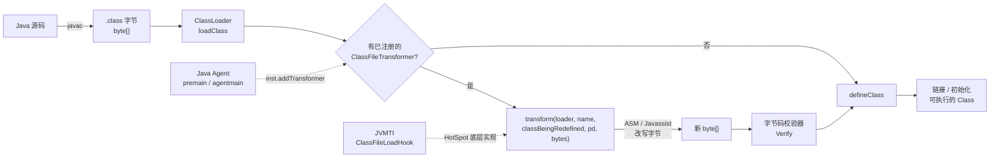
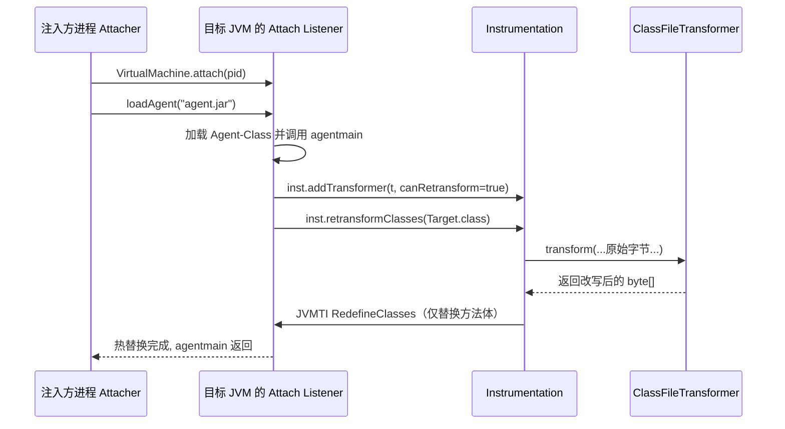
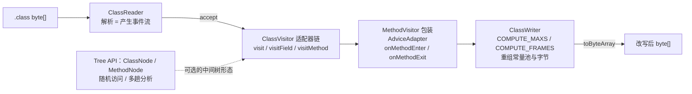
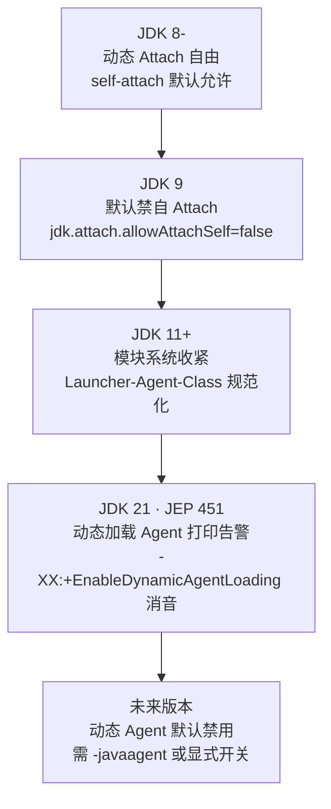

# 托管代码与字节码逆向（5）· Java字节码操纵：ASM与Javassist
> [!abstract] TL;DR
> - 字节码操纵是「可写的逆向」：直接在 `.class` 字节层读改写，与上一篇「反编译只读」正相反。ASM 走 Visitor 事件流、贴着字节、快而低层；Javassist 提供源码级 API、内嵌小编译器、易用但受限；ByteBuddy 在 ASM 之上做类型安全 DSL，cglib 是老式子类代理。
> - 三个动作贯穿全篇：加载期**插桩**（`ClassFileTransformer` 在 `defineClass` 前改字节）、结构**注入**（加字段/方法/接口/try-catch）、**运行时改写**（`Instrumentation.retransform/redefine` 热替换已加载类，且只能换方法体）。三者恰好落在编译期→加载期→运行期这条时间轴上。
> - 承载机制是 `java.lang.instrument`：`premain` 静态 `-javaagent` 与 `agentmain` 动态 Attach API 两条入口，底层等价于 JVMTI 的 `ClassFileLoadHook` 与 `RedefineClasses`。
> - 最硬的坑是**栈映射帧 StackMapTable**：Java 7+ 类型检查式校验器强制要求它，ASM 的 `COMPUTE_FRAMES` 要在合并点求两类型的公共父类，从而触发类加载，踩中 ClassLoader 陷阱是 Agent 最常见的线上崩因。
> - 逆向视角：Agent 是「运行时的手术刀」——dump 自定义 ClassLoader 解密后的真实字节、hook 关键判定、trace 调用链、用 Remapper 还原混淆名。Arthas / BTrace / Byteman / ByteBuddy / Jacoco 全建立在这套机制之上。
> - 安全面：Attach 是同用户注入攻击面，JDK 9 默认禁自 Attach、JDK 21（JEP 451）对动态 Agent 加载打印告警并预告未来默认禁用；RASP 则是同一机制的防守用法——同一把刀，用途决定攻防。

## 概述与定位

本篇是《托管代码与字节码逆向》从「读」转向「写」的转折点。前一篇 [[04.Java反编译：CFR与Procyon与JADX]] 讲的是把 `.class` 尽量还原成可读 Java 源码——那是**单向的、有损的、只读的**恢复；本篇讲的字节码操纵（bytecode manipulation）则是**可写的**：不追求把字节还原成源码，而是把 `.class` 的字节序列当成可编辑的中间表示，往里插指令、加成员、换方法体，然后交回 JVM 执行。逆向工程里，反编译回答「它在做什么」，字节码操纵回答「我能不能改变它做什么、或让它把秘密吐出来」。

字节码操纵的操作对象是 [[02.JVM架构与class文件格式]] 定义的 class 文件、语义是 [[03.JVM字节码指令集详解]] 定义的栈式指令。本篇不重复这两者，只在需要时引用；焦点是**两套主流改写引擎与一套运行时投递基础设施**：

- **ASM**（OW2 出品）：贴着字节的低层库，核心是 Visitor（访问者）事件流。它不在内存里建整棵树，而是一边解析一边发事件、一边重写，一趟过、内存小、速度快。正因为快而通用，它是几乎所有上层框架的引擎——cglib、ByteBuddy、Groovy/Kotlin 编译器、Gradle、Jacoco、Spring 的 CGLIB 代理内部都是 ASM。
- **Javassist**（千叶滋 Shigeru Chiba 出品）：高层库，核心是一个**内嵌的小型 Java 编译器**。你写近似 Java 的源码字符串（`insertBefore("...")`），它替你编译成字节码、拼接进去，全程不碰操作数栈。代价是这个编译器只支持 Java 语言的一个子集，且慢于 ASM。
- **ByteBuddy**：架在 ASM 之上的类型安全 DSL，用流式 API 描述「拦截某方法、委派到某处」，Mockito、Hibernate、Jackson 都用它；**cglib** 是更老的方案，用 ASM 动态生成目标类的子类来做代理，无法代理 `final` 类/方法，现已基本被 ByteBuddy 取代。

贯穿全篇的三个动词，正是本篇的种子要点，它们落在一条时间轴上：

| 动作 | 时机 | 手段 | 约束 |
|---|---|---|---|
| **插桩** instrumentation | 编译期 / 加载期 | 在方法入口、出口、分支点插入探针，不改语义（计时、覆盖率、trace） | 必须栈平衡、保持可校验 |
| **注入** injection | 编译期 / 加载期 | 加字段、加方法、加接口、把方法体包进 try-finally | 加载期可自由改结构 |
| **运行时改写** runtime rewriting | 运行期 | `retransform`/`redefine` 热替换**已加载**类 | 只能换方法体，结构冻结 |

「插桩」是加观察点而不改行为，「注入」是加新的结构性成员，「运行时改写」是对活着的类做热替换——三者难度递增、约束递紧，理解它们的边界是本篇的主线。

与原生世界对照能加深理解。原生动态插桩（Frida/Pin/DynamoRIO，见 [[48.动态插桩与模拟执行引擎/02.DBI原理：代码缓存与trace]]）改写的是机器指令、在代码缓存里翻译执行；而 Java 字节码操纵改写的是**JIT 之前的真理源**——你改的是 class 的规范表示，改完还要过 JVM 校验器，之后 JIT 才把它编成机器码。这比原生 DBI 更「干净」（持久、被验证、语义清晰），但也更受约束（必须合法、必须可校验、运行时改写不能变结构）。原生 ABI 层如何对照见 [[23.C_C++运行时与ABI/01.运行时与ABI概览]]；再往横向看，Android 的 DEX 也有一套等价的字节码改写生态（[[35.Android逆向与运行时/03.DEX文件格式]]），WASM 同理（[[40.WASM与虚拟化壳逆向/02.WASM指令集与执行模型]]）——「托管字节码可被程序化改写」是所有虚拟机语言共享的性质。

## 原理与机制

### 拦截点：类加载管线里的那一刀

要改写字节，得先知道在哪一刻能插手。JVM 的类加载分三大阶段：**加载（Loading）→ 链接（Linking：验证 Verify、准备 Prepare、解析 Resolve）→ 初始化（Initialization）**。加载阶段的产物是把某个来源（jar、网络、内存）的字节流交给 `ClassLoader.defineClass(byte[])` 变成 `Class` 对象。字节码操纵的拦截点就卡在 `defineClass` 之前：JVM 把原始 `byte[]` 先递给所有已注册的转换器，转换器返回新 `byte[]`，JVM 再拿新字节去定义类。

关键结论：**无论你怎么改，产物仍要过验证器（Verify）**。你不能塞进类型不安全或栈不平衡的指令指望它跑起来——校验器会抛 `VerifyError`。这既是安全网也是纪律：字节码操纵不是「随便写机器码」，而是「在合法字节码的语法与类型规则内改写」。



### java.lang.instrument：投递字节改写的官方通道

`java.lang.instrument` 是 JDK 提供的、把转换器接入类加载管线的标准 API，核心是两个接口：`Instrumentation`（能力句柄）和 `ClassFileTransformer`（你的改写逻辑）。你拿到 `Instrumentation` 的唯一合法途径是「成为一个 Java Agent」。Agent 有两个入口：

- **静态入口 `premain`**：`public static void premain(String args, Instrumentation inst)`，打包成 jar，`MANIFEST.MF` 里写 `Premain-Class`，用 `-javaagent:agent.jar=opts` 启动。它在 `main()` **之前**运行，适合「进程一起来就全程插桩」。
- **动态入口 `agentmain`**：`public static void agentmain(String args, Instrumentation inst)`，`MANIFEST.MF` 里写 `Agent-Class`，通过 Attach API 注入到**已经在运行**的 JVM，适合「事后诊断一个活着的进程」——这正是 Arthas 的工作方式。

`MANIFEST.MF` 里几个决定 Agent 能力的清单属性：

```
Premain-Class:              静态入口类（-javaagent 用）
Agent-Class:                动态入口类（Attach 用）
Can-Redefine-Classes:       true 才允许 redefineClasses
Can-Retransform-Classes:    true 才允许 retransformClasses
Can-Set-Native-Method-Prefix: true 才允许包裹 native 方法
Boot-Class-Path:            追加到引导类路径（改写 java.* 时常需要）
Launcher-Agent-Class:       JDK 9+，随主 jar 免 -javaagent 先于 main 运行
```

`ClassFileTransformer` 只有一个方法：`byte[] transform(ClassLoader loader, String className, Class<?> classBeingRedefined, ProtectionDomain pd, byte[] classfileBuffer)`。**返回 `null` 表示不改**（这一点很重要：想「只旁路观察不改写」就返回 null）；返回新数组则用新字节定义/重定义类。`classBeingRedefined` 在首次加载时为 `null`、在 retransform/redefine 时为目标类——据此可区分「首次插桩」与「重复改写」。用 `inst.addTransformer(t, canRetransform)` 注册。

### 静态 vs 动态：Attach API 如何把 Agent 塞进活进程

动态注入靠 Attach API：`com.sun.tools.attach.VirtualMachine.attach(pid).loadAgent("agent.jar", opts)`。它的底层不是魔法：目标 JVM 内有一个「Attach Listener」机制（Linux 上经由约定的 UNIX 域套接字/信号触发），注入方进程发起连接后，目标 JVM 起一个 Attach Listener 线程、加载你的 agent jar、回调 `agentmain`。命令行工具 `jcmd`、`jattach` 是同一机制的封装。**注意：Attach 要求注入方与目标同一操作系统用户**——这既是它的便利，也是它的安全边界（后文详述）。



### retransform 与 redefine：运行时改写的两条路与那道铁律

对**已加载**的类做运行时改写有两个 API，区别在「新字节从哪来」：

- `redefineClasses(ClassDefinition...)`：你**直接提供**新字节，JVM 拿去替换。适合「我已经算好了新版本」。
- `retransformClasses(Class...)`：JVM **重新拿出该类的原始字节**，再喂给所有「支持 retransform」的转换器走一遍（此时 `classBeingRedefined != null`），用转换链的输出替换。适合「让我的转换器对已经加载的类补插桩」。

两者共享一条**铁律**：新类必须与旧类**同构（schema 不变）**——不能增删方法或字段、不能改方法签名、不能改继承关系、不能改成员的修饰符，**只能改方法体、常量池与部分属性**。这不是库的限制，而是 HotSpot 的 `RedefineClasses` 规范：已经加载的类可能有正在栈上执行的帧、有已解析的字段偏移、有子类继承布局，动结构会让这些全部失效。想突破这条铁律，只能上 **DCEVM / HotSwapAgent**——它们直接给 JVM 打补丁，允许开发期热加载时增删成员；但那是修改过的 JVM，不适合生产。**这条铁律直接决定了「注入」与「运行时改写」的分界**：加字段加方法只能在类首次加载时做（transform 首次调用），活着的类只能换方法体。

### 底层就是 JVMTI

`java.lang.instrument` 是纯 Java 门面，HotSpot 用 **JVMTI**（JVM Tool Interface，native C 接口）实现它：`ClassFileLoadHook` 事件对应字节拦截，`RedefineClasses`/`RetransformClasses` 对应运行时改写。一个 native JVMTI Agent（`-agentlib:`，`Agent_OnLoad` 入口）能做同样的字节改写，还能做纯 Java Agent 做不到的事——堆遍历、方法进入/退出事件、断点、监控锁竞争。取舍很清楚：**Java 字节码转换器可移植、纯 Java、跨 JVM**；**JVMTI native Agent 更强大但依赖平台、随 JVM 版本更脆**。逆向脱壳里两者常配合：Java 层 transform 拿常规类，native JVMTI 拿那些绕过 Java 层的加载路径（见 [[15.托管代码脱壳与运行时dump]]）。

## 字节码改写与栈帧计算详解

这一段深入「改字节」本身——ASM 的事件模型、注入如何维持字节码的合法性、以及那个让无数 Agent 崩在生产的 StackMapTable。

### ASM 的核心对象与访问顺序

ASM 把 class 结构抽象成一串**访问事件**，四个主角：

- `ClassReader`：解析器。`accept(visitor, flags)` 把字节流「播放」成事件序列。
- `ClassVisitor`：类级访问者。按**固定顺序**接收事件：`visit`（类头：版本/访问标志/父类/接口）→ `visitSource` → 若干 `visitAnnotation` → 若干 `visitField` → 若干 `visitMethod` → `visitEnd`。
- `MethodVisitor`：方法级访问者。`visitMethod` 返回它，之后按代码顺序收到 `visitCode` → 一连串指令事件（`visitInsn`/`visitVarInsn`/`visitFieldInsn`/`visitMethodInsn`/`visitLdcInsn`/`visitJumpInsn`/`visitLabel`…）→ `visitMaxs` → `visitEnd`。
- `ClassWriter`：把事件重新组装成 `byte[]`（`toByteArray`）。

改写的范式是**把 Visitor 串成链**：`reader → 你的 ClassVisitor 适配器（转发大部分事件、在感兴趣处插入额外事件）→ ClassWriter`。这就是「访问者模式」的威力：你只重写关心的那几个回调，其余透明转发。



事件流（core API）之外，ASM 还有 **Tree API**：`ClassNode`/`MethodNode`/`InsnList` 把整个类物化成对象树，支持随机访问和多趟分析。什么时候用哪个？**一趟就能改完、追求性能**（大多数插桩、生产 Agent）用事件流；**需要前后翻看、做数据流分析、复杂控制流重排**（反混淆、优化）用 Tree API。代价是 Tree API 吃内存、慢，因为它把一切都建成了对象。

### 注入时必须守住的不变量：操作数栈与局部变量

JVM 是栈式机（[[03.JVM字节码指令集详解]]）。往方法里插指令不是「插一行文本」那么简单，你插入的序列必须满足两个不变量，否则校验器直接拒绝：

1. **栈平衡**：在每个控制流汇合点，操作数栈的深度与类型必须一致。你临时压了值就要消费掉或存起来，不能让不同分支到达同一点时栈高度不同。
2. **不破坏活跃局部变量**：方法的参数和局部变量占用编号槽位（slot），你要用临时变量（比如存计时起点），**不能覆盖正在用的槽**，得申请新槽。ASM Commons 的 `LocalVariablesSorter` / `AdviceAdapter.newLocal(Type)` 就是为此——它帮你分配空闲槽并自动重编号后续变量。

槽位和栈深的上界记在 `Code` 属性的 `max_locals`/`max_stack` 里。手算这两个数极易错，所以 ASM 提供 `new ClassWriter(ClassWriter.COMPUTE_MAXS)` 自动重算。

### StackMapTable：Java 7+ 校验器的强制契约，也是最大的坑

这是本篇技术含量最高的一节。`Code` 属性内除了字节码，还挂着若干子属性，其中 **StackMapTable（栈映射帧）** 是运行时改写的命门：

```
Code_attribute {
    u2 max_stack;          // 操作数栈深度上界  ← COMPUTE_MAXS 计算
    u2 max_locals;         // 局部变量槽数上界  ← COMPUTE_MAXS 计算
    u4 code_length;  u1 code[];              // 字节码本体（插桩在此增删指令）
    exception_table[];     // try-catch 表（注入 try-finally 时在此加项）
    attributes {
        LineNumberTable        // 行号→pc（保留它，异常栈才可读）
        LocalVariableTable     // 局部变量名/作用域（保留它，调试才有名字）
        StackMapTable          // 栈映射帧 ← 改控制流后必须同步重算
    }
}
```

**为什么会有 StackMapTable？** Java 6 之前，字节码校验器靠**迭代数据流分析**推断每个位置的类型——反复扫描直到收敛，慢且实现复杂。Java 6 引入、Java 7（class 版本 51）起**强制**的「类型检查式（type-checking / split）校验器」把这份推断成本前移到**编译期**：编译器在每个跳转目标处预先写好一份「此处局部变量与操作数栈各槽是什么类型」的快照（一个 StackMapFrame），校验器只需**线性一趟核对**，不再迭代推断。于是每个分支目标都必须有一份帧。

**这对改写意味着什么？** 你一旦改动控制流——加了新分支、插了 try-catch、挪了跳转——原来的 StackMapTable 就与字节码对不上了，类会以 `java.lang.VerifyError: Expecting a stackmap frame ...` 拒绝加载。版本细节要精确：class 版本 50（Java 6）时 JVM 遇到帧缺失/错误还能**回退**到老校验器；版本 51（Java 7）起**没有回退**，类型检查是唯一路径，帧必须正确。所以现代目标（几乎都是 51+）容不得帧错误。

**ASM 怎么办？** `new ClassWriter(ClassWriter.COMPUTE_FRAMES)` 让 ASM **完全重算**所有帧。但重算有代价，也有那个著名陷阱：在两条分支汇合、同一槽位一边是类型 A、一边是类型 B 时，合并后的类型是「A 与 B 的最近公共父类」。ASM 默认用 `ClassWriter.getCommonSuperClass(a, b)` 求它，而该方法默认实现是**用 ClassWriter 的类加载器 `Class.forName` 把 A、B 都加载进来**再算继承关系。问题来了：**在 Agent 里做插桩时，被改的类往往属于另一个 ClassLoader**（应用类加载器、OSGi/Tomcat 的隔离加载器、插件加载器），用 Agent 自己的加载器根本加载不到 A/B，于是在 `COMPUTE_FRAMES` 深处抛 `ClassNotFoundException`/`TypeNotPresentException`，甚至因为要加载正在被改写的类而触发 `ClassCircularityError`。**这是生产 Agent 头号崩因。** 正确姿势是**重写 `getCommonSuperClass`**，改用**目标类的加载器**去解析，或干脆「不加载」——只读字节头里的父类链来推断层级（若无法确定则退化返回 `java/lang/Object`，代价是帧稍宽松但仍合法）。

一个关键优化：`new ClassWriter(classReader, flags)` 传入原 reader，Writer 会**逐字复制**未改动方法的字节和常量池，既快又避免为没碰过的方法重算帧。但要小心——若你实际改了某方法的帧还走复制路径，就会写出过期的帧。配套的 `ClassReader` 标志也要懂：`SKIP_FRAMES`（丢弃原帧、交给 Writer 重算）、`EXPAND_FRAMES`（把压缩帧展开成 `visitFrame` 事件便于分析）、`SKIP_DEBUG`（跳过行号/局部变量表，省时但丢调试信息）、`SKIP_CODE`。

### 用 AdviceAdapter 解决「每个出口都要收尾」

插桩最经典的需求是给方法计时：入口记 `nanoTime`、出口算差值。难点在**出口不止一个**——`return`/`ireturn`/`areturn` 等每种返回、以及 `athrow` 异常抛出，都是出口；漏掉任何一个，计时或 trace 就不完整。手写要在每条返回指令前插代码、还要用 try-catch 包住覆盖异常路径，繁琐易错。ASM Commons 的 **`AdviceAdapter`** 正是为此：它提供 `onMethodEnter()` 和 `onMethodExit(int opcode)` 两个回调，**在每个返回指令前、以及异常退出前**都会触发 `onMethodExit`（`opcode == ATHROW` 即异常退出），并且在构造器里能正确识别 `super()` 调用之后才算「方法真正开始」（`<init>` 的插桩难点）。这把「所有出口」的复杂度一次性收敛掉。

ASM Commons 里其他常用适配器，各自解决一类问题：`GeneratorAdapter`（带类型的指令生成助手，少写常量）、`Remapper`/`ClassRemapper`（批量重命名类/方法/字段——**反混淆的机械核心**，见 [[06.Java混淆与反混淆]]）、`SerialVersionUIDAdder`（补 serialVersionUID）、`AnalyzerAdapter`（实时提供当前帧）、`Analyzer` + `BasicInterpreter`/`SourceInterpreter`（做数据流帧分析，反混淆/污点分析用）。

下面是一个用 `AdviceAdapter` 计时的骨架，但请注意——**删掉这段代码，上面的散文已经把机制讲清了**（这是本篇对每节的自检标准）：

```java
class TimingAdapter extends AdviceAdapter {
    private int tsSlot;   // 存放计时起点的新局部槽
    TimingAdapter(MethodVisitor mv, int access, String name, String desc) {
        super(Opcodes.ASM9, mv, access, name, desc);
    }
    @Override protected void onMethodEnter() {
        invokeStatic(Type.getType(System.class), Method.getMethod("long nanoTime()"));
        tsSlot = newLocal(Type.LONG_TYPE);   // 申请新槽，绝不覆盖参数
        storeLocal(tsSlot);
    }
    @Override protected void onMethodExit(int opcode) {
        // 每个 return 前、以及 athrow（opcode==ATHROW）前都会到这里
        loadLocal(tsSlot);
        invokeStatic(Type.getType(System.class), Method.getMethod("long nanoTime()"));
        // ...算差值并上报（此处省略）...
    }
}
```

### 注入：加字段、加方法、包 try-finally

「注入」是往类里加**结构性成员**，只能在**首次加载**时做（受前述铁律约束）：

- **加字段**：在 `ClassVisitor.visitEnd()` 里调 `super.visitField(...)` 吐出一个新 `FieldVisitor`。
- **加方法**：在 `visitEnd()` 里调 `super.visitMethod(...)` 生成一个完整方法体（`visitCode`→指令→`visitMaxs`→`visitEnd`）。
- **加接口**：在 `visit(...)` 事件里改写传入的 `interfaces` 数组——让目标类「凭空实现」某个标记接口，常用于给对象打标（例如让被代理对象实现一个 `Proxied` 接口便于识别）。
- **包 try-finally**：`visitTryCatchBlock` 登记保护区，配一个「捕获→执行收尾→`athrow` 重抛」的处理器；这在异常表里加一项，让收尾逻辑覆盖异常路径。

### Javassist：源码级 API 与它的 `$` 魔法

Javassist 把抽象层拉到源码级。核心对象：`ClassPool`（类型注册表/类路径）、`CtClass`（可变的类）、`CtMethod`/`CtConstructor`/`CtField`。常用 API：`insertBefore(src)`、`insertAfter(src)`、`insertAt(line, src)`、`addCatch(src, exType)`、`setBody(src)`（整体替换方法体）、`instrument(ExprEditor)`（改写调用点）、`addField/addMethod/addInterface`、最后 `toBytecode()`/`toClass()`/`writeFile()` 出字节。

它的「甜」全在一套 `$` 特殊变量上——你写近似 Java 的字符串，编译器把这些符号翻成对栈和局部变量的正确操作，**你永远不碰栈**：

| 变量 | 含义与可用位置 |
|---|---|
| `$0` | `this`（静态方法中无意义）；在 ExprEditor 的 `MethodCall` 中是调用目标对象 |
| `$1, $2, ...` | 第 1、2… 个方法实参 |
| `$args` | `Object[]` 形式的全部实参（基本类型自动装箱） |
| `$$` | 展开的实参列表，`m($$)` 等价 `m($1,$2,...)`——转发调用神器 |
| `$_` | 方法返回值，**仅** `insertAfter` / `ExprEditor.replace` 中可写 |
| `$r` | 返回类型，用于 `($r)` 强制转型（对 void 有特殊处理） |
| `$w` | 包装类型，用于装箱转换 |
| `$sig` | `Class[]`，形参类型数组 |
| `$type` | `Class`，返回类型（ExprEditor 中为目标表达式的静态类型） |
| `$class` | `Class`，当前被编辑的类 |
| `$e` | `addCatch` 中捕获到的异常对象 |
| `$proceed` | ExprEditor 中「执行原本的调用/字段访问」的占位方法 |
| `$cflow(name)` | 控制流深度（需先 `useCflow` 定义），用于避免递归插桩 |

要给 `isValid()` 加 hook 并强制返回 true，Javassist 只需写「像 Java 的话」：

```java
ClassPool pool = ClassPool.getDefault();
pool.insertClassPath(new LoaderClassPath(targetLoader)); // 关键：让引用类型可解析
CtClass cc = pool.get("com.target.License");
CtMethod m = cc.getDeclaredMethod("isValid");
m.insertBefore("System.out.println(\"[hook] args=\" + java.util.Arrays.toString($args));");
m.insertAfter("System.out.println(\"[hook] ret=\" + $_);");   // $_ 是返回值
m.setBody("{ return true; }");   // 直接改写方法体：强制通过校验
byte[] patched = cc.toBytecode();
cc.defrost();                    // 若还要再改，先解冻（见下）
```

**ExprEditor：改写调用点。** 覆写 `edit(MethodCall m)` 并 `m.replace("{ $_ = $proceed($$); }")`，可以精准包裹或重定向**特定调用点**——例如把每一处 `Runtime.exec(...)` 前后加审计。同样支持 `FieldAccess`（字段读写）、`NewExpr`（对象创建）、`Cast`、`Instanceof`、`Handler`（异常处理器）。这让 Javassist 能做「调用级」的细粒度改写，而非只在方法边界。

**Javassist 的边界与陷阱**（deep 视角必须讲清）：

- **冻结（frozen）**：`CtClass` 一旦 `toBytecode()`/`toClass()`/`writeFile()` 输出过就被冻结，再改会抛异常，需先 `defrost()`。
- **剪枝（pruning）**：`ClassPool` 为省内存可能 `prune()` 掉 `CtClass` 的方法体，之后无法再序列化；长驻 Agent 里要 `stopPruning(true)` 或用完 `detach()` 移出池。
- **编译器只懂 Java 子集**：泛型只到擦除层面、对 lambda / `invokedynamic` 支持弱、注解含数组值等场景易出错、不认 `try-with-resources` 等语法糖。碰到这些要么退回 ASM，要么手写等价的老式写法。
- **类路径解析**：`ClassPool.getDefault()` 用的是上下文类路径，在 Agent 里被改类引用的类型常解析不到（`NotFoundException`），必须 `pool.insertClassPath(new LoaderClassPath(targetLoader))` 把目标加载器接进来。
- `insertAfter(src, true)` 的第二参数 `asFinally=true` 让插入块**在正常与异常退出都执行**——这是 Javassist 版的「AdviceAdapter 出口覆盖」。

### 四把刀的横向对比

| 维度 | ASM | Javassist | ByteBuddy | cglib |
|---|---|---|---|---|
| 抽象层次 | 最低（贴字节/事件） | 高（源码字符串） | 高（类型安全 DSL） | 中（子类生成） |
| 速度/内存 | 最快最省 | 较慢（要编译） | 快（底层 ASM） | 较快 |
| 学习曲线 | 陡（要懂栈/帧） | 平缓 | 平缓 | 中 |
| 就地改写已有类 | 强 | 强 | 强（AgentBuilder） | 不能（只生成子类） |
| 代表使用者 | 几乎一切引擎 | JBoss/老 ORM | Mockito/Hibernate | 老 Spring AOP |
| 典型场景 | 极致性能插桩、反混淆 | 快速原型、简单 hook | 现代 Agent、Mock | 遗留代理 |

一句话选型：**要极致控制与性能、要做反混淆/复杂改写 → ASM；要快速写个 hook 原型、不想碰栈 → Javassist；要写干净的生产级 Agent、类型安全 → ByteBuddy；维护老系统才会遇到 cglib。**

## 工具视角与实战

### 一个能 dump 又能改的最小 Agent

逆向里最实用的 Agent 往往先**只 dump 不改**——因为很多壳/加固用自定义 `ClassLoader` 在内存里解密类，真实字节**从不落盘**，但它一定会流经 `transform`。于是「返回 null、顺手把入参 `bytes` 写盘」就白嫖到了解密后的字节（完整脱壳流程见 [[15.托管代码脱壳与运行时dump]]）：

```java
// MANIFEST.MF: Premain-Class / Agent-Class: com.re.Agent
//              Can-Retransform-Classes: true
public class Agent {
    public static void premain(String a, Instrumentation inst) { install(inst); }
    public static void agentmain(String a, Instrumentation inst) throws Exception {
        install(inst);
        for (Class<?> c : inst.getAllLoadedClasses())              // 对已加载类补拿
            if (c.getName().startsWith("com.target") && inst.isModifiableClass(c))
                inst.retransformClasses(c);
    }
    static void install(Instrumentation inst) {
        inst.addTransformer(new DumpTransformer(), /*canRetransform*/ true);
    }
}
class DumpTransformer implements ClassFileTransformer {
    public byte[] transform(ClassLoader l, String name, Class<?> being,
                            ProtectionDomain pd, byte[] bytes) {
        if (name != null && name.startsWith("com/target")) {
            try { Files.write(Paths.get("/tmp/dump/" + name.replace('/', '.') + ".class"), bytes); }
            catch (IOException ignore) {}
        }
        return null;   // 返回 null = 不改写，纯旁路 dump
    }
}
```

这段同时演示了「静态全程插桩（premain）」与「动态事后补拿（agentmain + retransform + getAllLoadedClasses）」两条路，以及 `isModifiableClass` 的守门作用。

### 建立在这套机制上的工具生态

理解了原理，市面工具就都是「同一套机制的不同封装」：

- **Arthas**（阿里）：活体诊断的头牌，Attach + ASM。`sc`/`sm` 搜已加载的类/方法；`jad` **反编译内存里的真实字节**（对付运行时生成/轻混淆类，因为它看的是内存态而非磁盘）；`watch`/`trace`/`stack`/`tt` 观测入参/返回/异常/调用链耗时，`tt`（time-tunnel 时空隧道）能录制调用、事后回放甚至重新触发；`retransform` 用你本地重编译的 `.class` 热替换已加载类（底层就是 `retransformClasses`）；`dump` 导出已加载类，`classloader` 看加载器树。逆向一个活着的 JVM，Arthas 通常是第一站。
- **BTrace**：安全受限的 trace 脚本——脚本被校验器限制（禁循环、禁分配、禁起线程），编译后经 Agent 注入，可在生产环境低风险追踪。
- **Byteman**（JBoss）：规则语言（`RULE ... AT ENTRY ... IF ... DO ...`）驱动注入，擅长**故障注入**与集成测试（在指定点抛异常、延时）。
- **ByteBuddy**：类型安全的现代代码生成，`AgentBuilder` API 让写生产 Agent 很干净；Mockito 默认用它造 mock。
- **Jacoco**：覆盖率工具，用 on-the-fly Agent 在分支点注入 `boolean[]` 探针——插桩的教科书用例。
- **Mockito / Spring AOP**：用子类/代理拦截方法。**注意本质差异**：代理是「生成子类覆盖方法」，无法覆盖 `final`，且被代理的是新对象；这与「就地 retransform 原类」不同——后者改的是原类本身。
- **SkyWalking / 各类 APM Agent**：在框架入口（Servlet、Dubbo、JDBC）注入埋点织出调用链 span，生产可观测性的支柱。

### 反混淆：Remapper 是机械核心

字节码操纵也是反混淆的引擎。混淆器（[[06.Java混淆与反混淆]]）用 ASM 把符号改成 `a/b/c`；反混淆则反过来——喂一张「旧名→新名」映射给 `ClassRemapper`，它遍历所有引用（继承、方法调用、字段访问、描述符、签名）逐一改名，输出「重命名后」的类。难点不在改名机械本身，而在**怎么得到那张映射表**（靠特征、靠成对 APK 差分、靠 LLM 猜名），那是 ch06 的主题；本篇只强调：**改名这一步是纯粹的字节码操纵，ASM Remapper 就是那台机器。**

### Arthas 常用命令速查

```bash
jad com.target.License isValid                              # 反编译内存中真实字节
watch com.target.License isValid '{params,returnObj,throwExp}' -x 2   # 观测入参/返回/异常
trace com.target.License isValid                           # 调用链耗时分解
tt -t com.target.License isValid                          # 时空隧道：录制并可回放/重入
retransform /tmp/License.class                            # 用本地 .class 热替换已加载类
```

## 安全性与正确使用

### 机制的安全影响：Attach 是同用户注入攻击面

字节码操纵的能力有多大，误用的风险就有多大。**任何与目标 JVM 同一操作系统用户的进程，都能 Attach 进去加载任意 Agent**——那等于在你的应用进程内获得完整代码执行：读内存里的密钥、篡改鉴权判定、关掉 SecurityManager、把日志里的敏感字段偷偷外传。这是**设计使然的同用户能力**，但它的含义是：**JVM 进程隔离不是防同用户恶意代码的安全边界**。服务端 Java 恶意软件常借 Agent/JVMTI 落地持久化与数据窃取；供应链上，一个被投毒的 `-javaagent`（塞进容器镜像或构建插件）就能污染整条流水线。

**校验器是安全网，但不是防 Agent 的墙。** 你注入的字节仍要过校验（塞不进类型不安全的代码），`redefine` 的字节同样被校验——但**发什么字节是 Agent 自己决定的**，它完全可以合法地改写业务逻辑、把 `if (licensed)` 改成恒真。校验器保证「字节合法」，不保证「Agent 善意」。

### JDK 的收紧时间线：默认走向完整性

正因为 Attach 太强，JDK 逐步收紧动态 Agent 加载，方向是「默认完整性（integrity by default）」：



务实含义：过去一些库（部分 Mock/APM）靠「进程给自己 Attach」偷偷装 Agent，JDK 9 起这条默认被堵（`jdk.attach.allowAttachSelf=false`），JDK 21（JEP 451）起动态加载会打印告警、需 `-XX:+EnableDynamicAgentLoading` 消音，未来版本计划默认禁用、逼你用 `-javaagent` 显式声明。逆向工程师要记住：**你分析的目标 JVM 版本，直接决定动态注入是否顺畅**；越新的 JDK，越需要在启动参数里预留 `-XX:+EnableDynamicAgentLoading` 或干脆改用 `-javaagent`。

### 正确使用与加固边界

把这套机制用对、用稳，有几条硬性纪律：

- **幂等与可重入**：支持 retransform 的转换器会被**再次调用**（拿原始字节、`classBeingRedefined != null`），必须幂等、不能重复插桩、必须**避开改写自己的辅助类**（否则无限递归或 `ClassCircularityError`）。
- **别改你所依赖的东西**：改写 `java.lang.*`/`String`/自己日志路径上的类，极易死锁或递归；引导阶段（premain 之前）就加载的核心类改不动；给 `java.*` 注入的辅助类必须放上**引导类路径**（`appendToBootstrapClassLoaderSearch`），否则引导加载的代码在运行时找不到它而 `NoClassDefFoundError`。
- **护住帧与调试信息**：帧要正确重算（当心 `getCommonSuperClass` 那个加载器陷阱），否则把 `VerifyError` 送上生产；尽量保留 `LineNumberTable`，不然异常栈的行号全废、事后排障抓瞎。
- **认清结构冻结**：永远别指望 `redefine`/`retransform` 能加字段加方法；要热更新就设计成「只换方法体」，`DCEVM` 只在开发期用。
- **版本与操作码守卫**：ASM 版本要匹配目标 class 文件版本（records、sealed、lambda 的 `invokedynamic`）；发对 `Opcodes.Vxx`，用的 ASM 发行版不够新会抛 `Unsupported class file major version`。
- **观测者效应**：插桩本身改变时序与性能（海森堡效应），APM/覆盖率都带开销，要量化并接受这份不确定性。

### 防守用法：RASP 与「反注入检测」的限度

同一把刀反过来就是防护。**RASP**（Runtime Application Self-Protection）正是用这套 transform 钩子，在应用内部织入安全传感器——拦 SQL 注入、危险反序列化、可疑 `Runtime.exec`。它合法、强大，但前提是 **RASP 自身可信且被完整性保护**，否则就成了最大的后门。

至于**检测「自己是否被注入」**：应用可查 `RuntimeMXBean.getInputArguments()` 里有没有 `-javaagent`、扫已加载类找已知 Agent 类名。但要清醒——**这只是减速带，不是墙**：经 Attach 动态加载的 Agent 痕迹更少，还能反过来 hook 你用来检测的那些 API 让它撒谎。真正的完整性靠**签名代码 + 远程证明 + 最小权限用户运行**，而不是靠「检测 Agent」的小聪明。逆向与加固都要认清这条不对称：注入方只要同用户就赢面很大，防守方的检测终究可被绕过。

最后是合规底线：**只对你拥有或获授权的系统做插桩与改写**。字节码操纵是研究、诊断、加固的利器，也是攻击手段，用途由人决定。

## 小结

1. **本篇是「读」到「写」的转折**：反编译（ch04）恢复可读源码，字节码操纵直接编辑 `.class` 字节并交回 JVM 执行——不追求源码，追求干预。
2. **两套引擎 + 一套投递**：ASM（低层、Visitor 事件流、快，几乎一切框架的引擎）vs Javassist（高层、内嵌编译器、`$` 魔法、易用受限）；ByteBuddy/cglib 是更高层封装；`java.lang.instrument`（Agent + Attach）是把改写接入类加载的官方通道，底层是 JVMTI。
3. **插桩 / 注入 / 运行时改写落在时间轴上**：加载期可自由插桩与注入结构；对活着的类做运行时改写受**「只能换方法体、不能动 schema」**铁律约束，这条铁律是理解全篇的分界线。
4. **StackMapTable 是命门**：Java 7+ 类型检查校验器强制帧正确；改控制流必须重算帧，`COMPUTE_FRAMES` 的 `getCommonSuperClass` 会因跨 ClassLoader 加载类而崩——重写它、用目标加载器或不加载推断，是生产 Agent 的必修课。
5. **逆向价值**：Agent 是运行时手术刀——`transform` 返回 null 顺手 dump 解密字节、`AdviceAdapter` 覆盖所有出口做 trace、`Remapper` 机械改名做反混淆；Arthas 是活体诊断首站。
6. **安全姿态**：Attach 是同用户注入攻击面，JDK 9/21 逐步默认收紧（JEP 451）；校验器保证字节合法不保证 Agent 善意；RASP 是防守侧用法，「反注入检测」只是减速带。

## 相关阅读

- 系列总览与相邻篇：[[00.托管代码与字节码逆向总览]] · 上一篇 [[04.Java反编译：CFR与Procyon与JADX]] · 下一篇 [[06.Java混淆与反混淆]]
- 改写的对象与语义（本篇的地基）：[[02.JVM架构与class文件格式]]（class 与 Code 属性、StackMapTable 所在）· [[03.JVM字节码指令集详解]]（栈式指令与操作数栈）
- Agent 的顶级应用——脱壳与运行时 dump：[[15.托管代码脱壳与运行时dump]]
- 反混淆里 ASM Remapper 的深入用法：[[06.Java混淆与反混淆]]
- 原生对照：[[23.C_C++运行时与ABI/01.运行时与ABI概览]]（原生 ABI）与托管运行时的差异 · 原生动态插桩机制 [[48.动态插桩与模拟执行引擎/02.DBI原理：代码缓存与trace]]
- 同族字节码改写生态：[[35.Android逆向与运行时/03.DEX文件格式]]（DEX 改写）· [[40.WASM与虚拟化壳逆向/02.WASM指令集与执行模型]]（WASM）
- .NET 元数据寄生在 PE（后续 .NET 篇的前置）：[[13.PE文件详解/07-详解PE文件(七)：数据目录]]
- 官方与权威一手资料：ASM 官方 User Guide（Eric Bruneton，OW2，asm.ow2.io）· Javassist Tutorial（Shigeru Chiba，javassist.org）· 《The Java Virtual Machine Specification, Java SE》§4.7.4（StackMapTable）与 §4.10（Verification）· `java.lang.instrument` 包 Javadoc（`Instrumentation` / `ClassFileTransformer`）· JEP 451: Prepare to Disallow the Dynamic Loading of Agents · Byte Buddy 官方文档（bytebuddy.net）· Arthas 官方文档（arthas.aliyun.com）

[[00.托管代码与字节码逆向总览|⬆ 系列总览]] | [[04.Java反编译：CFR与Procyon与JADX|← 上一章]] | [[06.Java混淆与反混淆|→ 下一章]]