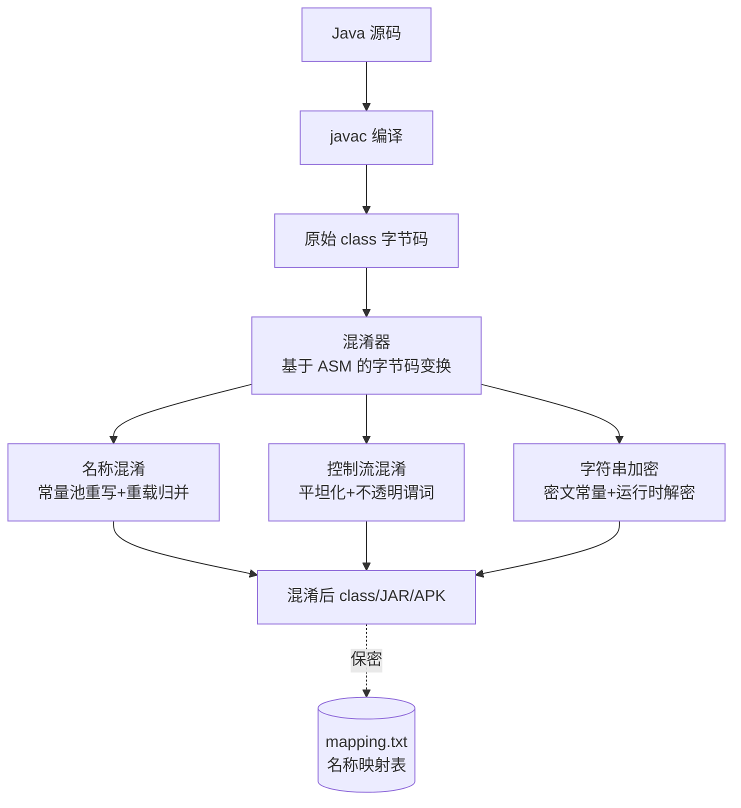
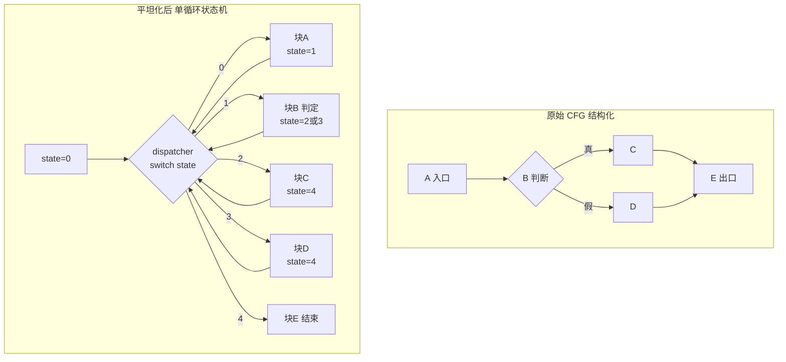
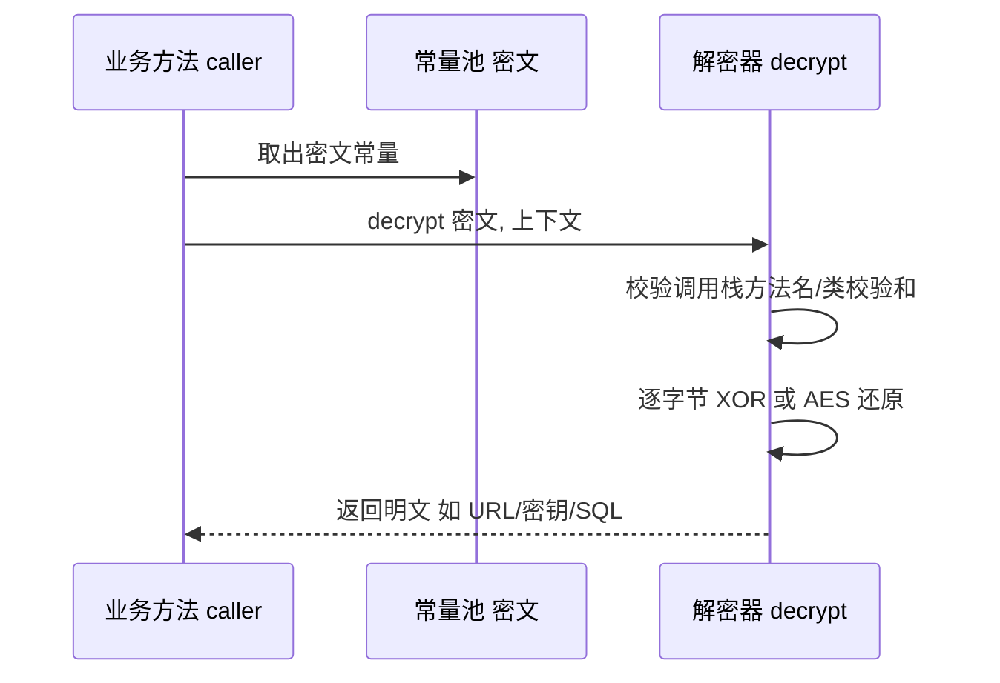
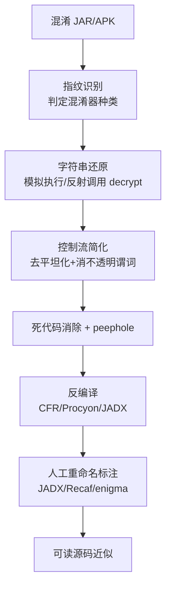

# 托管代码与字节码逆向（6）· Java混淆与反混淆

> [!abstract] TL;DR
> - 混淆是「语义保持的成本抬升」而非加密：凡运行时能跑通的，分析者理论上都能复现；Barak 等人已证明通用「黑盒混淆」在密码学意义上不可能，故它只提高门槛、不提供保密。
> - 三大支柱的可逆性根本不同：名称混淆删除的是语义信息熵，**不可逆**（只能重标注）；控制流与字符串加密是语义等价变换，**原理上可逆**（运行时必须还原→分析者也能还原）。
> - 名称混淆的底座是**常量池重写**与「重载归并 / 非法标识符」，利用字节码比 Java 源更宽松的命名空间制造反编译歧义，并靠剥离调试信息把局部变量打成 `var0/var1`。
> - 控制流混淆的核心武器是**控制流平坦化 + 不透明谓词 + 不可归约图 + 异常跳转**，把结构化 CFG 打成 `switch` 状态机，专门对抗 CFR/Procyon 的结构还原。
> - 字符串加密把字面量换成密文常量 + 运行时 `decrypt()`，反混淆靠**模拟执行 / 反射调用解密器**；栈帧派生密钥与类自校验是主要反分析陷阱。
> - 反混淆工具链（java-deobfuscator、Threadtear、Recaf、enigma）以「变换器 + 迷你 JVM 模拟 + SSA 数据流」为主；务必**先指纹识别混淆器再对症下药**。

## 概述与定位

在《托管代码与字节码逆向》系列里，本篇是「攻防的交汇点」。前面几篇给出了地基：[[02.JVM架构与class文件格式]] 讲清了 class 文件与常量池，[[03.JVM字节码指令集详解]] 讲清了 `goto/jsr/invokedynamic` 等指令语义，[[04.Java反编译：CFR与Procyon与JADX]] 讲清了反编译器如何把字节码「抬升」回 Java 源，[[05.Java字节码操纵：ASM与Javassist]] 讲清了如何用 ASM/Javassist 改写字节码。混淆器正是**用 05 的技术去破坏 04 的效果**，而反混淆则是逆向者用同样的字节码操纵能力把水搅清。理解本篇，前提是把这四篇当作前置输入。

需要先厘清三组容易混淆的概念，它们决定了整篇的边界：

- **混淆（obfuscation）≠ 加密（encryption）≠ 加壳（packing）**。加密要求持有密钥才能读，且解密后是「另一份东西」；加壳是把原始字节整体压缩/加密，运行时由自定义类加载器解密还原（整类加密、脱壳、运行时 dump 属于 [[15.托管代码脱壳与运行时dump]]，本篇不展开）。而混淆产出的仍是**能被 JVM 直接加载执行的合法 class**——它不隐藏字节，只是把字节「变得难懂」。这个区别是全篇的题眼：混淆后的程序必须自己能跑，所以它的一切「难懂」都是可被观察、可被重放的。
- **混淆是防御方视角，反混淆是逆向方视角**，二者是一场持续军备竞赛。防御方追求「让人和自动化工具都看不懂、还原不出」；逆向方追求「用最低成本把可读性拉回接近原始源码」。
- **威胁模型是经济学的**。没有任何混淆能阻止「有足够时间和算力的分析者」，混淆的全部价值在于**把破解成本抬到高于收益**——延缓外挂作者、抬高知识产权剽窃门槛、拖慢竞品抄袭。这也解释了为什么强度分级、而非「破不破得了」，才是评价混淆的正确坐标。

本篇按种子聚焦三大支柱：**名称混淆、控制流混淆、字符串加密与还原**，并给出对应的反混淆算法与工具链。这三者恰好对应学术上经典的 Collberg 分类：布局混淆（layout）、控制混淆（control）、数据混淆（data）。

## 原理与机制

### 语义保持不变式：反混淆得以存在的裂缝

所有混淆变换 `T` 都必须满足一个铁律：`T(P)` 与 `P` 在可观测行为上等价（相同输入→相同输出、相同副作用）。这条不变式是混淆的**必要条件**，也是它的**阿喀琉斯之踵**。因为「运行时能把逻辑执行出来」意味着「所需的一切信息都在制品内、且以某种可计算的方式还原」。字符串密文最终要被解密成明文才能用、平坦化的状态机最终要按真实次序跳转、被重命名的方法最终要按重命名后的符号被调用——**运行时做得到的，静态或动态分析原则上都做得到**。反混淆的所有技术，本质都是「把运行时替我做的还原，提前替我自己做一遍」。

### 强度四维：potency / resilience / cost / stealth

Collberg、Thomborson、Low 在 1997 年的经典分类里给出四个正交度量，至今是评价任何混淆手法的标准语言：

- **potency（迷惑力）**：让**人类**理解变难多少。名称混淆 potency 高——人极度依赖符号语义。
- **resilience（抗还原力）**：让**自动化反混淆器**还原变难多少。控制流平坦化 resilience 高——需要数据流/符号执行才能拆。
- **cost（代价）**：运行时性能/体积开销。字符串加密每次取用都要解密，热路径上代价可观。
- **stealth（隐蔽性）**：混淆代码与正常代码的可区分度。插入的假分支若模式过于规整，反而成为反混淆器的「指纹」。

一个成熟混淆器就是在这四维上做权衡：名称混淆几乎零 cost、极高 potency，故人人必上；控制流平坦化 cost 高、resilience 高，用在核心逻辑；字符串加密选择性地保护 URL、密钥、SQL 这类「分析锚点」。

### 理论天花板：黑盒混淆不可能

Barak 等人 2001 年证明了**通用的「虚拟黑盒混淆」不存在**——不可能有一种混淆，使得看混淆后的代码不比把程序当黑盒去调用（只能观察输入输出）泄露更多信息。这条结论把混淆从「密码学保密手段」永久踢出，钉死为「启发式的成本抬升」。它的现实推论极其重要：**任何写死在客户端的密钥/算法都可被提取**，混淆只能延缓、不能阻止。真正的秘密必须放在服务端、TEE 或做远程证明（见 [[28.虚拟化与TEE机密计算]] 一类思路）。

### 根本杠杆：字节码比 Java 源更「宽松」

为什么在字节码层做混淆比在源码层强得多？因为 **JVM 字节码的表达能力是 Java 源的超集**，混淆器在 `javac` 之后动手，专挑源语言表达不了的「暗角」：

- 方法/字段以「名称 + 描述符」为唯一标识，描述符含返回类型 → 可造出「仅返回类型不同的重载」和「同名不同类型的字段」，Java 源根本写不出来。
- 名称的合法字符集远比 Java 标识符宽 → 可用关键字、空格、Unicode、控制字符当名字。
- 有 `goto`（源里没有）→ 可造不可归约控制流。
- 栈式指令允许冗余的入栈/出栈序列 → 可塞语义无害的垃圾。

反编译器（[[04.Java反编译：CFR与Procyon与JADX]]）必须把这些「暗角」映射回一个严格更弱的语言（Java 源），这个**表达力落差本身就是混淆器的武器**。

### 校验器约束：反混淆器的抓手

混淆并非无法无天。除非关闭校验（生产环境几乎不会），产出的 class 必须通过**字节码校验器**，Java 7+ 还强制携带正确的 `StackMapTable`（类型状态在合并点必须一致）。这意味着控制流不能任意疯狂——每个基本块入口的操作数栈/局部变量类型必须自洽。这条约束**反过来给反混淆器提供了结构**：CFG 的边界是可判定的，类型是可推断的，SSA 是可构造的。防御方能玩的花样，被校验器框在一个有限的盒子里。

### 可逆性光谱：全篇最重要的分类

把三大支柱按「能否还原」排成一条谱，是理解反混淆上限的关键：

- **名称混淆——信息论上不可逆**。原始的 `validateLicense` 变成 `a`，`validateLicense` 这个字符串被**永久删除**了，制品里不含它。反混淆能做的只有「重新标注」：靠类型、字符串常量、交叉引用、库调用模式去**猜**一个有意义的名字，或者——若 `mapping.txt` 泄露——直接查表。你还原的是「一个合理的名字」，不是「原来的名字」。
- **控制流 / 字符串加密——语义上可逆**。因为运行时必须把它们还原成可执行的真实逻辑/明文，这个还原过程就写在制品里，分析者复现它即可得到等价的清晰形式。

这条谱直接决定了工程策略：对名称混淆，别指望自动还原语义，要靠人工 + 启发式重命名；对控制流和字符串，可以追求「算法级」的自动拆解。



## 三支柱变换与还原算法详解

### 一、名称混淆：常量池重写与命名空间的暗角

名称混淆的物理载体是 class 的**常量池**（结构见 [[02.JVM架构与class文件格式]]）。类名、方法名、字段名、描述符都以 `CONSTANT_Utf8` 存在，被 `CONSTANT_Class`、`CONSTANT_NameAndType` 引用。混淆器做的就是重写这些 `Utf8` 项、并同步更新所有引用点（跨类的调用点、继承链、接口实现都要一致修改，否则链接失败）。这也是为什么它必须整包处理、必须用 ASM 这类能保证一致性重写的框架。

**重命名策略**通常有三档：顺序字典（`a,b,c,...,aa,ab`，最省字节、体积友好）、真词典（用真实单词误导，如把 `decrypt` 命名为 `save`，potency 更高）、哈希/随机（防止跨版本 diff）。

真正拉开与源码差距的是两招**「利用字节码宽松命名空间」**的杀手锏：

- **重载归并（overload induction）**：JVM 里方法由「名称 + 完整描述符」区分，字段由「名称 + 描述符」区分。于是可以把尽可能多的成员挤到同一个短名下——同名不同参的方法、**仅返回类型不同的方法**、**同名不同类型的字段**。后两者 Java 源语言禁止，反编译器要么被迫改名、要么产出无法再编译的代码，人读时更是要反复核对签名。
- **非法标识符**：给成员取名为 `int`、`for`、`null`，或含空格、Unicode 同形字、不可见控制字符。字节码合法，Java 源非法。反编译器只能加引号或再改名，制造视觉混乱。

```
// 混淆后（反编译近似还原）——常量池里 Utf8 被改写成极短且冲突的名字
class a {
    private String a;                 // 字段 a : Ljava/lang/String;
    private int a;                    // 字段 a : I  —— 同名不同描述符, Java 源非法
    public boolean a(int a) { ... }   // 方法 a(I)Z
    public int a() { ... }            // 方法 a()I —— 仅返回类型不同的"重载", Java 源非法
}
```

配套动作是**剥离调试信息**：删掉 `LocalVariableTable`（局部变量名）、`LineNumberTable`（行号）、`SourceFile`（源文件名）。前者让反编译器只能自造 `var0/var1`，后者让异常栈失去行号定位；有的混淆器（如 ZKM）还会**故意打乱行号**误导栈回溯。此外是**包扁平化 / 重打包**：把深层包结构压成 `a.a.a`，抹掉模块语义。

**为什么名称混淆几乎人人必上？** 因为它 cost 近乎为零、potency 极高——人对代码的理解 80% 靠符号语义，抽掉名字等于抽掉理解的脚手架。但它有个致命前提：**凡是靠名字在运行时被查找的东西都不能改**。反射（`Class.forName`、`getMethod("...")`）、JNI（native 方法名与符号绑定，见 [[35.Android逆向与运行时/07.JNI与native层]] 一类机制）、序列化（字段名参与 `serialVersionUID` 与反序列化）、Spring/DI 按名扫描、资源按名查找——统统会被重命名打断。所以混淆配置里充满 `-keep` 规则、`@Keep` 注解。**这些「被迫保留原名」的成员，恰恰是逆向者最宝贵的锚点**：它们是唯一没被抹掉语义的入口。

**反混淆侧**：名称不可逆，只能做两件事。其一，若拿到 `mapping.txt`（ProGuard/R8 的映射文件），一键回填——所以映射文件必须像私钥一样保密，泄露即等于混淆作废：

```
com.example.LicenseManager -> a.a.a:
    java.lang.String licenseKey -> a
    boolean validateLicense(int) -> a
    void <init>() -> <init>
```

其二，无映射时做**启发式重标注**：JADX 有自动去混淆重命名（按类型、常量、调用模式生成可读名），Recaf/enigma 支持人工建立映射并持久化协作。要牢记：你得到的是「一个合理的名字」，不是原名。

### 二、控制流混淆：把结构化图打成状态机

控制流混淆的目标是：即使名字全知道，也让人**看不懂逻辑走向**。主要手法层层递进：

**不透明谓词（opaque predicate）** 是一切控制流混淆的原子武器。它是一个「求值结果混淆器已知、但静态分析难以判定」的布尔表达式。恒真谓词 `P^T` 用来插入永不执行的假分支（死代码伪装成活代码），恒假谓词 `P^F` 用来把真实分支包装成条件分支。经典构造来自数论——`x*x >= 0` 对任意 `int` 恒真（忽略溢出边界）；`7*y*y - 1` 永远不是完全平方数，故 `(7*y*y-1) == z*z` 恒假。这些式子人和简单静态分析都要费劲才能判定常量。

```
// 不透明恒真谓词：伪装死代码为可达代码
if (x * x >= 0) {          // 恒真 → realWork 一定执行
    realWork();
} else {
    junkThatNeverRuns();   // 静态看似可达, 实为死代码, 徒增阅读量
}
```

**虚假控制流 / 垃圾代码**：在真实逻辑间插入语义无害但形态逼真的运算、循环、分支，抬高信息噪声。

**控制流平坦化（control flow flattening）** 是 resilience 最高的重型武器。它把原本嵌套的分支/循环**拆成一堆平级基本块**，外套一个 `while(true) { switch(state) }` 派发器（dispatcher），块与块之间的「自然控制边」被改写成「对状态变量 `state` 的赋值」。于是原始 CFG 的拓扑结构被彻底抹平——所有块都成了派发器的直接后继，真实执行次序**藏进了数据流**里，肉眼再也看不出「谁跳到谁」。

```
// 平坦化后：单循环 + 状态机，真实次序藏在 state 赋值里
int state = 0;
while (true) {
    switch (state) {
        case 0: /* 块A */ state = 1;               break;
        case 1: /* 块B 判定 */ state = cond ? 2 : 3; break;
        case 2: /* 块C */ state = 4;               break;
        case 3: /* 块D */ state = 4;               break;
        case 4: /* 块E */ return;
    }
}
```



**不可归约控制流（irreducible CFG）**：Java 源是结构化的（无 `goto`），但字节码有 `goto`，可造出「多入口循环」这种结构化语言无法直接表达的图。反编译器要么引入布尔标志/代码重复来近似，要么产出丑陋的带标签 `while(true)`，要么直接失败。老式手法还有滥用 `jsr/ret` 子程序（Java 6 前的 finally 实现），因其类型语义诡异而专坑早期反编译器。**异常驱动跳转**：把 `throw/try-catch` 当 `goto` 用，用假的异常处理表(exception table)把控制边藏进异常路径。

历史上还有一类**反反编译崩溃攻击**：1996 年首个 Java 反编译器 Mocha 出现后，随即出现 HoseMocha——在 `return` 后插入一条无效字节码，正常执行到 `return` 就走了、够不着垃圾指令，但 Mocha 线性扫描时会撞上它而崩溃。这类「利用反编译器 bug」的技巧至今仍以「伪造异常范围/畸形 StackMap」等形式存在，专门针对特定工具的解析弱点。

**反混淆侧**的核心是把语义等价性用出来：把方法**提升到 SSA/IR**（如 Bibl 的 Maple-IR、Threadtear 内建 IR），做数据流分析。对不透明谓词，用值域分析或 SMT 求解器（问「这个谓词有没有可能为假」）判定其恒定，若恒定则**折叠掉假分支**；对平坦化，识别派发器与状态变量，**恢复 `state` 的取值→后继块映射**（常量赋值可静态恢复；若状态经加密计算，则需符号执行/SMT 求解每条转移），把状态机重新拼回真实 CFG，这就是「去平坦化（de-flattening）」，其思想与原生世界里对 OLLVM 的对抗一脉相承。最后做**死代码消除 + peephole**清扫垃圾，再交给 CFR/Procyon/JADX 反编译。

### 三、字符串加密与还原

字符串是逆向者的头号锚点——URL、API 端点、密钥、SQL、错误信息、类名（反射用）往往一 `grep` 就定位到关键逻辑。字符串加密就是要掐断这条线索。基本方案：把明文字面量替换为**密文常量**，在使用点插入一次 `decrypt()` 调用；解密可在 `<clinit>`（类初始化）批量做，也可在每次使用处惰性做。算法从最简单的逐字节 XOR，到 DES/AES，到私有变换不等。

```
// 混淆前
String url = "https://api.example.com/login";

// 混淆后：密文常量 + 运行时解密（含反分析）
String url = a.b("帯ਿ...");   // 密文, 静态 grep 不到明文

static String b(String s) {
    // 密钥派生自调用栈：只有从"预期调用点"进来才解得对 —— 反分析陷阱
    String k = new Throwable().getStackTrace()[1].getMethodName();
    char[] c = s.toCharArray();
    for (int i = 0; i < c.length; i++)
        c[i] ^= k.charAt(i % k.length());
    return new String(c);
}
```



**反分析陷阱**在于密钥来源：

- **栈帧派生密钥**：如上例，密钥取自 `getStackTrace()` 里的调用者方法名——你若把解密器单独抽出来直接调用，栈上下文不对，解出的是乱码。
- **类自校验密钥**：解密器读取自身 class 的字节做哈希当密钥——一旦你 patch 了任何指令，哈希变、解密失败。这既是防篡改也是反 dump。
- **invokedynamic 隐藏**（现代最强手法之一）：把方法调用改写成 `invokedynamic`，真实调用目标由**引导方法（bootstrap）在运行时惰性解析**，目标名往往还是加密的。静态分析在调用点只看到一个 `indy`，完全不知道最终调谁——这把字符串加密与调用隐藏合二为一（`invokedynamic` 语义见 [[03.JVM字节码指令集详解]]）。

**还原方法**由弱到强：

1. **反射调用解密器**：直接 `decrypt(密文)` 拿明文——最快，但遇到上下文密钥即失效。
2. **迷你 JVM 模拟执行**：用沙箱解释器（java-deobfuscator 内建）在受控环境跑解密器，能伪造栈上下文、拦副作用。这是主流，代价是要正确处理各种 JVM 特性，且要防解密器里的死循环/native 调用把模拟器拖死（混淆器会故意埋这种反模拟陷阱）。
3. **运行时 hook**：用 Java Agent 或 Frida 挂在解密器返回处，让真实进程替你解密后 dump 明文——上下文天然正确，但需要能实际运行目标。
4. **整体跑起来 + 内存/常量池 dump**：与 [[15.托管代码脱壳与运行时dump]] 衔接。

顺带提两类相关数据混淆：**数值/算术混淆**（把常量 `5` 换成 `(a^b)+c` 或混合布尔算术 MBA 表达式）、**数组拆分/合并/折叠**（把一个数组切成多个或把多个变量塞进一个数组编码），思路与字符串加密同源——用等价的数据变换隐藏真实值。

## 工具视角与实战

**混淆器阵营**（防御方，均基于 [[05.Java字节码操纵：ASM与Javassist]] 类框架构建）：

- **ProGuard**：开源事实标准，四大能力是收缩(shrink，树摇死代码)、优化、名称混淆、预校验，产出 `mapping.txt` 供 ReTrace 反解栈。它**只做名称层**，不加密字符串、不平坦化。`-keep` 规则是它的灵魂。
- **R8**：Google 出品，已在 Android 构建中取代 ProGuard。它更激进地做**优化**（内联、水平/垂直类合并、枚举拆箱），这些优化**顺带**大幅破坏结构（类合并让继承关系面目全非），去混淆难度反而高于纯 ProGuard。
- **Allatori**（商业）：名称 + 控制流 + 字符串加密 + **水印/指纹** + 调试信息清除一条龙，水印可用于泄露溯源。
- **Zelix KlassMaster / ZKM**（商业）：控制流混淆的旗舰，「flow obfuscation」激进，字符串加密成熟，有可识别的 ZKM 指纹。
- 其他：**DashO**（PreEmptive，商业）、**yGuard**（开源）、**Stringer**（专注字符串/资源加密）；现代开源实验性混淆器 **Skidfuscator**（SSA 驱动、opaque predicate）、**Radon/Paramorphism**、**Caesium** 等，常用 `invokedynamic` 隐藏。

**反混淆器阵营**（逆向方）：

- **java-deobfuscator**：变换器（transformer）架构 + 内建迷你 JVM 解释器，对 ZKM、Allatori、Stringer、Smoke 等有**针对性模块**，尤擅模拟执行还原字符串。
- **Threadtear**：多用途，强在**执行式字符串解密**与 SSA 化简。
- **Recaf**：图形化字节码编辑器，集成反编译器与去混淆插件，适合交互式拆解与重命名。
- **enigma**：映射/重命名工具（Minecraft 社区催生），支持团队协作维护名字映射。
- 反编译器内建清理：CFR/Procyon/JADX 本身有结构还原与命名启发（见 [[04.Java反编译：CFR与Procyon与JADX]]），但它们**不逻辑性地**拆平坦化、解字符串，只是尽力产出可读结构。Android 侧的 smali 层去混淆可配合 [[35.Android逆向与运行时/03.DEX文件格式]] 与 [[35.Android逆向与运行时/04.Dalvik字节码与smali]]（DEX 上还有 Simplify 这类模拟器）。

**标准工作流**（顺序不可乱——先解字符串才能识别逻辑，先简化控制流才能反编译干净）：



**指纹识别**是第一步也是最关键一步：ZKM 的 flow 模式与字符串解密特征、Allatori 的解密方法签名与水印字符串、Stringer 的资源加密痕迹、包结构（`a.a.a` 扁平化）、是否大量出现 `invokedynamic` 引导方法——先认出对手是谁，才能挑对应变换器，避免用通用手段徒劳硬拆。

## 安全性与正确使用

> [!caution] 合规边界（务必逐条遵守）
> - 本篇一切技术仅用于**自有代码 / 已获授权的环境 / CTF 靶场 / 安全研究与教学**，立场是**防御与教育**。
> - **不**提供针对真实生产系统或他人系统的武器化步骤；**不**为绕过商业授权、License 校验、DRM、反外挂提供成品配方。原理讲透，是为了让你保护自己的软件、评估自家混淆强度、在授权范围内做取证与研究——不是给你「破解某个真实目标」的操作手册。
> - 反混淆他人受版权保护的软件、传播去混淆后的专有代码、绕过技术保护措施，可能触犯 EULA、DMCA/著作权法及当地法律；不同司法辖区对「互操作 / 安全研究」的豁免范围不同，动手前请确认你在授权与法律边界之内。

除法律边界外，工程上必须建立正确认知：**混淆不是安全（security is not obscurity）**。回到「原理」一节的两条硬结论——Barak 的黑盒混淆不可能定理、语义保持不变式——它们联合起来给出一个不容妥协的判断：**任何写死在客户端的秘密都会被提取，混淆只延缓、不阻止**。据此：

- **别把真密钥/真算法藏进客户端**指望混淆保护。密钥要么服务端持有、要么走 TEE/安全元件、要么做远程证明。字符串加密能挡住 `grep`，挡不住会跑模拟器的人。
- **混淆的正当用途是抬高成本**：保护知识产权、拖慢竞品逆向、给外挂/破解设置门槛、用水印做泄露溯源（注意水印可能涉及用户隐私与合规，需评估）、配合防篡改校验提升整体防线。它是纵深防御的一层，不是唯一一层。
- **代价与副作用要认清**：字符串加密与控制流平坦化带来实打实的性能/体积开销，热路径慎用；名称混淆会打断反射/序列化/DI/JNI，必须用 `-keep`/`@Keep` 精确豁免，而这些豁免点又成了逆向锚点——**过度保留等于自曝要害，过度混淆等于运行时崩溃**，配置是门平衡艺术。混淆还会让线上崩溃栈不可读，必须妥善归档 `mapping.txt` 并用 ReTrace 反解，且映射文件本身要当机密管理（泄露即混淆失效）。
- **别产生虚假安全感**：混淆后仍要做正常的服务端校验、权限控制、输入校验。把安全性寄托在「反正别人看不懂」上，是最危险的误区。

## 小结

- 一句话定性：**混淆是语义保持的成本抬升，不是加密**。运行时能还原的，分析者就能还原；黑盒混淆在密码学意义上不可能。
- 记住**可逆性光谱**：名称混淆信息论不可逆（只能重标注/查泄露的 `mapping.txt`），控制流与字符串加密语义可逆（必可自动或半自动拆解）。这条谱决定了反混淆的每一步策略。
- 三支柱的技术抓手：名称靠**常量池重写 + 重载归并 + 非法标识符 + 剥调试信息**；控制流靠**不透明谓词 + 平坦化 + 不可归约图 + 异常跳转**，反制靠 **SSA/数据流/SMT + 去平坦化**；字符串靠**密文 + 运行时 decrypt**，反制靠**模拟执行/反射/hook**，警惕**栈帧派生密钥与自校验**。
- 方法论铁律：**先指纹识别混淆器，再按序「解字符串→简化控制流→死代码清理→反编译→人工重命名」**，工具以 java-deobfuscator/Threadtear/Recaf/enigma + CFR/JADX 组合为主。
- 底线认知：把秘密放服务端/TEE，混淆只做纵深防御的一层，一切实践限于自有/授权/研究场景。

## 相关阅读

- 官方文档与规范
  - **ProGuard 手册**（Guardsquare 官方）：收缩/优化/名称混淆配置、`-keep` 规则、`mapping.txt` 与 ReTrace。
  - **Android 官方文档**：R8 收缩、混淆与优化，`@Keep` 与 keep 规则文件。
  - **《The Java Virtual Machine Specification》**：class 文件与常量池、方法/字段以「名称+描述符」标识、`StackMapTable` 与校验器约束——名称混淆与重载归并的字节码依据。
- 书目与论文
  - Christian Collberg, Jasvir Nagra，《Surreptitious Software: Obfuscation, Watermarking, and Tamperproofing for Software Protection》（2009）——混淆/水印/防篡改的系统性教材。
  - Collberg, Thomborson, Low，《A Taxonomy of Obfuscating Transformations》（1997）——potency/resilience/cost/stealth 与布局/控制/数据/预防四类的源头。
  - Barak et al.，《On the (Im)possibility of Obfuscating Programs》（2001）——通用黑盒混淆不可能性的理论边界。
- 开源工具（一手参考，非搬运）：java-deobfuscator、Threadtear、Recaf、enigma、Maple-IR 的设计文档与变换器实现。
- 同系列
  - [[02.JVM架构与class文件格式]]、[[03.JVM字节码指令集详解]]、[[04.Java反编译：CFR与Procyon与JADX]]、[[05.Java字节码操纵：ASM与Javassist]]、[[15.托管代码脱壳与运行时dump]]
- 跨主题对照
  - [[23.C_C++运行时与ABI/01.运行时与ABI概览]]（原生 ABI 与托管运行时的差异，及 name mangling 与名称混淆的对照）、[[13.PE文件详解/07-详解PE文件(七)：数据目录]]（.NET 元数据寄生在 PE，为下一章铺垫）、[[35.Android逆向与运行时/03.DEX文件格式]]（DEX 上的同族混淆与 smali 去混淆）、[[40.WASM与虚拟化壳逆向/02.WASM指令集与执行模型]]（另一类字节码目标的混淆思路）

[[00.托管代码与字节码逆向总览|⬆ 系列总览]] | [[05.Java字节码操纵：ASM与Javassist|← 上一章]] | [[07.dotNET-CLR与CIL执行模型|→ 下一章]]