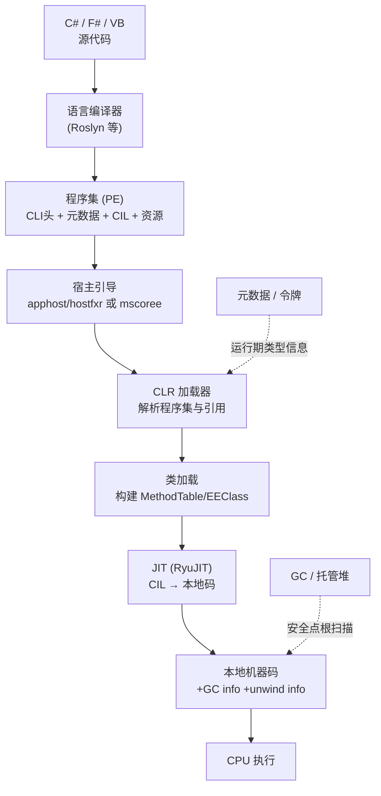
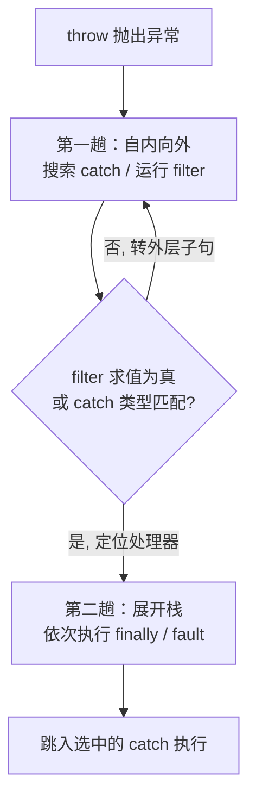
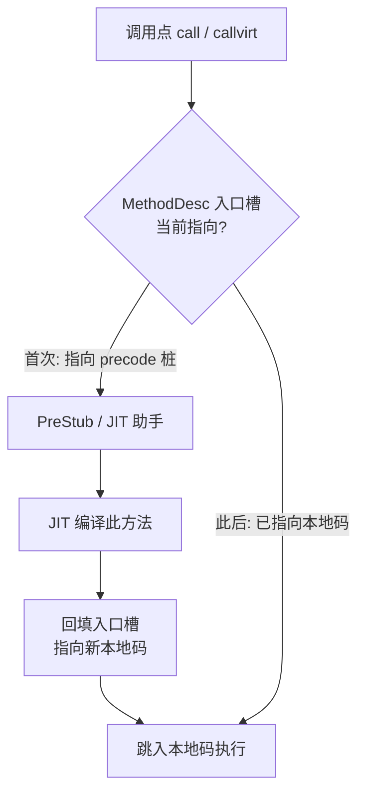
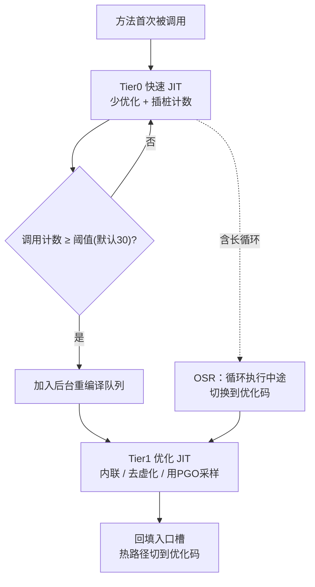

# 托管代码与字节码逆向（7）· dotNET-CLR与CIL执行模型
> [!abstract] TL;DR
> - CLI（ECMA-335）是规范，CLR 是其虚拟执行系统 VES 的具体实现；程序集是部署/版本/安全的最小单元，CIL 是面向「求值栈」的中间语言。元数据让类型、名字、签名在运行期完整保留——这正是 .NET 反编译能几乎还原到源码、而原生代码只能重建控制流的根因。
> - CIL 指令高度多态：一条 `add` 覆盖 int32/int64/native int/float，靠 JIT 的完整栈类型跟踪定型，与 JVM 的 `iadd/ladd/fadd` 类型化指令形成设计分野。泛型在 IL 层被「具体化」（reified）：值类型实例化各自生成代码、引用类型共享 `__Canon` 代码，与 Java 的类型擦除是本质差异。
> - 方法级惰性 JIT：`MethodDesc` 的入口槽先指向 precode 桩，首次调用经 PreStub 触发编译并回填槽位，此后直达本地码；RyuJIT 经 importer→morph→优化→LSRA 线性扫描分配→codegen，并同步产出 GC info 与 unwind info——JIT 与精确 GC 因此强耦合。
> - 分层编译：Tier0 快速 JIT 起步并插桩计数，达阈值（默认 30）晋升 Tier1 优化码；.NET 7 的 OSR 让含长循环的方法也能从 Tier0 起步，.NET 8 默认动态 PGO 用 Tier0 采样驱动去虚化与内联。
> - AppDomain 是 .NET Framework 的进程内隔离/卸载/安全边界，.NET Core 起只剩单一默认域，隔离与卸载改由 `AssemblyLoadContext` 承担，CAS 与 GAC 被移除——强名称从来就不是安全边界。
> - 逆向视角：CLI 头（`IMAGE_COR20_HEADER`）里入口点是元数据令牌而非 RVA，`ildasm`/`ilasm` 可无损往返；分析运行期真相时关掉分层编译、用 SOS 的 `!dumpmt`/`!dumpmd`/`!u` 观察 JIT 落地后的机器码。

## 概述与定位

要在逆向层面看懂 .NET，必须先厘清四个常被混为一谈的概念。**CLI**（Common Language Infrastructure，公共语言基础结构）是一份开放规范，编号 ECMA-335 / ISO 23271，它定义了一套与语言无关的执行环境：通用类型系统 CTS、公共语言子集 CLS、元数据格式、CIL 指令语义，以及虚拟执行系统 VES 的行为约束。**CLR**（Common Language Runtime）是微软对这份规范里 VES 的具体实现——它是一个真实存在的动态库（.NET Framework 的 `clr.dll`、.NET Core / .NET 5+ 的 `coreclr.dll`），负责加载、校验、JIT、垃圾回收、异常分发。**CIL**（Common Intermediate Language，也叫 MSIL 或简称 IL）是编译器输出、CLR 消费的中间指令流。**程序集**（Assembly）则是承载这一切的物理与逻辑容器。用一句话概括它们的关系：C#/F#/VB 编译成 CIL，CIL 连同元数据打包进程序集，程序集由 CLR 装入、按 CLI 规范执行。

本篇在整个逆向系列中的定位，是把「托管代码为什么好逆」这件事从执行模型层面讲透。与 [[23.C_C++运行时与ABI/01.运行时与ABI概览]] 里描述的原生世界相比，最根本的差异在于**信息保真度**：原生编译把类型、变量名、高层结构在生成机器码时几乎全部丢弃，逆向者只能从寄存器与栈的读写反推语义；而托管程序集里，CIL 是强类型的、方法边界清晰的，元数据以结构化表的形式完整保留了类、方法、字段的名字与签名。于是 dnSpy、ILSpy 这类反编译器可以做到「近乎无损」地还原出可读 C#——混淆（第 10 篇）之所以成为一门独立生意，恰恰是因为不混淆的 .NET 太透明了。

为避免与相邻篇目重复，这里先划清边界：程序集里元数据的物理编排（`#~`/`#Strings`/`#US`/`#Blob`/`#GUID` 流与各元数据表的字节布局）留给 [[08.PE中的dotNET元数据与流|第 8 篇]]；dnSpy/ILSpy 的实战操作留给第 9 篇；混淆器对抗与 de4dot 留给第 10 篇；NativeAOT/ReadyToRun 的深度逆向留给第 11 篇；Mono 与 IL2CPP 留给第 12 篇；运行时脱壳与内存 dump 留给第 15 篇。本篇聚焦执行模型本身：CLI 的组成、程序集如何被加载、CIL 如何在求值栈上运转、JIT 如何把它变成本地码、AppDomain 与 AssemblyLoadContext 如何组织隔离。

## 原理与机制

### CLI 的逻辑组成

CLI 规范可拆成几块彼此咬合的部件。**CTS**（通用类型系统）规定了所有 .NET 语言共享的类型概念：值类型与引用类型的二分、类/接口/委托/枚举/数组、装箱语义、单继承加多接口实现。**CLS**（公共语言规范）是 CTS 的一个子集，约束「若想被其它 .NET 语言消费，公开 API 只能用哪些特性」（例如不能用无符号整型作为公开参数，因为 VB 早期不支持）。**元数据**是自描述的类型信息表，令 CLR 无需头文件即可完成链接与反射。**CIL** 是指令流。**VES** 是把上述一切跑起来的引擎。这套分层的意义在于：语言前端只需生成 CIL + 元数据，就能自动获得跨语言互操作、反射、GC、异常统一模型——这是 CLI 相对于「每种语言各搞一套运行时」的核心设计红利。

### 程序集：部署、版本与身份的单元

程序集在物理上就是一个 PE 文件（`.dll` 或 `.exe`），在逻辑上是「清单（manifest）+ 一到多个模块 + 类型定义 + CIL + 资源」的集合。绝大多数程序集是单模块的，多模块程序集极为罕见（历史上用于混合语言编译）。清单记录了程序集的**身份**与它引用的外部程序集列表。身份由四元组构成：

```
程序集强名称身份 = 简单名 + 版本(Major.Minor.Build.Revision) + 区域(culture) + 公钥令牌(PublicKeyToken)[ + 处理器架构]
例：System.Private.CoreLib, Version=8.0.0.0, Culture=neutral, PublicKeyToken=7cec85d7bea7798e
```

**强名称**（strong name）是给程序集加一对非对称密钥：用私钥对程序集哈希签名，公钥（及其 8 字节令牌）写进身份。它的设计目的是**身份唯一性与并存版本**，不是防伪。.NET Framework 时代还有 **GAC**（全局程序集缓存），一个机器级的强名称程序集共享库，支持同名不同版本并存；.NET Core 起 GAC 被彻底移除，改为「每个应用自带依赖」的部署模型（框架依赖或自包含发布），这消解了困扰 .NET Framework 多年的「DLL 地狱升级版」——绑定重定向（binding redirect）问题。

### 程序集如何寄生在 PE 里

.NET 程序集复用了 Windows 的 PE 容器（见 [[13.PE文件详解/07-详解PE文件(七)：数据目录]]）。关键钩子是**数据目录的第 15 项**（索引 14，`IMAGE_DIRECTORY_ENTRY_COM_DESCRIPTOR`），它指向 72 字节的 **CLI 头**（`IMAGE_COR20_HEADER`，习惯上也叫 COR20 头）。这个头是原生世界与托管世界的分界碑，逆向时是第一眼要看的结构：

```
IMAGE_COR20_HEADER 关键字段：
  cb                    头大小(=0x48)
  MajorRuntimeVersion   运行时主版本
  MetaData              RVA+Size → 元数据根（#~ 等流的起点，详见第8篇）
  Flags                 COMIMAGE_FLAGS_ILONLY / 32BITREQUIRED / STRONGNAMESIGNED ...
  EntryPointToken       入口点「元数据令牌」(通常是 0x06xxxxxx 的 MethodDef)  ← 不是RVA!
  Resources / StrongNameSignature / VTableFixups / ManagedNativeHeader ...
```

注意 `EntryPointToken`：托管程序的入口不是一个 PE 里的地址，而是一个**元数据令牌**，指向元数据表里那个标了 `.entrypoint` 的 `Main` 方法。这是「元数据驱动执行」的第一个直观体现。至于程序如何真正跑起来，历史上分几种情形：早期 .NET Framework 里 PE 的 `AddressOfEntryPoint` 指向一段 `_CorExeMain` 桩（导入 `mscoree.dll`，单条 `jmp`），由它拉起 CLR；后来 Windows 加载器直接识别 COR 头、对 ILONLY 映像无需这段桩。到了 .NET Core，可执行文件是一个 **apphost**，通过 `hostfxr`/`hostpolicy` 定位并加载 `coreclr`，再交由 CLR 从入口令牌起跑。逆向 .NET 可执行时若发现入口只是个 apphost 引导壳，别急着当原生程序分析——真正的托管代码在同目录的托管 dll 或嵌入资源里。

### 加载到执行的流水线

从进程启动到你的第一行 `Main` 跑起来，CLR 内部走的是一条环环相扣的惰性流水线：



这条流水线处处「按需」：程序集用到才加载，类型碰到才做类加载（构建它的 `MethodTable`），方法调用到才 JIT。这种惰性把启动成本摊薄到实际执行路径上，是 JIT 模型相对于「进程启动即全量编译」的关键取舍——代价是首次触达的抖动（后文分层编译与 R2R 就是来缓解它的）。

### 执行模型：求值栈与对象布局

CLI 的 VES 是一台**基于求值栈的抽象机**。每个方法有自己的求值栈、局部变量表和参数表；CIL 指令把操作数压栈、运算、把结果压回，方法头的 `.maxstack` 声明这条求值栈的最大深度。要强调的是：这台求值栈是**逻辑抽象**，JIT 会把它映射到真实寄存器与物理栈上，运行时并不存在一条逐格压弹的「解释栈」（除非在纯解释模式下）。求值栈上的值只有有限几种归约类型：int32、int64、native int（指针宽度整数）、native float（内部恒为 64 位）、O（对象引用）、&（托管指针）、以及值类型实例。

托管堆上的对象布局是逆向与调试时反复要用的知识。64 位 CoreCLR 下引用类型对象的内存形态：

```
obj 引用实际指向 MethodTable 指针处；对象头字在其「前面」：
  偏移 -8   8B   对象头字 (ObjHeader / sync block index)：细锁、哈希码、GC 标志
  偏移  0   8B   MethodTable 指针 (TypeHandle)——类型标识 + 虚方法表入口
  偏移 +8   ...   实例字段（按对齐排布）
  数组额外：+8 处存 length，其后为元素区
  最小对象 = 8(头) + 8(MT) + 8(填充) = 24 字节
```

`MethodTable`（MT）是运行期最热的结构，携带基本大小、父类 MT、接口映射、以及虚方法槽（真正的虚表）；与它配对的 `EEClass` 是冷数据，存放从元数据派生、访问频率低的信息。CLR 把热/冷拆开，是为了让高频的虚调用只碰 MT、保持缓存友好。对象头字里存的是「细锁 + 哈希码 + 同步块索引」的复用位域：无竞争时是 thin lock，一旦膨胀就转成指向同步块表的索引。逆向时在 WinDbg 里 `!dumpobj` 看到的 MT 指针、`!dumpmt` 展开的虚表，正是这套布局的直接投影。

### AppDomain 与它的谢幕

**AppDomain**（应用程序域）是 .NET Framework 里的进程内隔离单位。一个进程托管一份 CLR，其中可以并存多个 AppDomain，每个域有独立的静态字段状态、独立的程序集集合、可独立卸载，并在旧安全模型（CAS）下充当安全边界。域之间不能直接传对象引用，跨域只能靠 `MarshalByRefObject` 的远程代理（按引用、走透明代理）或序列化（按值拷贝）。ASP.NET 早期一个站点一个域、各类插件宿主都重度依赖它——尤其看中「程序集无法单独卸载，但可以卸载整个域来回收」这一点。

到了 .NET Core / .NET 5+，AppDomain **基本谢幕**：进程里只保留一个默认域，`AppDomain.CreateDomain` 直接抛 `PlatformNotSupportedException`，CAS 被移除，AppDomain 不再是安全边界。隔离与卸载的职责移交给 `AssemblyLoadContext`（ALC）：每个 ALC 是一个程序集解析与加载的作用域，可实现插件隔离、同一程序集多版本并存，若标记为「可回收」（collectible）还能被卸载。这是一次重要的架构迁移——现代 .NET 里想做真隔离，答案是「多个 ALC」或「干脆多进程」，而不是 AppDomain。顺带一提，.NET Framework 老代码里 `Assembly.Load` / `LoadFrom` / `LoadFile` 分属不同的「加载上下文」，`LoadFrom` 上下文有臭名昭著的「同一文件按路径与按身份被视为两份」等坑，逆向老程序时若遇到诡异的类型不相等，多半是踩了加载上下文的历史陷阱。

## CIL指令集与JIT编译详解

这一节是本篇的核心：先把 CIL 指令与求值栈的语义讲透，再展开 JIT 如何把它落成本地码。理解这两层，才能解释「.NET 逆向为何这样、运行期又长什么样」。

### CIL 指令与求值栈语义

CIL 指令编码很简洁：主流指令是 1 字节操作码，扩展指令用 `0xFE` 前缀构成 2 字节。指令按功能分为几类：加载/存储（`ldarg`/`starg`/`ldloc`/`stloc`/`ldc`）、算术逻辑（`add`/`sub`/`mul`/`div`/`and`/`shl`）、分支（`br`/`brtrue`/`beq`/`switch`）、对象模型（`newobj`/`ldfld`/`stfld`/`callvirt`/`box`）、以及类型转换与数组访问。许多指令后面跟一个 4 字节**元数据令牌**作为操作数，用来引用类型、方法、字段或字符串：

```
元数据令牌 = [表ID:1B][RID:3B]
  0x02xxxxxx TypeDef    0x01xxxxxx TypeRef    0x1Bxxxxxx TypeSpec
  0x06xxxxxx MethodDef  0x0Axxxxxx MemberRef  0x2Bxxxxxx MethodSpec
  0x04xxxxxx Field      0x70xxxxxx #US 用户字符串堆（ldstr 专用）
```

**多态指令：CIL 与 JVM 的第一处分野。** JVM 的算术指令是类型化的——`iadd`/`ladd`/`fadd`/`dadd` 各管一种类型；而 CIL 只有一条 `add`，它对 int32、int64、native int、float 通用。为什么能这样？因为 CIL 从一开始就是「设计给 JIT 消费」的：JIT 会精确跟踪求值栈上每个槽的类型，从而在编译期就知道这条 `add` 该生成整数加还是浮点加。JVM 字节码则脱胎于「简单解释器也能直接跑」的年代，类型化指令让解释器不必做类型跟踪即可分派。这个差异的深层根源，是两套字节码对「执行方式」的预设不同——一个假定必被编译、一个假定可被解释。对逆向而言，这意味着读 CIL 时必须同时在脑子里维护一条「影子栈类型」，否则单看 `add` 无法确定语义。

一段最小示例，感受求值栈的运转：

```
.method public static int32 Add(int32 a, int32 b) cil managed
{
  .maxstack 2
  ldarg.0    // 压入 a        求值栈: [a]
  ldarg.1    // 压入 b        求值栈: [a][b]
  add        // 多态加法，弹两压一  求值栈: [a+b]
  ret        // 以栈顶为返回值
}
```

**对象模型指令与调用族。** `call` 是静态绑定的直接调用（用于静态方法与非虚方法），`callvirt` 走虚表动态分派并**顺带对 `this` 做空引用检查**——C# 即便调用非虚实例方法也常用 `callvirt`，就是为了白拿这个 null 检查。`newobj` 分配对象并调用构造器。`calli` 是按函数指针的间接调用，操作数是一个签名令牌。`ldftn`/`ldvirtftn` 取方法指针，是**委托**的底层实现：`new Action(obj.M)` 会 `ldftn M` 再 `newobj Action::.ctor(object, native int)`。字符串常量走 `ldstr`，操作数是 `#US` 用户字符串堆的令牌（`0x70xxxxxx`）。

**值类型与装箱。** `box` 把值类型拷进堆对象、压入对象引用；`unbox` 返回指向箱内值的托管指针（不拷贝），`unbox.any` 则拷出来。装箱是 .NET 性能分析里的高频元凶，逆向时看到密集的 `box`/`unbox` 往往提示泛型使用不当或旧式集合。

**泛型具体化：与 Java 的本质差异。** .NET 泛型是**具体化的**（reified）——`List<int>` 与 `List<string>` 在运行期是两个不同的构造类型，元数据里用 `TypeSpec`/`MethodSpec` 令牌表达泛型实例化。运行时对值类型实例化**逐一生成专用代码**（`List<int>` 与 `List<double>` 各有一份），对引用类型实例化则**共享同一份代码**——用占位类型 `System.__Canon` 表示，并通过运行期「字典」在需要时查出具体类型参数。这与 Java 的类型擦除（`List<Integer>` 与 `List<String>` 在字节码里都退化成 `List`，尖括号信息只存在于编译期）截然相反。差异的后果很实际：C# 里 `typeof(T)`、`new T[]`、`default(T)` 都能在运行期拿到真实类型信息，Java 做不到；逆向 .NET 泛型时元数据里保留了完整实例化信息，几乎不丢。这一点在 [[35.Android逆向与运行时/03.DEX文件格式]] 描述的 Dalvik/ART 世界（沿用 Java 擦除语义）里同样看得到对照。

**托管指针与前缀指令。** `&` 类型是「托管指针」（by-ref），GC 能感知并在压缩时更新它，这让 `ref` 参数、`ref` 局部、`Span<T>` 得以安全存在。CIL 还有一组前缀指令微调后续指令语义：`constrained.` 放在泛型/值类型的 `callvirt` 前以避免不必要装箱；`tail.` 请求尾调用；`volatile.` 施加内存序约束；`readonly.` 修饰 `ldelema` 取只读数组元素地址；`unaligned.` 标注非对齐访问。这些前缀是理解高性能 C#（`Span`、`ref struct`）生成 IL 的钥匙。

**异常处理：两趟分发。** CIL 的异常处理不写在指令流里，而是方法的「异常子句表」：每个子句记录被保护区 `try` 的偏移与长度、处理器的偏移与长度，以及它是 catch（带类型令牌）、filter（带过滤器偏移）、finally 还是 fault。运行期采用**两趟分发**：第一趟自内向外搜索，运行各 filter（`when` 子句）或匹配 catch 类型以**定位**处理器；第二趟展开栈、依次执行途经的 finally/fault，最后跳入选中的 catch。退出被保护区必须用 `leave` 指令（它会触发 finally）。



对比 JVM：JVM 的异常表只有 `from/to/target/catch_type` 四元组，没有 filter、没有两趟；早期 Java 的 finally 甚至靠 `jsr/ret` 子例程或代码复制实现。CIL 的 filter（对应 C# 的 `catch when`）是它独有的表达力，逆向时若看到 filter 子句，反编译器会还原成 `when`。这处差异也解释了为什么 .NET 的异常成本更高——两趟分发要跑用户 filter 代码。

### JIT：从 CIL 到本地码

**惰性方法级编译与桩回填。** CLR 不预先编译整程序，而是「碰到哪个方法编译哪个方法」。每个方法有一个 `MethodDesc` 描述符，其本地码入口槽最初指向一段 **precode 桩**（临时入口）。首次调用跳进桩，桩调用 PreStub / JIT 助手完成编译，把入口槽**回填**为新生成的本地码地址，再跳进去执行；此后所有调用直达本地码（直接调用点还可能被就地打补丁 backpatch）。



这套惰性设计的取舍很清楚：省下「永不执行的方法」的编译开销、把启动成本摊到实际路径上；代价是首次触达每个方法的一次性抖动。逆向时这带来一个反直觉现象——**同一个方法的机器码在内存里可能随时间改变**（Tier0→Tier1 重编译、入口槽被回填），所以静态 dump 一次未必是最终形态。

**RyuJIT 的内部流水线。** 现代 .NET 用 RyuJIT。编译一个方法大致经历：importer（读 CIL、构建内部 IR，即每个基本块的 GenTree 表达式树 + 基本块图，并在此做内联决策与泛型实例化）→ morph（树形变换与降级）→ 流图优化（循环识别、公共子表达式消除、常量传播、数组越界检查消除等）→ 活跃性/SSA/值编号 → LSRA 线性扫描寄存器分配 → codegen 发射机器码。**关键：JIT 在生成本地码的同时，必须产出两份「元信息」**——GC info（记录每个 GC 安全点上，哪些寄存器/栈槽持有对象引用）与 unwind info（供异常展开与栈回溯）。GC info 是精确 GC 的命门：垃圾回收要在安全点暂停线程、精确找出所有根、压缩后回填被移动对象的新地址，全靠这张 JIT 生成的映射。这就是**JIT 与 GC 强耦合**的根本原因——托管执行模型不是「先编译、GC 另说」，而是编译时就把 GC 需要的一切一并烘焙进去。这一点与 [[40.WASM与虚拟化壳逆向/02.WASM指令集与执行模型]] 里 WASM 的线性内存、无 GC 根扫描模型形成鲜明对照。

**分层编译（Tiered Compilation）。** .NET Core 3.0 起默认开启。方法首次调用先走 **Tier0 快速 JIT**：几乎不优化、编译极快，换取启动速度，同时插入调用计数桩。计数达到阈值（默认 30）后，方法进入重编译队列，由后台线程用 **Tier1** 全优化重新 JIT，完成后回填入口槽把热路径切到优化码。



早期分层编译有个短板：含长循环的方法若从 Tier0 起步，那个慢循环可能长期跑不完、迟迟等不到「下次进入方法」的重编译时机，所以默认干脆让含循环方法跳过 Tier0 直上优化码（`QuickJitForLoops` 关闭）。.NET 7 引入 **OSR**（On-Stack Replacement，栈上替换）根治此事：允许一个正在执行的 Tier0 方法**在循环中途**热替换到优化码，无需退出重进。于是含循环方法也能享受 Tier0 的快启动。.NET 8 起默认开启**动态 PGO**（Profile-Guided Optimization）：Tier0 代码被插桩采集运行画像（例如某虚调用点实际命中的类型分布），Tier1 据此做「有保护的去虚化」（guarded devirtualization，猜最可能类型直接内联、猜错则回退）、冷热分块等。这类优化让 Tier1 码常常比静态 AOT 还快——因为它掌握了真实运行数据。

**AOT 光谱与逆向含义。** 纯 JIT 的对面是提前编译：老 .NET Framework 的 **NGEN** 生成绑定本机的原生映像单独缓存；现代的 **ReadyToRun（R2R）** 由 crossgen2 把本地码直接嵌进程序集，减少启动 JIT，但**仍保留 IL 与元数据**，运行期还能在 Tier1 重新 JIT（版本弹性）。这条光谱的尽头是 NativeAOT，它彻底剥掉 IL——那属于 [[08.PE中的dotNET元数据与流|后续篇目]] 与第 11 篇的范畴。对逆向者的直接结论是：**普通 .NET 程序集与 R2R 映像都保留 IL，反编译几乎无损；只有 NativeAOT 才逼你退回原生逆向套路**。

## 工具视角与实战

**IL 的无损往返。** .NET SDK 自带 `ildasm`（反汇编成 `.il` 文本）与 `ilasm`（把 `.il` 汇编回程序集）。二者构成一条**可往返**的链路：`ildasm foo.dll /out=foo.il` → 编辑 `.il` → `ilasm foo.il /dll` 得到打过补丁的程序集。这是 .NET 打补丁最朴素也最可靠的方式（dnSpy 内部的「编辑并保存」本质是更高级的封装）。Mono 侧对应工具是 `monodis`。

**反编译与程序化操纵。** 反编译到 C# 的主力是 dnSpy、ILSpy、dotPeek、JustDecompile（操作细节见第 9 篇）。若要**程序化**读写程序集，主流库有：`dnlib`（dnSpy 的底层，读写能力最强，抗混淆样本首选）、`Mono.Cecil`（经典、生态广）、微软官方的 `System.Reflection.Metadata`（只读为主、性能好）。逆向自动化（批量脱混淆、静态特征提取）通常围绕 dnlib 展开。

**看 CLI 头与元数据。** 想快速判定「这是不是 .NET、是哪种」，用 `dumpbin /clrheader foo.exe` 打印 COR20 头，或用 CFF Explorer / PE-bear 图形化查看数据目录第 15 项与元数据流。看到 COR20 头且 `Flags` 含 `ILONLY`，基本可断定是托管程序集。

**运行期真相：SOS 与诊断工具。** 静态看 IL 不够时，用调试器观察 JIT 落地后的运行期。WinDbg（或 Linux 上 lldb）加载 **SOS** 扩展后，`!clrstack` 看托管调用栈、`!dumpmt`/`!dumpmd` 展开方法表与方法描述符、`!u` 反汇编某方法的**实际 JIT 本地码**、`!dumpheap`/`!eeheap` 巡视托管堆。命令行侧有 `dotnet-dump`（抓取并分析转储）、`dotnet-trace`（采样）。这些是把「元数据里的静态类型」与「内存里的运行期对象/机器码」对上号的桥梁。

**JIT 行为调优（分析用）。** 一批 `DOTNET_` 环境变量能让 JIT 吐出内部信息或改变行为，逆向分析时很有用：`DOTNET_JitDisasm=方法名` 让 JIT 打印该方法生成的汇编；`DOTNET_TieredCompilation=0` 关掉分层，强制一步到位出优化码，**避免「同一方法机器码随时间变化」干扰分析**；`DOTNET_TC_QuickJitForLoops=0` 控制含循环方法是否走 Tier0；`DOTNET_ReadyToRun=0` 强制忽略 R2R 预编译码、全部走 JIT，便于观察纯 JIT 结果；`DOTNET_TieredPGO` 开关动态 PGO。分析一个可疑二进制时，常见套路是「关分层 + 关 R2R + 开 JitDisasm」，得到稳定、可复现的机器码再下手。

一段稍复杂的 IL，展示令牌与装箱如何出现在真实反汇编里：

```
  ldstr      "x="                                       // #US 令牌 0x70xxxxxx
  ldarg.0                                                // 取参数（值类型 int32）
  box        [System.Runtime]System.Int32               // 装箱到堆对象
  call       string [System.Runtime]System.String::Concat(object, object)
  call       void  [System.Console]System.Console::WriteLine(string)
```

## 安全性与正确使用

理解执行模型，才能不把它的机制误当安全机制。

**IL 可验证性与类型安全。** CLI 区分「可验证（verifiable）」与「不可验证」的 IL。可验证 IL 保证类型安全与内存安全（不越界、不伪造指针），这是托管代码「默认安全」的基石。C# 的 `unsafe`、裸指针、`calli`、某些 `System.Runtime.CompilerServices.Unsafe` 用法会产出**不可验证** IL，绕过类型安全网。旧时代用 `PEVerify` 校验，现代对应工具是 `ILVerify`。要点是：**如今在完全信任下运行的 JIT 并不强制验证**——验证只在需要沙箱时才有意义，而沙箱本身已淡出（见下）。逆向时若见到大量不可验证 IL 或直接的内存操作，应提高警惕，它可能在做类型混淆或内存破坏。

**强名称不是安全边界。** 这是最常见的误解。强名称只提供**身份**与**防篡改证据**，不提供**来源真实性**：任何人都能生成密钥对，签出一个「强名称」程序集；.NET Framework 曾对满信任/GAC 程序集「跳过强名称验证」（strong-name bypass）；.NET Core 干脆**在加载时根本不验证强名称签名**，强名称退化为纯身份标识。真正的来源认证应依赖 **Authenticode**（X.509 代码签名，有 CA/PKI 背书）加内容哈希。把强名称当「防伪」用，是可被轻易绕过的错误加固。

**沙箱的退场。** .NET Framework 曾用 CAS（代码访问安全）+ AppDomant 沙箱来降权运行不可信程序集，但历史上逃逸漏洞不断，微软最终判定「进程内沙箱不可靠」。.NET Core 移除了 CAS，AppDomain 不再是安全边界。**结论很硬：想真隔离不可信代码，唯一稳妥的答案是进程/容器/虚拟机级隔离，而不是 ALC 或 AppDomain。** ALC 解决的是「插件版本隔离与可卸载」这类工程问题，不解决「防御恶意代码」这类安全问题。

**程序集加载劫持面。** 托管程序的加载解析（探测路径、绑定重定向、依赖 dll 就近查找）会引入 DLL 侧载/劫持风险：把恶意托管依赖放到应用目录、或篡改绑定配置，即可让进程加载攻击者的程序集。`Assembly.Load(byte[])`、`AssemblyLoadContext` 自定义解析、`Reflection.Emit` 动态生成程序集，都能实现**内存中加载、不落盘**——这既是分析在野样本时要盯的行为，也是常见的载荷投递手法（武器化细节属于第 10 与第 15 篇，本篇只点到防御视角）。加固方向：用自定义 ALC **收紧解析范围**、校验依赖哈希/签名、避免从不可信路径 `LoadFrom`。

**反序列化与动态执行。** `BinaryFormatter` 之类的不安全反序列化，会在反序列化过程中实例化任意类型、触发「gadget 链」达成远程代码执行，微软已将其标记过时并在新版禁用/移除。正确姿势是用契约明确、不实例化任意类型的序列化器（`System.Text.Json` 等），绝不对不可信数据用 `BinaryFormatter`。

**JIT 内存与 W^X。** JIT 天生要「写一段内存、再执行它」，历史上易落成 RWX 页，成为利用面。现代运行时朝 **W^X**（写与执行互斥）演进：先写到可写页、翻转成可执行、执行时不可写，配合 CET 等硬件缓解。`Reflection.Emit` 这类动态代码同理是 RWX 敏感面。加固时应保持运行时更新到位，享受这些默认缓解。

一句话收束：**CLI 的托管安全属性（类型安全、GC 内存安全）是「防御误操作与内存破坏」的强项，但它从不是「防御恶意程序集」的沙箱**；把强名称、混淆、ALC 当安全边界都是误用，真正的信任边界应建立在签名验证与进程级隔离之上。

## 小结

.NET 的执行模型是一台「元数据驱动、求值栈抽象、JIT 落地、GC 托底」的机器。CLI 定标准、CLR 做实现、CIL 是语言、程序集是容器：这四者协作让类型信息在运行期完整留存，也让托管代码天然易逆。CIL 的多态指令与具体化泛型是它区别于 JVM 的两处设计基因——前者把定型工作交给必然存在的 JIT，后者把泛型信息保留到运行期。JIT 侧，从 precode 桩的惰性回填，到 RyuJIT 同步烘焙 GC info 与 unwind info，再到 Tier0/Tier1/OSR/动态 PGO 的分层演进，共同解释了「同一方法的机器码为何会随时间变形」这一逆向必须心里有数的现象。AppDomain 到 AssemblyLoadContext 的迁移、CAS 与 GAC 的退场，则提醒我们：托管安全属性保护的是内存与类型，而非对抗恶意代码——后者只能靠签名与进程隔离。掌握了本篇的执行模型，第 8 篇的元数据流、第 9 篇的反编译实战、第 10 篇的混淆对抗才有坚实的地基。

## 相关阅读

- **规范**：ECMA-335《Common Language Infrastructure (CLI)》（ISO/IEC 23271），CIL 指令语义、元数据、VES 行为的权威来源。
- **官方文档**：Microsoft Learn 的「.NET 执行模型 / 托管执行过程」「RyuJIT 与分层编译」「AssemblyLoadContext」「AppDomain」条目；`dotnet/runtime` 仓库内的 **Book of the Runtime（BOTR）**，深入 MethodTable/MethodDesc/JIT/GC 的实现文档。
- **源码**：`dotnet/runtime`（CoreCLR、RyuJIT、GC 源码）；历史上的 SSCLI/Rotor 共享源码。
- **书目**：Jeffrey Richter《CLR via C#》（执行模型与类型系统经典）；Serge Lidin《Expert .NET IL Assembler》（IL 汇编权威）；Konrad Kokosa《Pro .NET Memory Management》（对象布局、GC 与 JIT 协作）。
- **同库对照**：[[23.C_C++运行时与ABI/01.运行时与ABI概览]]（原生 ABI 与托管运行时的信息保真度差异）、[[13.PE文件详解/07-详解PE文件(七)：数据目录]]（.NET 元数据经由数据目录第 15 项寄生于 PE）、[[35.Android逆向与运行时/03.DEX文件格式]]（Dalvik/ART 的擦除式泛型对照）、[[40.WASM与虚拟化壳逆向/02.WASM指令集与执行模型]]（无 GC 根扫描的另一种托管执行模型）。

[[00.托管代码与字节码逆向总览|⬆ 系列总览]] | [[06.Java混淆与反混淆|← 上一章]] | [[08.PE中的dotNET元数据与流|→ 下一章]]