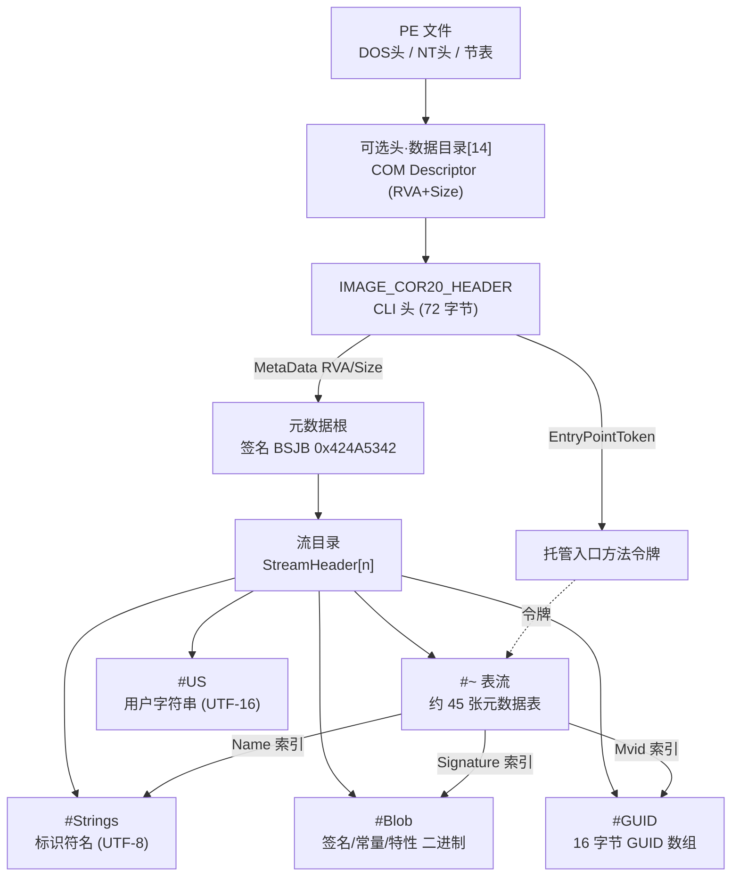
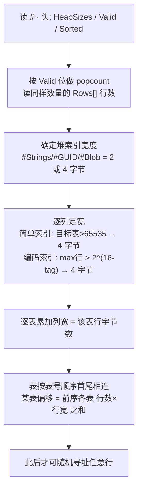
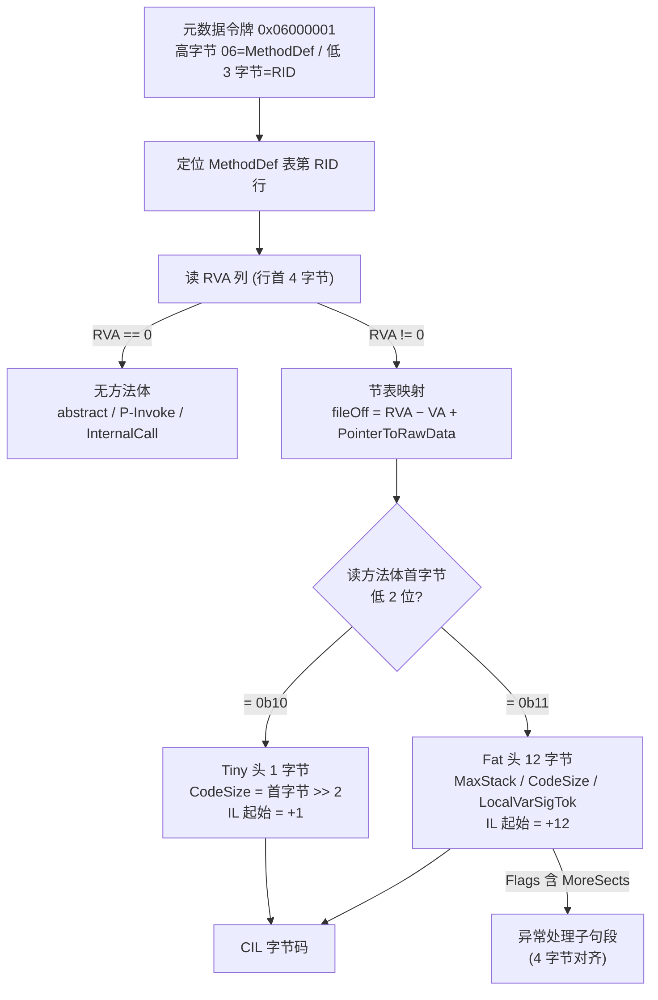

# 托管代码与字节码逆向（8）· PE中的dotNET元数据与流
> [!abstract] TL;DR
> - .NET 程序集是“寄生”在 PE 里的自描述容器：可选头数据目录第 14 项（COM Descriptor）指向 CLI 头（`IMAGE_COR20_HEADER`），CLI 头再指向元数据根，所有类型/方法/字段信息都编码在这里，原生 PE 编译期抹除的符号在这里被完整保留。
> - 元数据根以 `BSJB`（`0x424A5342`）签名起头，其后是若干“流”：`#~`（表流）、`#Strings`、`#US`、`#GUID`、`#Blob`——**表存关系、堆存内容**，两者靠整数索引拼接成一张自洽的关系数据库。
> - `#~` 表流用 `Valid`/`Sorted` 两个 64 位掩码 + 行数数组描述约 45 张元数据表；列宽（堆索引 2/4 字节、编码索引 2/4 字节）必须**先扫全所有行数才能算出**，因此表流无法直接随机寻址某一行。
> - 元数据令牌（token）= 高字节表号 + 低 3 字节 RID，是 IL 与元数据之间唯一的“指针”；`MethodDef` 表的 RVA 列，是从元数据走到磁盘上真实 IL 字节的那座桥。
> - Method RVA 经“节表映射→文件偏移”后指向方法体头（Tiny 单字节 / Fat 12 字节），再往后才是 CIL 字节码——脱壳 dump、元数据重建、反混淆全都绕不开这条链。

## 概述与定位

.NET 元数据（metadata）是 CLR “自描述程序集”能力的物理载体。原生 C/C++ 目标文件在编译期把类型信息几乎全部抹除，链接后只剩地址、调用约定与少量调试符号（对照 [[23.C_C++运行时与ABI/01.运行时与ABI概览]]，原生世界靠 ABI 约定而非文件内元信息来完成互操作）。托管程序集恰恰相反：它把每一个类型、方法、字段、参数、属性、事件、自定义特性、外部引用都以**结构化表格**记录在文件内部。正因如此，CLR 在加载期无需任何外部符号即可完成类型加载、字段布局计算、方法解析、JIT 与反射；也正因如此，ILSpy/dnSpy 这类反编译器能近乎无损地还原出带名字、带签名、带命名空间的源码级视图。逆向 .NET 的真正难点从来不在“读懂 IL”，而在于混淆器如何蓄意破坏、扭曲、伪造这套元数据。

本篇的定位是“格式层”。上一篇（07）讲了 CLR 与 CIL 的**执行模型**——求值栈、JIT、令牌在运行期如何被解析成方法句柄；下一篇（09）进入 dnSpy/ILSpy 的**工具实操**。夹在中间的本篇负责把一个 `.exe`/`.dll` 在磁盘上的原始字节，一层层拆到元数据表与堆，并讲清一个最关键的落地问题：**Method RVA 究竟如何定位到那段真正会被 JIT 的 IL**。它同时承接 [[13.PE文件详解/07-详解PE文件(七)：数据目录]] 与 [[13.PE文件详解/22-详解PE文件(二十二)：CLR运行时头]]——.NET 元数据正是寄生在 PE 数据目录里的一项内容。理解了它，你才能在没有源码、甚至元数据被故意搞坏的情况下，把一个托管样本重新“讲清楚”。

## 原理与机制

### 从 PE 到 CLI 头：一枚数据目录项开启托管世界

一个托管 PE 与普通 PE 共享完全相同的外壳：`MZ` DOS 头、`PE\0\0` 签名、COFF 文件头、可选头、节表。区别只有一处——可选头的数据目录数组第 15 个槽位（索引 14，`IMAGE_DIRECTORY_ENTRY_COM_DESCRIPTOR`）非零，它以 RVA+Size 指向 **CLI 头**。历史上 x86 托管 PE 还会在 `AddressOfEntryPoint` 处留一个 `jmp _CorExeMain`（导入自 `mscoree.dll`）的 6 字节桩，用于老加载器；但现代 Windows 加载器一旦发现第 14 项非空，就直接把控制权交给 CLR shim，那段桩已是历史遗迹。

CLI 头即 `IMAGE_COR20_HEADER`，通常 72（`0x48`）字节，是整个托管世界的“根指针块”：

```
struct IMAGE_COR20_HEADER {      // 偏移  大小
  DWORD  cb;                     //  0x00   4   头自身大小 = 0x48
  WORD   MajorRuntimeVersion;    //  0x04   2   期望的运行时主版本 (2)
  WORD   MinorRuntimeVersion;    //  0x06   2   (5)
  IMAGE_DATA_DIRECTORY MetaData; //  0x08   8   元数据根的 RVA + Size ★核心
  DWORD  Flags;                  //  0x10   4   COMIMAGE_FLAGS_*
  DWORD  EntryPointToken;        //  0x14   4   托管入口方法令牌 (或原生入口 RVA)
  IMAGE_DATA_DIRECTORY Resources;//  0x18   8   托管资源
  IMAGE_DATA_DIRECTORY StrongNameSignature;   // 0x20  强名签名
  IMAGE_DATA_DIRECTORY CodeManagerTable;      // 0x28  (保留, 全 0)
  IMAGE_DATA_DIRECTORY VTableFixups;          // 0x30  非托管导出用
  IMAGE_DATA_DIRECTORY ExportAddressTableJumps;// 0x38
  IMAGE_DATA_DIRECTORY ManagedNativeHeader;   // 0x40  NGen/R2R 预编译头
};
```

其中 `Flags` 值得逆向者留意：`COMIMAGE_FLAGS_ILONLY (0x1)` 表示纯 IL（无原生代码）；`0x2` 强制 32 位；`0x8` 表示已强名签名；`0x10` 表示原生入口点（此时 `EntryPointToken` 字段解释为 RVA）；`0x20000` 表示 32 位优先。而 `ManagedNativeHeader` 非空则意味着这是一个 NGen 镜像或 ReadyToRun（R2R）程序集，里面除元数据外还塞了预编译的原生码——这属于第 11 篇 AOT 的范畴。

### 元数据根与五条流：一张自洽的关系数据库

顺着 `MetaData.VirtualAddress` 映射到文件偏移，就抵达**元数据根**（metadata root）。它的固定布局是：

```
偏移  大小  字段
 0x00   4   Signature  = 0x424A5342  (磁盘小端字节 42 53 4A 42 → "BSJB")
 0x04   2   MajorVersion (1)
 0x06   2   MinorVersion (1)
 0x08   4   Reserved (0)
 0x0C   4   Length     版本串长度 (向上取整到 4 的倍数)
 0x10   L   Version    以 \0 结尾的 UTF-8 串, 如 "v4.0.30319"
 +      2   Flags (0)
 +      2   Streams    流的数量 n
 +      …   StreamHeader[n]
```

`BSJB` 是当年四位元数据设计者名字的首字母，成了识别托管元数据块最可靠的魔数——脱壳时在内存里全局搜 `BSJB` 往往能一举定位被搬运的元数据。紧随其后的 `Version` 串直接暴露了目标框架（`v2.0.50727`=.NET 2/3.5，`v4.0.30319`=.NET Framework 4.x，`.NETCoreApp` 系走 `v4.0.30319` 头但由 runtimeconfig 决定）。

每个 **流头**（stream header）只有三段：4 字节 `Offset`（相对元数据根起点）、4 字节 `Size`、以及一个以 `\0` 结尾且**补齐到 4 字节边界**的 ASCII 名字。标准流一共五条，分工鲜明：

| 流名 | 内容 | 编码 | 角色 |
|------|------|------|------|
| `#~` 或 `#-` | 元数据表（约 45 张） | 定长行 | **关系/骨架**：谁是谁、谁引用谁 |
| `#Strings` | 标识符名（类型名、方法名…） | UTF-8，`\0` 分隔 | 名字堆 |
| `#US` | 用户字符串（`ldstr` 用） | UTF-16LE | 字面量堆 |
| `#GUID` | 16 字节 GUID 数组 | 二进制 | 模块 Mvid 等 |
| `#Blob` | 签名/常量/特性/公钥… | 长度前缀二进制 | 内容堆 |

这套“**表存关系、堆存内容**”的切分是元数据设计的灵魂：表是定长行、可以按行号 O(1) 索引，堆是变长内容、按字节偏移引用。表里从不直接嵌名字或签名，而是存一个指向 `#Strings`/`#Blob` 的整数索引。这样既让表保持规整可寻址，又让重复的名字/签名在堆里天然共享、去重。

### 令牌：IL 与元数据之间唯一的指针

把表、堆缝合成整体的机制叫**元数据令牌**（metadata token），一个 4 字节值：高 8 位是**表号**（`0x02`=TypeDef、`0x06`=MethodDef、`0x0A`=MemberRef、`0x01`=TypeRef、`0x1B`=TypeSpec、`0x70`=`#US` 字符串…），低 24 位是 **RID**（行号，1 起）。RID 为 0 表示空令牌。IL 里凡是 `call`、`newobj`、`ldfld`、`ldstr` 等指令，其操作数就是这样一枚令牌——CLR 与反编译器都靠它在“字节码”与“元数据/堆”之间往返。理解令牌，就理解了托管二进制的“寻址系统”，它等价于原生世界里的重定位+符号表，只不过被前置固化进了文件。



## 结构与算法详解：从 #~ 表头到一段真实 IL

这一段是全篇的核心，把“字节”走到底。

### #~ 表流头与 Valid/Sorted 掩码

`#~` 流开头是一个固定小头：

```
偏移  大小  字段
 0x00   4   Reserved (0)
 0x04   1   MajorVersion (2)
 0x05   1   MinorVersion (0)
 0x06   1   HeapSizes   位标志: 0x01=#Strings 4字节索引, 0x02=#GUID 4字节, 0x04=#Blob 4字节
 0x07   1   Reserved (1)
 0x08   8   Valid       UINT64, 第 i 位=1 表示第 i 张表存在
 0x10   8   Sorted      UINT64, 第 i 位=1 表示第 i 张表按键排序
 0x18   …   Rows[popcount(Valid)]  每张存在的表的行数, 各 4 字节, 按表号升序
 …      …   各表数据 (首尾相连)
```

`Valid` 的位数（`popcount`）决定后面跟几个 4 字节行数。`Sorted` 标记哪些表保持了排序不变式——例如 `CustomAttribute`（按 parent 排序）、`NestedClass`、`InterfaceImpl`、`GenericParam` 等，只有排序表才允许二分查找。混淆器有时故意打乱本该排序的表却不清 `Sorted` 位，制造“工具二分找不到、CLR 线性兜底仍能跑”的分裂。

### 为什么表无法随机寻址：列宽必须先全表扫描

这是初学者最容易踩的坑：**你不能直接跳到 MethodDef 表第 100 行**。原因在于每张表的行宽不是常量，取决于三类列的动态宽度：

- **堆索引列**（指向 `#Strings`/`#GUID`/`#Blob`）：宽度由 `HeapSizes` 决定——堆超过 64KB 就用 4 字节，否则 2 字节。
- **简单索引列**（指向单一另一张表）：若目标表行数 > 65535 用 4 字节，否则 2 字节。
- **编码索引列**（coded index，可指向多张表之一）：见下。

于是解析算法必须严格分三步（见下图）：先读全部 `Rows[]`，再据此为每张表的每一列定宽、算出行宽，最后因为所有表在 `#~` 里**首尾紧邻、无对齐填充**地顺序排布，某表的起始偏移 = 它之前所有存在表的“行数 × 行宽”之和。只有走完这三步，才谈得上寻址任意一行。这种“空间极致压缩换取解析必须整体化”的取舍，正是元数据紧凑的代价，也是手写解析器最易出错之处。



### 编码索引：用几个低位换紧凑

有些列在语义上可以指向“几张表中的任意一张”。例如 `MemberRef.Class` 可能指向 `TypeDef`/`TypeRef`/`ModuleRef`/`MethodDef`/`TypeSpec`。元数据用**编码索引**解决：低若干位（tag 位）编码“是哪张表”，其余高位是 RID。`TypeDefOrRef` 用 2 个 tag 位（0=TypeDef，1=TypeRef，2=TypeSpec）；`HasCustomAttribute` 要覆盖 22 张表，用 5 个 tag 位；`ResolutionScope` 用 2 位……ECMA-335 §II.24.2.6 给出全部约十几种编码族及其 tag 位数。宽度判定则是：设 tag 位数为 `n`、该族所指各表的最大行数为 `M`，若 `M ≤ 2^(16−n)` 用 2 字节，否则 4 字节。以 `TypeDefOrRef`（n=2）为例，阈值就是 `2^14 = 16384`——一旦这三张表里最大的一张超过 16384 行，全库所有 `TypeDefOrRef` 列统一升为 4 字节。这解释了为什么大型程序集的元数据会“突然变胖”。

### 表间的“游程”关系：MethodList 只存起点

元数据用一个精巧模式表达“一对多”而不存计数：**父行只存子表的起始索引，子范围一直延伸到下一父行的起始索引之前**。`TypeDef.MethodList` 指向 `MethodDef` 表中该类型第一个方法的行号；这个类型的方法就是从该行号到“下一个 TypeDef 的 MethodList”之间的连续区段；最后一个 TypeDef 的方法区段一直到 `MethodDef` 表尾。`Field`、`Param`、`Property`、`Event` 全用同样的“游程（run-to-next）”表达。好处是省掉了每行一个计数字段；代价是**表一旦排定就不能随意插删行**——插一行会打乱所有后继的游程边界。这正是“编辑并继续”（Edit-and-Continue）为何需要 `#-` 非优化流的原因：`#-` 里额外引入 `FieldPtr`/`MethodPtr`/`ParamPtr`/`EventPtr`/`PropertyPtr` 五张间接表和 `EncLog`/`EncMap`，用一层指针间接换取可增量修改；`HeapSizes` 里也会置上 `0x20`/`0x80` 之类的额外位。逆向者看到流名是 `#-` 而非 `#~`，就该意识到面对的是 ENC/未优化布局，行号需经 Ptr 表二次映射。

### 四个堆的内部格式与压缩整数

- **`#Strings`**：把所有标识符 UTF-8 编码、以 `\0` 分隔、首尾拼接成一大块，偏移 0 恒为空串。表里的 `Name` 列存的就是进入这个块的字节偏移。相同字符串通常被编译器去重，但规范不强制，混淆器会塞入大量同名或不可打印名。
- **`#US`（用户字符串）**：`ldstr` 引用的字面量，用 UTF-16LE 存储。每条 = 压缩整数长度前缀 +（字符数×2）字节 + **1 个终止标志字节**：该字节为 0 表示全是普通 ASCII，为 1 表示含非 ASCII/特殊字符（便于消费者快速判定）。长度前缀值 = 字符字节数 + 1（含那个标志字节）。令牌 `0x70xxxxxx` 就索引这里，偏移 0 是单个 `\0` 的空条目。
- **`#GUID`**：纯 16 字节 GUID 的数组，**1 起索引**（索引 1 即第一个 GUID，字节 `[0..16)`）。`Module` 表的 `Mvid` 列指向它——每次编译生成的新 GUID，可用来判断两份程序集是否同一次构建产物。
- **`#Blob`**：变长二进制堆，每条前面是**压缩整数**长度前缀，随后是原始字节。方法/字段签名、自定义特性实参、常量值、封送描述、强名公钥全住在这里；偏移 0 是空 blob。

上面反复出现的“压缩整数”是元数据的通用变长编码，规则（无符号）为：

```
值 ≤ 0x7F           : 1 字节, 0xxxxxxx                         (直接存)
值 ≤ 0x3FFF         : 2 字节, 10xxxxxx xxxxxxxx  (大端, 或上 0x8000)
值 ≤ 0x1FFFFFFF     : 4 字节, 110xxxxx …          (大端, 或上 0xC0000000)
```

最高位的连续 1 的个数即“再读几个字节”，与 UTF-8 长度自描述异曲同工。有符号版本再叠一层旋转编码。手写解析必须先正确吃掉这个前缀，才能读对后面的 blob 内容。

### 签名 blob：从字节还原方法原型

`MethodDef.Signature` 指向的 blob 描述了调用约定、泛型参数个数、参数个数、返回类型、各参数类型，全用 `ELEMENT_TYPE_*` 编码：`0x01`=VOID、`0x02`=BOOLEAN、`0x08`=I4、`0x0E`=STRING、`0x1C`=OBJECT、`0x12`=CLASS（后跟一个 `TypeDefOrRef` 压缩令牌）、`0x11`=VALUETYPE、`0x14`=ARRAY、`0x1D`=SZARRAY……。举例 `20 01 01 0E` 表示：`HASTHIS`(0x20) 调用约定、1 个参数、返回 VOID、参数类型 STRING——即 `void Foo(string)` 的实例方法。逆向脱壳后手工核对签名，靠的就是这套字节到原型的映射。

### 高潮：Method RVA 如何走到真实 IL

`MethodDef`（表号 `0x06`）每行六列，第一列就是 4 字节 **RVA**：

```
MethodDef 行:  RVA(4) | ImplFlags(2) | Flags(2) | Name(#Strings) | Signature(#Blob) | ParamList(→Param)
```

- 若 **RVA == 0**：该方法没有 IL 体——抽象方法、接口方法、`extern`/P/Invoke（`pinvokeimpl`）、`[MethodImpl(InternalCall)]` 运行时内部方法，或 ENC 占位。逆向时看到大量 RVA=0 而 `ImplFlags` 标 `InternalCall`，多半是 CLR 原生实现或被 hook 的桩。
- 若 **RVA != 0**：这是相对虚拟地址，必须先**映射回磁盘文件偏移**——遍历节表，找到满足 `VirtualAddress ≤ RVA < VirtualAddress + VirtualSize` 的那个节，则 `fileOffset = RVA − VirtualAddress + PointerToRawData`。这一步是所有“RVA 落地”的通用换算（[[13.PE文件详解/07-详解PE文件(七)：数据目录]] 里详述过），元数据里 `FieldRVA` 表映射静态数组初始化数据（经典 `RuntimeHelpers.InitializeArray` 模式）也走同一换算。

抵达文件偏移后，先读**方法体头**，它有两种格式，靠首字节低 2 位区分——这是为“绝大多数方法都很小”做的极致优化：

```
Tiny 头 (1 字节):  低 2 位 = 0b10 (CorILMethod_TinyFormat)
                   高 6 位 = CodeSize (≤ 63 字节)
                   隐含 MaxStack=8、无局部变量、无异常处理
                   IL 紧跟在这 1 字节之后

Fat 头 (12 字节):  第 0~1 字节: 低 12 位 Flags | 高 4 位 Size(=3, 即头占 3 个 DWORD)
                     Flags 位: 0b11=Fat, 0x08=MoreSects(后接异常段), 0x10=InitLocals
                   第 2~3 字节: MaxStack (WORD)
                   第 4~7 字节: CodeSize (DWORD)
                   第 8~11 字节: LocalVarSigTok (StandAloneSig 令牌 0x11xxxxxx, 或 0)
                   IL 紧跟在 12 字节头之后; 若 MoreSects, IL 末尾 4 字节对齐处接异常子句段
```

统计上，方法体绝大多数是几十字节的小函数，Tiny 头只花 1 字节就装下了长度，极大压缩了体积；只有当 IL ≥ 64 字节、或需要局部变量签名、或有异常处理、或 `MaxStack > 8` 时才升级到 12 字节 Fat 头。异常处理子句段（EH clause）本身也分 small/fat 两种，跟在 Fat 方法体之后，按 4 字节对齐。至此，从“一枚 `0x06000001` 令牌”到“一段可反汇编的 CIL 字节”的完整链路就打通了。



## 工具视角与实战

理解了字节，工具才用得明白。常见的元数据观察/操纵手段分三档：

**纯 PE/十六进制视角**：CFF Explorer、PE-bear、`ildasm /adv /metadata`（后者能直接 dump 出各表各行的原始值与堆内容）。这些工具让你看到 `#~`、`#Strings` 的裸字节，是核对“工具解析是否被骗”的地面真值。dnSpy 内置的 Hex 编辑器 + “Go to MD Token / Go to MD Table Row” 能在反编译视图与原始表行之间来回跳，是对照令牌与字节的利器。

**托管解析库（读）**：`System.Reflection.Metadata`（BCL 自带、只读、极快）与 `dnlib`（读写皆强，dnSpy/de4dot 的底座）。下面用 `System.Reflection.Metadata` 把每个方法的 RVA 与 IL 走一遍：

```csharp
using System.Reflection.PortableExecutable;
using System.Reflection.Metadata;

using var fs = File.OpenRead("target.dll");
using var pe = new PEReader(fs);
var mr = pe.GetMetadataReader();                       // 定位到 #~ 等流
foreach (var h in mr.MethodDefinitions) {
    var m    = mr.GetMethodDefinition(h);
    int rva  = m.RelativeVirtualAddress;               // MethodDef.RVA 列
    string name = mr.GetString(m.Name);                // 走 #Strings
    if (rva == 0) continue;                            // 抽象/PInvoke/内部调用
    var body = pe.GetMethodBody(rva);                  // 已自动解析 Tiny/Fat 头
    byte[] il = body.GetILBytes();                     // 纯 CIL 字节
    Console.WriteLine($"{name}: RVA=0x{rva:X} maxStack={body.MaxStack} ilLen={il.Length}");
}
```

**dnlib（读写/重建）**：脱壳后最常用。它把 `Metadata.TablesStream` 暴露成一张张可读的表，也能把 RVA 换算回文件偏移：

```csharp
using dnlib.DotNet; using dnlib.DotNet.MD; using dnlib.PE;
var mod = ModuleDefMD.Load(@"target.dll");
var md  = mod.Metadata;
var row = md.TablesStream.ReadMethodRow(rid: 1);       // MethodDef 第 1 行
uint fileOff = (uint)mod.Metadata.PEImage
                  .ToFileOffset((RVA)row.RVA);          // RVA → 文件偏移
Console.WriteLine($"name={md.StringsStream.Read(row.Name)} rva=0x{row.RVA:X8} off=0x{fileOff:X}");
```

**一次手工令牌解析（把上面自动化拆成人肉步骤）**：拿到 `0x06000001` → 表号 `0x06`=MethodDef、RID=1 → 按“列宽三步法”定位 MethodDef 表第 1 行 → 读前 4 字节得 RVA（设 `0x00002050`）→ 查节表：`.text` 的 `VirtualAddress=0x2000`、`PointerToRawData=0x400`，则文件偏移 = `0x2050 − 0x2000 + 0x400 = 0x450` → 读该处首字节，若 `0x1A`（`0x1A & 3 = 2`，Tiny）则 IL 长度 = `0x1A >> 2 = 6`，IL 从 `0x451` 起 6 字节。整条链条与前面两张图完全一致，只是把库替你做的换算摊开了。跨平台上还有 `monodis`/`ikdasm`（Mono 系）可作交叉验证。

实战中，元数据知识最硬核的用途是**运行时 dump 后的重建**（详见第 15 篇）：很多壳把 IL/元数据在磁盘上加密，运行时才在内存里还原，你从内存抓下来的 `BSJB` 块 RVA 与磁盘节布局对不上，必须重算所有 RVA、修 `#~` 表、重建 `#US`/`#Blob`，dnlib 的 `ModuleWriterOptions` + `PreserveTokens` 就是干这个的。

## 安全性与正确使用

元数据既是逆向的“地图”，也是攻防双方争夺的战场，其安全影响集中在三处。

**其一，工具与运行时的解析分歧（parser differential）是最主流的反分析手法。** 元数据规范给 CLR 加载器留了不少宽容度，而 dnSpy/ILSpy/de4dot 各有各的严格或宽松。常见招数：放**两条同名 `#Strings` 流**，让运行时取其一、工具取另一，于是“工具看到的名字”与“真正生效的名字”不同；给流起 `#Strings`（首字母大小写差异或尾部空白）之类的近似名；让令牌越界指向表尾之外，或让 `Sorted` 位撒谎使工具的二分失败而 CLR 线性兜底照跑；用 `#-` 非优化流叠 Ptr 间接表把行号搅乱。防御/分析的正道是**以运行时实际行为为准**：用能忠实复刻 CLR 流选择规则的解析器（新版 dnlib 已修多数分歧），并始终拿 `ildasm`/裸十六进制做地面真值对照。CLAUDE 层面的经验是：一旦反编译器给出“看起来不可能”的结果，先怀疑元数据被做了手脚，回到字节。

**其二，方法体加密与 anti-tamper。** 保护壳常把 `MethodDef.RVA` 指向的字节在磁盘上留成垃圾或空壳，真正的 IL 在运行时由自定义模块构造函数或 JIT 回调（如挂钩 `compileMethod`）解密回填。此时静态看 RVA 得到的是假 IL，必须动态在 JIT 边界 dump（第 10、15 篇）。逆向者要意识到：**看到 RVA 非 0 不代表那里就是真 IL**，`ImplFlags`、模块 `.cctor`、异常的 `MoreSects` 段都可能是解密触发点。

**其三，完整性边界与正确使用。** 元数据自带的完整性机制是**强名签名**（`StrongNameSignature`）与 Authenticode。强名对元数据与 IL 计算哈希再用私钥签名，任何对表/堆/方法体的篡改都会使强名校验失败——但历史上强名可被 `SkipVerification`/配置绕过，它是**标识（identity）机制而非防篡改的安全边界**，真正的防伪要靠 Authenticode 证书链（[[13.PE文件详解/12-详解PE文件(十二)：证书表]]）配合操作系统校验。给正当开发者的加固建议是：发布用强名 + Authenticode 双签；对高价值逻辑用成熟商业混淆而非自造 parser trick（自造的往往只挡住一种工具、挡不住动态 dump）；不要依赖“工具看不懂”当安全，因为运行时看得懂就意味着攻击者能在运行时看懂。给分析者的合规边界是：解析、dump、重建元数据应仅用于**授权的安全研究、互操作与自有软件维护**，绕过他人程序集的强名/授权校验去分发修改版可能触及版权与许可红线——本篇聚焦机制原理与取证式分析，不涉武器化对抗，那属于第 10 篇的范畴。

## 小结

.NET 把原生世界编译期抹除的全部类型信息，前置固化成一张寄生在 PE 里的关系数据库。它的层次是清晰的一条链：数据目录第 14 项 → CLI 头（`IMAGE_COR20_HEADER`）→ `BSJB` 元数据根 → 五条流。表（`#~`）存关系、四堆（`#Strings`/`#US`/`#GUID`/`#Blob`）存内容，令牌是缝合二者的唯一指针。表流因追求极致紧凑而牺牲了随机寻址——列宽依赖全表行数、表首尾相连、一对多用游程表达，这些正是手写解析的陷阱，也是混淆制造工具/运行时分歧的着力点。而落到最实处的 `MethodDef.RVA`，经节表映射与 Tiny/Fat 头判别，最终指向可反汇编的 CIL——这条从令牌到 IL 的路径，是脱壳、dump 重建与反混淆的共同地基。掌握了字节层，你才能在元数据被蓄意搞坏时仍以运行时行为为准绳把样本讲清楚，这也正是下一篇 dnSpy/ILSpy 实战的底气所在。

## 相关阅读

- ECMA-335《Common Language Infrastructure (CLI)》Partition II（Metadata definition and semantics）——元数据表、堆、令牌、签名的规范源头，第 II.22～II.25 章是本篇每一处布局的权威出处。
- Microsoft 官方 `System.Reflection.Metadata` / `PEReader` 文档与 `dnlib` 源码——只读快速解析与可写重建两条工具链。
- 序列参考书：Serge Lidin《Expert .NET 2.0 IL Assembler》、Hanspeter Mössenböck 等对 CLI 元数据的经典讲解。
- 同库前置：[[13.PE文件详解/07-详解PE文件(七)：数据目录]]、[[13.PE文件详解/22-详解PE文件(二十二)：CLR运行时头]]、[[13.PE文件详解/12-详解PE文件(十二)：证书表]]——PE 宿主与 CLI 头/签名。
- 执行与工具承接：[[07.dotNET-CLR与CIL执行模型]]（令牌在运行期如何被解析）、[[09.dnSpy与ILSpy反编译实战]]（把本篇字节还原成源码）。
- 横向对照：[[23.C_C++运行时与ABI/01.运行时与ABI概览]]（原生 ABI 与托管自描述元数据的根本差异）、[[35.Android逆向与运行时/03.DEX文件格式]]（DEX 的 string_ids/type_ids/方法表与元数据表异曲同工）、[[40.WASM与虚拟化壳逆向/02.WASM指令集与执行模型]]（另一种紧凑字节码容器的执行模型对照）。

[[00.托管代码与字节码逆向总览|⬆ 系列总览]] | [[07.dotNET-CLR与CIL执行模型|← 上一章]] | [[09.dnSpy与ILSpy反编译实战|→ 下一章]]
