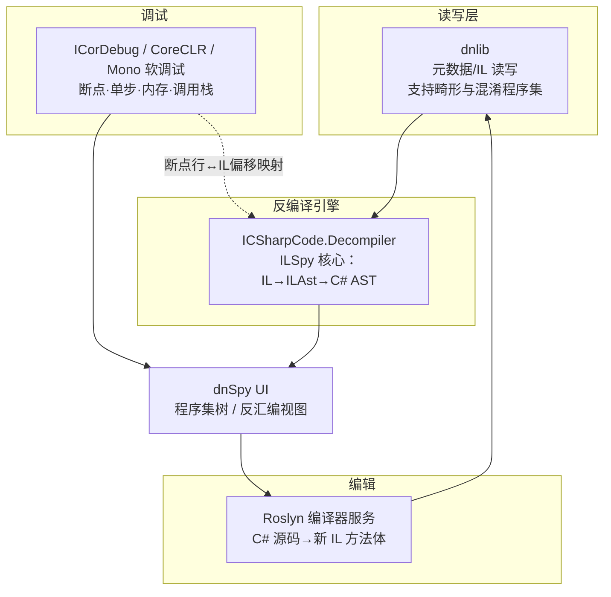
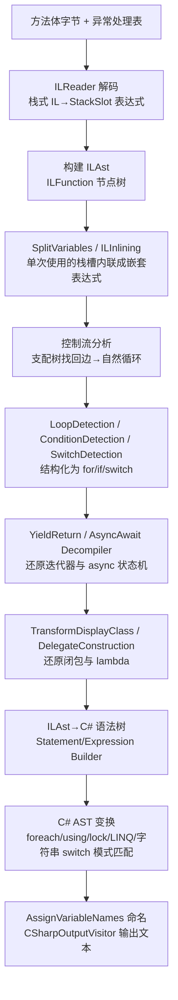

# 托管代码与字节码逆向（9）· dnSpy与ILSpy反编译实战
> [!abstract] TL;DR
> - ILSpy 是开源 .NET 反编译引擎（`ICSharpCode.Decompiler`），核心是把栈式 CIL「抬升」到 ILAst 中间树，再经支配树控制流分析与数十道变换（transform）还原成结构化 C#；dnSpy 在此引擎之上叠加 dnlib 读写、Roslyn 重编译与 ICorDebug 调试器，是「看 + 改 + 调」三合一。
> - 反编译的本质是逆转编译器的两次 lowering：把展平的求值栈还原为嵌套表达式，把 `goto`/条件分支还原为 `for`/`if`/`switch`；无源可逆是有损的，遇到任意 `goto`、异常 `filter`、混淆过的 IL 会退化成带 `goto` 的丑代码甚至直接吐 IL。
> - `async`/`await`、`yield return`、lambda 闭包、LINQ 查询语法本质都是编译器生成的状态机 / display class 语法糖，ILSpy 用专门的模式识别器（`AsyncAwaitDecompiler`/`YieldReturnDecompiler`/`TransformDisplayClassUsage`）逆向它们——所以 C# 编译器一改 lowering 规则，反编译器就得跟进升级。
> - .NET 之所以「反编译如读源码」，根因在元数据完整保留了类型系统与成员名（`TypeDef`/`MethodDef`/`Param` 表），CIL 又是带类型的高级字节码；这与原生二进制符号剥离后只剩机器码形成鲜明对照。
> - dnSpy 无 PDB 也能在反编译出的 C# 上下断点：它反编译时自建 sequence points，把源码行映射回 IL 偏移；改代码走 Roslyn 编译成新方法体，再由 dnlib 写回模块。
> - 安全边界：反编译使混淆与强名签名都不构成保密 / 完整性防线，秘密必须放服务端；调试活体 .NET 恶意样本务必隔离在断网虚拟机中，因为 dnSpy 调试时会真实执行目标代码。

## 概述与定位

在托管代码逆向的工具谱系里，dnSpy 与 ILSpy 是 .NET 阵营事实上的标准装备，地位约等于 Java 世界的 JADX、原生世界的 IDA/Ghidra。理解它们的第一步，是分清「引擎」与「外壳」这两层关系：**ILSpy 提供反编译引擎，dnSpy 复用这套引擎并把它包进一个能调试、能编辑、能重新落盘的重型工作台**。二者共享同一颗反编译心脏，却服务于不同的工作强度——ILSpy 偏「只读浏览与整程序导出」，dnSpy 偏「交互式打补丁与动态调试」。

ILSpy 诞生于 2011 年。当年 Red Gate 把老牌工具 .NET Reflector（Lutz Roeder 的作品）转为收费，SharpDevelop 团队顺势开源了 ILSpy 作为替代，它与 NRefactory（C# 语法树库）同源，这也解释了为什么 ILSpy 的输出层直接建立在一套成熟的 C# AST 之上。它的反编译核心是独立的 NuGet 包 `ICSharpCode.Decompiler`，可以脱离 GUI 单独在 CI/脚本中使用；配套的命令行 `ilspycmd`、Visual Studio / VS Code 扩展、以及基于 Avalonia 的跨平台 GUI，让它能在 Windows/Linux/macOS 一致运行。

dnSpy 由匿名作者 0xd4d 在 2015 年前后发布，它把 ILSpy 的反编译器、作者自研的元数据读写库 **dnlib**、以及一个功能完整的托管调试器缝合在一起。它最杀手级的能力是：**在没有任何 PDB 符号的情况下，直接在反编译出来的 C# 代码上打断点、单步、看局部变量**。2020 年原作者归档了 dnSpy 仓库并抹去账号，社区随即以 **dnSpyEx** 分支延续维护，补上了 .NET 5/6/7+ 的调试与更新版反编译器。今天说「dnSpy」，实务上多半指 dnSpyEx。

横向看竞品：JetBrains 的 **dotPeek** 免费且反编译质量很高，还能充当符号服务器为第三方库现场生成 PDB；Telerik 的 **JustDecompile** 已基本停更；**.NET Reflector** 仍是商业产品。但开源、可嵌入、可编辑、可调试这几条叠加起来，dnSpy + ILSpy 组合在逆向场景里几乎无可替代。本篇聚焦「IL → C# 反编译原理」「无源调试」「就地编辑并落盘」三条主线；对抗混淆器的 de4dot 属于[[10.dotNET混淆器对抗与de4dot|下一章]]，AOT/NativeAOT 让这套 IL 级工具失效的场景见[[11.dotNET-AOT与NativeAOT逆向|第 11 章]]，Unity 的 Mono/IL2CPP 特例见[[12.Unity游戏逆向：Mono与IL2CPP|第 12 章]]。

## 原理与机制

### 为什么 .NET「反编译如读源码」

要理解这两个工具为何如此强大，必须先回答一个根本问题：**为什么托管字节码能被还原得这么干净，而原生 C/C++ 二进制却只能勉强反汇编？** 答案藏在元数据里。回顾[[08.PE中的dotNET元数据与流|上一章]]：一个 .NET 程序集在 PE 里寄生着一套完整的元数据表（`TypeDef`/`MethodDef`/`Field`/`Param`/`MemberRef` 等），它以近乎「符号完整」的方式记录了类型名、方法名、字段名、参数名、可见性、泛型约束、基类接口关系。也就是说，**编译成 IL 并没有像 native strip 那样丢掉符号**。再加上 CIL 本身是带类型的高级栈式字节码——它有 `newobj`（构造对象）、`callvirt`（虚调用）、`box`/`unbox`（装箱）、`ldfld`（读字段）、泛型实例化这类语义明确的指令，而不是原生世界里「一堆 `mov`/`call` + 手工推断的调用约定」。二者相加，反编译器要恢复的信息量远小于原生反编译器：类型和名字都是现成的，只需把「控制流」和「表达式」两样结构重新拼回来。

这条对照非常关键，它解释了后续所有工作的边界：与[[23.C_C++运行时与ABI/01.运行时与ABI概览|原生运行时与 ABI]]相比，托管反编译的难点不在「猜类型、猜符号」，而在「逆转编译器 lowering」。混淆器（下一章）的全部努力，本质就是把这份「白送的元数据」破坏掉——重命名成乱码、加密字符串、打乱控制流，人为把托管代码拉低到接近原生的可读性。

### 两件工具的分工



ILSpy 只需要「读 + 反编译 + 显示」，历史上它先用 Mono.Cecil、后迁移到官方的 `System.Reflection.Metadata`（SRM）来读元数据。dnSpy 因为要**写回**并且要**扛得住混淆过的畸形程序集**，选择了 dnlib——同一位作者写的库，对损坏的元数据、混合模式（native+IL）程序集、异常的表结构容忍度极高，且提供完整的写支持。这就是为什么打补丁要用 dnSpy 而不是 ILSpy：ILSpy 的引擎负责「把 IL 变成人能读的 C#」，dnlib 负责「把改动安全地写回 PE」，Roslyn 负责「把你改的 C# 变回 IL」，调试器负责「让程序跑起来并停在你想看的地方」。

## IL 抬升到 C# 的反编译算法详解

这是全篇的核心。反编译不是「查表翻译」，而是**逆转编译器的两次有损展平**：其一，源码里的嵌套表达式 `a + b * c` 被编译器展平成一串栈操作（先压 `b`、压 `c`、`mul`、再压 `a`、`add`）；其二，源码里的 `for`/`while`/`if`/`switch` 被展平成基本块 + 条件跳转（`br`/`brtrue`/`blt`…）。反编译器要把这两样都逆回去。ILSpy 现代版本（3.0 起的「new ILAst」大重写）用一条清晰的多阶段流水线完成，下面逐段拆解。



### 第一步：栈机器 → 表达式树

CIL 是栈机器，没有寄存器概念，一切中间值都在求值栈上。反编译第一件事是**消除这个隐式的栈**。以一段简单循环为例：

```csharp
int Sum(int n) {
    int s = 0;
    for (int i = 0; i < n; i++) s += i;
    return s;
}
```

C# 编译器把它 lower 成大致如下的 IL（栈式、扁平、带标签跳转）：

```
    ldc.i4.0
    stloc.0            // s = 0
    ldc.i4.0
    stloc.1            // i = 0
    br.s   CHECK
BODY:
    ldloc.0
    ldloc.1
    add
    stloc.0            // s = s + i
    ldloc.1
    ldc.i4.1
    add
    stloc.1            // i = i + 1
CHECK:
    ldloc.1
    ldarg.1
    blt.s  BODY        // if (i < n) goto BODY
    ldloc.0
    ret
```

`ILReader` 逐条解码指令并**模拟求值栈**：每一个 `ldloc`/`ldc` 压栈会产生一个临时「栈槽」（StackSlot）节点，每一个消费栈顶的指令（`add`/`stloc`）把这些槽当作子节点连成表达式。于是 `ldloc.0; ldloc.1; add; stloc.0` 被识别为 `stloc(s, add(ldloc(s), ldloc(i)))`。随后 `SplitVariables` 把被复用的槽拆成独立的 SSA 式变量，`ILInlining` 把「只用一次」的栈槽内联进它的使用点——这一步正是把扁平栈重新折叠成 `s = s + i` 这种嵌套表达式的关键。**为什么要先做 SSA 再内联？** 因为只有确认某个中间值「产生后仅被消费一次、且中间没有副作用打断」，才能安全地把它塞进外层表达式；否则贸然内联会改变求值顺序，破坏语义。这层保守性是反编译「正确性优先于美观」原则的第一个体现。

### 第二步：控制流结构化（本阶段最难）

消除栈之后，方法体是一张由基本块和跳转边构成的**控制流图（CFG）**，但还没有 `for`/`if` 这种结构。ILSpy 在这里搬出编译原理的经典武器：**支配树（dominator tree）与自然循环识别**。算法分步是这样的——先计算每个基本块的支配关系（哪些块是必经之路）；再找**回边（back edge）**，即一条从块 B 指向「支配 B 的块 H」的边，H 就是循环头；由回边确定的「自然循环」范围被 `LoopDetection` 折叠成一个循环结构。上例中 `blt.s BODY` 跳回被 `CHECK` 支配的 `BODY`，正是一条回边，于是识别出循环；`ConditionDetection` 再把循环内外的条件跳转结构化为 `if`；最终 `HighLevelLoopTransform` 之类的变换会尝试把「初始化 + 条件 + 迭代」凑成 `for` 而非 `while`。`SwitchDetection` 则识别 `switch` 指令（跳转表）以及编译器为字符串 switch 生成的哈希 + 比较模式（`SwitchOnStringTransform`）。

**为什么这一步最脆弱？** 因为支配 / 循环识别只对「可归约（reducible）控制流」干净有效。正常 C# 编译出来的几乎都是可归约的，但手工 IL、`goto` 满天飞的代码、或被控制流混淆器打散重排的方法，会产生不可归约的图——此时 ILSpy 无法凑出漂亮的 `for`/`while`，只能退化成一堆 `goto label;`。这正是控制流混淆（下一章）的攻击面：它不改变语义，专门破坏可归约性，逼反编译器吐出面条代码。

### 第三步：还原语法糖状态机

C# 里几个「高级特性」在 IL 层根本不存在，它们是编译器用普通类 + 状态机模拟出来的，反编译器必须专门逆向。以 `async` 为例，编译器把方法体搬进一个实现 `IAsyncStateMachine` 的结构体的 `MoveNext()` 里，用一个 `int` 状态字段 + 巨型 `switch` 驱动，`await` 点被拆成「取 awaiter → 判 `IsCompleted` → 未完成则 `AwaitUnsafeOnCompleted` 并 `return`，恢复时靠状态 switch 跳回」：

```
// 编译器 lower 后的 MoveNext 骨架（简化）
switch (this.<>1__state) {
    case -1: /* 初始 */ 
        awaiter = task.GetAwaiter();
        if (!awaiter.IsCompleted) {
            this.<>1__state = 0;
            builder.AwaitUnsafeOnCompleted(ref awaiter, ref this);
            return;                 // 挂起，交还线程
        }
        goto resume0;
    case 0:  /* 恢复 */
        this.<>1__state = -1;
    resume0:
        result = awaiter.GetResult();
        ...
}
```

`AsyncAwaitDecompiler` 识别出 `AsyncTaskMethodBuilder`、状态字段、`MoveNext` 这套指纹，把 switch/goto 折回成线性的 `await task;`，并根据 builder 类型恢复原方法签名（`Task<T>` 前面补 `async`）。`yield return` 同理：编译器生成实现 `IEnumerable<T>`/`IEnumerator<T>` 的类，用 `<>2__current` 和状态机模拟惰性序列，`YieldReturnDecompiler` 把它逆回 `yield return`/`yield break`。**这里藏着反编译器维护成本的根源**：这些还原器是「按编译器的具体 lowering 模式硬编码的指纹匹配」，Roslyn 每换一版实现（比如 async 的 `AsyncStateMachineAttribute`、struct vs class 状态机、`PoolingAsyncValueTaskMethodBuilder` 等新玩法），ILSpy 就要新增对应识别逻辑；反过来，用极旧或极新编译器、甚至第三方编译器（老 Mono、F#）产出的状态机，可能落在识别盲区，反编译出半还原的状态机残骸。

### 第四步：闭包与 lambda

捕获了外部变量的 lambda，编译器会生成一个 `<>c__DisplayClass`，把被捕获的局部变量提升为该类的字段，lambda 体变成类上的方法；不捕获任何变量的 lambda 则缓存成 `<>c` 上的静态委托字段（避免重复分配）。`TransformDisplayClassUsage` + `DelegateConstruction` 逆向这套：识别 display class、把字段访问还原成对原局部变量的引用、把委托构造还原成 lambda 表达式语法。表达式树（`Expression<Func<...>>`）则又是另一套——它编译成一串 `Expression.Call`/`Expression.Constant` 的构造代码，ILSpy 也能把它还原回 lambda 形态。

### 第五步：ILAst → C# 语法树 → 文本

前面都在 ILAst（贴近 IL 的中间树）上做。到这里 `StatementBuilder`/`ExpressionBuilder` 把 ILAst 翻译成真正的 **C# 语法树**（源自 NRefactory 的 AST），然后再跑一轮**面向 C# 的高层模式变换**：`PatternStatementTransform` 把「取枚举器 + try/finally + `MoveNext` 循环」还原成 `foreach`，把「try/finally + `Dispose`」还原成 `using`，把 `Monitor.Enter/Exit` 还原成 `lock`；`IntroduceQueryExpressions` 把链式 `.Where().Select()` 还原成 LINQ 查询语法；还有 `DecimalConstantTransform`（`decimal` 常量）、`NamedArgumentTransform`、`IntroduceExtensionMethods` 等等。最后 `AssignVariableNames` 给没有名字的局部变量起名，`CSharpOutputVisitor` 把 AST 写成带缩进的文本。

**一个务必记住的实务细节**：局部变量名默认是丢失的（除非有 PDB），所以你看到的 `num`、`text`、`flag`、`array` 是 ILSpy 按类型和用途**合成**的名字；但**参数名、字段名、方法名、类型名来自元数据，是真名**（除非被混淆器改过）。这解释了为什么反编译出来的代码「方法签名很准、内部变量名很土」。这也是判断一个程序集是否被混淆的第一眼线索：如果连方法名、类型名都是 `a`、`b`、`‮` 之类，说明动过混淆，该请出 de4dot 了。

## 工具视角与实战

### ILSpy：整程序浏览、导出与批处理

ILSpy 的典型用法是「地毯式通读」。左侧加载程序集树，双击成员即时反编译；右上角可切换输出语言（C# / IL / 甚至 IL-with-C#）。三个高频操作：

- **Analyze（分析）**：右键成员选 Analyze，能列出「谁调用了它 / 它调用了谁 / 谁实例化了这个类型 / 谁读写了这个字段」。这就是托管世界的交叉引用（xref），定位「许可证校验在哪被调用」「解密函数被谁喂了密文」时极其顺手。
- **Save Code（导出为项目）**：把整个程序集反编译并保存成一个可打开的 `.csproj`，配上引用。虽然导出的代码常常不能原样重新编译（见下文陷阱），但用来在 VS/VS Code 里做全局搜索、跳转、比对版本差异非常高效。
- **`ilspycmd`（命令行）**：`ilspycmd Target.dll -o out/ -p` 可在 CI/脚本里批量反编译整个目录，`--generate-pdb` 还能为反编译结果生成 portable PDB。适合做「固件/安装包里几百个 DLL 的自动化初筛」。

### dnSpy：无源调试

dnSpy 最不可替代的能力是**无 PDB 调试**。原理前面提过：反编译时它顺手生成 sequence points，建立「反编译源码行 ↔ IL 偏移」的内存映射，于是你能在一段你从没有过源码的 C# 上直接 F9 下断点，运行时命中。工作流：`Debug → Start Debugging` 启动目标（或 `Attach to Process` 附加已运行进程），在反编译视图里下断点，命中后用 Locals/Watch/Call Stack/Modules/Threads/Memory 窗口检查状态，`Set Next Statement` 甚至能强行改变执行流。

它的调试器后端按运行时分流：.NET Framework 走 CLR 的 COM 调试接口 `ICorDebug`（`mscordbi`）；.NET Core / .NET 5+ 走 CoreCLR 对应实现（dnSpyEx 补齐）；Unity 游戏走 Mono 的**软调试协议（soft debugger）**，通常连目标进程开的调试端口。这套能力在恶意软件分析里是决定性的：很多 .NET 恶意样本在内存里**运行时解密**下一阶段载荷或 C2 地址，静态反编译只能看到密文，而 dnSpy 在解密函数返回处下断点、直接从局部变量里读出明文，一步到位——这就是「动态脱密」。

### dnSpy：就地编辑与落盘

打补丁有两条路，粒度不同：

- **Edit Method (C#) / Edit Class (C#)**：右键方法选编辑，dnSpy 弹出可编辑的 C# 源码，你改完点 Compile，它调用**宿主里的 Roslyn**把新代码编译成新的 IL 方法体，再用 dnlib 替换进模块。经典用途是把 `bool CheckLicense()` 的方法体整段替换成 `return true;`。优点是「用高级语言改逻辑」，缺点是新代码必须能对着程序集现有引用编译通过，想引入新类型/新成员会比较别扭。
- **Edit IL Instructions**：直接在指令网格里改 IL，比如把 `brtrue` 改成 `brfalse` 翻转一个判断、或把一次校验 `call` 用 `nop` 抹掉。这种「外科手术式」改动最小、最可控，适合只想反转一个跳转而不触动其余逻辑的场合。

改完 `File → Save Module`（或 Save All）由 dnlib 写回 PE。保存对话框里有几个**必须理解的选项**：是否 *Preserve Metadata Tokens*（保留元数据 token）——如果别的模块或反射代码是按 token 引用成员的，打乱 token 会导致运行崩溃，此时必须勾上；是否保留原始 RVA / 堆顺序等，同理是为了让改动尽量「最小扰动」，避免连锁破坏。

### 陷阱与边界（务必内化）

- **反编译结果常常不能重新编译**。反编译器目标是「让人读懂」，不是「产出可构建工程」；它会生成 C# 里非法但语义正确的构造（内部名冲突、无法表达的 IL、`goto` 迷宫）。把导出项目当只读参考，别指望一键 rebuild。
- **强名签名会失效**。改过的程序集，其强名（strong name）哈希对不上，加载时若开启强名校验会拒载。但要清醒：**强名从来不是安全边界**，它可被整段剥离；它只是版本/身份标识。真正的完整性校验是 Authenticode 数字签名——篡改会使签名失效，但 CLR 加载器默认并不强制验签。
- **混合模式与 AOT 挡路**。含 native 代码的混合模式程序集无法被 IL 工具完整往返；NativeAOT 编译出的更是原生机器码，`ICSharpCode.Decompiler` 直接失效——那属于[[11.dotNET-AOT与NativeAOT逆向|第 11 章]]用 IDA/Ghidra 的战场。
- **反调试与反 dnSpy**。样本可能检测 `Debugger.IsAttached`、`IsDebuggerPresent`、时间差、甚至扫描进程名里有没有 `dnSpy`。对策是先在 IL/C# 层把这些检测点 `nop` 掉或改成常量返回，再开调。
- **反篡改校验**。有些保护方案会在运行时对方法体算校验和，你一改就自爆——需要先定位并中和校验逻辑。

## 安全性与正确使用

**对防守方**：这两件工具最重要的安全启示是「**托管代码里没有秘密**」。既然完整元数据白送、IL 又能几乎无损地还原成 C#，那么任何写死在客户端程序集里的东西——API 密钥、加密密钥、许可证算法、内部接口协议——都应视为「已公开」。混淆（下一章）只能提高阅读成本、拖慢分析，绝不能当作机密性或授权的最后防线：主流商用混淆多数能被 de4dot + ILSpy/dnSpy 组合还原到可读。正确姿势是把敏感逻辑与校验放到**服务端**，客户端只做无秘密可泄的展示；需要强完整性时用 **Authenticode 签名**（而非强名），并在关键路径做服务端态度验证；要显著抬高逆向门槛，可考虑 NativeAOT 把 IL 抹成原生码（代价与局限见第 11 章）。

**对分析方**：dnSpy 调试恶意样本时会**真实执行目标代码**——下断点、单步意味着进程在跑。因此活体分析必须在**隔离、断网、可快照回滚的虚拟机**中进行，分析前打快照、分析后还原，切勿在宿主机或有内网连通性的环境里直接跑样本。此外要注意工具自身的供应链：dnSpy 原仓库已归档，网上流传大量不明来源的构建，应只从可信的 **dnSpyEx** 官方发布获取，避免「分析恶意软件的工具本身带毒」。

**关于合法性**：反编译在不同司法辖区、不同许可协议下的合法性并不一致——为互操作性和安全研究进行的逆向，与违反 EULA、侵犯版权或规避技术保护措施之间存在明确红线。本篇讲的是机制与自查手段，实际动手前应确认你对目标程序集拥有分析授权（自研代码审计、已获授权的安全评估、或法律允许的互操作研究）。工具是中立的，用途决定性质。

## 小结

dnSpy 与 ILSpy 的威力，根子上来自 .NET「元数据 + 高级字节码」的可逆性：类型和名字是白送的，反编译器只需逆转编译器对表达式与控制流的两次展平。ILSpy 的引擎把这件事拆成清晰的流水线——`ILReader` 消栈成表达式、支配树识别循环与分支、专用识别器还原 async/yield/闭包、C# AST 层做 foreach/using/LINQ 的高层模式匹配、最后合成变量名输出文本；每一步都以「正确性优先」的保守策略推进，也因此在遇到 `goto` 迷宫、异常 `filter`、混淆或非常规编译器产物时会优雅降级为带 `goto` 的原始形态。dnSpy 在此之上，用 dnlib 扛住畸形程序集的读写、用 Roslyn 让你以 C# 粒度打补丁、用 ICorDebug/Mono 软调试实现无源断点与动态脱密，把「看懂 → 改掉 → 跑起来验证」合成一条闭环。掌握了它们的原理边界，你才能在反编译结果可疑时判断「是被混淆了」还是「反编译器降级了」，并据此决定下一步是请出 de4dot、切到动态调试、还是干脆转战原生工具。

## 相关阅读

- 同系列前置：[[07.dotNET-CLR与CIL执行模型]]（CIL 栈机器与执行语义，理解反编译逆转的对象）、[[08.PE中的dotNET元数据与流]]（元数据表与流，dnlib/SRM 所读的底层结构）
- 同系列后续：[[10.dotNET混淆器对抗与de4dot]]（当反编译退化时的救场）、[[11.dotNET-AOT与NativeAOT逆向]]（IL 工具失效后的原生战场）、[[12.Unity游戏逆向：Mono与IL2CPP]]（Mono 软调试与 IL2CPP 的特例）
- 原生对照：[[23.C_C++运行时与ABI/01.运行时与ABI概览]]（原生 ABI 剥符号后为何难以还原，反衬托管元数据的可逆性）
- 格式前置：[[13.PE文件详解/07-详解PE文件(七)：数据目录]]（.NET 元数据如何寄生在 PE 的数据目录中）
- 同族参考：[[35.Android逆向与运行时/03.DEX文件格式]]（另一套带类型的托管字节码/寄存器机对照）、[[40.WASM与虚拟化壳逆向/02.WASM指令集与执行模型]]（又一种栈式字节码的反编译对象）
- 官方与规范：ECMA-335《Common Language Infrastructure》（CIL 与元数据权威规范）；ILSpy 官方仓库 `icsharpcode/ILSpy` 与 `ICSharpCode.Decompiler` 文档；dnSpyEx 官方仓库 `dnSpyEx/dnSpy`；dnlib 仓库 `0xd4d/dnlib`；.NET 托管调试接口 `ICorDebug` 官方文档；Roslyn 编译器 API 文档

[[00.托管代码与字节码逆向总览|⬆ 系列总览]] | [[08.PE中的dotNET元数据与流|← 上一章]] | [[10.dotNET混淆器对抗与de4dot|→ 下一章]]
