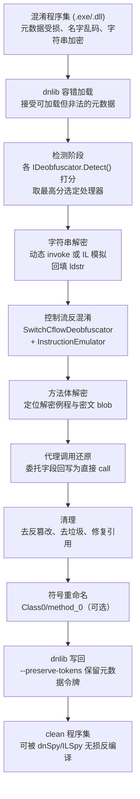
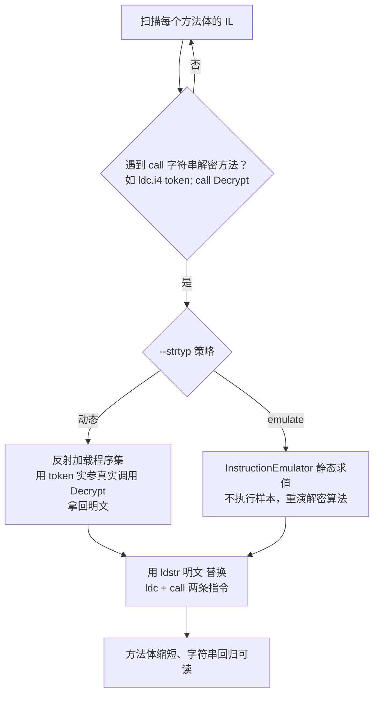
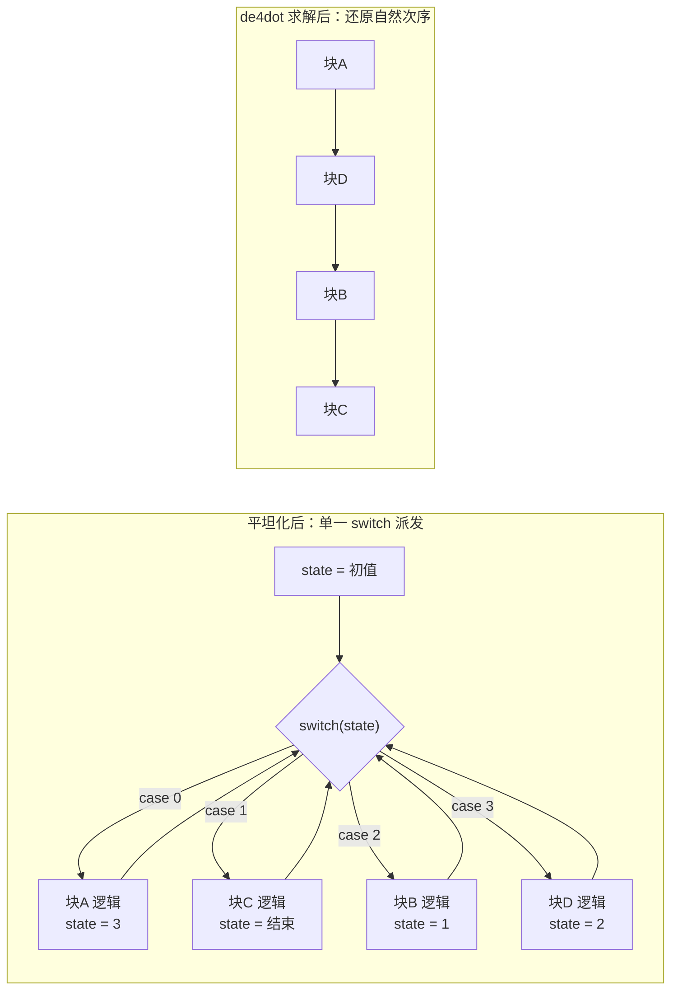
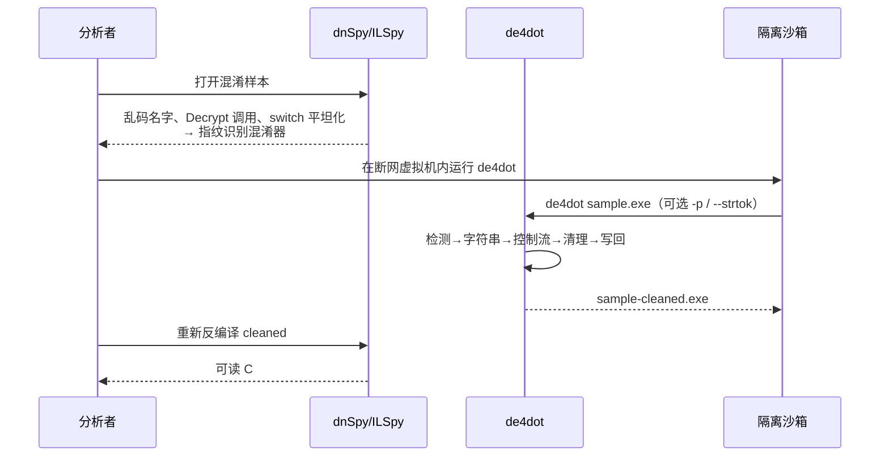

# 托管代码与字节码逆向（10）· dotNET混淆器对抗与de4dot

> [!abstract] TL;DR
> - de4dot 与 dnSpy 同出 0xd4d 之手，底座都是容错元数据库 dnlib；它专治「托管层」混淆——重命名、字符串加密、控制流平坦化、代理调用、方法体加密，但不反虚拟化、不脱原生壳。
> - 字符串解密的精髓是「借刀」：不重写混淆器的 RC4/XOR/AES，而是反射动态调用它自己的 `Decrypt(token)` 拿回明文，再把 `ldc + call` 回填成 `ldstr`；代价是执行样本，必须断网沙箱。
> - 控制流平坦化的本质是把基本块图压成一个 `switch` 状态机；de4dot 用 InstructionEmulator 反向求解状态变量常量，把派发还原成直接跳转，死代码消除后迭代到不动点。
> - 脱壳要分层看：cctor 里解密方法体、anti-tamper 校验属于托管层，de4dot 或社区工具可静态处理；原生 stub 打包 + JIT 按需解密（NecroBit 等）超出静态范畴，归 [[15.托管代码脱壳与运行时dump]]。
> - de4dot 的天花板是 VM 虚拟化混淆（Eazfuscator/Agile 的自定义字节码解释器）与最新版商业壳：它只自动对抗「规则化混淆」，遇到 VM 需专用 devirtualizer。
> - 反混淆是「分析」不是「破解」：全程防御/教育视角，仅限授权样本与 CTF；动态解密要执行样本，其风险与合规边界必须先于技术考虑。

## 概述与定位

### de4dot 是什么，为什么它能存在

de4dot 是一个开源的 .NET 反混淆器与有限脱壳器，作者是 0xd4d——同一个人写了 dnlib（.NET 元数据读写库）和 dnSpy（反编译/调试器，见 [[09.dnSpy与ILSpy反编译实战]]）。这条「同源」关系不是花边：de4dot 的一切能力都建立在 dnlib 对畸形元数据的容错读写之上，而 dnSpy 又内嵌了 de4dot 的控制流反混淆代码作为编辑器功能。理解这三者的分工，是理解托管代码对抗全景的第一步：**dnlib 负责「即使非法也能读进来、改完还能写回去」，dnSpy/ILSpy 负责「把 IL 还原成可读的 C#」，de4dot 负责「在读与写之间，把混淆器加的那层噪声自动剥掉」**。

de4dot 之所以能作为一个「通用」工具存在，根源在于 .NET 平台的两个先天特性。其一，托管程序集是**自描述**的：类型、方法、字段、签名、字符串都以结构化元数据的形式存放在 PE 里的 `#~`/`#Strings`/`#US`/`#Blob`/`#GUID` 等流中（详见 [[08.PE中的dotNET元数据与流]]），IL 又是高度规整的栈式字节码（[[07.dotNET-CLR与CIL执行模型]]）。这意味着反编译几乎无损，代码逻辑对分析者几乎透明——于是混淆成了商业软件保护 IL 的**唯一防线**。其二，正因为混淆是「加在规整结构之上的规则化变换」，它本身也是规则化的、可被反向识别和撤销的。de4dot 的整个设计哲学就是：把市面上有限的几十款商业/开源混淆器逐一「指纹化」，对每一款写一个针对性的撤销器。

### 在系列中的位置：输入、输出与边界

| 维度 | 与本篇的关系 | 关联章节 |
|---|---|---|
| 前置：元数据与流 | 混淆器攻击的正是 `#US`/`#~` 等流；不懂流就看不懂它改了什么 | [[08.PE中的dotNET元数据与流]] |
| 前置：CIL 执行模型 | 字符串解密、控制流还原都在 IL 指令层操作 | [[07.dotNET-CLR与CIL执行模型]] |
| 协作：反编译器 | de4dot 清洗前后都要靠 dnSpy/ILSpy 观察效果 | [[09.dnSpy与ILSpy反编译实战]] |
| 下游：运行时脱壳 | 原生壳、JIT 按需解密、VM 超出静态范畴，转运行时 dump | [[15.托管代码脱壳与运行时dump]] |
| 平台外延：AOT | NativeAOT 把托管代码编成原生码，本篇技术几乎失效 | [[11.dotNET-AOT与NativeAOT逆向]] |
| 横向对照：JVM 反混淆 | 同一套混淆母题在 Java 侧的映射与差异 | [[06.Java混淆与反混淆]] |

上一篇把 dnSpy/ILSpy 当作「读」的工具讲透，本篇讨论的是当「读」出来的是一堆乱码名字、`Decrypt(0x1234)` 调用和 `switch` 迷宫时，如何自动把它变回人能读的样子。下一篇的 NativeAOT 是另一个极端——代码已经不是 IL 了，本篇的所有招式基本失效，逆向要退回原生反汇编。而 [[15.托管代码脱壳与运行时dump]] 则接手本篇处理不了的「必须让程序跑起来才能拿到明文」的场景。

### 混淆手法全景：分层看清对手

要谈对抗，先给对手分层。一款成熟的 .NET 混淆器/保护壳通常叠加多种手法，从「浅」到「深」大致是：

- **符号重命名（renaming）**：把有意义的类型/方法/字段名换成单字符、Unicode 混淆字符或不可打印字符。这是最普遍也最浅的一层，破坏的是可读性而非逻辑。
- **字符串加密（string encryption）**：把 `ldstr "..."` 替换成对解密方法的调用，明文只在运行时出现。
- **控制流混淆（control flow）**：平坦化、不透明谓词、假分支、块打散，破坏 CFG 的自然结构。
- **代理/委托调用（reference proxy）**：把直接 `call Foo()` 改成经由委托字段间接调用，隐藏真实调用关系。
- **方法体加密（method encryption）**：IL 被加密存放，运行时由 cctor 或 JIT 钩子解密。
- **反篡改/反调试（anti-tamper / anti-debug）**：校验和自校验、检测调试器与 dump。
- **虚拟化（virtualization）**：把 IL 翻译成私有字节码，由内嵌 VM 解释执行——最深、也是 de4dot 的天花板。

de4dot 能自动处理前五层里「规则化」的绝大部分，能识别并移除相当一部分反篡改；对虚拟化则基本无能为力。认清这条能力边界，比记住任何命令行都重要。

## 原理与机制

### 端到端流水线

de4dot 处理一个程序集是一条固定的流水线：容错加载 → 检测选型 → 逐阶段撤销 → 写回。



### 为什么 dnlib 的容错是一切的前提

普通的 .NET 元数据库（如早期 Mono.Cecil）假设程序集是「合法」的：表按顺序排列、堆偏移有效、令牌互相自洽。混淆器恰恰专门制造「**能被 CLR 加载、却不满足这些假设**」的元数据来噎住工具——比如故意用 `#-`（非优化）堆代替 `#~`、插入无效或重叠的表行、把方法 RVA 指向节外、让字符串堆里塞入非法 UTF-16。CLR 的加载器出于历史宽容会照单全收，Cecil 却在解析阶段就抛异常，导致工具连打开都做不到。

dnlib 从设计之初就以「读得进任何 CLR 读得进的东西」为目标：它对越界偏移、错序表、畸形签名做防御性解析，读不出来就退化成惰性/空值而非崩溃，写回时又能按需重建一份干净或按原样保留的元数据。**这就是为什么很多程序集别的工具连加载都失败，de4dot 却能处理**——不是它的算法多神，而是它站在一个能容忍畸形的地基上。这一点也解释了为什么 de4dot 和 dnSpy 必须共享同一个底层库：只有 dnlib 这种容错读写，才撑得起「改完再存回去仍可运行」的往返需求。

### 检测：打分选型机制

de4dot 内部为每款支持的混淆器实现一个 `IDeobfuscator`。加载程序集后，它让每个 `IDeobfuscator.Detect()` 对样本打分：匹配到该混淆器的特征（特定的属性名如 `SuppressIldasmAttribute` 变体、注入类型的名字模式、`<Module>` 里特定形态的解密方法、节名、版本字符串等）就累加分值。最后 de4dot 选**得分最高**的那个处理器接管。这套机制的巧妙在于：它把「识别是哪款混淆器」变成一个可叠加、可比较的启发式过程，既容忍单个特征被改动，又能在多款混淆器特征并存时择优。若全都打不出分，则落到通用（generic/unknown）处理路径，只做与具体混淆器无关的通用清理（如通用控制流化简、通用字符串解密尝试）。

### 各撤销阶段与写回

选定处理器后，各阶段按依赖顺序执行：**先解字符串**（后续控制流分析可能依赖字符串常量）、**再化简控制流**、**解密方法体**、**还原代理调用**、**清理反篡改与垃圾**、**最后重命名**。收尾由 dnlib 的 `ModuleWriter` 把改写后的模块序列化成新程序集。

这里有一个容易被忽视却极关键的开关：**元数据令牌保留**（`--preserve-tokens`）。混淆代码里常有靠反射按令牌取成员（`ResolveMethod(0x06000123)`）或依赖 `#US` 令牌取字符串的逻辑；一旦 de4dot 重排了元数据表，令牌就变了，这类代码在「清洗后」的程序集里会指错目标而崩溃。保留令牌让写回尽量维持原有表结构与令牌编号，是保证清洗产物仍可运行/仍可对照调试的必要条件。代价是产物体积更大、更不「干净」，所以它默认关闭，需要时手动开。

## 三大对抗技术详解：字符串解密、控制流平坦化与脱壳

本篇的三个种子——字符串解密、控制流平坦化、脱壳——恰好覆盖了托管层混淆从「浅」到「深」的三个代表。下面逐一把原理拆开。

### 一、字符串解密：借混淆器自己的刀

**混淆形态**。原始的 `ldstr "SELECT * FROM Users WHERE Id="` 在混淆后会变成对一个解密方法的调用，参数是一个令牌、索引或偏移：

```
// 混淆后：字面量被替换为解密调用
IL_0001: ldc.i4     0x70000123        // #US 堆令牌 / 索引 / 密文偏移
IL_0006: call       string '<Module>'::Decrypt(int32)
IL_000b: stloc.0
```

解密方法内部可能是 XOR、RC4、AES，也可能是从一段压缩+加密的资源 blob 里按索引取出再解。明文只在运行时短暂出现，静态反编译只能看到一串 `Decrypt(0x...)`。

**de4dot 的核心思路——动态调用**。这里有一个关键洞察：*我们没必要去重新实现混淆器的加密算法*。混淆器为了让程序能跑，必然把可用的解密方法完整地留在程序集里。那么最省事、最鲁棒的办法就是**把这个解密方法当成一个普通函数，用它给的每个令牌参数真实地调用一次，拿回明文**。de4dot 默认就这么干：它通过反射把（可能只加载必要部分的）程序集加载起来，定位解密方法，对 IL 里出现的每一处 `Decrypt(token)`，用对应的 `token` 实参真实 invoke，得到明文字符串，再把 `ldc + call` 两条指令替换成一条 `ldstr 明文`：

```
// de4dot 回填后：还原为原始字面量
IL_0001: ldstr      "SELECT * FROM Users WHERE Id="
IL_0006: stloc.0
```

这套「借刀」思路的威力在于**对加密算法完全不可知**——无论混淆器用的是自研流密码还是标准 AES，只要它的解密方法能被调用，de4dot 就能拿到明文。这也是它比「为每种算法写静态解密器」通用得多的根本原因。



**代价与静态替代**。动态调用的致命代价是：**它要执行样本代码**。对恶意样本，这等于在你的机器上运行了它的一部分——解密方法里完全可以夹带反制逻辑。因此动态解密必须在**断网、可回滚的隔离沙箱**里进行（详见安全章节）。为回避执行，de4dot 提供 `--strtyp emulate`：改用内置的 `InstructionEmulator` **静态模拟** IL 指令，在不真正运行样本的前提下重演解密算法的求值过程。它能覆盖由算术、位运算、栈操作、常量加载构成的「纯计算型」解密器；一旦解密逻辑触及堆对象、字段状态、平台调用或真正的密码学库，模拟器就力不从心，只能退回动态调用。

**辅助定位**。当解密方法藏得刁钻、自动检测认不出时，用户可以用 `--strtok 0x06000042` 直接告诉 de4dot 解密方法的元数据令牌，配合 `--strtyp` 指定策略。三种寻址（令牌 / 索引 / 偏移）本质相同：都是「一个 int 参数唯一确定一个明文」，de4dot 只关心「给这个 int 能换回什么字符串」。

### 二、控制流平坦化：把状态机解回自然次序

**混淆形态**。控制流平坦化（control flow flattening）是最具代表性的控制流混淆：它把一个方法原本自然的基本块图（if/while/顺序）**压平成一个巨大的 `switch` 派发器**。每个原始基本块被塞进 `switch` 的一个 case，块尾不再直接跳向后继，而是把一个「状态变量」改写成后继块的编号，再无条件跳回派发器；派发器根据状态变量决定下一个执行哪个 case。于是所有块在源码层「平级」地挂在一个 `switch` 下，块与块之间的真实先后关系被状态变量的赋值隐藏起来，人眼几乎无法顺出原始逻辑。

```
// 平坦化：每个原始块尾部改写 state，跳回派发器
.locals (int32 state)
IL_0000: ldc.i4     2
IL_0001: stloc      state
IL_0003: br         DISPATCH
DISPATCH:
IL_0008: ldloc      state
IL_000a: switch     (CASE_0, CASE_1, CASE_2, CASE_3)
IL_0020: br         DISPATCH          // default：死循环或垃圾块
CASE_2:
  // ... 原块 B 的真实逻辑 ...
  ldc.i4     1
  stloc      state                    // 声明「下一个去 CASE_1」
  br         DISPATCH
```

**de4dot 的还原思路——静态求解状态**。关键观察：如果每个块尾写入状态变量的值都是**编译期可确定的常量**，那么整个 `switch` 迷宫其实是一张静态可解的跳转表。de4dot 在 `de4dot.blocks` 命名空间里把方法 IL 建成基本块图（`Block`/`Blocks`/`ScopeBlock`/`MethodBlocks`），然后用 `SwitchCflowDeobfuscator` 配合 `InstructionEmulator` 做这件事：对每个跳向派发器的块，**反向沿数据流求解它写给状态变量的常量**；求出来后，就知道这个块的真实后继是哪个 case，于是把「改状态 + 跳派发器」直接**替换成一条通往目标块的直接跳转**。当所有块的后继都被直连后，那个 `switch` 派发器和状态变量就成了没人再引用的死代码，由死代码消除（`DeadCodeRemover`）与死存储消除（`DeadStoreRemover`）清掉。整个过程**迭代到不动点**：每消一轮可能暴露出新的可解常量，直到无法再化简。



**不透明谓词与假分支**。同一个模拟器还负责消解不透明谓词（opaque predicate）——那些「看起来是条件跳转、实则恒真或恒假」的分支。de4dot 用 `InstructionEmulator` 对条件表达式求值，若结果是常量，就把条件分支替换成无条件跳转（或直接删掉走不到的那条边），再把因此变得不可达的块整片摘除。假分支、注入的垃圾块由此被大面积清理。

**边界与失败模式**。这套方法的命门是「**状态必须静态可求**」。一旦混淆器让状态变量的取值依赖运行时输入、依赖字段/堆状态、或经由平台调用与真正的密码学变换产生（例如把状态藏进一个每次不同的加密序列里），`InstructionEmulator` 就求不出常量，平坦化也就还原不了。此外，`InstructionEmulator` 只是「够用的」IL 子集模拟器而非完整 CLR，遇到它不认识的指令组合会保守地放弃该处化简。因此 de4dot 对「简单/规则化」的平坦化几乎完美，对「状态运行时化」的高级平坦化则束手——这正是新版商业壳刻意堆料的方向。

### 三、脱壳：分清「托管层加密」与「原生壳」

「脱壳」在 .NET 语境里是个被滥用的词，必须拆成两层，否则会用错工具。

**托管层：方法体加密与 anti-tamper**。第一层是仍在托管世界内的方法体加密：IL 被加密后存放，运行时由某段托管代码解密。最典型的是模块静态构造器 `<Module>::.cctor`（或注入的初始化方法）在程序启动、任何业务代码执行前，把密文方法体解密回内存。ConfuserEx 的 anti-tamper「normal」模式就是这套路：

```
模块 .cctor（注入）:
  1. 定位 PE 中存放密文方法体的自定义节（按节名/RVA）
  2. 以整节数据的哈希派生密钥种子（任一字节被改 → 种子变 → 解密出垃圾）
  3. 用自定义 PRNG 生成密钥流，逐方法 XOR 解密 IL
  4. VirtualProtect 把内存页改为可写，把明文 IL 写回各方法原 RVA
  5. JIT 随后编译到的已是明文；校验和顺带充当反篡改
```

这一层里，密钥「派生自整节哈希」是精心设计的**反篡改**：你只要改动任何一个字节（包括 de4dot 重写元数据本身），种子就变，解密全盘出错——所以对这类保护，纯静态重写往往连「让它还能跑」都做不到，必须把 anti-tamper 逻辑一并识别并移除，或干脆换思路：**让 cctor 自己跑一次解密，再从内存把明文方法体 dump 出来**。de4dot 原版内建支持若干商业壳的方法体解密，但对 ConfuserEx 这类它「出生时还不流行」的开源壳支持有限，实践中要靠 de4dot 的社区分支（如带 ConfuserEx 支持的 de4dot-cex）或专用工具，按 `anti-tamper → 常量(字符串/数字) → 控制流 → 代理` 的顺序逐层剥。ConfuserEx 还有更硬的「JIT」anti-tamper 模式：**挂钩 CLR JIT 的 compileMethod，按需在编译瞬间解密单个方法**——密文从不整体落地，静态更难，几乎只能运行时 dump。

**原生壳：超出静态范畴**。第二层是真正的「壳」：一个**原生 stub**（非托管 PE）把加密的托管负载包在里面，运行时解密并通过 CLR 宿主接口把托管镜像加载进内存。.NET Reactor 的 native 模式、以及把 IL 编成私有格式由原生运行时解码的 NecroBit，都属此类。对这一层，de4dot 这种「读元数据—改 IL—写元数据」的静态工具**根本无从下手**，因为磁盘上压根没有一份完整、合法的托管程序集可读。正确做法是让它跑起来、在 CLR 把托管镜像映射进内存后从进程里 dump，再修复。这已经是 [[15.托管代码脱壳与运行时dump]] 的主场，本篇到此划界：**de4dot 治托管层的规则化混淆，运行时 dump 治原生壳与 JIT 按需解密**。

## 工具视角与实战

### 命令行速查

de4dot 的默认行为极简：喂一个文件，它自动识别、自动清洗，产出 `-cleaned` 版本。

```
# 自动识别 + 清洗，产出 sample-cleaned.dll
de4dot sample.dll

# 强制指定混淆器预设（识别失败或想覆盖时），预设名见 de4dot -h
de4dot -p <preset> sample.dll

# 手动指定字符串解密方法令牌与策略（自动认不出解密方法时）
de4dot --strtyp emulate --strtok 0x06000042 sample.dll

# 只做控制流反混淆，保留原名与元数据令牌（要保持可运行/可对照时）
de4dot --only-cflow-deob --dont-rename --preserve-tokens sample.dll

# 递归处理整个目录
de4dot -r ./bin -ro ./bin-clean
```

几个开关的取舍要点：`--dont-rename` 在你想保留混淆器留下的（哪怕难看的）名字、或担心重命名破坏反射按名取成员时使用；`--preserve-tokens` 在产物需要继续运行或需要与原样本按令牌对照调试时几乎必开；`--only-cflow-deob` 用于「其它层不想动、只想把控制流理顺」的精修场景。要注意：de4dot 默认的动态字符串解密会**真实加载并执行**样本的解密方法，所以运行 de4dot 本身就可能触发样本代码——这条必须在沙箱里做。

### 三步 triage 工作流

实战里 de4dot 从不单打独斗，它嵌在「识别—清洗—复核」的闭环中间：



第一步用 dnSpy/ILSpy（或 Detect It Easy、ExeInfoPE 之类的指纹工具）先看「长什么样」：满屏单字符名、`<Module>` 里可疑的 `Decrypt`、方法体是 `switch` 迷宫，基本就能猜到混淆家族。第二步在沙箱里跑 de4dot。第三步把 `-cleaned` 产物重新丢回 dnSpy 复核——**反混淆的正确性永远以「重新反编译后人能读懂、逻辑自洽」为准**，不能盲信工具「跑完没报错」。

### 混淆器识别特征与 de4dot 支持度

| 混淆器 | 典型手法 | de4dot 支持 | 备注 |
|---|---|---|---|
| Dotfuscator | 重命名 + 控制流 + 字符串加密 | 良好 | 商业老牌，规则化强 |
| SmartAssembly（Red Gate） | 重命名 + 字符串 + 控制流 + 资源压缩 | 良好 | 常见于商业组件 |
| Crypto Obfuscator | 字符串 + 控制流 + 反篡改 | 良好 | de4dot 有专门处理器 |
| Eazfuscator.NET | 早期：字符串/控制流；新版：VM 虚拟化 | 部分 | 新版 VM 需 eazdevirt |
| .NET Reactor | 字符串 + 控制流 + 方法加密 + 原生壳/NecroBit | 部分 | native/NecroBit 转运行时 dump |
| Agile.NET（CliSecure） | 方法加密 + VM | 部分 | VM 部分不可反 |
| ConfuserEx（开源） | anti-tamper + 常量 + 控制流 + 代理 | 原版弱/无 | 靠 de4dot-cex 等社区分支 |

这张表的读法不是「查工具支持谁」，而是**理解 de4dot 支持度的深层规律**：凡是「规则化的托管层变换」它就强，凡是「虚拟化」或「原生壳」它就弱或无。支持度高低本质上是「该手法是否静态可撤销」的映射。

### ConfuserEx 的特殊性

ConfuserEx 值得单独一提：它是最流行的开源 .NET 混淆器，恰好又是 de4dot 原版的弱项（de4dot 的活跃开发早于 ConfuserEx 走红且后来停滞）。对它的实战路径是社区化的：用带 ConfuserEx 支持的 de4dot 分支，或用专门的 ConfuserEx 脱壳/常量解密工具，或在 dnSpy 调试器里让 anti-tamper 的 cctor 跑完再 dump。剥离顺序有讲究——**必须先去 anti-tamper**（否则一动其它层，整节哈希变、方法体解密全崩），再依次处理常量（字符串/数字）保护、控制流、代理调用。顺序错了，前功尽弃。

### 失败模式清单

- **新版本**：混淆器升级了标记或算法，de4dot 的检测特征失配 → 认不出、或认出了却撤不干净。
- **VM 虚拟化**：方法被翻译成私有字节码，de4dot 不反虚拟化 → 只能看到一个解释器循环。
- **anti-de4dot**：混淆器专门检测 de4dot 的重写痕迹（令牌变化、特定改写模式），或用「状态运行时化」的控制流让 `InstructionEmulator` 求不出常量。
- **目标框架缺失**：动态字符串解密要真实加载程序集，本机若没有样本所需的运行时/依赖，加载即失败 → 退回 `--strtyp emulate` 或手动 dump。
- **过度重命名副作用**：重命名可能撞上反射按名取成员的代码 → 加 `--dont-rename`。

### de4dot 的天花板：虚拟化与横向对照

当遇到 Eazfuscator 新版或 Agile.NET 的 VM，de4dot 到头了：它能把外围的字符串/控制流理顺，但方法核心逻辑是一段私有字节码，得靠专用 devirtualizer（如针对 Eazfuscator 的 eazdevirt）先把私有字节码翻译回 IL。理解 VM 混淆的心智模型，可横向参考 [[14.Lua与LuaJIT字节码逆向]] 里对字节码解释器的剖析，以及 [[40.WASM与虚拟化壳逆向/02.WASM指令集与执行模型]] 对「取指—译码—派发」解释器骨架的讲解——.NET 的 VM 壳与它们同构，反虚拟化的本质都是「把解释器的 handler 表映射回原语义」。

**与 JVM 侧的横向对比**（呼应 [[06.Java混淆与反混淆]]）：字符串加密、控制流平坦化、反射代理这三大母题在 Java 与 .NET 完全同构——Zelix KlassMaster 的 flow obfuscation 对应 .NET 的控制流平坦化，Java 的字符串加密对应 .NET 的字符串解密方法。但**工具生态截然不同**：.NET 有 de4dot 这样一个近乎「通用」的当家工具，Java 侧却是 Java-Deobfuscator、Threadtear 等多个各管一段的工具并存。深层原因有二：其一，.NET 只有单一、强类型的元数据模型，IL 经 dnlib 能几乎无损往返改写，「读—改—写」闭环稳固；JVM 有多个字节码版本、class 结构相对松散（可与 [[35.Android逆向与运行时/03.DEX文件格式]] 的 DEX 差异对照理解），通用往返更难。其二，.NET 商业混淆器市场有限且各留指纹，逐一撤销可行；Java 混淆器更碎片化。这解释了为什么「一个 de4dot 打天下」在 .NET 成立，在 Java 却难以复制。至于原生世界为何完全没有类似的「通用反混淆器」，可对照 [[23.C_C++运行时与ABI/01.运行时与ABI概览]]：原生二进制丢失了类型与结构化元数据，托管代码那种「无损往返」的前提根本不存在。

## 安全性与正确使用

> [!caution] 合规边界（务必先读再动手）
> 反混淆与脱壳能力只能用于**你拥有或已获明确授权**的程序集、**CTF 靶场**、以及正当的**安全研究与恶意样本分析**。本篇全部内容立足**防御与教育**视角：讲清原理是为了让防守方理解保护的极限、让分析者能拆解可疑样本，**绝不为绕过他人软件的商业授权、许可证校验或版权保护提供成品配方**，也不针对任何真实生产系统或他人系统给出武器化步骤。de4dot 的默认字符串解密会**真实执行样本代码**，对未知/恶意样本必须在**断网、可快照回滚的隔离虚拟机**里运行，切勿在生产主机或联网环境直接跑。反混淆产物仅用于分析，不得再分发。

把上面的红线展开几点：

**动态执行的风险要先于技术考虑**。de4dot 动态解密字符串、以及「让 cctor 跑一次再 dump」这类手法，本质都是**运行未知代码**。恶意样本完全可能在解密方法或 cctor 里夹带反分析、勒索、横向移动逻辑。因此隔离沙箱不是可选项而是前置条件：独立虚拟机、断网、禁用共享目录、事后回滚快照。能用 `--strtyp emulate` 静态模拟就优先静态，把「必须执行」的面缩到最小。

**「分析」与「破解」的法律与道德分界**。技术上，撤销字符串加密和撤销授权校验用的是同一套 IL 操作；但用途决定性质。分析恶意软件、研究漏洞、为兼容/互操作理解自有或授权的组件、验证自己代码的混淆强度，都是正当用途。反过来把这些能力用于剥离他人商业软件的授权保护、去除水印后再分发，则可能同时触犯著作权法、软件许可协议与反规避条款（如各法域的 DMCA 类规定）。**动手前先确认你对目标程序集有分析的权利。**

**给防守方的对称结论**。理解 de4dot 的能力边界，反过来就是一份「混淆选型指南」：仅靠重命名和字符串加密几乎挡不住 de4dot 一条命令；真正抬高静态对抗成本的是「状态运行时化的控制流」「JIT 按需解密」「VM 虚拟化」这些让静态求解失效的手法。但要清醒——**混淆只延缓、不阻止**：只要代码最终要在 CLR 上执行，运行时 dump（[[15.托管代码脱壳与运行时dump]]）这条路始终存在。把核心机密逻辑放到服务端、或用真正的加密与硬件信任根，才是比混淆更根本的防线。

## 小结

de4dot 是「规则化托管混淆」的自动清洗机：它以 dnlib 的容错读写为地基，用打分选型认出混淆家族，再分阶段撤销——字符串解密靠「借混淆器自己的解密方法动态 invoke，或用 InstructionEmulator 静态模拟」，控制流平坦化靠「反向求解 `switch` 状态常量、直连基本块、死代码消除、迭代到不动点」，托管层脱壳靠「识别并移除 anti-tamper、静态解密方法体」。要牢牢记住三条边界：一是 de4dot 只治**托管层**，原生壳与 JIT 按需解密属运行时 dump 的范畴；二是它只对**静态可求解**的混淆有效，状态运行时化会让它失手；三是它**不反虚拟化**，VM 壳需专用 devirtualizer。用它时的纪律同样清晰——动态解密要执行样本，务必沙箱隔离，且全程守住「分析而非破解」的合规红线。

## 相关阅读

- [[07.dotNET-CLR与CIL执行模型]] · 字符串解密与控制流还原都在 IL 层操作，需先懂 CIL
- [[08.PE中的dotNET元数据与流]] · 混淆器攻击的正是 `#US`/`#~` 等流，是理解「改了什么」的前置
- [[09.dnSpy与ILSpy反编译实战]] · 清洗前识别、清洗后复核的观察工具，与 de4dot 同源
- [[11.dotNET-AOT与NativeAOT逆向]] · 代码不再是 IL 时本篇技术失效，逆向退回原生
- [[15.托管代码脱壳与运行时dump]] · 原生壳、JIT 按需解密、VM 需运行时 dump 的下游主场
- [[06.Java混淆与反混淆]] · 同一套混淆母题在 JVM 侧的映射，工具生态差异的对照
- [[14.Lua与LuaJIT字节码逆向]] · 理解 VM 虚拟化混淆的字节码解释器心智模型
- [[40.WASM与虚拟化壳逆向/02.WASM指令集与执行模型]] · 解释器「取指—译码—派发」骨架，与 .NET VM 壳同构
- [[35.Android逆向与运行时/03.DEX文件格式]] · 对照 DEX 与 .NET 元数据的结构差异，理解往返改写难度
- [[23.C_C++运行时与ABI/01.运行时与ABI概览]] · 原生世界丢失结构化元数据，反衬托管「无损往返」的前提
- 官方与社区资源：de4dot 项目（github.com/de4dot/de4dot）、dnlib 元数据库（github.com/0xd4d/dnlib）、dnSpy（github.com/dnSpy/dnSpy）、ConfuserEx（github.com/mkaring/ConfuserEx）、ECMA-335《Common Language Infrastructure》标准（元数据与 CIL 权威定义）

[[00.托管代码与字节码逆向总览|⬆ 系列总览]] | [[09.dnSpy与ILSpy反编译实战|← 上一章]] | [[11.dotNET-AOT与NativeAOT逆向|→ 下一章]]
