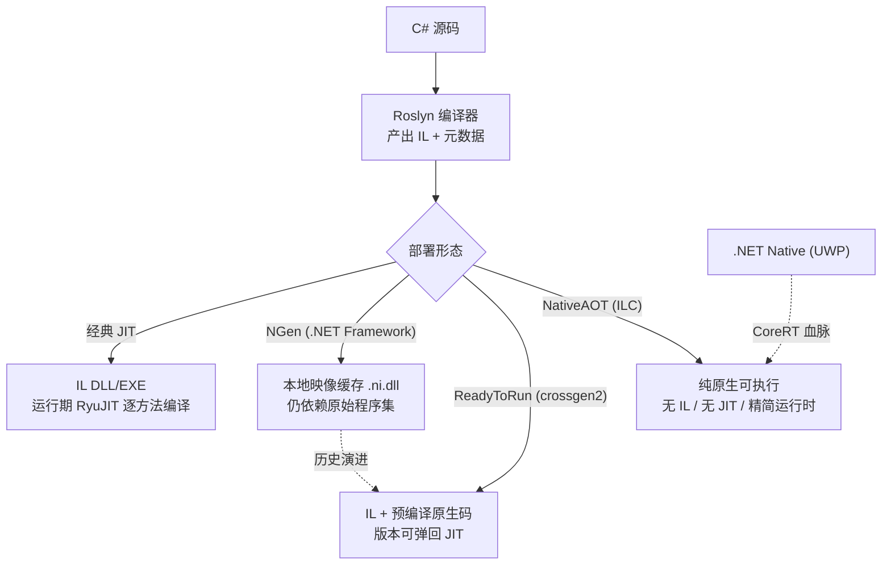
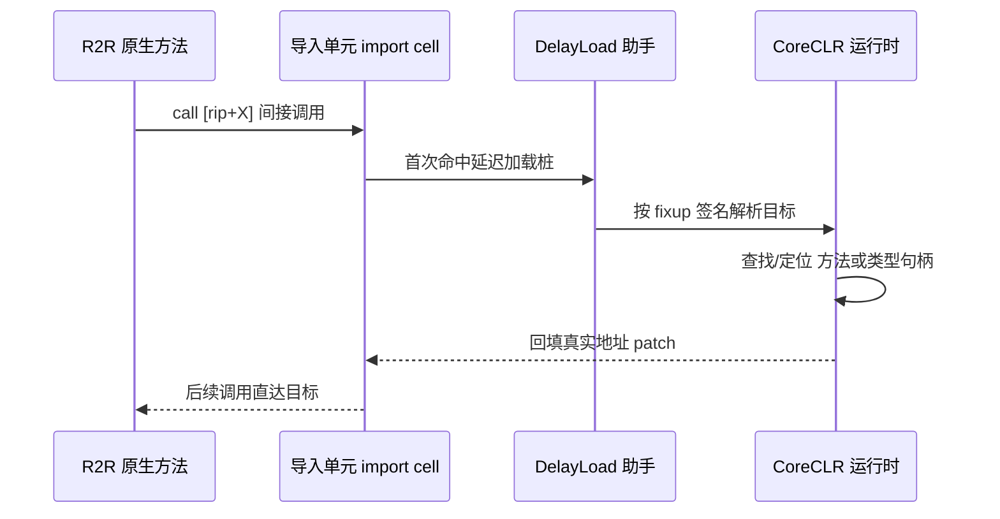
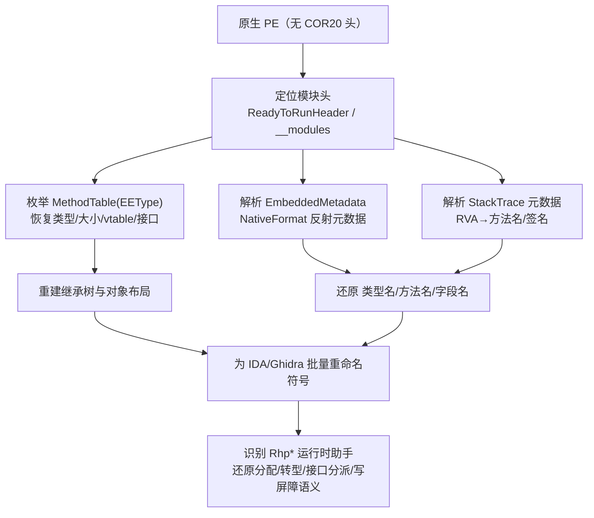

# 托管代码与字节码逆向（11）· dotNET-AOT与NativeAOT逆向
> [!abstract] TL;DR
> - .NET 的 AOT 谱系分两类：**ReadyToRun（R2R）保留 IL + 元数据，只是额外内嵌预编译原生码**，逆向仍可像普通程序集一样反编译；**NativeAOT 彻底丢弃 IL、JIT 与完整反射元数据**，产出纯原生 PE，逆向退化为读汇编。
> - R2R 通过 CLI 头（IMAGE_COR20_HEADER）末尾的 **ManagedNativeHeader** 定位 `READYTORUN_HEADER`（签名 `0x00525452`），其段表里 `MethodDefEntryPoints` 把 token 映射到原生入口、`ImportSections` 承载版本弹性 fixup——**fixup 签名恰好是还原间接调用语义的罗塞塔石碑**。
> - NativeAOT 并未凭空消灭类型信息：**MethodTable（旧名 EEType）** 描述每个类型的大小、vtable、接口图与 GCDesc；`EmbeddedMetadata`（NativeFormat 反射元数据）与 `StackTrace` 元数据在默认配置下会泄漏**类型名、方法名、签名**，是符号恢复的主入口。
> - 恢复流程：定位模块头 → 枚举 MethodTable 重建继承树与对象布局 → 解析反射/栈回溯元数据批量重命名 → 识别 `Rhp*` 运行时助手还原分配/转型/接口分派/写屏障语义。
> - 加固面：关闭 `StackTraceSupport`、`UseSystemResourceKeys`、`IlcDisableReflection` 与剥离 PDB 能大幅抹去名字，但**原生码逻辑本身永远可分析——AOT 是性能与部署手段，不是安全边界**。

## 概述与定位

要把这一篇放进整个系列的坐标里，先要回答一个前置问题：在第 07~10 篇里我们默认「.NET 程序 = IL + 元数据，拖进 dnSpy/ILSpy 即得近乎源码」，这个假设**在什么条件下会失效**。答案就是 AOT（Ahead-Of-Time，预先编译）。传统 .NET 走的是「C# → IL（CIL）→ 运行期 JIT 逐方法编译成原生码」的两段式；元数据（`#~` 表流、`#Strings`、`#Blob` 等，见第 08 篇）完整寄生在 PE 里，反编译器据此把 IL 还原成 C#。而 AOT 把「编译成原生码」这一步提前到发布期完成，于是**原生码开始出现在磁盘上**，元数据则依方案不同而被保留、削减或几乎抹除。

.NET 世界的 AOT 并非单一物件，而是一条谱系，逆向价值天差地别，必须先分清：

- **NGen（Native Image Generator，.NET Framework 时代）**：把程序集预编译进本地映像缓存（NIC）里的 `*.ni.dll`，属于「缓存」性质——原始托管程序集与完整元数据仍在，映像失效可回退 JIT。逆向上几乎无关紧要，直接看原始 DLL 即可。
- **ReadyToRun（R2R，.NET Core 3.0 起，由 crossgen2 产出）**：在同一个程序集里**同时**放 IL 与预编译原生码，目标是缩短启动时间同时保留完全的运行期灵活性（可回退 JIT、可被分层编译重新优化）。**IL 与元数据一个不少**，因此对逆向者友好：反编译照常，原生码只是「顺带」的加速缓存。你日常遇到的 `System.Private.CoreLib.dll` 等框架程序集默认就是 R2R。
- **NativeAOT（.NET 7 正式发布，前身 CoreRT / .NET Native）**：由 ILC（IL Compiler）做整程序分析、裁剪，再用 RyuJIT 作为 AOT 后端把 IL 全部编成原生码，静态链接一个精简运行时，产出**自包含的纯原生可执行文件**。默认**没有 IL、没有 JIT、没有 CLR 宿主、反射元数据被大幅裁剪**。这才是本篇真正的「硬骨头」：反编译器打开它只会告诉你「这不是托管程序集」。

本篇聚焦 R2R 与 NativeAOT 两端，核心种子是 **ReadyToRun 格式** 与 **原生化后的元数据恢复**。需要划清的边界：Unity 的 Mono AOT 与 IL2CPP 是另一套原生化路线（IL2CPP 把 IL 转成 C++ 再编译），放在第 12 篇；托管脱壳与运行时 dump 在第 15 篇；本篇不重复 CIL 执行模型（第 07 篇）与元数据流结构（第 08 篇），而是承接它们，讲「当原生化发生后，那些结构去哪了、怎么找回来」。

## 原理与机制

### 编译谱系：同一份 IL 的四种落地形态



理解逆向难度差异，关键在理解**「为什么这样设计」**。R2R 要解决的是「JIT 冷启动慢」：进程刚起来时几千个方法都要现编译，首屏卡顿明显。R2R 预先把这些方法编好，启动即可执行，但为了不牺牲灵活性，它保留 IL——一旦分层编译（Tiered Compilation）判断某热点方法值得更激进优化，可以丢弃 R2R 版本重新 JIT。所以 R2R 是「JIT 之上的加速层」，其原生码相当于 Tier-0。**保留 IL 是刻意的，这也就注定了它对逆向毫无防护意义**。

NativeAOT 要解决的是另一批问题，动机完全不同：（1）**JIT 被禁止的平台**——iOS、部分游戏主机、强制 W^X 的环境不允许运行时生成可执行内存，没有 AOT 就跑不了托管代码；（2）**极致启动与确定性**——无 JIT 预热、无编译抖动，适合 CLI 工具、Serverless、容器；（3）**部署体积与无依赖**——裁剪掉未用代码后自包含，落地一个 exe。代价是：不能运行期生成 IL（`Assembly.Load` 任意程序集、`Reflection.Emit`、`dynamic` 大量受限），反射能力需静态可判定。正因为「运行期不再需要 IL」，ILC 就大胆地**不把 IL 写进产物**——这是 NativeAOT 逆向困难的根因，也是它与 R2R 的本质分野。

### R2R：双份代码 + 版本弹性

R2R 的机制可拆成三件事。**第一，双份存储**：程序集里既有 IL 方法体，也有对应的原生函数（放在 `.text`，展开信息放 `.pdata`/`RuntimeFunctions`）。**第二，入口映射**：一张 `MethodDefEntryPoints` 表把每个方法的 MethodDef token 映射到其原生入口 RVA，运行时据此跳过 JIT 直接执行。**第三，也是最精巧的——版本弹性（version resilience）**。R2R 映像必须在框架小版本升级后仍可用，可框架里类型的字段偏移、方法地址都可能变。R2R 的解法是：**凡跨模块引用一律不硬编码，改走「导入单元（import cell）」间接**。原生码里不是 `call 具体地址`，而是 `call [rip+X]`，那个槽初始指向延迟加载桩，首次使用时运行时按一段 **fixup 签名** 解析真实目标并回填。



对逆向者，这条间接链有个反直觉的好处：**为了版本弹性而存在的 fixup 签名，本身就是解释原生码语义的字典**。一条 `call [rip+X]` 看似不知去向，但 `ImportSections` 里对应槽的签名会告诉你「这是调用 `System.String.Concat`」或「取 `SomeType` 的类型句柄」。r2rdump/ILSpy 正是靠解码这些签名，把裸原生码重新贴回托管语义。

### NativeAOT：ILC 流水线与精简运行时

NativeAOT 的产物由 ILC 生成。ILC 从 Roslyn 产出的 IL 出发，做**整程序可达性分析**：从入口（`Main`、显式 rd.xml/feature 开关声明的反射根）出发，标记所有可能被调用的方法、可能被实例化的类型，其余全部裁掉（这就是 trimming/illink 的强化版）。被保留的 IL 交给 RyuJIT 以 AOT 模式编成原生码，再与运行时库静态链接。这个运行时是 CoreRT 血脉的精简体：自带 GC、异常处理、类型系统支持、互操作桩，但**没有 JIT、没有独立的 CLR/DAC**。类型不再由元数据表在运行期解释，而是被「固化」成一批 **MethodTable** 结构直接躺在数据段里；静态字段区、线程静态区、冻结对象区、接口分派表等也都预先布好，由启动期的模块初始化把指针接好。理解这套「运行期所需的一切都被物化成数据结构」正是元数据恢复的抓手——下一节详解。

## 原生化格式与元数据恢复详解

### R2R 头与段表的二进制布局

R2R 的入口点在 CLI 头。回顾第 08 篇：PE 数据目录第 14 项指向 `IMAGE_COR20_HEADER`，其最后一个字段 `ManagedNativeHeader`（一个 `IMAGE_DATA_DIRECTORY`）在普通 IL 程序集里为空，在 R2R 里指向 `READYTORUN_HEADER`。这个字段是从 NGen 的原生头「继承」下来复用的。

```
READYTORUN_HEADER
+0x00  uint32  Signature          // 0x00525452 == 'R''T''R'0
+0x04  uint16  MajorVersion       // 随 .NET 版本递增（如 5.x / 6.x / 8.x / 9.x）
+0x06  uint16  MinorVersion
+0x08  uint32  Flags              // READYTORUN_FLAG_*（含 COMPOSITE / PLATFORM_NEUTRAL_SOURCE 等）
+0x0C  uint32  NumberOfSections
+0x10  READYTORUN_SECTION  Sections[NumberOfSections]

READYTORUN_SECTION
+0x00  uint32  Type               // ReadyToRunSectionType 枚举值
+0x04  uint32  Section.VirtualAddress
+0x08  uint32  Section.Size
```

段类型（`ReadyToRunSectionType`）用数值段区分用途，R2R 主要落在 100 号段：

- `CompilerIdentifier(100)`：产出该映像的编译器版本串，指纹价值高。
- `ImportSections(101)`：版本弹性 fixup 单元数组（配套一段签名 blob）。
- `RuntimeFunctions(102)`：等价于 `.pdata`，每项描述一个函数的起止与展开信息，是「原生码里有哪些函数」的权威清单。
- `MethodDefEntryPoints(103)`：token→原生入口映射，用 NativeReader 变长编码 + nibble 索引；把它和 RuntimeFunctions 一join，就得到「每个 IL 方法编到了哪段原生码」。
- `ExceptionInfo / DebugInfo(104/105)`：EH 子句与源码行/局部变量调试信息（若含）。
- `AvailableTypes / InstanceMethodEntryPoints`：本映像已实例化的类型与泛型实例入口。
- `ManifestMetadata(112)`：composite 场景下把多个程序集的引用统一到清单里。

**Composite R2R** 是重要变体：多个程序集被编进单一映像（框架的 `System.Private.CoreLib` 等就是这样打包），此时出现 `ComponentAssemblies`、`OwnerCompositeExecutable` 等段。逆向 composite 时要意识到「一个 .r2rmap/一个原生映像对应多份托管程序集」。但归根结底，R2R 里**IL 与元数据表流原封不动**，所以哪怕看不懂原生码，`ilspycmd`/dnSpy 直接给你 C#——这也是为什么本篇把力气几乎全押在 NativeAOT 上。

### NativeAOT 模块头与 MethodTable

NativeAOT 产物**不是托管程序集**：没有 COR20 头，PE 是纯原生的。但运行时启动仍需要「目录」找到各静态区，于是 ILC 复用了同名的 `ReadyToRunHeader`（这里名字纯属复用，语义是「NativeAOT 模块头」），通过一张 `__modules` 表登记。其段类型落在 200 号以上，含 `GCStaticRegion(200)`、`ThreadStaticRegion`、`InterfaceDispatchTable`、`TypeManagerIndirection`、`EagerCctor`、`FrozenObjectRegion`、`DehydratedData`，以及承载元数据的 `EmbeddedMetadata`、`StackTrace*` 等（约 300 号段）。定位到这张头，就等于拿到了整个二进制的「运行期地图」。

真正承载类型信息的是 **MethodTable**（.NET 8 前叫 **EEType**，改名后语义不变）。每个被实例化的类型对应一个 MethodTable，直接固化在数据段。对象在内存里是 `[对象头][MethodTable*][字段...]`，读一个对象首字段就能反查其类型：

```
对象内存布局（64-bit，具代表性，随版本略变）：
[ -8]  ObjHeader / 同步块索引（对齐填充）
[  0]  MethodTable*  m_pEEType        // 指向该类型的 MethodTable
[ +8]  实例字段 ...

MethodTable（定长头 + 变长尾）：
+0x00  uint32  m_uFlags               // EETypeKind|ElementType|HasFinalizer|IsGeneric|IsArray...
+0x04  uint32  m_uBaseSize            // 基础实例大小（含头，引用类型最小 24）
+0x08  MethodTable* m_RelatedType     // 基类型；数组/指针时为元素类型
+0x10  uint16  m_usNumVtableSlots
+0x12  uint16  m_usNumInterfaces
+0x14  uint32  m_uHashCode
+0x18  void*   Vtable[m_usNumVtableSlots]        // 虚方法槽（函数指针）
 ...   MethodTable* InterfaceMap[m_usNumInterfaces]  // 实现的接口列表
 ...   可选字段：Finalizer 指针 / 生成的元数据句柄 / DispatchMap 指针 等
GCDesc（GC 指针系列，描述本类型哪些偏移是引用）位于 MethodTable 之前的负偏移。
```

**为什么 MethodTable 是恢复的地基**：它把「类型」这一抽象重新变成可枚举的具体结构。遍历所有 MethodTable，你能重建（1）**继承树**——顺 `m_RelatedType` 上溯基类；（2）**对象布局**——由 `m_uBaseSize` 与 GCDesc 推断字段区大小及哪些槽是引用；（3）**虚调用去向**——vtable 是函数指针数组，一条 `call [rax+slot*8]` 立刻可解析为某具体函数；（4）**接口分派**——结合 InterfaceMap 与 DispatchMap 把 `(接口,槽)` 解析到实现。GCDesc 尤其宝贵：它精确标注引用字段偏移，与识别到的 `RhpAssignRef` 写屏障互相印证，能反推出结构体的引用/值字段分布。

### 反射元数据与栈回溯元数据：名字从哪来

MethodTable 给了结构，却不给**名字**——它是给机器用的，不含 "class Foo" 字样。名字藏在两处可选元数据里，也正是加固时要抹掉的目标。

其一是 `EmbeddedMetadata`：ILC 为支持反射而发射的 **NativeFormat** 元数据（`Internal.Metadata.NativeFormat`，与当年 .NET Native for UWP 同源）。这是一套句柄化、变长压缩的自定义格式（NativeReader 的 varint 编码），能读出类型名、方法名、字段名、签名。配套还有一批**映射哈希表**（NativeHashtable）把运行期实体接回元数据：`TypeMap`（MethodTable→元数据句柄）、`InvokeMap`（反射调用：方法→入口 + 调用约定）、`FieldAccessMap`、`DefaultConstructorMap`、`GenericInstantiationMap` 等。只要应用用了反射且未禁用，这批表就在，逆向者顺着 `TypeMap` 就能把每个 MethodTable 贴上真名。

其二是 **StackTrace 元数据**：由 MSBuild 属性 `StackTraceSupport`（默认 true）控制。为了让异常能打印可读栈，ILC 发射一张「代码 RVA ↔ 方法名/签名」的映射。**这对逆向是天赐之物**——哪怕反射全关，只要栈回溯还在，你就能把大批原生函数按真名重命名。把这张表 dump 出来喂给 IDA/Ghidra 批量改符号，可读性一步登天。此外 `<DebugSymbols>` 生成的原生 PDB 若随产物泄漏，则连局部变量名都可能到手。



### 冻结对象、泛型与「脱水」数据的陷阱

**冻结对象（FrozenObjectRegion）**：字符串字面量、部分只读单例被静态分配进数据段，每个对象开头仍是 MethodTable 指针。识别出指向 `String` 的 MethodTable 的对象，就能批量恢复字符串常量并与引用它们的代码建立交叉引用——这往往是理解程序逻辑的最快切入点。

**泛型**：NativeAOT 对值类型做**编译期实例化**（类似 C++ 模板，`List<int>` 与 `List<double>` 各生成一份代码与 MethodTable）；对引用类型走**共享泛型**（`__Canon`），多份引用类型实例共用一份代码，靠一个隐藏的「泛型上下文/字典」参数在运行期查具体的 MethodTable 与方法地址。逆向时要留意函数多出的这个隐藏字典参数，并会看字典布局，否则会误判调用约定与参数个数。

**脱水数据（DehydratedData，.NET 8 引入）**：为压缩体积，ILC 把大量只读结构以「脱水」形式存放，启动期由 `RhpInitializeModules` 一类流程「再水合」（rehydrate，即批量 fixup 回填指针）。**陷阱在于：静态看磁盘上的数据段，指针可能尚未接好、结构不完整**；此时要么在分析器里模拟再水合，要么直接从运行中的进程 dump 已水合的内存（与第 15 篇的运行时 dump 呼应）。这是把 NativeAOT 当「静态一目了然」处理时最常踩的坑。

## 工具视角与实战

### 第一步永远是判型

拿到样本先判断它属于谱系哪一档，否则用错工具白费力：

- **是不是托管程序集**：`corflags xxx.dll` / `dotnet-ildasm`，或看 PE 数据目录第 14 项。有 COR20 头即托管（普通 IL 或 R2R）；无则可能是 NativeAOT 或本就是 C/C++。
- **是不是 R2R**：托管前提下，检查 `ManagedNativeHeader` 非空、扫到 `0x00525452` 签名；ILSpy 打开会标注 ReadyToRun。判定为 R2R 就**别浪费时间读汇编**——直接 `ilspycmd -o out xxx.dll` 或 dnSpyEx 反编译拿 C#，原生码只在你要研究 codegen 时才看。r2rdump（`dotnet tool install`）能把段表、入口映射、fixup 签名全量导出，适合深挖 R2R 内部。
- **是不是 NativeAOT**：无 COR20 头、体积偏大（含运行时）、导入表没有 `mscoree`/`clrjit` 之类托管宿主、字符串区能看到 `Unhandled Exception:`、GC 相关串、以及大量 `Rhp*` 符号或 `__managed__Main`/诊断头 `DotNetRuntimeDebugHeader` 迹象。确认后转 IDA/Ghidra/Binary Ninja 走原生逆向。

### R2R 与单文件发布：别把「打包」当「原生化」

一个高频误判：**单文件发布（single-file publish）不是 AOT**。它只是把多个程序集与运行时打进一个 exe，运行时解包或从内存加载——IL 与元数据仍在。识别到单文件（PE 尾部有 bundle 清单/特征）就用解包工具把内嵌 DLL 抽出，再按普通 IL 反编译，切勿误当 NativeAOT 去啃汇编。同理，**裁剪（trimming）**会删未用代码与元数据，但只要不是 NativeAOT，剩下的仍是 IL。判型准确能省下数小时。

### NativeAOT 实战流水线

真正硬核的是 NativeAOT，社区尚无成熟的「一键还原 C#」反编译器，务实路线是**半自动符号恢复 + 常规原生逆向**：

1. **解析模块头**，枚举各段，锁定 MethodTable 区、`EmbeddedMetadata`、`StackTrace` 元数据、冻结对象区的位置。
2. **写脚本遍历 MethodTable**：按上文布局解析 flags/basesize/vtable/接口图/GCDesc，重建类型与继承树，给每个 vtable 槽建交叉引用。
3. **解析 NativeFormat/NativeHashtable**：以 `TypeMap`/`InvokeMap` 把 MethodTable 与函数接回名字，批量重命名。栈回溯元数据同法处理，两者互补（反射覆盖能被反射到的，栈回溯覆盖会进异常栈的）。
4. **识别运行时助手**（这是「读懂语义」的关键）：`RhpNewFast`/`RhpNewArray`（对象/数组分配，其参数常是某 MethodTable，等于告诉你 new 的是什么类型）、`RhTypeCast_*`/`RhpCheckCast*`（类型转换，同样带目标 MethodTable）、`RhpAssignRef`/`RhpCheckedAssignRef`/`RhpByRefAssignRef`（GC 写屏障，标记引用字段存储）、`RhpInterfaceDispatch*`（接口分派，配 DispatchMap 解析目标）。认得这套助手，裸汇编就能贴回「分配 Foo、转型为 IBar、写引用字段」这类托管语义。
5. **冻结字符串**恢复常量并回连代码；**脱水数据**必要时从活进程 dump。RyuJIT 是 NativeAOT 与 R2R/JIT 共用的后端，代码惯用法（助手调用、调用约定、返回缓冲、隐藏泛型参数）高度一致，逆向经验可跨档迁移。

调试层面要有心理预期：NativeAOT **没有传统 SOS/DAC**，标准托管调试器那套「!dumpheap、!clrstack」多不适用，得用 WinDbg/lldb 等原生调试器，结合你已恢复的 MethodTable 知识手工判读堆对象。

### Mono AOT 的定位

作为对照顺带厘清：iOS 上的 **Mono Full AOT** 预编原生码，但**仍随包发运带完整元数据的托管程序集**（Mono 运行时要用），所以逆向照样反编译 DLL 即可，难度远低于 NativeAOT。Unity 的 IL2CPP 则是把 IL 转 C++ 再编译、另配 `global-metadata.dat`，是完全不同的一套，细节留给第 12 篇。把这几种「原生化」并列理解，能避免张冠李戴。

## 安全性与正确使用

**最重要的一条认知：NativeAOT 会显著抬高逆向门槛（从「读近乎源码」退化到「读汇编」），但它不是安全边界，更不是 DRM。** 原生码逻辑对静态/动态分析永远开放，算法、密钥处理、授权校验只要在代码里，就能被读出、被 patch。把 AOT 当反破解手段是危险的误用。

从**防守方（IP 保护）**看，正确的加固姿势是「减少信息泄漏面」，且要清楚每一步的真实收益：`<StackTraceSupport>false` 抹掉栈回溯里的方法名（收益大，逆向者最爱的符号来源之一没了）；`<UseSystemResourceKeys>true` 用资源键替换异常消息串，减少语义线索；`<IlcDisableReflection>` 或最小化反射根，能砍掉 `EmbeddedMetadata` 与各映射表，让 `TypeMap` 无从贴名；发布时**务必剥离原生 PDB**，否则等于附赠符号。但要牢记这些只提高「读懂」的成本，**不改变「可执行即可分析」的事实**；真要保护核心 IP，应叠加成熟的原生保护壳/混淆、把关键逻辑下沉到经过加固的原生库、并辅以服务端校验，而非指望 AOT 本身。

从**攻击面**看，AOT 也带来它自己的风险，不全是收益。裁剪与反射的静态可判定性要求，容易诱使开发者用 `DynamicDependency`、rd.xml 或宽泛的 feature 开关「保住」大量类型，反而把本可裁掉的元数据留了下来，削弱了保护；配置不当时 NativeAOT 泄漏的名字甚至不比裁剪过的 IL 少。此外，静态链接的运行时**版本固定在产物里**，一旦运行时曝出漏洞，AOT 应用不像框架依赖型那样能靠更新共享运行时统一修复，必须逐个重编重发——这是供应链与补丁管理上的正确使用边界，安全团队要把 AOT 产物纳入「含内嵌运行时」的依赖清单来跟踪 CVE。

从**合规与正当性**看，本篇技术面向互操作、崩溃诊断、安全审计、恶意样本分析等正当场景：NativeAOT 恶意软件正因其「无 IL、少符号」而被滥用来规避传统 .NET 检测，防御方恰恰需要掌握 MethodTable/元数据恢复来还原其行为。对第三方闭源产物做逆向应遵守授权协议与当地法律，界定在安全研究与互操作的合理使用范围内。

## 小结

本篇的主线是一句话：**.NET 的「原生化」不是一个开关，而是一条谱系，逆向难度取决于「IL 与元数据被保留了多少」**。R2R 保留一切，原生码只是加速缓存，逆向者当普通程序集处理即可，真要深挖就靠 `ManagedNativeHeader → READYTORUN_HEADER → 段表`，尤其用 `ImportSections` 的 fixup 签名把间接调用贴回语义。NativeAOT 抹掉 IL、JIT 与大部分反射元数据，但**没能、也不需要抹掉运行期赖以工作的结构**：MethodTable（EEType）固化了类型、大小、vtable、接口图与 GCDesc，`EmbeddedMetadata` 与 StackTrace 元数据在默认配置下泄漏名字，冻结对象泄漏常量。恢复流程遂成定式——定位模块头、枚举 MethodTable 重建类型与布局、解析元数据批量重命名、识别 `Rhp*` 助手还原分配/转型/分派/写屏障语义，并当心脱水数据与共享泛型这两个陷阱。加固只能减少泄漏、抬高成本，改变不了原生码可分析的本质。掌握这套「结构—元数据—助手」三位一体的判读法，就把 NativeAOT 从「读不懂的汇编」拉回到「有类型系统坐标的托管逆向」。

## 相关阅读

- [[07.dotNET-CLR与CIL执行模型]]、[[08.PE中的dotNET元数据与流]]：本篇的前置——原生化前的 IL 执行模型与元数据流结构。
- [[10.dotNET混淆器对抗与de4dot]]：与 AOT 正交的另一条防护/对抗路线，可对照「混淆 vs 原生化」的不同威胁模型。
- [[12.Unity游戏逆向：Mono与IL2CPP]]：另一套原生化路线（Mono AOT / IL2CPP + global-metadata.dat），与 NativeAOT 边界互补。
- [[15.托管代码脱壳与运行时dump]]：脱水数据再水合、活进程 dump 的通用手法。
- [[13.PE文件详解/07-详解PE文件(七)：数据目录]]：数据目录第 14 项与 CLI 头的定位基础。
- [[23.C_C++运行时与ABI/01.运行时与ABI概览]]：NativeAOT 走原生 ABI，本文与托管调用约定的差异可对照阅读。
- [[35.Android逆向与运行时/03.DEX文件格式]]、[[40.WASM与虚拟化壳逆向/02.WASM指令集与执行模型]]：同为「字节码/元数据被原生化/物化」的跨生态参照。
- 官方权威：dotnet/runtime 仓库 `docs/design/coreclr/botr/readytorun-format.md`（R2R 格式定义）、`src/coreclr/nativeaot/` 下设计文档与 `ReadyToRunSectionType` / `MethodTable` 源码；Microsoft Learn 的「Native AOT deployment」「ReadyToRun compilation」「Trimming」文档。
- 书目：Serge Lidin《Expert .NET IL Assembler》、Konrad Kokosa《Pro .NET Memory Management》（对象布局与 MethodTable/EEType 讲解）。

[[00.托管代码与字节码逆向总览|⬆ 系列总览]] | [[10.dotNET混淆器对抗与de4dot|← 上一章]] | [[12.Unity游戏逆向：Mono与IL2CPP|→ 下一章]]
