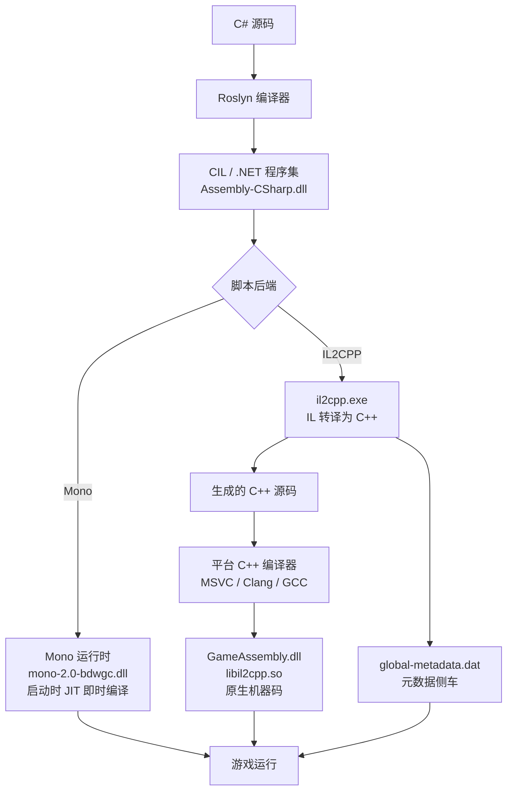
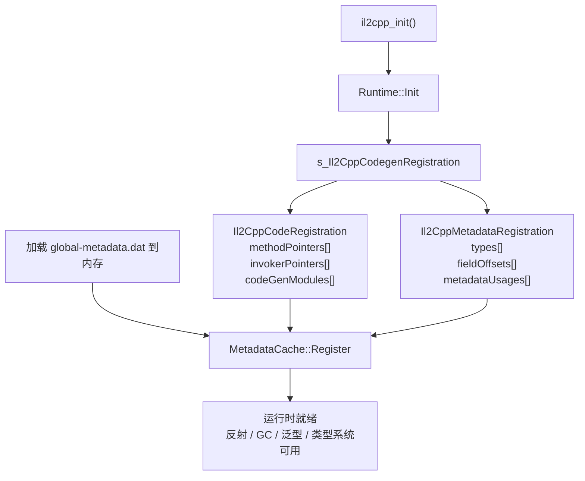
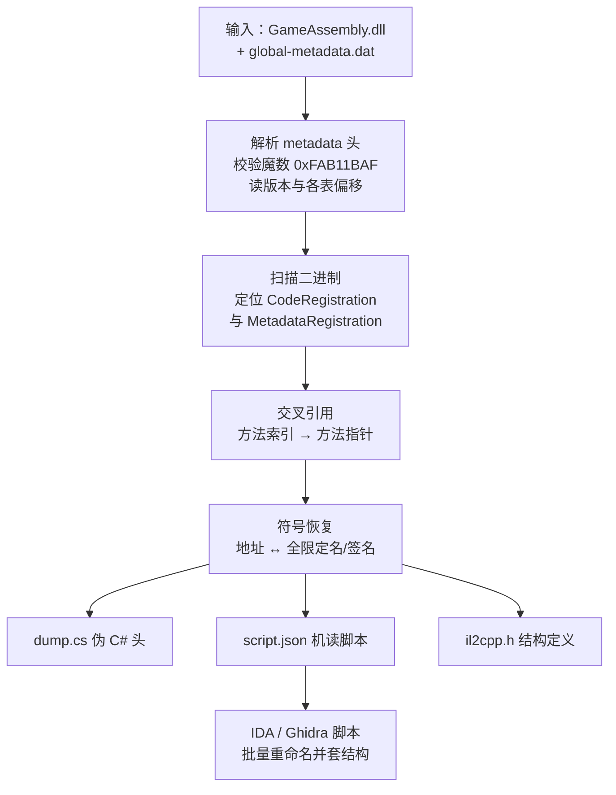
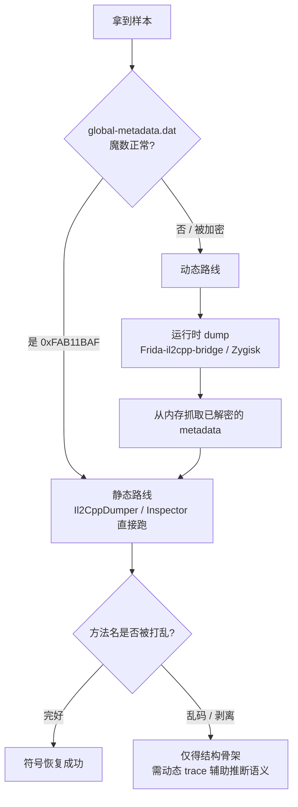

# 托管代码与字节码逆向（12）· Unity游戏逆向：Mono与IL2CPP
> [!abstract] TL;DR
> - Unity 有两套脚本后端：Mono 走 JIT，脚本是标准 .NET 程序集（`Assembly-CSharp.dll`），dnSpy 一开即读、可改可编；IL2CPP 走 AOT，把 IL 转译成 C++ 再编成原生码，反编译器读不到 IL，逆向难度陡增。
> - IL2CPP 并没有把元数据也焊进机器码——它沿用 .NET「代码与元数据分离」的思想，把类型/方法/字段/字符串抽到 `global-metadata.dat` 侧车文件，这份明文可解析的结构化数据正是符号恢复的钥匙。
> - 原生二进制（`GameAssembly.dll` / `libil2cpp.so`）里两张注册表 `Il2CppCodeRegistration` 与 `Il2CppMetadataRegistration`，把元数据里的「方法索引」桥接到二进制里的「函数地址」——缝合二者才能给匿名函数贴回真名。
> - Il2CppDumper 的算法核心：校验魔数 `0xFAB11BAF` 解析 metadata 拿到名字与结构，扫描二进制自动定位两张注册表，交叉引用后给每个原生地址还原全限定名，产出 `dump.cs` 与 IDA/Ghidra 批量改名脚本。
> - 对抗集中在加密 metadata、打乱/剥离方法名、篡改魔数与注册表；通用破法是运行时 dump（`Frida-il2cpp-bridge` / `Zygisk-Il2CppDumper`）——等运行时把 metadata 在内存里解密后，直接抓取已解密副本再离线分析。

## 概述与定位

Unity 是当今手游与独立游戏的主力引擎，其"脚本"逻辑几乎清一色用 C# 编写。但玩家最终拿到的成品里，这些 C# 逻辑会以两种截然不同的形态存在，取决于开发者在打包时选择的**脚本后端（Scripting Backend）**：Mono 与 IL2CPP。这一个选项直接决定了逆向的难度、方法论与工具链，是本篇一切讨论的分水岭。

Mono 后端下，C# 由 Roslyn 编译成标准的 .NET 程序集（`Assembly-CSharp.dll`、`Assembly-CSharp-firstpass.dll` 等），原封不动随游戏分发，运行时交由 Unity 定制的 Mono 虚拟机做 JIT 执行。对逆向者而言，这几乎等同于「拿到一个普通 .NET 程序」：第 07~10 篇讲过的 CLR/CIL 执行模型、PE 里的 .NET 元数据流、dnSpy/ILSpy 反编译、de4dot 反混淆——全部原样适用。dnSpy 双击即见近乎源码级的 C#，改一个数值、重新编译、直接运行，闭环极短。Mono 后端因此常被戏称为"透明的"。

IL2CPP（Intermediate Language To C++）后端则把游戏推向原生世界。`il2cpp.exe` 先把 IL 转译成语义等价的 C++ 源码，再交给平台 C++ 编译器（MSVC / Clang / GCC）编成真正的机器码，产物是 `GameAssembly.dll`（Windows）、`libil2cpp.so`（Android/Linux）或静态库归档（iOS）。此刻反编译器再也读不到 IL，逆向退化为对动辄十万计原生函数的静态分析。但——这是关键——Unity 出于运行时反射、序列化、泛型实例化与 GC 的需要，仍把类型系统的「元数据」抽出成一个独立文件 `global-metadata.dat`。这个侧车文件是 IL2CPP 逆向的**阿喀琉斯之踵**，也是全篇的技术核心。

在本系列的坐标里，本篇是第 07~11 篇的「应用汇流点」。Mono 分支直接复用整套 .NET 托管逆向工具链，无需重复展开；IL2CPP 分支表面上像第 11 篇的 NativeAOT（两者都把 IL 编成原生码），但机理迥异：NativeAOT 是微软官方产物，直接 IL→原生、元数据高度内联并激进裁剪，符号恢复困难；IL2CPP 则绕道 C++、保留了完整的托管运行时与 GC、并把元数据外置成一个可离线解析的文件，反而给符号恢复留了一扇后门。理解这一差异，是理解「为什么 IL2CPP 游戏能被相当程度还原」的前提。

## 原理与机制

要建立正确的心智模型，先把两条编译链路各自的机制讲透，再点明它们在磁盘上的落地形态。

**Mono 分支。** 打开 `<Game>_Data/Managed/` 目录，你会看到 `Assembly-CSharp.dll`（你的游戏脚本主体）、`Assembly-CSharp-firstpass.dll`、以及 `UnityEngine.*.dll` 与第三方库。运行时位于 `MonoBleedingEdge/` 下的 `mono-2.0-bdwgc.dll`——"BleedingEdge" 指 Unity 维护的这一 Mono 分支追踪较新的上游，`bdwgc` 则点明它用的是 Boehm–Demers–Weiser 保守式垃圾回收器，这是 Unity Mono 与微软 CLR 的一个显著实现差异（CLR 用精确式分代 GC）。由于程序集是标准 ECMA-335 格式，`#~`/`#Strings`/`#US`/`#Blob`/`#GUID` 等元数据流（详见第 08 篇）一应俱全，dnSpy 能完整重建类型层次、方法体乃至局部变量名（若保留了 PDB）。逆向 Mono 游戏的"难点"往往不在后端本身，而在开发者是否额外上了 .NET 混淆器——那属于第 06/10 篇的战场。

**IL2CPP 分支。** 它的构建管线是一条多级流水线：C# →（Roslyn）→ IL/程序集 →（`il2cpp.exe` 转译器）→ C++ 源码 →（平台 C++ 编译器）→ 原生二进制。产物落到两处：机器码进 `GameAssembly.dll` / `libil2cpp.so`；元数据进 `<Game>_Data/il2cpp_data/Metadata/global-metadata.dat`。需要强调，IL2CPP **不是**把托管运行时也抛弃了——恰恰相反，`libil2cpp` 依旧导出一整套 `il2cpp_*` 的 C 语言 API（`il2cpp_init`、`il2cpp_domain_get`、`il2cpp_class_from_name`、`il2cpp_runtime_invoke`、`il2cpp_object_new` 等），依旧带有 GC，依旧支持反射与异常。变的只是「方法体的执行方式」：从"IL 被 JIT"变成"C++ 被 AOT 编译好的原生函数直接调用"。

**为什么要把元数据外置？** 这是整篇最该想通的一点。C++ 代码本身不携带"反射所需的富类型信息"。而 C# 语义要求运行时能做 `typeof(T).GetMethods()`、`Activator.CreateInstance(type)`、按字段名做 JSON/二进制序列化、按 token 解析泛型——这些都需要一份可按名字/索引查询的、完整的类型-方法-字段描述表。若把这些信息硬编码进机器码，既极度臃肿又无法高效索引。于是 IL2CPP 沿用了 .NET 由来已久的「代码与元数据分离」思想（第 08 篇：元数据寄生于 PE 的各个流），把**纯数据的类型描述**集中进 `global-metadata.dat`，把**可执行的方法体**编进原生二进制，再用运行时启动阶段的两张注册表把二者缝合。这一分离在工程上是必然选择，但对逆向者是天赐良机：元数据是明文、结构化、可离线解析的——名字、签名、继承关系、字段布局全在里面，唯独缺"这个方法编译后落在哪个地址"，而那正是二进制里注册表要补的最后一块拼图。

下图对照两条后端链路，注意 IL2CPP 分叉出的"机器码 + 元数据侧车"双产物结构：



## 结构与算法详解：global-metadata.dat 与双注册表

这是全篇的深水区。符号恢复的本质，是回答一个问题：**二进制里那个位于 `0x...` 的匿名函数，究竟是哪个类的哪个方法？** 答案要靠"元数据（有名字、无地址）"与"注册表（有地址、无名字）"的交叉引用得出。下面逐层拆解。

**第一层：`global-metadata.dat` 的文件头。** 文件以一个 `Il2CppGlobalMetadataHeader` 打头，全部是 `int32` 的偏移/大小成对字段，指向文件内各张表。骨架如下（按字节布局理解，不同版本字段会增删）：

```c
typedef struct Il2CppGlobalMetadataHeader {
    int32_t sanity;                 // 魔数 0xFAB11BAF（文件里小端为 AF 1B B1 FA）
    int32_t version;                // 元数据版本：16/19/21/22/23/24/24.x/27/29/31...
    int32_t stringLiteralOffset;    // 托管字符串字面量（用户可见文本）
    int32_t stringLiteralSize;
    int32_t stringLiteralDataOffset;
    int32_t stringLiteralDataSize;
    int32_t stringOffset;           // 元数据自身用的字符串（类型名/方法名等，\0 分隔）
    int32_t stringSize;
    // ... events / properties ...
    int32_t methodsOffset;          // Il2CppMethodDefinition 数组：nameIndex、token、参数范围
    int32_t methodsSize;
    // ... parameters / fields / genericParameters ...
    int32_t typeDefinitionsOffset;  // Il2CppTypeDefinition 数组：nameIndex、methodStart/Count、fieldStart/Count
    int32_t typeDefinitionsSize;
    // ... images / assemblies ...
} Il2CppGlobalMetadataHeader;
```

逆向第一步永远是**校验魔数**：读前 4 字节，等于 `0xFAB11BAF` 则是未加密的原版结构，可直接静态解析；不等则大概率被开发者篡改或整体加密，需转走动态路线（见下一节）。紧接着的 `version` 决定了后续所有表项的结构体布局——这是 IL2CPP 逆向最大的兼容性陷阱：版本 16 到 31 之间，`Il2CppType`、`Il2CppMethodDefinition` 等结构的字段数量、位域打包方式反复变化，甚至同为"24"的 24.0/24.1/24.2/24.3/24.4/24.5 之间布局也不同（Unity 用小数点区分同大版本的小改动）。工具必须为每个版本准备专门的解析器，选错版本会整篇错位。

**第二层：元数据里的"名字与结构，但没有地址"。** `Il2CppTypeDefinition` 用 `nameIndex`/`namespaceIndex` 指向字符串表得到类型名，用 `methodStart`+`methodCount` 圈定它拥有的方法在全局方法表中的连续区间；`Il2CppMethodDefinition` 同样用 `nameIndex` 拿方法名，用 `parameterStart`/`parameterCount`、`returnType`、`token`、`flags` 描述签名与可见性。请特别注意：元数据里**根本没有原生函数地址**——道理很简单，地址只有在 C++ 被编译、链接、加载之后才存在，转译阶段的 `il2cpp.exe` 无从得知。因此元数据能告诉你"存在一个 `PlayerController::TakeDamage(int)`"，却答不出它在 `GameAssembly.dll` 里的 RVA。这块拼图必须去二进制里找。

**第三层：二进制里的两张注册表。** 原生二进制在启动时会调用一个生成的注册函数（历史上常见符号名如 `s_Il2CppCodegenRegistration` / `Il2CppCodegenRegistrationFunction`），把两个大结构体交给 `il2cpp::vm::MetadataCache::Register`：

- `Il2CppCodeRegistration`——"代码侧"注册表，核心是 `methodPointers`（原生函数指针数组）、`invokerPointers`（泛型调用蹦床）、`reversePInvokeWrappers`、以及新版里的 `codeGenModules`。
- `Il2CppMetadataRegistration`——"元数据侧"注册表，核心是 `types`（`Il2CppType*` 数组，运行时类型对象）、`fieldOffsets`（各字段在对象里的偏移）、`typeDefinitionsSizes`（各类型实例大小）、`metadataUsages`（某函数引用了哪些 il2cpp 对象/字符串的回填表）。

这两张表加上加载进内存的 `global-metadata.dat`，三者一起被 `MetadataCache::Register` 消化，运行时的类型系统才算就绪。启动流程如下：



**第四层：符号恢复算法（交叉引用）。** 有了元数据的"名字-索引"和二进制的"索引-地址"，缝合逻辑就清晰了：

1. 解析 metadata，遍历 `images`（每个程序集一个 image），拿到每个 image 的类型区间；
2. 对每个 `Il2CppTypeDefinition`，用 `methodStart`/`methodCount` 遍历它的 `Il2CppMethodDefinition`，得到每个方法的名字与签名，以及它在本 image 内的方法 RID；
3. 在二进制里定位 `Il2CppCodeRegistration`；对该 image 找到对应的 `Il2CppCodeGenModule`，取其 `methodPointers` 数组；
4. 用方法 RID 索引 `methodPointers`，得到该方法的原生 RVA；
5. 把这个 RVA 贴上全限定名 `Namespace.Type::Method(参数签名)`；
6. 顺带用 `metadataUsages` 解析出每个函数引用了哪些字符串字面量、哪些类型 token，用 `fieldOffsets` 还原对象内存布局。

这里藏着一个关键的**版本演进陷阱**：早期（约 24.2 之前）`methodPointers` 是 `Il2CppCodeRegistration` 里的一个扁平大数组，所有程序集的方法混在一起按全局索引访问；24.2 起，Unity 把它拆进了**每个程序集各自的 `Il2CppCodeGenModule.methodPointers`**（`codeGenModules` 数组）。若工具没有按版本切换到"分模块"逻辑，就会把方法映射到错误地址。这也是为什么 Il2CppDumper 的日志里第一件事就是打印识别到的 metadata 版本。

**第五层：如何在没有符号的二进制里"找到"两张注册表？** 发布版通常是 strip 过的，没有 `s_Il2CppCodegenRegistration` 这种符号。Il2CppDumper 因此支持自动搜索：它在数据节里扫描候选指针数组，用一组**自洽性约束**做验证——例如 `MetadataRegistration.types` 必须是一串指向合法 `Il2CppType`（其内部位域取值在合理范围）的指针，且 `typeDefinitionsSizesCount` 要与 metadata 里的 `typeDefinitionsCount` 相等；`CodeRegistration` 的各计数字段要落在合理区间，`methodPointers` 指向的地址要落在代码节内。多个约束同时满足才认定命中。ELF 上还能借助动态符号表/`.dynsym` 直接读到注册函数，Mach-O 与 PE 上则更依赖上述启发式扫描。若自动搜索失败，工具还提供手动模式，让分析者直接喂入两张表的地址。

## 工具视角与实战

理解了原理，工具就只是把上述算法自动化。下面按"静态离线 / 运行时动态 / Mono 直读"三类展开。

**Il2CppDumper（静态离线的事实标准）。** 输入两个文件——`GameAssembly.dll`（或 `libil2cpp.so`）与 `global-metadata.dat`——即可跑出全套产物：

- `dump.cs`：人类可读的伪 C# 全量头文件，每个方法上方以注释标出 `// RVA: 0x... Offset: 0x... VA: 0x...`，逆向时按名字搜到方法即知其地址；
- `script.json`：机读脚本，含 `ScriptMethod`（地址↔名字）、`ScriptString`、`ScriptMetadata`、`ScriptMetadataMethod` 等，供反汇编器脚本消费；
- `il2cpp.h`：重建出的 C 结构体头，导入反汇编器后能让泛化的 `void*` 变成有字段名的结构，HexRays/Ghidra 反编译可读性大增；
- `ida.py` / `ida_with_struct.py` / `ghidra.py` / `ghidra_wpstruct.py`：批量把十万计匿名函数改回真名、套上类型。

拿到 `dump.cs` 后典型工作流是：在其中搜到目标逻辑（比如按字符串字面量"score"或方法名 `AddCoins` 定位）→ 记下 RVA → 在 IDA/Ghidra 里（已跑过改名脚本）跳到该地址 → 阅读/patch 原生实现。下图是这条离线链路的骨架：



**Il2CppInspector（更强的工程化替代）。** 相较 Il2CppDumper，它对混淆与非常规封装更鲁棒：能处理拆分 APK / OBB / Android App Bundle、能直接从 ELF/PE/Mach-O 甚至内存转储解析，能生成一个可编译的 **C# 存根工程**（把类型/方法签名还原成一个 .NET 项目，便于用 IDE 交叉阅读）外加 IDA/Ghidra 的 Python 脚本，对泛型与 `MethodSpec` 的处理也更完整。遇到 Il2CppDumper 因版本或轻度混淆卡住时，换 Il2CppInspector 常能突破。

**运行时动态路线（对抗加密的通用解）。** 当 `global-metadata.dat` 被加密（魔数不对、整体 XOR/AES）时，静态解析直接失败——但运行时终究要把它解密进内存才能用，于是"等它解密再抓"成为通杀思路。`Frida-il2cpp-bridge` 是一个 TypeScript 库，通过 Frida 注入进游戏进程，提供 `Il2Cpp.perform()` 让你在运行时枚举 domain/assembly/class/method、hook 任意方法、trace 调用、甚至直接从内存 dump 出解密后的 metadata 与结构。Android 上 `Zygisk-Il2CppDumper` 更进一步：作为 Zygisk 模块随进程启动，等 il2cpp 加载并完成解密后，直接在内存里跑一遍上文的符号恢复算法，产出与 Il2CppDumper 同款的 `dump.cs` 与脚本——因为它读的是已解密的内存副本，静态层面的 metadata 加密对它形同虚设。下图是"该走静态还是动态"的决策逻辑：



**Mono 直读路线（顺带一提）。** 若目标是 Mono 后端，无需上述任何 IL2CPP 工具：dnSpy 直接反编译 `Assembly-CSharp.dll`，支持"编辑并保存程序集"直接打补丁；模组生态里 BepInEx / MelonLoader 提供加载器框架，配合 Harmony 在运行时非侵入式地打前置/后置补丁（不改原 DLL 而在内存里织入）。这条路属于第 07~10 篇的延伸，此处仅点明边界，不再展开。

## 安全性与正确使用

**开发者为何选 IL2CPP。** 两个动机：性能（AOT 原生码通常快于 Mono JIT，且满足 iOS 禁止 JIT 的平台约束）与反篡改。但必须清醒认识：IL2CPP 提供的是**提高门槛的混淆（security by obscurity）**，不是真正的安全边界。它把"dnSpy 五秒读源码"变成"IDA 数小时读原生码"，却挡不住有决心的分析者——尤其运行时 dump 让 metadata 加密的收益大打折扣。任何把作弊防护、授权校验、密钥完全托付给客户端 IL2CPP 的设计，都是把保险箱和钥匙一起交给对手。

**对防守方的加固要点（按性价比排序）。** ① 把关键逻辑与信任判定放到**服务端**，让客户端无权威——这是唯一治本手段，多人游戏的反作弊尤其如此；② 加密 `global-metadata.dat` 并**打乱/剥离方法名**（把 metadata 里的类型名、方法名替换成随机串或空），这样即便对手成功 dump，得到的也只是无语义的结构骨架，能显著拖慢逆向；③ 采用定制化的 il2cpp 运行时或篡改注册表布局，破坏工具的启发式识别；④ 反调试、反 Frida、Root/模拟器检测，抬高动态路线成本；⑤ 完整性校验与代码签名，检测二进制或 metadata 被替换。需注意这些手段可叠加、也可被逐一绕过，应作纵深防御而非指望单点。

**误用风险与法律/伦理边界。** 逆向本身是中性的分析技术，但用途划出红线：出于互操作、学习、漏洞研究、单机模组等目的的逆向，在多数司法辖区与社区惯例中被容忍甚至鼓励；而在多人游戏中制作作弊器直接损害其他玩家、破坏经济系统，属于明确的恶意；绕过 DRM/授权、盗版分发则可能触犯《数字千年版权法》第 1201 条（DMCA §1201）等反规避条款及当地法律。逆向者应恪守：只在自己拥有或获授权的样本上操作、遵守目标软件的最终用户许可协议、对发现的安全漏洞走**负责任披露**（先私下通知厂商、给出合理修复窗口，再考虑公开），不将分析成果用于牟利性破坏或未授权访问。技术能力越强，越需要这份自律来界定"研究"与"侵害"的分野。

## 小结

Unity 逆向的第一性问题永远是"哪个后端"。Mono 后端把 C# 以标准 .NET 程序集形态直接暴露，逆向即回归第 07~10 篇的托管工具链，dnSpy 一站式解决。IL2CPP 后端把 IL 经 C++ 编成原生码、把 IL 反编译这条路彻底堵死，却因运行时反射与 GC 的刚性需求，不得不把类型元数据外置成明文可解析的 `global-metadata.dat`——这份侧车文件连同二进制里 `Il2CppCodeRegistration` 与 `Il2CppMetadataRegistration` 两张注册表，构成了符号恢复的三大支点。逆向的核心算法就是"元数据出名字、注册表出地址、交叉引用缝合"，Il2CppDumper/Il2CppInspider 将其自动化，产出 `dump.cs` 与反汇编器改名脚本；当静态 metadata 被加密时，`Frida-il2cpp-bridge` 与 `Zygisk-Il2CppDumper` 从已解密的内存里抓取副本，形成对加密的通用绕过。理解版本演进（尤其 24.2 的 `codeGenModules` 分模块化）与自洽性搜索的原理，是让工具不"翻车"的底气。防守侧则应认清 IL2CPP 只是抬高门槛而非真正安全，把信任锚定在服务端，辅以名字剥离、加密与反注入的纵深防御。

## 相关阅读

- 同系列前置：[[07.dotNET-CLR与CIL执行模型]]、[[08.PE中的dotNET元数据与流]]——Mono 后端与 IL2CPP 元数据分离思想的根基。
- 同系列工具：[[09.dnSpy与ILSpy反编译实战]]、[[10.dotNET混淆器对抗与de4dot]]——Mono 后端逆向直接复用。
- 同系列对照：[[11.dotNET-AOT与NativeAOT逆向|← 上一章]]——同为 IL→原生，辨析 NativeAOT 与 IL2CPP 的机理差异。
- 原生对照：[[23.C_C++运行时与ABI/01.运行时与ABI概览]]——IL2CPP 产物即原生二进制，其 ABI 与调用约定是静态分析的基础。
- 格式前置：[[13.PE文件详解/07-详解PE文件(七)：数据目录]]——`GameAssembly.dll` 是 PE，注册表藏在其数据节。
- 同族参考：[[35.Android逆向与运行时/03.DEX文件格式]]——`global-metadata.dat` 与 DEX 同为"集中式元数据容器"的设计对照；[[40.WASM与虚拟化壳逆向/02.WASM指令集与执行模型]]——另一种 IL/字节码到原生目标的映射范式。
- 官方与工具（一手参考，非搬运）：Unity 官方手册 IL2CPP 章节（docs.unity3d.com）、Il2CppDumper（github.com/Perfare/Il2CppDumper）、Il2CppInspector（github.com/djkaty/Il2CppInspector）、frida-il2cpp-bridge（github.com/vfsfitvnm/frida-il2cpp-bridge）。

[[00.托管代码与字节码逆向总览|⬆ 系列总览]] | [[11.dotNET-AOT与NativeAOT逆向|← 上一章]] | [[13.Python字节码与pyc反编译|→ 下一章]]