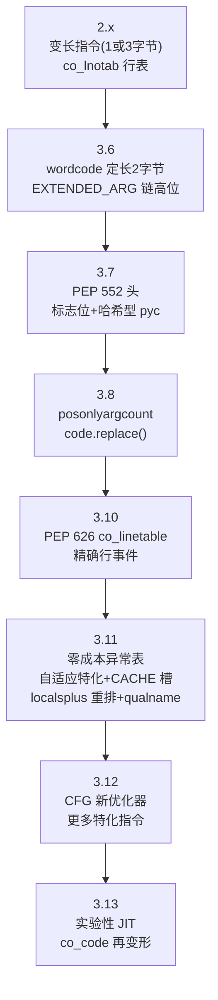
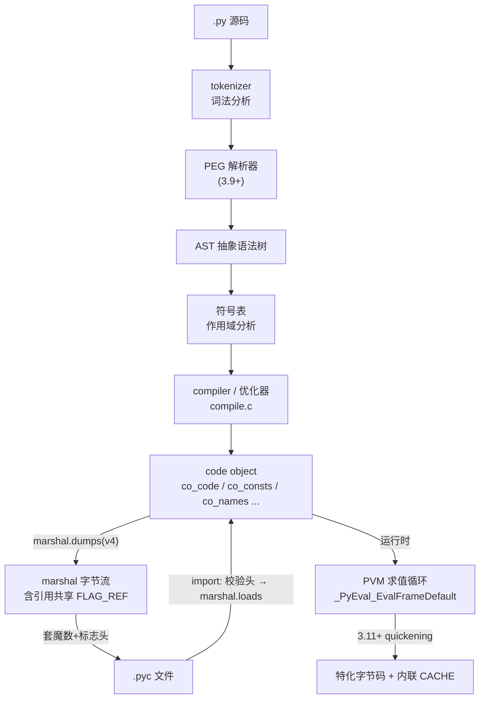
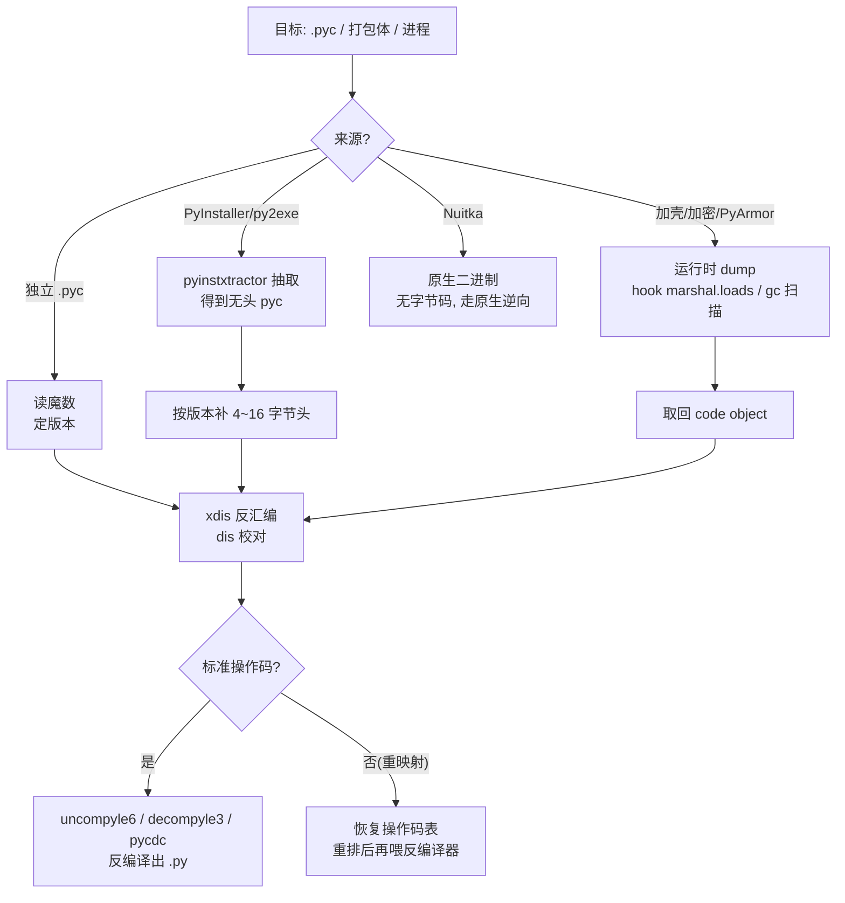

# 托管代码与字节码逆向（13）· Python字节码与pyc反编译
> [!abstract] TL;DR
> - CPython 把源码编译为 **code object**，经 **marshal** 序列化、再套上版本魔数头即成 `.pyc`；PVM 是一台栈式虚拟机，**无字节码校验器、无强制 JIT**（3.13 前），设计目标是可移植与实现简单而非防逆向。
> - code object 完整保留 `co_varnames`/`co_names`/`co_consts` 等符号与常量，所以 Python 反编译**近乎无损**（远好于 C 的名字全丢）；因此 pyc 不构成任何知识产权保护，只是一种编译缓存。
> - pyc 头随版本演进：3.7 前是「魔数+mtime+源码大小」，3.7（PEP 552）改为「魔数+标志位+（时间戳 | 源码 SipHash）」；**marshal 与字节码跨版本都不稳定**，这是逆向必须先定版本的根因。
> - 关键突变：3.6 起字节码定长 **wordcode**（2 字节/条），3.10 换 `co_linetable`（PEP 626），3.11 引入**零成本异常表** `co_exceptiontable` 与自适应内联缓存 `CACHE`（PEP 659）——每次大改都逼反编译器重写文法。
> - 反编译器分两路：**uncompyle6/decompyle3** 用逐版本语法做模式匹配，**pycdc（Decompyle++）** 用 C++ 栈式重建；控制流（if/循环/异常）与优化器改写过的跳转是失败高发区。
> - 实战链路：PyInstaller 用 `pyinstxtractor` 抽出**无头 pyc** → 按版本补魔数 → 反编译；遇 PyArmor / 操作码重映射则退化为**运行时 dump code object** 或恢复操作码表。

## 概述与定位

在本系列里，前十二篇的主角是「有元数据、有类型系统、可验证」的重型托管运行时——JVM 的 class 文件、.NET 的 CIL 与元数据流、Unity 的 IL2CPP。Python 属于同一大类（源码先编译成字节码、再由虚拟机解释执行），但它是这个家族里**最轻、最开放、也最容易被完整还原**的一员。理解它的价值不只在于「Python 程序怎么逆」，更在于它给出了托管字节码的一个极简对照物：没有强类型的字节码验证、没有 AOT、名字与常量近乎全保留。把它和 JVM/CLR 并排看，才能真正体会「元数据保留度」如何决定了逆向的难度上限。

需要先厘清定位。**CPython 是参考实现**，也是绝大多数人说「Python」时实际运行的东西；本篇一切结论（字节码格式、pyc 结构、marshal）都是 CPython 私有约定，PyPy、Jython、IronPython、GraalPy 各有自己的执行体系，字节码互不通用。CPython 的执行流水线是：源码 → 词法/语法分析得到 AST → 编译为字节码封进 code object → 运行时由**求值循环**（`_PyEval_EvalFrameDefault`，位于 `ceval.c`）逐条解释。`.pyc` 只是这条流水线中「编译结果」的落盘缓存，本质是「marshal 后的 code object 加一段头」，它的存在纯粹是为了让 `import` 免于重复编译，**从来不是为了保护源码**。

这带来一个反复被误解的事实：把 `.py` 删掉只发布 `.pyc`（sourceless distribution），或用 PyInstaller 打包成 exe，**都不等于加密**。因为 code object 里 `co_varnames`（局部变量名）、`co_names`（全局/属性名）、`co_consts`（含字符串常量与嵌套函数的 code object）原封不动，反编译能拿回带正确变量名的、结构与源码几乎一致的代码，只丢注释、空白和少量被优化器改写的表达式分组。对比原生 C 二进制——符号被 strip、类型靠猜、控制流被编译器揉碎——Python 的「反编译」更像「解压缩」。本篇要讲清楚的，正是这台简单机器的每一个字节，以及当有人试图用加壳、操作码重映射对抗时，逆向者从哪里下刀。

## 原理与机制

### 从源码到 code object：一条会丢信息、但丢得很克制的流水线

CPython 编译分四步。**词法分析**（tokenizer）把字符流切成 token；**语法分析**在 3.9 之后换成了 **PEG 解析器**（此前是 LL(1) 的 pgen），产出 AST；随后建**符号表**做作用域分析，判定每个名字是局部、全局、自由变量（闭包捕获）还是 cell 变量；最后 `compiler`（`compile.c`）把 AST 降级为字节码，连同一堆元信息打包成一个 **code object**（C 层 `PyCodeObject`，Python 层 `types.CodeType`）。

为什么要先转 AST 再编译，而不是边解析边发射字节码？因为作用域必须**先看完整个函数体**才能决定：一个赋值出现在函数里，该名字就是局部的，于是所有读它的地方都编成 `LOAD_FAST`（按数组下标取局部）而非 `LOAD_GLOBAL`（按名字查字典）。这一步决定了字节码里名字是「下标」还是「字符串键」，也解释了逆向时你能从 `co_varnames` 直接读出原始局部名。

一个 code object 承载的核心字段（Python 层可用 `f.__code__.co_*` 访问）：

- `co_argcount` / `co_posonlyargcount`(3.8+) / `co_kwonlyargcount`：各类形参个数；
- `co_nlocals`、`co_stacksize`：局部变量数、**求值栈最大深度**（编译期算好，运行时据此预分配，无需运行时增长）；
- `co_flags`：位掩码，标记 `CO_OPTIMIZED`（用 `LOAD_FAST` 的函数作用域）、`CO_NEWLOCALS`、`CO_VARARGS`、`CO_VARKEYWORDS`、`CO_GENERATOR`、`CO_COROUTINE`、`CO_ASYNC_GENERATOR` 等——逆向时读它就知道这是普通函数、生成器还是协程；
- `co_code`：**字节码本体**（`bytes`）；
- `co_consts`：常量元组，字面量、`None`、以及**嵌套函数/类的 code object 都作为常量嵌在这里**（递归结构，反编译要深度遍历）；
- `co_names`：全局名、属性名、`import` 名；`co_varnames` / `co_freevars` / `co_cellvars`：局部名、自由变量名、被内层引用的 cell 名；
- `co_filename` / `co_name` / `co_qualname`(3.11+) / `co_firstlineno`：文件名、函数名、限定名、起始行；
- 行号映射：3.10 前是 `co_lnotab`，3.10+ 换成 `co_linetable`（PEP 626）；3.11+ 另有 `co_exceptiontable`（异常表）与 `co_positions()`（列级定位，支撑 3.11 那种 `^^^^` 精确报错）。

自检式理解：**删掉字节码，仅凭这些字段就能重建函数签名与整个符号环境**——这正是 Python 反编译远比 C 容易的结构性原因。

### PVM 是栈式虚拟机：为什么是栈而不是寄存器

CPython 的字节码在一台**栈式虚拟机**上运行。每个函数调用建一个帧（frame），帧里有一条**求值栈**；指令的操作数从栈顶取、结果压回栈顶。例如 `a + b` 编成 `LOAD_FAST a` / `LOAD_FAST b` / `BINARY_ADD`：前两条把两个局部压栈，`BINARY_ADD` 弹两个、相加、压回一个。

栈式设计的取舍很关键，也是与下一章 Lua/LuaJIT（**寄存器式**）横向对比的核心：栈式指令**无需编码操作数寄存器号**，指令更短、编译器更好写、可移植性极佳，代价是同一个值可能被反复 load/store、指令条数更多、解释开销更大。寄存器式（Dalvik、Lua）指令数少、更接近真机、利于 JIT，但指令要带寄存器索引、编译器更复杂。CPython 选栈式，与它「实现简单、优先可移植」的历史基因一致；直到 3.11+ 才通过内联缓存和特化把解释开销补回来一部分。

求值循环的核心是一个对操作码的大 `switch`（GCC/Clang 上用 **computed goto** 做 threaded dispatch，改善分支预测）。它取一条指令、解出操作码与操作数、跳到对应处理块、改动栈与局部、前进到下一条。**注意：CPython 字节码没有 JVM/CLR 那种字节码验证器**——加载时不检查栈平衡、不检查类型、不检查跳转是否落在指令边界内。喂给它一段畸形字节码，轻则异常、重则解释器崩溃甚至内存破坏。这个「无验证」既是它简单的来源，也是后面「安全性」一节的重点。

### 指令编码：变长时代与 wordcode 时代

理解字节码，先理解它怎么排布。**3.6 之前是变长编码**：操作码若小于 `HAVE_ARGUMENT`（值 90）则无操作数，占 1 字节；否则跟一个 2 字节小端操作数，占 3 字节。**3.6 起改为 wordcode（定长）**：每条指令恒为 2 字节，1 字节操作码 + 1 字节操作数；无操作数的指令那 1 字节操作数填 0。

定长带来两个直接好处：反汇编器**按 2 字节步进**即可枚举指令，无需先解码长度；跳转目标从「字节偏移」逐步演化为可用「指令索引×2」表达，CPU 缓存也更友好。但 1 字节操作数只能表 0–255，于是有 **`EXTENDED_ARG`**：当真实操作数超过 255，编译器在前面插入若干条 `EXTENDED_ARG`，每条贡献高 8 位，最多链 3 条凑齐 32 位。逆向时**必须把 `EXTENDED_ARG` 累积进下一条指令的操作数**，否则会误读大跳转与大常量索引——这是手写反汇编最常见的 bug。

## pyc、marshal 与 code object 结构详解

这一节把 `.pyc` 从第一个字节拆到底。定位、补头、判版本、看清 marshal 引用共享——所有 pyc 逆向都从这里开始。

### pyc 文件头：一段 4/16 字节的版本与时效信息

`.pyc` = 定长头 + marshal 后的顶层 code object。头随 Python 演进有三代形态：

```
# 头结构（偏移/长度/含义），marshal 数据紧随其后
# ── 3.0–3.2：魔数 + 时间戳 ──
0   4   魔数：2字节小端版本号 + b'\r\n'
4   4   源码 mtime（Unix 秒，低32位）
8   ...  marshalled code object

# ── 3.3–3.6：加了源码大小 ──
0   4   魔数
4   4   源码 mtime
8   4   源码字节数（低32位）
12  ...  marshalled code object

# ── 3.7+（PEP 552）：加了 bit field，支持哈希型 ──
0   4   魔数
4   4   bit field 标志：bit0=hash-based, bit1=check_source
8   8   若 bit0=0：mtime(4) + 源码大小(4)；若 bit0=1：源码 SipHash-2-4 截断64位
16  ...  marshalled code object
```

**魔数**是理解一切的钥匙。它是一个 2 字节小端整数后接 `b'\r\n'`（0x0D 0x0A）；那两个字节不是装饰——**用 CRLF 是为了让 FTP 文本模式传输若误改行尾就破坏魔数，从而被 `import` 检测出来**。魔数值随**每个字节码格式改动**而递增（往往一个 alpha 就 bump 一次），例如 3.8 是 3413（字节 `55 0D 0D 0A`）、3.9 是 3425（`61 0D 0D 0A`）；权威清单在 `Lib/importlib/_bootstrap_external.py` 的 `MAGIC_NUMBER`，Python 里可 `import importlib.util; importlib.util.MAGIC_NUMBER`。逆向第一步永远是**读魔数定版本**，因为选错反编译器版本必然失败。

**PEP 552（3.7）** 的意义在于让 pyc 可**复现构建**（reproducible build）。时间戳型 pyc 依赖源码 mtime 判新旧，同一份源在不同机器时间戳不同就得不到位相同的 pyc；哈希型改用源码内容的 SipHash-2-4 判定，`check_source` 位再区分「每次导入都校验源码哈希」还是「无条件信任」（`compileall --invalidation-mode`、`py_compile` 可控）。逆向上，哈希型 pyc 里那 8 字节是**源码哈希而非任何加密密钥**，别误读。

### marshal：CPython 私有、跨版本不稳定的序列化

pyc 头之后是 **marshal** 流。marshal 是 CPython 内部序列化，专为字节码与内部对象设计，与 `pickle` 有本质区别：**marshal 不保证跨 Python 版本兼容、不处理任意对象、不防篡改**，但快而紧凑。正因为不稳定，「用 3.11 的 `marshal.loads` 去读 3.8 的 pyc 数据段」时常直接报错或读出错乱结构——这也是必须用**跨版本反汇编库**（下一节的 xdis）而非当前解释器直接 load 的原因。

marshal 的格式是**类型标签驱动**：每个对象先写 1 字节类型码，再写该类型的数据。常见类型码（`Python/marshal.c`）：`N` None、`T`/`F` True/False、`i` 32 位 int、`l` 任意精度 long（以 2^15 为基的数字块）、`g` 8 字节 IEEE754 double、`s` 字节串、`z`/`Z` 短 ASCII / 短 ASCII 且 interned、`a`/`A` ASCII、`u` Unicode、`t` interned 字符串、`(` 元组、`)` 小元组（3.4+，1 字节长度）、`[` 列表、`{` 字典、`<`/`>` frozenset/set、`c` **code object**、`r` **引用**。

有个精妙点决定了 pyc 为何这么小：类型码**最高位 0x80（`FLAG_REF`）**表示「本对象登记进引用表」，后续相同对象直接用 `r` + 索引复用。code object 里挤满了 interned 字符串（大量重复的名字），引用共享让它们只存一次并保持 interning 语义。这套机制是 marshal 版本 4（3.4 引入）的产物；`marshal.dumps(obj, version)` 的 version 参数就是它。逆向手工解析 marshal 时，**必须实现引用表**，否则遇到 `r` 无从解引用。

### code object 在 marshal 里的字段顺序（版本相关）

类型码 `c` 之后，是 code object 各字段的**顺序序列化**。3.11 之前大致是：

```
'c'
long   co_argcount
long   co_posonlyargcount      # 3.8+
long   co_kwonlyargcount
long   co_nlocals              # 3.11 起不再显式存（改由 localsplus 推导）
long   co_stacksize
long   co_flags
obj    co_code                 # bytes
obj    co_consts              # tuple（含嵌套 code object）
obj    co_names
obj    co_varnames
obj    co_freevars
obj    co_cellvars
obj    co_filename
obj    co_name
long   co_firstlineno
obj    co_lnotab / co_linetable(3.10+)
```

**3.11 重排了这张表**：把 `co_varnames/cellvars/freevars` 合并为 `co_localsplusnames` + `co_localspluskinds`，新增 `co_qualname` 与 `co_exceptiontable`。这意味着**同一个手写 marshal 解析器不能通吃所有版本**——字段个数、顺序、行号表编码全变了。逆向工具（xdis）为此维护逐版本的结构表，这也是「Python 反编译器天然是版本矩阵工程」的根源。

行号表本身也几经改版：`co_lnotab` 是「(字节偏移增量, 行号增量)」的紧凑字节对，行号增量用有符号编码；PEP 626 的 `co_linetable`（3.10）改用更表达力强的编码以支持**每条字节码都能精确回指源行**（利于 `settrace` 与覆盖率工具），3.11 再叠加列信息给 `co_positions()`。逆向时若只想恢复逻辑，可忽略行号表；但要精确对齐源码行、或在 traceback 造假/去噪时，就得读懂对应版本的编码。

### 异常与自适应：3.11 的两处地震

**零成本异常（3.11）** 彻底改了异常在字节码里的样子。此前 `try` 靠运行时**块栈**：进入 `try` 执行 `SETUP_FINALLY`/`SETUP_EXCEPT` 把处理器压块栈，`POP_BLOCK` 弹出——**即使不抛异常也要付出压/弹的运行时代价**。3.11 起改为**编译期静态表** `co_exceptiontable`：它把「字节码区间 → 处理器偏移 + 栈深」编成变长记录，正常路径**零开销**，抛出时才查表跳转。对反编译器这是灾难级改动：`SETUP_*`/`POP_BLOCK` 消失，`try/except/finally/with` 的结构不再显式存在于指令流，必须**结合异常表反推**——这也是为什么 3.11+ 反编译支持普遍滞后、残缺。

**自适应特化解释器（PEP 659，3.11）** 引入 quickening 与内联缓存。运行时 CPython 会把泛化指令（如 `LOAD_ATTR`）**就地替换**为观测类型后的特化版本（`LOAD_ATTR_INSTANCE_VALUE` 等），并在 `co_code` 里**内嵌 `CACHE` 伪指令槽**存缓存数据。含义有二：其一，**磁盘上的 pyc 是「未特化」形态**，运行时内存里的字节码会不同（dump 内存时要留意）；其二，反汇编时 `co_code` 里夹着 `CACHE` 槽，必须跳过——`dis` 默认隐藏它们，`dis.dis(x, show_caches=True)` 才显示，`adaptive=True` 显示运行时特化后的形态。3.12/3.13 沿此路继续加特化指令、并在 3.13 引入实验性 JIT（copy-and-patch），字节码集又有增删。**结论：Python 逆向没有「通用字节码」，只有「某版本字节码」。** 下图把「每次大改改了什么」按时间线（flowchart TD）串起来，逆向选工具时按此定位：



下图把整条编译—落盘—执行流水线连起来：



## 工具视角与实战

### 反汇编：dis 与 xdis 的分工

**`dis`** 是标准库反汇编器，把 `co_code` 解成可读指令：`dis.dis(obj)`、`dis.Bytecode(obj)`（可迭代、带 `.dis()`）、`dis.get_instructions(obj)`（产出 `Instruction` 具名元组，含 opcode、argval、偏移、跳转目标、是否行首）。它的天然限制是**只能反汇编「当前运行的解释器版本」的字节码**：你在 3.11 上跑 `dis`，喂 3.8 的 code object 会错乱，因为操作码表已变。

跨版本因此要用 **`xdis`**（uncompyle6 作者的库）。它内置**逐版本的操作码表、marshal 结构、魔数表**，能在任意解释器上**读并反汇编任意版本的 pyc**，还提供 `disassemble_file`、无头 pyc 的加载辅助。逆向陌生 pyc 的标准姿势是：先 xdis 读魔数定版本、反汇编看清指令，再决定用哪个反编译器——**先看汇编再反编译**能在反编译失败时提供 ground truth。

### 反编译：两条技术路线与它们为何脆

反编译（bytecode → 可读 `.py`）主流两路，原理不同：

- **uncompyle6 / decompyle3（Python 实现）**：把指令序列喂进一套 **SPARK 语法分析器**，用**逐 Python 版本的文法规则**把线性字节码 parse 成匹配 Python 语法结构的解析树，再遍历树发射源码。优点是产出的源码质量高、可读性好、变量名准；缺点是**每个版本要单独写文法**——uncompyle6 覆盖 2.x 到 3.8 一带，decompyle3 专攻 3.7–3.9，再新的版本支持滞后。控制流复杂（嵌套推导式、`async`、海象运算符、复杂 `try`）或被优化器改写过时，文法匹配失败会直接报错或产出错误代码。
- **pycdc / Decompyle++（C++ 实现）**：`pycdas` 反汇编、`pycdc` 反编译。它不依赖某解释器，用**栈式模拟 + 结构重建**跨版本尝试，编译一次即可对付多版本，安装简单；代价是完成度参差——遇到新特性常输出 `# WARNING: Decompyle incomplete` 并留下半成品，此时**汇编（pycdas）+ 人工**才是收尾手段。

反编译为什么本质困难？根子在**控制流重建**：字节码只有条件/无条件跳转，`if/elif/else`、`while/for`、`break/continue`、`try/except/finally/with`、短路 `and/or`、三元表达式，全被降级成跳转与栈操作。反编译要做**控制流图的区间/支配关系分析**，把跳转还原成高层结构。而 CPython 的**优化器**（3.12 前是 peephole，3.12 起是基于 CFG 的新优化器）会做常量折叠、死代码消除、跳转穿透（jump threading）、条件反转——这些让字节码的控制流与源码**不再一一对应**，反编译只能尽力逼近。再叠加 3.11 异常表化、3.6 wordcode、3.10 行表、各版本操作码增删，就注定了「反编译器 = 版本矩阵 + 持续追新」的工程形态。

不过要强调对比：**即便结构偶有偏差，名字与常量是准的**。Python 反编译的失败通常是「控制流拼错/局部报错」，而非 C 反编译那种「全是 `sub_401000`、类型全靠猜」。这条鸿沟的根源就是前文反复讲的元数据保留度。

### 打包体：PyInstaller / py2exe / cx_Freeze

现实中拿到的往往不是裸 pyc，而是**打包的 exe**。PyInstaller 把 Python 解释器 + 所有模块的 pyc 塞进一个自解压归档（CArchive/PKG）。逆向标准流程：

1. 用 **`pyinstxtractor`**（或 `pyinstxtractor-ng`）抽取，得到一堆 pyc 与 `.pyz`；关键坑是**抽出来的入口脚本 pyc 往往缺 4~16 字节魔数头**（PyInstaller 存的是无头 code object），需**按目标 Python 版本手工补头**再反编译。版本从 `pyinstxtractor` 报告或同包里的 `python3X.dll` 判定。
2. 对 `.pyz`（zlib 压缩的模块归档）再解出内部 pyc。
3. 补头后交给 xdis/pycdc/decompyle3。

py2exe、cx_Freeze、Nuitka 各不同：py2exe 把 pyc 放进 PE 资源或库 zip；**Nuitka 是特例——它把 Python 编译成 C 再编原生 exe，产物没有 pyc、不能字节码反编译**，只能按原生二进制逆（回到本系列前面的原生篇思路）。识别打包器（看导入表、字符串、目录结构）是动手前的必修课。

下图是遇到不同来源时的决策路径：



### 对抗加壳：运行时 dump 与操作码重映射

当发布者认真防护，静态反编译会被打断，思路要转向**动态**：

- **PyArmor / 加密 code object**：这类壳把 code object 加密，运行时用 C 扩展在内存里解密并交给解释器执行（新版 PyArmor 还有把逻辑编成 C 的 BCC 模式，那部分等同原生逆向）。突破点是**在它执行前把明文 code object 截下来**：hook `marshal.loads`/`exec`/`__import__`，或用 `ctypes`+`gc.get_objects()` 扫描进程里所有 `types.CodeType` 实例，或上 Frida/调试器在解密后取对象，然后对拿到的 code object 直接 `dis` 或重新 marshal 成标准 pyc 反编译。核心洞见：**代码终究要以标准 code object 形态喂给未改动的求值循环**，那一刻就是 dump 窗口。
- **操作码重映射（opcode remap）**：自建 CPython，打乱「操作码值 ↔ 操作」的映射（例如把 `LOAD_FAST` 从 124 换成别的值）。这会让标准 `dis`/反编译器**全盘错读**，因为它们按官方 opcode 表解释。破解要**恢复重映射表**：拿到那份魔改解释器（或其 `opcode.pyc`/`_opcode`），逐条比对语义，重建 `opmap` 后把字节码**规范化**回标准值，再走常规反编译。这类似给一段被替换过指令编码的机器码「重认指令集」。
- **抹行号/花指令**：清空 `co_lnotab`/`co_linetable`、插不可达字节码扰乱结构分析——通常只增加噪音，不改变「code object 语义可执行」这一 dump 前提。

`code.replace()`（3.8+）与 `types.CodeType` 构造器可用来在拿到对象后做净化（去缓存、规整字段）；但要注意**构造器签名逐版本变**，跨版本改 code object 的工具必须按版本分支。

## 安全性与正确使用

**第一条、也是最该纠正的认知：pyc 不是加密，也不是保护。** 只发 `.pyc`、用 PyInstaller 打包，都不能阻止有心人拿回近乎原样的源码。凡把密钥、口令、私有算法、许可证校验逻辑硬编码进 Python 再「靠 pyc 遮一遮」的做法，都应视为**明文泄露**。正确姿势：机密走服务端/HSM/环境注入，客户端只留最小必要逻辑；确需强保护再叠加成熟商业壳，但也要清楚壳只是抬高成本、非绝对。

**第二、无字节码验证是双刃剑。** CPython 加载 code object 时**不校验**栈平衡、跳转合法性与类型，`marshal.loads` 也**不防篡改**。因此**绝不能对不可信来源的字节流调用 `marshal.loads` 再执行**：构造畸形 code object 可让解释器越界访问、崩溃，历史上多次被用作内存破坏面。同理，`pickle` 更危险（可执行任意构造），二者都属「反序列化即信任」，务必只加载自己产出的、经完整性校验（签名/哈希）的数据。哈希型 pyc 的 SipHash 只防**源码是否变更**、不防恶意替换整个 pyc——它不是签名。

**第三、pyc 缓存的信任链。** 生产部署若允许写 `__pycache__`，一个能改缓存目录的攻击者可**投毒 pyc**：把恶意 code object 写成合法魔数与时效头，`import` 便会加载它而不重编源码（时间戳型只比 mtime）。加固：以只读方式分发、用哈希型且开 `check_source`、对部署目录做完整性监控、必要时关闭 pyc 写入（`PYTHONDONTWRITEBYTECODE`/`-B`）或预编译后锁定权限。

**第四、逆向的合规边界。** 反编译他人程序可能触及许可协议与著作权：**互操作、安全研究、恶意样本分析、审计自有资产**通常正当，破解商业保护、绕过授权、传播他人源码则可能违法。把本篇技术用于**分析可疑 Python 恶意载荷、审计依赖供应链、验证自家发布物是否泄密**是其正确用途；反过来，理解「pyc 可被完整还原」本身就是最好的防御教育——它提醒开发者别把安全寄托在字节码的「不可读」这一错觉上。

## 小结

Python 的字节码体系是托管家族里最透明的一员：源码编译成 code object，marshal 序列化后加魔数头即成 pyc，由一台**无验证、栈式**的虚拟机解释执行。它的每一处设计都服务于「简单、可移植、当编译缓存」，而非防逆向——`co_varnames`/`co_names`/`co_consts` 的完整保留，使反编译更像解压缩，这也是它与 JVM/CLR、与原生二进制在逆向难度上的分水岭。真正的难点不在「能不能还原」，而在**版本碎片化**：3.6 的 wordcode、3.7 的 PEP 552 头、3.10 的行表、3.11 的零成本异常表与自适应内联缓存，每一次都重塑了字节码与 pyc 的字节布局，逼着 xdis、uncompyle6、decompyle3、pycdc 维护庞大的版本矩阵。实战上，「读魔数定版本 → xdis 反汇编看清结构 → 选对反编译器」是主干；遇打包体先 `pyinstxtractor` 补头，遇加壳则回到「代码终要以标准 code object 喂进求值循环」这一铁律做运行时 dump，遇操作码重映射则先恢复 opmap 再规范化。下一章转向 Lua/LuaJIT——一台**寄存器式**虚拟机，正好与本章的栈式模型对照，看不同 VM 设计如何塑造出完全不同的逆向手感。

## 相关阅读

- 官方文档：[Python `dis` — Disassembler for Python bytecode](https://docs.python.org/3/library/dis.html)、[`marshal` — Internal Python object serialization](https://docs.python.org/3/library/marshal.html)、[Python 数据模型中的 code object（`inspect` 与 `types.CodeType`）](https://docs.python.org/3/reference/datamodel.html)
- 规范与提案：[PEP 552 — Deterministic pycs](https://peps.python.org/pep-0552/)、[PEP 626 — Precise line numbers（`co_linetable`）](https://peps.python.org/pep-0626/)、[PEP 659 — Specializing Adaptive Interpreter](https://peps.python.org/pep-0659/)、[PEP 3147 — PYC Repository Directories（`__pycache__`）](https://peps.python.org/pep-3147/)
- 源码索引：CPython `Python/ceval.c`（求值循环）、`Python/marshal.c`（序列化）、`Python/compile.c`（编译器）、`Lib/importlib/_bootstrap_external.py`（`MAGIC_NUMBER` 与 pyc 校验）、`Include/opcode.h`
- 本系列与同库：[[00.托管代码与字节码逆向总览|系列总览]]、[[12.Unity游戏逆向：Mono与IL2CPP]]（IL2CPP 的原生化对照）、[[14.Lua与LuaJIT字节码逆向]]（寄存器式 VM 对照）、[[35.Android逆向与运行时/03.DEX文件格式]]（同为寄存器式的 Dalvik 布局对照）、[[40.WASM与虚拟化壳逆向/02.WASM指令集与执行模型]]（另一类栈式字节码）、[[23.C_C++运行时与ABI/01.运行时与ABI概览]]（托管与原生 ABI 的差异根源）、[[13.PE文件详解/07-详解PE文件(七)：数据目录]]（打包体外层 PE 的定位）

[[00.托管代码与字节码逆向总览|⬆ 系列总览]] | [[12.Unity游戏逆向：Mono与IL2CPP|← 上一章]] | [[14.Lua与LuaJIT字节码逆向|→ 下一章]]
