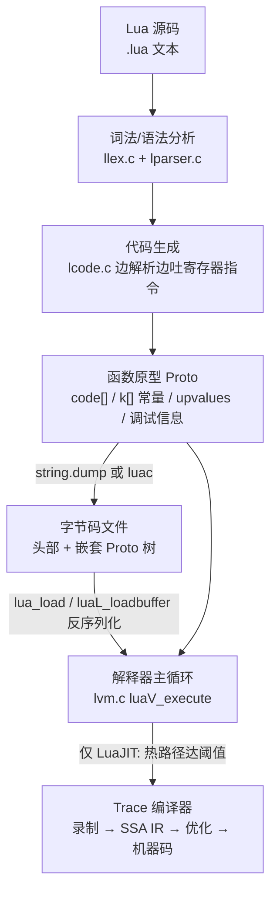
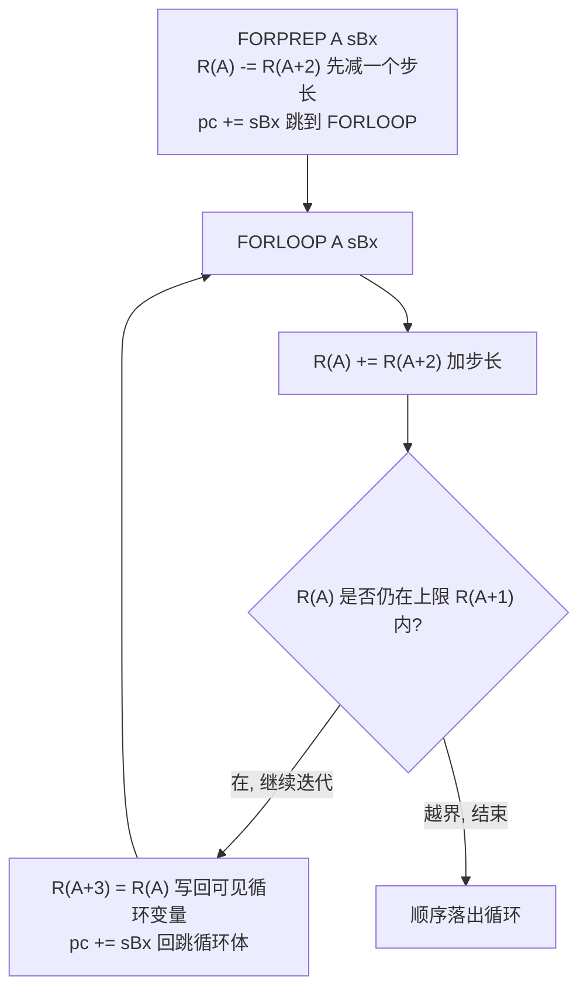
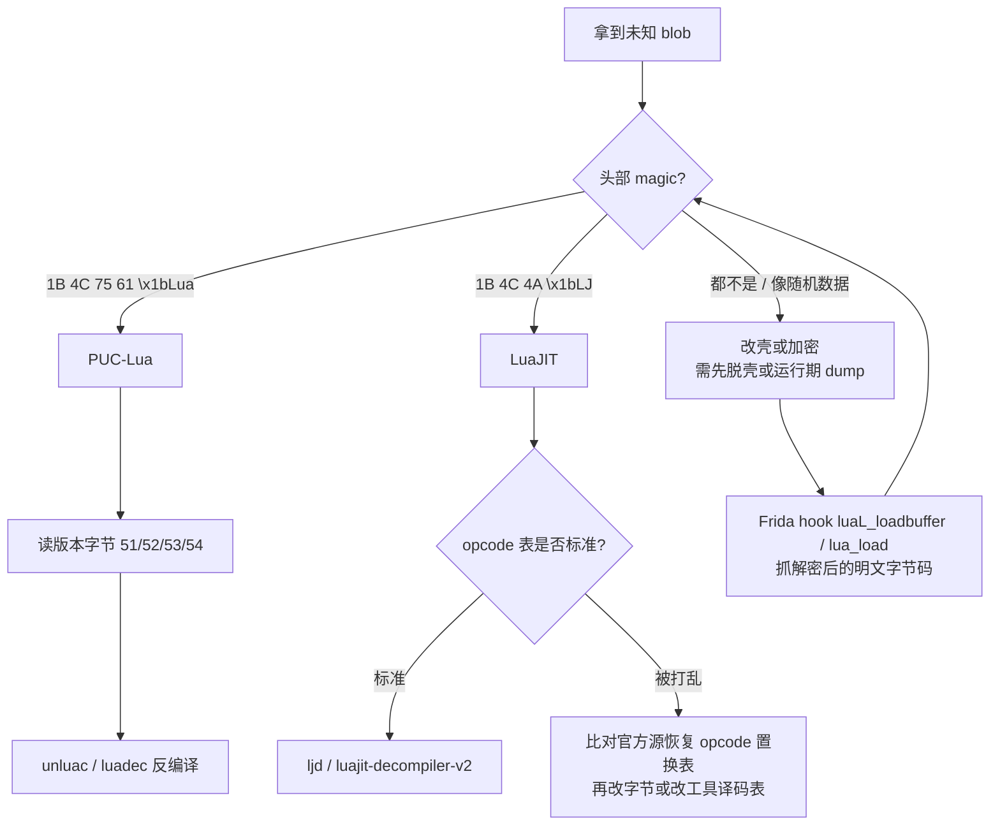

# 托管代码与字节码逆向（14）· Lua与LuaJIT字节码逆向
> [!abstract] TL;DR
> - PUC-Lua 自 5.0 起是**寄存器式**虚拟机：32 位定长指令、寄存器就是栈帧里的槽位（slot），比栈式 VM 指令数量少一半、分派次数更省，代价是指令变宽、代码生成更复杂。
> - `luac` 字节码文件 = 头部（`\x1bLua` + 版本字节 + 尺寸/字节序自描述）+ 嵌套的函数原型 `Proto`；5.1→5.4 指令位域、opcode 表、常量编码逐版本改动，逆向第一步必须**先定版本**。
> - LuaJIT 是 Mike Pall 的独立实现，字节码 magic（`\x1bLJ`）、opcode 集（VN/NV/VV 算术特化、J/I 分派变体、比较即跳转）、文件布局（ULEB128、GC 常量倒序索引）与 PUC-Lua **完全不同**，且**没有官方反编译器**。
> - 反汇编靠 `luac -l -l` 与 `luajit -bl`；反编译 PUC-Lua 用 unluac / luadec，LuaJIT 用 ljd / luajit-decompiler-v2；遇到改 magic、置换 opcode、XOR 加密的样本，正解是 Frida 在 `luaL_loadbuffer` 处 dump 明文字节码。
> - 安全红线：**Lua VM 不校验字节码**——把不可信二进制块喂给 `load` 等于内存破坏/任意代码执行；`load` 的 `mode` 参数（只收文本）与移除 `os/io/debug` 的沙箱，是唯一正确的信任边界。

## 概述与定位

Lua 是一门为**嵌入**而生的脚本语言：解释器本体只有一百多 KB，以 C API 的形式被宿主程序（游戏引擎、网络设备固件、Nginx、Redis、Wireshark、Adobe 系产品、无数手游）内嵌驱动业务逻辑。正因为它无处不在且天然“可热更新”，Lua 字节码成了逆向工程里高频出现的目标：拆解手游的战斗数值与协议、分析路由器固件里的配置脚本、排查以 Lua 承载的恶意载荷、给单机游戏做 Mod，都绕不开读懂 Lua 的编译产物。

需要在一开始就厘清的关键事实是：**“Lua 字节码”不是一种格式，而是两套彼此不兼容的世界**。一套是 lua.org 的官方参考实现（业界习惯叫 **PUC-Lua**，PUC 指里约热内卢天主教大学），版本线是 5.1 / 5.2 / 5.3 / 5.4；另一套是 Mike Pall 独立编写的高性能实现 **LuaJIT**（对标 Lua 5.1 语义，扩展了 5.2/5.3 的部分特性，但字节码是全新设计）。两者源码层面兼容（同样的 `.lua` 都能跑），但编译出来的字节码在文件魔数、指令编码、opcode 语义上毫无共性。逆向时若把 LuaJIT 的 blob 拿去喂 PUC 的反编译器，只会得到满屏乱码——所以**分辨实现与版本，是所有后续工作的前置**。

在本系列的坐标系里，Lua 提供了一个与前几篇鲜明对照的样本。JVM（[[03.JVM字节码指令集详解]]）、CIL（[[07.dotNET-CLR与CIL执行模型]]）、CPython（[[13.Python字节码与pyc反编译]]）清一色是**栈式**虚拟机——指令通过操作数栈隐式传参；而 Lua 5.0 是脚本语言里第一个把**寄存器式**设计做到主流的，这直接决定了它的反汇编“长相”和反编译难点都自成一格。把 Lua 放在托管字节码谱系里看，它是“最轻、最贴近 C、却最早走寄存器路线”的一支，理解它反过来能加深对栈式方案取舍的认识。

## 原理与机制

### 为什么是寄存器式：一次影响深远的设计选择

Lua 4.0 及更早采用栈式字节码，Lua 5.0（2003 年）切换为寄存器式，论文《The Implementation of Lua 5.0》系统论证了动机。解释器的性能瓶颈在**指令分派**（每条指令都要一次 `switch`/`goto` 跳转，伴随分支预测失败）。栈式 VM 表达一个 `a = b + c` 需要“压 b、压 c、加、存 a”四条指令；寄存器式一条 `ADD a, b, c` 即可，因为操作数直接用槽位号寻址。指令条数近乎减半，分派开销随之减半，这是寄存器式在解释器（无 JIT 时）通常更快的根因。

代价有三：其一，指令必须变宽以容纳多个操作数号（Lua 用固定 32 位），静态体积比紧凑的栈式字节码大；其二，编译器要做寄存器分配，代码生成器 `lcode.c` 复杂度显著上升；其三，寄存器复用让**反编译**更难——同一个槽位在函数不同区段承载不同的临时值或局部变量，反编译器必须靠数据流分析才能还原变量边界。这三点后面在实战与安全小节都会回扣。

这里的“寄存器”并非 CPU 寄存器，而是当前函数在 Lua 数据栈上分得的一段连续槽位。每个函数原型记录了自己需要的最大槽位数（`maxstacksize`），调用时解释器为其在栈上开一个窗口，`R(0)`、`R(1)`…就是窗口内的偏移。这个“寄存器即栈槽”的等价关系，是读懂 `CALL`、`RETURN`、`VARARG` 等指令为何用连续槽位区间传参返值的钥匙。

### 编译与执行的流水线



Lua 没有独立的“汇编器”阶段——`lparser.c` 一边语法分析一边由 `lcode.c` 直接产出寄存器指令，编译结果封装成**函数原型 `Proto`**。一个 `Proto` 内含：指令数组 `code[]`、常量表 `k[]`（字符串、数字等字面量）、嵌套子函数原型数组 `p[]`（每个内层 `function` 都是一个子 `Proto`）、上值描述 `upvalues[]`，以及可选的调试信息（行号表 `lineinfo`、局部变量名 `locvars`、上值名）。`Proto` 是一棵树：顶层 chunk 是根，每个闭包定义挂一个孩子。`string.dump(f)` 或 `luac` 做的，就是把这棵树**序列化**成字节流；`lua_load` 反过来把字节流还原成内存里的 `Proto` 树，再交给解释器执行。逆向拿到的 `.luac`/dump 文件，本质就是这棵树的线性化快照。

### 执行模型：分派循环、常量、上值与闭包

PUC-Lua 的心脏是 `lvm.c` 里的 `luaV_execute`——一个巨大的取指-译码-执行循环。在支持“标签取地址”（labels-as-values，GCC/Clang 扩展）的编译器上，Lua 用**计算跳转**（`goto *disptab[opcode]`）代替 `switch`，把分派做成一张跳转表，减少一次范围检查。这张分派表在剥离符号的二进制里是定位 Lua VM 的重要指纹：一段 ~40 项、每项指向短代码块的指针数组，配上 `\x1bLua` 常量串，基本可以锁定解释器位置。

指令里的操作数分两类来源：**寄存器**与**常量**。`LOADK` 把常量表某项装入寄存器；算术、比较类指令的操作数则可能是“RK 值”——一个字段既能表寄存器也能表常量（下一节详解编码）。**上值（upvalue）** 是闭包捕获的外层局部变量：`GETUPVAL`/`SETUPVAL` 读写，`CLOSURE` 指令在创建闭包时按原型的上值描述把外层槽位“绑”进来。上值有“开放/关闭”两态——变量还在栈上时上值指向栈槽（开放），外层作用域退出时 `CLOSE` 指令把值搬进闭包自身、切成关闭态。这套机制让 Lua 的闭包既高效又语义正确，也是反编译还原 `local`/闭包结构时必须逆着读的线索。

LuaJIT 在此之上多一层：字节码解释器（用 DynASM 手写汇编，不是 C `switch`）跑热度计数，循环回边与函数入口累计到阈值就触发 **Trace JIT**——把一条实际执行路径录制成线性 SSA 中间表示，做类型特化、循环优化后编译成机器码。但要强调：**Trace 只存在于运行期，不会被 `string.dump` 序列化**。逆向 LuaJIT 拿到的永远是字节码，不是 trace 机器码；trace 只有在动态调试 `-jdump` 时才看得到。

## 指令编码与字节码文件详解

这一段是本篇的核心：把两套实现的指令位域、RK 编码、opcode 家族和文件布局拆到能“手工反汇编”的粒度。

### PUC-Lua 指令位域（以 5.1 为基准）

Lua 5.1 每条指令是 32 位，opcode 占低 6 位，共四种格式。位布局（从最低位 bit0 起）如下：

```
 bit: 31        23        14        6         0
      +---------+---------+---------+---------+
iABC  |   B(9)  |   C(9)  |   A(8)  |  Op(6)  |
      +---------+---------+---------+---------+
iABx  |       Bx(18)      |   A(8)  |  Op(6)  |   Bx 无符号
      +-------------------+---------+---------+
iAsBx |      sBx(18)      |   A(8)  |  Op(6)  |   sBx = Bx - 131071 (有符号偏置)
      +-------------------+---------+---------+
iAx   |            Ax(26)           |  Op(6)  |   5.3+ 才有, 供 EXTRAARG
      +----------------------------+---------+
```

几个必须记住的常量：A 字段 8 位（0–255），B/C 各 9 位（0–511），Bx 是 B、C 拼成的 18 位（0–262143），sBx 把 Bx 减去 `MAXARG_sBx = 131071` 得到有符号跳转偏移。为什么跳转要用“偏置”而非补码？因为字节码流本身是无符号读出的定长字段，用固定偏置把无符号区间对折成有符号区间，解码只需一次减法，且跳转范围对称（约 ±131071 条指令），实现最简。这一点在读 `JMP`、`FORPREP`、`FORLOOP` 的目标地址时天天用到。

### RK 编码：一个位区分寄存器与常量

`iABC` 的 B、C 字段是 9 位，其中**最高位（bit8，掩码 `0x100`，源码叫 `BITRK`）是标志位**：为 0 时该字段是寄存器号 `R(x)`（x 取低 8 位），为 1 时是常量号 `K(x)`。

```
9 位 B/C 字段的语义：
  bit8 = 0  →  R(低8位)   引用寄存器 0..255
  bit8 = 1  →  K(低8位)   引用常量表项 0..255
例: ADD 0 1 256  →  R(0) := R(1) + K(0)   (256 = 0x100, 即 bit8 置位后的 K(0))
```

这解释了为什么手工反汇编 `ADD 0 250 256` 时，250 是寄存器而 256 却指向常量 0：不是随便的大数，而是 RK 标志位在起作用。RK 的设计动机是**省一条 LOADK**——`x = y + 1` 里的字面量 1 可直接作为常量操作数进算术指令，不必先装入寄存器。反编译器必须识别 RK 才能把 `K(0)` 还原成源码里的字面量而非某个临时变量。

### PUC-Lua 5.1 opcode 家族（38 条）

按功能归类记忆最省力：

- **数据搬运**：`MOVE`（寄存器间复制）、`LOADK`（装常量）、`LOADBOOL`（装布尔，C 非零时额外跳一条——用于比较结果物化）、`LOADNIL`（把一段寄存器置 nil）。
- **全局与上值**：`GETGLOBAL`/`SETGLOBAL`（5.1 专有，经全局表）、`GETUPVAL`/`SETUPVAL`。
- **表操作**：`NEWTABLE`（B、C 用浮点式尺寸提示预分配数组/哈希部分）、`GETTABLE`/`SETTABLE`、`SELF`（方法调用糖 `a:b()`，一步取方法并复制 self）、`SETLIST`（批量填数组，每批 `LFIELDS_PER_FLUSH=50` 项）。
- **算术/逻辑**：`ADD/SUB/MUL/DIV/MOD/POW/UNM/NOT/LEN/CONCAT`，操作数多为 RK。
- **比较与跳转**：`JMP`（用 sBx）、`EQ/LT/LE`（“条件不等于 A 就跳过下一条”的**布尔化跳转**范式）、`TEST`/`TESTSET`（实现 `and`/`or` 短路与条件赋值）。
- **调用与返回**：`CALL`（`R(A)` 是函数，`R(A+1..A+B-1)` 是参数，返回值放回 `R(A..A+C-2)`，B/C 为 0 表示“到栈顶”的可变长度）、`TAILCALL`、`RETURN`、`VARARG`。
- **循环**：`FORPREP`/`FORLOOP`（数值 for）、`TFORLOOP`（泛型 for，配迭代器）。
- **闭包**：`CLOSURE`（按 `Bx` 指定的子原型建闭包）、`CLOSE`（关闭上值）。

数值 for 是反汇编里最好认的骨架，它固定占用 4 个连续寄存器（索引、上限、步长 + 可见循环变量），状态流转如下：



看到“`FORPREP` … 循环体 … `FORLOOP` 回跳”这个夹心，就能立刻还原成 `for i = a, b, c do … end`，这是模式识别式反编译的典型。

### 版本差异：5.1 → 5.4 的迁移陷阱

- **5.2**：删除 `GETGLOBAL`/`SETGLOBAL`，全局访问改为经 `_ENV` 上值 + `GETTABUP`/`SETTABUP`（主 chunk 的第一个上值就是 `_ENV`）；引入 `goto` 语句；`LOADNIL` 参数语义改变；泛型 for 拆成 `TFORCALL`+`TFORLOOP`。
- **5.3**：数字分裂为整数/浮点两个子类型，新增整除 `IDIV` 和位运算 `BAND/BOR/BXOR/SHL/SHR/BNOT`；引入 `iAx` 格式与 `EXTRAARG`、`LOADKX`（常量索引超过 RK 8 位范围时用扩展参数）。
- **5.4**：opcode 表大改，新增 `LOADI`/`LOADF`（直接装小整数/浮点立即数）、`LOADFALSE`/`LOADTRUE`/`LFALSESKIP`（布尔物化优化）、`TBC`（to-be-closed 变量，配 `<close>` 语义）、以及重排的 for 循环指令；行号信息改为相对编码。

对逆向的直接后果：**同一段源码在不同版本编出的字节码，opcode 号和格式都不同**。工具必须按版本字节切换译码表，unluac 内部就是维护多套版本描述。误判版本会让每条指令都译错。

### PUC-Lua 字节码文件头

以 5.1 为例，文件开头 12 字节是自描述头：

```
偏移 内容
0    1B 4C 75 61     签名 "\x1bLua"  (ESC + 'L' 'u' 'a')
4    51              版本 0x51 = 5.1  (52/53/54 对应 5.2/5.3/5.4)
5    00              格式号 0 = 官方
6    01              字节序 1=小端 0=大端
7    04              sizeof(int)
8    04/08           sizeof(size_t)   (32/64 位不同!)
9    04              sizeof(Instruction)
10   08              sizeof(lua_Number)
11   00              整数标志 0=Number 为浮点
```

5.3/5.4 头部换了更稳健的设计：签名后紧跟 6 字节 `LUAC_DATA`（`19 93 0D 0A 1A 0A`）——把 `\r\n`、`\x1a`（DOS EOF）、`\n` 混进去，用来**检测传输途中被文本模式转换损坏**（例如 FTP 的 CRLF 篡改）；随后写各类型尺寸，再写 `LUAC_INT`（值 0x5678，验字节序）和 `LUAC_NUM`（值 370.5，验浮点格式）。头部这些尺寸字段揭示一个逆向硬约束：**PUC-Lua 字节码不跨平台**——64 位机编的 dump 因 `size_t`=8 而无法在 32 位机加载，大小端不匹配同理。分析样本前，先核对头部与你的加载环境一致，否则连载入都做不到。

### LuaJIT 指令位域与 opcode 家族

LuaJIT 同样是寄存器式、32 位定长，但布局按**字节**切分，且 opcode 占**低 8 位**（0–255，容得下它 90 多个特化指令）：

```
小端 32 位字在内存中的字节序：
  byte0 = OP(8)   byte1 = A(8)   byte2 = C(8)   byte3 = B(8)     → ABC 格式
  byte0 = OP(8)   byte1 = A(8)   byte2..3 =  D(16)               → AD  格式
解码宏 (lj_bc.h):
  op = i & 0xff;   a = (i>>8)&0xff;
  c = (i>>16)&0xff;  b = (i>>24);   d = i>>16;   // D 与 (B<<8|C) 重叠
```

LuaJIT 的 opcode 设计哲学是**为解释器分派提速而做算术特化**，读它的反汇编要先接受几条“反直觉”约定：

- **算术三分身**：`ADDVV`（寄存器+寄存器）、`ADDVN`（寄存器+数字常量）、`ADDNV`（数字常量+寄存器），`SUB/MUL/DIV/MOD` 同理。特化省去运行期判断操作数来源，但也意味着同一个 `+` 会因操作数形态编成不同 opcode。
- **比较即跳转**：`ISLT/ISGE/ISLE/ISGT/ISEQV/ISNEV/ISEQS/ISEQN/ISEQP…` 不产生布尔值，而是“条件不成立就跳过紧随其后的 `JMP`”；`ISTC`/`ISFC`（test-and-copy）合并了 `and`/`or` 的测试与条件复制，`IST`/`ISF` 只测不复制。
- **常量装载**：`KSTR`（字符串常量，在 GC 常量表里**从末尾倒着索引**）、`KSHORT`（16 位立即整数装进 D）、`KNUM`（数字常量表）、`KPRI`（nil/false/true 三个原语）、`KNIL`（清一段槽位）。
- **表/全局/上值**：`TNEW`/`TDUP`（新建/复制模板表）、`GGET`/`GSET`（全局，走 `_ENV`）、`TGETV/TGETS/TGETB`（按变量/字符串/字节键取，键形态决定 opcode）与对应 `TSET*`、`TSETM`（批量设置）、`UGET`/`USETV/USETS/USETN/USETP`、`UCLO`（关闭上值）、`FNEW`（建闭包）。
- **调用/返回/循环**：`CALL/CALLM/CALLT/CALLMT`（M 后缀=多返回值展开到栈顶，T=尾调用）、`RET/RET0/RET1/RETM`、`ITERC/ITERN`（泛型 for 迭代，`ITERN` 专为 `next`/`pairs` 特化）、`FORI/FORL`、`LOOP`、`JMP`。
- **J/I 前缀变体**：`JFORL`/`IFORL`、`JLOOP`/`ILOOP`、`FUNCF`/`IFUNCF`/`JFUNCF` 等。前缀 `I`=交给解释器版本、`J`=已被 JIT 编译的 trace 入口。这些**多数由运行期热路径替换生成**，静态 dump 里通常只见基础形态（`FORL`/`LOOP`/`FUNCF`）；理解它们的存在，才不会在动态调试看到 `JFORL` 时误判字节码被改。

### LuaJIT 字节码文件头与可移植性

LuaJIT dump 头部：`1B 4C 4A`（`\x1bLJ`）+ 1 字节版本（2.0 为 1，2.1 为 2）+ 1 字节标志位（ULEB128）：`BCDUMP_F_BE`（大端）、`BCDUMP_F_STRIP`（已剥调试信息）、`BCDUMP_F_FFI`（用到 FFI）、`BCDUMP_F_FR2`（2.1 的双槽帧布局）。未剥离时随后是 chunkname，再是各原型块；每个原型用 **ULEB128** 编长度与计数，依次写 flags、参数数、帧大小、上值数、GC 常量数、数字常量数、字节码数，然后是指令流、上值、GC 常量（字符串/子原型/表/cdata）、数字常量（ULEB128，最低位标识整数还是双精度），末尾是可选调试信息。

与 PUC 相反，**LuaJIT 字节码被设计成跨架构可移植**（用 ULEB128 与显式大小端标志规避尺寸差异）——同一份 dump 能在 x64、ARM 上互跑，但**强绑 LuaJIT 版本**，2.0 与 2.1 互不兼容，`FR2`/GC64 标志不匹配也会拒载。这个“跨机器却不跨版本”的特性，正好和 PUC 的“跨版本头部自描述、却不跨机器尺寸”形成镜像，是判断样本来源的又一线索。

## 工具视角与实战

### 反汇编：官方自带即够用

- **PUC-Lua**：`luac -l file.lua` 列一层反汇编，`luac -l -l` 连常量表、上值、局部变量、行号一并输出。若手头只有 `.luac`，直接 `luac -l -l file.luac`（版本要匹配你的 `luac`）。ChunkSpy（Kein-Hong Man 用纯 Lua 写的 5.1 分析器）能做更细的字节级剖析，配套文档《A No-Frills Introduction to Lua 5.1 VM Instructions》是手工反汇编的最佳入门。
- **LuaJIT**：`luajit -bl file.lua` 列字节码，`luajit -b file.lua out.raw` 导出原始 dump，`-bg` 保留调试信息，还能 `-b` 成 C 源/头文件/目标文件用于嵌入。列表由 `jit/bc.lua` 模块实现；trace 机器码则用 `luajit -jdump`（内部调 `jit.dis_x64`/`dis_arm` 等反汇编器）观察——但那是 JIT 输出，不属于可序列化字节码。

### 反编译：从字节码回到近似源码

- **unluac**（Java）是当下 PUC-Lua 反编译的首选，覆盖 5.0–5.4，能重建 `goto`、`_ENV`、闭包与上值结构，遇到剥离样本也能产出带 `r0/r1` 占位名的可读代码。**luadec** 专攻 5.1，历史悠久但对复杂控制流（深层短路、多重循环）易出错。
- **LuaJIT** 没有官方反编译器，社区工具按版本各自为战：**ljd**（Python）主打 2.0 但久未维护、覆盖不全；**luajit-decompiler-v2** 针对 2.1 更完整；**LuaAssemblyTools（LAT）** 提供汇编/反汇编与字节码改写。LuaJIT 难反编译的深层原因是格式属“内部实现细节”、Mike Pall 明确声明字节码不是稳定 ABI，且 opcode 特化多、版本漂移快，工具永远在追版本。

反编译的本质是**逆着数据流重建**：从 `JMP`/循环指令还原控制结构（if/else、while、for），从寄存器读写链重建表达式树，用调试信息（若在）把寄存器改回变量名。寄存器复用、临时值与局部变量难分、短路求值的 `TESTSET` 分支，是所有反编译器的共同痛点——所以输出常需人工校对，尤其在调试信息被 `luac -s` 剥掉后。

### 对付加密、改壳、置换 opcode 的样本



商业手游最常见三种反逆向手法：**改 magic/版本字节**（骗过标准工具的识别）、**XOR/自定义算法加密整段字节码**（内存里临解临用）、**置换 opcode 编号**（把 VM 分派表和字节码同步换一套映射，标准解释器跑不了、标准工具译不对）。应对策略：

1. **运行期 dump（最省力）**：无论怎么加密，字节码在被 `lua_load`/`luaL_loadbuffer` 消费的一刻必然已是明文。用 Frida 挂住这两个 C API，在入口把 `buff`/`size` 落盘，就拿到解密后的原始 blob，绕开所有静态加密。这是实战里性价比最高的一招。
2. **恢复 opcode 置换**：若 magic/opcode 被改而未加密，就在二进制里定位内嵌 VM——PUC 找 `luaV_execute` 的分派表与 `\x1bLua` 串，LuaJIT 找 DynASM 生成的 `lj_vm_asm` 跳转结构（注意 LuaJIT 解释器是**手写汇编**，读起来比 C `switch` 费劲，这也是它常被选作改表载体的原因）。逐条比对官方 opcode 语义，重建置换表后，要么把样本字节码映射回标准编号交给工具，要么改工具的译码表。
3. **先脱壳**：若外层是通用加壳（UPX、VMProtect 等），按 [[15.托管代码脱壳与运行时dump]] 的思路先把宿主还原，再谈 Lua 层。

### 一段反汇编怎么读

拿到 `luac -l` 的一行 `2 [3] ADD 2 0 256`：`2` 是指令序号，`[3]` 是源码行号（调试信息在时才有），`ADD` 是 opcode，`2 0 256` 是 A、B、C。按 RK 规则，B=0 是 `R(0)`、C=256 越过 `0x100` 是 `K(0)`，于是语义为 `R(2) := R(0) + K(0)`。再结合常量表里 `K(0) = 1`、局部变量表里 `R(0)=x`、`R(2)=y`，即可还原成 `y = x + 1`。手工反汇编的全部功夫，就是把这种“序号+opcode+RK 操作数+常量/变量表”交叉查表，逐条拼回源码。

## 安全性与正确使用

Lua 字节码逆向牵出的头号安全事实是：**PUC-Lua 从 5.0 起彻底不校验字节码**。Lua 4 曾尝试写字节码验证器，作者最终认定“无法做到滴水不漏”而移除——于是 VM **默认信任**喂进来的二进制块。这意味着一段精心构造的恶意字节码可以让指令引用越界寄存器、伪造 `Proto` 字段、错配常量类型，直接造成**内存越界读写乃至任意代码执行**。结论极其重要：**把不可信来源的二进制块交给 `load` 等价于运行任意 native 代码**，其危险性远超“执行一段脚本”。

正确的信任边界有两道：

- **限制加载模式**：Lua 5.2 起 `load(chunk, chunkname, mode, env)` 的 `mode` 参数可设为 `"t"`（只接受文本源码，拒绝二进制），处理任何外来输入时**务必显式传 `"t"`**，从源头堵死字节码注入。绝不要对网络/文件/用户输入用默认（`"bt"`，二进制也收）。
- **沙箱化**：给不可信脚本一个受限的 `env`（第 4 参数），移除或包裹 `os`、`io`、`debug`、`load`/`loadstring`、`dofile`、`require`、`package` 等能触达系统与内存的接口。尤其 `debug` 库能读写栈、上值、注册表，等于沙箱后门，**必须移除**。

关于**用字节码做知识产权保护**要泼一盆冷水：编译成 `.luac`/dump **不是加密，只是编码**。上文的反汇编/反编译/运行期 dump 链条足以还原逻辑，字节码顶多抬高门槛、拦住脚本小子。真要保护，应把敏感逻辑放服务端、对传输通道做真正的加密与签名，而非指望字节码本身的“不可读”。反过来看加固方（改 magic、加密、置换 opcode）的收益也有限——只要脚本终究要在本机被解释执行，`load` 那一刻的明文就无法回避，运行期 dump 恒能得手；这些手段只提高成本、不提供密码学意义的机密性。

从**逆向者一侧**的正确使用看：分析他人 Lua 字节码涉及版权与授权边界，用于安全研究、互操作、漏洞挖掘、自有资产分析是正当场景，但绕过商业游戏的反作弊、二次分发他人代码可能触犯条款与法律。技术能力与使用边界要分清。最后一点操作安全：**不要在生产解释器里直接加载你正在分析的可疑字节码**——它可能就是利用“不校验”特性的内存破坏载荷，务必在隔离沙箱/虚拟机里、以只反序列化不执行（或打了校验补丁的 VM）的方式处置。

## 小结

Lua 字节码逆向的第一原则是**分清世界**：PUC-Lua（`\x1bLua`，寄存器式，5.1–5.4 逐版本变格式）与 LuaJIT（`\x1bLJ`，opcode 特化、无官方反编译器、跨机不跨版本）是两套不兼容体系，先辨实现再定版本。理解寄存器式 VM“寄存器即栈槽、指令更少、分派更省”的设计，掌握 iABC/iABx/iAsBx 位域与 RK 编码，就能手工读懂 PUC 反汇编；接受 LuaJIT 的字节切分布局、算术三分身与“比较即跳转”约定，才能读它的 `luajit -bl`。工具上，`luac -l -l`/`luajit -bl` 反汇编、unluac/luadec 与 ljd/luajit-decompiler-v2 反编译覆盖绝大多数标准样本；改壳、加密、置换 opcode 的硬骨头，则用 Frida 在 `luaL_loadbuffer` 处 dump 明文一击制胜。安全上牢记 VM 不校验字节码这条红线，`load` 的 `"t"` 模式与去 `os/io/debug` 的沙箱是不可放弃的边界。把这套“辨版本 → 读位域 → 选工具 → 必要时动态 dump”的流程走顺，Lua 与 LuaJIT 的字节码就不再是黑盒。

## 相关阅读

- 官方规范：Lua 5.1/5.2/5.3/5.4 参考手册（lua.org/manual），逐版本 opcode 与 `load` 语义的权威依据。
- 设计论文：《The Implementation of Lua 5.0》（lua.org/doc/jucs05.pdf），寄存器式 VM 与 RK/上值机制的一手论证。
- LuaJIT：luajit.org 官方文档、`lj_bc.h`/`lj_bcdump.h` 源码，以及 `luajit -b`/`-jdump` 的用法说明。
- 工具与教程：unluac（PUC-Lua 5.0–5.4 反编译）、luadec（5.1）、ljd 与 luajit-decompiler-v2（LuaJIT）、ChunkSpy 及《A No-Frills Introduction to Lua 5.1 VM Instructions》。
- 本系列与同库：[[13.Python字节码与pyc反编译]]（栈式 VM 的对照）、[[03.JVM字节码指令集详解]]（另一种字节码指令集）、[[15.托管代码脱壳与运行时dump]]（加密/改壳样本的运行期 dump 思路）。
- 横向格式与运行时：[[23.C_C++运行时与ABI/01.运行时与ABI概览]]（内嵌 Lua 与宿主原生 ABI 的边界）、[[13.PE文件详解/07-详解PE文件(七)：数据目录]]（内嵌解释器如何寄生在宿主可执行体中）、[[35.Android逆向与运行时/03.DEX文件格式]]（同为寄存器式的 Dalvik 字节码对照）、[[40.WASM与虚拟化壳逆向/02.WASM指令集与执行模型]]（另一类可移植字节码的执行模型）。

[[00.托管代码与字节码逆向总览|⬆ 系列总览]] | [[13.Python字节码与pyc反编译|← 上一章]] | [[15.托管代码脱壳与运行时dump|→ 下一章]]