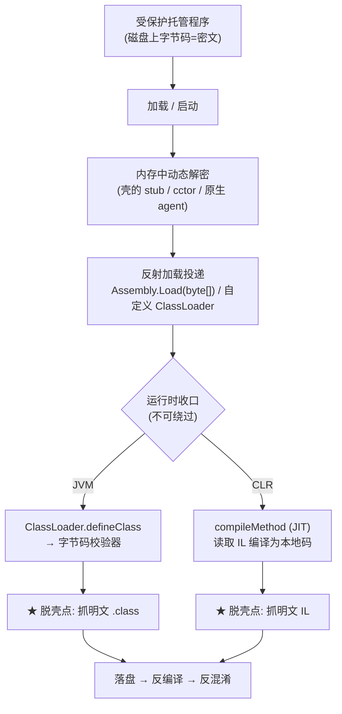
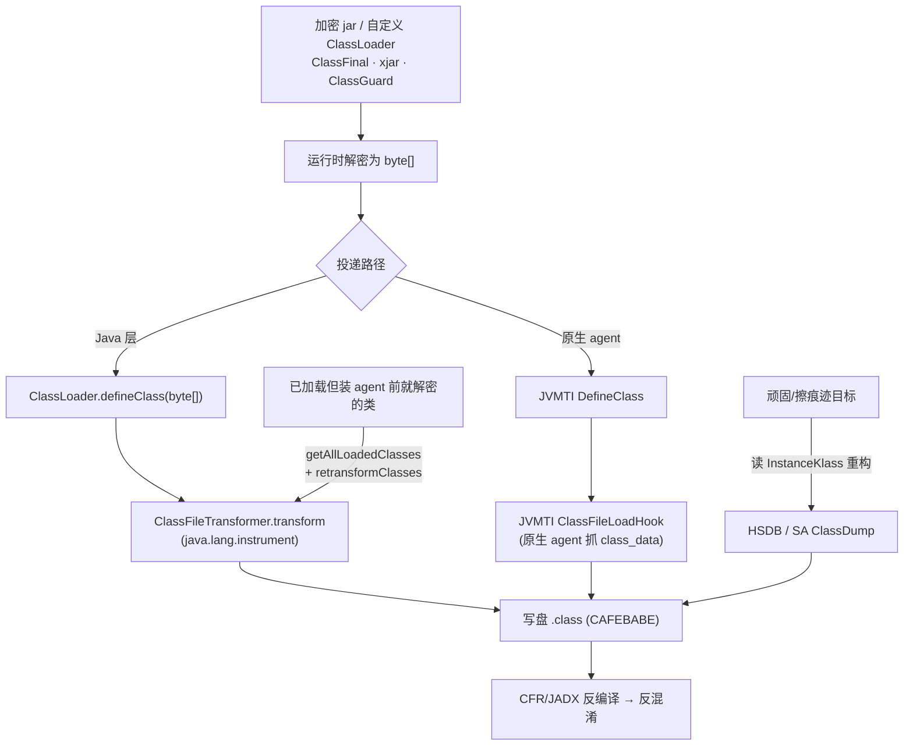
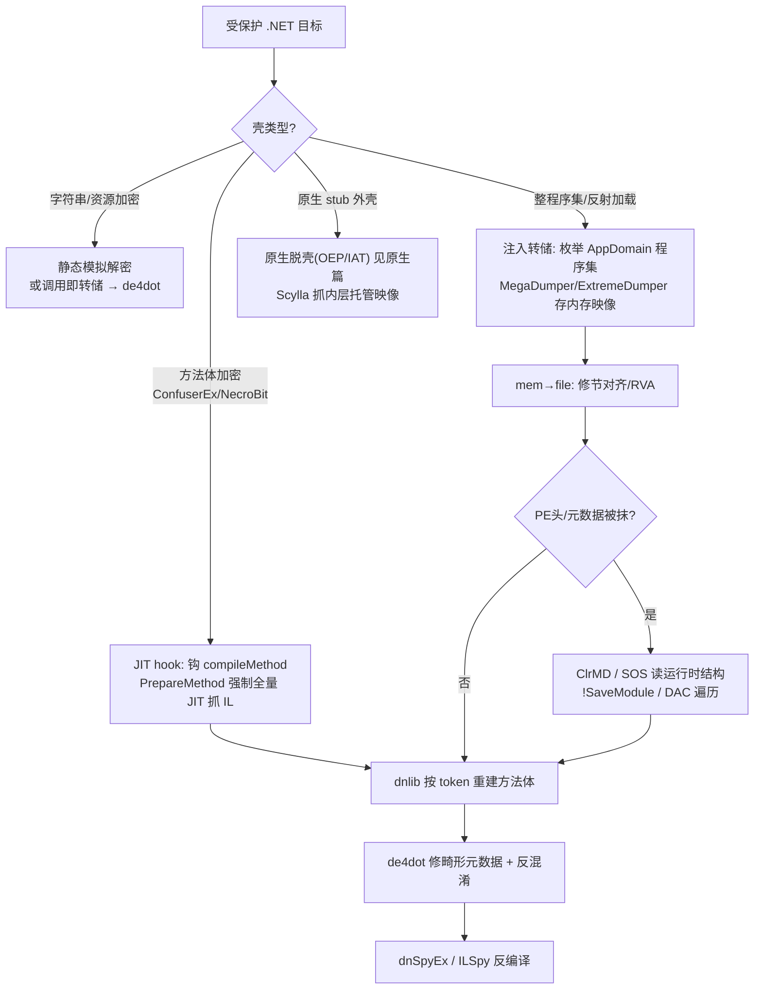

# 托管代码与字节码逆向（15）· 托管代码脱壳与运行时dump
> [!abstract] TL;DR
> - 托管脱壳的第一性原理是**运行时即预言机（the runtime is the oracle）**：托管代码无论被怎样加密，最终都要以**规范形态**交给运行时那条不可改的收口——JVM 的 `ClassLoader.defineClass`、CLR 的 `ICorJitCompiler::compileMethod`（JIT）。在收口处 hook，就必然拿到明文。
> - 三个动作是一体的：**反射加载**（`Assembly.Load(byte[])` / 自定义 ClassLoader / `defineHiddenClass`）是密文进入运行时的投递通道；**动态解密还原**发生在投递前的内存里；**内存转储**则在收口处或投递后把还原出的字节抓下来。
> - JVM 侧脱壳近乎"平推"：因为字节码校验器要求标准 `.class`，一切"class 加密"本质是**解密后再 defineClass**（ClassFinal / xjar / ClassGuard 皆然），一个装在其解密之后的 `ClassFileTransformer` 或 JVMTI `ClassFileLoadHook` 就是万能脱壳点，配 `retransformClasses` 还能补抓已加载类。
> - CLR 侧的皇冠是 **JIT hook**：拦截 `compileMethod` 拿 `CORINFO_METHOD_INFO.ILCode/ILCodeSize`（此刻已是解密后的 IL），再用 `RuntimeHelpers.PrepareMethod` 强制编译全部方法即可逐个抓 IL；对付 ConfuserEx anti-tamper、.NET Reactor NecroBit 这类"方法体加密"是标准解法。
> - 反-dump 的招数（抹掉内存里的 PE 头 / 元数据、注入 CLR 容忍但工具报错的畸形元数据）只是给转储器添堵：ClrMD / SOS 读**运行时结构**而非文件，能绕过 PE 头擦除；de4dot / dnlib 负责把畸形元数据修回可反编译。
> - 边界：Android DEX 壳见 [[35.Android逆向与运行时/03.DEX文件格式|DEX 篇]]、IL2CPP 的 metadata 转储见 [[12.Unity游戏逆向：Mono与IL2CPP]]、Python code object 转储见 [[13.Python字节码与pyc反编译]]、把逻辑搬进原生 VM 的壳见 [[40.WASM与虚拟化壳逆向/02.WASM指令集与执行模型]]——它们是同一原理在不同运行时上的投影。

## 概述与定位

本系列走到这里，前十四篇分别拆解了 JVM 的 class 文件、CIL 的元数据流、Unity 的 IL2CPP、Python 的 code object、Lua 的寄存器式字节码——每一篇都默认"拿到了字节码就能开始分析"。但现实中的商业软件、游戏、恶意载荷往往先**加壳**：字节码被加密、方法体被替换成密文、字符串被运行时解密、真正的程序集被塞进资源里等待反射加载。本篇是这条链条的收口，专讲**如何把被保护的托管代码从运行进程里"脱"出来还原成可反编译的字节码**，它横跨 JVM 与 CLR，并把 Android/Unity/Python 的专章串成同一张原理网。

先厘清三个容易混淆的概念，它们对应完全不同的对抗手段。**混淆（obfuscation）**改的是代码"长什么样"——名字重命名、控制流平坦化、字符串加密后仍是合法字节码，静态可读只是可读性差，对抗它靠反混淆（Java 见 [[06.Java混淆与反混淆]]，.NET 见 [[10.dotNET混淆器对抗与de4dot]]）。**原生化（AOT/编译成 C）**把托管逻辑变成机器码，产物里已无字节码，只能按原生二进制逆（NativeAOT 见 [[11.dotNET-AOT与NativeAOT逆向]]，IL2CPP 见 [[12.Unity游戏逆向：Mono与IL2CPP]]）。而本篇的主角是**加壳/加密（packing）**：字节码本体在磁盘上是密文，运行时才在内存里解密并交给运行时执行——它既不是"看不清"，也不是"变成了机器码"，而是"藏起来了"。脱壳的任务，就是抓住它现出原形的那一刻。

这一刻为什么必然存在？这是全篇的题眼，我称之为**"运行时即预言机"**。托管代码的定义权在运行时手里：一段 Java 逻辑要执行，就必须以合法 `.class` 字节流的形态穿过 `defineClass`；一段 .NET 逻辑要执行，就必须以合法 IL 的形态被 JIT 的 `compileMethod` 读取编译成本地码。加壳者可以任意折腾磁盘上的形态，却**无法改动运行时读取代码的那个契约边界**——除非他把逻辑彻底搬离托管世界（原生化、VM 化，那就出了本篇范畴、进了 [[11.dotNET-AOT与NativeAOT逆向]] 与 [[40.WASM与虚拟化壳逆向/02.WASM指令集与执行模型]] 的地界）。因此，只要逻辑还跑在托管运行时里，逆向者就能把自己安插在契约边界上，读到解密后的明文。这条铁律决定了托管脱壳的胜负手不在"能不能"，而在"在哪一个收口、用什么姿势抓、抓完怎么修"。

围绕这条铁律，标题里的三个关键词构成一个连贯的动作序列：**反射加载**是密文进入运行时的投递通道（把解密出的 `byte[]` 喂给 `Assembly.Load` 或自定义 ClassLoader）；**动态解密还原**是投递之前发生在内存里的变换（把密文 IL/class 变回明文）；**内存转储（dump）**是逆向者在收口处或投递后把还原结果抓下来落盘。理解它们是一体三面，就能在任何陌生壳面前快速定位下刀点。下面按"原理—收口详解—工具实战—安全"的顺序展开。

## 原理与机制

### 托管代码的生命周期与那两个不可绕过的收口

要脱壳，先得知道明文一定会流经哪里。把两大运行时的加载—执行流水线并排看，收口一目了然。

**JVM 侧**：任何一个类，无论来自 jar、网络、还是被自定义 ClassLoader 从加密 blob 里解出来，其原始 `.class` 字节都必须调用 `java.lang.ClassLoader.defineClass(name, byte[], off, len)`（或它的等价物：`Unsafe.defineAnonymousClass`、JDK 15+ 的 `Lookup.defineHiddenClass`、JVMTI 的 `DefineClass`）交给虚拟机。虚拟机随后对这段字节做**字节码校验（verifier）**——栈平衡、类型合法、跳转落在指令边界内。校验器的存在是 JVM 脱壳"平推"的结构性原因：它逼得所有 class 加密方案最终都要提交**标准的、能过校验的 `.class`**，无法用畸形字节流蒙混，于是 `defineClass` 这个收口的输入必然是干净明文。

**CLR 侧**：程序集加载时，元数据先被解析进内存，但**方法体（IL）默认是惰性 JIT 的**——只有某个方法第一次被调用，CLR 才把它的 IL 交给 JIT 编译器 `ICorJitCompiler::compileMethod` 编成本地码。这个"惰性 + 单一编译入口"给了脱壳者一个绝佳收口：你不需要在磁盘上解密 IL，只要 hook 住 `compileMethod`，每个方法被首次执行时，其解密后的 IL 就会主动送到你手上。CLR 没有 JVM 那种独立的字节码校验器（IL 的合法性主要靠 JIT 自身和有限的可验证性检查），所以壳能玩的花样更多（畸形元数据、方法体加密），但"IL 必经 JIT"这条收口同样不可绕过。



### 反射加载：密文进入运行时的投递通道

"反射加载"之所以是脱壳的关键词，是因为它**解耦了"磁盘上的密文"与"运行时里的明文"**：壳把真正的程序集/类当作加密数据存放（资源、独立文件、内嵌数组），启动时解密成一段内存 `byte[]`，再通过反射类 API 把这段字节"注册"进运行时。.NET 里最典型的是 `Assembly.Load(byte[])`——它从一段字节数组加载程序集，**根本不落盘**；此外还有 `Assembly.LoadFile/LoadFrom`、`AppDomain.Load`、以及运行时**动态生成**代码的 `Reflection.Emit`（`DynamicMethod`、`AssemblyBuilder`），后者连磁盘原型都没有，只存在于内存。JVM 里对应的是自定义 `ClassLoader` 覆写 `findClass` 后调用 `defineClass`、`Class.forName`、`Lookup.defineHiddenClass`。

这对脱壳有两重含义。其一，反射加载的**调用点本身就是干净的 hook 位置**：在 `Assembly.Load(byte[])` 入口抓那个 `byte[]`，就是完整的解密后程序集；在自定义 ClassLoader 的 `defineClass` 抓 `byte[]`，就是解密后的 class。其二，对于**运行时生成、无磁盘原型**的代码（Emit 出来的动态程序集、`defineHiddenClass` 出来的隐藏类），静态分析彻底无能为力，**只能从内存转储**——这类目标把"必须动态 dump"从"可选"变成了"唯一手段"。

### 加壳的三个层次与反-dump

托管壳按"加密粒度"从轻到重分三层，脱壳的着力点各不相同：

- **字符串/资源加密**：`"secret"` 被替换成 `Decrypt("...")` 的运行时调用，字节码结构不变。这层最弱，恢复靠"调用即转储"（invoke-and-dump）或静态模拟解密器（de4dot 的强项，见 [[10.dotNET混淆器对抗与de4dot]]）。
- **方法体/类加密**：单个方法的 IL、或整个 `.class` 被加密，运行时逐个解密。这层要在收口（JIT / defineClass）抓。ConfuserEx 的 anti-tamper、.NET Reactor 的 NecroBit、Java 的 ClassFinal/xjar 都在这层。
- **整程序集加密（payload 打包）**：真正的业务程序集整体加密塞进外层 loader/native stub，启动时解密后反射加载。这层要么 hook 反射加载点，要么等它加载完从内存把整个模块 dump 出来（MegaDumper 一类）。

在此之上，壳还会叠**反-dump / anti-tamper**：运行期把内存里 PE 头或元数据目录抹零（让"扫内存找 PE"的转储器扑空）、注入 CLR 能容忍但 dnlib/ILSpy 会报错的畸形元数据、加反调试（检测 `Debugger.IsAttached`、`NtQueryInformationProcess`）、模块 cctor 里做完整性校验。这些不改变"明文必经收口"的铁律，只是抬高抓取与修复的成本——后文详解逐一破解。

## 脱壳点定位、内存转储与动态解密详解

这一节把两大运行时的收口逐一拆到可操作的粒度：抓什么字节、在哪一刻抓、抓完怎么修。

### JVM 侧：defineClass 是万能脱壳点

**为什么是 defineClass。** 前面已论证：JVM 校验器逼所有 class 加密方案回归"解密后提交标准 `.class`"。因此不管壳是自定义 ClassLoader（把 AES 密文解成 `byte[]`）、还是像 ClassFinal/xjar 那样挂一个 `-javaagent` 在类加载时解密、还是 ClassGuard 那样用原生库解密，**明文 `.class` 字节最终都会作为某次 `defineClass`/`ClassFileLoadHook` 的输入出现**。你要做的是把自己插在"它们解密之后"的位置。抓到的字节以四字节魔数 `CA FE BA BE` 开头，是自包含的完整类文件，可直接反编译：

```
# 一段 .class 的开头（脱壳抓到的即是此形态，自包含、可反编译）
偏移  长度  含义
0     4     魔数 0xCAFEBABE          # 内存扫 class 的特征串
4     2     minor_version
6     2     major_version           # 52=Java8, 61=Java17 ...
8     2     constant_pool_count
10    ...   常量池 / 字段 / 方法 / 属性
```

**最干净的工具：instrumentation agent。** JDK 自带的 `java.lang.instrument` 提供了标准脱壳基础设施。写一个 premain agent 注册 `ClassFileTransformer`，其 `transform()` 会在每个类被定义前收到 `classfileBuffer`（即将 defineClass 的字节）——把它写盘即完成转储。关键在于用 `addTransformer(t, true)` 声明**可 retransform**，再配合 `Instrumentation.getAllLoadedClasses()` + `retransformClasses()`，就能对**已经加载**的类强制触发一次 transform，补抓那些在你 agent 装上之前就已解密加载的类。这套机制的妙处是它**站在 JVM 官方契约上**，壳无法阻止（除非它自己也是 agent 且先于你运行去干扰，但你可用启动参数保证 `-javaagent` 顺序，或用更底层的 JVMTI）。

```java
// 概念示例：一个把所有被定义的 .class 落盘的 transformer
public byte[] transform(ClassLoader l, String name, Class<?> redef,
                        ProtectionDomain pd, byte[] classfileBuffer) {
    Files.write(Paths.get("dump/" + name.replace('/', '.') + ".class"),
                classfileBuffer);      // 此刻 classfileBuffer 已是解密明文
    return null;                       // 返回 null 表示不修改字节码
}
```

删掉代码，原理仍成立：**JVM 在把任何字节流认作类之前，都会给注册的 transformer 过目一遍，逆向者借这只官方的"过目之手"抄下明文**。

**更底层：JVMTI 与 SA。** 有些壳用**原生 agent** 直接调 JVMTI 的 `DefineClass` 把字节喂进虚拟机，绕开 Java 层的 `ClassLoader.defineClass`——此时纯 Java 的 transformer 可能抓不全。对策是也下到 JVMTI 层：`ClassFileLoadHook` 事件对**每一次类加载和每一次 retransform** 都会带着 `class_data`（类字节）回调，无论字节从哪条路径进来都躲不过它。再顽固的目标，还能上 **Serviceability Agent（HSDB）**：它读活进程或 core dump 里的 `InstanceKlass` 结构，把已加载类**重构**回 `.class` 落盘——这条路连"抹掉 defineClass 痕迹"都无效，因为它读的是虚拟机内部已成形的类元数据。

**字符串/流程的动态还原。** class 抓回来后若字符串仍是 `a.b("密文")` 形式，用"调用即转储"：instrument 那个解密方法，记录每次 `(入参→返回值)`，再把常量回填进常量池；或按 [[06.Java混淆与反混淆]] 讲的静态模拟去算。二者的分野是：静态模拟不跑目标代码更安全，但遇到依赖运行时状态的解密就失效；instrument 必然正确但要执行目标（恶意样本须在隔离环境）。



### CLR 侧：JIT compileMethod 与内存转储

.NET 的脱壳比 JVM 花样多，因为没有强制的 IL 校验器、且 PE + 元数据的结构复杂到可被投毒。这里有两条主线：**JIT hook** 抓方法级 IL、**内存转储**抓整模块。

**皇冠——JIT hook。** CLR 的 JIT 编译器由 `clrjit.dll` 导出的 `getJit()` 返回一个 `ICorJitCompiler*`，其虚表首个函数就是 `compileMethod`。当任一方法首次执行，CLR 调 `compileMethod(ICorJitInfo*, CORINFO_METHOD_INFO* info, flags, ...)`，其中 `info->ILCode` 指向该方法的 **IL 字节**、`info->ILCodeSize` 是长度——**关键在于：无论方法体在元数据里是不是密文，送到这里的 IL 已是 JIT 能读懂的明文**（壳的解密逻辑必然在 JIT 之前跑完，否则 JIT 无法编译）。脱壳者替换 `compileMethod` 指针，在自己的钩子里先把 `(方法 token, ILCode, ILCodeSize)` 存下来，再转调原 `compileMethod` 保证程序正常跑。要抓全，用 `RuntimeHelpers.PrepareMethod(handle)` 遍历所有方法句柄**强制 JIT**，把懒加载变成主动全量编译，逐个收集 IL 后用 dnlib 重建一个干净程序集。

```
# compileMethod 钩子里能拿到的关键字段（概念）
CORINFO_METHOD_INFO {
    ftn         // 方法句柄 → 反查 metadata token
    ILCode      // → 指向【已解密】的 IL 字节流
    ILCodeSize  // → IL 长度
    maxStack, EHcount, locals, args ...
}
# 抓取 = 读 [ILCode, ILCode+ILCodeSize)，按 token 回填进 dnlib 重建的方法体
```

这套路是对付**方法体加密**的标准解：ConfuserEx 的 anti-tamper 把方法体加密、在模块 `.cctor`（模块初始化器）里解密并改写方法 RVA 指向新分配的内存，.NET Reactor 的 **NecroBit** 加密 IL 并用原生辅助在 JIT 时喂明文——它们都逃不过"IL 必到 compileMethod"。ConfuserEx 也有更省事的静态解：**跑过 `.cctor` 让它把方法体解密进内存，再从内存 dump 并修 RVA**，社区的 ConfuserEx-Unpacker 即走此路。

**整模块——内存转储与 mem→file 修复。** 对付**整程序集加密/反射加载**，用注入式转储器（MegaDumper、ExtremeDumper）：注入目标进程，通过 CLR 枚举 `AppDomain.GetAssemblies()` 拿到所有已加载模块（含 `Assembly.Load(byte[])` 来的无盘程序集），把每个模块的**内存映像**写盘。但内存里的 PE 是**加载后布局**（节按内存对齐、`SizeOfRawData`/`PointerToRawData` 与磁盘不同），转储器要做 **mem→file 回修**：把各节的文件偏移/大小改回按 `FileAlignment` 对齐，或直接把内存映像标记为"已展开"格式让 dnlib 按 RVA=文件偏移读取。托管 PE 的定位特征见 [[13.PE文件详解/07-详解PE文件(七)：数据目录]] 与 [[08.PE中的dotNET元数据与流]]：

```
# 在进程内存里定位一个托管模块的特征链
'MZ' (0x5A4D) ── e_lfanew ──▶ 'PE\0\0' (0x00004550)
   ─▶ OptionalHeader.DataDirectory[14]  = COM Descriptor (CLR Header) RVA/Size
   ─▶ IMAGE_COR20_HEADER.MetaData        = 元数据根 'BSJB' 签名
# 反-dump 常把上面某一环(如 e_lfanew 或 [14] 目录)在内存中抹零
```

**破反-dump 的关键：读运行时结构而非文件。** 当壳把内存里的 PE 头/元数据目录抹零，扫 `MZ`/`BSJB` 的转储器会扑空。此时改用 **ClrMD（Microsoft.Diagnostics.Runtime）** 或 WinDbg 的 **SOS**：它们通过 CLR 的调试数据访问层（DAC）读**运行时内部结构**——模块、类型、方法描述符、IL——完全不依赖那份被抹掉的 PE 头。SOS 的 `!SaveModule <地址> <文件>` 直接把内存模块存盘、`!DumpIL <MethodDesc>` 反查单个方法 IL；ClrMD 则可脚本化遍历 `ClrModule`/`ClrType`/`ClrMethod` 重建程序集。至于**畸形元数据**（无效 token、重叠流、超界表——CLR 宽容但 dnlib/ILSpy 严格会崩），交给 de4dot/dnlib 的元数据修复（[[10.dotNET混淆器对抗与de4dot]]）把它规整回合法布局。



### 反射加载与动态解密的统一视图

把两平台抽象到一起：脱壳永远是**"在契约边界拦截 → 强制物化 → 抓取 → 修复"**四步。契约边界就是 defineClass 或 compileMethod；"强制物化"是用 `retransformClasses` / `PrepareMethod` 把惰性/未触发的代码逼出来（这一步治"只抓到运行过的那部分方法"的通病）；"抓取"是把明文字节存下；"修复"是把内存布局/畸形元数据回正到反编译器认得的形态。对**运行时生成、无磁盘原型**的代码（Emit 动态程序集、hidden class），前三步照样成立、第四步尤为必要，因为除了这条内存路径别无来源。理解这套统一动作，面对任何没见过的托管壳都能按图索骥。

## 工具视角与实战

**.NET 工具链。** 交互式首选 **dnSpyEx**（原 dnSpy 已归档，dnSpyEx 由 wwh1004 维护）：它自带调试器，可在模块 `.cctor` 执行后下断、用"Save Module"把**内存中已解密**的模块存盘；反射加载来的程序集会自动出现在 Modules 窗口，右键即存——这是最快抓 `Assembly.Load(byte[])` 载荷的方式。批量/自动化用 **de4dot**（识别并静态脱 ConfuserEx/Eazfuscator/Agile.NET 等，兼修元数据）、**ExtremeDumper/MegaDumper**（注入枚举 dump）、**NETReactorSlayer**（专杀 .NET Reactor NecroBit）、**ConfuserEx 系列 unpacker**。脚本化用 **ClrMD** 写自定义转储器、或 **WinDbg + SOS**（`!SaveModule`/`!DumpModule`/`!DumpIL`/`!DumpDomain`）做手术刀级取证。底层 hook 用 **Frida-CLR** 或直接 patch `clrjit.dll` 的 `compileMethod`。若外壳是**原生 stub**（native EXE 模式），先按原生思路找 OEP、用 **Scylla** 抓内层托管映像，再回到上面的托管流程。

**JVM 工具链。** 核心是**自写 `-javaagent` 转储器**：`premain` 里注册可 retransform 的 `ClassFileTransformer`，`transform` 落盘 + 启动时 `retransformClasses(getAllLoadedClasses())` 补抓，几十行即成一个通用 Java 脱壳器。原生层用 **JVMTI agent** 订阅 `ClassFileLoadHook`（对付绕过 Java 层 defineClass 的壳）。取证式用 **HSDB/SA** 的 ClassDump 从 core/活进程重构 `.class`。动态 hook 也可用 **Frida** 拦 `defineClass`。抓回的 `.class` 交 **CFR/Procyon/JADX**（[[04.Java反编译：CFR与Procyon与JADX]]）反编译，字符串解密按 [[06.Java混淆与反混淆]] 收尾。像 ClassFinal、xjar 这类开源"jar 加密"因为其解密 agent 就是明摆着的预言机，脱壳只需在它解密之后接一手。

**同族武器（跨专章）。** 三个关键词在别的运行时上早有成熟转储器，原理同源可互相印证：Unity IL2CPP 用 **Il2CppDumper** 从 `global-metadata.dat` 与 il2cpp 二进制重建符号（[[12.Unity游戏逆向：Mono与IL2CPP]]）；Android DEX 壳用 **frida-dexdump / FART** 在 ART 的 `DefineClass`/`OpenMemory` 处 dump 解密后的 dex（[[35.Android逆向与运行时/03.DEX文件格式]]）；Python 加壳（如 PyArmor）则 hook `marshal.loads`/扫堆抓 `code object`（[[13.Python字节码与pyc反编译]]）。它们和本篇的 JIT hook / defineClass hook 是**同一句话的不同方言**："在运行时读取代码的地方等它。"

**标准作业流。** 实战按这个顺序推进最省力：① 指纹识别壳（看导入表、字符串、模块 cctor、特征节名，判断是 ConfuserEx 还是 Reactor 还是自研）；② 据壳类型选收口（字符串级→静态/调用转储；方法级→JIT hook；模块级→注入 dump 或 dnSpy 存模块）；③ 强制物化抓全（PrepareMethod / retransform）；④ 修复（mem→file、元数据规整）；⑤ 反编译 + 反混淆出可读源码。跳步（比如没做②直接扫内存）常在遇到 anti-dump 时空手而归。

## 安全性与正确使用

> [!caution]
> 本篇技术**仅用于自有或已获明确书面授权的软件、CTF 靶场、以及恶意样本分析等防御与教育场景**。脱壳会**实际运行被保护程序**（JIT hook、retransform、注入转储都要求目标进程跑起来），对来路不明或恶意样本，务必在**离线、隔离的虚拟机/沙箱**中操作，防止投递逻辑连外或落地载荷。**不得**将这些方法用于绕过他人软件的授权校验、破解商业保护并传播、或攻击不属于你、未授权你测试的生产系统与他人资产。理解"托管壳终可被 dump"的正确用途是**指导防御**——提醒开发者别把安全寄托于"字节码看不见"这一错觉。

从防御视角把原理讲透，恰是最好的教育。"运行时即预言机"意味着：**任何跑在托管运行时里的秘密（密钥、私有算法、授权逻辑）都应视为可被还原的明文**，加壳只提高成本、不提供绝对保护。真正抬高门槛的做法是把逻辑**移出托管契约**——用原生 BCC/编译成 C（回到 [[11.dotNET-AOT与NativeAOT逆向]] 的原生逆向难度）、VM 化（进入 [[40.WASM与虚拟化壳逆向/02.WASM指令集与执行模型]] 的虚拟机保护范畴）、或把机密留在服务端/HSM，客户端只跑最小必要逻辑。运行期防护（反调试、完整性自校验、RASP）能拦住脚本小子，但拦不住"站在 compileMethod/defineClass 上等"的分析者，因为那是运行时自己的契约。

反-dump 的招数要客观看待其上限。抹内存 PE 头挡得住扫 `MZ` 的粗糙转储器，挡不住读 DAC/运行时结构的 ClrMD/SOS；注入畸形元数据能崩掉宽容度低的反编译器，却挡不住 CLR 自己（它必须能读，否则程序跑不起来），而"CLR 读得了"就等于"逆向者也读得了"。JVM 侧更彻底：校验器逼出标准 `.class`，几乎没有"合法但不可 dump"的空间。这条不对称是设计使然，不是工具一时的落后。

最后是分析者自身的安全底线。脱壳过程即执行过程，托管 loader 完全可能在解密后**直接反射调用**恶意载荷；因此隔离环境、快照回滚、断网、监控子进程与网络是标配。对恶意样本，优先在收口"抓字节"而非"让它跑完整业务"，能显著缩小暴露面。

## 小结

托管脱壳的全部智慧凝在一句话里：**运行时即预言机**。托管代码的合法性由运行时定义，而运行时读取代码的收口——JVM 的 `defineClass`、CLR 的 `compileMethod`——不可绕过，逆向者只要把自己安插在这条契约边界上，加壳者在内存里做的一切解密都会在收口处现出明文。围绕它，反射加载是密文进场的通道、动态解密是场前的变换、内存转储是收口处的抓取，三者一体。JVM 侧因字节码校验器的存在近乎"平推"：`ClassFileTransformer` + `retransformClasses` 或 JVMTI `ClassFileLoadHook` 就是万能脱壳点，抓到的 `CA FE BA BE` 自包含可反编译。CLR 侧则以 JIT hook 抓方法级 IL（`CORINFO_METHOD_INFO.ILCode`）、以注入转储抓整模块，反-dump 的 PE 头擦除被 ClrMD/SOS 读运行时结构化解、畸形元数据被 de4dot/dnlib 修回。工具上 dnSpyEx、de4dot、ExtremeDumper、ClrMD/SOS、自写 Java agent 各司其职，标准作业流是"指纹→选收口→强制物化→修复→反编译"。而这一切的防御含义只有一条：托管世界里没有靠"藏"实现的安全，秘密要么原生化/VM 化抬高成本、要么根本别放进客户端。至此本系列从 class/CIL 格式、字节码指令、反编译与混淆对抗，一路走到脱壳收口，托管代码逆向的完整地图就此合拢。

## 相关阅读

- 官方规范与文档：[JVM TI（JVM Tool Interface）Specification](https://docs.oracle.com/en/java/javase/17/docs/specs/jvmti.html)、[`java.lang.instrument` 包 Javadoc（Instrumentation / ClassFileTransformer）](https://docs.oracle.com/en/java/javase/17/docs/api/java.instrument/java/lang/instrument/package-summary.html)、[ECMA-335 CLI（元数据与 IL 规范）](https://ecma-international.org/publications-and-standards/standards/ecma-335/)、[.NET Runtime `botr`：RyuJIT/JIT 与 EE 契约文档](https://github.com/dotnet/runtime/tree/main/docs/design/coreclr)
- 工具与代码：[dnSpyEx](https://github.com/dnSpyEx/dnSpy)、[de4dot](https://github.com/de4dot/de4dot) 与 [dnlib](https://github.com/0xd4d/dnlib)、[ClrMD（Microsoft.Diagnostics.Runtime）](https://github.com/microsoft/clrmd)、[ExtremeDumper](https://github.com/wwh1004/ExtremeDumper)、[Il2CppDumper](https://github.com/Perfare/Il2CppDumper)
- 本系列与同库：[[00.托管代码与字节码逆向总览|系列总览]]、[[02.JVM架构与class文件格式]]（`.class` 收口目标格式）、[[04.Java反编译：CFR与Procyon与JADX]]（脱壳后的反编译）、[[06.Java混淆与反混淆]]（字符串/流程还原）、[[08.PE中的dotNET元数据与流]]（内存定位托管模块）、[[09.dnSpy与ILSpy反编译实战]]、[[10.dotNET混淆器对抗与de4dot]]（畸形元数据修复与静态脱字符串）、[[11.dotNET-AOT与NativeAOT逆向]]（原生化后的对照）、[[12.Unity游戏逆向：Mono与IL2CPP]]（IL2CPP metadata 转储）、[[13.Python字节码与pyc反编译]]（code object 运行时 dump）
- 跨库对照：[[13.PE文件详解/07-详解PE文件(七)：数据目录]]（COM Descriptor 目录[14] 与内存 PE 定位）、[[35.Android逆向与运行时/03.DEX文件格式]]（DEX 壳的 defineClass 收口对照）、[[40.WASM与虚拟化壳逆向/02.WASM指令集与执行模型]]（VM 化保护的去向）、[[23.C_C++运行时与ABI/01.运行时与ABI概览]]（托管收口与原生 ABI 的根本差异）

[[00.托管代码与字节码逆向总览|⬆ 系列总览]] | [[14.Lua与LuaJIT字节码逆向|← 上一章]]
