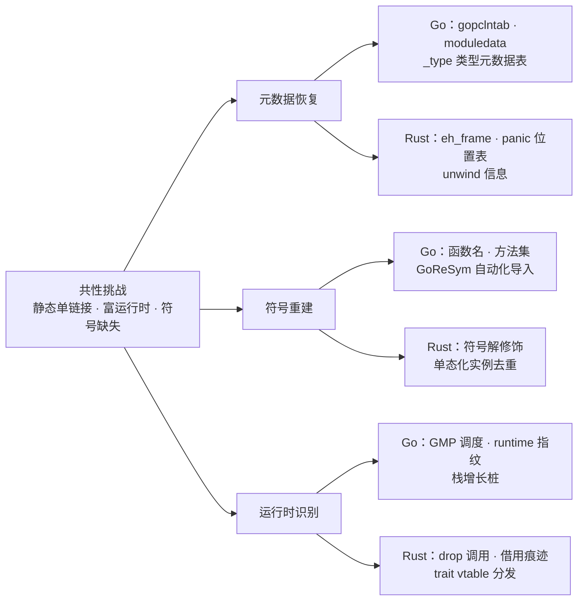
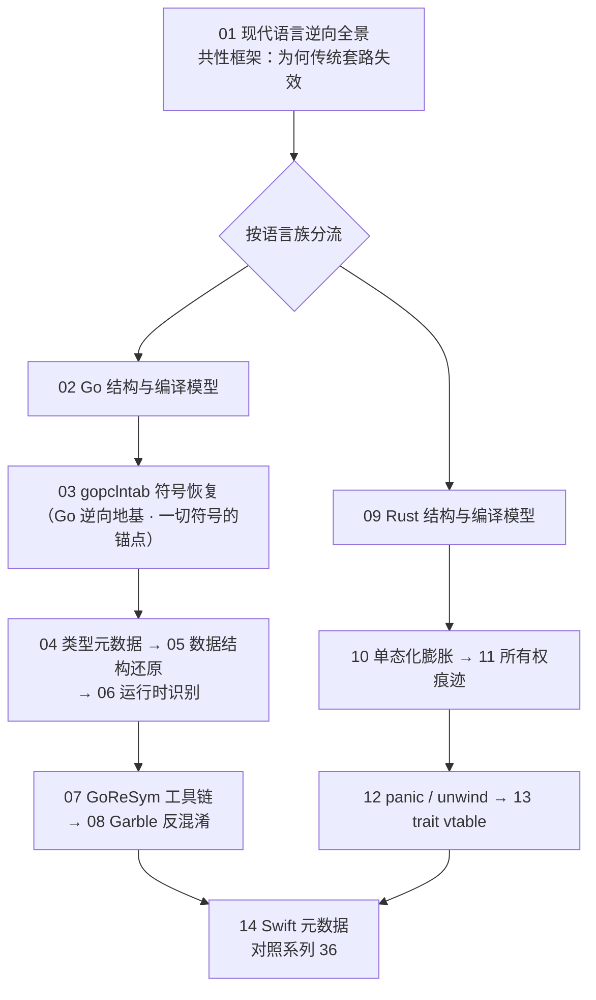

# Go与Rust现代二进制逆向 · 系列总览

> 现代恶意样本与工具大量转向 Go 与 Rust：静态单链接把整个运行时塞进单个文件、富运行时淹没了用户代码、单态化让泛型膨胀成海量重复片段，传统「认库函数、找导入表、顺调用规约」的逆向套路集体失效。本系列讲清三件事——**元数据恢复、符号重建与运行时识别**，把被编译器抹平的语言语义重新长回来。承接 [[23.C_C++运行时与ABI/00.运行时与ABI概览|系列 23]] 的 ABI 视角，向上延伸至语言运行时层。

本系列围绕三条主线组织：**元数据恢复**（找回编译器留在二进制里的表结构：gopclntab、类型表、eh_frame）、**符号重建**（还原函数名、类型名、方法集与 trait）、**运行时识别**（辨认调度、内存管理与动态分发在机器码上的指纹）。三线在 Go 与 Rust 上各有着力点：

## 篇目导航

| # | 章节 | 说明 |
| --- | --- | --- |
| 01 | [[01.现代语言二进制逆向全景]] | 静态链接、富运行时、符号缺失的共性挑战 |
| 02 | [[02.Go二进制结构与编译模型]] | 单二进制、段布局、编译器特征 |
| 03 | [[03.gopclntab与函数符号恢复]] | 行号表、函数名恢复、moduledata |
| 04 | [[04.Go类型系统元数据恢复]] | _type、rtype、接口与方法集重建 |
| 05 | [[05.Go字符串与切片与接口还原]] | 胖指针、iface/eface、字符串定位 |
| 06 | [[06.Goroutine调度与运行时识别]] | GMP、runtime 函数指纹、栈增长 |
| 07 | [[07.Go逆向工具：GoReSym与IDA脚本]] | 符号恢复自动化、结构体导入 |
| 08 | [[08.Go混淆对抗：Garble]] | 名称与常量混淆、gopclntab 剥离与恢复 |
| 09 | [[09.Rust二进制结构与编译模型]] | crate 布局、符号修饰、std 静链 |
| 10 | [[10.Rust单态化与泛型膨胀]] | 泛型实例化爆炸、重复代码识别 |
| 11 | [[11.Rust所有权在汇编层的痕迹]] | 移动/借用、drop 调用、生命周期消失 |
| 12 | [[12.Rust panic与unwind元数据]] | panic 字符串、位置表、eh_frame 线索 |
| 13 | [[13.Rust-trait对象与vtable还原]] | 胖指针、vtable 布局、动态分发识别 |
| 14 | [[14.Swift二进制与元数据逆向]] | Swift metadata、mangling、呼应系列 36 |

下图给出推荐的阅读路径：01 建立共性框架后按语言族分流，Go、Rust 两条线彼此独立、可并行推进，14 Swift 作为同族收尾。

> [!tip] 阅读顺序与学习建议
> - **先读 01**：不理解「静态链接吃掉导入表、富运行时淹没用户代码」这一共性，后面每章都会事倍功半。
> - **Go 路线（02→08）**：02→03 是地基，`gopclntab` 是函数符号恢复的锚点，务必吃透 `moduledata` 的定位与解析；04-05 补类型与数据结构（`iface`/`eface`、切片胖指针）；06 讲 GMP 与 runtime 指纹；07-08 转入实战——先用 GoReSym 自动化恢复，再面对 Garble 剥离后的重建。
> - **Rust 路线（09→13）**：09→10 先想通「单态化为何让二进制膨胀、如何识别重复实例」；11-13 依次攻克所有权在汇编层的痕迹（move / `drop`）、panic/unwind 元数据、trait 对象的 vtable 分发。
> - **已熟悉 ABI 者**：若已掌握 [[23.C_C++运行时与ABI/00.运行时与ABI概览|系列 23]] 的调用规约与栈帧，可直接切入运行时章节（06、11、13）。
> - **14 Swift** 建议与 [[36.Objective-C与iOS运行时/01.Objective-C运行时概览|系列 36]] 并读：Swift metadata 与 Objective-C 运行时在元数据布局上高度呼应。

## 与知识库既有体系的衔接

- ABI 承接：[[23.C_C++运行时与ABI/01.运行时与ABI概览]]、[[22.调用规约/06.SystemV_AMD64调用规约]]
- iOS 同族：[[36.Objective-C与iOS运行时/01.Objective-C运行时概览]]（Swift 元数据可对照）
- 应用场景：[[50.恶意代码分析与免杀对抗/00.恶意代码分析与免杀对抗总览]]（Go/Rust 恶意样本）
