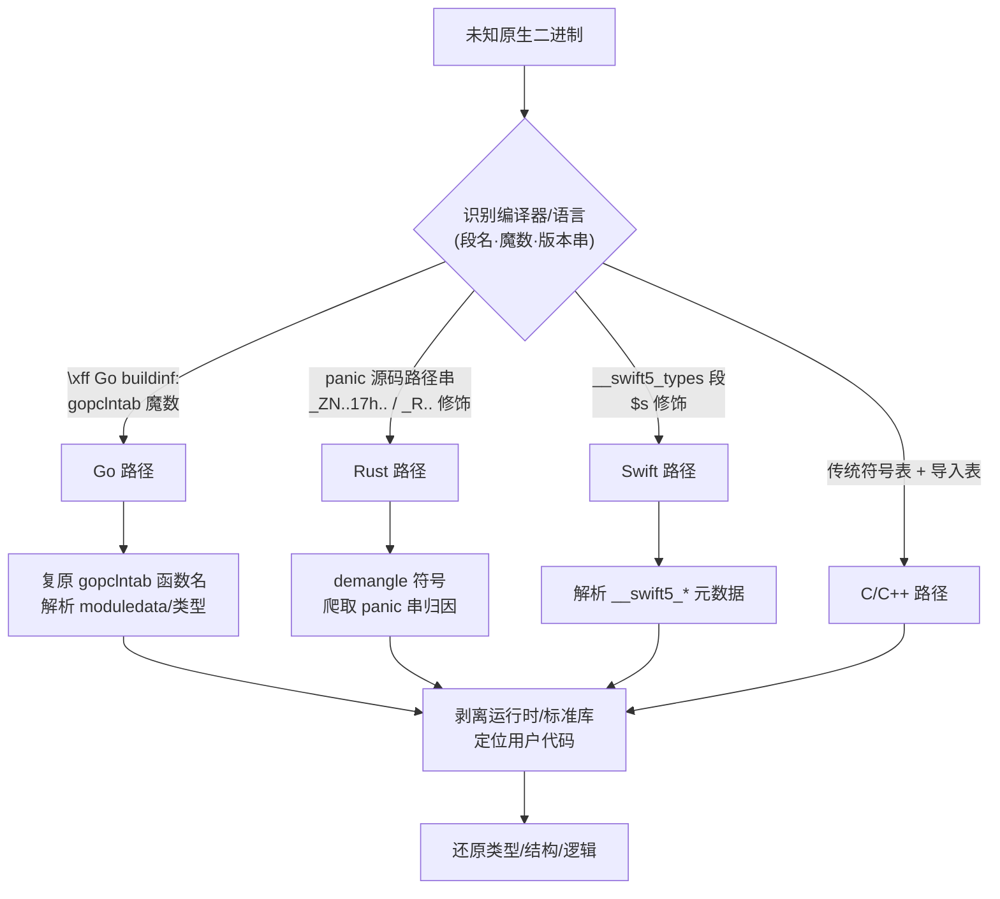
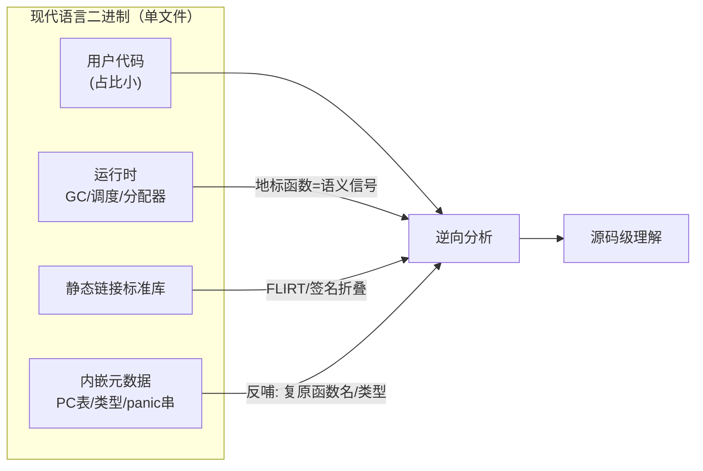
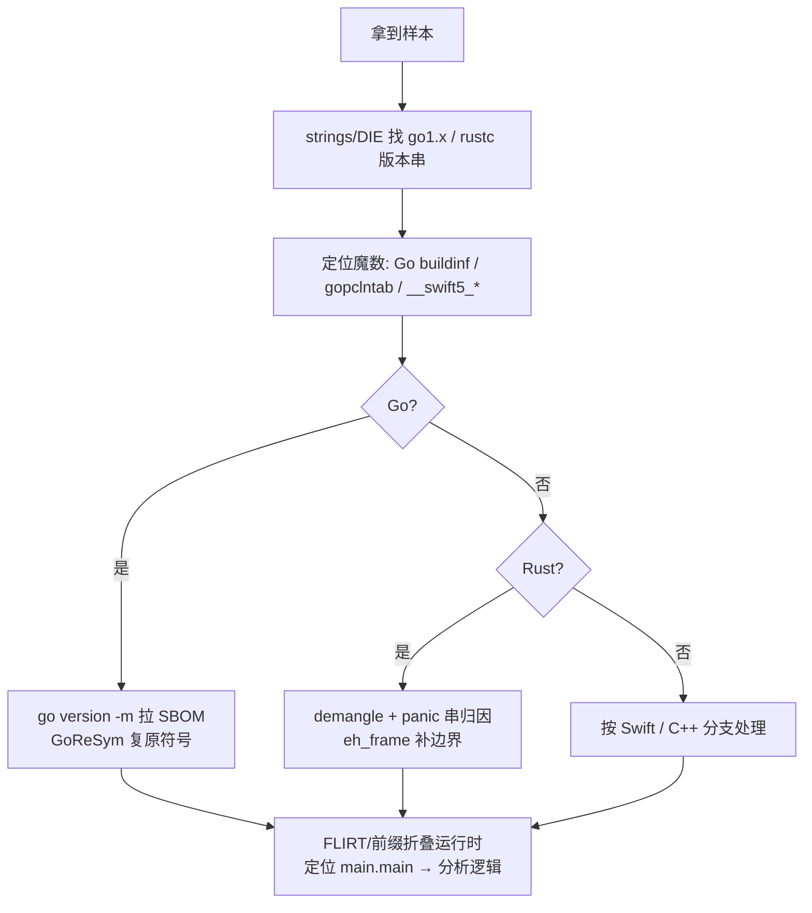

# Go与Rust现代二进制逆向（1）· 现代语言二进制逆向全景
> [!abstract] TL;DR
> - 现代系统语言（Go/Rust/Swift）默认**静态链接 + 富元数据**，直接推翻了 C/C++ 时代逆向工具赖以生存的「动态链接 + 导入表 = 免费语义锚点」前提，逆向工作流从「解析导入」转向「识别编译器→复原内嵌元数据→剥离运行时→定位用户代码」。
> - 三大共性挑战互相纠缠：**静态链接**带来体积膨胀且抹掉了导入表语义；**富运行时**塞进大量非用户函数（既是噪声也是高层语义信号）；**符号缺失**在剥离后依然存在**不对称泄漏**。
> - Go 是「自描述二进制」：`gopclntab`、`moduledata`、类型元数据在 `-s -w` 剥离后仍**必须保留**（GC 与反射运行时依赖它们），因此函数名可近乎源码级复原。
> - Rust 剥离更「干净」（编译期单态化、无反射无 GC，故无需内嵌元数据），但 panic 字符串泄漏源码路径行号、符号名的 legacy/v0 修饰泄漏 crate 路径与泛型实参。
> - Go 在 Linux 上**绕过 libc 直发 syscall**，在 Windows/macOS 上才走系统库——这既是识别特征，也让基于 libc 钩子的监控失效。
> - 现实驱动力：恶意样本大规模迁移到 Go（RAT/加载器/挖矿）与 Rust（BlackCat/ALPHV、Hive 变体等勒索），使这套方法从「学术趣味」变成分析师的日常刚需。

## 概述与定位

本系列讨论的对象，是一批用**带垃圾回收或带重型抽象的现代编译型语言**产出的原生二进制：Go、Rust，以及作为对照的 Swift。它们与传统 C/C++ 程序在磁盘上呈现的形态差异之大，以至于沿用旧习惯打开 IDA/Ghidra 时，你会立刻撞上三堵墙——函数数量爆炸到数千个、导入表空空如也或只剩零星系统调用、符号表被 `strip` 抹平后似乎无从下手。本篇作为系列开篇，任务不是钻进任何单一格式的字节细节（那是后续各篇的职责），而是先把**整片战场的地形**画清楚：现代语言的二进制为什么长这样、共性挑战的根因在哪、不同语言在同一挑战下的表现为何分化、以及一套通用的应对心智模型与工具版图。

为什么值得单独成系列？因为逆向工程的方法论在过去三十年里，是**围绕 C/C++ 的产物假设**建立起来的。IDA 的 FLIRT 签名、导入地址表（IAT/PLT-GOT）解析、DWARF/PDB 调试信息消费、`extern "C"` 的稳定 ABI——这些工具与直觉，默认了「程序薄、库外置、符号在、调用规约标准」。而 Go（2009 年发布）、Rust（2010 年问世，2015 年 1.0）、Swift（2014 年）把这些默认值几乎逐条改写。更关键的是产业现实：自 2019 年起，恶意软件作者成批转向 Go（跨平台、单文件部署、静态编译规避依赖），2021 年后 Rust 勒索家族（BlackCat/ALPHV、Hive 的 Rust 重写版等）密集出现，理由是内存安全难以被自动化漏洞挖掘、且原生二进制天然规避部分基于脚本语言的检测。分析师若不掌握这套语言特定的逆向法，面对样本时会大量误判、漏判。相关的实战场景可参见 [[50.恶意代码分析与免杀对抗/00.恶意代码分析与免杀对抗总览]]。

本篇的**边界**如下：这里只做全景与共性。Go 的 `gopclntab` 具体结构与函数名恢复算法留给 [[03.gopclntab与函数符号恢复]]；Go 类型系统与接口还原分别在 [[04.Go类型系统元数据恢复]] 与 [[05.Go字符串与切片与接口还原]]；Goroutine 调度识别在 [[06.Goroutine调度与运行时识别]]；Rust 的单态化膨胀、所有权痕迹、panic/unwind、trait 对象各有专篇（[[10.Rust单态化与泛型膨胀]] 至 [[13.Rust-trait对象与vtable还原]]）；Swift 在 [[14.Swift二进制与元数据逆向]]。本篇会**点到并前向引用**这些主题，帮你建立索引，但不与它们抢字节级细节。

## 原理与机制

要理解共性挑战，得先理解「共性成因」：这几门语言为什么会产出与 C/C++ 如此不同的二进制。根子在于**编译模型与运行时哲学**的三条分岔。

**第一条分岔：链接策略。** C/C++ 世界里，标准库（libc/libstdc++）是操作系统提供的共享对象，程序只在导入表里留下 `printf`、`malloc`、`socket` 这类符号引用，运行时由动态链接器补齐。这让二进制又小又「透明」——导入表本身就是一份高层行为清单。Go 反其道而行：默认把**整个运行时和用到的标准库全部静态编译进单一可执行文件**，追求「拷贝一个文件即可部署」的极致简洁（容器时代的 `FROM scratch` 镜像就靠这个）。Rust 则走中间路线：Rust 标准库 `libstd` 静态链入（因为 Rust 没有稳定 ABI，跨编译器版本动态链接 Rust 库不安全），但在 Linux 上默认仍**动态链接 glibc**（glibc 官方不建议静态链接，因为 NSS 等模块要在运行时 `dlopen`）；只有 `x86_64-unknown-linux-musl` 目标才是完全静态。这条分岔直接制造了后文的「静态链接挑战」。

**第二条分岔：运行时厚度。** Go 为了换取并发与内存安全的开发者体验，背了一个**重型运行时**：并发三色标记清除 GC、G-M-P 模型的 M:N goroutine 调度器、可增长栈、tcmalloc 血统的内存分配器、channel、defer/panic/recover、反射。这些都以真实函数的形式编译进二进制，构成大量「非用户逻辑」的代码。Rust 的哲学是「零成本抽象、不为不用的东西付费」，所以它**没有 GC、没有绿色线程**（async 是库级的，tokio 自带执行器而非语言内建），运行时极薄——真正的入口 `lang_start` 只负责装 panic 钩子、初始化 stdio 等。但 Rust 的「薄」是另一种形式的「厚」：迭代器、闭包、`Result`/`Option`、trait 泛型经过**单态化**会展开成海量小函数，加上 RAII 的 drop glue（析构在作用域结束处自动插入调用）与 panic unwinding 机制，噪声照样不少。这条分岔制造了「富运行时挑战」。

**第三条分岔：元数据依赖。** 这是最微妙也最反直觉的一条。Go 的 GC 需要**精确**地知道每个栈帧和堆对象里哪些字是指针（precise GC），反射需要运行时类型信息，panic 要打印带函数名文件行的栈回溯——这些能力**强制**运行时把类型元数据、PC-行号表（`gopclntab`）、模块数据（`moduledata`）内嵌进二进制，且**无法在不破坏程序的前提下剥离**。而 Rust 把一切能在编译期解决的都解决了（单态化、静态分发、无反射无 GC），运行时不需要这些元数据，于是 `strip` 能剥得非常干净。同一个「符号缺失」问题，因此在两门语言上表现得截然不同——这正是下一节要深挖的「不对称」。

把三条分岔叠加，就得到现代语言二进制的典型解剖：一小块用户代码，泡在一大片静态链接的运行时与标准库里，旁边挂着一堆运行时**必需或顺带**留下的元数据。逆向的全部技巧，都是围绕「如何在这片汪洋里快速捞出那一小块用户逻辑，并借元数据把语义还原回来」。下图给出一个未知二进制的分诊流程，也是本系列后续所有篇章的总路线图。



## 三大共性挑战详解：静态链接、富运行时、符号缺失

这一节把三堵墙逐一拆开，讲清每一堵墙的**成因、对逆向的具体伤害、反过来能被利用的杠杆、以及语言间的横向分化与深层原因**。删掉本节所有代码块，中文仍应能独立把每个点讲透。

### 挑战一：静态链接——膨胀与语义锚点的消失

静态链接对逆向的第一层伤害是**体积**。Go 的 `hello world` 在 Linux/amd64 上通常 1.5–2 MB 起步，因为整个运行时和 `fmt`、`runtime`、`reflect` 等一并进来；Rust 动态链 glibc 的 release 版约数百 KB，但 musl 静态目标会更大。数千个函数意味着你打开反编译器看到的东西，可能 95% 都不是分析目标。

第二层伤害更本质：**导入表这份「免费的行为清单」没了**。在动态链接的 C 程序里，看到 IAT 中的 `CreateProcessW`、`WSASend`、`RegSetValueEx`，分析师瞬间就知道样本在派生进程、发网络、写注册表——导入表是语义锚点的富矿。静态链接把这些调用变成了对二进制内部某个**无名函数**的普通 `call`。尤其是 **Go 在 Linux 上根本不链 libc，而是用 `SYSCALL` 指令直发系统调用**：这不仅让导入表空无一物，还让所有基于 libc 函数钩子的用户态监控（很多 EDR/sandbox 依赖此）直接失效——你 hook 了 `libc.write`，但 Go 压根不走它。反过来在 **Windows 上 Go 必须动态调用 `kernel32`/`ntdll`**（Windows 系统调用号不稳定，不能硬编码），macOS 上必须链 `libSystem`（苹果不提供静态 libc）——所以「Go 有没有导入表」本身是平台相关的识别线索。

应对这层挑战的经典武器是**函数签名库**：IDA 的 FLIRT/FLAIR、Ghidra 的 Function ID，用已知库代码的字节模式批量命名、折叠标准库函数，把注意力留给未匹配的用户代码。但这里有个 Go 特有的陷阱：**签名必须按 Go 版本、按平台分别制作**，因为运行时实现逐版本变化。也正因如此，Go 的 `gopclntab`（下文挑战三）成了比 FLIRT 更强的替代品——它直接给出函数名，无需逐版本维签名库。

静态链接也有**对逆向有利**的一面，值得平衡看待：一切都在这一个文件里，分析是自包含、可复现的，不必像动态程序那样再去搜集匹配版本的依赖库、担心「换台机器行为就变」。对离线取证与样本归档，单文件反而省事。

### 挑战二：富运行时——噪声，同时也是高层语义信号

富运行时的直接伤害是**信噪比**：GC、调度器、分配器、defer 机制的函数遍布二进制，与用户逻辑交织。更隐蔽的伤害是它**改变了代码的局部形态**——例如 Go 编译器会在几乎每个函数入口插入 `morestack` 前导（比较栈指针与 `g.stackguard`，不足则扩栈），在每次指针写入处插入 GC 写屏障 `runtime.gcWriteBarrier`。不懂这些模式的分析师会把它们误读为业务逻辑；反编译器也常被这些非常规前导干扰函数边界识别。

但换个视角，运行时是一份**高层语义的礼物**。识别出对 `runtime.makemap` 的调用，你立刻知道「这里在建一个 map」，比看到裸 `malloc` 高一个抽象层级；`runtime.newproc` 意味着源码里有一条 `go func()`；`runtime.chansend`/`chanrecv` 揭示 channel 通信；`runtime.gopanic` 标出异常路径；分配类函数（`runtime.mallocgc`、`runtime.newobject`、`runtime.makeslice`）的参数里往往带着 `*_type` 指针，顺藤摸瓜就能拿到被分配对象的**类型**。也就是说，认识 Go 运行时的「地标函数」，等于拿到了一份把汇编往源码语义翻译的对照表——这正是 [[06.Goroutine调度与运行时识别]] 的核心。

Rust 的运行时噪声形态不同，深层原因还是「编译期哲学」。它没有可供识别的调度器地标，但有另外三类特征：其一，`lang_start` 包裹的真正 `main` 与 panic 基础设施；其二，**drop glue**——RAII 析构在作用域结束、提前返回、panic 展开等每一条出口路径上被自动插入的析构调用，是识别「这里有个持有资源的对象离开了作用域」的线索，也是 [[11.Rust所有权在汇编层的痕迹]] 的题眼；其三，panic 一旦发生走的是 **unwinding**（经 personality routine 逐帧回退、运行 landing pad 里的析构）或直接 `abort`，前者会生成 `.eh_frame` 与 `.gcc_except_table`，这些表即使剥离符号也保留，可用来恢复函数边界（详见 [[12.Rust panic与unwind元数据]]）。

横向对比的深层结论是：**Go 用「运行时厚度」换来了「运行时可读性」**——地标丰富、语义外露；**Rust 用「编译期展开」换来了「运行时稀薄」**——地标少，但把复杂度以单态化副本的形式摊进了代码体量（见 [[10.Rust单态化与泛型膨胀]]）。两者是同一枚硬币的两面：噪声要么集中在少数可识别的运行时函数里，要么弥散进无数个泛型实例中。

### 挑战三：符号缺失——一种不对称的泄漏

「符号缺失」是最容易被误解的挑战。直觉上「`strip` 过的二进制 = 没信息」，但对现代语言这句话**大错特错**，且错的方式两门语言相反。

**Go 侧：剥不掉的元数据。** 用 `go build -ldflags "-s -w"` 会移除传统符号表与 DWARF，但**不会**动到 `gopclntab`、`moduledata` 和类型元数据——因为运行时的栈回溯、精确 GC、反射、panic 打印**在运行期就要用它们**，剥掉程序即崩。于是「函数名、文件名、行号、类型信息」在剥离后**依旧健在**。这就是「Go 二进制自描述」的悖论，也是 Mandiant 的 GoReSym 等工具的立身之本。下面列出剥离后 Go ELF 的存留清单，帮助你在实战里一眼定位价值区：

```
# 剥离后的 Go ELF（go build -ldflags "-s -w"）仍然保留：
.gopclntab       PC → 函数名/文件/行 映射（运行时栈回溯依赖，无法删）
.go.buildinfo    Go 版本 + 完整模块依赖（go version -m 可直接读出）
.typelink/.rodata 类型元数据（反射与精确 GC 依赖）
runtime.moduledata  一切元数据的锚点（散布在 .noptrdata/.data）
# 被 -s -w 移除的仅仅是：
.symtab/.strtab  传统符号表
.debug_*         DWARF 调试信息
```

`gopclntab` 的定位靠版本相关的**魔数**，这也是「识别语言 + 判定 Go 版本」的第一手线索（字节级细节见 [[03.gopclntab与函数符号恢复]]，此处仅给识别用的对照）：

```
0xFFFFFFFB   Go 1.2  – 1.15
0xFFFFFFFA   Go 1.16 – 1.17
0xFFFFFFF0   Go 1.18 – 1.19
0xFFFFFFF1   Go 1.20+
```

**Rust 侧：剥得干净，但从缝里漏。** Rust 无反射无 GC、编译期单态化，运行时不需要内嵌元数据，release + strip 后确实能抹掉绝大多数符号。但信息从三条缝泄漏：其一，**panic 消息内嵌源码路径与行号**（形如 `src/net/mod.rs:142:9`），把函数上下文、模块结构、甚至逻辑意图直接写在字符串区，爬取并归因到就近函数是 Rust 逆向的高性价比手段；其二，**名称修饰**若未剥离则信息量极大——legacy 修饰形如 `_ZN4core3fmt...17h9e8d7c6b5a4f3e2dE`（Itanium 风格 + 16 位十六进制哈希消歧），新版 **v0 修饰**（RFC 2603，`rustc -C symbol-mangling-version=v0`）以 `_R` 开头，demangle 后能还原 `crate::module::func::<泛型实参>` 的完整路径；其三，`fmt::Debug`/类型名在部分单态化符号与格式化代码里露头。

**Swift 侧：元数据驱动到极致。** 为支持反射、动态转型、协议见证，Swift 在 `__TEXT` 里带 `__swift5_types`、`__swift5_proto`、`__swift5_fieldmd` 等段，符号用 `$s` 前缀修饰。它与 Objective-C 运行时同源的元数据设计可对照 [[36.Objective-C与iOS运行时/01.Objective-C运行时概览]]；本系列在 [[14.Swift二进制与元数据逆向]] 展开。

把三者并列，**不对称的深层原因**就清楚了：**是否需要在运行期保留元数据，取决于语言把「类型/分发」放在编译期还是运行期解决**。Go 把 GC 与反射放在运行期 → 必须内嵌 → 剥不干净 → 逆向者白捡函数名；Rust 全在编译期 → 无需内嵌 → 剥得干净 → 逆向者只能从 panic 串与修饰名的「泄漏」里捞。这不是工具强弱问题，而是语言设计哲学在二进制层的直接投影。

下图把「一个现代语言二进制的解剖」与「元数据反哺语义」的关系画出来：



### 一张横向对比表

下表把四门语言在关键维度上的差异压缩到一处，作为全系列的速查基线；每一列的细节由对应专篇展开。

| 维度 | C/C++ | Go | Rust | Swift |
|---|---|---|---|---|
| 默认链接 | 动态 | 静态（含运行时） | libstd 静态 / glibc 动态 | 动态（依赖 Swift 运行时） |
| 运行时厚度 | 薄（CRT） | 厚（GC + 调度器） | 薄（无 GC/无绿色线程） | 中（ARC + 元数据运行时） |
| 剥离后符号 | 基本无 | 函数名/行号/类型**保留** | 大部分丢失，panic/修饰泄漏 | 元数据段丰富 |
| 名称修饰 | Itanium（C++） | 包路径限定名 | legacy `_ZN..17h..` / v0 `_R..` | Swift `$s` 修饰 |
| 调用规约 | 平台 ABI | 1.17 前纯栈传 / 后寄存器 | 平台 ABI（`extern "Rust"` 不稳定） | 平台 ABI + 自定义约定 |
| 泛型实现 | 模板实例化 | 1.18 泛型（GCShape + 字典） | 单态化 | 见证表 + 泛型元数据 |
| Linux 系统调用 | 经 libc | **直发 SYSCALL** | 经 glibc | 经 libSystem |

特别提醒一个易踩的 ABI 坑：**Go 1.17 之前采用纯栈传递调用规约**（所有参数/返回值走栈），而主流反编译器默认按 System V AMD64（寄存器传参，见 [[22.调用规约/06.SystemV_AMD64调用规约]]）去猜参数，结果**参数识别全错**；1.17 起 Go 引入寄存器 ABI（ABIInternal），整数参数寄存器顺序也与 System V 不同：

```
# Go 1.17+ 内部 ABI（ABIInternal，amd64）整数参数/返回寄存器顺序：
RAX, RBX, RCX, RDI, RSI, R8, R9, R10, R11    （浮点走 X0–X14）
# 对比 System V AMD64：RDI, RSI, RDX, RCX, R8, R9
# 面向汇编的 ABI0 仍是栈传递；两套 ABI 间有编译器生成的 wrapper 桥接
```

不校正调用规约就直接读反编译结果，是现代语言逆向最常见的翻车点——运行时与 ABI 的系统性背景可回看 [[23.C_C++运行时与ABI/01.运行时与ABI概览]]。

## 工具视角与实战

有了地形图，接下来是「用什么、怎么走」。现代语言逆向的工具链分三层：**通用反汇编器 + 语言插件 + 语言专用提取器**。

**通用平台。** IDA Pro（配 Golang loader/analyzer 插件、FLIRT 签名）、Ghidra（配 GolangAnalyzerExtension、Rust demangler）、Binary Ninja、以及 rizin/Cutter，都是主战场。它们负责反汇编、反编译、交叉引用与脚本化批处理，但**开箱即用对 Go/Rust 支持有限**，必须叠加语言知识。

**语言专用提取器（Go）。** 首推 Mandiant 的 **GoReSym**：直接解析 `gopclntab` 复原全部函数名、解析 `moduledata` 与类型元数据、读取 build info。配套的 `redress`、IDA 的 `golang_loader_assist`、Ghidra 的 Golang 分析器扩展，都是把「自描述元数据」翻译回符号表的利器。一个常被忽视却极强的原生手段是 **`go version -m <binary>`**：它读取 `\xff Go buildinf:` 魔数后的 build info，**直接列出编译用的 Go 版本与全部模块依赖及其版本号**——相当于免费拿到样本的「软件物料清单（SBOM）」，对判断样本用了哪些第三方库、比对已知恶意框架极有价值。这些工具的深用法见 [[07.Go逆向工具：GoReSym与IDA脚本]]。

**语言专用工具（Rust）。** 没有 gopclntab 那样的银弹，靠组合拳：`rustfilt`/`rust-demangler` 解修饰名（同时支持 legacy 与 v0）；对 panic 字符串做批量提取与就近函数归因；用 `.eh_frame`/`.gcc_except_table` 恢复函数边界；源码侧理解可参考 `cargo-bloat`（看哪些泛型实例撑大了体积，反推单态化模式）。

**识别与分诊工具。** Detect It Easy（DIE）、`file`、以及对字符串区搜 `go1.` / `rustc ` 版本串，是第一步语言与版本判定的快手。判定顺序建议按下图固定成 SOP：



**通用工作流**收束为六步：识别语言与编译器版本 → 复原符号（Go 用 gopclntab、Rust 尽量 demangle）→ 折叠运行时与标准库（按 `runtime.`/`std::`/`core::` 前缀或签名）→ 定位用户入口（Go 找 `main.main`，Rust 找用户 crate 的 `main::main`）→ 还原类型与数据结构 → 分析业务逻辑。每一步的语言特化细节，是后续十三篇的展开点。

## 安全性与正确使用

本节从「机制的安全影响、误用风险、正确使用与加固边界」三方面收口。本篇是全景篇，不涉武器化对抗，但这些边界必须讲清。

**机制的安全影响（防御侧要吸取的教训）。** 三大特性各自带来防御盲区：静态链接使 Go 在 Linux 上**绕过 libc 直发 syscall**，让大量依赖 libc 用户态钩子的 EDR/sandbox 监控失效——防御方若要覆盖 Go 样本，必须下沉到内核态（如 eBPF、系统调用审计 `auditd`/seccomp-bpf）而非仅挂 libc；富运行时让传统「按导入表判恶意行为」的静态检测规则大面积失灵；符号缺失则常被误解为「无从分析」，导致对 Go 样本的**分析深度被低估**——而事实恰恰相反，Go 样本因 `go version -m` 泄露完整依赖清单，可分析性甚至高于精心剥离的 C 程序。

**误用风险（分析侧的常见错误）。** 其一，**版本错配**：用某个 Go 版本的 FLIRT 签名或解析脚本去套另一个版本，`gopclntab` 结构、运行时符号、ABI 都可能变，轻则漏名重则误名，务必先判版本再选工具。其二，**调用规约误读**：不校正 Go 1.17 前后的 ABI 差异就信反编译器的参数列表，会得出完全错误的函数原型（前述翻车点）。其三，**过度信任内嵌名**：`gopclntab` 里的函数名可被 Garble 等混淆器篡改或抹除（见 [[08.Go混淆对抗：Garble]]），Rust 的 panic 串也可被作者主动去除或伪造，元数据是线索而非铁证，需与代码行为交叉验证。其四，**把运行时地标当业务逻辑**：morestack 前导、写屏障、drop glue 都不是用户代码，误读会污染整个分析结论。

**正确使用与加固边界。** 对分析者：把内嵌元数据当作「高价值线索源」而非「可信真值」，始终以实际控制流/数据流验证；对样本处理遵循取证规范（隔离环境、留存哈希与原始拷贝）。对防御与开发者（加固视角）：若目标是**降低被逆向的表面**，Go 侧可用 Garble 混淆符号与字符串、剥离 build info，但要清楚 `gopclntab` 因运行时依赖**无法彻底移除**，只能扰乱；Rust 侧应默认 `strip`、关闭不必要的 `debug`、避免在 `panic!`/`expect` 消息里写入敏感的源码路径或业务语义（这些会原样进二进制字符串区）。需要强调**合规边界**：本系列的逆向技术仅用于安全研究、恶意样本分析、互操作与自有产品的漏洞评估；对第三方软件实施逆向须遵守当地法律与许可协议，切勿逾越授权范围。

## 小结

现代语言二进制逆向的全部难点，可归约为三条语言设计哲学在磁盘上的投影：**静态链接**（部署简洁的代价是体积膨胀与导入表语义消失）、**富运行时**（并发/安全体验的代价是海量非用户函数，但也换来可识别的语义地标）、**符号缺失**（表面上剥离即无信息，实则存在由「元数据放编译期还是运行期」决定的不对称泄漏——Go 剥不干净而自描述，Rust 剥得干净却从 panic 与修饰名漏）。掌握这套心智模型后，逆向工作流就从 C/C++ 时代的「解析导入表」，转型为「识别编译器 → 复原内嵌元数据 → 折叠运行时 → 定位用户代码 → 校正 ABI → 还原语义」。Go、Rust、Swift 在同一挑战下的分化，全部可以用「编译期 vs 运行期解决类型与分发」这一条主线解释。带着这张全景图，接下来我们从 [[02.Go二进制结构与编译模型]] 开始，逐字节钻进每一门语言的具体格式。

## 相关阅读

- 本系列：[[00.Go与Rust现代二进制逆向总览|系列总览]] · [[02.Go二进制结构与编译模型]] · [[03.gopclntab与函数符号恢复]] · [[06.Goroutine调度与运行时识别]] · [[07.Go逆向工具：GoReSym与IDA脚本]] · [[08.Go混淆对抗：Garble]] · [[09.Rust二进制结构与编译模型]] · [[10.Rust单态化与泛型膨胀]] · [[12.Rust panic与unwind元数据]] · [[14.Swift二进制与元数据逆向]]
- ABI 与运行时承接：[[23.C_C++运行时与ABI/01.运行时与ABI概览]] · [[22.调用规约/06.SystemV_AMD64调用规约]]
- iOS 同族元数据对照：[[36.Objective-C与iOS运行时/01.Objective-C运行时概览]]
- 应用场景：[[50.恶意代码分析与免杀对抗/00.恶意代码分析与免杀对抗总览]]
- 官方文档 / 规范：Go 官方 "Go 1.2 Runtime Symbol Information" 设计文档与 `runtime` 包源码（go.dev）；Go 内部 ABI 规范 `src/cmd/compile/abi-internal.md`；Rust RFC 2603「Symbol name mangling v0」与 The Rust Reference；Itanium C++ ABI 名称修饰规范。
- 工具与研究：Mandiant GoReSym 项目与其发布博客；Dennis Andriesse《Practical Binary Analysis》；《The Ghidra Book》。

[[00.Go与Rust现代二进制逆向总览|⬆ 系列总览]] | [[02.Go二进制结构与编译模型|→ 下一章]]