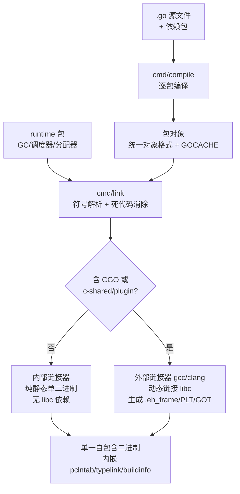
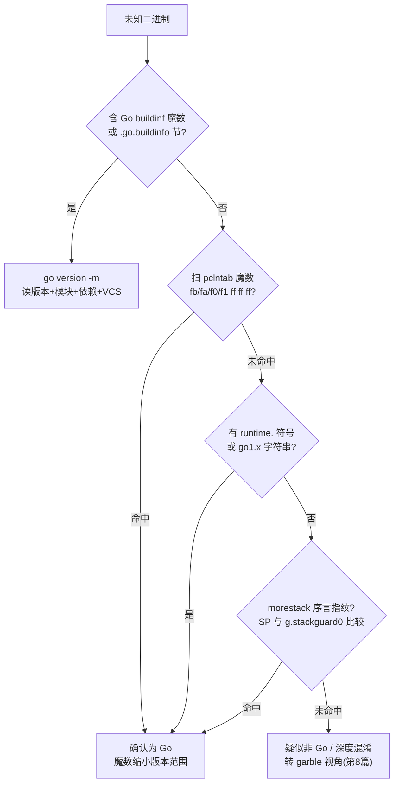

# Go与Rust现代二进制逆向（2）· Go二进制结构与编译模型
> [!abstract] TL;DR
> - Go 默认产出**单一自包含二进制**：整个运行时（GC、调度器、内存分配器）与用到的标准库全部静态内嵌，一般无 libc 依赖——这既是 Go 的部署哲学，也是逆向"无外部符号可依、库码与用户码混为一体"困局的根源。
> - 编译模型是 `go build → cmd/compile（逐包）→ cmd/link（符号解析+死代码消除）`；只有触发 CGO 或 `c-shared/c-archive/plugin` 等构建模式时才切到**外部链接器**并动态链接，产出才会长出 `.eh_frame`/PLT/GOT 与 libc 依赖。
> - 识别 Go 的三条硬指纹：`.go.buildinfo` 节的 `\xff Go buildinf:` 魔数、`.gopclntab` 的版本魔数（`fb/fa/f0/f1 ff ff ff`）、以及 `SP` 与 `g.stackguard0` 比较的 **morestack 函数序言**；三者可交叉印证且能扛过 `strip`。
> - `go version -m` 直接吐出 Go 版本、模块路径、依赖清单与 VCS 提交/构建标志——对逆向是情报金矿，对开发者是**供应链信息泄露**面。
> - `-ldflags "-s -w"` 只删符号表与 DWARF，**不删 pclntab**（运行时 traceback 需要它），所以函数名默认仍可从 pclntab 恢复；真正抹除要靠 garble（见第 8 篇）。
> - Go 1.17 起改用**寄存器式 ABIInternal**（amd64 整数参数走 `RAX,RBX,RCX,RDI,RSI,R8,R9,R10,R11`，`g` 常驻 `R14`），与 System V AMD64 及旧版栈式约定都不同——直接影响反编译器还原参数的正确性。

## 概述与定位

本系列第 1 篇给出了现代语言二进制逆向的全景与方法论坐标。本篇聚焦一个更基础也更前置的问题：**当你从磁盘上拿到一个 Go 编译出的可执行文件时，它到底"长什么样"，以及是什么样的编译流水线把它变成这个样子的。** 只有先把"容器"的结构、段/节布局与编译器留下的宏观指纹搞清楚，后续几篇对 gopclntab（第 3 篇）、类型元数据（第 4 篇）、字符串/切片/接口（第 5 篇）、goroutine 调度识别（第 6 篇）的深挖才有落脚点。因此本篇刻意**只建立坐标系、不拆内部数据结构**：pclntab 的具体解析、typelink 的类型还原、itab 的接口重建都留给对应专篇，这里只交代它们"在哪个节、以什么魔数标识、为何存在"。

Go 二进制之所以值得单独立篇，核心在于它与 C/C++ 传统产物的两点根本差异。其一是**静态单二进制**：C/C++ 默认动态链接，运行期靠 `ld.so` 解析一堆 `.so`，符号、重定位、PLT/GOT 都摆在明面上；Go 默认把运行时和标准库整体塞进一个文件，磁盘上没有外部依赖，动态符号表几乎为空。其二是**自带元数据**：Go 为了支持反射、接口断言、panic traceback、GC 精确扫描，在二进制里内嵌了一整套自描述结构（pclntab、typelink、itablink、funcdata/pcdata、GC 位图）。这两点合起来意味着——Go 二进制"体积大、外部依赖少、内部信息富"，逆向的难点从"跨模块符号解析"转移到了"从内嵌元数据里把结构切回来"。理解这一点，就理解了整个系列的技术主线。

## 原理与机制

### gc 工具链与编译单元

主流 Go 二进制由官方 `gc` 工具链（区别于同名垃圾回收器，这里指 Go compiler）产出。`go build` 只是驱动器，背后依次调用 `cmd/compile`（逐个 **package** 编译成对象）与 `cmd/link`（把所有对象连同 runtime 链成最终镜像）。编译粒度是"包"而非"文件"：一个包的所有源文件一起编译，产出一份归档/统一对象格式的中间产物，缓存在 `$GOCACHE`（`go clean -cache` 可清）。这种包级增量 + 内容寻址缓存，是 Go 编译快的关键，也解释了为什么 `go build` 第二次几乎瞬间完成。

自 Go 1.5 起，编译器与运行时本身都用 Go 写成（自举 bootstrap），彻底摆脱了早期的 C 实现。这带来一个逆向上有用的推论：**runtime 的代码风格、符号命名、调用约定与用户代码完全同构**，没有"C 写的运行时 + Go 写的业务"这种拼接痕迹，反而是"整块 Go"，因此区分库码与用户码只能靠符号/包路径（pclntab 提供）而非语言边界。

### 静态链接与内嵌运行时

Go 程序无法脱离运行时存在：goroutine 调度、抢占、栈的分段增长、精确 GC、map/channel/接口的底层实现全在 runtime 包里。因此**runtime 永远被链接进来**，这是"单二进制"的物理前提。默认情况下 `cmd/link` 用**内部链接器**做纯静态链接，产物不依赖 libc，`ldd` 显示 "not a dynamic executable"。代价是体积：一个 `hello world` 通常 1.5–2 MB，因为它至少要装下调度器、分配器、GC、以及 `fmt`、reflect 等被引用到的标准库和它们的类型元数据。链接期的**死代码消除（dead code elimination）**会剪掉未引用的函数，但反射（`reflect`）会让链接器保守——被反射可能触及的方法不敢删，这是 Go 二进制难以进一步瘦身的深层原因。

### CGO 与外部链接：静态假设何时被打破

"Go 一定静态"是个常见误解。一旦源码引入 **CGO**（`import "C"`）或使用 `-buildmode=c-shared / c-archive / plugin / shared`，链接就切换到**外部链接器**（系统的 `gcc`/`clang`），此时会动态链接 libc，产物里长出 `.dynamic`、`.plt`、`.got`、动态符号表，甚至标准的 `.eh_frame`（C 侧异常帧）。`CGO_ENABLED` 在本机构建默认开启（若有 C 工具链）、交叉编译默认关闭。标准库里 `net`、`os/user` 有 cgo 分支，因此"看似纯 Go 的程序其实动态链接了 libc"很常见。逆向时先判定内部/外部链接，直接决定你看到的是"干净的 Go-only 布局"还是"混入 C 生态的标准 ELF"。

### 从入口到 main.main 的调用链

可执行文件的 ELF/PE 入口点**不是** `main.main`，而是运行时引导链。以 Linux/amd64 为例：`_rt0_amd64_linux → _rt0_amd64 → runtime.rt0_go`（建立 g0/m0、初始化 TLS、`schedinit`、以 `runtime.main` 为体创建主 goroutine、`mstart` 启动调度）`→ runtime.main`（跑各包 `init` 后）`→ main.main`。逆向找业务入口的正道，是从 `runtime.main` 里对 `main.main` 的引用、或 `rt0_go` 里传给 `runtime.newproc` 的函数指针入手，而非盯着文件入口点。



## 段布局与编译产物详解

这一节是本篇的核心：把 Go 二进制"摊开"，逐节讲清每块数据是什么、为何存在、跨文件格式如何对应。

### 跨格式的段/节布局

Go 在三大目标格式上语义一致、命名有别。下表以 ELF 为主，标注对应关系与专篇归属：

```
节名                作用与要点                                   归属
.text              机器码                                        本篇（指纹）
.rodata            只读数据；含大量字符串（无 NUL 结尾）、类型名   第5篇
.typelink          *_type 偏移表，反射/接口断言的类型索引          第4篇
.itablink          itab（接口方法表）指针表                       第5篇
.gopclntab         PC→行号/函数名 映射表；strip 不删              第3篇
.go.buildinfo      Go 版本 + 模块信息（本篇重点）                 本篇
.note.go.buildid   ELF note；构建缓存哈希，go tool buildid 可读   本篇
.noptrdata         无指针的已初始化数据（GC 无需扫描）            第4/6篇
.data              含指针的已初始化数据（GC 需扫描）              —
.bss / .noptrbss   未初始化数据（含/不含指针）                    —
.gosymtab          传统符号表，现代 Go 里为空（历史残留）          第3篇
```

跨格式对应关系需要记牢：**Mach-O** 下这些节前缀不同、语义相同，如 `__TEXT,__gopclntab`、`__DATA` 段内的 `__typelink`/`__itablink`/`__noptrdata`、以及承载 buildinfo 的 `__go_buildinfo`；**PE（Windows）** 下 Go **不新建专属节**，pclntab、buildinfo、typelink 等被并入 `.rdata`/`.data`，运行时靠 `runtime.pclntab` 等符号或 **moduledata** 定位，工具则靠魔数扫描。此外，开启 PIE 或外部链接时，`.gopclntab` 可能改名为 `.data.rel.ro.gopclntab`（放进"重定位后只读"段）——这是很多老脚本按固定节名找不到 pclntab 的原因，稳妥做法永远是**全文件扫魔数**而非认节名。

程序头（segment）层面，纯内部链接的非 PIE Go ELF 通常只有三个 `PT_LOAD`：RX（text）、R（rodata）、RW（data/bss），外加 `PT_GNU_STACK`。它**不为自身代码生成标准 `.eh_frame`/DWARF CFI**——Go 的栈回溯与展开走 pclntab + funcdata/pcdata，而非 C++/Rust 那套 `.eh_frame`（这正是与第 12 篇 Rust unwind 的关键分野）。只有当 CGO/外部链接把 C 代码拉进来，`.eh_frame` 才会出现。

### moduledata：一切结构的锚点

运行时通过全局符号 `runtime.firstmoduledata`（类型 `runtime.moduledata`）把上述所有表串起来：它保存 text/etext 范围、pclntab 指针、ftab/findfunctab、typelinks/itablinks、types/etypes 等字段的地址。**它是从二进制里"重建一切"的总锚点**——GoReSym、IDA 脚本本质上都是先定位 pclntab 或 moduledata，再顺藤摸瓜。这里只点明其地位，具体字段解析交给第 3、4 篇。

### .go.buildinfo 的字节级结构

自 Go 1.13 引入的 `.go.buildinfo` 是**最省事的识别与情报入口**。其头部是固定的 16 字节：

```
偏移   长度            内容
0x00   14             魔数 "\xff Go buildinf:"
                      = FF 20 47 6F 20 62 75 69 6C 64 69 6E 66 3A
0x0E   1              ptrSize：指针宽度（04=32位，08=64位）
0x0F   1              flags：bit0=大端；bit1(0x02)=版本内联(Go 1.18+)

—— 旧格式 (Go 1.13–1.17)：头后接两个指针 ——
0x10   ptrSize        → runtime.buildVersion（"go1.XX.Y" 字符串）
0x10+p ptrSize        → runtime.modinfo（模块信息字符串）

—— 新格式 (Go 1.18+，flags&0x02)：头后内联 ——
0x10   varint+bytes   版本字符串（varint 长度前缀，位置无关）
...    varint+bytes   模块信息字符串
```

为何 1.18 从"存指针"改成"内联字符串"？因为存指针在 PIE 下需要重定位、且不便离线静态解析；内联的 varint 长度前缀字符串是**位置无关**的，`debug/buildinfo` 无需重定位信息即可直接读出，这与同期 pclntab 转全相对寻址（魔数 `0xfffffff0`）是同一波"为 PIE 友好"的演进。

模块信息本身被两枚 16 字节哨兵包裹，`go version -m` 与 `debug/buildinfo` 据此定位：

```
起始 infoStart = 30 77 af 0c 92 74 08 02 41 e1 c1 07 e6 d6 18 e6
结束 infoEnd   = f9 32 43 31 86 18 20 72 00 82 42 10 41 16 d8 f2
中间文本形如：
  path\t<主模块路径>\n
  mod\t<模块 版本 哈希>\n
  dep\t<依赖 版本 哈希>\n     （每个依赖一行）
  build\t<键=值>\n            （编译器标志、CGO、VCS 提交等）
```

### 构建 ID 与体积解剖

另有一处独立信息——**Go build ID**，存于 ELF 的 `.note.go.buildid` note（Mach-O/PE 有对应载体），格式为 `actionID/.../contentID`，用于构建缓存去重，`go tool buildid <binary>` 可读。它与 buildinfo 是两码事：前者是缓存哈希，后者是版本/依赖清单。

至于"为什么 Go 二进制这么大"，体积解剖给出答案：一个典型 Go 程序里，`.gopclntab` 常占 **20%–50%**，因为它要为几乎每个 PC 记录 file:line 以支撑 panic traceback；类型元数据（typelink + 各 `_type` 描述符 + 方法表）、只读字符串表、以及被链接进来的整套 runtime 与标准库，共同撑起了 MB 级的体积。这解释了为何"删 pclntab 能显著减重、但会破坏 traceback"，也解释了 garble 类工具为何主要动这几块。

## 工具视角与实战

### 识别一个 Go 二进制

三条硬指纹交叉印证，优先级从高到低：

```bash
# 1) 最省事：有 buildinfo 就直接读版本+模块+依赖+VCS
go version -m ./target
go version ./target                 # 只要版本

# 2) 扫 buildinfo 魔数（跨 ELF/PE/Mach-O 通用，节名无关）
#    搜索字节串: FF 20 47 6F 20 62 75 69 6C 64 69 6E 66 3A
strings -a ./target | grep -a "Go buildinf"

# 3) 扫 pclntab 版本魔数（strip 后仍在）
#    fb ff ff ff = 1.2-1.15 | fa ff ff ff = 1.16-1.17
#    f0 ff ff ff = 1.18-1.19 | f1 ff ff ff = 1.20+
readelf -SW ./target | grep -iE "gopclntab|go.buildinfo|note.go.buildid"

# 4) 兜底：runtime 字符串 / 版本串
strings -a ./target | grep -aoE "go1\.[0-9]+(\.[0-9]+)?" | sort -u
```



### 编译器指纹：函数序言与寄存器 ABI

Go 函数序言几乎是"活体水印"。因为 goroutine 用**可增长的分段栈**，每个非叶函数入口都要检查栈余量：

```
; Go 1.17+（当前 g 常驻 R14）
    CMPQ    SP, 0x10(R14)       ; 比较 SP 与 g.stackguard0（偏移 0x10）
    JBE     runtime.morestack   ; 不足则扩栈并重入本函数
    PUSHQ   BP                  ; Go 1.7+ 维护帧指针（便于 profiling/traceback）
    MOVQ    SP, BP

; Go 1.16 及更早（经 TLS/FS 取 g）
    MOVQ    FS:[0xfffffffffffffff8], CX
    CMPQ    SP, 0x10(CX)
    JBE     runtime.morestack
```

调用约定的版本分水岭同样是逆向必知：

```
Go 1.17+ ABIInternal (amd64) 整数参数/返回寄存器顺序：
    RAX, RBX, RCX, RDI, RSI, R8, R9, R10, R11   （溢出走栈）
  浮点：X0–X14；当前 g 常驻 R14；返回值复用同序寄存器
  注：CGO/汇编边界仍用 ABI0(栈式)，编译器生成 ABI0↔ABIInternal 包装函数

对比 Go 1.16 及更早：所有参数与返回值一律走栈（纯栈式约定）
对比 System V AMD64：整数 RDI,RSI,RDX,RCX,R8,R9（集合与顺序都不同）
```

这条直接影响 Ghidra/IDA 的反编译正确性：若反编译器套用 System V 约定去解析 1.17+ 的 Go 函数，参数会**完全错位**。这也是为什么面对 Go 目标必须选对 ABI/加载器。ABI 的横向语境见 [[22.调用规约/06.SystemV_AMD64调用规约]] 与 [[23.C_C++运行时与ABI/01.运行时与ABI概览]]。

### 装载进反汇编器的初始视角

拿到 Go 目标，实战首步固定：`go version -m` 榨干 buildinfo → 用魔数确认 pclntab 存在与版本 → 借 GoReSym 或 pclntab 脚本恢复函数名（详见第 3、7 篇）→ 据符号定位 `main.main` 与 `main.*` 包，把注意力从庞大的 runtime/stdlib 收敛到业务码。切记：Go 目标里"看得到的函数"绝大多数是库码，pclntab 恢复出的**包路径前缀**才是切开用户码的手术刀。

### 编译器变体：不是所有 Go 都长这样

- **gccgo**：GCC 前端产 Go，走 GCC 后端、动态链接 `libgo`、标准 DWARF，布局与 gc 迥异；野外样本罕见但存在，遇到"像 Go 又没有 pclntab 魔数"时要想到它。
- **TinyGo**：LLVM 后端，面向嵌入式/WASM，裁剪运行时、无完整 gc 那套元数据结构，指纹完全不同。
- **GOARCH=wasm**：产出 `.wasm`，是另一套容器，需专门工具。

识别错编译器会让后续所有假设失效，故"确认 gc 工具链"应是分析的第一个显式结论。

## 安全性与正确使用

编译模型直接决定了 Go 二进制的**信息暴露面**，这对攻防双方都是双刃剑。

**信息泄露（开发者需警惕）**：`.go.buildinfo` 默认写入且 `go version -m` 一条命令即可读出——精确 Go 版本（据此匹配已知 CVE，如特定版本的标准库漏洞）、主模块路径（常含内部仓库/组织名）、**完整依赖清单与版本哈希**（供应链攻击面画像）、以及 `build` 段里的 VCS 提交 ID、构建时间、构建机路径、CGO 与编译标志。对红队这是免费情报，对企业这是需要评估的暴露。若要收敛：`-buildvcs=false` 去除 VCS 信息，`-trimpath` 抹掉本地绝对路径（同时利于**可复现构建 reproducible build**），必要时链接期改写 buildinfo；但注意**依赖版本本身对安全审计有价值**，通常不建议一律抹除，而应权衡。

**strip 的能力边界（逆向者需知）**：`-ldflags "-s -w"` 里 `-s` 去符号表、`-w` 去 DWARF，但**都不动 pclntab**——运行时 panic/traceback 依赖它，删了程序会崩。因此"strip 过的 Go 二进制"里函数名默认仍可从 pclntab 恢复，这与 C 程序 strip 后近乎失名的直觉相反。真正要抹掉函数名/包路径，得靠 garble（改写 pclntab、混淆符号，见第 8 篇），而这又会引入可被识别的**新指纹**。防御方若寄望"strip 即安全"，会严重高估自身防护。

**正确使用与加固边界**：可复现构建（`-trimpath` + 固定工具链 + 锁定依赖）既是安全实践也是构建卫生；对高价值产物，应把"buildinfo 暴露什么"纳入发布前审计，而非默认全量随二进制发布。Go/Rust 恶意样本近年增多，正是看中"单二进制、跨平台、静态无依赖、易免杀"的特性——防御侧的检测规则应当直接锚定本篇讲的稳定指纹（buildinfo 魔数、pclntab 魔数、morestack 序言），因为它们比易变的字符串更抗混淆。相关场景见 [[50.恶意代码分析与免杀对抗/00.恶意代码分析与免杀对抗总览]]。

## 小结

本篇为整个 Go 逆向系列建立了"容器级"坐标系。要点收束为四句：**编译模型上**，gc 工具链逐包编译、默认内部链接产出内嵌运行时的静态单二进制，仅 CGO/特殊 buildmode 才转外部链接与动态依赖；**结构布局上**，`.text/.rodata` 之外的 `.gopclntab`、`.typelink`、`.itablink`、`.go.buildinfo`、`.note.go.buildid` 各司其职，跨 ELF/PE/Mach-O 语义一致而命名有别，PIE/外部链接会改节名（故认魔数不认节名）；**识别指纹上**，buildinfo 魔数、pclntab 版本魔数、morestack 序言三者交叉印证且抗 strip；**编译器演进上**，1.13 引入 buildinfo、1.16/1.18/1.20 迭代 pclntab 魔数、1.17 转寄存器式 ABIInternal 且 `g` 入 `R14`，每一步都在二进制里留下可版本定位的痕迹。掌握这层"宏观解剖"，下一篇即可安全地钻进 `.gopclntab` 内部，把函数符号一根根抽回来。

## 相关阅读

- 系列前后篇：[[01.现代语言二进制逆向全景]] · [[03.gopclntab与函数符号恢复]] · [[04.Go类型系统元数据恢复]] · [[05.Go字符串与切片与接口还原]] · [[06.Goroutine调度与运行时识别]] · [[07.Go逆向工具：GoReSym与IDA脚本]] · [[08.Go混淆对抗：Garble]]
- ABI 承接：[[23.C_C++运行时与ABI/01.运行时与ABI概览]] · [[22.调用规约/06.SystemV_AMD64调用规约]]
- 元数据可对照（iOS 同族）：[[36.Objective-C与iOS运行时/01.Objective-C运行时概览]]
- 应用场景：[[50.恶意代码分析与免杀对抗/00.恶意代码分析与免杀对抗总览]]
- 官方文档/源码：Go 官方 `cmd/link`、`cmd/compile` 命令文档；`debug/buildinfo` 与 `debug/gosym` 标准库包文档；`internal/abi` 中的 pclntab 魔数常量定义；`go tool buildid` / `go version -m` 文档。

[[00.Go与Rust现代二进制逆向总览|⬆ 系列总览]] | [[01.现代语言二进制逆向全景|← 上一章]] | [[03.gopclntab与函数符号恢复|→ 下一章]]