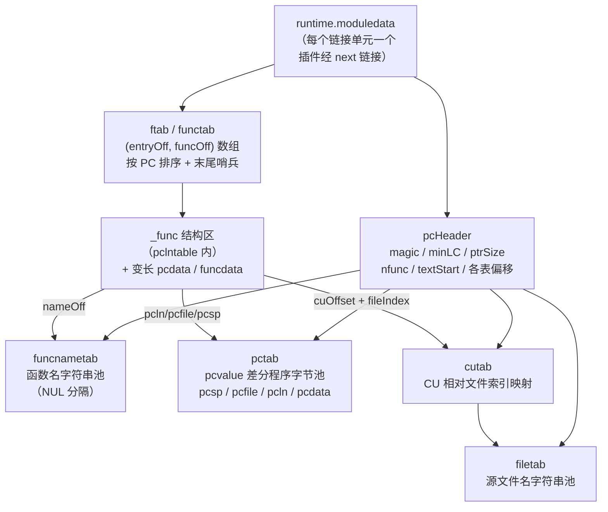
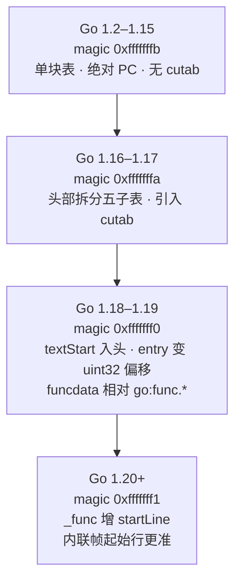
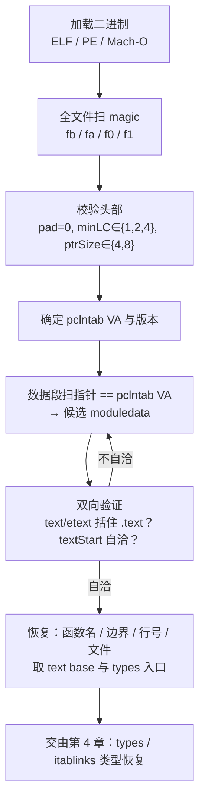

# Go与Rust现代二进制逆向（3）· gopclntab与函数符号恢复
> [!abstract] TL;DR
> - `gopclntab`（PC-line table）是 Go 运行时为 panic 回溯、GC 栈扫描、`runtime.Callers` 而生成的元数据，被 `runtime.firstmoduledata` 强引用，`-s -w` 剥离符号表与 DWARF 都动它不得——这是 Go「剥离」二进制仍能恢复全部函数名的根本原因。
> - 定位入口是 4 字节 magic：`0xfffffffb`(1.2) / `0xfffffffa`(1.16) / `0xfffffff0`(1.18) / `0xfffffff1`(1.20)；全文件扫 magic 即得 pclntab 首地址，再据版本选择解析布局。
> - `pcHeader` 之后是五张子表（funcnametab / cutab / filetab / pctab / pclntab）加一张 functab 函数偏移表；`_func` 结构把每个函数的名字、行号程序、栈图串在一起。
> - 行号/文件/栈指针并非明文存储，而是 **varint 差分程序（pcvalue）**：值用 zigzag 编码、PC 增量乘以 `minLC`，遇 0 增量终止——一次遍历即可把任意 PC 映射到 (行号, 文件, SP)。
> - `moduledata` 是总锚点：其首字段指回 `pcHeader`，据此可「双向验证」在数据段中定位它，再顺藤摸瓜拿到 `types` 与 text base（下一章类型恢复的入口）。
> - Go 1.18 起函数入口从绝对地址改为相对 `textStart` 的 uint32 偏移（省重定位、支持 PIE），逆向脚本若不按版本分支解析必然全盘错位。

## 概述与定位

在 C/C++ 世界里，`strip` 之后一个二进制会退化成漫山遍野的 `sub_401000`，函数边界要靠反汇编器的启发式一点点拼；而一个同样「剥离」过的 Go 程序，逆向器打开却往往能看到 `main.main`、`net/http.(*Server).Serve`、`github.com/vendor/pkg.Func` 这种带完整包路径的函数名，甚至附着源文件名与行号。这份「白送」的符号信息，绝大部分来自一张叫 `gopclntab` 的表。

`gopclntab` 是 **Program Counter Line Table**（PC 行号表）的缩写，最初的设计目标与逆向毫无关系：它是 Go 运行时自身的刚需元数据。当程序 panic 需要打印可读栈回溯、当 `runtime.Callers` 要枚举调用栈、当垃圾回收器要在任意抢占点精确扫描每个栈帧上的指针、当 `recover` 要找到 `deferreturn` 的重入点时，运行时都必须能把一个裸的程序计数器（PC）翻译成「这是哪个函数、第几行、当前栈指针偏移多少、哪些槽位是指针」。这些查询能力全部落在 `gopclntab` 上。因为它被运行时的活引用 `runtime.firstmoduledata` 牢牢拴住，链接器的死代码消除不会删它，`-ldflags="-s -w"` 也只删 `.symtab` 与 DWARF 调试段——于是「运行时需要」这一硬约束，反过来成了逆向者最稳定的信息来源。

本篇在系列中的定位需要划清边界。第 2 篇《Go 二进制结构与编译模型》已经讲过整体段布局、`go:buildinfo` 构建信息、编译单元与链接模型；本篇聚焦一张具体的表——`gopclntab` 的内部结构、由它驱动的**函数符号恢复**，以及作为总锚点的 **`moduledata`**。至于 `moduledata` 里指向的类型元数据（`types`/`typelinks`/`itablinks`）如何还原结构体、接口、方法集，属于第 4 篇《Go 类型系统元数据恢复》的领地，本篇只把它当作「下一站入口」点到为止；字符串与切片与接口的数据布局在第 5 篇；把这些原理落到 GoReSym 与 IDA 脚本的具体操作，则由第 7 篇承接。换句话说，本篇是「三条主线」的展开：**行号表**（pcvalue 差分程序如何把 PC 映射到源码坐标）、**函数名恢复**（functab 与 funcnametab 如何还原全名与边界）、**moduledata**（如何在剥离二进制里把这个无 magic 的锚点找出来并验证）。掌握这一篇，你就拥有了把「一堆机器码」还原成「带名字、带源码坐标的函数清单」的全部原理。

## 原理与机制

要理解 `gopclntab`，先要理解它上面的总管——`moduledata`。运行时把「一个链接单元」（通常就是整个静态可执行文件；用了 `-buildmode=plugin` 或动态库时会有多个）描述成一个 `runtime.moduledata` 结构。静态链接的程序里只有一个 `runtime.firstmoduledata`，多模块时通过其 `next` 字段串成链表。`moduledata` 是一张「什么都指得到」的大表：它持有 `pcHeader` 指针，持有 `funcnametab`、`cutab`、`filetab`、`pctab`、`pclntable`、`ftab` 等一系列切片，还持有代码段边界 `text/etext`、类型区 `types/etypes`、接口表 `itablinks` 等。可以说 `moduledata` 是 `pcHeader` 的超集：`pcHeader` 有的它都有，还多出类型系统与内存布局信息。

`pcHeader` 则是 `gopclntab` 数据块的自描述表头，位于 ELF `.gopclntab` 段的最开头。它用一个 4 字节 magic 声明格式版本，用 `minLC`（指令量子，PCQuantum）声明本架构上 PC 的最小步进（x86 为 1，arm64/ppc64 为 4），用 `ptrSize` 声明字长，用 `nfunc`/`nfiles` 声明函数与文件数量，并（在 1.18 起）用 `textStart` 记录文本段基址，最后给出到各张子表的偏移。运行时启动时的 `moduledataverify1` 会逐项校验这个头（magic 匹配、两个 pad 字节为 0、`minLC==PCQuantum`、`ptrSize==PtrSize`、`textStart==datap.text`），任何一项不符就 `throw("invalid function symbol table")`——这套校验规则，恰恰也是逆向工具用来确认「我扫到的确实是 pclntab」的判据。

五张子表分工明确，理解它们的协作是本篇的关键：

- **funcnametab**：所有函数名拼成的一大块字符串池，以 NUL 分隔。`_func.nameOff` 就是名字在这块池子里的字节偏移，从该偏移读到 NUL 即得函数全名。
- **ftab / functab**：`(entryOff, funcOff)` 二元组数组，按函数入口 PC 升序排列，末尾多一个哨兵项记录最后一个函数的结束地址（即 maxpc）。它是「PC → `_func`」的索引：`entryOff` 是函数入口，`funcOff` 是对应 `_func` 结构在 `pclntable` 中的偏移。
- **pclntable**：紧密排布的一堆 `_func` 结构，每个 `_func` 后面还跟着该函数变长的 pcdata 偏移与 funcdata 偏移。
- **pctab**：所有 pcvalue 差分程序的字节池。`_func` 里的 `pcsp`/`pcfile`/`pcln`/`pcdata[N]` 都是指向 pctab 的偏移，指向一段「PC → 值」的编码程序。
- **cutab + filetab**：两级文件名解析。`filetab` 是源文件名字符串池，`cutab` 做「编译单元相对索引 → filetab 偏移」的映射。

于是**函数名恢复的最短路径**清晰可见：遍历 `ftab` 拿到每个函数的入口与 `_func` 偏移 → 读 `_func.nameOff` → 到 `funcnametab` 读字符串。哪怕你根本不解析行号，仅凭 `ftab + funcnametab` 就能把二进制里所有 Go 函数的**边界**（相邻 `entryOff` 之差）和**全名**标注出来——这就是「剥离」的 Go 程序仍旧可读的技术本质。

下图是这套元数据的引用关系全景：



至于这块数据在不同格式里的落位：ELF 下是 `.gopclntab` 段（PIE 构建时可能叫 `.data.rel.ro.gopclntab`）；PE（Windows）里通常并入 `.rdata`，且 strip 后连自定义段名都不保留；Mach-O 下是 `__gopclntab` 段。正因为段名不可靠、剥离二进制里连符号名都没了，**全文件扫描 magic 字节**才成为跨平台通用的定位手段。

## 结构与算法详解

这一段把上面每个部件拆到字节级，并讲清让它高效运转的两个核心算法：pcvalue 差分解码与 findfunc 加速查找。

### pcHeader 逐字节布局

```
偏移    大小   字段            说明
0x00    4     magic          版本魔数：fb=1.2 / fa=1.16 / f0=1.18 / f1=1.20
0x04    1     pad1           恒 0（校验项）
0x05    1     pad2           恒 0（校验项）
0x06    1     minLC          指令量子 PCQuantum：x86=1，arm64/ppc64=4
0x07    1     ptrSize        指针字长：4 或 8
0x08    N     nfunc          函数数量（宽度随字长，int）
..      N     nfiles         文件数量
..      P     textStart      文本段基址（= moduledata.text），仅 1.18+ 存在
..      P     funcnameOffset 到 funcnametab 的偏移（相对 pcHeader 起点）
..      P     cuOffset       到 cutab 的偏移
..      P     filetabOffset  到 filetab 的偏移
..      P     pctabOffset    到 pctab 的偏移
..      P     pclnOffset     到 pclntab（functab + _func 区）的偏移
```

（N 随 `int` 宽度、P = `ptrSize`。）这个头之所以「自描述」，是为了让运行时在不依赖外部符号的前提下，仅凭一个 `pcHeader` 指针就能重建对所有子表的访问；对逆向而言，它同时是「验证锚点」——`pad1/pad2` 恒 0、`minLC` 只能取 `{1,2,4}`、`ptrSize` 只能取 `{4,8}` 这些强约束，能在扫 magic 命中后立刻排除绝大多数误报。要特别记住的一个坑：`textStart` 未必等于 `.text` 段首字节——它指向「第一个 Go 生成的函数」，前面可能还垫着 libc 等外部函数；1.18 起所有函数入口都以「相对 `textStart` 的偏移」存储，所以取错这个基址，恢复出来的每个函数地址都会整体平移。

### magic 与四世代格式演进

`gopclntab` 的布局在历史上大改过三次，每一版 magic 都对应一套不同的解析逻辑，逆向器必须先定版本再选布局，否则会「读到看似合理实则错位的字节」。



- **1.2–1.15（0xfffffffb）**：一整块表，头部只有 magic/pad/minLC/ptrSize 加 nfunc；functab 里的 entry 与 `_func.entry` 都是**绝对 `uintptr`**；行号程序偏移相对 pclntab 头；文件名由一张简单的偏移数组按文件号索引，尚无 cutab。这套沿用了十余年，Russ Cox 的《Go 1.2 Runtime Symbol Information》设计文档是其权威描述。
- **1.16–1.17（0xfffffffa）**：把头部扩展为携带五张子表偏移，`funcnametab`/`cutab`/`filetab`/`pctab`/`pclntab` 正式分离；引入 `cutab`，让文件索引变成**编译单元（CU）相对**，为跨 CU 去重文件名铺路。
- **1.18–1.19（0xfffffff0）**：里程碑级改动。`textStart` 进头部，functab 的 entry 与 `_func` 首字段都从绝对 `uintptr` 改为**相对 `textStart` 的 `uint32` 偏移**；funcdata 也改为相对 `go:func.*` 区的偏移。动机是三重的：消除大量重定位项（绝对地址每个都要重定位，偏移不用）、更好支持 PIE/ASLR、把表压小一半（8 字节指针变 4 字节偏移）。这也是为什么 1.18 成了逆向脚本的分水岭——不按版本分支处理 entry 宽度，结果必错。
- **1.20+（0xfffffff1）**：`_func` 新增 `startLine int32`，记录函数定义起始行，主要为内联帧回溯提供更准的起始行号。解析旧版本时若误读这个字段，会把后面的 funcID 等一并读偏。

### functab 与二分查找

`ftab` 按 `entryOff` 升序排列，末尾哨兵项的 `entryOff` 等于最后一个函数的结束地址。给定一个 PC，先减去 `textStart`（1.18+）得到偏移，再在 `ftab` 上二分：找到满足 `entryOff[k] ≤ off < entryOff[k+1]` 的 k，第 k 项的 `funcOff` 就指向对应 `_func`。哨兵项的存在让「最后一个函数」的上界判定无需特判。二分是 O(log nfunc)，对一次性静态分析已经够用；但运行时的 panic/GC 每次抢占都要查，热路径上 log 也嫌慢，于是有了下面的加速表。

### findfunctab：O(1) 桶加速

```
const minfunc      = 16              // 最小函数尺寸
const pcbucketsize = 256 * minfunc   // = 4096 字节 / 桶
const nsub         = 16              // 每桶 16 个子桶，各覆盖 256 字节

type findfuncbucket struct {
    idx        uint32     // 该桶首函数在 ftab 的基准索引
    subbuckets [16]byte   // 各子桶相对基准的增量（故单桶内函数数 < 256）
}

// PC → 候选 ftab 索引，近似 O(1)
x   := pc - minpc
b   := x / pcbucketsize                            // 落在第几个桶
i   := (x % pcbucketsize) / (pcbucketsize / nsub)  // 桶内第几个子桶（256 字节粒度）
idx := findfunctab[b].idx + findfunctab[b].subbuckets[i]
// 再从 idx 起在 ftab 上微调（通常只需前后挪几项）定位精确函数
```

这张表把文本段按 4KB 分桶、每桶再切 16 个 256 字节子桶，直接算出一个非常接近的 `ftab` 起始索引，把二分收敛成「几乎命中 + 少量线性微调」。设计上用 `byte` 存子桶增量、只在桶头存一个 `uint32` 基准，是空间与时间的精细权衡：`minfunc=16` 保证每个 256 字节子桶里的函数数被 `byte` 装得下。逆向时一般不必重建这张加速表——它是纯性能优化，不含任何 `ftab` 之外的新信息；但读懂它有助于理解 Go 运行时为何能在 GC 抢占的极热路径上做到常数级 PC 查找。

### _func 结构逐字段

```
type _func struct {          // 位于 pclntable，由 functab.funcOff 指向
    entryOff    uint32   // 1.18+：相对 textStart 的函数入口；1.17- 为 uintptr 绝对 entry
    nameOff     int32    // 函数名在 funcnametab 中的偏移
    args        int32    // 参数 + 返回值占用的栈字节数
    deferreturn uint32   // deferreturn 重入点相对 entry 的偏移（供 recover）
    pcsp        uint32   // → pctab：SP 偏移程序
    pcfile      uint32   // → pctab：文件索引程序
    pcln        uint32   // → pctab：行号程序
    npcdata     uint32   // 其后 pcdata 项数（每项 4 字节）
    cuOffset    uint32   // 本函数 CU 在 cutab 的起始索引
    startLine   int32    // 1.20+ 新增：函数起始行（TEXT 指令处）
    funcID      uint8    // 特殊 runtime 函数标记（如 runtime.main、runtime.goexit）
    flag        uint8
    _           [1]byte  // 对齐填充
    nfuncdata   uint8    // 必须是最后一个定长字段
    // 紧随其后：pcdata[npcdata] uint32 …… 然后 funcdata[nfuncdata]（每项 4 字节偏移）
}
```

`_func` 是「一个函数的全部运行时元数据」的集散地：名字、参数尺寸、三张主 pcvalue 程序（栈指针、文件、行号）、变长的 pcdata（栈图索引、内联树、unsafe-point 标记等）与 funcdata（`args`/`locals` 指针位图、内联函数表、栈对象表等）。`funcID` 标记那些运行时要特殊对待的函数（如回溯到 `runtime.goexit` 就停）。逆向时最有价值的是 `nameOff`（拿名字）、`pcln`/`pcfile`（拿源码坐标）、`args`（辅助推参数个数）与 `startLine`（区分同名内联帧）。注意 `npcdata`/`nfuncdata` 决定了紧随其后的变长数组长度，进而决定下一个 `_func` 的起始——解析时必须逐个累加、不能假定 `_func` 定长，这是手写解析器最常见的翻车点。

### pcvalue 差分程序（核心算法）

行号、文件、SP 偏移都不是「每条指令存一份」，而是编码成一段**差分程序**放在 pctab 里。原理是：这些值沿 PC 单调或缓变，相邻区间的差远小于绝对值，用「变化量 + 覆盖长度」表达最省空间。每个程序是一串 `(值增量, PC 增量)` 对：值增量用 **zigzag varint**（把有符号数映射到无符号再变长编码，小的正负数都只占 1 字节），PC 增量用普通 **uvarint** 且要乘以 `minLC`。

```
// 解码一段 pcvalue 程序，求 targetpc 处的值
val   := int32(-1)     // 约定初值 -1（未知/无效）
pc    := f.entry       // 从函数入口开始累加
p     := pctab[off:]   // off = pcsp / pcfile / pcln
first := true
for {
    uvdelta := uvarint(p)                 // 读值增量（zigzag 形式）
    if uvdelta == 0 && !first { break }   // 非首项读到 0 → 程序结束
    if uvdelta & 1 != 0 {                 // zigzag 解码
        vdelta = ^int32(uvdelta >> 1)     // 奇数 → 负
    } else {
        vdelta = int32(uvdelta >> 1)      // 偶数 → 非负
    }
    pcdelta := uvarint(p)                 // 读 PC 增量（uvarint）
    val += vdelta
    if targetpc < pc + pcdelta*minLC {    // targetpc 落在本区间
        return val                        // → 当前 val 即答案
    }
    pc   += pcdelta * minLC
    first = false
}
```

这段循环就是 Go 运行时 `pcvalue`/`step` 的语义骨架。几个要点值得咀嚼：其一，**初值 -1** 是约定——若某 PC 之前没有任何有效区间，查询返回 -1 表示「无值」（比如 pcln 里表示无行号）。其二，**终止条件**是「非首项读到值增量 0」，因为首项的 0 可能是合法的「值不变、只推进 PC」，所以要用 `first` 标志区分。其三，PC 增量乘 `minLC`：在 arm64 上一条指令占 4 字节，PC 增量以「指令数」计，乘 4 才是字节数——跨架构解析忘了乘 `minLC` 会让行号错位。其四，同一套编码复用于 `pcsp`（栈回溯时求当前帧的 SP 偏移，从而找到返回地址与上一帧）、`pcfile`（求文件索引）、`pcln`（求行号）与各 `pcdata`（求 GC 栈图索引、内联标记等）——一套编码器打天下。相比 DWARF 的 `.debug_line` 行号程序，pcvalue 是其「精简子集」：没有 DWARF 的列号、序言结束、块起始等丰富标记，只保留「PC → 单个整数」的映射，因此更紧凑、解码更快，但也丢了源码级调试的细粒度信息——这正是「运行时够用即可、不为调试器优化」的取舍。

### 文件名解析：pcfile → cutab → filetab

拿到 `pcfile` 程序在某 PC 处产出的 `fileIndex` 后，文件名还要过两级映射：`filetab` 偏移 = `cutab[_func.cuOffset + fileIndex]`，再从 `filetab` 的该偏移读 NUL 结尾字符串。为什么要 CU 相对的两级结构？因为一个大程序有成百上千个编译单元，很多单元引用同一批文件（尤其标准库）；让每个函数只存一个小的「CU 内文件序号」，由 `cutab` 统一映射到全局 `filetab` 池，既能跨 CU 去重文件名字符串、又让 `_func` 里只需一个小整数 `cuOffset`。解析时若把 1.16 之前（无 cutab）的单级偏移数组当成两级来读，会直接读飞。

### moduledata 定位与双向验证

`moduledata` 没有自己的 magic，静静躺在数据段中部；`runtime.firstmoduledata` 符号是 LOCAL 的，strip 后名字就没了，但结构体本身还在。定位它的钥匙是它的**首字段是 `*pcHeader`**：

```
type moduledata struct {     // runtime.firstmoduledata（strip 后 LOCAL 符号丢失，结构仍在）
    pcHeader     *pcHeader    // ★首字段：指回 pcHeader —— 定位 moduledata 的锚点
    funcnametab  []byte
    cutab        []uint32
    filetab      []byte
    pctab        []byte
    pclntable    []byte       // functab + _func 区
    ftab         []functab    // (entryOff, funcOff)
    findfunctab  uintptr
    minpc, maxpc uintptr      // 本模块覆盖的 PC 范围
    text, etext  uintptr      // ★代码段边界 = 1.18+ 偏移解析所需的 text base
    // … noptrdata / data / bss …
    types, etypes uintptr     // → 第 4 章类型元数据入口
    typelinks    []int32
    itablinks    []*itab
    // …
    next *moduledata          // 多模块（插件/共享库）链
}
```

于是标准定位流程是：先全文件扫 magic 得到 pclntab 的虚拟地址（VA）→ 在数据段里扫一个**值恰好等于该 VA 的指针**，命中处就是候选 `moduledata`（首字段）。GoReSym 更进一步用「双向验证」消歧：既然 `moduledata` 指向 pclntab、pclntab 头里的 `textStart` 又应等于 `moduledata.text`，那就用候选 `moduledata` 反推 text base 与 pclntab，看两者是否自洽；能找到一个自洽的 `moduledata` 的那个 pclntab 候选，才是真的。这解决了同一 magic 出现多个候选（如同时存在 `runtime.pclntab` 与外链拷贝）时的歧义。拿到可信 `moduledata` 后，逆向的收益是双份的：`text/etext` 给出代码段边界，同时也是 1.18+ 偏移解析的正确基址；`types/etypes/typelinks/itablinks` 则是下一篇类型恢复的入口。要留意的边界：外部链接的 cgo、macOS arm64 等场景下 `moduledata.pcHeader` 可能与 `runtime.pclntab` 不一致（见 golang/go#69428），取错基址会满盘皆错；插件场景要沿 `next` 遍历所有模块。

## 工具视角与实战

原理讲透之后，实战多数时候不必手搓解析器——成熟工具已把上述逻辑固化。但理解原理决定了你能否判断工具「什么时候会骗你」。

- **GoReSym（Mandiant）**：Go 写的独立 CLI，是当下事实标准。它输出结构化 JSON，含全部函数名与地址、源文件、类型信息、`buildinfo` 与 Go 版本；覆盖 Go 1.2–1.24，多策略容错——magic 被抹掉时可回退到「扫函数前导字节 + 扫 moduledata 指针」定位，并做前述双向验证。典型用法形如 `GoReSym -t -d -p ./sample`（`-t` 恢复类型、`-d` 用户包去噪、`-p` 输出更全）。它最适合先跑一遍拿到函数/类型清单，再喂给反汇编器。
- **IDA Pro**：常用脚本有 `go_parser`（0xjiayu）、`golang_loader_assist`（strazzere）、`IDAGolangHelper`。它们解析 pclntab/moduledata，把函数名回写为注释并批量重命名，恢复源文件行号。IDA 8.x 起对 Go 有部分原生识别，但版本跟进往往滞后于新 Go 格式，遇 1.20+ 二进制常需配合最新脚本或 GoReSym 的结果导入。
- **Ghidra**：10.3+ 内置 Golang Analyzer，加载时自动解析 pclntab 与 moduledata、恢复函数名与部分签名、还原类型；对新手最省事，但对被篡改的样本容错不如 GoReSym。
- **radare2 / rizin**：原生解析 `.gopclntab`，`aa`/`aap`（分析函数前导）后符号以 `sym.go.` 前缀呈现，适合命令行快速侦查。
- **Go 官方 `debug/gosym` + `debug/elf|pe|macho`**：自写解析器的基础设施，`gosym.NewLineTable(text, textStart)` 加 `NewTable` 即可做 PC↔行号/函数查询；`goretk/redress` 与调试器 Delve 都建立在类似基础上。手写解析器的价值在于对抗定制化混淆——当通用工具被投毒时，你能按本篇的字节布局逐字段核对。

实战推荐流程如下图：先判定是否 Go（`buildinfo` 的 `\xff Go buildinf:` magic、`.gopclntab` 段、`runtime.` 字符串特征），再定版本（pclntab magic），随后恢复函数表与名字、恢复行号/文件，最后定位 `moduledata` 进入类型恢复。



一个高频实战判断：看到 `-s -w` 编译的样本别以为「脱了符号就没辙」——那只删了 `.symtab` 与 DWARF，pclntab 原封不动，函数名照样恢复。真正会挡路的是下一节要讲的主动对抗。

## 安全性与正确使用

`gopclntab` 的存在是一把双刃剑，理解它的安全含义对攻防两端都重要。

**信息泄露面。** pclntab 把大量本该「编译即蒸发」的信息带进了发行二进制：完整的包导入路径（常包含私有仓库地址、内部模块命名、组织结构）、每个函数的源文件名与行号，甚至因 `cuOffset`/filetab 而暴露构建机上的绝对路径——`/home/alice/go/src/corp/secret/...` 这类路径会连开发者用户名、目录结构一并泄露，构成供应链与内网情报。这也直接解释了一个业界现象：**Go 恶意样本普遍比同等 C/C++ 样本更好逆向**，因为攻击者若不额外处理，函数名、包结构、第三方依赖清单几乎白送给分析者。对红队是侦查金矿，对蓝队则是可依赖的分析抓手。

**防御与加固的正确边界。** 几条常被误解的事实：其一，`-ldflags="-s -w"` 并不能隐藏函数名，很多人误以为它等于「脱壳」，实则 pclntab 不受影响；其二，真正低成本且正确的路径泄露缓解是 **`-trimpath`**，它把构建路径前缀改写成模块相对路径，能消除绝对路径与用户名泄露，应作为发布构建的默认项；其三，要连函数名一起处理需上 **garble**（第 8 篇详解）——它把符号名 hash 化、去除 `buildinfo`、篡改部分表，但因为运行时仍需一份可用的 pclntab 来支撑 panic/GC，garble 是「改名」而非「删表」，逆向者仍能拿到函数边界与结构，只是名字不再可读；其四，有人手工清零或篡改 magic 来挡住只认 magic 的旧工具，但这会破坏 panic 回溯乃至部分运行时功能，且现代工具靠函数前导扫描 + moduledata 反查即可绕过，属于「脆弱混淆」，不宜作为正经加固手段。归根结底：**只要还想让 Go 运行时正常工作，就无法真正删掉 pclntab**，加固的现实目标是「提高逆向成本」而非「杜绝恢复」。

**分析者一侧的误用风险。** pclntab 是「可信度需要验证的辅助真值」，不能盲信。第一类风险是**投毒**：攻击者可伪造 functab 或名字表，让工具显示虚假函数名误导分析——正确做法是交叉验证，用反汇编出的函数前导字节比对 functab 声明的边界、用 moduledata 双向自洽、用行号单调性做 sanity check，最终以指令语义为准、把恢复结果当线索而非结论。第二类是**版本判断错误**：把 1.17 的绝对 entry 当 1.18 的 uint32 偏移解析、或在 1.19 二进制上误读 1.20 才有的 `startLine`，都会产出「看似合理实则整体错位」的名字与行号，因此**必须先定版本、再选布局**。第三类是**基址陷阱**：外链/cgo/macOS arm64 下 `pcHeader` 与 `runtime.pclntab` 可能不一致（golang/go#69428），`textStart` 取错则所有函数地址整体平移；多模块（插件）场景漏遍历 `next` 会丢掉半个程序的符号。把这三类坑守住，pclntab 才是可靠的分析地基。

## 小结

`gopclntab` 是 Go 运行时的自带符号系统，因被 `moduledata` 强引用而在剥离二进制里存活，是 Go 逆向「函数名不消失」的根因。它的心智模型可压成一条链：`moduledata` 锚定一切 → `pcHeader` 自描述版本与子表偏移 → `functab` 把 PC 索引到 `_func` → `_func` 用 `nameOff` 取名、用 `pcln/pcfile/pcsp` 指向 pctab 里的 **pcvalue 差分程序** → 差分程序一次遍历把 PC 映射成行号/文件/SP → 文件再过 `cutab/filetab` 两级解析成路径。四代格式的分水岭在 1.18（绝对地址改 `textStart` 相对偏移）与 1.20（新增 `startLine`），解析必须按 magic 分支。定位 `moduledata` 靠「扫 magic 得 pclntab VA → 扫指向该 VA 的指针 → 双向验证」，拿到它同时收获代码边界与类型区入口——后者正是下一篇《Go 类型系统元数据恢复》的起点。原理层面掌握了本篇，工具（GoReSym/IDA/Ghidra）只是把这些字节操作自动化，而你随时能在它们出错或被对抗时回到字节级手工核对。

## 相关阅读

- 上一章（二进制整体结构与 buildinfo）：[[02.Go二进制结构与编译模型|← 上一章：Go二进制结构与编译模型]]
- 下一章（顺着 moduledata.types 恢复类型/接口/方法）：[[04.Go类型系统元数据恢复|→ 下一章：Go类型系统元数据恢复]]
- 工具落地（本篇原理到 GoReSym 与 IDA 脚本操作）：见系列第 7 篇《Go逆向工具：GoReSym与IDA脚本》
- 混淆对抗（garble 如何改写 pclntab 与符号）：见系列第 8 篇《Go混淆对抗：Garble》
- ABI 承接（栈回溯/参数尺寸与调用规约）：[[23.C_C++运行时与ABI/01.运行时与ABI概览]]、[[22.调用规约/06.SystemV_AMD64调用规约]]
- 同族元数据对照（Swift/Objective-C 运行时元数据可与本机制横向对比）：[[36.Objective-C与iOS运行时/01.Objective-C运行时概览]]
- 应用场景（Go 恶意样本分析为何依赖 pclntab）：[[50.恶意代码分析与免杀对抗/00.恶意代码分析与免杀对抗总览]]
- 权威一手资料：Go 源码 `src/runtime/symtab.go`（pcHeader / functab / findfunc / pcvalue）、`src/runtime/runtime2.go`（`_func`）、`src/cmd/link/internal/ld/pcln.go`（表的写出逻辑）、标准库 `debug/gosym`；Russ Cox《Go 1.2 Runtime Symbol Information》设计文档；Mandiant GoReSym 项目；OpenTelemetry eBPF Profiler 的 `doc/gopclntab.md` 格式笔记。

[[00.Go与Rust现代二进制逆向总览|⬆ 系列总览]] | [[02.Go二进制结构与编译模型|← 上一章]] | [[04.Go类型系统元数据恢复|→ 下一章]]
