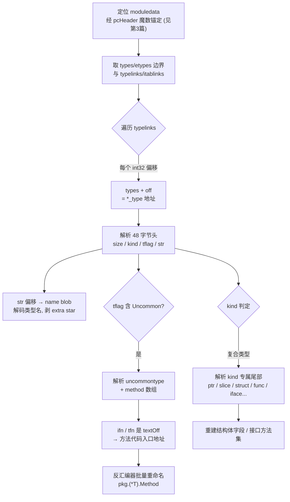
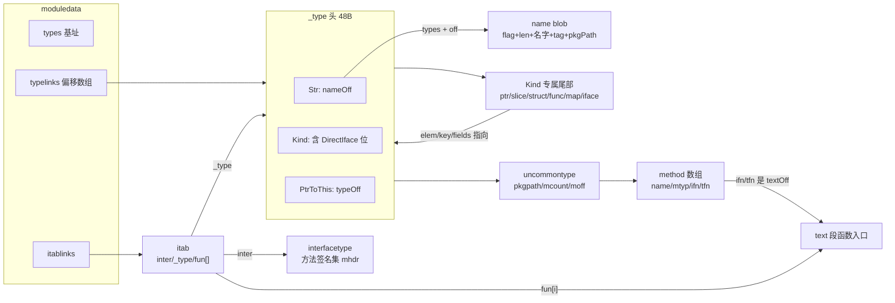
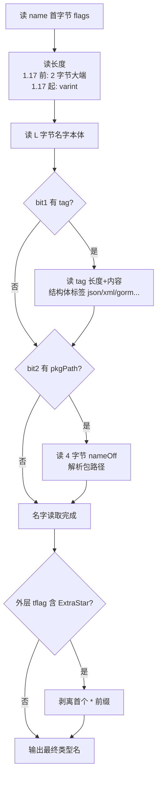
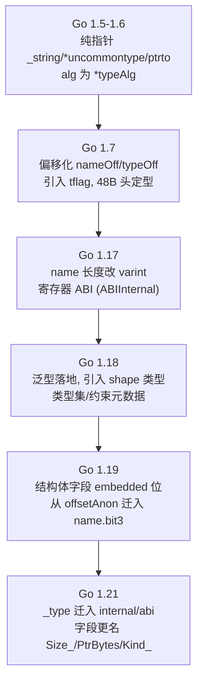

# Go与Rust现代二进制逆向（4）· Go类型系统元数据恢复
> [!abstract] TL;DR
> - Go 把完整类型描述符（`_type`/`rtype` 的 48 字节头 + kind 专属尾部 + `uncommontype` 方法表）编译进只读段；即便用 `-ldflags "-s -w"` 剥掉符号表与 DWARF，这套元数据依然存在，因为反射、接口分发、GC 精确扫描、map 哈希、panic/`fmt` 打印类型名全都在运行时依赖它。
> - Go 1.7 起类型间的交叉引用从「绝对指针」改成「相对 `moduledata.types` 基址的 int32 偏移」（nameOff / typeOff / textOff），消除海量重定位、换来位置无关——逆向第一步必须先定位 types 基址，否则每个偏移都会解析成垃圾地址。
> - 恢复入口是 `moduledata` 的 `typelinks`（类型偏移数组）与 `itablinks`（接口表数组）；沿 typelink → `_type` → 解 name/kind/尾部 → `uncommontype` 方法表，可批量还原类型名、结构体字段布局、以及「方法名 + 代码入口地址」。
> - `method.ifn/tfn` 是 textOff，直接给出方法函数入口地址；配合 `pkg.(*T).Method` 命名约定，可在反汇编器里一次性重命名成千上万个函数，把不透明二进制拉回近源码视图。
> - 版本探测是成败前提：1.7 偏移化、1.17 name 长度从 2 字节大端改 varint、1.18 泛型引入 shape 类型、1.19 结构体字段 embedded 位迁移、1.21 结构迁入 `internal/abi`——解析器认错版本即全盘错位。
> - Go 与 Objective-C 在运行时保留类型名，C++/Rust 基本不保留，这是 Go 二进制远比 Rust 可读的根因；本篇只做「静态描述符」恢复，接口 `iface/eface`「值」在内存里的现场解码交给第 5 篇。

## 概述与定位

在整个 Go 逆向流水线里，类型系统元数据是「信息含量最高、性价比最大」的一块数据。第 2 篇讲清了 Go 二进制的整体布局与 `moduledata` 的角色，第 3 篇用 gopclntab 把函数边界与函数名还原了出来；本篇承接它们，进一步把「每个类型是什么」讲清楚——类型的名字、种类（Kind）、大小与对齐、结构体的字段布局、命名类型挂了哪些方法、哪个具体类型满足哪个接口。拿到这些，反汇编器里那些 `sub_4A1C30` 一样的匿名函数会被批量改写成 `net/http.(*Server).Serve`，一个 `mov rax, [rbx+0x18]` 也能被解释成「读 `Request` 结构体的 `Header` 字段」。

为什么 Go 会把如此完整的类型信息塞进产物，而 C/C++ 默认几乎不带？根因在语言语义：Go 有反射（`reflect`）、有接口的动态派发与类型断言/类型开关、有 `fmt`/`encoding/json` 这类「运行时按类型名与字段标签工作」的库、还有精确 GC（垃圾回收器要知道一个对象里哪些字里是指针）。这些能力都要求运行时随身携带每个类型的自描述数据。于是编译器把类型描述符写进只读数据段，链接进最终二进制。关键推论是：**这套元数据不是调试信息，而是运行时功能的一部分，因此常规「剥符号」删不掉它。**`-w` 删的是 DWARF 调试段，`-s` 删的是传统符号表（`.symtab`），二者都不触碰类型描述符与 pclntab。这就是为什么「stripped 的 Go 样本」在恶意代码分析里仍然出奇地可读。

需要先划清与相邻篇的边界，避免重复：本篇聚焦**静态的类型描述符（元数据）**——`_type`/`rtype` 头、各 Kind 的尾部结构、`uncommontype` 方法表、`interfacetype` 与 `itab` 这些「类型层面」的对象；而第 5 篇处理**运行时的值**——`iface`/`eface` 两个字在内存里怎么摆、字符串与切片的胖指针头怎么定位、如何从一处内存把一个接口值现场解码成「动态类型 + 数据指针」。可以这样记：本篇教你读懂「类型的说明书」，第 5 篇教你拿说明书去读「一个活的值」。定位 `moduledata`、pcHeader 魔数等属于第 3 篇；GoReSym 的完整用法在第 7 篇；Garble 如何打乱这些名字在第 8 篇；与 Rust `vtable`、Swift witness table 的横向对比在第 13/14 篇。

## 原理与机制

一切的核心是 `_type` 结构（`reflect` 包对外叫 `rtype`，Go 1.21 后迁到 `internal/abi.Type`）。它是**每个类型描述符的公共头**，无论这个类型是 `int` 还是一个 30 字段的结构体，开头都是这 48 个字节（amd64/arm64 等 64 位平台）。字段布局如下：

```
偏移   大小  字段          含义
0x00   8    Size          类型实例占用字节数（sizeof）
0x08   8    PtrBytes      前缀里「含指针」的字节数，供 GC 精确扫描
0x10   4    Hash          类型哈希，用于 map、类型开关的快速比较
0x14   1    TFlag         类型标志位（Uncommon/ExtraStar/Named/RegularMemory...）
0x15   1    Align         对齐
0x16   1    FieldAlign    作为结构体字段时的对齐
0x17   1    Kind          种类：低 5 位是 Kind，高位是 DirectIface/GCProg 标志
0x18   8    Equal         相等比较函数指针（type..eq.<T> 生成函数）
0x20   8    GCData        GC 扫描位图或 GC 程序指针
0x28   4    Str           nameOff：到类型名 blob 的偏移（相对 types 基址）
0x2c   4    PtrToThis     typeOff：到「指向本类型的指针类型」的偏移
总计   0x30 = 48 字节
```

这里有三个必须吃透的设计。**其一是偏移化寻址。**注意 `Str` 与 `PtrToThis` 不是指针而是 int32 偏移。Go 1.5/1.6 时这些位置放的还是真指针（`*string`、`*uncommontype`、`*_type`），1.7 做了一次影响深远的重构，把类型间几乎所有交叉引用改成「相对某个基址的 32 位偏移」。动机是重定位：只读数据里的每个绝对指针都需要一条重定位记录，而类型元数据的交叉引用是天文数字（每个类型都指向自己的名字、元素类型、方法……）。改成 int32 偏移后，这些数据变成真正只读、位置无关，二进制体积显著变小，动态链接启动时要处理的重定位也少了。代价是每次解引用多一步「基址 + 偏移」的加法，以及偏移被限制在 ±2GB（对单个模块绰绰有余）。这与 CPU 的 RIP 相对寻址、PIE 避免绝对地址是同一种思想。**对逆向的直接后果是：你不能顺着一个指针走，必须先知道该模块的 `types` 基址再做加法**——这正是「先定位 `moduledata.types`」成为铁律的原因。

**其二是 Kind 字节的位复用。**`Kind` 低 5 位（`KindMask = 0x1f`）是真正的种类枚举：从 `Bool`、`Int`、`Int8`……一直到 `Array`、`Chan`、`Func`、`Interface`、`Map`、`Pointer`、`Slice`、`String`、`Struct`、`UnsafePointer`，共 26 个。高位是标志：`KindDirectIface`（0x20）表示「该类型的值能直接塞进接口的数据字，而非通过指针间接存放」；`KindGCProg`（0x40）表示 `GCData` 指向的是一段 GC「程序」（用于超大位图的压缩表示）而非普通位图。`KindDirectIface` 在逆向接口值时至关重要：它决定了接口第二个字里放的是「值本身」还是「指向值的指针」。**其三是 `TFlag` 决定尾部有没有 `uncommontype`。**只有 `TFlagUncommon`（0x01）置位的类型，其描述符尾部才跟着方法表；`TFlagExtraStar`（0x02）表示名字里多了个 `*` 前缀需剥掉；`TFlagNamed`（0x04）表示是命名类型；`TFlagRegularMemory`（0x08）表示可按内存字节直接做相等/哈希。

类型名不是内联字符串，而是一段自描述的 **name blob**，由 `Str` 偏移定位。它的编码是变长的：首字节是标志位（bit0 导出、bit1 有 tag、bit2 有 pkgPath、bit3 embedded），随后是长度，再是名字本体，可选地跟着结构体标签与包路径偏移。长度字段的编码在 **Go 1.17 前后不同**：1.17 前是 2 字节大端 `uint16`，1.17 起改成 varint——这是跨版本解析器最容易翻车的地方之一。

最后是锚点。`moduledata` 里 `types`/`etypes` 给出类型元数据段的上下界，所有 typeOff 都相对 `types`；`typelinks` 是一串 int32 偏移，指向「本程序里真正用到的类型」；`itablinks` 指向预计算好的接口表。逆向时以 `typelinks` 为遍历入口，`resolveTypeOff(基址, off)` 的本质就是 `types + off`（跨模块场景——如插件——才需要那个「模块内指针」参数去判断偏移属于哪个模块）。整个恢复流程如下：



## 类型描述符的结构与算法详解

### Kind 专属尾部：复合类型如何拼装

`_type` 只是公共头。对复合类型，编译器让「Kind 专属结构」把 `_type` 作为**第一个字段内嵌**，紧接着放该 Kind 独有的字段。于是解析规则很规整：读完 48 字节头，按 `Kind` 选择尾部布局继续读。各 Kind 的尾部（字段用其指向的元素类型 `*_type` 或等价偏移表达）：

- **Pointer**：尾部一个 `elem *_type`，即指向的目标类型。
- **Slice**：一个 `elem`，元素类型。
- **Array**：`elem`、`slice`（对应切片类型）、`len`（元素个数）。
- **Chan**：`elem` 与 `dir`（方向：单收/单发/双向）。
- **Map**：`key`、`elem`、`bucket`（运行时桶类型）、`hasher` 函数指针，以及 `keysize`/`elemsize`/`bucketsize`/`flags` 等布局参数——map 的尾部信息量最大，逆向能借此还原键值类型与桶结构。
- **Func**：`inCount uint16`、`outCount uint16`，其后紧跟 `inCount+outCount` 个参数/返回值类型引用；`outCount` 的最高位是「最后一个入参为 `...` 变参」的标志。
- **Struct**：`pkgPath name` 加一个 `fields []structfield` 切片；每个 `structfield` 含字段名 `name`、字段类型 `*_type`、以及 `offset`（字段在结构体内的字节偏移）。
- **Interface**：`pkgpath name` 加 `mhdr []imethod`；每个 `imethod` 只有 `name nameOff` 与 `ityp typeOff`（方法签名类型，不含接收者）。

对结构体逆向而言，`structfield.offset` 是黄金：它把「`mov rax,[rbx+0x18]`」直接翻译成「取 `Request.Header`」。这里有个跨版本陷阱：Go 1.19 前该字段叫 `offsetAnon`，是 `offset<<1 | isEmbedded` 的位打包（最低位表示匿名/内嵌字段）；1.19 起 embedded 语义搬进了 name 首字节的 bit3，`offsetAnon` 退化为纯 `offset`。用错解读会让所有字段偏移整体错位一倍——这类「差一位」的错误在实战里极隐蔽。

### uncommontype 与方法表：把方法名接回代码地址

命名类型（以及带方法的类型）会在 `TFlagUncommon` 置位时，于描述符尾部（Kind 专属尾部之后）跟一个 `uncommontype`：

```
uncommontype (16 字节)
0x00  4  pkgpath  nameOff   包导入路径；内建类型(int/string)为空
0x04  2  mcount   uint16    方法总数
0x06  2  xcount   uint16    导出方法数
0x08  4  moff     uint32    从本结构到 [mcount]method 数组的偏移
0x0c  4  _        pad

method (16 字节) × mcount
0x00  4  name  nameOff   方法名
0x04  4  mtyp  typeOff   方法类型（不含接收者的 func 签名）
0x08  4  ifn   textOff   接口调用用的入口（单字接收者包装）
0x0c  4  tfn   textOff   普通方法调用用的入口
```

`ifn`/`tfn` 是相对 `text` 段的偏移，**直接就是方法函数的入口地址**。这意味着：解析完一个命名类型的方法表，你同时拿到了「方法名字符串」和「它编译后的代码地址」，于是可以在反汇编器里把那段代码命名为 `pkg.(*T).Method`。一个中等规模的 Go 程序有几千个方法，这一步往往是「读不懂」到「基本能读」的分水岭。为什么要区分 `ifn` 与 `tfn`？因为通过接口调用时接收者以「单字」形式传入，可能需要一层包装/解引用，而直接调用走另一条更快路径；两个入口指向的机器码略有差异，但对命名而言指向的是同一个逻辑方法。

有一条**方法集规则**必须记牢，否则会漏掉一半方法：值类型 `T` 的方法集只含「值接收者」方法，而指针类型 `*T` 的方法集含「值接收者 + 指针接收者」全部方法。因此指针接收者方法只出现在 `*T` 的 `uncommontype` 里。逆向时若只看 `T` 的描述符，会系统性地漏掉所有 `func (t *T) ...` 方法——要拿全方法集，务必找到并解析 `*T` 的描述符（可经 `T` 头里的 `PtrToThis` 偏移跳过去）。

### itab 与接口满足：谁实现了谁

接口在 Go 里有两种运行时表示：空接口 `interface{}`/`any` 用 `eface{_type *_type, data pointer}`，非空接口用 `iface{tab *itab, data pointer}`。类型元数据侧的核心对象是 `itab`——它是「(接口类型, 具体类型)」这一对的运行时凭证：

```
itab
0x00  8      inter   *interfacetype   接口类型描述符
0x08  8      _type   *_type           具体类型描述符
0x10  4      hash    uint32           _type.hash 的副本，供类型开关快速比较
0x14  4      _       pad
0x18  8×n    fun     [n]uintptr       方法分发表；fun[0]==0 表示不实现该接口
```

`fun` 是变长数组，长度等于接口方法数，`fun[i]` 是具体类型满足接口第 `i` 个方法的代码地址。**排序约定**：接口方法与 `fun[i]` 都按方法名（未导出的再按包路径）排序对齐，逆向时要用同一套排序把 `fun[i]` 和 `interfacetype.mhdr[i]` 的方法名对上号。`hash` 是 `_type.hash` 的拷贝，用于类型开关（type switch）在跳表里快速筛选。`fun[0]==0` 是一个哨兵：表示「此具体类型不实现此接口」，用于运行时的负缓存。

`itab` 的意义在于它把「接口满足关系」显式固化下来了。Go 是结构化（duck typing）满足接口的——只要方法集齐全就自动满足，源码里没有 `implements` 声明。但编译器/链接器会为「静态出现过的 (接口, 具体类型) 组合」预生成 `itab` 并登记进 `itablinks`。于是逆向时遍历 `itablinks`，就能反推出「哪些具体类型满足了哪些接口」这一在源码层都不显式的信息，这对理解程序的多态结构极有价值。下图把这些对象在内存里的引用关系串起来：



### name blob 解码算法与坑

name 的解码是逐字节的状态机。以现代（1.17+）编码为例：读首字节标志位；读 varint 长度 L；读 L 字节名字；若 bit1 置位，读 varint tag 长度与 tag 内容（这正是 `json:"id"` 这类结构体标签，逆向 `encoding/json` 行为时极有用）；若 bit2 置位，读 4 字节 nameOff 解出包路径；最后，若外层 `_type.tflag` 含 `TFlagExtraStar`，把名字首个 `*` 剥掉。之所以会有「多余的星号」，是因为某些名字在类型与其指针类型之间共享，用一个标志位省去重复存储。忘记剥星号会把 `main.Server` 读成 `*main.Server`，是新手常犯的错。



### 版本与平台差异：解析器的生死线

Go 没有稳定的元数据 ABI 承诺，`_type` 布局随版本演进，认错版本就全盘错位。关键断点：



除了主线断点，还有几处实战要留意：**32 位平台**上 `uintptr` 是 4 字节，48 字节头缩成 32 字节，所有偏移要按位宽重算。**1.18 泛型**带来了「shape 类型」——同一形状的类型参数实例化会共享一个 `go.shape.int` 之类的形状类型，逆向泛型代码时会看到这些人造类型名，容易误以为是用户类型。**动态创建的类型**（`reflect.StructOf`/`PtrTo`/`FuncOf` 运行时造出来的 `rtype`）不在静态 types 段里，运行时用 `reflectOffs` 表给它们分配「假偏移」；静态分析文件时看不到它们，只有从活进程内存 dump 才会遇到。**TinyGo** 用的是另一套精简得多的类型表示，本篇讲的布局基本不适用。因此任何解析都应以**版本探测**开场：先在数据段里搜 `runtime.buildVersion` 指向的 `go1.x.y` 字符串，或用 pcHeader 魔数（0xfffffffb→1.2 系、0xfffffffa→1.16/1.17、0xfffffff0→1.18、0xfffffff1→1.20+）粗定版本区间，再切到对应版本的解析规则。

## 工具视角与实战

**GoReSym**（Mandiant/Google 开源）是当前解析这套元数据最成熟的工具，本质是把 Go 官方 `debug/gosym` 与运行时解析代码 fork 出来、按多版本适配。它自动定位 `moduledata`、解 pclntab、遍历 `typelinks`/`itablinks`，输出结构化 JSON：类型清单、接口与实现关系、函数与方法、编译信息。典型用法是 `GoReSym -t -p <binary>` 拿到全部类型与函数，再喂给 IDA/Ghidra 脚本批量重命名。它的价值恰恰印证了本篇：只要类型元数据在，「stripped」几乎形同虚设。GoReSym 的深入用法留给第 7 篇。

在反汇编器侧，IDA 有 `golang_loader_assist` 等脚本、Ghidra 有 `GolangAnalyzerExtension`/`gotools`，思路一致：定位 moduledata → 遍历 typelinks → 解析每个 `_type` → 用 `method.tfn` 的地址把函数改名、用 `structfield.offset` 给结构体建类型并应用到访存指令。手工验证时也很直接：先在只读段里 grep 出 `go1.` 版本串确定版本，找到 `pcHeader` 定位 moduledata，读出 `types` 与 `typelinks` 两个字段，取第一个 typelink 偏移做 `types+off`，按 48 字节头 dump 出来核对 `Kind` 与 `Str`——若解出的名字是可读的包路径类型名，就说明基址与版本都对了，可以自动化铺开。

一个常被忽略的实战技巧：`_type.Equal` 指向的相等函数在符号里叫 `type..eq.<T>`、类型哈希包装叫 `type..hash.<T>`，这些「编译器合成符号」即便在部分剥离的样本里也可能残留，可作为交叉验证类型名的旁证。另一个技巧是用 `itablinks` 反推架构：把每个 `itab` 的 `inter`（接口名）与 `_type`（具体类型名）配对打印出来，就得到一张「接口—实现」关系表，比逐函数读代码更快看清程序的多态骨架。

## 安全性与正确使用

**攻防两面的信息暴露。**对防御方/分析方，这套元数据是恶意样本分析的富矿：Go 编写的木马即便声称「stripped」，其类型名、内部包路径、结构体字段、接口实现关系往往原封不动地留在二进制里，能直接看出用了哪些第三方库、内部模块怎么组织，甚至作者的私有包命名习惯——这些都是归因（attribution）与家族聚类的强特征。反过来对开发方，这也意味着**类型名与包路径会泄露内部实现细节与代码组织**：一个本想闭源的商业 Go 程序，其模块设计、私有 API、字段名可能被轻易还原。若这是威胁模型的一部分，应认识到常规 `-s -w` 剥离**不足以**隐藏它，需要专门的混淆（如 Garble，见第 8 篇）把类型名替换为哈希、打乱布局。

**正确使用的边界在于"不盲信、要交叉验证"。**类型元数据是攻击者可控的数据，混淆器可以改名、可以构造畸形的 `tflag`/长度字段诱导解析器越界或死循环。因此工程上：其一，任何 name/offset 读取都要**做边界检查**，把偏移限制在 `[types, etypes)` 内、把 name 长度限制在段内，防止被畸形样本喂出越界读；其二，**多源交叉验证**——用 pclntab 恢复的函数边界去校验 `method.tfn` 指向的地址是否真落在某个函数入口，用 `itab.hash` 与 `_type.hash` 是否一致来判断样本是否被篡改。其三，**先定版本再解析**是硬性前提，认错版本不仅得到垃圾，还可能因字段错位而误导后续分析结论。

**隐私与合规视角。**分析他方二进制以提取类型信息，通常落在安全研究、互操作、事件响应的合法范畴，但要注意目标软件许可与所在司法辖区对逆向的规定；把从样本里提取的内部包名、类型名用于报告或情报共享时，应意识到其中可能包含可识别的组织/项目信息。总之，这套机制的存在既是分析者的利器，也是开发者需要主动管理的暴露面，「正确使用」意味着分析侧稳健防畸形、开发侧清醒认识剥离的局限。

## 小结

Go 把「每个类型的完整说明书」以 `_type`（48 字节公共头）+ Kind 专属尾部 + `uncommontype` 方法表的形式编译进只读段，并用相对 `moduledata.types` 的 int32 偏移把它们串成一张自描述的图。这套数据服务于反射、接口派发、精确 GC 与运行时打印，属于功能而非调试信息，所以常规剥符号删不掉。逆向的标准路径是：定版本 → 定 moduledata/types → 遍历 typelinks/itablinks → 解 name/kind/尾部/方法表 → 用 `method.tfn` 的地址与 `pkg.(*T).Method` 约定批量重命名、用 `structfield.offset` 还原结构布局、用 `itab` 反推接口实现关系。真正的难点不在结构本身，而在版本差异（1.7 偏移化、1.17 varint、1.19 embedded 位迁移、1.21 迁入 internal/abi）与边界陷阱（extra star、方法集只在 `*T` 才全、offsetAnon 的位打包）。掌握它，你就把「谁是什么、谁能做什么、谁满足谁」这三件最贵的事一次性拿到手；至于把这些描述符用去解一个活的接口值、字符串与切片，是第 5 篇的工作。

## 相关阅读

- 系列上游：[[03.gopclntab与函数符号恢复]] —— 定位 moduledata、pcHeader 魔数与函数符号恢复，是本篇的输入。
- 系列下游：[[05.Go字符串与切片与接口还原]] —— 用本篇的 `_type`/`itab` 描述符去现场解码 `iface`/`eface` 值与胖指针。
- 系列工具篇：[[07.Go逆向工具：GoReSym与IDA脚本]] —— GoReSym 与反汇编器脚本如何自动化本篇流程。
- 系列对抗篇：[[08.Go混淆对抗：Garble]] —— 类型名如何被混淆器打乱，以及对抗手段。
- 跨语言对照：[[13.Rust-trait对象与vtable还原]]、[[14.Swift二进制与元数据逆向]] —— itab 与 Rust vtable / Swift witness table 的异同。
- ABI 承接：[[23.C_C++运行时与ABI/01.运行时与ABI概览]]、[[22.调用规约/06.SystemV_AMD64调用规约]] —— 方法入口与寄存器 ABI 的底层约定。
- 元数据同族：[[36.Objective-C与iOS运行时/01.Objective-C运行时概览]] —— Objective-C 同样在运行时保留丰富类型/方法名，可与 Go 对照理解「为何可读」。
- 应用场景：[[50.恶意代码分析与免杀对抗/00.恶意代码分析与免杀对抗总览]] —— Go 恶意样本分析中类型元数据作为归因与聚类特征。

[[00.Go与Rust现代二进制逆向总览|⬆ 系列总览]] | [[03.gopclntab与函数符号恢复|← 上一章]] | [[05.Go字符串与切片与接口还原|→ 下一章]]