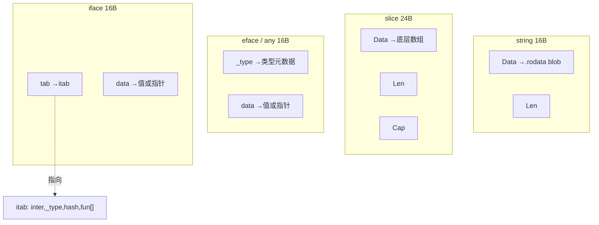
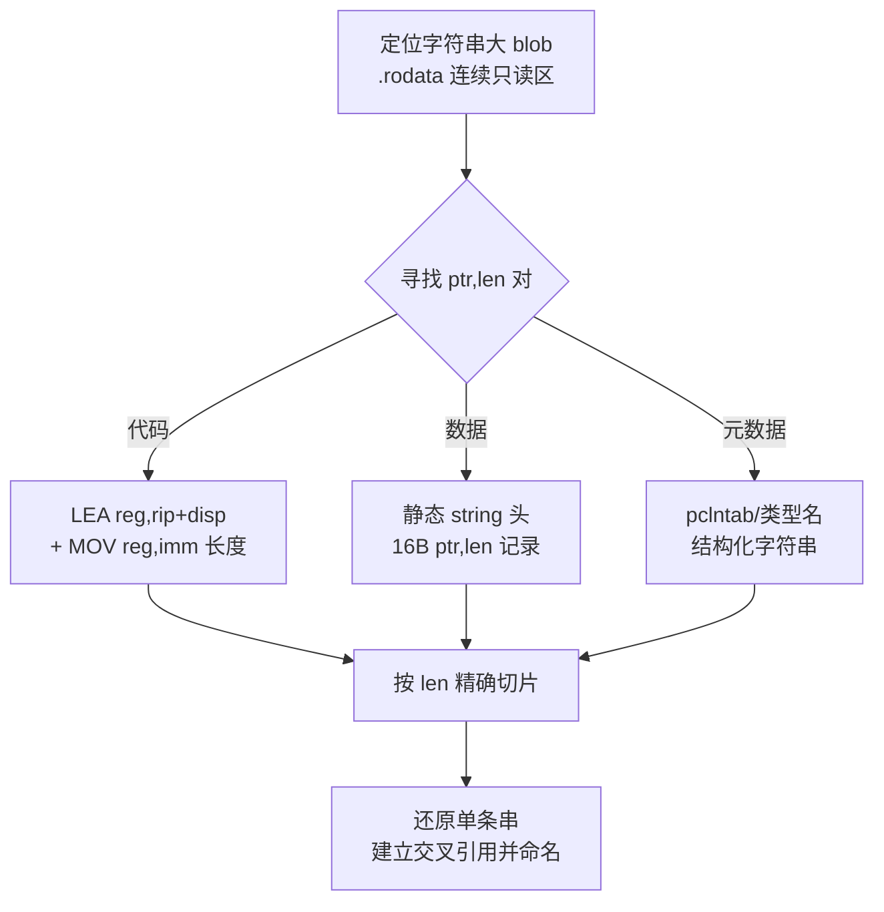
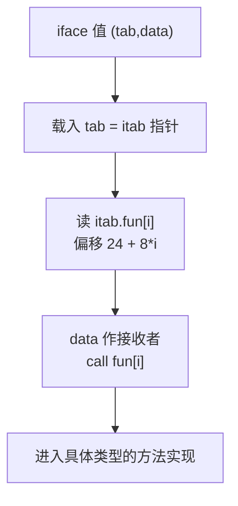
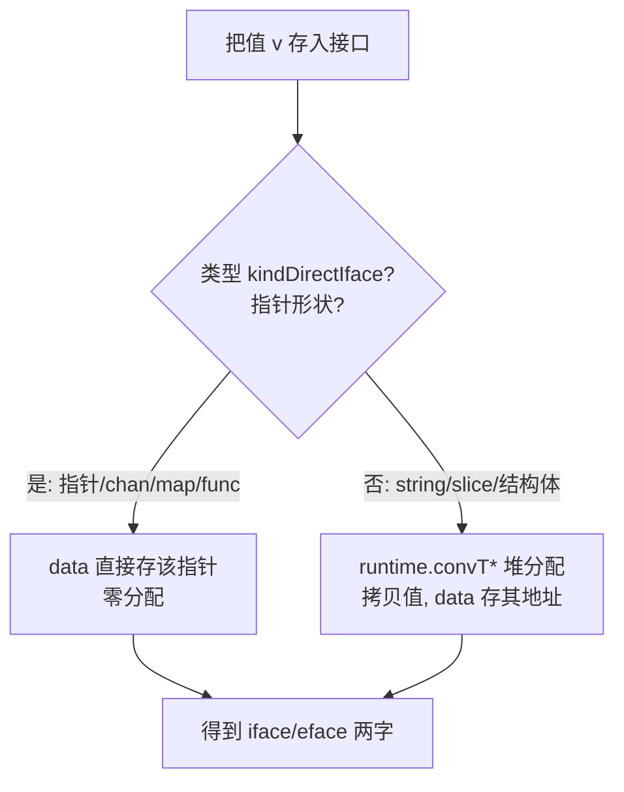

# Go与Rust现代二进制逆向（5）· Go字符串与切片与接口还原
> [!abstract] TL;DR
> - Go 的 string、slice、interface 都是**多字胖指针**：字符串 = (Data,Len) 两字、切片 = (Data,Len,Cap) 三字、接口 = (类型/itab, data) 两字；它们把「地址」和「元数据」绑在一起，正是 C 系逆向工具全面失灵的根因。
> - Go 字符串**无 NUL 终止符**、所有字面量被链接器拼成一整块只读大 blob 且相邻串无分隔，裸跑 `strings` 只能得到粘连的乱码流；正确还原必须靠 (ptr,len) 对——代码里的 `LEA+MOV(len)` 或数据里的 16 字节 string 头——按 len 精确切片。
> - 非空接口 iface 的分派表在 `itab.fun[]`，amd64 上第 i 个方法指针位于 `itab+24+8*i`；一个 itab 同时告诉你「接口名 + 具体类型名 + 各方法实现地址」，是批量命名函数的黄金杠杆。
> - `kindDirectIface` 决定 data 字直接存指针还是存堆上装箱值的地址；误判会让你把「值」当「指针」解引用，导致还原全错。
> - nil 接口（itab==nil）与「装了 nil 指针的接口」（itab!=nil,data==0）在二进制里清晰可辨——这既是著名 Go 陷阱，也是判断代码是否真做了判空的证据。
> - 安全边界：即便 `-ldflags "-s -w"` 剥掉符号，字符串 blob 与反射所需的类型元数据依然明文留存，Go 二进制天然比 C 泄露更多；真正硬化需 Garble 一类混淆（见第 8 篇）。

## 概述与定位

本系列前几篇已经把「宏观骨架」搭好：第 3 篇用 gopclntab 恢复了函数边界与符号名，第 4 篇恢复了类型系统元数据（`_type`、类型名、方法集）。有了函数和类型，下一步自然要问：**Go 程序里流动的「值」在寄存器和内存中长什么样？** 本篇聚焦三种最具 Go 特色、也最频繁出现的聚合值——字符串（string）、切片（slice）、接口（interface）——讲清它们的二进制布局、运行时机制，以及在逆向中如何把这些「胖指针」还原成有意义的语义。

之所以把这三者放在一篇，是因为它们共享同一个设计母题：**胖指针（fat pointer）**——一个逻辑上的「值」在机器层其实占据多个机器字，把「数据地址」和「随身元数据（长度/容量/类型/方法表）」捆绑在一起传递。这个母题一方面带来了内存安全、O(1) 子切片、动态分派等高级语义，另一方面直接击穿了所有面向 C 设计的逆向工具的假设：C 里字符串靠 NUL 终止、指针就是一个裸地址、函数调用地址在编译期固定，而 Go 全都不是这样。理解胖指针，是把 Go 反汇编从「一堆看不懂的双字加载」翻译回源码语义的关键一跳。

需要划清边界：本篇只讲**值的表示与还原**。goroutine、`g/m/p` 调度结构与运行时识别属于第 6 篇；GoReSym、IDA 脚本等工具的完整用法在第 7 篇展开，本篇只在实战小节点到；Garble 对字符串的加密混淆在第 8 篇专题对抗；Rust 的 `&str`/`&[T]`/`&dyn Trait` 虽同为胖指针，其静态 vtable 的还原留给第 11、13 篇，本篇仅做横向对照以突出 Go 的「运行时缓存式」分派与 Rust「编译期静态」分派的根本差异。字符串/切片作为函数参数如何落到寄存器，则承接 [[22.调用规约/06.SystemV_AMD64调用规约]] 与 [[23.C_C++运行时与ABI/01.运行时与ABI概览]] 的 ABI 知识。

## 原理与机制

### 胖指针家族：三种值的字级布局

Go 里这三种类型在 64 位平台的内存/寄存器布局如下（amd64，指针宽 8 字节）。字节布局用代码块表达最清楚：

```
string 头（16 字节，2 字）：
  +0   [8]  Data uintptr   → 指向 .rodata 字符串大 blob 内某处（只读）
  +8   [8]  Len  int       → 字节数（非字符数、无 NUL 终止符）

slice 头（24 字节，3 字）：
  +0   [8]  Data uintptr   → 指向底层数组（可读写数据段或堆）
  +8   [8]  Len  int       → 当前元素个数
  +16  [8]  Cap  int       → 底层数组容量

eface 空接口 any（16 字节，2 字）：
  +0   [8]  _type *_type        → 具体类型元数据（第 4 篇的 abi.Type）
  +8   [8]  data  unsafe.Pointer → 值本身（若指针形状）或堆上值的地址

iface 非空接口（16 字节，2 字）：
  +0   [8]  tab  *itab   → 接口↔具体类型的绑定+方法表
  +8   [8]  data unsafe.Pointer

itab（变长，随接口方法数增长）：
  +0   [8]  inter *interfacetype → 接口类型（含有序方法列表 mhdr）
  +8   [8]  _type *_type         → 具体类型
  +16  [4]  hash  uint32         → _type.hash 的拷贝，type switch 快速比较用
  +20  [4]  _     padding
  +24  [8]  fun[0]               → 第 0 个接口方法的具体实现地址（vtable 起点）
  +32  [8]  fun[1]
  ...   len(fun) == len(interfacetype.mhdr)
```

这套结构在 `runtime/runtime2.go` 里定义，多年稳定，是逆向时可以「按图索骥」的硬约束。



### 为什么是胖指针（why）

**字符串为什么带 Len 而不用终止符？** Go 追求两件事：内存安全的越界检查，和字符串不可变+可共享。带 Len 意味着运行时能对每次索引做边界判断；不可变+共享意味着 `s[2:5]` 这样的子串只需复制 16 字节头、让 Data 指向原 blob 内部、Len 设为 3，**零拷贝、O(1)**。作为副作用，字符串可以合法包含 `\x00` 字节，也不再需要在末尾塞终止符。代价是每个字符串值占两个字、按值传参时头被复制（底层字节共享）。

**切片为什么比字符串多一个 Cap？** 切片是可增长的可变视图。Len 是「现在有多少」，Cap 是「底层数组还能容纳多少而不重新分配」。`append` 在 Len<Cap 时就地写入并把 Len 加一，超出则 `runtime.growslice` 分配更大数组并搬迁。逆向时看到「读 +16 的 Cap、比较、条件跳转到一个 `growslice`/`makeslice` 调用」几乎就是 append 的指纹。

**接口为什么要分 iface 和 eface？** 空接口 `interface{}`（Go 1.18 起别名 `any`）没有方法，谈不上「方法表」，所以只需 (类型, 数据) 两字即可；而带方法的接口每次调用都要按方法名找到具体实现，若每次现算代价高昂，于是引入 itab 作为「(接口, 具体类型) → 方法指针数组」的**预计算缓存**。itab 里的 `fun[]` 就是 Go 版的虚表（vtable），按接口方法声明顺序排布具体实现地址，使一次接口调用退化为「取 fun[i]、间接 call」的 O(1) 操作。把两者分开，让 `any` 免去 itab 一层间接，也让类型断言/type switch 在 `any` 上直接比较 `_type` 指针即可。

**装箱与 staticuint64s。** 把一个 `int` 塞进 `any` 时，data 需要一个指针；Go 通过 `runtime.convT64` 在堆上放一份拷贝并返回其地址。为省掉小整数的分配，运行时预置了 `runtime.staticuint64s` 表缓存 0..255，装箱这些值时 data 直接指向该静态表——逆向中若见 `any` 的 data 指向一段递增的静态数组，多半就是它。

### ABI：胖指针如何进出寄存器

Go 1.17 起改用寄存器 ABI（ABIInternal），amd64 整型参数依次走 RAX、RBX、RCX、RDI、RSI、R8、R9、R10、R11。**一个字符串参数占两个连续 ABI 寄存器**（Data 一个、Len 一个），切片占三个，接口占两个。1.17 之前是 ABI0（纯栈传参），胖指针的各字被压到栈上连续槽位。这个版本差异直接决定了你在反汇编里认「串/切片/接口」的指纹形态，见下一节实战。

## 胖指针内存布局与接口分派详解

### 字符串定位：无终止符的世界

这是本篇的核心难点，也是「字符串定位」种子的展开。C 里 `strings` 工具靠「可打印字符跑到 NUL 结束」切串；Go 打破了每一条前提：

1. 链接器把**所有**字符串字面量拼进一整块（或少数几块）只读大 blob，常见符号 `go:string.*`，或直接并入 `.rodata`/`__rodata`。
2. 相邻字符串之间**没有任何分隔符**——`"hello"` 和 `"world"` 可能就是 `helloworld` 一串连着，边界只存在于别处的 Len 字段里。
3. 更狠的是链接器会做**去重与后缀共享**：`"errorfoo"` 和 `"foo"` 可能在 blob 里重叠，`"foo"` 的 Data 指向前者尾部，于是字节区间彼此嵌套。

后果是裸跑 `strings` 得到的是一条条巨长的粘连流，长度信息又不在其中，逆向者拿到的是「一大坨看不出边界的字节」。正确还原有三条路：

**A. 引用驱动（最可靠）。** 每一个 (ptr,len) 对精确框定一条字符串。来源有二：
- **代码中**：编译器用 `LEA reg, [rip+disp]` 算出指向 blob 内部的指针，配一条 `MOV reg, imm` 载入长度立即数。反汇编器能解出 LEA 目标地址，立即数就是长度，切出恰好 len 字节即得该串。
- **数据中**：静态初始化的字符串头（全局变量初值、错误表、map 字面量等）在 `.data`/`.rodata` 里表现为一条条 16 字节的 (ptr,len) 记录。扫描「8 字节值落在 blob 地址范围内、紧跟 8 字节合理长度」的模式即可批量提取。

**B. blob 边界 + 启发式。** 先定出 blob 的 [start,end)，则全二进制里任何落入该范围的指针都是字符串 Data；收集所有 (ptr,len) 候选、排序合并，能覆盖引用驱动漏掉的部分。

**C. pclntab/类型元数据辅助。** 包路径、类型名、方法名等字符串可由 moduledata 与类型元数据（第 4 篇）直接可达，新版 GoReSym 能顺着这条链恢复一批「结构化字符串」。



**陷阱清单**：同一长度立即数会被多处复用，别假设 (ptr,len) 一一对应；LEA 目标可能只是基址、真实指针要再加索引；后缀共享导致字节区间嵌套，切片时要接受「一条串是另一条的子串」；寄存器 ABI 与栈 ABI 的指令形态不同（下述）；Garble 会把串加密、运行时才解密，静态 (ptr,len) 恢复到此失效（第 8 篇）。

### 切片还原：底层数组在哪

切片的三字头本身好认，难在定位并解读底层数组。`make([]T,n)` 会调 `runtime.makeslice`（返回 Data 指针，Len/Cap 由调用方在寄存器/栈上组装）；切片字面量 `[]int{1,2,3}` 则由编译器在 `.rodata`/`.data` 里铺一个后备数组，再就地组装指向它的三字头。区分切片头与字符串头：切片多了 +16 的 Cap，且元素类型经由构造它的 `makeslice`/类型元数据可查（元素大小 = Cap 覆盖的字节 ÷ Cap）。看到「读 +8 Len、读 +16 Cap、比较后跳去 growslice」是 `append`；看到 `runtime.slicebytetostring`/`stringtoslicebyte` 则是 `string`↔`[]byte` 转换——注意这类转换**可能拷贝**（因 string 不可变而 []byte 可变），逆向时别把两侧的 Data 当成同一块。

### 接口分派：itab 与虚表

非空接口的每次方法调用都要「取具体实现、间接 call」。itab 把这件事预计算好：`inter` 记住是哪个接口，`_type` 记住是哪个具体类型，`fun[]` 按接口方法**声明顺序**排好各具体实现地址。运行时首次需要某个 (接口,类型) 组合时，`runtime.getitab` 在全局哈希表 `itabTable` 里查/建 itab 并缓存，此后复用。

amd64 上一次接口方法调用的典型指纹是：

```
mov  rax, [rcx+0]        ; 取 iface.tab = itab 指针（data 在 [rcx+8]）
mov  rdx, [rax+24+8*i]   ; 取 itab.fun[i]，偏移 24 起、每项 8 字节
mov  rdi, [rcx+8]        ; data 作为接收者（寄存器 ABI 下入 RAX/RBX...）
call rdx                 ; 间接调用具体实现
```

关键就是那个 **`+24+8*i`**：认出「从某指针 +24 及以上、8 的倍数偏移处取值再 call」，基本可判定为接口分派，i 即方法在接口里的序号。



**itab 是逆向的黄金杠杆**：拿到一个 itab，你同时得到「接口名（顺 inter→interfacetype 的类型名）+ 具体类型名（顺 _type）+ 每个方法的实现地址（fun[]）」。也就是说，一个 itab 能让你一次性给若干匿名函数命名为 `具体类型.方法名`。链接器常给出 `go:itab.<具体类型>,<接口>` 符号（旧式 `go.itab.*main.myType,fmt.Stringer`），第 4 篇的类型恢复 + 本篇的 itab 解析结合，能把一大片间接调用点翻译回清晰的方法调用图。

### 直接接口 vs 装箱：data 字到底是什么

data 字的语义并不唯一，取决于具体类型是否带 `kindDirectIface` 标志（即「指针形状」：本身是指针，或只含单个指针形状字段的结构体/数组）。指针、chan、map、func 都是指针形状，装进接口时 **data 直接存放该指针，无需分配**；而 string（两字）、slice（三字）、普通结构体等**非**指针形状，需 `runtime.convT*` 在堆上拷一份、data 存其地址（装箱）。



这对逆向至关重要：**误判会让你把「值」当「指针」去解引用，还原全盘错误**。判断依据是 `_type` 的 kind 标志位（第 4 篇），或看装箱点是否出现 `convT64/convTstring/convTslice/convTnoptr` 一类调用——出现即为装箱、data 是堆地址；直连则无这类调用、data 就是值。

### nil 的两副面孔与类型断言

Go 著名陷阱在二进制里一览无余：**nil 接口** itab（或 eface 的 _type）为 0、data 为 0；而**「装了一个 nil 指针的接口」** itab 非 0（因为具体类型已定）、data 为 0。`if err != nil` 编译成「比较接口第一个字是否为 0」——所以一个非 nil 类型的 nil 指针塞进 `error` 接口会让判空为真却调用崩溃。逆向时看第一字的比较即可判断代码判的是「接口空」而非「值空」，这既是理解逻辑的钥匙，也是定位这类经典 bug 的线索。

类型断言 `v.(T)` 与 type switch 走 `runtime.assertI2T`/`assertE2I`/`assertI2I`（旧）或新版的 `runtime.typeAssert`（带 itab 缓存）；type switch 先用 `itab.hash`/`_type.hash` 快速筛，再精确比较类型指针。识别这些运行时辅助函数名依赖第 3 篇的符号恢复——没有 pclntab，你看到的只是一串 `runtime.*` 空名。

### 寄存器 ABI vs 栈 ABI 的形态差异

同一段「传字符串」的源码，1.17+ 会把 Data、Len 放进两个连续 ABI 寄存器（如 RAX、RBX），1.16- 则压到栈上两个连续 8 字节槽位。切片是三个、接口两个，依此类推。逆向早期版本 Go（或交叉编译的老目标）时，别用寄存器 ABI 的指纹去套，否则会漏认参数。判断 Go 版本可借 buildinfo / runtime.buildVersion 字符串（也在 blob 里，可用本篇方法先捞出来）。

## 工具视角与实战

**GoReSym（Mandiant）** 是首选：它恢复 pclntab、moduledata、类型元数据与 `go:itab.*`、类型名等符号，为字符串的「元数据辅助」路径和 itab 解析打底。**IDA** 侧常用 `golang_loader_assist`、`IDAGolangHelper` 一类脚本：自动识别 gopclntab、命名函数，并可扩展扫描 `LEA+MOV(len)` 还原字符串、按 `+24+8*i` 识别接口调用。**Ghidra** 有 `GolangAnalyzerExtension`，能解析 Go 元数据与字符串。**redress** 是 Go 专用还原器，能列出包、类型、字符串。

一套顺手的实战流程：① 先用 GoReSym/loader 脚本恢复符号与类型（第 3、4 篇）；② 定位字符串 blob 边界，跑「引用驱动 + blob 启发式」还原字符串并回填交叉引用命名；③ 枚举 itab/`go:itab.*`，解出「接口+具体类型+fun[]」，把 fun[] 指向的匿名函数批量命名为 `类型.方法`；④ 在反汇编里按 `+24+8*i` 指纹标注接口分派点，结合 itab 把间接调用连成方法调用图；⑤ 认 `convT*`/`makeslice`/`growslice`/`slicebytetostring` 等运行时辅助，还原装箱、make、append、串↔字节转换的语义。需要提醒的是，若目标经 **Garble** 处理，字符串多半被加密、运行时解密，静态还原到此为止，得转入动态或反混淆（第 8 篇）。

一个可脚本化的字符串扫描要点（伪代码级）：对每条 `LEA reg,[rip+disp]`，若 `disp` 解出的绝对地址落在 blob 范围内，回溯或前瞻近邻指令找配套的 `MOV reg2,imm`，以 imm 为长度切片；同时独立扫 `.data`/`.rodata` 的 16 字节 (ptr∈blob, 合理 len) 记录。两路结果合并去重，即得高质量字符串表。

## 安全性与正确使用

本篇机制对攻防双方都有直接影响。**对分析者（正当用途）**：字符串还原能直接暴露 Go 恶意样本里的 C2 地址、配置、命令开关、能力清单（见 [[50.恶意代码分析与免杀对抗/00.恶意代码分析与免杀对抗总览]]）；itab/类型还原则暴露样本的接口行为与具体实现，是能力研判的高价值证据。正确使用意味着把这些还原结果用于分析、检测与归因，而非武器化。

**误用与解读风险**：字符串若切错边界（长度取错、后缀共享未识别），会得到「拼接错位」的假串，可能造成错误的 IOC 与错误归因——务必用交叉引用交叉验证，别信单一启发式。直接接口/装箱若判反（把 data 当指针解引用，或反之），整条数据流还原都会错。nil 接口 vs 装 nil 指针的两副面孔若混淆，会误判「代码是否真的做了判空」，进而对漏洞可达性下错结论。

**对开发者/防守方（加固边界）**：Go 二进制天然比 C 泄露更多。即便加 `-ldflags "-s -w"` 剥掉符号表与调试信息，**字符串 blob 依然明文留存**（程序运行需要），**反射与接口所需的类型元数据也无法剥除**（`reflect`、type switch、`fmt` 的 `%v` 都依赖它）。也就是说，把密钥、内网地址、算法参数硬编码进 Go 字符串，等于放在 `.rodata` 里任人 `strings`。若确有隐藏需求，应：敏感数据不入明文字符串（改为运行时派生/外部注入）；对确需隐藏的部分用 Garble 一类工具做字符串加密与符号混淆（第 8 篇），但要清楚这是提高成本而非绝对安全——运行时终究要解密，动态分析仍可拿到。反过来，正因反射依赖，Go 无法像 C 那样把元数据剥个干净，这是 Go 二进制信息泄露的**结构性边界**，加固时必须把它纳入威胁模型。

## 小结

三种最具 Go 特色的值——字符串、切片、接口——共享「胖指针」母题：把数据地址与随身元数据（长度/容量/类型/方法表）捆绑传递，从而击穿了 C 系工具的全部假设。还原它们各有专属杠杆：字符串靠 (ptr,len) 对在无终止符的大 blob 里精确切片；切片靠三字头与 makeslice/growslice/append 指纹定位底层数组；接口靠 itab 一次拿全「接口名+类型名+fun[] 方法表」，并用 `+24+8*i` 认出分派点、用 `kindDirectIface` 判断 data 是值还是指针。掌握这些，Go 反汇编里那些「看不懂的双字加载与间接调用」就能翻译回可读的源码语义。本篇承接第 3、4 篇的符号与类型恢复，向下衔接第 6 篇的运行时/调度识别与第 7 篇的工具化落地；对抗混淆则见第 8 篇。Rust 的 `&str`/`&[T]`/`&dyn Trait` 同为胖指针但走静态 vtable，对照见第 11、13 篇。

## 相关阅读

- 官方与经典文献：
  - Go 源码 `runtime/runtime2.go`（`iface`、`eface`、`itab` 定义）；`cmd/compile/abi-internal.md`（寄存器 ABI 规范）。
  - Go 官方博客：*Go Slices: usage and internals*；*Strings, bytes, runes and characters in Go*。
  - Russ Cox：*Go Data Structures: Interfaces*（research.swtch.com/interfaces，itab/fun[] 分派的权威解读）。
  - `reflect.StringHeader` / `reflect.SliceHeader`（1.20 起建议改用 `unsafe.String`/`unsafe.Slice`）文档。
- 同系列：
  - [[03.gopclntab与函数符号恢复]]（符号恢复是识别 runtime.conv*/assert* 等辅助函数的前提）
  - [[04.Go类型系统元数据恢复]]（_type/interfacetype/kind 标志，判断装箱与还原类型名）
  - [[06.Goroutine调度与运行时识别]]、[[07.Go逆向工具：GoReSym与IDA脚本]]、[[08.Go混淆对抗：Garble]]
  - [[13.Rust-trait对象与vtable还原]]（Rust 静态 vtable 与 Go 运行时 itab 的对照）
- ABI 与运行时基础：[[23.C_C++运行时与ABI/01.运行时与ABI概览]]、[[22.调用规约/06.SystemV_AMD64调用规约]]
- iOS 同族对照：[[36.Objective-C与iOS运行时/01.Objective-C运行时概览]]（Swift/ObjC 元数据可与 Go 类型元数据对读）
- 应用场景：[[50.恶意代码分析与免杀对抗/00.恶意代码分析与免杀对抗总览]]（Go/Rust 恶意样本的字符串与接口还原实战）

[[00.Go与Rust现代二进制逆向总览|⬆ 系列总览]] | [[04.Go类型系统元数据恢复|← 上一章]] | [[06.Goroutine调度与运行时识别|→ 下一章]]