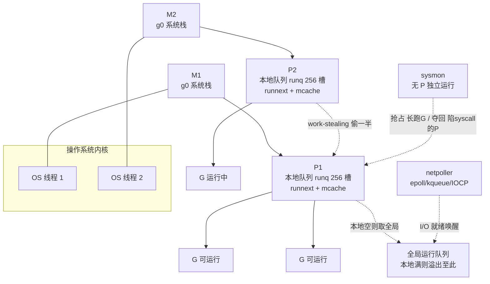
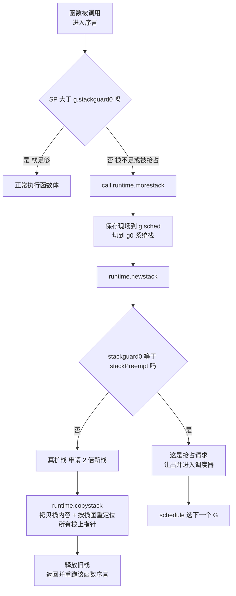
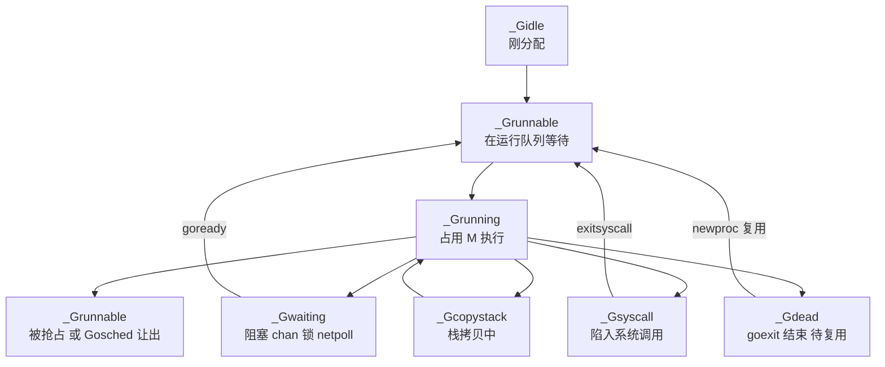
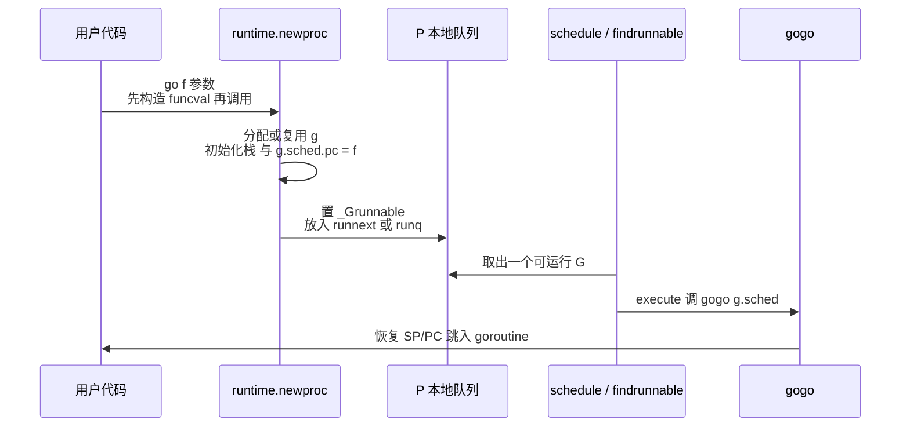

# Go与Rust现代二进制逆向（6）· Goroutine调度与运行时识别
> [!abstract] TL;DR
> - Go 把 M∶P∶G 三层调度器、GC、分配器整体**静态链接**进每个二进制，运行时代码量常数倍于业务代码；先把 runtime 认出来、和用户代码切开，是 Go 逆向真正的地基。
> - 几乎每个 Go 函数序言都有「取 g → 比较 SP 与 g.stackguard0 → 不足则 call morestack」的栈检查，这段**固定模式是定位 Go 函数、判定架构与编译版本的万能指纹**，即使符号被剥也在。
> - g 指针取法随版本/架构而变：1.17 前从 TLS 现取（linux/amd64 走 `FS:[-8]`），1.17 regabi 后常驻 **R14**（arm64 一直在 **R28**），据此可反推编译期与目标平台。
> - 栈用「连续栈 + 整体拷贝」增长：`morestack → newstack → copystack`，靠**精确栈图**重定位每个栈上指针；把 `stackguard0` 写成哨兵值 `stackPreempt(0x…fade)` 就复用同一检查点实现**协作式抢占**。
> - `runtime.newproc` 是每条 `go` 语句的落点，定位它即可还原 goroutine 生成图；1.17 起参数改由**闭包捕获**、调用形态随之变化，识别时必须先钉住版本。

## 概述与定位

要理解 Go 逆向为什么绕不开运行时，先看一个数字：一个只 `print("hello")` 的 Go 程序，去符号后仍有约 2MB、上千个函数。原因是 Go 不像 C 那样在运行期动态链接一个「已知的」libc，而是把**整个 runtime**——调度器、垃圾回收、内存分配器、goroutine 机制、反射支持——在编译期整体塞进可执行文件，并与用户代码深度交织。于是逆向 Go 的第一道、也是最难的一道工序往往不是分析逻辑，而是**分诊（triage）**：哪些函数是运行时样板（可忽略），哪些才是业务逻辑（要精读）。

本篇在系列中的位置很明确。第 02 篇讲了二进制整体结构与 `moduledata`，第 03 篇用 `gopclntab` 恢复了函数名，第 04、05 篇恢复了类型元数据与字符串/切片/接口这些数据形态。到这里，数据与符号层面的地基已经打好，**本篇转而攻打运行时本身**，聚焦两块最具「指纹价值」的机制：**GMP 调度模型**与**栈增长机制**。选这两块是因为：其一，栈检查序言几乎印在每一个函数头上，是判定「这是不是 Go、是哪个版本的 Go」的最强锚点，哪怕 `pclntab` 被混淆器抹掉也依然可用；其二，看懂 goroutine 的诞生（`newproc`）与同步阻塞（park/ready、chan、select、netpoll），才能还原目标的**并发架构**——这对使用大量 goroutine 做 C2 心跳、并行扫描、任务分发的 Go 恶意样本至关重要。

把「运行时识别」的收益说具体些：判定「这是 Go 且版本为 X」，就能选对结构体布局、调用约定与符号恢复策略；把运行时与用户代码切开，能把需要精读的函数面缩掉九成；顺着 `newproc` 的调用点，能画出 goroutine 生成图进而推断行为；而当对手用 Garble（第 08 篇）之类工具剥掉名字、打乱 `pclntab` 时，序言指纹与 g 访问模式往往成了**唯一可靠的落脚点**。因此本篇既是「原理科普」，也是后续工具篇（第 07 篇 GoReSym/IDA 脚本）的机制底座——工具能自动化的一切，本质都建立在下文这些不变量之上。

## 原理与机制

### GMP：为什么是三层而不是两层

Go 的调度核心是 G、M、P 三种对象：

- **G（goroutine）**：一个 `g` 结构体，持有自己的栈、保存的执行上下文（`gobuf`）与状态。极轻，起始栈仅约 2KB，可存在上百万个。
- **M（machine）**：一条真正的 OS 线程，是「干活的手」。每个 M 自带一个 `g0`——用大号系统栈运行调度器与运行时代码的特殊 goroutine。
- **P（processor）**：**运行 Go 代码的许可证与调度上下文**，数量为 `GOMAXPROCS`。它持有一个本地运行队列和一个 `mcache`（每-P 无锁内存缓存）。

关键问题：为什么不直接「goroutine 跑在线程上」的两层模型，非要插一层 P？因为 P 把「有多少条 OS 线程」和「能并行跑多少 Go 代码」**解耦**了。并行度被 P 的数量钉死在 `GOMAXPROCS`，与线程多寡无关；而线程数可以临时超过 P——当某个 M 陷入阻塞系统调用时，它会把自己手里的 P 交出去给另一个 M 接着跑，别的 goroutine 就不会被这一次阻塞拖住。这正是对 M∶N 调度（M 个 goroutine 复用 N 条线程）与 C10K 问题的解法：用户态切换极廉价、并行度有界可控、还能靠 work-stealing 做负载均衡。同时 P 携带的本地队列与 `mcache` 让「取下一个 goroutine」和「小对象分配」在绝大多数时候**无需加锁**，这是 Go 高并发吞吐的结构性来源。



### 调度循环与必须认识的运行时词汇

一个「M + P」的组合反复执行调度循环：`schedule()` 调 `findrunnable()` 选出一个可运行的 G——依次看 P 的 `runnext` 槽、P 本地队列、全局队列、netpoller，最后从别的 P **偷取一半**——然后 `execute(gp)` 调 `gogo(&gp.sched)`，用汇编恢复 SP/PC 跳进该 goroutine。当 goroutine 因 channel、锁、I/O 阻塞时，它会调 `gopark`，经 `mcall(park_m)` 切回 `g0` 栈重新进入 `schedule()`；跑完则 `goexit` 回到调度器。

逆向时必须能一眼认出的运行时函数（它们是 Go 并发的「关键词」）：`runtime.newproc`（每条 `go` 语句创建 goroutine）、`runtime.mcall` / `runtime.systemstack`（切到 g0 栈跑调度器代码）、`runtime.gogo`（汇编级切入 goroutine）、`runtime.morestack` / `morestack_noctxt`（序言里被调用的扩栈跳板）、`runtime.newstack`（判定扩栈还是抢占）、`runtime.gopark` / `goready`（阻塞/唤醒）、`runtime.schedule` / `findrunnable`（主循环）。

### 抢占：把栈检查点当成让出闸门

Go 的抢占分两代，都值得逆向者理解：

- **协作式抢占（所有版本）**：运行时把目标 G 的 `g.stackguard0` 改写成哨兵值 `stackPreempt`（64 位下为 `0xfffffffffffffade`，尾字 `fade` 是它的记忆点）。这样该 goroutine 下一次进函数、序言做栈检查时必然「失败」，落入 `morestack → newstack`，`newstack` 发现是哨兵而非真的栈不足，就转去让出、重新调度。**用同一套栈检查机器复用出抢占能力**，设计极省。局限也在此：一段没有函数调用的紧密循环没有序言、永不检查，就抢不动它——Go 1.14 之前这会让 GC 的 STW 或调度被一个死循环卡住。
- **异步抢占（Go 1.14+）**：`sysmon` 发现某 G 跑太久，就发 `SIGURG` 信号，处理器 `runtime.asyncPreempt` 在**任意一条指令处**打断它并让出。代价是运行时必须在**每个 PC 处**都备好寄存器/栈图——这正是现代 Go 二进制元数据更胖的原因之一，也顺带服务了精确 GC。

`sysmon` 是一条不占 P、独立运行的监控 M，负责：抢占长跑 goroutine、夺回陷在长系统调用里的 P、驱动 netpoller、以及强制触发 GC。

## 结构与算法详解：g/m/p 布局、栈增长与运行时指纹

这一节是本篇的重心。上面讲的机制，落到二进制里就是几组**固定的内存偏移**和**固定的指令模式**——它们才是逆向真正能抓住的东西。

### g / m / p 的内存布局与稳定偏移

`g` 结构体的头部在各版本间高度稳定，也是指纹价值最高的部分（linux/amd64 视角，偏移十六进制）：

```
type g struct {
    stack        stack   // +0x00  {lo, hi} 共 16 字节，栈的上下界
    stackguard0  uintptr // +0x10  ← 栈溢出检查基准；可被写成 stackPreempt 触发抢占
    stackguard1  uintptr // +0x18  g0 / 信号栈用
    _panic       *_panic // +0x20
    _defer       *_defer // +0x28
    m            *m      // +0x30  ← 当前绑定的 M
    sched        gobuf   // +0x38  保存的执行上下文（下详），48+ 字节
    ...                  //        syscallsp/pc、param、atomicstatus、goid… 之后偏移随版本浮动
}
```

要牢记三个偏移：`stackguard0 = 0x10`（栈检查读它）、`m = 0x30`（从当前 g 找回 M）、`sched = 0x38`（切换现场存这里）。它们稳定的根因是：`stack` 恒为两个字（lo、hi），`stackguard0` 紧随其后，编译器生成的序言硬编码了 `0x10` 这个偏移，改了它整个栈增长机制就崩，所以 Go 团队多年不动它。逆向时的实操是：**先找到 `morestack`、确认序言读的偏移是 `0x10`，就锁定了 `stackguard0` 的位置，再顺藤摸出其余字段**。而 `sched` 指向的 `gobuf` 是「上下文快照」：

```
type gobuf struct {
    sp   uintptr        // +0x00 栈指针
    pc   uintptr        // +0x08 程序计数器：恢复执行处
    g    guintptr       // +0x10 反指回自己的 g
    ctxt unsafe.Pointer // +0x18 闭包上下文，GC 可见
    ret  uintptr        // +0x20 返回值暂存
    lr   uintptr        // +0x28 链接寄存器（arm 等有）
    bp   uintptr        // +0x30 帧基址（开启 framepointer 时）
}
```

`m` 与 `p` 的头部同样有用。`m` 开头是 `g0`（系统栈 goroutine），随后是 `morebuf`（morestack 专用 gobuf），还有 `curg`（当前用户 goroutine）、`p`（绑定的 P）、`tls`（线程本地存储槽，g 就藏在这）。`p` 里最有辨识度的是**固定 256 槽的本地运行队列** `runq [256]guintptr` 加一个 `runnext`（下一个优先运行的 G），以及每-P 的 `mcache`。本地队列满 256 就把一半溢出到全局队列——这个「256」是识别 P 结构的好特征。

### 函数序言与栈检查：Go 函数的万能指纹

这是全篇最实用的一点。因为 goroutine 栈是**按需增长**的，编译器在几乎每个函数入口插入一段栈检查：取到当前 g，比较栈指针 SP 与 `g.stackguard0`，若栈快不够就跳去调 `morestack` 扩栈再重来。这段模式在二进制里高度规整，是**枚举所有 Go 函数、判定架构与版本**的通用签名。它随时代分成两套。

Go 1.17（regabi 之前）·linux/amd64，g 每次从 TLS 现取：

```
MOV  RCX, FS:[-8]        ; 64 48 8B 0C 25 F8 FF FF FF   取 g（FS 段负偏移）
CMP  RSP, [RCX+0x10]     ; 48 3B 61 10                  SP 对比 g.stackguard0
JBE  grow               ; 76 xx                          栈不足则跳
...函数体...
grow:
    CALL runtime.morestack_noctxt
    JMP  函数入口                                        扩栈后从头重跑
```

Go 1.17+（regabi）·amd64，g 常驻 **R14**，序言短得多：

```
CMP  RSP, [R14+0x10]     ; 49 3B 66 10
JBE  grow
```

要读懂它，几个「为什么」很关键。**其一，为什么把扩栈调用放在函数末尾再跳回**：栈不足是极少数路径，把 `CALL morestack; JMP entry` 放到函数尾部，热路径上只留一条 `CMP` + 一条不跳的 `JBE`，省代码、护流水线。**其二，为什么大帧函数序言不一样**：如果帧比栈保护余量（`StackSmall`，128 字节）还大，简单比 SP 不够，编译器会先 `LEA RAX, [RSP - 帧大小]` 算出「用完后的栈顶」再与 `stackguard0` 比，甚至处理回绕；所以真实序言有 `CMP RSP,[R14+0x10]` 和 `LEA…; CMP RAX,…` 等变体。**其三，注意反例**：标了 `//go:nosplit` 的底层运行时函数**没有序言**，`morestack` 自己也没有——所以「没有序言」绝不等于「不是 Go 函数」。**其四，跨平台差异**：arm64 上 g 恒在 **R28**、无 TLS 加载，序言是从 g 寄存器读 `stackguard0` 再比 SP；Windows/amd64 走 `GS` 里的 TLS 槽，字节模式又不同。这些差异反过来成了**判定目标 OS/架构/版本**的线索：看到 `64 48 8B 0C 25` 就知道是 pre-regabi 的 linux/amd64，看到 `49 3B 66 10` 就知道是 1.17+ 的 regabi。

### 栈增长全流程：morestack → newstack → copystack

顺着序言里那一跳，完整看栈是怎么长大的。这套「连续栈 + 整体拷贝」是 Go 1.4 才定型的，之前用的是**分段栈**（segmented stack）：栈由多段链起来，函数调用踩到段边界就分配新段、返回时释放。分段栈有个致命的**热分裂（hot split）**问题——若一个循环恰好卡在段边界反复调用同一函数，就会疯狂地分配/释放段，性能断崖。Go 1.4 改成拷贝式连续栈，一劳永逸。



分步讲清楚：序言发现不够，`CALL morestack`；`morestack` 把当前寄存器现场存进 `g.sched`，切到 `g0` 系统栈，调 `newstack`。`newstack` 先看 `stackguard0` 是不是哨兵 `stackPreempt`——是就转抢占让出；不是就真扩栈：申请**两倍**大的新栈，交给 `copystack` 把旧栈内容整块拷过去。这里有个精妙点：栈一旦搬家，所有**指向栈内的指针**都得改指向新地址。Go 靠编译期为每个函数生成的**精确栈图（stack map，存在 pclntab/funcdata 里）**，准确找出栈帧中每个指针槽并逐个重定位，所以拷贝是安全的——这也解释了为什么 Go 必须搞精确 GC、为什么它的元数据这么全。拷完释放旧栈，返回后**从头重跑那个函数序言**，这次栈够了就放行。GC 时若发现栈用得太满，还会反向**缩栈**。

几个边界与失败模式：初始栈现代 Go 约 **2KB**（`_StackMin = 2048`），Go 1.19 起可按历史平均**自适应**放大初始尺寸以减少早期扩栈，早期版本用过 4KB/8KB。栈有上限，64 位默认约 **1GB**（`maxstacksize`），无限递归或超大帧撞上限会 `fatal error: goroutine stack exceeds 1000000000-byte limit` 直接崩。因为扩栈会移动栈，任何缓存了栈地址的裸指针都可能失效——这正是 cgo 交互、汇编手写代码要格外小心的雷区。

### 上下文切换：gogo / mcall / systemstack 为什么廉价

goroutine 切换全在用户态，靠 `gobuf` 存取实现，**不进内核**。`gogo(&gp.sched)` 从 gobuf 恢复 SP、PC、g 然后 `JMP` 进去；`mcall(fn)` 反过来，把当前 g 的现场存进 `g.sched`、切到 `g0` 栈、以当前 g 为参调 `fn`（调度器代码在系统栈上跑，不会撑大用户栈）；`systemstack(fn)` 临时切到 g0 跑完 `fn` 再切回。对比一下就懂它为何快：pthread 上下文切换要陷内核、刷 TLB、走调度器，量级是微秒；goroutine 切换只是存取几个寄存器，量级是几十纳秒。**这就是「goroutine 廉价」的机器级根源**，也是逆向时区分「用户态协作切换」与「真·线程切换」的判据。

### goroutine 状态机与调度接触面

`g.atomicstatus` 记录状态，配合可叠加的 `_Gscan` 位（GC 扫描中）。识别状态转移能帮你在动态调试里读懂一个 goroutine 此刻在干嘛。



阻塞点就是调度器的接触面，也是逆向还原并发结构的抓手：channel 收发落到 `runtime.chansend` / `chanrecv`，`select` 落到 `runtime.selectgo`，它们要挂起就调 `gopark`（置 `_Gwaiting`）、被唤醒就 `goready`；网络与定时 I/O 交给 **netpoller**（底层 epoll/kqueue/IOCP），goroutine 挂起等 I/O、就绪时被 netpoller 塞回运行队列——这就是「几条线程扛百万连接」的秘密。系统调用走 `entersyscall`/`exitsyscall`：进 `_Gsyscall` 时可能**把 P 交给别的 M** 继续跑其他 goroutine，回来再重新抢 P，所以一次阻塞 read 不会冻住整个程序。逆向时看到这些调用密集出现，基本能拼出目标的同步拓扑。

下面这张时序图收束「一条 `go` 语句到底发生了什么」：



这里藏着一个**必须钉版本**的坑：`newproc` 的签名变过。1.17 之前是 `newproc(siz int32, fn *funcval)`，`go f(a,b)` 会把参数大小和实参压栈跟在 `fn` 后；1.17 regabi 之后变成 `newproc(fn *funcval)`，实参改由编译器生成的**闭包**捕获。逆向时若拿旧模型去套新二进制，会把闭包结构误读成参数，得出错误结论——所以看 `newproc` 调用点前，先用下节的方法把版本定死。

## 工具视角与实战

**静态识别的主线**：用 IDA/Ghidra 脚本按序言字节模式全盘扫描，即使去符号也能枚举出所有 Go 函数——判据不是单条 `CMP`（假阳性太多），而是「`CMP SP,[g+0x10]` → `JBE` → 尾部 `CALL morestack` → `JMP` 回入口」这**一整组三段式**。函数枚举出来后，交叉引用所有 `runtime.newproc` 的调用点，就得到 goroutine 的入口函数集合，进而画并发图；有 `pclntab`（第 03 篇）就直接拿名字，被剥了就靠这些结构指纹。第 07 篇要讲的 **GoReSym** 正是把「找 moduledata、还原 pclntab、恢复运行时符号」这套流程自动化的工具。

**定版本、定平台的套路**：先找 `runtime.buildVersion` 字符串（形如 `go1.21.3`）——最直接；没有就看能力位——存在 `asyncPreempt` 说明 ≥1.14，序言用 R14 说明 ≥1.17（regabi），有自适应初始栈说明 ≥1.19 左右。平台则看 g 的取法：`FS:[-8]`（linux/amd64 pre-regabi）、`R14`（amd64 regabi）、`R28`（arm64）、`GS` 槽（Windows）。版本一钉死，`g`/`m`/`p` 的字段偏移、`newproc` 签名、ABI 就都能对上。

**动态分析**：Delve（`dlv`）是首选，`goroutines` 列出全部 goroutine、`goroutine N stack` 看某个的调用栈、`grs` 切换；也能读 `runtime.allgs` 遍历所有 g、读全局 `schedt` 与每-P 的 `runq` 观察调度实况。用 gdb 配 Go 官方 runtime 脚本，或直接在 amd64 regabi 目标上**读 R14 拿到当前 goroutine 的 g 指针**，再按上面的偏移解 `stackguard0`/`m`/`goid`，是很硬核但很可靠的一招。

**一条可复用的分诊流程**：1) 确认是 Go 并定版本；2) 定位/恢复 `pclntab` 拿函数名；3) 序言扫描枚举全部函数；4) 交叉引用 `newproc` 得 goroutine 生成图；5) 找 chan/select/锁/netpoll 调用还原并发模型；6) 把精力收敛到用户 goroutine 的入口函数上。注意签名的现实噪声：SIB 变体、大帧的 `LEA` 变体、`nosplit` 无序言、以及混淆带来的偏差，都要在写规则时留冗余。也要知道：Garble（第 08 篇）能抹名字、动 `pclntab`，但**动不了调度器与栈增长机制本身**，序言指纹和 GMP 结构照样在——想「藏住这是个 Go 程序」基本做不到。

## 安全性与正确使用

**机制的安全含义是双刃的**。防御侧（AV/EDR、威胁情报）正是靠这些运行时指纹来判定「这是 Go 恶意样本、版本 X、疑似某家族」——常见做法是拿序言字节模式加 `runtime.buildVersion` 写 YARA 规则。攻击侧的混淆器则试图抹掉 `pclntab`、扰动符号，但若去动序言或栈检查逻辑本身，稍有不慎就会破坏栈增长导致样本自己崩溃，因此这条不变量在实战里极难被真正抹除——这对防御者是好消息。

**分析正确性上的几个坑必须守住**。第一，**偏移是版本相关的**：拿错版本的字段偏移去解 `g`，会把 `m`、`goid`、`atomicstatus` 全读偏，得出完全错误的结论——所以「先定版本再解结构」不是建议而是纪律。第二，**序言模式有假阳性**：任何含类似 `CMP SP, mem` 的函数都可能撞上，必须用「`JBE` → `morestack` → 跳回入口」的三段式共同确认，单模式匹配不可信。第三，**`nosplit` 无序言不代表不是 Go**：大量底层运行时函数、`morestack` 自己都没有序言，别据此误判边界。第四，也是最重要的认知边界：**序言指纹只能判定语言与版本，判定不了意图**——它印在每一个 Go 程序上，绝不能把「检出 Go 序言」当作恶意证据，运行时识别做的是分类（language/version），不是定性（intent）。

**加固与正确使用的边界**给两类人。给做检测的防御者：规则要押在**稳定不变量**上（`stackguard0` 恒在 `0x10`、`morestack` 的语义、`newproc` 的角色），别押在**易变偏移**上，否则换个小版本就失效。给发布 Go 程序、担心被逆向的工程师：要清醒地认识到**运行时无法从二进制里移除**，它是 Go 与生俱来的分析面；`-ldflags "-s -w"` 只去掉调试信息、去不掉 `pclntab` 与 runtime，Garble 更进一步但调度器机器与其指纹仍在，所以「隐藏这是 Go」在工程上基本不可行——安全预算应投在真正的逻辑保护上，而非幻想抹掉语言特征。最后是**逆向操作卫生**：分析不可信 Go 样本务必在隔离虚拟机里进行，因为其调度器一跑就会拉起线程、goroutine，可能经 netpoller 主动发起网络 I/O，环境要能管控出网。

## 小结

本篇把 Go 运行时里「指纹价值」最高的两块讲透：GMP 用一层 P 把并行度与线程数解耦，换来廉价的用户态切换、有界并行与 work-stealing；印在几乎每个函数头上的**栈检查序言**是识别 Go、判定架构与版本的万能指纹，`g` 的取法（TLS / R14 / R28）和 `stackguard0` 恒在 `0x10` 的偏移是最硬的锚点；栈增长走**连续栈 + 整体拷贝**，靠精确栈图重定位指针，而把 `stackguard0` 改成 `stackPreempt` 又复用同一检查点实现了协作式抢占；`newproc` 则是每个 goroutine 的出生点，顺着它能还原并发图（但要先钉版本，因为 1.17 起参数改走闭包）。掌握这些不变量，就能完成 Go 逆向的地基工序——判定语言与版本、切开运行时与用户代码、重建并发结构，也为下一篇「用 GoReSym 与 IDA 脚本把这一切自动化」铺好了路。

## 相关阅读

- [[00.Go与Rust现代二进制逆向总览|⬆ 系列总览]]
- [[05.Go字符串与切片与接口还原|← 上一章：数据形态还原]]
- [[07.Go逆向工具：GoReSym与IDA脚本|→ 下一章：把识别流程自动化]]
- [[02.Go二进制结构与编译模型]]：`moduledata` 与整体布局，是定位运行时的入口
- [[03.gopclntab与函数符号恢复]]：栈图/funcdata 与函数名恢复的底座
- ABI 承接：[[23.C_C++运行时与ABI/01.运行时与ABI概览]]、[[22.调用规约/06.SystemV_AMD64调用规约]]（对照 Go regabi 与 SysV 的差异）
- iOS 同族：[[36.Objective-C与iOS运行时/01.Objective-C运行时概览]]（运行时元数据可与 Swift/Go 对照）
- 应用场景：[[50.恶意代码分析与免杀对抗/00.恶意代码分析与免杀对抗总览]]（Go/Rust 恶意样本的运行时指纹）
- 官方与经典参考：Go 源码 `runtime/proc.go`、`runtime/stack.go`、`runtime/runtime2.go`、`runtime/asm_amd64.s` 与 `runtime/HACKING.md`；Dmitry Vyukov《Scalable Go Scheduler Design Document》；Go 官方博客《Contiguous stacks》；《The Go Programming Language》并发章节

[[00.Go与Rust现代二进制逆向总览|⬆ 系列总览]] | [[05.Go字符串与切片与接口还原|← 上一章]] | [[07.Go逆向工具：GoReSym与IDA脚本|→ 下一章]]
