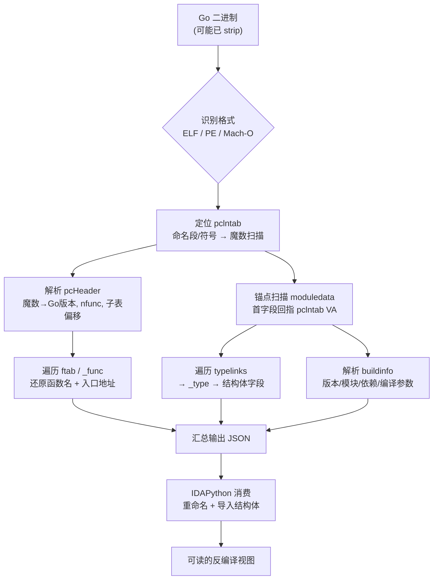
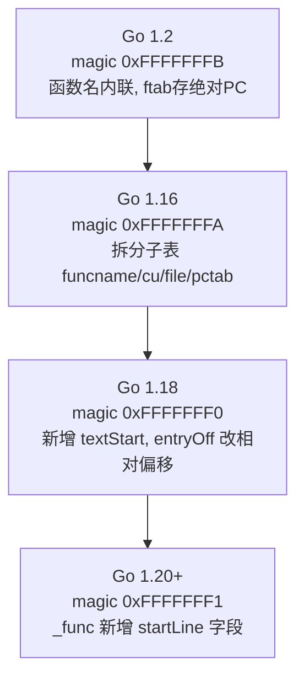
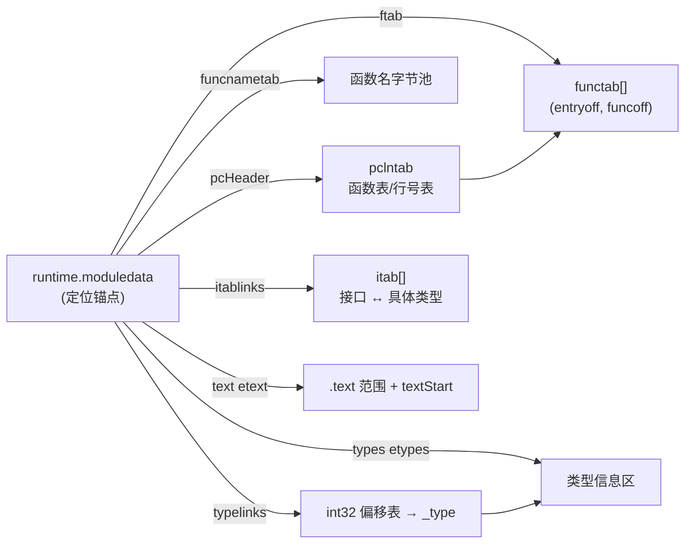

# Go与Rust现代二进制逆向（7）· Go逆向工具：GoReSym与IDA脚本
> [!abstract] TL;DR
> - Go 二进制"自描述"：运行时靠 `pclntab`/`moduledata` 做栈回溯与 GC 栈扫描，strip 不掉——这是一切符号恢复工具的地基与 ground truth，也是 Go 比 Rust 好恢复的根因。
> - GoReSym（Mandiant/FLARE）复用 Go 官方 `debug/gosym` 与 `runtime` 结构体做"进程外"解析，跨 Go 版本只需更新 vendored struct，比在反汇编器里手写偏移解析健壮得多。
> - 定位 `pclntab` 走"命名段/符号 → 魔数暴力扫描 + 合法性校验"两级；定位 `moduledata` 靠"首字段回指 pclntab"的锚点扫描 + 自洽性验证，二者是自动化的两个支点。
> - 结构体导入的关键是先合成 `go_slice`/`go_string`/`go_iface` 等 ABI 头类型，再把恢复出的字段布局作为 local types 灌进 IDA，让反编译器显示有意义的字段访问而非裸偏移。
> - 工具只还原"结构"不还原"语义"：Garble 混淆后地址/控制流仍在但函数名变哈希（见第 8 篇）；`buildinfo` 会泄露模块路径/用户名/私有仓库/编译参数，是归因金矿也是 OPSEC 事故。

## 概述与定位

Go 语言在勒索软件（Ekans/Snake、BianLian）、C2 框架（Sliver、Merlin）、跨平台后门中越来越常见，原因很朴素：一次编译、静态链接、无外部运行时依赖、天然多平台。分析者面对的往往是一个几 MB 到十几 MB、被 `-ldflags "-s -w"` 剥掉了标准符号表（ELF `.symtab`、PE COFF 符号）的单体二进制，反汇编器一进去就是上万个 `sub_xxxxxx`，其中真正属于恶意逻辑的用户函数淹没在成百上千个标准库函数里。手工从 `pclntab` 一格一格抠函数名、从 `typelinks` 一个一个还原结构体（也就是本系列第 3、4 篇讲的原理），对单个样本可行，但对批量分诊、对每周几十个样本的响应团队，纯手工不可持续。**本篇要解决的就是"把第 3～6 篇的手工原理工程化、自动化"这一步**：用工具在几秒内把函数名、类型、接口、编译元数据一次性抽出来，再把结果回灌进 IDA/Ghidra，让逆向从"先花两小时恢复符号"直接跳到"开始读业务逻辑"。

本篇的两大主角，一是 **GoReSym**——Mandiant（FLARE 团队）2022 年底开源的独立 Go 符号恢复器；二是围绕 **IDA** 的一组脚本生态（GoReSym 自带的 IDAPython 消费脚本、0xjiayu 的 `go_parser`、SentinelLabs 的 AlphaGolang、以及更早的 George Zaytsev `golang_loader_assist`）。二者代表了两种截然不同的工程哲学：GoReSym 把"解析"这件苦活放在**反汇编器之外**、用 Go 自己写、直接复用 Go 官方标准库里的 `debug/gosym` 与 `runtime` 结构体定义，产出一份平台无关的 JSON；IDA 脚本则要么**消费**这份 JSON 只做"落地"（重命名 + 建结构体），要么**在反汇编器内部原生解析**（`go_parser` 就是纯 IDAPython 一把梭）。理解这两条路线的取舍，是本篇的主线。

在系列中的坐标：本篇的输入是第 2 篇（Go 二进制结构与编译模型）给出的宏观布局，核心依赖第 3 篇（`pclntab` 与函数符号）、第 4 篇（类型系统元数据）、第 5 篇（字符串/切片/接口）、第 6 篇（运行时识别）建立的结构知识——本篇不再逐字节重推这些格式，而是讲"工具如何自动定位并批量解析它们、如何把结果稳定地灌进反汇编器"。其边界是第 8 篇：当样本用 Garble 混淆后，本篇这些工具会"结构还在、名字失真"，对抗手段留到第 8 篇。横向坐标上，Ghidra 自 11.0（2024）起内置了原生 Golang 分析器（`GolangSymbolAnalyzer`/`GoRttiMapper`），IDA 9.x、rizin/radare2 也都在补齐原生 Go 支持——但"独立解析器 + 脚本回灌"这套组合，因为可批量、可无头运行、可进 CI 流水线，在恶意样本分诊场景仍不可替代。

## 原理与机制

一切 Go 符号恢复工具能工作，都建立在同一个物理事实上：**Go 二进制是自描述的，而且这份自描述是运行时刚需、无法删除的**。这一点必须先讲透，因为它决定了工具的可靠性上限。C/C++ 里的调试符号（DWARF、`.symtab`）对程序运行完全不必要，strip 掉照样跑，所以剥离后信息是真的没了；而 Go 运行时在 panic 栈回溯、`runtime.Caller`、goroutine 抢占与栈扫描、垃圾回收识别栈上指针（通过 `funcdata` 里的 stackmap）、pprof 采样这些核心路径上，**必须**在运行时反查"某个 PC 属于哪个函数、该函数栈帧多大、哪些槽位是指针"。承载这些信息的就是 `pclntab`（program counter line table，符号里叫 `runtime.pclntab`）和以 `runtime.moduledata` 为根的一整套元数据。删掉它们，程序第一次 GC 或第一次 panic 就崩。于是 `-s -w` 这类 strip 只能删掉"额外的"标准符号表，动不了 `pclntab`——ground truth 被编译器焊死在二进制里，工具要做的只是"把运行时自己会走的那条反查路径，静态地复现一遍"。

在此基础上，几乎所有工具共享同一条流水线，差别只在实现语言和落地方式：



这条流水线有两个"支点"。第一个是 `pclntab`：它自带魔数（magic），能同时提供"这是不是 Go 二进制、是哪个 Go 大版本、有多少函数、各子表在哪"这几个关键锚。第二个是 `moduledata`：它是整套元数据的根指针，类型、接口表（itab）、`.text` 范围、编译信息全都从它出发可达。把这两个支点找到，剩下的就是按结构走指针。

这里就体现出 GoReSym 的关键设计判断：`pclntab`/`moduledata`/`_type` 这些结构的**字段布局随 Go 版本一直在变**（1.2、1.16、1.18、1.20 各有断层）。如果像 `go_parser` 那样在 IDAPython 里手写"偏移 +0x8 读指针、+0x10 读长度"，每逢 Go 升级都要人肉对照 runtime 源码改偏移，极易滞后、极易错。GoReSym 的做法是**直接 fork Go 标准库的 `debug/gosym` 并 vendored 进 runtime 里各版本的结构体定义**，用 Go 的类型系统去 cast 内存——Go 官方怎么定义，它就怎么读，版本适配退化成"更新 vendored struct"这种机械操作。这就是"进程外、复用官方代码"路线相对"进程内、手写解析"路线在**可维护性**上的根本优势，也是 GoReSym 能长期跟得上 Go 版本的原因。

## 结构与解析算法详解

本节把两个支点的自动定位与解析算法讲清楚——这是工具的核心，也是它们偶尔"失灵"时你能手工兜底的依据。

### pclntab 头与版本判定

`pclntab` 开头是一个 `pcHeader`（Go 1.16 起的新布局，1.18 又加了 `textStart`）：

```
type pcHeader struct {
    magic          uint32   // 0xFFFFFFF1(go1.20) / 0xFFFFFFF0(go1.18) ...
    pad1, pad2     uint8    // 恒 0，用作合法性校验
    minLC          uint8    // 指令最小长度: x86=1, arm64=4, wasm/mips=...
    ptrSize        uint8    // 指针宽度: 4 或 8
    nfunc          int      // 函数数量
    nfiles         uint     // 文件表条目数
    textStart      uintptr  // .text 基址 (go1.18 新增)
    funcnameOffset uintptr  // → funcnametab (函数名字节池)
    cuOffset       uintptr  // → cutab
    filetabOffset  uintptr  // → filetab
    pctabOffset    uintptr  // → pctab (变长 PC 增量编码)
    pclnOffset     uintptr  // → pclntab (_func 结构区)
}
```

魔数就是版本指纹，工具据此选用哪套结构体解析：



**定位 `pclntab` 是两级策略**。第一级"走捷径"：非 strip 的二进制里 ELF 有 `.gopclntab` 段、PE/Mach-O 有 `runtime.pclntab`/`runtime.epclntab` 符号，直接读符号即可。第二级"暴力扫"：strip 后段名/符号都没了，工具就在整个可读区间里滑窗找魔数字节序列（小端如 `F1 FF FF FF 00 00`），命中后立刻做**合法性校验**——`pad1==pad2==0`、`minLC ∈ {1,2,4}`、`ptrSize ∈ {4,8}`，再看 `nfunc` 是否在合理范围、各子表偏移是否落在文件内。为什么需要校验？因为魔数只有 4 字节，在几 MB 数据里纯属巧合撞上的概率不低，单靠魔数会误报；靠头部字段之间的强约束（几个恒定值 + 互相印证的偏移）把误报几乎压到零。这套"魔数 + 结构自洽"的思路，正是所有二进制模式识别工具的通用范式。

### 从 ftab/_func 还原函数名与地址

拿到头之后，`ftab`（function table）是一张 `functab` 数组，每个条目 `(entryoff, funcoff)`：前者定位函数入口，后者定位该函数的 `_func` 结构。遍历 `ftab` → 对每个 `_func` 读 `nameOff` → 到 `funcnametab` 字节池里取以 NUL 结尾的全限定名（如 `main.(*Server).handleConn`、`crypto/tls.(*Conn).Read`），函数名与入口地址就配齐了。

```
type _func struct {
    entryOff    uint32  // 入口 = textStart + entryOff  (go1.18+ 相对偏移!)
    nameOff     int32   // → funcnametab 中的函数名
    args        int32
    deferreturn uint32
    pcsp        uint32  // → pctab, 各 PC 处 SP delta(供栈回溯)
    pcfile      uint32
    pcln        uint32
    npcdata     uint32
    cuOffset    uint32
    startLine   int32   // go1.20 新增
    funcID      uint8   // 标识 runtime 特殊函数(如 gogo/mcall)
    flag        uint8
    _           [1]byte
    nfuncdata   uint8   // 之后跟 pcdata[] 与 funcdata[]
}
```

这里有个**必须踩准的陷阱：Go 1.18 把地址从绝对改成了相对**。1.18 以前 `ftab` 存的是绝对虚拟地址；1.18 起 `pcHeader` 多了 `textStart`，`ftab`/`_func` 里存的是相对 `textStart` 的偏移，真实入口要算 `textStart + entryOff`。这个改动是为了缩小表体积、并配合 PIE（位置无关可执行）——绝对地址在 PIE 下装载即失效，相对偏移天然可重定位。工具若版本判错、或误用了绝对地址逻辑去解 1.18+ 的表，会得到一批"看着像地址、其实差了一个基址"的错位函数，全盘偏移。批量样本里若发现"函数名对但都跳到错误地址"，第一反应就该是 textStart/版本没对上。

### moduledata 锚点扫描与类型/编译信息

`moduledata` 才是元数据总枢纽。非 strip 时有 `runtime.firstmoduledata` 符号可直接定位；strip 后要靠**锚点扫描**：



算法的巧妙在于：**`moduledata` 的第一个字段就是 `pcHeader *`，直接指向刚才已定位的 `pclntab` 虚拟地址**。于是把已知的 `pclntab` VA 当"钩子"，在 `.data`/`.noptrdata`/`.rodata`（PE 下对应可写/只读数据段）里按指针对齐扫描，找哪个位置存着"等于 pclntab VA 的指针"。命中候选后同样要**自洽性验证**：紧随其后的 `funcnametab`、`ftab` 是切片（三元组 `ptr,len,cap`），其 `ptr` 应落在合理区间、`ftab.len` 应与 `pcHeader.nfunc` 一致、`minpc/maxpc` 应落在 `.text` 内……多条约束交叉印证，锁定真正的 `moduledata`。因为字段布局随版本变，GoReSym 按前面判出的版本选对应 vendored `moduledata` 结构去 cast——这又一次体现"复用官方结构体"的价值。

拿到 `moduledata` 后：
- **类型恢复**：`types` 是类型区基址，`typelinks []int32` 每个元素是"相对 `types` 的偏移"，逐个算出 `_type` 地址。`_type`（新版 `abi.Type`）里 `kind` 低位标识种类（struct/ptr/slice/map/interface…），`str`（`nameOff`）指向名字。名字编码有个易错点：一个 name 是"1 字节标志 + 变长长度 + 字节串"，标志位里 `tflagExtraStar` 表示"真实类型名有个前导 `*` 但为省存储被剥掉了"，解析时要按标志补回，否则 `*main.Foo` 会被读成 `main.Foo`。对 `struct` kind，再 cast 成 `structType` 遍历 `fields []structField`，每个字段有名字、`*_type` 与偏移——这就是"结构体字段布局"的来源。方法集/接口（itab）还原细节属于第 4、5 篇，本篇只强调工具是从 `typelinks`/`itablinks` 自动枚举出这些的。
- **编译信息（buildinfo）**：这是恶意分析的高价值目标，位于一个以魔数 `\xff Go buildinf:` 开头的 blob：

```
0x00: FF 20 47 6F 20 62 75 69 6C 64 69 6E 66 3A   ; "\xff Go buildinf:"
0x0E: ptrSize (byte)                              ; 4 或 8
0x0F: flags   (byte)                              ; bit1=大小端; 0x02=新内联格式
;--- 旧格式(≤1.17): 0x10 起两个指针 → runtime.buildVersion, modinfo
;--- 新格式(1.18+): 变长编码内联 version 字符串 + modinfo
```

`modinfo` 是 `runtime/debug.ReadBuildInfo` 那套：主模块路径、每个依赖的 `path@version` 与内容哈希、以及 build settings（`GOOS/GOARCH`、`-ldflags`、`vcs.revision` 提交哈希、`vcs.time`、`-trimpath` 与否）。工具把它整块解出来。命令行上 `go version -m ./sample` 也能读大部分，`strings | grep 'go1\.'` 能粗定版本，但工具化解析更完整、更适合批处理。

## 工具视角与实战

### GoReSym：无头解析产出 JSON

典型用法是把一切能抽的都抽出来：

```bash
# 常用参数(以实际版本 help 为准): -t 类型, -d 含标准库, -p 打印pclntab元信息
GoReSym -t -d -p ./sample.exe > goresym.json
# 自动定位失败时手工指定 moduledata 地址(打包/内存 dump 场景常用)
GoReSym -m 0xC12340 ./sample.exe > goresym.json
```

产出 JSON 的代表性字段：`Version`（Go 版本）、`BuildInfo`（模块与依赖）、`OS`/`Arch`、`TabMeta`（pclntab VA/版本/魔数）、`ModuleMeta`、`Types`/`Interfaces`、以及最关键的 `UserFunctions` 与 `StdFunctions`（各带 `Start` 地址与 `FullName`）。把用户函数与标准库函数**分开**是刻意设计：分诊时你只关心 `UserFunctions`，能瞬间把几百个业务函数从上万个 runtime/stdlib 里择出来。因为 GoReSym 是 Go 写的无头程序，它天然适合塞进流水线——对一整个样本目录循环跑、把 `BuildInfo.Path` 抽出来做归因聚类、把 Go 版本做统计，都只是 shell 循环的事。

### IDAPython 落地：重命名 + 结构体导入

拿到 JSON 后，反汇编器里的落地分两步。**第一步重命名函数**，把 `Start→FullName` 灌进去：

```python
import json, ida_name
data = json.load(open("goresym.json"))
def sanitize(n):                      # IDA 名字不接受 . / ( ) 空格等
    for a, b in [(".", "_"), ("/", "_"), ("*", "ptr"),
                 ("(", ""), (")", ""), ("[", ""), ("]", ""), (" ", "")]:
        n = n.replace(a, b)
    return n
for fn in data["UserFunctions"] + data["StdFunctions"]:
    ida_name.set_name(fn["Start"], sanitize(fn["FullName"]),
                      ida_name.SN_NOWARN | ida_name.SN_FORCE)
```

这里的坑是**名字合法性**：Go 全限定名里的 `.`、`/`、`(*T)` 在 IDA 标识符里非法，必须做字符替换或加 `SN_FORCE` 强制。各脚本的替换约定不同（有的把 `main.(*Foo).Bar` 转成 `main__ptr_Foo__Bar`），逆向时要知道"下划线是被替换过的分隔符"，别当成原名。

**第二步是本篇种子点"结构体导入"**——只重命名函数，反编译器看结构体访问仍是 `*(v + 0x18)` 这种裸偏移；要让它显示 `conn->fd`，必须把 Go 结构体作为 **local types** 建进 IDA 的类型库（til）。关键前置是**先合成 Go ABI 头类型**：Go 的切片是 `{ptr,len,cap}`（64 位下 24 字节）、字符串是 `{ptr,len}`（16 字节）、接口是 `{itab*,data*}`/`{_type*,data*}`（16 字节）、map 是指向 `hmap` 的指针——不先把这些"复合基元"建好，用户结构体里对切片/字符串字段的建模就会错位。

```python
import idc
# 1) 先注入 Go ABI 头类型(所有结构体都会引用它们)
idc.parse_decls('''
struct go_string { const char *ptr; __int64 len; };
struct go_slice  { void *ptr; __int64 len; __int64 cap; };
struct go_iface  { void *tab;  void *data; };   // 非空接口
struct go_eface  { void *type; void *data; };   // interface{}
''', 0)
# 2) 把 GoReSym 的 Types 逐个转成 C 声明再注入
for t in data.get("Types", []):
    c_decl = gen_c_struct(t)          # 按字段名/类型/偏移合成 C struct 文本
    idc.parse_decls(c_decl, 0)
# 3) 对已知类型的全局/局部变量应用该结构体, 反编译即显示字段名
```

字段偏移必须与 Go 的自然对齐一致，`gen_c_struct` 要按 Go 的对齐规则补 padding，否则字段会错位。`go_parser` 的价值就在于它把"合成 Go 标准头类型 + 逐结构体建 til + 应用到数据"这套自动化好了，纯 IDAPython 一键完成，不需要外部 JSON。

### 生态横向对比与实战流程

- **GoReSym + 消费脚本**：解析健壮、可批处理、跨反汇编器（同一份 JSON 喂 IDA/Ghidra/BN 都行），代价是两步走、要写/用消费脚本。
- **go_parser（0xjiayu）**：纯 IDAPython 一把梭，pclntab/moduledata/类型/字符串恢复全包，上手最快；但解析逻辑内嵌在脚本里，遇到很新的 Go 版本可能滞后、需自行改偏移。
- **AlphaGolang（SentinelLabs, JAGS）**：模块化 IDAPython"hunks"，教学与可读性导向，建立在 Zaytsev `golang_loader_assist` 之上，适合学习每一步在做什么。
- **Ghidra 11+ 原生 / IDA 9.x 原生 / rizin**：反汇编器自带 Go 分析，装载即自动恢复，日常一般样本最省事；但可定制性、批处理、对畸形/打包样本的容错，往往不如独立工具 + 手工兜底。

一个真实的 strip 样本分诊流程：先 `go version -m` 或 `strings|grep go1.` 判 Go 版本与是否 CGO；GoReSym 抽 JSON，先看 `BuildInfo` 做归因、看 `UserFunctions` 数量与命名判断是否被混淆；IDA 载入、跑消费脚本重命名 + 导入结构体；从 `main.main` 与用户函数入口开始读逻辑。若 GoReSym 自动定位失败（多见于加壳后落盘的样本），说明 `pclntab` 在磁盘上是被压缩/加密的，需先脱壳或**从内存 dump** 出解密后的镜像再喂工具，或用 `-m` 手工指定内存里 `moduledata` 的地址。CGO 样本要记得：`pclntab` 只覆盖 Go 侧函数，C 侧仍是普通 native 代码，别指望工具还原 C 部分。

## 安全性与正确使用

**静态解析本身是安全的，但你手里是活体恶意样本。** GoReSym 只读文件、不执行样本，IDA 静态分析也不执行代码——这条主路径不会引爆载荷。但风险在旁路：解析器（GoReSym 是 Go 写的、要吃攻击者可控的畸形二进制）本身可能有解析漏洞，IDA 的第三方 loader/插件历史上也出过内存破坏 bug；因此**分析环境应隔离在专用虚拟机/沙箱**，样本文件不要在生产机直接双击、不要让工具链有外联能力。分析未知来源的逆向脚本/插件同理要在隔离环境跑。

**`buildinfo` 是双刃剑，务必意识到它的信息泄露面。** 对防御方，它是归因金矿：主模块路径常含开发者用户名或私有仓库地址（`github.com/<某账号>/<内部项目>`）、依赖清单可做家族聚类与供应链审计、`vcs.revision`/`vcs.time` 能关联到具体提交、`-ldflags` 里可能残留内网主机名或密钥常量。反过来，对**发布合法 Go 软件的开发者**，这意味着默认编译就会把这些泄进公开二进制——正确加固是用 `-trimpath` 去掉本地绝对路径、用 `-ldflags "-s -w"` 去符号、用 `-buildvcs=false` 关掉 VCS 注入、必要时用 Garble（第 8 篇）进一步剥离 `buildinfo` 与函数名。要清楚：`-s -w` 删不掉 `pclntab`，函数名该恢复还是能恢复，真想抹掉名字得靠混淆，这是 strip 的能力边界。

**正确性上，恢复出的名字/类型是"高置信但非绝对"，尤其对被篡改/混淆样本。** 别把工具输出当成 100% 可信的地面真值：`moduledata` 锚点扫描存在误报可能（多个候选时要看工具是否做了完整自洽校验），版本判错会导致地址整体错位（前述 textStart 陷阱），Garble `-tiny` 会把函数名换成哈希、`-literals` 会加密字符串——此时工具照样能"成功"输出，但 `FullName` 已是无意义哈希，若不结合"名字是否像正常包路径"来判断，会被误导。稳妥做法是交叉印证：GoReSym 与 `go_parser` 结果对比、函数数量与命名分布是否异常、`buildinfo` 是否被清空（清空本身就是混淆信号）。工具的定位是**把人从机械劳动里解放出来、给出高质量起点**，而非替代分析者对结果的批判性核验——这条边界在任何自动化逆向工具上都成立。

## 小结

Go 符号恢复能高度自动化，根子是"运行时刚需的 `pclntab`/`moduledata` 无法 strip"这一自描述事实。工具沿"定位 `pclntab`（命名段/符号 → 魔数扫描 + 校验）→ 遍历 `ftab`/`_func` 还原函数 → 锚点扫描 `moduledata`（首字段回指 pclntab）→ 遍历 `typelinks`/`buildinfo` 还原类型与编译信息"这条统一流水线工作。GoReSym 用"进程外、复用 Go 官方结构体"换来跨版本的可维护性并产出平台无关 JSON；IDA 脚本负责落地——重命名函数、以及本篇重点的"先合成 `go_slice`/`go_string`/`go_iface` 头类型、再把恢复的字段布局作为 local types 导入"从而让反编译器显示有意义的结构体访问。要牢记版本断层（1.18 的 textStart 相对偏移、1.16 的子表拆分）、脱壳/内存 dump 前提、以及"工具只还原结构不还原语义"的边界——名字失真意味着混淆，正是下一篇 Garble 的战场。

## 相关阅读

- 本系列：[[00.Go与Rust现代二进制逆向总览]] · [[03.gopclntab与函数符号恢复]]（本篇自动化所依赖的 pclntab 格式原理）· [[04.Go类型系统元数据恢复]]（`_type`/结构体/itab 的逐字节还原）· [[05.Go字符串与切片与接口还原]]（结构体导入需合成的 ABI 头类型）· [[06.Goroutine调度与运行时识别|← 上一章]] · [[08.Go混淆对抗：Garble|→ 下一章]]（本篇工具被击败之后）
- ABI 承接：[[23.C_C++运行时与ABI/01.运行时与ABI概览]] · [[22.调用规约/06.SystemV_AMD64调用规约]]（切片/接口头在寄存器与栈上的传递）
- iOS 同族对照：[[36.Objective-C与iOS运行时/01.Objective-C运行时概览]]（Swift/OC 元数据与 Go typelinks 的可对照性）
- 应用场景：[[50.恶意代码分析与免杀对抗/00.恶意代码分析与免杀对抗总览]]（Go 恶意样本的分诊与归因）
- 官方与工具：GoReSym 仓库与 Mandiant 博客《GoReSym: A Go Symbol Recovery Tool》· Go 标准库 `debug/gosym`、`runtime/debug.ReadBuildInfo` 文档 · `go_parser`（github.com/0xjiayu/go_parser）· AlphaGolang（github.com/SentinelLabs/AlphaGolang）· George Zaytsev `golang_loader_assist` · Ghidra 11 Golang 分析器文档 · Go 运行时 `runtime/symtab.go`、`runtime/type.go` 源码

[[00.Go与Rust现代二进制逆向总览|⬆ 系列总览]] | [[06.Goroutine调度与运行时识别|← 上一章]] | [[08.Go混淆对抗：Garble|→ 下一章]]
